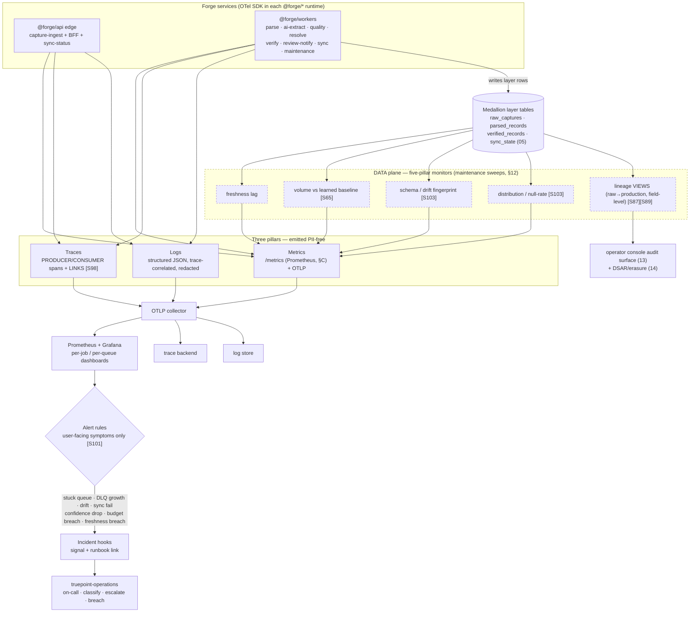
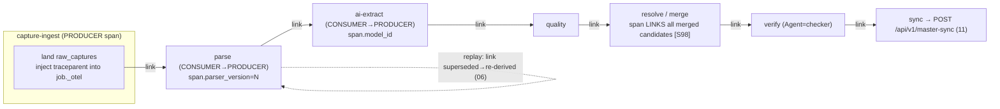

# 15 — Observability (Logging, Metrics, Monitoring)

> **Canonical contract:** TruePoint Forge instruments its pipeline with the **three OpenTelemetry
> pillars** — **structured logs, metrics, traces** — across **two complementary planes**: a
> **SYSTEM plane** ("are the services and queues up and fast?") that reuses TruePoint's shipped
> zero-dependency Prometheus **`/metrics`** posture (ecosystem-facts §C), and a **DATA plane**
> ("is the data fresh, complete, and correct?") built as **five monitors — freshness · volume ·
> schema · distribution · lineage — applied per medallion layer** (`raw_captures → parsed_records →
> verified_records → (sync) → TruePoint master graph`) [S96][S64]. Every signal — log line, metric
> label, trace attribute, DLQ descriptor — is **PII-free by construction** (the shipped
> `deadLetter.ts` PII RULE, §C). A single **trace follows a record across the async worker fan-out**
> via W3C `traceparent` injected into the job payload and **span *links*, not parent-child** [S97][S98].
> Alerts fire on **user-facing symptoms** (backlog growth, missing/stale data, retry-exhaustion), never
> every internal fluctuation [S101][S102]. **Lineage & provenance are exposed as queryable VIEWS**
> (raw→production, field-level) over the columns `05-database-design` owns. This doc owns the
> **metric / SLI / trace / lineage-view definitions and the alert-trigger catalog**; it **defers** the
> human incident process, on-call, and breach notification to **`truepoint-operations`**, capacity
> N-values + KEDA topology to the deployment & scalability doc, the tamper-evident audit *chain* to
> `05 §Group 11` (audit tables), and all table/column DDL to `05`. **Locking ADR: ADR-0047** (Forge owns ER +
> versioned master-sync); the interception-primary capture that feeds the pipeline is **ADR-0046**.

This doc is the **owner of the deep detail** for observability *definitions*. It does **not** restate the
per-stage input/output/quarantine contracts or the record state machine (owned by `06-data-pipeline-
architecture`), the queue/DLQ/retry mechanics or the autoscaling *signal* (owned by `12-queue-and-worker-
architecture`), the `/master-sync` wire shape or reconciliation-checksum design (owned by `11-database-
synchronization-engine`), the schema-drift *detection* design (owned by `06 §Schema-drift`), the DAMA
quality-rule catalog (owned by `05 §Group 5` + `06 §Data-quality gates`), the dashboard rendering (owned by
`13-frontend-dashboard-design`), the KMS/DB-role enforcement (owned by `14-security-and-access-control`),
or the capacity math / compute topology (owned by the deployment & scalability doc). Current-state
TruePoint facts cite `_context/ecosystem-facts.md` by `§`; best-practice claims cite `[S#]` in
`_context/research-corpus.md`; frozen vocabulary is `_context/decision-ledger.md` (L1–L11).

> **Numbering note.** Provisional ownership maps in `02`/`03` label the observability surface
> `13-observability` and `06`/`12` cross-link it as "`15 — observability & lineage`"; the settled suite
> numbering places the **operator console at `13`** and these **metric/SLI/trace/lineage-view
> definitions at `15`** (this doc). The **tamper-evident audit chain + record-history read model**
> (`05 §Group 11`, audit tables) and the **deployment/scalability capacity owner** (`16`/`17`) are
> separately owned; where a cross-link's number is not yet stable, the **topic owner named here is
> unambiguous** and the Stage-8 consistency pass reconciles the digits.

---

## Objectives

1. Wire the **three OpenTelemetry pillars** — structured logs, metrics, traces — as one vendor-neutral
   OTLP-exportable seam over `@forge/api` (edge) and `@forge/workers`, **reusing** TruePoint's shipped
   `/metrics` / `instrument()` / `health.ts` platform rather than reinventing it (§C).
2. Separate and build **both observability planes**: the **system plane** (queues, latency, error rate,
   dependency health) and the **data plane** (five-pillar freshness/volume/schema/distribution/lineage
   monitors per medallion layer) — contracts prevent structural breaks, observability catches drift; run
   both [S96][S64][S70].
3. Define the **pipeline SLOs + freshness/lag SLIs per stage**, building on the SLO *shapes* fixed in
   `06 §Per-stage SLOs` (this doc owns the *measurement + alert*, `06` owns the shape, the scalability doc
   owns the N-values).
4. Specify **per-job & per-queue dashboards** (Prometheus/Grafana) sourced from the shipped `/metrics`
   exporter, and the **distributed tracing** design that propagates trace context through BullMQ so a
   single record's parse→extract→resolve→verify→sync journey is one correlated trace [S97][S98][S99][S101].
5. Publish the **metrics catalog** (metric · type · labels · alert threshold) and the **alert & runbook
   trigger catalog** (stuck queues, DLQ growth, parser drift, sync failures, extraction-confidence drop,
   budget breach, freshness breach, reconciliation drift) — deferring the human response process to
   `truepoint-operations`.
6. Define the **lineage & provenance VIEWS** (raw→production, field-level) as observability read-models
   over `05`'s columns, the **log PII-redaction** rule, and the **incident hooks** that emit a signal +
   runbook link into the operations process.
7. Register the observability gaps (`G-FORGE-1501…1508`), risks, milestones, deliverables, and open questions.

Non-goals: schema/DDL (`05`), drift-*detection* algorithm + quarantine lanes (`06`), queue/DLQ *mechanics*
(`12`), sync wire contract + reconciliation *checksum* (`11`), quality-rule *catalog* (`05`+`06`), dashboard
*rendering* (`13`), KMS/DB-role *enforcement* (`14`), tamper-evident audit *chain* (`05 §Group 11`),
capacity N-values / KEDA topology / collector-backend sizing (deployment & scalability doc), and the human
incident/on-call/breach/FinOps process (`truepoint-operations`).

---

## Industry practice (cited)

| Principle | What it means for Forge | Source |
|---|---|---|
| **System observability ≠ data observability; run both** | The three-pillar service view (metrics/traces/logs) is complementary to the five-pillar data view (freshness/volume/schema/distribution/lineage); teams with hundreds of tests still miss failures without the data plane. | [S96][S64][S103] (high) |
| **Freshness is a latency-percentile SLO** | "95% of X reaches layer Y within N" is the honest, measurable form of "the pipeline is keeping up" — a per-layer template for raw→parsed→verified→synced lag. | [S64] (medium) |
| **Message queues break OTel auto-propagation** | The producer must inject the W3C `traceparent` into the job payload and the consumer extract it, or the trace is lost across async workers. | [S97] (high) |
| **Fan-out uses span LINKS, not parent-child** | A span can have only one parent, so batch/fan-out producer↔consumer correlation uses links; Forge's parse→extract→merge→sync fan-out is exactly this shape. | [S98] (high) |
| **Span kinds by role** | PRODUCER for the enqueue/send, CONSUMER for receive/process, with the producer injecting creation context into the message carrier. | [S98] (high) |
| **Batch trace propagation is manual + vendor-specific** | Inject context into a carrier map alongside the payload; the manual API is poorly documented, so budget engineering time and favor vendor-neutral OTLP export to avoid lock-in. | [S99] (medium) |
| **Queue depth is a first-class health signal** | Monitor BullMQ via Prometheus/Grafana for queue size, wait time, p95/p99 duration, failed-job counts, retry histograms sized to SLO buckets. | [S101] (high) |
| **Alert on retry-exhaustion, not transient blips** | Page when a job exhausts all retries (DLQ arrival), not on each transient failure — otherwise alert fatigue. | [S102] (medium) |
| **Alert on user-facing symptoms** | SRE guidance: alert on latency / backlog / missing data, not every internal cause, to keep volume actionable — doubly true on high-variance interception ingest. | [S101][S100] (medium/low-contested) |
| **Learned baselines catch "unknown unknowns"** | ML per-table models predict next-commit time (freshness) and expected row-count range (volume), flagging out-of-bounds tables with data-driven thresholds; a "Training" warm-up state for new tables is a real design consideration. | [S64][S65][S71] (high) |
| **Fully-automatic monitors over-alert** | Broad automatic coverage produces high alert volume that must be tuned; a curated check catalog + adaptive thresholds beats fully-automatic breadth. | [S100] (low-contested) |
| **Schema+distribution monitors catch parser drift** | Structural/out-of-range/null shifts are exactly what a private-API change + drifting versioned parser produces; keying monitors to `parser_version` + raw-response fingerprint is the detection primitive. | [S103] (medium) |
| **Field-level lineage is a standard schema** | OpenLineage ColumnLineage records per-output-column `inputFields` + `transformations` + a `masking` boolean; W3C PROV `hadPrimarySource` maps a verified field to the intercepted raw. Both degrade gracefully. | [S87][S89] (high) |
| **Append-only ≠ tamper-evident** | Hash-chaining / Merkle trees make a log tamper-evident **only if the root is externally anchored**; the anchoring mechanism is a design decision, not free. | [S91] (high) |

---

## Current-state — what already exists in TruePoint (cite ecosystem-facts §C)

Forge does **not** build an observability platform from scratch. TruePoint ships a hardened telemetry seam
in `apps/workers/src` and the admin probes that Forge's `@forge/*` mirrors module-for-module:

| TruePoint module (§C) | What it does today | Forge reuses / extends it as |
|---|---|---|
| `metrics.ts` — zero-dep Prometheus `/metrics` | per-queue counters + **live queue depth** + **outbox lag** (`leadwolf_worker_queue_jobs{queue,state}`, `…_outbox_oldest_pending_seconds`) | `@forge/workers` `/metrics` with `forge_*`-prefixed analogues; the **only new work is the OTel traces + logs pillars + the data plane** |
| `register.ts` `instrument()` | wraps every `Worker` in metric counters + `completed`/`failed` listeners | Forge `instrument()` also starts a **CONSUMER span** per job (`§Distributed tracing`) |
| `deadLetter.ts` — **PII-free DLQ** | records scope UUIDs + job id/name + reason + attempt count, **never `job.data`** | the **PII-redaction rule generalizes to all three pillars** — logs, labels, trace attributes copy the same allow-list (`§Log PII-redaction`) |
| `health.ts` / `index.ts` | `/ready` bounded Redis PING; 30 s bounded graceful drain; `/metrics` mount | Forge worker/edge process entry; `/ready` + `/live` probes feed the system-plane up/down signal |
| `packages/types/src/workerQueues.ts` | queue-name vocabulary + `<queue>-dlq` twins so the admin health probe reads live depth | `@forge/types` Forge queue-name module → the metric `queue` label set |
| admin `queueProbes.ts` / `systemHealthProbes.ts` | BFF data source behind the admin Overview/health screens | Forge's console (`13`) consumes **Forge-side** probes over the BFF; `13` renders, **this doc defines the metrics they read** |

Three shipped facts are load-bearing here:

- **`/metrics` labels are already PII-free** — the shipped label rule is "queue names + states only" (§C).
  Forge inherits it verbatim: **no metric label ever carries an email, phone, or raw payload fragment.**
- **Outbox lag is already a first-class gauge** (`…_outbox_oldest_pending_seconds`, §C) — Forge's
  **sync-freshness SLI** is this metric, not a new invention (`§Pipeline SLOs`).
- **TruePoint has metrics + health but no traces and no data plane.** The three-pillar OTel wiring
  (traces, structured-log correlation) and the **entire five-pillar data plane** are net-new for Forge —
  the gap this doc closes (**G-FORGE-1501**, **G-FORGE-1503**).

The AI seam already meters spend to `ai_requests` (`schema/aiRequests.ts`, §C) and `provider_calls.cost_micros`
/ `credit_ledger` (§C); Forge's **budget-breach** monitor reads the `@forge` analogue of these, not a new
counter (`§Metrics catalog`, `§Alerting`).

---

## Design

### The two planes + three pillars

Observability splits along an axis the pipeline makes unavoidable: the **system plane** answers "is the
*machine* healthy?" (queues draining, latency within budget, dependencies up), and the **data plane**
answers "is the *data* healthy?" (fresh, complete, structurally sound, in-distribution, traceable). They
fail independently — a perfectly healthy worker fleet can quietly emit garbage after a Voyager schema
change, and a stuck queue can hold pristine data hostage — so Forge instruments **both**, and each of the
three OTel pillars carries part of each plane [S96][S64].

| Pillar | System-plane role | Data-plane role | Substrate |
|---|---|---|---|
| **Metrics** | queue depth, job duration/wait, error/retry rate, DLQ depth, outbox lag, pool/Redis health, AI spend | freshness lag, row-count vs learned baseline, drift-event rate, null-rate/distribution, quality score, quarantine rate, reconciliation drift | Prometheus `/metrics` (§C) + optional OTLP metric export |
| **Traces** | per-request span (edge), per-job CONSUMER span, cross-stage span **links** | a record's raw→verified journey as one linked trace, each span tagged `parser_version` / `model_id` / stage | OTel SDK → OTLP → trace backend |
| **Logs** | structured JSON, `trace_id`/`span_id` correlation, level, stage, outcome | drift reasons, quarantine reasons, approval decisions (identity of maker/checker), sync failures — **all PII-redacted** | structured logger → OTLP/stdout → log store |

The wiring is **OTel SDK in each `@forge/*` runtime → OTLP exporter → a collector**, so metrics keep
flowing to Prometheus/Grafana (reusing `/metrics`) while traces and logs go to their backends without
vendor lock-in [S99]. The **collector/backend substrate choice** (self-hosted Grafana LGTM stack vs a
managed vendor) and its sizing are a deployment concern deferred to the scalability doc; this doc fixes
only that the **emit side is OTLP-native and PII-free**.

### Pipeline SLOs + freshness/lag SLIs per stage

`06 §Per-stage SLOs` fixes the **SLO shapes**; the scalability doc fixes the **N-values under peak load**;
**this doc owns the SLI — the exact metric each SLO is measured against — and the alert wiring.** A
freshness SLO is a **latency-percentile budget** ("95% of records reach layer Y within N") measured as the
timestamp delta between adjacent layer rows [S64]; a queue SLO is depth/wait/duration against a bucketed
threshold [S101].

| Stage hop (`06`) | SLI (measured) | Source metric (`§Catalog`) | SLO shape (owner) | Alert condition |
|---|---|---|---|---|
| capture → landed (S0) | edge ack p95 | `forge_http_request_duration_seconds{route="capture"}` | ack **< 300 ms p95** (`06 §NFR-03`) | p95 > budget 5 min |
| landed → parsed (S1) | 95th-pct raw→parsed lag | `forge_layer_freshness_seconds{layer="parsed"}` + `forge_worker_queue_jobs{queue="parse"}` | 95% within N min (`06`, N by scalability) | freshness breach OR sustained backlog |
| parsed → extracted (S2) | 95th-pct parsed→extracted lag | `forge_layer_freshness_seconds{layer="extracted"}`; `lockDuration` headroom | 95% within N min (looser — Claude-bound) | freshness breach; stall-margin < 20% |
| extracted → verified (S3–S6) | grey-zone review-queue **age** (human-bounded) | `forge_review_queue_age_seconds` | median tracked, **not a hard SLO** (`10`) | p90 age > escalation threshold |
| verified → synced (S7–S8) | outbox lag + push p95 | `forge_outbox_oldest_pending_seconds` (§C) + `forge_http_request_duration_seconds{route="master-sync"}` | 95% synced within N min; **not fire-and-forget** | outbox lag > SLO OR sync-DLQ arrival |
| volume (all layers) | row-count vs learned per-table baseline | `forge_layer_row_count{layer}` | within learned band; **"Training"** warm-up for new tables [S65] | out-of-band drop (millions→thousands) |

The SLO **error budget** is what drives the symptom-first alert policy: a freshness breach, backlog growth,
or a volume anomaly is user-facing and pages; an individual transient job failure is not (`§Alerting`)
[S101][S102]. Because interception ingest is inherently high-variance, learned baselines **will** over-alert
unless tuned to these symptoms — the concrete tuning task is **OQ-R20** [S100][S101].

### Per-job & per-queue dashboards (Prometheus / Grafana)

Dashboards read the **same `/metrics` numbers the autoscaler and the SLO alerts read** (`12 §Autoscaling`),
so there is one source of truth for "how is the pipeline doing." Three standard boards, all sourced from
the shipped exporter (§C) and rendered by `13` (`StatTile` / `DataTable` / `MedallionFunnel`):

| Board | Panels | Primary metrics |
|---|---|---|
| **Queue health (per queue)** | depth by state, wait p95, duration p50/p95/p99, failed rate, retry histogram, DLQ depth + oldest-age | `forge_worker_queue_jobs`, `forge_worker_job_wait_seconds`, `forge_worker_job_duration_seconds`, `forge_worker_jobs_failed_total`, `forge_dlq_depth`, `forge_dlq_oldest_age_seconds` |
| **Pipeline / job flow (per stage)** | medallion funnel (rows per layer), per-stage freshness lag, quarantine rate, throughput | `forge_layer_row_count`, `forge_layer_freshness_seconds`, `forge_quarantine_rate` |
| **Egress / sync** | outbox depth + lag, sync push p95, sync_state breakdown, reconciliation drift | `forge_outbox_pending_rows`, `forge_outbox_oldest_pending_seconds`, `forge_sync_state`, `forge_reconciliation_drift_rows` |

The `ai-extract` **spend path** gets its own row on the pipeline board — cost-per-day, tokens, and the
budget-lease headroom — because it is the one queue where a scaling mistake costs money (`12 §Concurrency`,
the `enrichment` F3 analogue, §C). Histogram bucket boundaries are **sized to the SLO** (e.g. parse-duration
buckets straddle the freshness-SLO N) so a dashboard read maps directly to a budget-burn read [S101].

### Distributed tracing across async workers

A record does not flow through one process — it hops `capture-ingest → parse → ai-extract → quality →
resolve → verify → sync` across separate BullMQ workers, and **BullMQ (like every broker) breaks OTel's
automatic context propagation** [S97]. Forge restores an end-to-end trace with the standard messaging
pattern:

- **Producer injects context.** On every `add`, the producing code injects the W3C `traceparent` into a
  dedicated **carrier field on the job payload** (`_otel: { traceparent, tracestate }`) and opens a
  **PRODUCER** span [S98][S99]. The carrier is trace metadata, **not PII** — it coexists with the PII-free
  `jobId` rule (`12 §Effectively-once`).
- **Consumer extracts + continues.** `instrument()` (the shipped wrapper, §C) extracts the carrier and
  opens a **CONSUMER** span for the job, tagged `stage`, `parser_version`, `extract_schema_ver`/`model_id`,
  and `record_id` — never a raw field value.
- **Fan-out uses span LINKS, not parent-child.** One `raw_captures` row fans out to ≥1 `parsed_records`,
  and `resolve` **merges** many candidates into one golden record — a span can have only one parent, so the
  correlation is **links** [S98]. The merge span links every contributing candidate's span; the replay
  edge links the superseded version's span to the re-derived one (`06 §Versioned parsing`).

Two honest caveats carried from research: the **manual propagation API is poorly documented and
vendor-specific**, so Forge budgets engineering time for it and keeps the exporter **OTLP-native** to avoid
lock-in [S99]; and per-call abort/timeout spans (the vendor read that hangs) come from the **circuit
breakers in `07-raw-api-processing` / `09-ai-extraction`**, not from the coarse per-processor deadline
(`12 §Concurrency`) — tracing shows *where* a record stalled, the breakers *stop* it.

### The metrics catalog

Two tables — **system plane** and **data plane** — enumerate every metric, its type, its labels, and the
alert threshold. Metric names mirror the shipped `leadwolf_*` convention (§C) under a `forge_` prefix.
**Label cardinality is bounded**: labels are drawn from closed sets (queue name, stage, layer, state,
reason enum, `parser_version`, `model_id`) — **never** an unbounded value like a record id, email, or raw
field (the `/metrics` PII + cardinality rule, §C).

**System plane**

| Metric | Type | Labels | Alert threshold / SLO |
|---|---|---|---|
| `forge_worker_queue_jobs` | gauge | `queue`, `state`{wait,active,completed,failed,delayed} | sustained `wait` growth ≥ N over M min → backlog symptom |
| `forge_worker_job_wait_seconds` | histogram | `queue` | p95 wait > stage freshness budget |
| `forge_worker_job_duration_seconds` | histogram | `queue` | p99 approaching `lockDuration` (stall risk) |
| `forge_worker_jobs_failed_total` | counter | `queue`, `reason` | rate spike (secondary; DLQ is the page) |
| `forge_worker_job_retries_total` | counter | `queue` | informational (backoff health) |
| `forge_dlq_depth` | gauge | `queue` | **> 0 sustained → page** [S102] |
| `forge_dlq_oldest_age_seconds` | gauge | `queue` | age > N (the `forge-dlq-age-sweep`, `12`) |
| `forge_outbox_pending_rows` | gauge | — | growth without drain → relay stalled |
| `forge_outbox_oldest_pending_seconds` (§C) | gauge | — | > sync-freshness SLO → **page** |
| `forge_http_request_duration_seconds` | histogram | `route`, `method`, `status` | capture p95 > 300 ms; master-sync p95 > budget |
| `forge_ai_extract_cost_micros_total` | counter | `model` | **daily budget breach → page** (FinOps, `truepoint-operations`) |
| `forge_ai_extract_tokens_total` | counter | `model`, `kind`{input,output} | informational (cost forecast) |
| `forge_db_pool_in_use` / `forge_redis_up` | gauge | `role` / — | pool saturation; Redis down = bus down |
| `forge_build_info` | gauge | `version`, `parser_bundle` | deploy marker (annotate dashboards) |

**Data plane** (five pillars, per medallion layer)

| Metric | Type | Labels | Pillar | Alert threshold |
|---|---|---|---|---|
| `forge_layer_freshness_seconds` | gauge | `layer`{parsed,extracted,verified,synced} | Freshness | > per-layer freshness SLO N |
| `forge_layer_row_count` | gauge | `layer` | Volume | outside learned band; "Training" for new tables [S65] |
| `forge_schema_drift_events_total` | counter | `endpoint`, `parser_version`, `reason`{new_field,removed_field,type_change} | Schema | any drift **blocking promotion**; rate spike |
| `forge_parser_field_null_rate` | gauge | `parser_version`, `field` | Distribution | null-rate step-change vs baseline [S103] |
| `forge_quality_score` | gauge | `layer`, `dimension`{accuracy,completeness,consistency,timeliness,validity,uniqueness} | (DQ) | weighted composite below promotion gate (`10`) |
| `forge_quarantine_rate` | gauge | `stage`, `reason` | Schema/Dist | quarantine-rate spike (user-facing) |
| `forge_extract_confidence` | histogram | `extract_schema_ver`, `model_id` | (DQ) | **mean/ p50 drop below auto-approve floor** (OQ-R13) [S49] |
| `forge_reconciliation_drift_rows` | gauge | — | Lineage/Recon | **> 0 → page** (Forge↔CRM, `11`) [S25] |
| `forge_sync_state` | gauge | `state`{pending,synced,failed,superseded} | (flow) | `failed` growth; `pending` stall |
| `forge_review_queue_age_seconds` | gauge | `queue`{grey_zone,quarantine} | (flow) | p90 age > escalation threshold |

> **Build-vs-buy.** Learned-baseline freshness/volume/null anomaly detection is now commodity (Monte
> Carlo/Bigeye/Databricks/AWS Glue), but **none natively understands Forge's raw-response → `parser_version`
> drift** — so `forge_schema_drift_events_total` and `forge_parser_field_null_rate` are **Forge-owned
> monitors keyed to `parser_version` + the raw-response fingerprint** (`06 §Schema-drift`), whether or not a
> commodity tool covers the generic pillars. This is **OQ-R9** [S64][S100][S71][S103].

### Alerting & runbook triggers

Every alert obeys one rule: **fire on a user-facing symptom, route to a runbook, page a human only when the
system cannot self-heal** [S101][S102]. This doc owns the **trigger** (metric + condition + severity + which
runbook); **`truepoint-operations` owns the runbook body, on-call rotation, escalation, and breach process**
(the incident-hooks handoff below). Severities: **P1** page-now, **P2** page-business-hours, **P3** ticket.

| Trigger | Signal / condition | Sev | Runbook (owned by `truepoint-operations`) | Cite |
|---|---|---|---|---|
| **Stuck queue / backlog** | `forge_worker_queue_jobs{state="wait"}` grows ≥ N over M min AND no matching `active` throughput | P2 | scale check → poison-message hunt → DLQ triage | [S72][S101] |
| **DLQ growth** | `forge_dlq_depth > 0` sustained OR `forge_dlq_oldest_age_seconds > N` | P2 | inspect PII-free descriptor → fix cause → operator replay (`12`) | [S74][S102] |
| **Parser drift** | `forge_schema_drift_events_total` spike OR drift **blocking promotion** on an `endpoint` | P2 | author `parser_version` N+1 → replay quarantined raw (`06`) | [S45][S103] |
| **Sync failure** | `sync-dlq` arrival OR `forge_outbox_oldest_pending_seconds` > SLO OR `forge_reconciliation_drift_rows > 0` | **P1** | check `/master-sync` health + service-JWT → replay outbox → reconcile (`11`) | [S25][S102] |
| **Extraction-confidence drop** | `forge_extract_confidence` p50 falls below the auto-approve floor for a `model_id`/`schema_ver` | P2 | freeze auto-approve → route to human review → check model/prompt version (`09`) | [S49] |
| **Budget breach** | `forge_ai_extract_cost_micros_total` crosses the daily cap (the F3 spend-path gate) | **P1** | throttle `ai-extract` lease → FinOps review (`truepoint-operations`) | [S105] |
| **Freshness breach** | `forge_layer_freshness_seconds{layer}` > SLO N | P2 | capacity vs poison-message triage (`06 §Ordering`) | [S64][S101] |
| **Volume anomaly** | `forge_layer_row_count` out of learned band (drop) | P2 | upstream-capture / interception-channel health check | [S65] |

The **incident hooks** are deliberately thin: an alert emits `{trigger, severity, signal snapshot, deep-link
to the offending record/queue/lineage, runbook URL}` into the operations process — it **does not** classify,
escalate, or decide breach notification. That human process (severity taxonomy, on-call, comms, post-incident
review, GDPR/DPDP breach clock) is owned end-to-end by **`truepoint-operations`**; this doc's contract is
only that **the signal is actionable and the link resolves to the exact broken thing** (a record's lineage,
a queue's DLQ, a parser's drift board).

### Lineage & provenance VIEWS (raw → production, field-level)

Lineage is what turns "record 4f9c is wrong" into "this field came from *that* intercepted Voyager response,
through parser vN, extracted by *that* model, approved by *that* checker" — the backbone of replay-only-
impacted, DSAR/erasure, and merge-explainability. `06 §Lineage` fixes **what each stage emits**; `05` owns
the **columns/tables** it lands in; **this doc owns the queryable observability read-models — the VIEWS —
over those columns**, and hands the **tamper-evident chain + full record-history read model** to
`05 §Group 11` (audit tables).

**Two standards, per `01 §Audit & lineage` / `06 §Lineage`:**

- **OpenLineage ColumnLineage** for field-level flow — per verified field, the `inputFields` it derived
  from + a `transformations` list carrying a **`masking` boolean** on PII-derived values; custom facets
  carry `parser_version`, extraction `model_id`, and verifier identity without forking the spec [S87].
- **W3C PROV** for record ancestry — `Entity`/`Activity`/`Agent`, where **`hadPrimarySource`** maps a
  verified field back to the intercepted raw response, and distinct `Agent`s separate the AI-extractor from
  the human maker/checker [S89].

**The VIEWS this doc defines** (definitions here; the DDL/columns are `05`'s; the dashboard rendering is
`13`'s audit surface; DSAR/erasure consumption is `14`'s):

| View | Grain | Answers | Consumers |
|---|---|---|---|
| `forge_lineage_record_ancestry` | one row per `verified_records` id | full raw→parsed→extracted→verified→synced chain + `parser_version` / `model_id` / approver + `master_id_map` target | audit surface (`13`), DSAR/erasure (`14`), replay-impact traversal (`06`) |
| `forge_lineage_field_provenance` | one row per (verified field, contributing source) | **which source's value won** each surviving attribute (cell-granularity where-provenance) + the merge's bits-of-evidence trail + `masking` flag | merge-explainability review (`10`), DSAR (`14`) |
| `forge_lineage_drift_replay` | one row per supersede event | `parser_version` old→new + the `validation_info` link + records re-derived | drift triage (`06`), audit |

These are **read-only projections** — lineage is emitted append-only on every hop (`06`), and the VIEWS
never mutate it. **Append-only is not tamper-evidence**: the hash-chain / Merkle-root **external anchoring**
that makes the chain tamper-evident is owned by `05 §Group 11` (audit tables) and is **OQ-R17** [S91]; whether
Forge adopts OpenLineage/Marquez as the store or hand-rolls it is also **OQ-R17** [S87][S88]. The
field-winner selection surfaced by `forge_lineage_field_provenance` is the **data-fusion / truth-discovery**
result (weight source trustworthiness × value truthfulness, not majority vote), which is what makes a merge
DSAR-defensible [S92][S42].

### Log PII-redaction

Job payloads carry **raw intercepted PII** (Voyager profile JSON), so **structured logs are a standing PII
spill risk** exactly like the DLQ was — and Forge answers it with the **same allow-list rule the shipped
`deadLetter.ts` already enforces** (§C): a log line, metric label, or trace attribute may carry **scope
UUIDs, `content_hash`, record/cluster ids, `parser_version`/`model_id`, stage, reason enum, and counts** —
and **never** `raw_payload`, a parsed field value, an email/phone, or `job.data`. Redaction is **structural,
not best-effort grep**: a logger serializer + trace-attribute filter strip anything outside the allow-list
**before** the line leaves the process (the Sentry-Relay "normalize → scrub → emit" ordering [S46]).

| Signal | Allowed (PII-free) | Forbidden |
|---|---|---|
| Structured log | scope UUIDs, `content_hash`, ids, `parser_version`, `model_id`, stage, level, reason, `trace_id`/`span_id`, counts, durations | raw payloads, field values, email/phone, secrets, tokens |
| Metric label | `queue`, `stage`, `layer`, `state`, `reason`, `parser_version`, `model_id`, `endpoint` | any per-record identifier or PII (also a cardinality bomb) |
| Trace attribute | same closed set as logs + `record_id` (an opaque uuid) | payload/field values |
| DLQ descriptor (§C) | scope + job id/name + reason + attempt count | `job.data` (verbatim) |

This is a **UX/observability control, not the security boundary** — the encryption-at-rest, KMS envelope,
per-layer DB roles, and DSAR mechanics are owned by `14-security`; here the rule is narrowly "**no pillar
emits PII**," and security has final say on its sufficiency (CLAUDE.md precedence). Because idempotency keys
are hashes or `stage:recordId:version` strings (`12`), Redis keys and metric labels are already PII-free by
the same construction.

---

## Security considerations

Security has final say (CLAUDE.md precedence); the observability layer's obligations:

- **No pillar emits PII.** The allow-list above governs logs, metric labels, and trace attributes, mirroring
  the shipped DLQ PII RULE (§C). A telemetry backend is broadly readable by ops, so a payload in a log is a
  cross-boundary spill; the compliance firewall (raw never reaches the CRM, ADR-0046/§E) must not be undone
  by a trace attribute. Deep enforcement (KMS, per-layer roles) is `14`'s.
- **Telemetry egress is authenticated + scoped.** The OTLP collector endpoint is authenticated; the
  `/metrics` scrape is on the internal network only (never public). Trace/log backends are access-controlled
  under the same `data_ops` / `data:*` posture as the console (`14`, ledger L6).
- **Lineage VIEWS are `data:read`, exports are `data:export`.** The `forge_lineage_*` VIEWS carry
  who-approved-what and which-source-won — audit-sensitive but PII-referencing (channel PII stays encrypted
  `bytea`, §B); the VIEWS surface ciphertext/ids, not clear PII, and export is capability-gated (`13`/`14`).
- **Budget/cost metrics are a security signal too.** A sudden `forge_ai_extract_cost_micros_total` spike is
  both a FinOps and an abuse indicator (a runaway or hostile extension fleet outrunning `checkCaptureRate`,
  §A); the budget-breach alert doubles as an early abuse tripwire feeding `truepoint-operations`.
- **Alert payloads must not leak.** An incident hook carries a **deep-link** to the record, not the record —
  the runbook resolves the link under an authenticated session, so the alert channel (which may be a chat
  webhook) never carries PII.

## Scalability considerations

- **Metric cardinality is the first scaling ceiling.** Labels are closed sets; `parser_version` and `field`
  labels (on drift/null-rate metrics) are the highest-cardinality allowed and are **bounded to the active
  parser bundle + a curated field set**, not every field — an unbounded label set melts Prometheus. This is a
  hard design constraint, not a tuning knob.
- **Dashboards + autoscaler + alerts read one source.** All three consume the same `/metrics` numbers
  (`12 §Autoscaling`), so there is no second aggregation to scale or drift; the load/queue-depth signal is
  already exported (§C).
- **Data-plane monitors run as leader-locked `maintenance` sweeps** (`forge-drift-monitor-sweep`,
  `forge-dlq-age-sweep`, `forge-recon-sweep`, `12 §Sweeps`) — singletons that must **not** scale to zero
  (a scaled-to-zero sweep misses its tick), and whose cost is bounded by the leader TTL + internal caps.
- **Pre-aggregate the data plane; never per-row scan on read.** The five-pillar tiles and the medallion
  funnel read **server-aggregated rollups** the sweeps maintain, not live per-row scans over
  `raw_captures`/`parsed_records` (`13 §Health reads are pre-aggregated`) — the layer tables are large and
  partitioned (`06`).
- **Tier monitoring by criticality.** Prioritize anomaly checks on high-impact layers/endpoints
  (`verified_records`, the sync egress) rather than monitoring every table equally [S65]; the `sync`/egress
  board is P1-tier, a low-volume `endpoint`'s distribution monitor is P3.
- **Collector/backend sizing + OTLP throughput** are a deployment concern owned by the scalability doc; this
  doc fixes only the emit shape (OTLP, PII-free, bounded cardinality).

---

## Risks & mitigations

Observability gaps use **`G-FORGE-1501…1508`** (this doc's disjoint gap-ID block per `decision-ledger`
L9). They map to `28-enterprise-readiness-audit.md` where an existing TruePoint gap is relevant.

| Risk / gap | Area | L × I | Mitigation (cite) |
|---|---|---|---|
| **G-FORGE-1501** — TruePoint ships metrics + health but **no traces and no structured-log correlation**; the three-pillar OTel seam is unbuilt for Forge | platform / ops | High × Med | OTel SDK → OTLP over `@forge/api`+`@forge/workers`, reuse `/metrics` (`§Two planes`) [S97][S99] (§C) |
| **G-FORGE-1502** — **no trace-context propagation through BullMQ**; a record's cross-worker journey is untraceable | platform | High × Med | inject `traceparent` into `job._otel`, span **links** for fan-out (`§Distributed tracing`) [S97][S98] |
| **G-FORGE-1503** — the **entire data-observability plane** (freshness/volume/schema/distribution/lineage per layer) is unbuilt; only system `/metrics` exists | data / ops | High × High | five-pillar monitors as `maintenance` sweeps + the data-plane catalog (`§Metrics catalog`) [S96][S64][S65] |
| **G-FORGE-1504** — the **metrics catalog + per-stage SLIs/alert thresholds** are unspecified; queues could ship unobserved | ops | High × Med | the system+data catalog + SLI table (`§Catalog`, `§Pipeline SLOs`) [S101][S64] |
| **G-FORGE-1505** — **Forge-owned parser-drift / extraction-confidence / budget monitors** (keyed to `parser_version` + raw fingerprint) are unbuilt; commodity tools miss them | data / finops | High × High | `forge_schema_drift_events_total` + `forge_parser_field_null_rate` + `forge_extract_confidence` + budget breach (`§Catalog`, `§Alerting`); build-vs-buy = **OQ-R9** [S103][S49][S105] |
| **G-FORGE-1506** — **lineage & provenance VIEWS + the lineage store** are unbuilt beyond per-hop emission; no raw→production / field-level query surface | data | Med × High | `forge_lineage_*` VIEWS over `05`'s columns (`§Lineage VIEWS`) [S87][S89]; store adopt-vs-hand-roll + anchoring = **OQ-R17** |
| **G-FORGE-1507** — **log/label/trace PII-redaction** for the three pillars is unspecified; payloads carry raw intercepted PII | security | Med × High | structural allow-list serializer (the shipped DLQ rule generalized) before emit (`§Log PII-redaction`) [S46] (§C); boundary owned by `14` |
| **G-FORGE-1508** — **incident hooks** (alert → runbook link → on-call) from Forge telemetry into `truepoint-operations` are unspecified | ops | Med × Med | thin symptom-first hooks emitting signal + deep-link + runbook URL (`§Alerting`) [S101][S102] |
| Alert fatigue on high-variance interception ingest | operations | High × Low | alert on user-facing symptoms; tune learned baselines (OQ-R20) [S100][S101] |
| Metric cardinality explosion (per-field/per-record labels) | platform | Med × High | closed label sets; bound `parser_version`/`field` cardinality (`§Scalability`) |
| Trace context lost / manual API mis-wired | platform | Med × Med | keep exporter OTLP-native; test propagation across a two-stage hop [S99] |
| Telemetry backend leaks PII via a payload in a log | security | Low × High | structural redaction before emit; alert links, not payloads (`§Security`) [S46] |

---

## Milestones

Observability milestones slot into the `M-FORGE-A…F` order (`03 §Milestones`); this doc owns the
telemetry exit criterion at each phase.

| Milestone | Delivers (observability) | Exit criterion |
|---|---|---|
| **M-FORGE-A — Foundation** | OTel SDK + OTLP exporter wired; `/metrics` (system plane) mirrored from `metrics.ts`; `/ready`+`/live`; PII-redaction serializer | every service emits PII-free structured logs + system metrics; `/metrics` shows live queue depth + outbox lag (§C) |
| **M-FORGE-B — Parse + replay** | schema-drift + null-rate data-plane metrics; `forge-drift-monitor-sweep`; parse-stage freshness SLI | a `parser_version` bump + a drift event both show on the drift board; freshness lag alerts on breach [S103] |
| **M-FORGE-C — Extract + resolve** | distributed tracing across `parse→extract→resolve` (span links); `forge_extract_confidence`; `ai-extract` spend/budget board | one trace follows a record across three async hops; a confidence drop pages before bad auto-approves [S98][S49] |
| **M-FORGE-D — Verify** | quality-score + quarantine-rate + review-queue-age metrics; maker/checker identity in logs (redacted) | grey-zone age + weighted DAMA score drive the review board; no PII in any approval log [S63] |
| **M-FORGE-E — Sync egress** | outbox-lag + sync_state + reconciliation-drift metrics; **P1 sync-failure alert**; sync trace to `/master-sync` | a stalled outbox or reconciliation drift pages P1; the sync push is a linked span, not fire-and-forget [S25][S102] |
| **M-FORGE-F — Operate** | full per-queue/pipeline/egress dashboards; the alert+runbook trigger catalog; `forge_lineage_*` VIEWS; incident hooks into `truepoint-operations` | alerts fire on user-facing symptoms only; any record's lineage is one query; an alert deep-links to the broken thing [S89][S101] |

---

## Deliverables

1. The **two-plane / three-pillar model** (`§Two planes`) with the telemetry-flow Mermaid — system plane
   reusing `/metrics` (§C), data plane as five-pillar per-layer monitors.
2. The **pipeline SLO → SLI mapping** (`§Pipeline SLOs`) building on `06`'s shapes, with the source metric
   and alert condition per stage hop.
3. The **per-job / per-queue / egress dashboard** spec (Prometheus/Grafana) sourced from the shipped
   exporter and rendered by `13`.
4. The **distributed-tracing** design (`traceparent` carrier, PRODUCER/CONSUMER spans, fan-out **links**)
   with its Mermaid, and the OTLP-native / vendor-neutral posture.
5. The **metrics catalog** — system-plane and data-plane tables (metric · type · labels · alert threshold)
   with bounded label cardinality.
6. The **alert & runbook trigger catalog** (stuck queues, DLQ growth, parser drift, sync failures,
   extraction-confidence drop, budget breach, freshness/volume) and the thin **incident hooks** into
   `truepoint-operations`.
7. The **lineage & provenance VIEWS** (`forge_lineage_record_ancestry` / `_field_provenance` /
   `_drift_replay`) as read-models over `05`, the **log PII-redaction** allow-list, and the observability
   gap register `G-FORGE-1501…1508`.

## Success criteria

1. **Both planes exist and are independent** — a healthy worker fleet emitting drifting data still trips a
   data-plane alert, and a stuck queue holding clean data still trips a system-plane alert [S96][S64].
2. **A record's journey is one trace** — parse→extract→resolve→verify→sync is correlated across async
   workers via `traceparent` + span links, tagged `parser_version`/`model_id`, PII-free [S97][S98].
3. **Every SLO has a measuring SLI and a symptom-first alert** — freshness/lag per stage, outbox lag for
   sync, volume vs learned baseline — and the alert fires on user-facing symptoms, not transient blips
   [S64][S101][S102].
4. **No pillar ever emits PII** — logs, metric labels, and trace attributes carry only the closed allow-list,
   generalizing the shipped DLQ PII RULE; the compliance firewall is not undone by telemetry (§C)[S46].
5. **The catalog is complete and bounded** — every queue and every layer has defined metrics with closed,
   low-cardinality labels; no queue ships unobserved (`§Catalog`).
6. **Forge-owned drift/confidence/budget monitors exist** — keyed to `parser_version` + raw fingerprint,
   catching the failure commodity tools miss, alerting before bad data promotes or budget overshoots
   [S103][S49][S105].
7. **Lineage is queryable and provenance is explainable** — any verified field resolves to its
   `hadPrimarySource` raw response, `parser_version`, model, approver, and which-source-won, via the
   `forge_lineage_*` VIEWS, with `masking` flags on PII-derived fields [S87][S89].

## Future expansion

- **Adopt OpenLineage + Marquez as the lineage store (OQ-R17).** Emit OpenLineage RunEvents to a Marquez
  Postgres backend (reusing the HTTP-push posture) for a queryable lineage-graph API + backfill traversal,
  vs the hand-rolled VIEWS — plus the Merkle-root external-anchoring for tamper-evidence [S87][S88][S91].
- **Exemplars + trace–metric correlation.** Attach trace exemplars to the SLO histograms so a freshness
  breach on a dashboard jumps straight to the offending record's trace (one-click symptom→cause) [S99].
- **SLO error-budget burn-rate alerting.** Graduate from threshold alerts to multi-window burn-rate alerts
  once the N-values are calibrated on Forge data, reducing page volume further [S101].
- **Managed data-observability (OQ-R9).** If the generic five pillars outgrow the hand-built monitors, layer
  a Monte Carlo / Bigeye / Databricks-style learned-baseline product over `verified_records`/`sync_state`
  **alongside** the Forge-owned `parser_version`-keyed drift monitors (which stay in-house) [S64][S100][S71].
- **eBPF / continuous profiling** for the `resolve` blocking/clustering hot path once ER volume grows, to
  attribute CPU to specific match passes without code changes.

---

## Open questions

The full register lives in `_context/decision-ledger.md` (L11, OQ-1…OQ-6) and `01`'s research register
(OQ-R1…OQ-R20); the observability-shaping ones surface here.

- **OQ-R9 — Drift-detection build-vs-buy.** Learned-baseline anomaly detection is commodity, but none
  natively understands raw-response → `parser_version` drift, so `forge_schema_drift_events_total` /
  `forge_parser_field_null_rate` stay **Forge-owned monitors keyed to `parser_version` + raw fingerprint**;
  drives `§Metrics catalog` + `§Alerting`. [S64][S103][S100]
- **OQ-R20 — Alert-volume tuning for high-variance interception ingest.** A concrete SLO/alerting design
  task (alert on freshness breach / backlog / DLQ arrival — user-facing symptoms), not a yes/no; drives
  `§Pipeline SLOs` + `§Alerting`. [S100][S101]
- **OQ-R17 — Lineage store + tamper-evidence.** Adopt OpenLineage/Marquez vs hand-roll the `forge_lineage_*`
  VIEWS, and the Merkle-root external-anchoring mechanism (append-only is not tamper-evident); the
  tamper-evident *chain* is owned by `05 §Group 11` (audit tables). [S87][S88][S91]
- **OQ-R13 — Extraction-confidence alert threshold.** The `forge_extract_confidence` auto-approve floor
  (Azure's ≥0.80 straight-through is a starting template) needs a Forge-specific pilot calibration before
  the "confidence drop" alert is load-bearing. [S49]
- **OQ-doc-A — OTLP collector + backend substrate.** Self-hosted Grafana LGTM stack vs a managed vendor for
  traces/logs (metrics stay Prometheus via `/metrics`); a deployment/scalability sizing decision that
  affects the collector topology — deferred to the deployment & scalability doc, flagged here for
  cross-link. [S99]
- **OQ-R6 — Compute topology (ECS Fargate vs EKS).** Determines whether the queue-depth/load signal this
  doc's catalog exports is consumed by **KEDA (EKS)** or a custom scaler (ECS); owned by the deployment &
  scalability doc, relevant because it reads the same `/metrics` numbers. [S106][S107][S104]
- **Cross-link numbering.** This doc is `15` (observability metric/SLI/trace/lineage-view definitions); the
  operator console is `13`, the tamper-evident audit chain is owned by `05 §Group 11` (audit tables), and
  capacity/topology is the deployment & scalability doc (`16`/`17`). Where sibling docs (`06`/`12`)
  provisionally label this "`15 — observability & lineage`" or split `16`/`17`, the **topic owner named
  here is unambiguous** and the Stage-8 consistency pass reconciles the digits.
