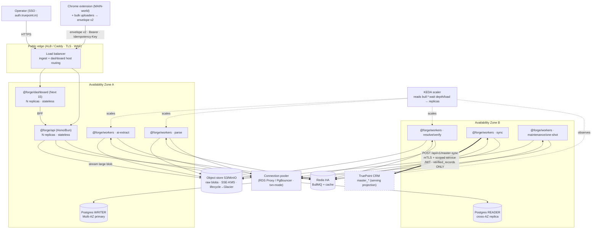

# 16 — Deployment & Infrastructure

> **Canonical contract:** TruePoint Forge deploys as **three long-running container services**
> (`@forge/api`, `@forge/workers`, `@forge/dashboard`) plus a **maintenance/one-shot lane** (migrate ·
> seed · reconcile · compaction), fronted by **managed Postgres HA (writer + cross-AZ reader)** through a
> **mandatory transaction-mode connection pooler**, **Redis HA** (BullMQ + cache), and **object storage
> (S3/MinIO)** for large raw blobs. Workers **autoscale on queue depth** (KEDA Redis-list scaler,
> scale-to-zero), one **per-stage** deployment. Deploys are **blue-green with a metric-analysis canary
> graduation path**, gated on **expand/contract, backward-compatible, hand-authored migrations** so two
> app versions run in parallel during a rollout. The only edge that leaves Forge is the **sync egress to
> `POST /api/v1/master-sync`** over **mTLS + a scoped service JWT** (the compliance firewall). Everything
> reuses **TruePoint's shipped AWS-native posture (ADR-0010)** and its **container shape** verbatim.
> **Locking ADRs: ADR-0046** (raw API interception as primary capture) **and ADR-0047** (Forge owns ER +
> versioned master-sync).
>
> This doc is the **owner of the deep detail** for the **deployment topology, container/runtime,
> environments + config + secrets substrate, the pooler + autoscaling topology, blue-green/canary +
> migration ordering, IaC, backup/restore + object lifecycle, cost posture, and the HA/DR overview.** It
> does **not** restate: queue/worker *mechanics* + the autoscaling *signal* (owned by `12-queue-and-worker-
> architecture`), metrics/SLO/trace wiring (owned by `15 — observability & lineage`), the KMS
> envelope-encryption key hierarchy · service-identity issuer/verifier · per-layer DB-role policy · DSAR
> erasure-reaching-backups policy (owned by `14-security-and-access-control`), the table DDL · partitioning
> · retention (owned by `05-database-design`), CI/CD *gates* (owned by `18 — testing & CI/CD`), or the sync
> wire contract (owned by `11-database-synchronization-engine`). **Deep capacity math + DR runbooks defer
> to `17` and `20`.** Current-state TruePoint facts cite `_context/ecosystem-facts.md` by `§` (and, where
> the facts sheet does not yet carry a tooling fact, the live tree by real `file:line` — the same
> methodology `04` uses); industry practice cites `[S#]` in `_context/research-corpus.md`; frozen
> vocabulary is `_context/decision-ledger.md` (L1–L11).

---

## Objectives

1. Fix the **deployment topology** — which processes run, what managed stores back them, and precisely
   which network edges exist — as a single deployment diagram every ops runbook inherits.
2. Specify the **container & runtime** as a verbatim reuse of TruePoint's **one-Bun-image** shape
   (`Dockerfile:1-38`): `api`/`workers` run TypeScript **directly under Bun with no build step**, the
   dashboard is a Next build, and **no secret value ever lands in an image layer**.
3. Define the **three environments** (dev/staging/prod), their **config + secrets substrate** (KMS +
   Secrets Manager / Parameter Store), and the **no-live-PII-in-staging** rule [S132].
4. Pin the **worker autoscaling topology** (KEDA queue-depth, per-stage, scale-to-zero, drain-aware
   probes) that consumes the *signal* `12` exports [S104][S105], and the **mandatory transaction-mode
   pooler** in front of Postgres that mirrors the **LOCAL-GUC discipline** (`ecosystem-facts §D`) [S110].
5. Specify **blue-green / canary** delivery and the **expand/contract migration ordering** it forces, so a
   two-version window is always backward-compatible [S112][S113], on **hand-authored migrations** only
   (`ecosystem-facts §D`).
6. Reuse **ADR-0010's AWS-native IaC posture** (Terraform, per-env accounts, ECR → blue/green, Secrets
   Manager) for `truepoint-forge`, and fix **backup/restore + object-lifecycle** (PITR, cross-region
   replication, Glacier tiering, compaction) [S84], the **HA/DR overview** (deep design → `17`/`20`), and a
   **cost posture** (deep FinOps → `truepoint-operations`).
7. Register the deployment/infra gaps (`G-FORGE-1601…1608`), risks, milestones, deliverables, success
   criteria, and open questions.

Non-goals: queue mechanics + the autoscaling signal (`12`), metric/trace/SLO stores (`15`), KMS key
custody + service-identity issuer + DB-role grants + erasure policy (`14`), table DDL + retention (`05`),
CI gate definitions (`18`), the sync wire contract (`11`), and deep capacity/load modelling + DR runbooks
(`17`/`20`).

---

## Industry practice (cited)

| Principle | What it means for Forge | Source |
|---|---|---|
| **Autoscale workers on queue depth, not CPU** | CPU-based HPA is a "silent failure" for a growing queue; KEDA's Redis-list scaler reads `bull:<queue>:wait` length and scales to zero when idle. | [S104][S78] (high) |
| **Queue depth alone lags latency-sensitive work; use a load signal** | Pods spin up only after backlog forms; prefer `(active+queued)/workers`, and run **per-stage queues** so each scales on a homogeneous job profile (parse ≠ AI-extract ≠ sync durations). | [S79][S105] (medium) |
| **KEDA worker pods need production hygiene** | `terminationGracePeriodSeconds`, liveness/readiness/startup probes, anti-affinity, and resource requests/limits — not just a scaler. | [S105] (medium) |
| **A connection pooler is mandatory in front of Postgres** | Reusing pooled connections processed 9,042 vs 495 tx/60s (~18–20×) under churn; RDS Proxy cuts Aurora failover time up to 66%. | [S110][S109] (high) |
| **Transaction-mode pooling for role/GUC-safe reuse** | RDS Proxy suits elastic fleets; PgBouncer sidecars give fine-grained control; **RDS Proxy does *not* support Aurora Serverless v2**; transaction-mode is what makes `SET LOCAL ROLE`/GUC reuse safe. | [S111] (medium) |
| **HA Postgres = writer + cross-AZ reader, routed by endpoint** | Aurora Multi-AZ gives a 99.99% SLA, ~30s failover, reader promotion tiers; route read-heavy work to readers via HAProxy/PgBouncer, writes to the writer. | [S108][S114] (high) |
| **Progressive delivery: blue-green first, canary later** | Start with blue-green (one version live, instant rollback), graduate to metric-analysis-driven canaries (Argo Rollouts) that shift a traffic % and auto-promote/rollback. | [S112] (high) |
| **Canary/blue-green forces backward-compatible (expand/contract) migrations** | Two app versions run in parallel for a brief window (15–20 min, ≤1–2 h), so schema + versioned-parser changes must be additive-then-contract. | [S113] (medium) |
| **Object storage past the TOAST cliff, with mandatory lifecycle** | Postgres JSONB degrades 2–10× past ~2 kB; object tagging + S3 lifecycle transitions cold blobs to Glacier (~68% cheaper), and snapshot expiry + compaction + orphan cleanup are mandatory, not optional. | [S82][S84] (high) |
| **Encryption + KMS custody are what SOC 2 checks** | Encryption at rest + in transit via a centralized KMS, at-least-annual rotation, key-admin SoD — envelope encryption satisfies it (enforcement → `14`). | [S122] (medium) |
| **Zero-trust service identity on the egress** | mTLS + SPIFFE/scoped client-credentials with short-lived, auto-rotated identity — never a static token (issuer/verifier → `14`). | [S119][S120] (high/medium) |
| **No live PII in lower environments** | Production data used for fixtures/staging must be masked/tokenized into synthetic equivalents preserving format + referential integrity. | [S132] (medium) |

---

## Current-state — what already exists in TruePoint

Forge does not invent a deployment story; it **ports TruePoint's**. Everything below is verified against the
live tree (2026-07-05).

| Asset (TruePoint) | Anchor | What Forge reuses |
|---|---|---|
| **AWS-native, self-hosted posture** — Hono on Bun, **ECS Fargate behind ALB**; **Aurora PostgreSQL Serverless v2 (0.5–256 ACU, Multi-AZ, PITR) + RDS Proxy**; **ElastiCache Redis (cluster mode)** for BullMQ; **Terraform** (separate infra repo, state in **S3+DynamoDB**), **one AWS account per env** via Organizations; **GitHub Actions → ECR → CodeDeploy blue/green**; **Secrets Manager + Parameter Store**; **AWS Batch (Fargate)** for heavy one-off jobs | `ADR-0010:13,17,29` | the whole substrate + CD shape, applied to `truepoint-forge` (see the **Serverless-v2 ⊥ RDS-Proxy** conflict below) |
| **DR baseline** — Aurora **PITR + cross-region warm standby**, **S3 cross-region replication**, **RTO 1 h / RPO 5 m**, **quarterly DR drills** | `ADR-0010:48` | the HA/DR overview target; deep runbooks → `17`/`20` |
| **One container image for all services** — `FROM oven/bun:1.3.14`; `api`/`workers` run TS **directly under Bun (no build step)**; Next apps `next build`; **compose overrides `command` per service**; build-time env via a **BuildKit secret so no secret lands in a layer**; only `NEXT_PUBLIC_*` inlined | `Dockerfile:2-5,12,17-18,27-38` | the identical image + no-build-for-workers model for `@forge/api`/`@forge/workers`, Next build for `@forge/dashboard` |
| **Compose prod shape** — shared `x-app` anchor (services differ only by `command`), `env_file:[.env.production]`, `depends_on: redis healthy`; **one-shot `migrate`/`seed`/`bootstrap` via profiles** (`restart:"no"`, `migrate.ts` run directly); per-service **healthchecks via `bun -e fetch`**; **soft CPU/mem reservations** on latency-sensitive services; **Caddy** TLS + subdomain edge | `docker-compose.prod.yml:8-19,49-72,84-95,167-183` | the maintenance-lane profile pattern, health-probe idiom, and per-service `command` split for Forge's 3 apps |
| **Worker platform** — one shared `IORedis`, `startWorkers()`, per-queue retry+jitter, PII-free DLQ, `withLeaderLock`, transactional `outboxRelay`, `/metrics` Prometheus, drain-aware `health.ts` (`/ready` Redis-aware) | `ecosystem-facts §C`; `docker-compose.prod.yml:115-135` | the deployable unit that KEDA scales; graceful SIGTERM drain is a deploy concern |
| **LOCAL-GUC / pooler discipline** — `SET LOCAL ROLE` + GUCs, **RDS-Proxy/PgBouncer-safe**; hand-authored migrations, `drizzle-kit generate` **unsafe**; coordinator host has **no Docker** (new-table features CI-verified) | `ecosystem-facts §D` | the transaction-mode pooler contract + hand-authored-migration release discipline |
| **Provider-spend meters** — `provider_calls.cost_micros`, `credit_ledger`, `ai_requests` | `ecosystem-facts §C` | the cost signals the FinOps posture reads (metered enrichment/AI is the dominant lever) |

> **Note — the runtime substrate is drawn by `03 §Technology choices`**; this doc places it on infrastructure
> and does not re-argue Bun/Hono/Postgres/Redis/object-store choices (`decision-ledger` L7). The
> `apps/dashboard` (Next 15) mirrors `apps/admin` (`ecosystem-facts §C`, `04`).

---

## Design

### Deployment topology

Three deployable apps, three managed stores, one outbound firewall edge. The single hard rule the diagram
encodes is the compliance firewall (`03 §Trust boundaries`): **raw stays in Forge; only `verified_records`
leave.**



**What is stateless vs stateful.** `api` and `dashboard` are **stateless** (no local disk, no sticky
sessions — the operator session is an in-memory access token minted at `auth.truepoint.in`, `decision-ledger`
L6), so they scale horizontally and are safe to blue-green. Workers are **stateless compute over Redis +
Postgres + object store**; the only durable state is the three managed stores. This is what makes
scale-to-zero and instant-rollback deploys safe.

### Container & runtime (Bun images)

Forge mirrors the **one-image** model verbatim (`Dockerfile:2-5`): a single `oven/bun:1.3.14`-based image
whose `command` is overridden per service. `api`/`workers` run their TypeScript **directly under Bun — no
build step** (`Dockerfile:3,24`) — which is exactly why internal packages are source-level (`04 §Build &
tooling`); only `@forge/dashboard` runs `next build`.

| Concern | Forge choice | Grounding |
|---|---|---|
| Base image | `FROM oven/bun:1.3.14` (multi-stage `build` → runtime) | `Dockerfile:12`; pinned Bun (`decision-ledger` L7) |
| `@forge/api` / `@forge/workers` | run TS directly (`bun run --filter … start`), no `dist` | `Dockerfile:3,24,38` |
| `@forge/dashboard` | `next build` at image-build time; served on the app port | `Dockerfile:4,29-31` |
| Secrets at build | **BuildKit secret** (`--mount=type=secret,id=dotenv`), so **no secret value in any layer**; only `NEXT_PUBLIC_*` inlined | `Dockerfile:7-10,27-31` |
| Health probe idiom | `bun -e "fetch(...).then(r=>process.exit(r.ok?0:1))"` (base image has no curl/wget); workers probe drain-aware `/ready` | `docker-compose.prod.yml:89-95,129-135` |
| Per-service `command` | one image, `command:` per service; **latency-sensitive services get a soft CPU/mem reservation** | `docker-compose.prod.yml:8,79,84-88` |

> **One image or per-app images?** TruePoint ships **one** image for all five services and overrides the
> command (`Dockerfile:2`). Forge has only three apps and can follow the same one-image model, but a
> registry-size/attack-surface argument for a **dedicated `@forge/dashboard` image** (Next runtime only, no
> BullMQ deps) is worth taking on a per-env basis — recorded as a build-time decision, not a blocker.

### Environments, config & secrets

Three environments, each an isolated AWS account (ADR-0010's per-env-account model, `ADR-0010:29`).

| Env | Purpose | Data | Capture flags | Compute |
|---|---|---|---|---|
| **dev** | local + shared dev; docker-compose or a thin account | **synthetic only** [S132] | interception **off** by default (`decision-ledger` L3; mirrors `CHROME_EXTENSION_ENABLED`, `ecosystem-facts §A`) | compose (single host) / minimal Fargate |
| **staging** | pre-prod parity, migration + canary rehearsal | **synthetic / masked** — never live prospect PII [S132] | off unless an integration test explicitly enables a scoped flag | full topology at low replica counts |
| **prod** | live data-ops | live raw (raw stays in Forge — the firewall) | interception **gated by the ADR-0046 kill-switch + per-tenant gating; ON only after OQ-2 legal sign-off** | full HA topology + autoscaling |

**Config.** `@forge/config` parses + validates env at boot and **fails fast** (mirrors `@leadwolf/config`'s
boot validation, `Dockerfile:26`); `globalDependencies` include `.env` so a config change busts the Turbo
cache (`04 §Build & tooling`). Non-secret config lives in **Parameter Store**; secrets in **Secrets
Manager** (`ADR-0010:29`).

**Secrets substrate (provisioning here; *enforcement* → `14`).** This doc provisions the **KMS keys +
Secrets Manager / Parameter Store** infrastructure; the **envelope-encryption key hierarchy (per-source/record
DEK wrapped by a KMS KEK), rotation, custody, and the gated decrypt reveal path are owned by
`14 §5`** [S122]. The compose-level lesson TruePoint already paid for — a `${VAR:-}` default in
`environment:` silently clobbering a persisted signing key from `env_file`
(`docker-compose.prod.yml:11-15`) — is carried forward as a config rule: **source durable secrets from one
place only**. Provider API secrets (Apollo/ZoomInfo/Reacher/Twilio) live in KMS/Secrets Manager, **never on
a client** (`03 §Trust boundaries`, `14 §5`).

### Worker autoscaling on queue depth (KEDA)

Doc `12` exports the *signal* (queue depth / load from `/metrics`); **this doc owns the *topology* that
consumes it** (`12 §Autoscaling` hands the topology + capacity here). Each DAG stage is a **separate
deployment with its own KEDA `ScaledObject`** so it scales on a homogeneous job profile [S105] — a 30 s AI
extraction must not set the replica count for a 100 ms parse.

| Stage deployment | Scaler trigger | Floor | Ceiling / notes |
|---|---|---|---|
| `parse` | `bull:parse:wait` depth + load | 0 (scale-to-zero) | high ceiling; cheap, CPU-bound [S104] |
| `ai-extract` | `bull:ai-extract:wait` depth | 0 | **spend path** — capped low; serial-until-budget-lease gate lives in `12`, but the replica ceiling is a *cost* control here [S105] |
| `resolve` / `verify` | depth + load | 1 (keep-warm) | latency-sensitive review notifications; avoid cold-start lag [S79] |
| `sync` | `worker_outbox` backlog | 1 | leaderless outbox relay; small, steady [S20] |
| `maintenance` / one-shot | schedule / manual | 0 | compaction, reconciliation, replay — AWS Batch (Fargate) for heavy one-offs (`ADR-0010:29`) |

**Pod hygiene (mandatory, [S105]).** Every worker deployment sets `terminationGracePeriodSeconds` long
enough for the in-flight job + graceful BullMQ drain (the `/ready` drain-aware probe already exists,
`docker-compose.prod.yml:123-131`), liveness/readiness/startup probes, anti-affinity across AZs, and
resource requests/limits. **KEDA/HPA is the orchestrator that acts on health** — compose only *marks*
unhealthy (`docker-compose.prod.yml:126-128`), so on ECS/EKS the platform restarts and reschedules.

> **KEDA `:wait` caveat (from `12`).** BullMQ ≥ 4.1.0 may omit `bull:<queue>:wait` for **priority-enabled**
> queues, breaking the depth scaler; validate the trigger key per queue+version and **fall back to the load
> metric `(active+queued)/workers`** where `:wait` is absent [S104][S79].

**Committing to KEDA biases the compute substrate toward EKS** (KEDA/Argo/Karpenter are EKS-native; ECS
needs a custom scaler) — the **ECS-Fargate-vs-EKS** decision is **OQ-R6 / G-FORGE-303** (owned by `03`), not
re-opened here [S106][S107].

### Connection pooling (mandatory)

A pooler in front of Postgres is **not optional** — pooled reuse is ~18–20× the throughput under connection
churn [S110], and an autoscaled worker fleet is *pure* churn. Forge runs a **transaction-mode** pooler
(RDS Proxy or PgBouncer) and honors the **LOCAL-GUC discipline** verbatim (`ecosystem-facts §D`).

- **Transaction-mode is required because Forge sets a per-operation role.** Forge's tx client
  (`withStaffTx`/`withPrivilegedTx`, `04`/`14 §3`) does `SET LOCAL ROLE forge_<layer>` + fail-closed GUCs
  inside the transaction — the direct analog of TruePoint's `SET LOCAL ROLE leadwolf_app` (`ecosystem-facts
  §D`). `SET LOCAL` is scoped to the transaction, so it is safe across a pooled connection; a session-level
  `SET` would leak a role between borrowers. **This is the load-bearing reason the pooler must be
  transaction-mode**, even though Forge is staff-scoped (structural per-layer roles), not tenant-RLS
  (`14 §6`).
- **Read/write split.** Route read-heavy work (verification lookups, dashboard queries, search) to the
  **reader endpoint** and writes (landing raw, verified upserts, outbox) to the **writer**, via HAProxy +
  PgBouncer or the Aurora reader endpoint [S114][S108].
- **Failover.** The pooler hides AZ/restart turbulence and cuts Aurora failover time up to 66% [S109]; app
  code retries on the cluster/reader endpoint.

> **⚠ Conflict to resolve (G-FORGE-1602).** `ADR-0010:17` specifies **Aurora Serverless v2 + RDS Proxy**, but
> **RDS Proxy does not support Aurora Serverless v2** [S111]. Forge must pick one: **(a)** provisioned Aurora
> + RDS Proxy (managed, IAM/Secrets-Manager auth), or **(b)** Aurora Serverless v2 + a self-run PgBouncer
> sidecar (transaction-mode). Either satisfies the LOCAL-GUC contract; the choice is a cost/ops trade
> carried to `## Open questions` and to `17`.

### Blue-green / canary deploys + migration ordering

Progressive delivery per [S112]: **start blue-green** (both versions live, instant rollback — TruePoint
already wires **CodeDeploy blue/green**, `ADR-0010:29`), and **graduate stateless surfaces (`api`,
`dashboard`) to metric-analysis canaries** (Argo Rollouts) that shift a traffic % and auto-rollback on SLO
regression. Workers roll by **replacing per-stage deployments** while the queue buffers in-flight work
(graceful drain, above).

**The non-negotiable coupling: a two-version window forces expand/contract migrations** [S113]. Because old
and new app versions run in parallel for a rollout window, **every schema change and every parser-version
change must be additive-then-contract**, on **hand-authored migrations only** (`ecosystem-facts §D`;
`generate` is unsafe). The parser-version rollout is itself observe-only → block (SchemaVer, owned by
`08 §Parser framework`), which is exactly this discipline applied to the parsed layer.

```mermaid
sequenceDiagram
    participant CI as CI (18)
    participant DB as Postgres (writer)
    participant Blue as vN (live)
    participant Green as vN+1 (canary)
    Note over CI,Green: EXPAND — additive, backward-compatible only
    CI->>DB: migrate: ADD nullable column / new table (hand-authored)
    Note over Blue,Green: vN ignores the new column; both read/write safely
    CI->>Green: deploy vN+1 behind 5% traffic (blue-green → canary)
    Green-->>CI: SLOs green? (15 · error rate, p95, DLQ age)
    alt healthy
        CI->>Green: promote to 100%; retire Blue
        Note over CI,DB: CONTRACT — a LATER release drops the old column/backfills
        CI->>DB: migrate: backfill + drop deprecated (only after no vN runs)
    else regressed
        CI->>Blue: instant rollback (Blue still live)
    end
```

**Migrations run in the maintenance/one-shot lane** (the `migrate` profile pattern,
`docker-compose.prod.yml:49-55`), **before** the app rollout for expand steps and **after** full promotion
for contract steps — never interleaved with a live two-version window. New-table migrations are **CI-verified
against a real Postgres** (the coordinator host has no Docker, `ecosystem-facts §D`).

### CI/CD pipeline (gates → `18`)

The pipeline mirrors ADR-0010's **GitHub Actions → ECR → CodeDeploy blue/green** (`ADR-0010:29`). This doc
owns the **deploy stages**; the **gate definitions** (typecheck, `bun test`, `lint:boundaries` depcruise,
Pact verify, data-diff) are owned by `18` and `04 §Build & tooling`.

| Stage | Action | Gate owner |
|---|---|---|
| Build | Bun image build with BuildKit dotenv secret → push to **ECR** (immutable digest tag) | `Dockerfile`; `18` |
| Verify | `turbo typecheck` · `bun test` · `bun run lint:boundaries` · consumer-driven **Pact** for `/master-sync` · **data-diff** on `verified_records`↔`master_*` | `18`; `04`; `11` |
| Migrate (expand) | run hand-authored expand migration in the one-shot lane against the target env | `05`; `ecosystem-facts §D` |
| Deploy | CodeDeploy **blue/green** (api/dashboard canary via Argo); per-stage worker rollout with drain | this doc [S112] |
| Post | SLO watch (auto-rollback), then a later **contract** migration | `15`; this doc |

### Infrastructure as Code (Terraform)

Reuse ADR-0010's IaC model **one-for-one** (`ADR-0010:29`): **Terraform in a separate infra repo**, remote
**state in S3 + DynamoDB lock**, **one AWS account per env** via Organizations. Forge is a **new infra
footprint** (`truepoint-forge`), not an edit to TruePoint's — its modules stand up: VPC + subnets (writer/reader
AZs), Aurora cluster + pooler, ElastiCache Redis, the object-store bucket + lifecycle, ECR repos, the
compute cluster (ECS/EKS per OQ-R6), KEDA (if EKS), Secrets Manager/KMS, and the **egress path** to
TruePoint. Standing up this footprint is **G-FORGE-1601**.

> The `truepoint-forge` / `@forge/*` naming (OQ-1) flows into IaC resource names; it is a deliberate,
> no-rename collision with Atlassian Forge (`decision-ledger` L1) — infra tags must disambiguate.

### Backup / restore & object lifecycle

Two substrates, two backup stories, one erasure obligation.

| Substrate | Backup / durability | Lifecycle | Grounding |
|---|---|---|---|
| **Postgres (4 layers + ops tables)** | **PITR** + automated snapshots; **cross-region warm standby** for DR | partition retention owned by `05 §Partitioning & retention`; monthly `raw_captures` partitions ease drop/archive | `ADR-0010:48`; `05` |
| **Object store (raw blobs)** | **SSE-KMS at rest**; **cross-region replication**; versioning | **tag + S3 lifecycle → Glacier Instant Retrieval (~68% cheaper)** for cold raw; **hash-prefix key spread** to avoid request throttling; **mandatory compaction + snapshot-expiry + orphan cleanup** on the append-only raw layer | [S84][S85]; runs in the `maintenance` lane |
| **Redis** | BullMQ is recoverable state, not a source of truth; AOF/replica for HA | queues rebuild from Postgres/outbox on loss | `ecosystem-facts §C` |

**Erasure must reach backups (policy → `14 §7`).** GDPR Art 17 requires erasure to be verifiable and reach
the **raw layer**; regulators accept immutable backups put **"beyond use"** and overwritten within the
normal retention cycle, so the deployment lever is a **short backup-retention window + tombstoning** so raw
PII ages out [S117]. This doc provisions the retention window; the DSAR orchestrator + tombstone cascade are
owned by `14 §7` / `05`.

The **raw-blob substrate itself** (object-store-large / JSONB-small default) is **OQ-4**, and the
**table-format** (Iceberg vs Delta + managed S3 Tables) is **OQ-R8** — both affect lifecycle mechanics
[S82][S86][S85].

### HA/DR overview (deep DR → `17`/`20`)

Headline posture, mirroring ADR-0010's DR baseline (`ADR-0010:48`); deep RPO/RTO runbooks and failover
drills defer to `17` and `20`.

| Tier | Posture | Target |
|---|---|---|
| **AZ failure** | Multi-AZ writer + cross-AZ reader; workers anti-affine across AZs; stateless apps reschedule | ~30 s DB failover [S108]; no data loss |
| **Region failure** | Aurora cross-region warm standby; S3 CRR; IaC re-applies compute in the standby region | **RTO 1 h / RPO 5 m** (ADR-0010 baseline) |
| **Redis loss** | Queues rebuild from Postgres + `worker_outbox`; effectively-once apply tolerates replay | no golden-record loss [S72][S20] |
| **Bad deploy** | Blue-green instant rollback; canary auto-rollback on SLO regression | seconds [S112] |
| **Egress (CRM) outage** | Outbox buffers; sync worker retries with backoff → DLQ; **reconciliation** closes any drift on recovery | eventual, effectively-once [S25] |

**Drills.** Quarterly DR drills (ADR-0010 baseline) plus a **sync-egress replay drill** (buffer, restore,
reconcile) unique to Forge. Deep design → `17`/`20`; incident runbooks → `truepoint-operations`.

### Cost posture (deep FinOps → `truepoint-operations`)

Forge's cost is dominated by **metered external spend**, not compute. The deployment levers below set
budgets and alarms; the **per-tenant/per-lever FinOps discipline is owned by `truepoint-operations`**.

| Lever | Driver | Deployment control |
|---|---|---|
| **Metered enrichment / verification** | `provider_calls.cost_micros`, `credit_ledger` (`ecosystem-facts §C`) | daily-budget breaker (reused from TruePoint enrichment) + `ai-extract`/provider replica ceilings; **the dominant cost** |
| **AI extraction** | `ai_requests` tokens (`ecosystem-facts §C`) | stable/versioned schemas preserve the 24 h grammar+prompt cache [S47]; capped `ai-extract` concurrency |
| **Aurora ACU** | Serverless v2 auto-scale (or provisioned) | min/max ACU bounds; read-replica offload; the Serverless-v2/RDS-Proxy choice (G-FORGE-1602) is also a cost choice |
| **Object store** | raw-blob volume | Glacier tiering + compaction + short retention (above) [S84] |
| **Compute** | worker replica-hours | **scale-to-zero** for event stages [S104]; EKS-on-EC2 + Spot ~50–65% cheaper than Fargate but +ops [S106] |

---

## Security considerations

Deployment is where several `14`-owned controls are physically provisioned; the **policy stays with
`14`** (security has final say, CLAUDE.md precedence):

- **The compliance firewall is a network fact, not just a policy.** The only Forge→TruePoint edge is the
  sync egress; it carries **`verified_records` only**, over **mTLS + a scoped `forge_sync` service JWT**
  (`aud=truepoint-api`, `scope=master-sync`), **never** a human session — issuer/verifier + rotation owned
  by `14 §2` [S119][S120]. Provision it as a locked-down egress (PrivateLink/VPC-peer + ALB), not open
  internet — **G-FORGE-1607**.
- **No secret in an image layer** (BuildKit secret, `Dockerfile:7-10`); secrets at runtime from Secrets
  Manager/KMS, decrypted in memory per operation (`14 §5`).
- **Per-layer DB roles are enforced at the pooler/connection level**: the pooler authenticates each
  service to its layer role so `forge_sync` can read `verified_*` ciphertext + blind index only and
  **cannot read `raw_captures`** — the *no-role-reads-raw-PII-and-writes-production* invariant (`14 §3`)
  [S121].
- **No live PII below prod** [S132]: staging/dev run synthetic/masked data; the interception kill-switch is
  **off by default** everywhere and **on in prod only after OQ-2 legal sign-off** (`decision-ledger` L3,
  ADR-0046).
- **KMS custody + envelope encryption** provisioned here, key hierarchy + SoD owned by `14 §5` [S122].

---

## Scalability considerations

The deployment-level scale levers Forge owns (deep capacity math → `17`):

- **Per-stage autoscaling on queue depth/load** decouples the fleet by job profile and scales event stages
  to zero [S104][S105]; the *signal* is `12`'s, the *topology* is here.
- **The transaction-mode pooler is the horizontal-scale enabler** — without it, an autoscaled fleet
  exhausts Postgres connections; with it, ~18–20× throughput under churn [S110].
- **Read/writer split** absorbs read-heavy verification/search on replicas, reserving the writer for the
  land-raw + verified-upsert + outbox write path [S114].
- **Object storage past the TOAST cliff** keeps large raw payloads off the row and out of the hot path
  [S82], with hash-prefix key spread for bursty ingest [S84].
- **Stateless apps + effectively-once workers** make horizontal scaling and rollout safe: any replica can
  serve any request; any worker can retry any job [S72][S20].

Capacity numbers, per-stage replica sizing, and the load model are **`17`'s** to compute (some sibling docs
`03`/`04` name that owner "`17-scalability`"; see Open questions on the ownership boundary).

---

## Risks & mitigations

Deployment/infra gaps use **`G-FORGE-1601…1608`** (unique across the suite, `decision-ledger` L9). Compute
topology (`G-FORGE-303`), object-store-as-new-substrate (`G-FORGE-304`), and cross-service trace/reconcile
(`G-FORGE-305`) are owned by `03` and referenced, not re-minted.

| Risk / gap | Area | L × I | Mitigation (cite) |
|---|---|---|---|
| **G-FORGE-1601** — `truepoint-forge` AWS footprint is entirely unprovisioned (Terraform, VPC, Aurora, Redis, object store, ECR, compute, egress) | platform / ops | High × Med | reuse ADR-0010 IaC pattern (separate repo, per-env accounts, S3+DynamoDB state) in M-FORGE-A (`ADR-0010:29`) |
| **G-FORGE-1602** — pooler unresolved: **ADR-0010's Aurora Serverless v2 ⊥ RDS Proxy** [S111]; and it must be transaction-mode for `SET LOCAL ROLE` | platform | Med × High | pick provisioned-Aurora+RDS-Proxy **or** Serverless-v2+PgBouncer; both honor LOCAL-GUC discipline (`ecosystem-facts §D`) [S110] |
| **G-FORGE-1603** — blue-green/canary + expand/contract migration-ordering process undefined (two-version window) | platform / testing | Med × High | expand-before-deploy / contract-after-promote on hand-authored migrations; CodeDeploy blue/green + Argo canary [S112][S113] |
| **G-FORGE-1604** — object-store lifecycle (Glacier tiering, compaction/expiry/orphan cleanup) + backup/restore (PITR/CRR) unprovisioned | platform / ops | Med × Med | tag+lifecycle→Glacier, mandatory maintenance-lane compaction, PITR + CRR [S84]; retention window feeds erasure (`14 §7`) [S117] |
| **G-FORGE-1605** — env topology (dev/staging/prod parity, per-env accounts) + **no-live-PII-in-staging** not enforced | platform / security | Med × Med | per-env AWS accounts (`ADR-0010:29`); synthetic/masked data in lower envs [S132]; kill-switch off by default |
| **G-FORGE-1606** — KMS + Secrets Manager/Parameter Store substrate not provisioned (enforcement → `14`) | security / platform | Med × High | provision KMS/SM in M-FORGE-A; key hierarchy + custody + rotation owned by `14 §5` [S122] |
| **G-FORGE-1607** — Forge→TruePoint **egress network path** (mTLS, PrivateLink/VPC-peer, ALB) not provisioned | security / platform | Med × High | locked-down private egress; scoped service JWT + mTLS (`14 §2`) [S119]; the firewall edge |
| **G-FORGE-1608** — FinOps/cost baseline + per-lever budget alarms absent (metered enrichment/AI dominate) | operations | Med × Med | budget alarms on `provider_calls`/`ai_requests`/ACU/object store; deep FinOps → `truepoint-operations` |
| **G-FORGE-303** (from `03`) — ECS Fargate vs EKS undecided; KEDA biases EKS | ops / platform | Med × Med | resolve OQ-R6 in `17`; per-stage queues regardless [S106][S107][S104] |
| KEDA `:wait` key absent on priority queues → scaler breaks | platform | Med × Med | validate trigger key per queue+version; fall back to load metric (from `12`) [S104][S79] |
| Pooled session-role leak (a `SET` leaking a role across borrowers) | security | Low × High | **`SET LOCAL` only** inside the tx (LOCAL-GUC discipline); transaction-mode pooler (`ecosystem-facts §D`) |

---

## Milestones

Deployment work front-loads into **M-FORGE-A (Foundation)** and lands the operate-time controls at
**M-FORGE-F**, tracking `03 §Milestones`.

| Milestone | Delivers (infra) | Exit criterion |
|---|---|---|
| **M-FORGE-A — Foundation** | Terraform footprint (VPC, Aurora + **transaction-mode pooler**, Redis HA, object store + lifecycle, ECR, KMS/Secrets Manager), per-env accounts, the Bun image + one-shot migrate lane | `bun`-image `api`+`workers`+`dashboard` boot in a thin env; a hand-authored migration applies via the one-shot lane; pooler serves `SET LOCAL ROLE` safely |
| **M-FORGE-A′ — Envs** | dev/staging/prod parity, synthetic-data seeding for lower envs, config/secrets wiring, interception flags off by default | staging runs the full topology on synthetic PII; no live PII below prod [S132] |
| **M-FORGE-E — Egress** | locked-down Forge→TruePoint egress (mTLS + scoped JWT), reconciliation job in the maintenance lane | verified record syncs over mTLS; egress reachable only from the sync worker (`14 §2`) |
| **M-FORGE-F — Operate** | KEDA per-stage autoscaling from `/metrics`, blue-green + canary release with expand/contract migrations, object-lifecycle + backup/DR drills, cost alarms | workers scale on depth/load (not CPU); a canary auto-rolls-back on SLO regression; a DR drill meets RTO 1 h/RPO 5 m [S104][S112] |

---

## Deliverables

1. The **deployment topology diagram** + the stateless/stateful split — the frozen ops picture.
2. The **container/runtime spec** (Bun image, no-build workers, BuildKit-secret build) as a verbatim reuse
   of `Dockerfile`.
3. The **environment + config + secrets** model (three per-env accounts, KMS/Secrets Manager provisioning,
   no-live-PII-in-staging), with enforcement handed to `14`.
4. The **worker-autoscaling topology** (per-stage KEDA, scale-to-zero, pod hygiene) consuming `12`'s signal,
   and the **transaction-mode pooler** contract mirroring the LOCAL-GUC discipline.
5. The **blue-green/canary + expand/contract migration-ordering** process (with the sequence diagram) on
   hand-authored migrations, and the **CI/CD deploy stages** (gates → `18`).
6. The **IaC reuse plan** (ADR-0010 Terraform posture), **backup/restore + object-lifecycle**, the **HA/DR
   overview**, and the **cost posture** (FinOps → `truepoint-operations`).
7. The infra gap register **`G-FORGE-1601…1608`**, and **handoffs**: signal/mechanics → `12`; observability →
   `15`; security enforcement → `14`; schema/retention → `05`; CI gates → `18`; deep capacity + DR → `17`/`20`.

---

## Success criteria

1. **No secret ever lands in an image layer or a lower-env dataset**: BuildKit-secret build (`Dockerfile:7-10`),
   synthetic-only staging [S132], runtime secrets from KMS/Secrets Manager.
2. **The pooler is mandatory and transaction-mode**: an autoscaled worker fleet never exhausts Postgres
   connections, and `SET LOCAL ROLE forge_<layer>` is safe across pooled borrows (`ecosystem-facts §D`)
   [S110].
3. **Every deploy tolerates two versions in parallel**: schema + parser changes are expand/contract,
   hand-authored, and CI-verified against a real Postgres; a bad deploy rolls back in seconds [S113][S112].
4. **Workers autoscale on queue depth/load, not CPU**, per-stage, scaling event stages to zero, with
   drain-aware probes and cross-AZ anti-affinity [S104][S105].
5. **The egress is the only Forge→TruePoint edge**, carries `verified_records` only, over mTLS + a scoped
   service JWT, on a locked-down private path (`14 §2`) [S119].
6. **DR meets the ADR-0010 baseline** (RTO 1 h / RPO 5 m, cross-region standby, quarterly drills) plus a
   sync-egress replay/reconcile drill unique to Forge (`ADR-0010:48`) [S25].
7. **No infra choice is answered from first principles** where a TruePoint ADR/config or ecosystem fact
   fixes it — each cites its `ADR-`/`Dockerfile:`/`§`/`[S#]` anchor (CLAUDE.md mandatory-read rule).

---

## Future expansion

- **Event-bus egress option (→ `20`).** If a second downstream consumer of `verified_records` appears, the
  internal outbox relay can publish to a durable event bus without becoming "event-bus-as-primary"
  (rejected today, `decision-ledger` L5); this is a deployment-substrate addition, not a contract change.
- **Debezium WAL CDC relay (OQ-R4).** Swap the polling outbox relay for log-tailing CDC if egress latency
  becomes a constraint — more infra, lower latency [S20][S24].
- **EKS Auto Mode / Karpenter + Spot.** Once the fleet crosses the ~15-container crossover, EKS-on-EC2 +
  Spot is ~50–65% cheaper than Fargate; EKS Auto Mode narrows the ops gap [S106][S107].
- **Managed Iceberg (S3 Tables).** If the raw substrate lands on Iceberg (OQ-R8), managed S3 Tables remove
  self-run compaction/snapshot maintenance [S85].
- **Full SPIFFE/SPIRE workload identity (OQ-R18).** Graduate the egress from mTLS + client-credentials JWT
  to SPIRE-issued short-lived SVIDs if the service-identity estate grows [S119][S120].

---

## Open questions

The full register lives in `_context/decision-ledger.md` (L11, OQ-1…OQ-6) and `01`'s research register
(OQ-R1…OQ-R20); the deployment-shaping ones surface here.

- **OQ-4 / G-FORGE-1604 — Raw-blob substrate** (object-store-large / JSONB-small default) and its lifecycle
  mechanics; overlaps **OQ-R8** (Iceberg vs Delta + managed S3 Tables) [S82][S84][S86].
- **G-FORGE-1602 — Pooler vs Aurora Serverless v2.** `ADR-0010:17` pairs Serverless v2 with RDS Proxy, but
  RDS Proxy does not support Serverless v2 [S111]. Provisioned-Aurora+RDS-Proxy or Serverless-v2+PgBouncer?
  Both honor the LOCAL-GUC contract; this is a cost/ops call for `17`.
- **OQ-R6 / G-FORGE-303 — Compute substrate: ECS Fargate vs EKS (+ EKS Auto Mode).** Committing to KEDA
  biases EKS; vendors disagree on the ~15-container crossover [S106][S107][S104].
- **OQ-R4 — Sync relay: polling outbox vs Debezium WAL CDC** — the no-Docker coordinator host favors
  polling; CDC is lower-latency, more infra [S20][S24].
- **OQ-R18 — Egress service-identity depth: full SPIFFE/SPIRE vs mTLS + scoped service-JWT**
  (`decision-ledger` L5) [S119][S120].
- **OQ-2 — Interception legal sign-off (GA-blocking).** Gates turning the prod capture kill-switch **on**;
  until then interception is off in every environment (ADR-0046, `decision-ledger` L3) [S116][S118].
- **Ownership/numbering boundary between `16` and `17` (flag to the Decision Ledger).** `12` names this doc
  "16 — deployment & scalability" and hands it the pooler/autoscaling-topology/compute-substrate; `03`/`04`
  name "`17-scalability`" as the owner of scale topology; this doc's brief scopes **deployment-level scale +
  an HA/DR overview here, with deep capacity math + DR runbooks in `17`/`20`.** The position taken:
  **16 owns *how it is deployed and operationally scaled* (topology, pooler, autoscaling topology,
  blue-green, IaC, backup, cost); 17 owns *deep capacity + DR***. Raised so the suite converges on one owner
  rather than silently diverging.
- **OQ-1 — `truepoint-forge` / `@forge/*` naming** flows into IaC resource names (deliberate collision,
  no rename; disambiguate via tags, `decision-ledger` L1). **OQ-5** (retire TruePoint's dark
  `chrome_extension` connector) and **OQ-6** (`@forge/capture-sdk` single-sourcing into the MV3 build) are
  cross-repo cleanups that touch the release pipeline but do not block the Forge footprint.
