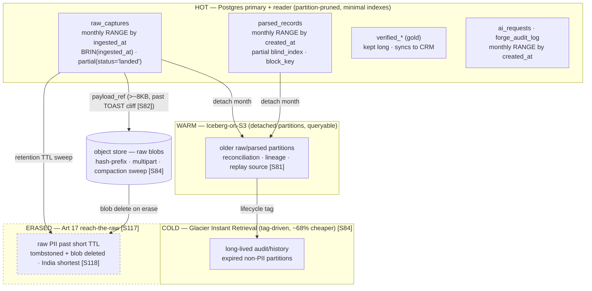
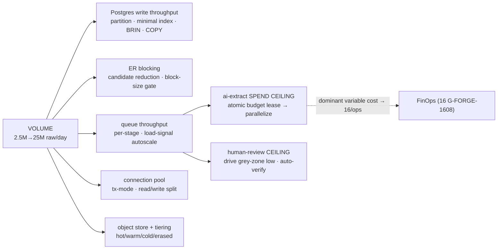

# 17 — Scalability & Performance

> **Canonical contract:** TruePoint Forge is sized to build and maintain a **golden dataset of tens of
> millions of `verified_records`** from a **multi-million-per-day** raw-capture stream, on the medallion
> spine `raw_captures → parsed_records → verified_records → (sync) → TruePoint master graph`
> (`decision-ledger` L2). This doc owns the **volume model, the per-stage capacity math, worker/pool
> sizing, ER-blocking scale, the hot/cold tiering + object-store envelope, the load/perf test plan +
> capacity SLOs, and the bottleneck/scale-out playbook** — everything needed to answer *"what breaks at
> 10x, and what do we do about it."* It is the counterpart to `16-deployment-and-infrastructure`, which
> owns the *provisioned footprint* (compute substrate, pooler product, object-store lifecycle, KMS, cost
> baseline): **this doc produces the numbers `16` provisions to.** Every queue is at-least-once and the
> pipeline is effectively-once; scale never buys itself by weakening that or the compliance firewall.
> **Locking ADR: ADR-0047** (Forge owns ER + versioned master-sync); the interception-primary capture
> that fills the raw stream is **ADR-0046**.

This doc is the **owner of the deep detail** for capacity, sizing, and performance. It does **not**
restate the schema/partition/role definitions (owned by `05-database-design`), the stage input/output/
quarantine contracts and freshness-SLO *shapes* (owned by `06-data-pipeline-architecture`), the queue
retry/DLQ/concurrency *mechanics* and the autoscaling *signal* (owned by `12-queue-and-worker-
architecture`), the AI extraction routing/budget-guard internals (owned by `09-ai-extraction-engine`),
the sync wire contract/reconciliation (owned by `11-database-synchronization-engine`), the human-review
workflow (owned by `10-verification-and-approval-workflow`), the metrics/SLO/trace wiring (owned by
`15-observability`), the provisioned infra + pooler-product + object-store lifecycle + cost baseline
(owned by `16-deployment-and-infrastructure`), or the test harness/CI (owned by `18-testing`). It **links
to the owner** and supplies the load-bearing math. Current-state TruePoint facts cite
`_context/ecosystem-facts.md` by `§`; best practice cites `[S#]` in `_context/research-corpus.md`; frozen
vocabulary is `_context/decision-ledger.md` (L1–L11).

---

## Objectives

1. State a **calibratable volume model** — captures/day, avg+p99 payload size, parsed/verified/AI/sync
   counts — with **worked back-of-envelope numbers** at a baseline, a 2× organic-growth target, and a
   **10× stress envelope**, all sized toward a dataset of tens of millions of records.
2. Fix the **Postgres scaling posture**: monthly range-partitioning of `raw_captures` + append-only logs,
   the index strategy on high-write tables, TOAST/JSONB behavior for large payloads, and cold-tiering
   detached partitions to object store / Iceberg (`05` owns the DDL; this doc owns the *sizing*).
3. Solve **entity resolution at scale** — candidate reduction, blocking-key design, block-size control,
   and the incremental-probe model that keeps ER inside the Splink/Zingg envelope for Forge's record band.
4. Do the **queue-throughput + worker-sizing math** per stage, surfacing the `ai-extract` spend-path and
   the human-review queue as the two hard ceilings, plus **caching** and **connection-pool sizing**.
5. Define the **hot/cold tiering + retention** tiers and the **object-store cost/throughput** envelope.
6. Ship a **load/perf test plan + capacity SLOs** (harness → `18`, SLO wiring → `15`) and a
   **bottleneck analysis + scale-out playbook** (what breaks at 10×, the early signal, the mitigation).
7. Register the scale/performance gaps (`G-FORGE-1701…1709`), risks, milestones, deliverables, and OQs.

Non-goals: the provisioned AWS footprint, the pooler product choice (Serverless-v2 ⊥ RDS-Proxy,
`16 G-FORGE-1602`), the object-store lifecycle provisioning (`16 G-FORGE-1604`), the compute-substrate choice
(ECS vs EKS, OQ-R6, `16`), the FinOps cost baseline (`16 G-FORGE-1608`), the test harness/CI (`18`), and
the metric/alert stores (`15`).

---

## Industry practice (cited)

| Principle | What it means for Forge | Source |
|---|---|---|
| **Blocking beats O(n²)** — group records into candidate buckets, UNION multiple keys (OR), never intersect | ER at scale is a blocking problem; the full cartesian is never computed | [S39] (high) |
| **Blocking cuts comparisons to ~0.05–1% of cartesian**; Zingg envelope 9M/45min/96 cores, 80M/<2 hrs | Forge's tens-of-millions band is comfortably inside a Splink-style Fellegi-Sunter build | [S39] [S40] (medium) |
| **Term-frequency adjustment is mandatory**; a **block-size diagnostic gates production** | a hot block key (common surname, `gmail.com`) silently explodes into O(n²) unless demoted + gated | [S36] [S39] (high) |
| **Postgres JSONB degrades 2–10× past the ~2 kB TOAST threshold**; TOAST is append-cheap, mutation-expensive | large raw payloads go to object store; `raw_captures` is write-once (TOAST-friendly) | [S82] [S83] (high) |
| **Iceberg-on-S3: tag→Glacier lifecycle (~68% cheaper); hash-prefix spreads writes; compaction/expiry/orphan-cleanup mandatory** | cold-tier detached partitions cheaply; avoid S3 request throttling on bursty ingest; sweep small files | [S84] [S85] (high/medium) |
| **A connection pooler is ~18–20× throughput** (9,042 vs 495 tx/60 s); transaction-mode is required for `SET LOCAL ROLE` | pooling in front of the ops DB is mandatory, not optional, given Forge's per-layer roles | [S110] [S111] (high/medium) |
| **Autoscale on queue depth/load, not CPU**; per-stage queues on homogeneous profiles; scale-to-zero | each stage scales on its own signal; CPU-HPA is a silent failure for a growing backlog | [S104] [S79] [S105] (high/medium) |
| **Volume is a first-class DQ signal** — a drop from millions→thousands is an incident; new tables get a "Training" warm-up | per-layer volume monitors with learned baselines catch capture-fleet or parser breakage | [S64] [S65] (high) |
| **Datetime-partitioning enables cheap batch reprocessing**; batch partition-overwrite is the lowest-cost ingest cadence | monthly `raw_captures` partitions make parser-version replay a partition-scoped backfill, not a full rescan | [S81] (high) |
| **Aurora Multi-AZ = 99.99%, ~30 s failover, reader tiers**; HAProxy+PgBouncer pools readers separately | read-heavy reconciliation/verification/search route to readers; writes hit the writer | [S108] [S114] (high) |
| **Reconciliation via per-key-range checksums / data-diff fingerprints** (~24× on 1 M rows) | drift detection between Forge `verified_records` and the CRM scales without full table scans | [S25] [S129] (medium/high) |

---

## Current-state — what already exists in TruePoint (cite ecosystem-facts)

Forge does not invent a scaling platform; it mirrors shipped TruePoint posture and inherits its knobs.

| Shipped fact (`§`) | Why it is load-bearing for Forge scale |
|---|---|
| `source_records.ingested_at` + `import_job_rows` are **partition-intent-declared, deferred-conversion plain tables** (§B `masterGraph.ts:285-287`; §C `importJobs.ts:126-128`) | Forge's `raw_captures`/`parsed_records`/`ai_requests`/`forge_audit_log` follow the **same "ship plain, convert to monthly RANGE when volume warrants"** discipline (`05 §Partitioning`) |
| `tuning.ts` pins **spend-path queues serial** (`enrichment` concurrency 1, the F3 racy read-check-act rule) (§C) | Forge's `ai-extract` inherits the identical constraint — it is the throughput/cost ceiling this doc models (`12 §Concurrency`) |
| `runWaterfallBulk` = **cheap-parallel-then-expensive** batching (§C) | the batching pattern for keeping paid AI/enrichment throughput up without overshooting cost |
| COPY → **UNLOGGED staging** in `bulkStage.ts` (COPY forbidden on RLS tables, uses `ownerClient`, §C) | the high-throughput bulk-import path into `raw_captures`; Forge is staff-only so COPY is unconstrained by RLS (`05 §Roles`) |
| `withTenantTx` is **RDS-Proxy/PgBouncer-safe** (`SET LOCAL ROLE` + LOCAL GUCs, §D) | Forge's per-layer `withIngestTx`/`withParserTx`/`withErTx`/`withSyncTx` are **transaction-mode-pooler-safe** by construction |
| `/metrics` exports **per-queue live depth + `outbox_oldest_pending_seconds`** (§C) | the autoscaling signal and the capacity-SLO alerts read the **same numbers** (`12 §Autoscaling`, `15`) |
| `checkCaptureRate` = **2,000 records/min/caller, fails open** (§A) | the edge volume throttle that bounds a runaway extension fleet — an abuse control, not backpressure correctness |

---

## The volume model

The model has **four drivers** and is expressed at three operating points: **Baseline** (year-1 steady
state), **Target** (2× organic growth, the number `16` provisions headroom to), and **10× stress** (the
knee we load-test to find). Numbers are a *starting posture* — every one is flagged for calibration on
real Forge capture rates before it becomes load-bearing (**G-FORGE-1701**).

**Drivers.** (1) **Interception capture** — the extension fleet posting envelope-v2 (ADR-0046),
the dominant raw source; (2) **bulk import** — operator CSV/JSON + provider blobs (bursty, COPY-staged);
(3) **provider raw JSON** — waterfall-enrichment residue (steady); (4) **maintenance re-verification** —
decay churn (B2B data decays ~2.5%/mo [S6], a steady background re-parse/re-verify load).

**Capture arithmetic (baseline).** A profile view intercepts ~4 Voyager endpoints (`identity/profiles`,
`positions`, `skills`, `education`) → ~4 `raw_captures`/profile. A fleet of **~400 operator seats ×
~1,250 profiles/business-day** ⇒ **~500 K profiles/day → ~2.0 M capture-rows/day**; plus **~0.5 M/day**
from bulk import + provider blobs ⇒ **~2.5 M `raw_captures`/day baseline**. Averaged over 24 h that is
~29/s, but load concentrates in ~10 business hours (~70/s business-hours avg) and bursts to **~350/s
peak** (~5× the business-hours mean).

| Layer / metric | Baseline (yr-1) | Target (2×) | 10× stress | Notes |
|---|---|---|---|---|
| **`raw_captures`/day** | 2.5 M | 5 M | 25 M | peak ~350/s (baseline) → ~3,500/s (10×) |
| avg payload | ~12 KB | ~12 KB | ~12 KB | skewed by a large tail; **p50 ~6 KB, p99 ~120 KB**, hard cap ~1 MB (envelope-v2) |
| inline-JSONB share (< ~8 KB) | ~30% | ~30% | ~30% | rest → object store (past the ~2 kB TOAST cliff [S82]) |
| **`parsed_records`/day** | ~5 M | ~10 M | ~50 M | fan-out ~2×/raw (person + employment stints + company ref) |
| **`ai_extractions`/day** | ~0.5 M | ~1 M | ~5 M | **~10% of parsed** — deterministic parser handles structured Voyager; AI on unstructured residue only (`09 §routing`) |
| **`verified_records` UPSERTs/day** | ~1.2 M | ~2.4 M | ~12 M | dedup ~4:1 (each golden captured ~4–5× over time) + field updates |
| **sync events/day** | ~0.6 M | ~1.2 M | ~6 M | only *changed* goldens emit an outbox event (no-op UPSERTs suppressed) |
| **grey-zone review/day** | 5–15 K | 10–30 K | 50–150 K | target ≤ ~1% of resolved; **the human ceiling** (see below) |
| **golden dataset (cumulative)** | ~15 M persons | ~35 M persons | 50 M+ persons | + ~1/10th companies; built over ~18–24 mo |

**Storage math (baseline, per-day new).**

| Store | /day | Steady-state resident | Basis |
|---|---|---|---|
| `raw_captures` Postgres (row meta + inline-small) | ~5 GB | ~150 GB (30-day hot window) | 0.8 KB row + 30% × ~4 KB inline; **short PII-retention TTL trims the tail** (`05`, `14 §7`) |
| raw blobs → object store | ~31 GB | bounded by retention (~0.9 TB @ 30-day) | 70% × ~18 KB × 2.5 M; **not** a monotonic cost — raw PII ages out (Art 17 [S117]) |
| `parsed_records` Postgres | ~6 GB | ~540 GB (90-day, partitioned) | 5 M × ~1.2 KB; prunable per partition |
| `verified_*` Postgres (the gold, kept long) | grows with dataset | ~150–200 GB @ target | 50 M persons × ~1.5 KB + emails/phones/employment/events |
| `ai_requests` + `forge_audit_log` | metering + audit volume | monthly-partitioned, cold-tiered | prune/export old partitions |

**The honest cost headline.** Storage at this scale is **modest** (object store is single-digit-hundreds
of dollars/month; raw is short-lived by compliance). The **dominant variable cost is metered
AI/enrichment** — ~0.5 M paid Anthropic calls/day baseline, ~5 M/day at 10× — which is why `ai-extract`
is the gated spend path (below) and why the FinOps baseline + budget alarms live in `16 G-FORGE-1608` /
`truepoint-operations`, not here. This doc sizes the *throughput*; those docs own the *spend*.

---

## Postgres scaling

**Partitioning (sizing the `05` intent).** `raw_captures` is **monthly RANGE by `ingested_at`**;
`parsed_records`/`ai_requests`/`forge_audit_log` monthly RANGE by `created_at` (`05 §Partitioning`).
At baseline a `raw_captures` month holds ~75 M rows / ~150 GB (Postgres) — the practical size where
partition pruning, per-partition VACUUM, and detach-to-cold become necessary, not premature. Datetime
partitioning is what makes parser-version **replay a partition-scoped backfill**, not a full-table rescan
[S81] (`06 §Versioned parsing`), and what lets a whole month of raw PII be **detached + tombstoned** in
one operation for Art 17 erasure [S117]. The **partition + global-UNIQUE caveat** (`content_hash` UNIQUE
cannot be global once partitioned by `ingested_at`) is resolved by the companion `raw_capture_hashes`
dedup table at conversion time — owned by `05 G-FORGE-502`.

**Index strategy on high-write tables (each index taxes every insert).** Keep the hot set minimal:
`raw_captures` carries `(source, endpoint)` (parser routing), a **partial `(status) WHERE status='landed'`**
(the parse-worker scan touches only unparsed rows), and `(batch_id)` — and nothing more on the write path.
Because `ingested_at` is **append-correlated**, prefer a **BRIN index on `ingested_at`** over btree for
range scans: BRIN is orders of magnitude smaller and near-free to maintain on monotonic inserts, ideal for
partition-local time ranges. `parsed_records` indexes `(parser_version_id, parse_status)` (drift
monitoring), a **partial blind-index** `WHERE email_blind_index IS NOT NULL` (ER blocking), and
`(block_key)` — again the minimum. High-write tables must **not** accumulate reporting indexes; analytical
reads go to a **read replica** [S114] or a cold-tier query engine, never the write primary.

**TOAST / JSONB behavior.** Voyager payloads mostly exceed the ~2 kB TOAST threshold, where JSONB
in-place queries degrade 2–10× [S82]; TOAST is **cheap to append, expensive to mutate** [S83] — which
suits a **write-once** `raw_captures` perfectly but forbids treating a large JSONB blob as a working
store. Two rules follow: (1) **large payloads live in the object store**, `payload_ref` in the row,
`byte_size`-routed at ingest (`05`); (2) every **hot, queryable key is promoted to a real column**
(`source`, `endpoint`, `schema_version`, `status`, `content_hash`) so the parse-worker scan and drift
monitors never predicate *inside* JSONB.

**Cold-tier to object store / Iceberg.** Detached old partitions export to **Iceberg-on-S3** with a
**tag-driven Glacier lifecycle** (delete-tagging → Glacier Instant Retrieval, up to ~68% cheaper) [S84];
**snapshot expiration + compaction + orphan-file cleanup are mandatory maintenance** (the
`forge-blob-compaction-sweep`, `12 §Sweeps`) [S84], and Iceberg's `ObjectStoreLocationProvider`
hash-prefix spreads writes to dodge S3 request throttling on bursty ingest [S84]. The Iceberg-vs-Delta
(+ managed S3 Tables) and object-store-large-vs-JSONB-small questions are **OQ-R8 / OQ-4**; the lifecycle
*provisioning* is `16 G-FORGE-1604`.

---

## Entity resolution at scale (blocking)

ER is the one stage where a naive design is quadratic and fatal: matching a day's **5 M parsed
candidates against a ~15 M+ existing golden set** is ~10¹⁴ comparisons — never computed. Three levers
keep it inside the Splink/Zingg envelope for Forge's tens-of-millions band [S40]:

1. **Blocking cuts the candidate set to ~0.05–1% of the cartesian** [S39]. `match_candidates`
   (`05 §Group 6`) is the blocking output; keys are the **UNION** of `surname_prefix`, `email_domain`,
   `phonetic/Soundex`, and combined keys — **OR-ed, never intersected**, to protect recall [S39].
2. **Incremental probe, not all-pairs.** Forge does **not** re-block the whole universe each run. A new
   `parsed_record` probes its own block keys against the **existing golden index** only (the
   `match_candidates.right_verified_id` seam, `05`), so daily ER cost scales with *new* volume × average
   block size, not with the total dataset — the Senzing "incremental / re-openable, re-evaluate prior
   records only when a generic value is later detected" posture [S41].
3. **Block-size control is the capacity gate.** A hot key (common surname, `gmail.com` as an email
   domain) produces an enormous block whose internal comparison is O(n²) — the silent ER scale killer.
   Mitigations, all cited: **term-frequency adjustment** demotes common values / rewards rare ones [S36];
   a **block-size distribution diagnostic gates any blocking model before production** (sample the largest
   blocks; a p99 block over the cap fails the gate) [S39]; **generic-value detection** demotes an
   over-shared value in real time [S41]. Threshold and block-key calibration on Forge data is
   **OQ-R12**; the block-size gate over `match_candidates` is **G-FORGE-1705**.

Zingg's reported envelope (9 M in 5 min/4 cores; 80 M in <2 hrs/96 cores) [S39] confirms Forge's band is
tractable; the `resolve` queue is DB-bound (blocking queries are heavy), sized at concurrency 2 and a
5-min processor deadline (`12 §Concurrency`) with the heavy read-side routed to a replica.

---

## Queue throughput & worker sizing

Per-stage queues on homogeneous job profiles are the core lever — each stage scales independently, and a
slow `ai-extract` never stalls `parse` (`12 §The queue map`). The sizing math below is **baseline peak**
(business-hours burst); multiply by ~10 for the stress envelope. It fixes the *shape* `16` provisions
replica counts to; the retry/DLQ/concurrency *mechanics* are `12`, the autoscaling *signal* is
`12 §Autoscaling`.

| Queue | Peak arrival | Per-job time | Per-process throughput | Baseline peak procs | Scaling note |
|---|---|---|---|---|---|
| `parse` | ~350/s | ~20 ms (CPU-light) | conc 4 ⇒ ~200/s | **~2** | CPU-bound; scales linearly on depth/load [S79] |
| `ai-extract` | ~70/s | ~5 s (Claude call) | **conc 1 ⇒ ~0.2/s** | **see ceiling ↓** | **spend-path ceiling — the headline bottleneck** |
| `quality` | ~350/s | ~10 ms (DB) | conc 4 ⇒ ~400/s | **~1–2** | idempotent re-scoring; cheap |
| `resolve` | ~350/s | ~150 ms (blocking) | conc 2 ⇒ ~13/s | **~3–4** | DB-bound; heavy queries → replica reads |
| `verify` (executor) | human-paced | ~15 ms write | conc 1 ⇒ ~65/s | **1** | executor is idempotent; upstream is human-bound |
| `sync` | ~35/s | ~50 ms HTTP | conc 4 ⇒ ~80/s | **1** | leaderless relay fans horizontally [S20] |
| `maintenance` | scheduled | varies | conc 1, leader-locked | **1 (never →0)** | singletons; extra replicas safe-but-idle |

**Ceiling 1 — the `ai-extract` spend path (G-FORGE-1702).** At concurrency 1 a worker process does ~0.2
extractions/s (~17 K/day). Baseline needs ~0.5 M/day (~30 processes); **10× needs ~5 M/day (~300
processes)** — absurd, and the concurrency-1 pin exists precisely because the daily-budget breaker is a
racy read-check-act, so N naive parallel workers overshoot the cost cap by N paid calls (the shipped F3
rule, §C; `12 §Concurrency`). The **unlock is an atomic per-batch budget/credit lease** (`09 §budget`,
`12 G-FORGE-1202`): once acquiring budget is a single atomic decrement (DB/Redis), the queue **parallelizes
horizontally** because each worker reserves before it spends. That plus **model tiering** (Haiku for cheap
structured extraction), **deterministic-first selectivity** (`09 G-FORGE-902` — AI only on null/low-
confidence residue, keeping the ~10% share honest), **batching** (`runWaterfallBulk` pattern, §C), and
the **24 h grammar+prompt cache** [S47] are the four throughput/cost levers. Without the atomic lease,
`ai-extract` is the pipeline's hard throughput ceiling **and** its dominant cost.

**Ceiling 2 — the human-review queue (G-FORGE-1703).** Grey-zone candidates go to human maker-checker
(`10`). A reviewer sustains ~500–1,000 decisions/day; baseline grey-zone at even 3% of resolved is
~150 K/day → ~150–300 reviewers, which does not scale. The volume model **requires** driving grey-zone to
low single digits (tight, calibrated auto-merge/auto-reject bands, OQ-R12) **and** absorbing high-agreement
clusters via **weak-supervision auto-verify** (OQ-R10) so the residual human queue is ~5–15 K/day (a
~15–30-reviewer team). **Agreement-ranking** (review the most-contentious first, not FIFO) [S54] and
**seeded honeypots** for reviewer scoring [S56] keep quality as the queue scales. Human throughput is a
first-class capacity SLO, not an afterthought — if the grey-zone rate drifts up, the review queue, not the
DB, is what falls over.

---

## Caching & connection-pool sizing

**Caching (Redis is the bus *and* the cache).** Hot reads worth caching: **parser-version lookup by
`(source, endpoint)`** (touched on every parse), **blind-index → `cluster_id`** resolution for the
incremental ER probe, and the **atomic budget-lease counters**. Parser-version cache invalidation on a
rollout is the Iglu-10-min-cache hazard [S43] — a publish is **not** instantly fleet-wide, so a staged
observe-only→block rollout with an explicit invalidation step is required (**OQ-R16**, `06 §Versioned
parsing`). Cached values are **ids and non-PII keys only**; raw/clear PII never enters Redis (the
`/metrics`-label and PII-free-payload discipline, `12 §Security`).

**Connection-pool sizing (G-FORGE-1706).** Postgres backends are the scarce resource, and a
**transaction-mode pooler is mandatory** — the shipped `SET LOCAL ROLE` per-layer discipline pins a
session-mode pool, and pooling buys ~18–20× throughput [S110][S111]. The **client-concurrency budget** the
pooler must serve (baseline peak):

| Client | Concurrency held | Note |
|---|---|---|
| `@forge/api` (dashboard BFF + capture edge) | ~20 | short transactions; per-request checkout |
| `parse` (2 × 4) | ~8 | |
| `ai-extract` (procs × 1) | ~5 held | the DB touch is the *write*, not the ~5 s Claude call — do not hold a tx across the vendor call |
| `quality` (2 × 4) | ~8 | |
| `resolve` (4 × 2) | ~8 | heavy reads → **reader endpoint** |
| `verify` (2 × 1) + `sync`/relay | ~6 + ~20 | |
| sweeps | ~1 | |
| **Peak concurrent client sessions** | **~75–120** | multiplexed by tx-mode pooler onto ~20–40 Postgres backends |

**Read/write split.** Writes (ingest land, promote, `sync_state`) hit the **writer**; read-heavy work —
reconciliation data-diff [S129], verification/search reads, dashboard queries, `resolve` blocking scans —
routes to **readers** [S114], so at 10× the read fan-out never contends with the write path. The **pooler
product** (RDS Proxy vs PgBouncer; the Serverless-v2 ⊥ RDS-Proxy conflict) and reader-endpoint topology
are `16 G-FORGE-1602`; this doc supplies the concurrency budget and the split rule they realize.

---

## Hot / cold data tiering & retention

| Tier | Holds | Substrate | Lifecycle |
|---|---|---|---|
| **Hot** | current + recent partitions: the `landed`/parse/resolve working set, live `verified_*` | Postgres primary + reader | in-DB; partition-pruned; minimal indexes |
| **Warm** | detached older partitions still queryable for reconciliation/lineage/replay | Iceberg-on-S3 (Standard/IA) | query engine over Iceberg; compaction sweep [S84] |
| **Cold** | long-lived audit/history + expired non-PII partitions | Glacier Instant Retrieval (tag-driven) [S84] | ~68% cheaper; retrieval on DSAR/audit demand |
| **Erased** | raw PII past its short retention TTL | tombstoned + blob deleted | **Art 17 must reach the raw layer** [S117]; India-origin shortest [S118] |

The critical asymmetry: **raw PII is deliberately short-lived** (retention TTL + tombstoning within the
backup cycle, `14 §7`) — so the raw tier does **not** grow monotonically, and the durable long tail is the
**non-PII** gold + audit + lineage, not raw payloads. Retention values and the DSAR/erasure orchestrator
are owned by `14`; per-source retention mirrors TruePoint's `retention_policies` (§C).

**Object-store cost/throughput envelope.** Baseline PUTs: 70% × 2.5 M/day = ~1.75 M/day (~20/s avg,
~100/s peak) — well under S3's 3,500 PUT/prefix/s, but **hash-prefix** (Iceberg
`ObjectStoreLocationProvider`) + **multipart for large blobs** are required so a bursty capture spike does
not trip request throttling [S84]. Small-file accumulation from append-only ingest **mandates** the
compaction/snapshot-expiry/orphan-cleanup sweep [S84] — unmaintained, Iceberg planning time degrades and
GET latency on replay-from-bronze suffers. Steady-state resident bytes are **bounded by retention**, not
by cumulative ingest, which is what keeps storage cost modest (the real cost is AI, above). Managed S3
Tables (auto-compaction, ~3× faster/10× TPS) are a build-vs-buy option [S85], owned by `16`.

---

## Partition layout & scaling dimensions (Mermaid)

---

## Load & performance test plan + capacity SLOs

The **plan and the target numbers live here**; the **harness/CI** that runs it is `18-testing`, and the
**SLO wiring/alerting** is `15-observability`. A hard rule from `16 G-FORGE-1605`: **no live prospect PII in
any lower environment** — the load generator uses **scrubbed synthetic PII** with preserved referential
integrity [S131][S132], never captured payloads.

**Scenarios (G-FORGE-1708).**

| # | Scenario | Asserts |
|---|---|---|
| L1 | **Soak** — baseline 2.5 M/day for 24 h | freshness SLOs hold; no unbounded queue/backlog growth; autovacuum keeps up |
| L2 | **Spike** — 5× business-hours burst (~350/s → ~1,750/s) | the `202` ack stays < 300 ms p95 (edge decoupled from the DAG, `06 §NFR-03`); depth absorbs, latency does not |
| L3 | **10× stress** — 25 M/day to the knee | finds the first bottleneck (predicted: `ai-extract` lease + review queue); records the ceiling per stage |
| L4 | **Backfill-vs-live contention** — a `parser_version` replay over historical partitions while live ingest runs | live-ingest freshness SLO holds; replay yields via priority lanes (live=1, backfill=5, `12 §Priority`) |
| L5 | **Block-size skew** — inject common-surname / `gmail.com` skew | the block-size diagnostic gate fires before O(n²) blow-up [S39] |
| L6 | **Reconciliation at scale** — data-diff Forge `verified_records` ↔ CRM `master_*` on 10 M+ keys | per-key-range fingerprint diff completes within the recon SLO [S25][S129] (contract `11`) |
| L7 | **Poison isolation** — inject a poison message per stage | the queue keeps draining; the bad job dead-letters PII-free; alert on DLQ arrival, not transient blips [S72][S102] |
| L8 | **Graceful-drain under load** — SIGTERM at peak | relays stop first, workers close in 30 s, a hung job is force-closed + stall-reclaimed; **zero lost jobs** (`12 §Drain`) |

**Capacity SLOs (starting targets — calibrate on Forge data).** These pin the N-values behind the
freshness-SLO *shapes* `06` defines; they are the pass/fail bars for L1/L2/L4.

| Hop | Capacity SLO (starting) | Primary signal | Owner |
|---|---|---|---|
| capture → landed (S0) | ack **< 300 ms p95** (async) | API latency histogram | `06 §NFR-03` |
| landed → parsed (S1) | **95% < 5 min** | `parse` depth + wait + p95 | `15` (SLO), `12` (queue) |
| parsed → extracted (S2) | **95% < 15 min** (Claude-latency-bound) | `ai-extract` depth + `lockDuration` headroom | `15`, `09` |
| extracted → verified (S3–S6) | grey-zone **median review < 4 h** (human-bound) | pending-review queue age | `10` |
| verified → synced (S7–S8) | **95% < 10 min**; not fire-and-forget | outbox oldest-pending + push p95 + retry-exhaustion | `11`, `15` |
| volume (all layers) | within a **learned per-table baseline**; "Training" warm-up for new tables; millions→thousands = incident | volume-anomaly monitor [S64][S65] | `15` |

---

## Bottleneck analysis & scale-out playbook (what breaks at 10×)

Ranked by how early it bites. Each row: the failure mode at 10×, the **early signal** to watch, and the
mitigation with its owner. This is the operator-facing scale-out runbook (deep runbooks →
`truepoint-operations`).

| # | Bottleneck | 10× failure mode | Early signal | Mitigation → owner |
|---|---|---|---|---|
| 1 | **`ai-extract` spend path** | concurrency-1 cannot reach 5 M calls/day; cost blows the budget | `ai-extract` depth climbs; budget alarm | **atomic per-batch budget lease** → horizontal parallelism (`12 G-FORGE-1202`); deterministic-first selectivity (`09 G-FORGE-902`); Haiku tiering; batching; grammar cache [S47] |
| 2 | **Human-review queue** | grey-zone volume outstrips reviewers | pending-review queue age; SLA breach | tighten auto-merge/reject bands (OQ-R12); **high-agreement auto-verify** (OQ-R10); agreement-rank + honeypots [S54][S56] → `10` |
| 3 | **Postgres write throughput** | insert + index-maintenance + WAL pressure on `raw_captures`/`parsed_records` | insert p95, checkpoint/WAL lag, bloat | monthly partition; **minimal indexes + BRIN**; COPY-staged imports (§C); object-store offload; detach-to-cold → `05`/`16` |
| 4 | **ER block-size explosion** | a hot block key → O(n²) within block | `resolve` p99 duration; block-size p99 | block-size diagnostic gate [S39]; TF adjustment [S36]; generic-value demotion [S41]; incremental probe → `05`/this doc (**G-FORGE-1705**) |
| 5 | **Redis shared bus** | queue ops + cache + leader locks + KEDA scan saturate one Redis | Redis CPU/latency/memory | HA/cluster; **separate cache from queue**; ids-not-blobs payloads; per-stage queues → `16` |
| 6 | **Connection-pool exhaustion** | worker fan-out > Postgres backends | pooler wait time; "too many connections" | tx-mode pooler; per-layer roles; **read/write split**; cap per-stage concurrency → `16 G-FORGE-1602` / this doc (**G-FORGE-1706**) |
| 7 | **Object-store throttling / small files** | bursty PUTs + Iceberg small-file blowup | S3 503 `SlowDown`; Iceberg planning time | hash-prefix + multipart; **mandatory compaction/expiry/orphan sweep** [S84] → `12`/`16 G-FORGE-1604` (**G-FORGE-1707**) |
| 8 | **Sync egress lag** | verified backlog > push throughput | `outbox_oldest_pending_seconds`; sync freshness SLO | **leaderless relay** horizontal scale; batch push; reconciliation backstop [S25] → `11`/`12` |
| 9 | **Outbox / audit growth** | unbounded append-only tables; autovacuum lag | table size; dead-tuple ratio | prune dispatched outbox rows; partition + cold-tier audit → `05` |
| 10 | **Backfill starves live ingest** | a parser-version replay competes with fresh captures | live-ingest freshness breach during replay | **priority lanes** (live=1/backfill=5) [`12`]; partition-scoped replay [S81]; throttle replay concurrency → `06`/`12` |

---

## Security considerations

Security has final say (project precedence); scale must never buy throughput by weakening isolation.

- **The compliance firewall is a scale invariant, not a fast-path exception.** Under any load, only
  ciphertext + blind index cross to the CRM (`decision-ledger` L5); a "batch fast path" that shipped clear
  PII to hit a throughput target would be a firewall breach. The 1:1 `verified_*` PII scheme (`05 §Group 7`,
  §B) is honored at every rate.
- **Disjoint per-layer roles hold at scale.** `forge_ingest` (writes raw) and `forge_sync` (reaches the
  CRM) stay disjoint no matter how many worker replicas exist — no single role reads raw PII *and* writes
  production [S121] (`05 §Roles`, CI-asserted `05 G-FORGE-506`). Horizontal scaling multiplies replicas of a
  role, never merges roles.
- **Load-test data is synthetic.** No live prospect PII in any lower environment [S132] (`16 G-FORGE-1605`);
  the load generator uses scrubbed synthetic fixtures with referential integrity [S131].
- **Bounded queue payloads stay PII-free.** Scaling out Redis carries ids + scope, never raw payloads or
  secrets (`12 §Security`); the DLQ descriptor is PII-free at any volume (§C).
- **The edge throttle is abuse control, not backpressure.** `checkCaptureRate` fails **open** by design
  (§A); a real fail-closed DoS limiter for the staff edge is `14 G-FORGE-1404` — scale sizing does not
  substitute for it.

---

## Risks & mitigations

Scale/performance gaps use this doc's disjoint block **`G-FORGE-1701…1709`** (unique across the suite per
`decision-ledger` L9's per-doc block scheme; this doc's assigned block starts at **1701**). Mapped to sibling Forge
gaps and to `28-enterprise-readiness-audit.md` where an existing TruePoint gap is relevant.

| Risk / gap | Area | L × I | Mitigation (cite) | Maps to |
|---|---|---|---|---|
| **G-FORGE-1701** — no calibrated volume/capacity model; every stage sized from first principles | platform / ops | High × Med | this doc's volume model at baseline/2×/10×; **calibrate on real capture rates before provisioning** [S64] | `16 G-FORGE-1601` |
| **G-FORGE-1702** — `ai-extract` throughput **and** cost ceiling: concurrency-1 spend path cannot reach millions/day | platform / finops | High × High | atomic per-batch budget lease → parallelize; selectivity + Haiku tiering + batching + cache [S47] | `12 G-FORGE-1202`, `09 G-FORGE-902/906` |
| **G-FORGE-1703** — human-review capacity is a hard ceiling; grey-zone volume + auto-verify throttle unmodeled | data / ops | High × High | drive grey-zone low (OQ-R12) + high-agreement auto-verify (OQ-R10); agreement-rank + honeypots [S54][S56] | `10` |
| **G-FORGE-1704** — high-write index/partition/BRIN strategy for raw/parsed unspecified beyond "deferred" | platform | Med × High | monthly partition + minimal indexes + BRIN(`ingested_at`) + COPY staging + object-store offload [S82][S81] | `05 §Partitioning` |
| **G-FORGE-1705** — ER block-size explosion at scale (hot keys) has no wired capacity gate | data | Med × High | block-size diagnostic gate + TF adjustment + generic-value demotion + incremental probe [S39][S36][S41] | `05 §Group 6`, OQ-R12 |
| **G-FORGE-1706** — connection-pool client-concurrency budget + read/write split not sized | platform | Med × High | tx-mode pooler budget (~75–120 client peak); reader offload of recon/search/blocking reads [S110][S114] | `16 G-FORGE-1602` |
| **G-FORGE-1707** — object-store throughput (hash-prefix/multipart) + small-file/compaction capacity not sized | platform | Med × Med | hash-prefix + multipart + mandatory compaction/expiry/orphan sweep [S84] | `12 §Sweeps`, `16 G-FORGE-1604` |
| **G-FORGE-1708** — no load/perf test plan or capacity-SLO targets | ops / testing | Med × High | the L1–L8 scenario catalog + starting SLO N-values; harness in `18`, wiring in `15` [S131][S129] | `18`, `15` |
| **G-FORGE-1709** — no scale-out playbook (what-breaks-at-10× + runbook) | ops | Med × Med | the ranked bottleneck table + mitigations; deep runbooks → `truepoint-operations` | `28` NFR gaps |
| Redis is a single scaling ceiling for bus + cache + locks | platform | Med × High | HA/cluster; separate cache from queue; ids-only payloads (`§Bottleneck 5`) → `16` | `16` |
| Backfill starves live ingest during a parser replay | data / ops | Med × Med | priority lanes + partition-scoped replay + throttled replay concurrency [S81] (`§Bottleneck 10`) | `06`/`12` |
| Storage cost mis-attributed to blobs instead of AI | finops | Low × Med | model shows storage bounded-by-retention; **AI is the dominant variable cost** → `16 G-FORGE-1608` | `16 G-FORGE-1608` |

---

## Milestones

Scale/performance milestones slot into the `M-FORGE-A…F` order (`03 §Milestones`); this doc owns the
capacity exit criterion at each phase.

| Milestone | Delivers (scale) | Exit criterion |
|---|---|---|
| **M-FORGE-A — Foundation** | the volume model wired to a load generator (synthetic PII); tx-mode pooler budget; `/metrics` depth/lag as the capacity signal | a soak (L1) at baseline holds freshness SLOs; the pooler serves the client-concurrency budget without exhaustion [S110] |
| **M-FORGE-B — Parse + replay** | partition + minimal-index + BRIN posture on `raw_captures`/`parsed_records`; backfill-vs-live contention test (L4) | a parser replay over historical partitions does not breach the live-ingest freshness SLO (priority lanes) [S81] |
| **M-FORGE-C — Extract + resolve** | the `ai-extract` **atomic budget lease** unblocking parallelism; ER block-size diagnostic gate + skew test (L5) | `ai-extract` scales past concurrency-1 without cost overshoot; a hot block key fails the gate before O(n²) [S39] |
| **M-FORGE-D — Verify** | grey-zone volume model + auto-verify throttle; review-queue capacity SLO | grey-zone stays in low single digits; the residual human queue is within reviewer capacity (L1) [S54] |
| **M-FORGE-E — Sync egress** | leaderless relay horizontal scale; reconciliation data-diff at scale (L6) | the sync freshness SLO holds under 10× verified backlog; recon completes within its SLO [S25][S129] |
| **M-FORGE-F — Operate** | the 10× stress test (L3) + the bottleneck/scale-out playbook; capacity SLOs alarmed | the knee per stage is documented; alerts fire on user-facing symptoms; the playbook drives the response [S101] |

---

## Deliverables

1. The **volume model** — baseline / 2× / 10× per-layer counts, avg+p99 payload sizes, and storage math —
   with the honest cost headline (AI ≫ storage).
2. The **Postgres scaling posture** — partition sizing, minimal-index + BRIN strategy, TOAST/JSONB rules,
   and cold-tier-to-Iceberg — sizing the `05` DDL intent.
3. The **ER-at-scale** design — candidate reduction, blocking-key UNION, incremental probe, and the
   block-size capacity gate.
4. The **queue-throughput + worker-sizing** table with the two headline ceilings (`ai-extract` budget
   lease, human review), plus **caching** and the **connection-pool sizing budget + read/write split**.
5. The **hot/cold tiering + retention** tiers and the **object-store cost/throughput envelope**
   (hash-prefix, multipart, compaction).
6. The two **Mermaid** views (partition layout + tiering; scaling dimensions) and the **load/perf test
   plan (L1–L8) + capacity SLO** targets, handing the harness to `18` and wiring to `15`.
7. The **bottleneck analysis + scale-out playbook** (what breaks at 10×) and the gap register
   `G-FORGE-1701…1709`.

---

## Success criteria

1. **Every capacity number is grounded, not guessed** — the volume model derives each figure from a stated
   driver, flags it for calibration (**G-FORGE-1701**), and no sizing is answered from first principles where
   a `§`/`[S#]` grounds it (CLAUDE.md mandatory-read rule).
2. **The two real ceilings are named and mitigated** — `ai-extract` scales only behind an atomic budget
   lease, and the human-review queue is kept tractable by low grey-zone + auto-verify, not by hiring 300
   reviewers [S54].
3. **The write path stays fast under load** — monthly partitions + minimal indexes + BRIN + object-store
   offload keep `raw_captures`/`parsed_records` inserts inside SLO at 10× [S82][S81].
4. **ER never goes quadratic** — blocking + incremental probe + a block-size gate keep ER inside the
   Splink/Zingg envelope for the tens-of-millions band [S39][S40].
5. **Pooling and read/write split are load-bearing** — a tx-mode pooler serves the sized client budget and
   read-heavy work never contends with writes [S110][S114].
6. **The plan is testable and the playbook is actionable** — L1–L8 assert the capacity SLOs on synthetic
   PII, and the bottleneck table tells an operator what to do when a signal fires [S131][S129].
7. **Scale never weakens the firewall or role disjointness** — ciphertext-only egress and disjoint
   raw/production roles hold at every rate (§B, `05 §Roles`) [S121].

---

## Future expansion

- **Managed Iceberg (S3 Tables)** — offload compaction/snapshot/orphan maintenance to the managed service
  (~3× faster / 10× TPS claimed) once the self-managed sweep becomes ops-heavy [S85] (`16`).
- **Durable-execution orchestration (OQ-R5)** — if the raw→verify→sync saga's compensation bookkeeping
  outgrows chained BullMQ, Temporal gives server-mediated single execution and removes hand-rolled locks
  at scale [S76][S77] (`12 §Future`).
- **CDC egress relay (OQ-R4)** — replace the polling outbox relay with Debezium WAL tailing for
  lower-latency, lower-load egress once verified volume justifies the infra [S20][S24].
- **Sharding / Citus for the write primary** — if a single Aurora writer becomes the ingest ceiling past
  the 10× envelope, horizontal sharding of the raw/parsed layers by capture-time is the next step (`16`).
- **Learned-baseline capacity autoscaling** — feed the per-layer volume model into the anomaly monitors so
  capacity alarms and the KEDA signal share one learned baseline [S64][S65] (`15`).

---

## Open questions

The full register lives in `_context/decision-ledger.md` (L11, OQ-1…OQ-6) and `01`'s research register
(OQ-R1…OQ-R20); the scale/performance-shaping ones surface here.

- **New (this doc) — the baseline volume numbers themselves.** Seat count, per-seat capture rate,
  endpoints-per-profile, parse fan-out, dedup ratio, and the AI-residue share are a *starting posture*;
  all must be calibrated on real Forge capture telemetry before `16` provisions to them. **G-FORGE-1701.**
- **New (this doc) — `16` vs `17` ownership/numbering.** `16-deployment-and-infrastructure` owns the
  provisioned footprint, pooler product, object-store lifecycle, and cost baseline; this doc owns the
  volume model, capacity math, sizing, and load plan that feed them. Sibling docs `06`/`12` used
  provisional "16/17 scalability" labels; the Stage-8 consistency pass reconciles the numbers — the
  **topic split is unambiguous** (capacity math here, provisioning there).
- **OQ-R10 — weak-supervision auto-verify vs human-review-every-record.** The single biggest driver of the
  human-review capacity ceiling (`§Bottleneck 2`); whether high-agreement clusters auto-promote decides the
  reviewer headcount. [S62]
- **OQ-R12 — ER match-weight threshold calibration.** The grey-zone rate (human volume) and the block-size
  gate both depend on the auto-merge/reject bands, tuned on Forge data. [S38][S39]
- **OQ-R6 — compute topology (ECS Fargate vs EKS + EKS Auto Mode).** Owned by `16`; decides whether the
  queue-depth/load autoscaling signal this doc sizes is consumed by KEDA (EKS) or a custom ECS scaler.
  [S106][S107][S104]
- **OQ-4 / OQ-R8 — raw-blob substrate + table format.** Object-store-large vs JSONB-small (past the TOAST
  cliff) and Iceberg vs Delta (+ managed S3 Tables) for the cold tier — a cost/throughput lever.
  [S82][S86][S84]
- **OQ-R4 — polling relay vs Debezium WAL CDC.** The egress-latency-vs-infra trade at scale; the
  low-volume verified stream currently favors the simpler polling relay. [S20][S24]
- **OQ-R5 — orchestration engine (BullMQ vs Temporal).** Affects how the saga scales and whether
  hand-rolled leader locks survive the 10× envelope. [S76][S77]
- **OQ-6 — `@forge/capture-sdk` single-sourcing.** The edge enqueue-boundary `content_hash`/`jobId`
  contract (and thus edge throughput) depends on whether the SDK is shared with the extension or forked.
  [`decision-ledger` L8/L11]
