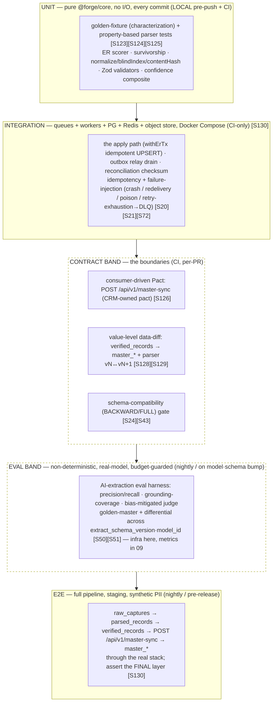

# 18 — Testing Strategy

> **Canonical contract:** this doc owns the **whole test strategy for the TruePoint Forge data
> pipeline** — the **test pyramid** (unit → integration → e2e) tuned for a
> `raw_captures → parsed_records → verified_records → (sync) → TruePoint master graph` pipeline; the
> **golden-fixture (characterization) + property-based** parser tests; the **parser-version
> replay/regression (differential)** suite that a `parser_version` bump must clear; the
> **consumer-driven Pact** contract test for **`POST /api/v1/master-sync`** (Forge is the producer,
> the TruePoint CRM is the consumer/pact-owner); the **Datafold-style value-level data-diff**
> regression; the **async pipeline integration tests** (queues + workers + DB, mirroring TruePoint's
> `apps/workers` platform); the **AI-extraction eval harness *infrastructure*** (metric *definitions*
> stay owned by `09`); the **idempotency + failure-injection** suite that *proves* the
> effectively-once claims of `11`; the **synthetic-PII fixture factory**; and the **CI gate matrix,
> coverage floors, and the local-vs-CI gate split** (Docker itests are CI-only, `ecosystem-facts §D`).
> **Locking ADR: ADR-0047** (Forge owns ER + versioned master-sync — the Pact-tested surface); the
> capture side it exercises is **ADR-0046** (raw API interception).

This doc is the **owner of the deep test-infrastructure detail** every neighbor defers to it. `06
§Versioned parsing` hands "golden-file/characterization + property tests" here [S123][S125]; `08
§Golden-fixture testing hook` fixes only *which gates* a publish must clear and hands the *harness*
here; `09 §The eval / regression harness` keeps the *metric definitions + confidence model* and hands
the *test infrastructure (fixtures, CI wiring, property/differential generators)* here; `11 §8`
specifies the *Pact + data-diff gate* and hands the *CI wiring* here; `16 §CI/CD` names the deploy
stages and hands the *gate definitions* here; `17 §Perf plan` keeps the *target numbers* and hands the
*harness/CI that runs them* here. It does **not** restate the **schema** (`golden_fixture_ref`,
`processed_sync_events`, `sync_state`/`master_id_map` — owned by `05`), the **eval metric definitions +
grounded-confidence model** (owned by `09`), the **per-stage SLO definitions** or the **drift-alarm
store** (owned by `06`/`15`), the **security enforcement** (owned by `14`), the **deploy stages**
(owned by `16`), or the **perf target numbers** (owned by `17`). Current-state TruePoint facts cite
`_context/ecosystem-facts.md` by `§`; best-practice claims cite `[S#]` in `_context/research-corpus.md`;
frozen vocabulary is `_context/decision-ledger.md` (L1–L11).

---

## Objectives

1. Fix the **test pyramid** for a data pipeline: what runs at the **unit**, **integration**, and
   **e2e** tiers, plus the two cross-cutting bands a pipeline needs that a service does not — the
   **contract band** (Pact + schema-compatibility + data-diff at the boundaries) and the **eval band**
   (the non-deterministic AI harness) — and the **cadence** each tier runs at.
2. Specify the **golden-fixture (characterization) + property-based** parser tests and the
   **parser-version replay/regression (differential)** suite: freeze `vN` output, re-parse the corpus
   through `vN+1`, and data-diff — the concrete infrastructure behind `08`'s publish gate [S123][S124][S125].
3. Specify the **consumer-driven Pact** contract test for `POST /api/v1/master-sync` (CRM-owned pact,
   Forge `@forge/sync` client verified against it in CI) and the **value-level data-diff** regression
   for the `verified_records → master_*` mapping [S126][S127][S128][S129].
4. Specify the **async pipeline integration tests** — queues + workers + Postgres + Redis + object
   store via Docker Compose, asserting on the **final layer**, mirroring TruePoint's shipped
   `apps/workers` platform (`ecosystem-facts §C`) [S130] — and the **idempotency + failure-injection**
   suite that proves effectively-once, poison-isolation, and crash-safety (`11`'s success criteria).
5. Specify the **AI-extraction eval-harness infrastructure** (synthetic-PII golden set, precision /
   recall / grounding-coverage / bias-mitigated judge, golden-master + differential across
   `extract_schema_version`/`model_id`) — infra here, metric definitions in `09` — and the
   **synthetic-PII fixture factory** with referential integrity + a no-live-PII CI gate [S131][S132].
6. Fix the **CI gate matrix, coverage floors, and the local-vs-CI gate split** (local pre-push =
   typecheck + biome + unit; CI adds Docker itests, migration-apply, Pact verify, data-diff; nightly =
   the eval harness) and register the testing gaps (`G-FORGE-1801…1808`), risks, milestones, and
   deliverables.

**Non-goals:** the schema (`05`), the eval metric definitions + confidence model (`09`), the per-stage
SLO/drift-alarm store (`06`/`15`), the security enforcement (`14`), the deploy stages (`16`), the perf
target numbers (`17`), and the ADR text (`ADR-0046`/`ADR-0047`).

---

## Industry practice (cited [S#])

The strategy sits on a well-established body of **data-pipeline and contract-testing** practice — the
same problems a dbt/Great-Expectations/Pact/Datafold stack solves, applied to a versioned-parser
pipeline over a *private, undocumented* upstream (Voyager JSON, ADR-0046) whose shape *will* change
without notice.

| Practice | What it establishes | Cite |
|---|---|---|
| **Golden-master / characterization** | Capture the actual current output as a reference file and fail on any *unintended* change — the standard way to pin versioned-parser output before a refactor/version bump (freeze `vN`, re-run `vN+1` on the same raw, diff). | [S123] |
| **Property-based parser tests** | The canonical parser property is the roundtrip invariant `parse(prettyPrint(a)) == a` over generated inputs, with **shrinking** reducing counterexamples to minimal failing cases; metamorphic + stateful variants extend it. | [S124][S125] |
| **Differential testing** | Run **old vs new** parser on the **same** intercepted payload and assert equivalence **except** the intended diff — the parser-equivalence test that catches an accidental regression a bump hides. | [S125] |
| **Consumer-driven contract (Pact)** | The consumer records the request/response pairs it expects into a "pact" the provider verifies against, catching mismatches without a full integration environment; Pact excels at **HTTP/REST**, is weak for async — reinforcing HTTP-push for `/master-sync`. | [S126][S127] |
| **Value-level data-diff** | A row/column value comparison surfaces exact differing rows that row-count/schema-only tests miss; cross-DB diff uses **per-key-range hash fingerprints** (sampling ~24× faster on 1M rows), run early as a PR "Slim Diff" over only changed models, **excluding expected-to-differ columns**. | [S128][S129] |
| **Integration test the final layer** | For async multi-stage pipelines, replicate external systems with **Docker Compose** + mocks, seed representative fixtures, and assert on the **final output layer** (schema/partitioning/presence) rather than inspecting intermediate stages. | [S130] |
| **Test custom code, not framework internals** | Integration-test ROI is maximized by heavily testing custom logic (parsers, dedup, merge) and leaning on **contracts + diff** for third-party/connector boundaries — skip framework internals. | [S130] |
| **Idempotency is provable** | Every mainstream queue/relay is at-least-once, so effectively-once = at-least-once + **idempotent consumer** (dedup-id table + keyed UPSERT); a DLQ isolates poison after an attempt limit — these are *testable* claims, not hopes. | [S20][S21][S23][S72] |
| **Synthetic, referential-integrity-preserving fixtures** | The same input must deterministically map to the same synthetic output across tables/runs; Faker+factory covers most needs, SDV/Synthea for relational integrity at scale. | [S131] |
| **No live PII in fixtures** | Production data used for realistic fixtures must be **masked/tokenized** into synthetic equivalents with realistic formatting + referential integrity — any captured payload is scrubbed to synthetic PII before entering the corpus. | [S132] |
| **LLM-as-judge for eval regression** | Same-prompt+model runs are approximately reproducible, so a bias-mitigated judge (randomize order, hide identity, multiple prompts) enables A/B + regression detection across versions — but structure ≠ correctness, so the judge is one signal among grounding + validator. | [S50][S51][S47] |
| **Schema compatibility is a CI gate** | Data contracts formalize producer/consumer expectations; a violation blocks a PR in CI. BACKWARD/FULL compatibility (additive/optional-with-default only) is mechanically checkable and dictates deploy order. | [S66][S24][S43] |

---

## Current-state — what already exists in TruePoint (cite `ecosystem-facts`)

Forge's test strategy is a **reuse-and-extend** of TruePoint's shipped test posture, not a green field.
The building blocks and the gap each leaves:

| Shipped surface (`ecosystem-facts`) | What it gives the test strategy | The gap this doc closes |
|---|---|---|
| **Bun-native test runner** — `"test": "bun test"` at root, no cached turbo `test` task; **Docker-dependent itests are CI-only** (the coordinator host has no Docker) (`§D`, `04 §Build & tooling`) | the runner + the **local-vs-CI split** posture verbatim — pure unit tests run locally as the pre-push gate, Docker itests run in CI | a Forge test-pyramid + fixture package + CI gate matrix on top of `bun test` (`G-FORGE-1801`) |
| **Worker platform** — one shared `IORedis`, exported `Queue`s, `startWorkers()`, `retryPolicies.ts` (per-queue exponential + jitter, **asserted by the `ALL_RETRY_POLICIES` test**), PII-free `deadLetter.ts`, `withLeaderLock`, `outboxRelay.ts` `FOR UPDATE SKIP LOCKED`, stable-`jobId` dedup (`§C`) | the exact primitives the **async pipeline itests** exercise + the `ALL_RETRY_POLICIES`-style "every queue has a policy" assertion to mirror | Forge itests that stand up PG+Redis+object-store and drive `parse`/`extract`/`resolve`/`verify`/`sync` end-to-end, asserting idempotency + poison-isolation (`G-FORGE-1805`) |
| **Idempotency keys already in the schema** — `raw_captures.content_hash` UNIQUE; `parsed_records (raw_capture_id, parser_version_id)` UNIQUE; `source_records.content_hash` UNIQUE; globally-unique `*_blind_index`; TruePoint-side `processed_sync_events` dedup (`§A/§B`, `05`, `11 §3`) | the exact **invariants the idempotency tests assert** — a double-capture is one row, a replay is an UPSERT not a duplicate, a redelivered sync event is a `duplicate` no-op | a suite that *proves* each UNIQUE/dedup key holds under redelivery + reorder + crash (`G-FORGE-1805`) |
| **AI seam + metering** — `nlSearchAdapter.ts` (Messages API, structured JSON, one repair pass, prompt-injection defense), `promptGuard`/`budgetGuard`, `ai_requests` ledger, ADR-0023 (`§C`) | the **budget-guarded, provider-agnostic** call site the **eval harness** wraps so a real-model eval run is cost-controlled | a synthetic-PII golden set + precision/recall/grounding/judge harness + differential regression on model/schema bumps (`G-FORGE-1807`) |
| **PII scheme** — channel PII as `bytea` AES-GCM `*_enc` ciphertext + globally-unique HMAC `*_blind_index`; the compliance firewall (`§B`, `05`) | the crypto path the **synthetic-PII fixtures** must exercise (encrypt + blind-index over *synthetic* PII) without ever carrying real PII | a synthetic-PII factory with referential integrity + a no-live-PII CI gate; test keys are ephemeral, never prod KMS (`G-FORGE-1806`) |
| **Maker-checker + audit** — `approval_requests` (maker ≠ checker, pending → execute-on-approval), immutable audit (`§C`) | the seams a **negative isolation/authorization test** asserts (a maker cannot approve their own request; a parse role cannot write production) | isolation tests that fail a role-escalation or self-approval regression (`§Security`) |

**The one-line gap.** TruePoint ships a Bun test runner, a worker platform with a retry-policy
assertion, the exact idempotency keys, an AI seam with metering, and a PII scheme — but Forge has **no
test pyramid, no fixture factory, no golden-fixture/differential parser harness, no consumer-driven
Pact wiring, no data-diff regression, no async-pipeline itests, and no AI-eval infrastructure**. This
doc is that harness.

> **Test-hygiene rules carried from TruePoint experience** (applied to `@forge/*`, `bun:test`): itests
> import a sibling package's barrel via its **relative `src/index.ts`**, never as a dev-dependency (a
> dep cycle breaks the turbo build); **never** `mock.module('@forge/db')` — `mock.module` is
> process-global and leaks into the whole suite (turns CI red), so **inject** the dependency (a
> resolver/port) instead; and parallel itests get **isolated DB schemas** per worker so they do not
> cross-talk. These are not `ecosystem-facts` anchors; they are lessons this suite adopts as discipline.

---

## Design

### 1 — The test pyramid for a data pipeline

Forge's pyramid is the classic three tiers plus two bands a *pipeline* needs that a plain service does
not. The tiers differ on **isolation, cost, and cadence** — the base is pure and runs on every commit
*locally*; the middle needs Docker and runs in *CI*; the eval band calls a real model and runs
*nightly*. The shape is deliberate: most confidence comes from a wide, fast base of **pure**
`@forge/core` tests, because Forge's correctness lives in **pure functions** (parsers, the
Fellegi-Sunter scorer, survivorship, normalize/blind-index/content-hash, the confidence composite) that
are cheap to test exhaustively.

| Tier / band | What it covers | Isolation | Where it runs | Cadence |
|---|---|---|---|---|
| **Unit** | pure `@forge/core`: parsers (golden-fixture + property), ER scorer, survivorship, normalize/blind-index/content-hash, Zod validators, confidence composite | none (pure, no I/O) | **local + CI** | every commit |
| **Integration** | queue+worker+PG+Redis+object-store; the `withErTx` apply, outbox relay, reconciliation; idempotency + failure-injection | Docker Compose | **CI-only** (`§D`) | every PR |
| **Contract band** | Pact for `/master-sync`; data-diff `verified_records → master_*` + parser cross-version; BACKWARD compatibility | Pact broker + golden corpus | **CI-only** | every PR |
| **Eval band** | the AI-extraction eval harness (real-model, non-deterministic, budget-guarded) | real model + golden set | **CI (scheduled)** | nightly / on model·schema bump |
| **E2E** | the full `raw_captures → … → master_*` flow through the real stack, synthetic PII, asserting the final layer | full staging topology | **CI/staging** | nightly / pre-release |

The two bands are cross-cutting, not a fourth and fifth *tier*: the **contract band** guards the
producer/consumer boundaries (parser↔downstream, Forge↔CRM) where a service-style itest cannot reach
the other side; the **eval band** is quarantined off the per-commit path because it is
**non-deterministic and costs model spend** — a red eval run *informs* a model/schema bump, it does not
flakily block an unrelated PR.

### 2 — Golden-fixture (characterization) + property-based parser tests

A Forge parser is **pure, deterministic, total, version-bound** (`08 §The parser interface`), which is
exactly what makes it **golden-file characterization-testable** [S123] and **property-testable** [S124].
This section is the *infrastructure* behind `08`'s publish-gate hook.

- **Golden-fixture (characterization).** Every `parser_version` is pinned by a **golden-fixture corpus**
  (`golden_fixture_ref`, an object-store key, `05 §parser_versions`): a set of
  `raw_payload → expected ParseResult` pairs. The test runs `parse(fixture)` and asserts byte-equality
  against the frozen reference; **any unintended output change fails the build** [S123]. A
  `parser_version` **without** a golden fixture **cannot publish** — the gate is
  green-fixture-or-no-publish (`08 §Lifecycle`).
- **Property-based.** Over generated inputs, assert the parser's invariants — a normalize is
  **idempotent** (`normalize(normalize(x)) == normalize(x)`), a total parser **never throws** on any
  generated shape (the `08` "total" invariant — malformed data yields a `ParseError`, not an
  exception), and provenance is **always** emitted; **shrinking** reduces a counterexample to a minimal
  failing payload [S124][S125].
- **The generator is a first-class asset.** The property generator produces structurally-valid *and*
  adversarially-drifted Voyager-shaped payloads (missing keys, renamed fields, unexpected nesting) so
  the parser's `SHAPE_DRIFT` / quarantine behavior (`08 §selection`) is exercised, not just the happy
  path. Generators live in the shared test-support package (§10).
- **Fixtures are synthetic-PII only** (§9) — no live prospect payload ever enters the corpus [S132].

### 3 — Parser-version replay / regression (differential)

When a `parser_version` bumps, the risk is a **silent regression**: `vN+1` changes output the bump did
not intend. The replay/regression suite is the guard, and it *is* `08`'s differential publish gate made
concrete.

1. **Differential over the corpus.** Run `vN` and `vN+1` over the **same** golden raw fixtures and
   **data-diff** the two `parsed_records` outputs; assert they agree **except** the intended diff (the
   `REVISION`/`MODEL` change the SchemaVer bump declares) [S125][S128]. Expected-to-differ fields are
   listed explicitly so noise does not mask a real regression [S129].
2. **Full-corpus replay dry-run.** Before publish, replay the entire golden corpus through `vN+1` and
   assert: (a) no crash (the total invariant holds), (b) **supersede-not-duplicate** — the
   `(raw_capture_id, parser_version_id)` UNIQUE key means each re-derivation is a keyed UPSERT tagged
   `vN+1`, never a second live row (`08 §Replay`, `05 §Group 3`), and (c) the aggregate data-diff is
   **only** the intended change.
3. **Bump-class gating.** An `ADDITION` (additive/backward) clears on a green golden-fixture run alone;
   a `REVISION` requires the differential test; a `MODEL` (breaking output shape) additionally requires
   the downstream-coordination sign-off `08 §Schema evolution` mandates [S24][S43]. This is the
   **replay-when-`parser_version`-bumps** discipline: re-parse a corpus, diff outputs, and refuse to
   publish on an unexplained diff.

The same differential mechanic pins the **AI-extraction** stage across `extract_schema_version`/`model_id`
(§7) — the two share the data-diff engine.

### 4 — Consumer-driven contract (Pact) for `POST /api/v1/master-sync`

The Forge→CRM sync is the one place two independently-deployed codebases meet over a versioned wire
(`11 §1/§8`), so it gets a **consumer-driven Pact** rather than a shared integration environment
[S126]. Pact fits because the transport is **HTTP push** (Pact is strong on HTTP/REST, weak on async —
itself a reason the sync is not an event bus) [S127].

- **Roles (the locked, deliberately-inverted framing).** Forge is the **producer** of golden records;
  the **TruePoint CRM is the consumer** of that data stream and **owns the pact** — it authors the
  request shape it will *accept* and the response it *returns*, and **Forge's `@forge/sync` client is
  verified against that pact in CI** (`11 §8`, Ledger L5, [S126]). This inverts the textbook
  "HTTP-caller owns the pact" convention on purpose (the CRM is the data consumer even though it is the
  HTTP server); the **verification direction** is carried as an open question below (from `11`).
- **What the pact pins.** The `MasterSyncRequest`/`MasterSyncResponse` shapes (`11 §1`), the
  `X-Forge-Sync-Version` header, and the **per-item, partial-success** response — every `outcome`
  (`applied`/`duplicate`/`superseded_stale`/`suppressed`/`rejected`) has a pact interaction, so a
  Forge-side change that drops or renames a field **fails a red build** before it can reach the CRM
  apply (`G-FORGE-1803`, closes the CI half of `11 §G-FORGE-1111`).
- **Compatibility gate rides alongside.** The pact is versioned in SchemaVer and evolves **BACKWARD**
  (additive/optional-with-default only); a CI check asserts the new contract is BACKWARD-compatible with
  the prior version and that the **consumer (CRM) upgrades first** — the mechanical ordering `11 §8`
  requires [S24][S43][S113].

### 5 — Data-diff regression (Datafold-style)

A value-level **data-diff** catches the regressions row-count/schema-only tests miss — a parser that
changed a value, a sync mapping that dropped a column [S128]. Forge uses it in three places, all sharing
one per-key-range-fingerprint engine [S129]:

| Use | Diffs | Key | Excluded (expected-to-differ) [S129] |
|---|---|---|---|
| **Parser cross-version** (§3) | `vN` vs `vN+1` `parsed_records` over golden fixtures | `(raw_capture_id, field_path)` | fields the bump intends to change |
| **Sync mapping** (`11 §8`) | golden `verified_records` vs the `master_*` rows the apply produces | the mirror natural key (`content_hash` / blind index) | Forge-only governance cols (`confidence`, review lineage) |
| **Reconciliation** (prod, `11 §6`) | live Forge `verified_records` vs CRM `master_*` over `master_id_map` | `forge_id ↔ master_id ↔ content_hash` | governance cols; run **sampled** at scale |

The first two are **CI PR gates** run as a **"Slim Diff"** over only the models a PR changed [S129]; the
third is the *production* reconciliation loop `11 §6` owns (this doc owns only that CI shares the engine
and excludes the same governance columns so the two agree). The diff **never logs clear PII** — it
compares the `*_blind_index`/`*_enc` and non-PII columns, honoring the firewall (`§B`).

### 6 — Async pipeline integration tests (queues + workers + DB)

The integration tier stands up the **real async stack** — Postgres + Redis + object store (MinIO) via
Docker Compose — and drives the pipeline, asserting on the **final layer** rather than poking
intermediate stages [S130]. It mirrors TruePoint's shipped `apps/workers` platform verbatim
(`register.ts`, `retryPolicies.ts`, `deadLetter.ts`, `withLeaderLock`, `outboxRelay.ts`, `§C`), so a
Forge itest is the same shape as a TruePoint worker itest — Docker-gated, therefore **CI-only** (`§D`).

- **What is driven.** A seeded `raw_captures` row flows `parse → extract → resolve → verify → sync`
  through real BullMQ queues and workers into real tables; the test asserts the `verified_records` and
  `master_*` rows the pipeline *ends* at (schema, presence, `review_status='confirmed'`), not the
  transient queue state [S130]. Per `[S130]`, the ROI focus is **custom code** (parsers, dedup/merge,
  the apply) — third-party queue internals are trusted, not re-tested.
- **The outbox → sync hop.** An itest proves the `11 §2` sequence: a promotion writes `verified_records`
  **and** the `sync_outbox` row in one `withForgeAdminTx`; the relay drains via `FOR UPDATE SKIP
  LOCKED`; the apply UPSERTs `master_*` under `withErTx` and returns per-item results; `sync_state` +
  `master_id_map` are written back.
- **`ALL_RETRY_POLICIES`-style assertion.** Mirroring TruePoint's shipped test (`§C`), a Forge test
  asserts **every** BullMQ queue (`parse`/`extract`/`resolve`/`verify`/`quality`/`sync`/`maintenance`)
  has a declared retry policy **and** a DLQ path — a new queue without one fails CI.
- **Injected deps, not mocked modules.** The apply and relay take their DB handle / clock / model port
  as **injected** dependencies so an itest swaps them without `mock.module` (which leaks globally —
  see the hygiene note above).

### 7 — AI-extraction eval harness (infrastructure; metrics owned by `09`)

The AI-extract stage is **non-deterministic** and calls a real model, so it cannot live on the
per-commit path. `09 §The eval / regression harness` owns the **metric definitions + the
grounded-confidence model**; this doc owns the **infrastructure that runs them**.

- **Golden set.** A versioned, **synthetic-PII** corpus of `raw_payload → expected-extraction` fixtures
  spanning each entity kind and the known free-text edge cases (§9) [S132].
- **Metrics computed** (definitions in `09`): field-level **precision / recall / F1** vs the expected
  extraction, **grounding-coverage** (each extracted value maps to a raw char-offset [S48]), and a
  **bias-mitigated LLM-as-judge** score (randomize order, hide model identity, multiple prompts) [S50][S51].
- **Regression across versions.** Golden-master + **differential** (the §5 engine) across
  `(extract_schema_version, model_id)`; a schema or model bump is **gated by a passing diff on the
  golden set** (`09 §M-FORGE-C₄`) — structure ≠ correctness, so a green *structured-output* run is not
  enough, the judge + grounding must hold too [S47].
- **Budget-guarded + scheduled.** The harness wraps the same `budgetGuard`/metering as production
  (`ai_requests`/`extraction_runs`, `§C`, `09`), runs **nightly / on-bump** (not per-commit), and pulls
  the model key from the CI secret store. Drift monitors keyed to `extract_schema_version` + raw
  fingerprint feed the alarm store `15` owns (this doc owns the harness, not the alarm plane) [S103].

### 8 — Idempotency + failure-injection tests

This is the suite that **proves** `11`'s effectively-once success criteria instead of asserting them in
prose. Each row is a test that injects a fault and asserts the pipeline converges to one correct state.

| Injected condition | Assertion | Grounding |
|---|---|---|
| **Double capture** (same `raw_payload` twice) | one `raw_captures` row (`content_hash` UNIQUE); the second is a no-op | [S20], `§A` |
| **Parser replay** (re-parse under same version) | UPSERT to the same `(raw_capture_id, parser_version_id)` row, never a duplicate | [S123], `08 §Replay` |
| **Sync redelivery** (relay publishes twice) | second is `duplicate` (`processed_sync_events` `ON CONFLICT DO NOTHING`); `master_*` unchanged | [S21], `11 §3` |
| **Out-of-order sync** (`version` ≤ last applied) | `superseded_stale` no-op; the newer row survives | [S23], `11 §5` |
| **Poison item in a batch** | the item is `rejected` → DLQ after N; **the rest of the batch still applies** (partial success) | [S72], `11 §7` |
| **Worker crash mid-batch** | the outbox row stays `pending` (never `dispatched`) → another worker re-drains; idempotent apply makes it safe | [S20][S73], `11 §7` |
| **Retry-exhaustion** | after N attempts → DLQ + **alert on exhaustion** (not on first failure) | [S72][S102] |
| **Redis outage during capture rate-limit** | `checkCaptureRate` **fails open** (a throttle, not a security control) — capture proceeds | `§A` |
| **Erasure fan-out** (`verified.suppressed`) | `master_persons.is_suppressed=true`; subject drops from masked search; not double-appliable | [S117], `11 §5` |

These run at the integration tier (Docker stack) and are the **highest-value** tests in the suite —
they are what let `11` claim effectively-once, poison-isolation, and crash-safety as *verified*, not
hoped-for (`G-FORGE-1805`, `G-FORGE-1808`).

### 9 — Synthetic-PII fixture factory

No live prospect PII ever enters the test corpus — a hard rule (`§B` firewall; [S132]; staging is
synthetic/masked too, `16 §194`). The factory is a shared, dev-only asset:

- **Deterministic, referential-integrity-preserving.** A seeded generator (Faker + factory) mints
  synthetic Voyager-shaped payloads such that the **same logical person threads through every layer** —
  the synthetic person in a `raw_captures` fixture is the same synthetic person in the expected
  `parsed_records`, `verified_records`, and `master_*` rows [S131]. This is what lets an e2e test assert
  the final `master_*` row corresponds to the seeded input.
- **The crypto path is exercised on synthetic PII.** Fixtures run the **real** AES-GCM `*_enc` +
  HMAC `*_blind_index` path (`§B`) over synthetic emails/phones with realistic formatting, so the
  encryption/blind-index code is tested — but the keys are **ephemeral test keys / a test-KMS**, never
  prod KMS (§Security).
- **A scrubber for captured payloads.** If a real intercepted payload is ever used to build a realistic
  fixture, it passes through a **mask/tokenize** step that replaces every PII value with a synthetic
  equivalent preserving format + referential integrity **before** it can be committed [S132].
- **A no-live-PII CI gate.** A CI check scans the fixture corpus for real-PII patterns (email/phone
  shapes against a known-synthetic allowlist) and **fails the build** on a suspected live value — the
  enforcement that makes "synthetic-only" a gate, not a guideline (`G-FORGE-1806`).

### 10 — CI gates, coverage floors, and the local-vs-CI split

The gate split is dictated by one hard constraint: **the coordinator host has no Docker** (`§D`), so
Docker-dependent itests are **CI-only**, while the pure gates run **locally as the pre-push check**.

```mermaid
flowchart LR
    subgraph LOCAL["LOCAL pre-push (no Docker) — fast, every commit"]
      L1["turbo typecheck"] --> L2["biome check ."]
      L2 --> L3["bun run lint:boundaries (depcruise)"]
      L3 --> L4["bun test — UNIT only<br/>golden-fixture + property + pure @forge/core"]
    end
    L4 -->|push| CI
    subgraph CI["CI (GitHub Actions) — per PR"]
      C0["typecheck · biome · lint:boundaries · unit (re-run)"]
      C0 --> C1["Docker Compose itests<br/>PG + Redis + MinIO — pipeline + idempotency + failure-injection [S130]"]
      C1 --> C2["migration-apply vs real Postgres (generate unsafe, §D)"]
      C2 --> C3["consumer-driven Pact verify: /master-sync [S126]"]
      C3 --> C4["data-diff Slim Diff: parser vN↔vN+1 + verified→master [S128][S129]"]
      C4 --> C5["schema-compatibility (BACKWARD) gate [S24]"]
    end
    C5 -->|green| MERGE["merge → deploy stages (16)"]
    subgraph NIGHT["SCHEDULED (nightly / on model·schema bump)"]
      N1["AI-extraction eval harness (real model, budget-guarded) [S50][S51]"]
      N2["full e2e: raw_captures → … → master_* (staging, synthetic PII)"]
    end
    MERGE -.-> NIGHT
```

**Coverage floors** — a floor, never the goal (property/differential tests catch what line-coverage
misses [S124][S125]); exact numbers are pilot-calibrated (local OQ):

| Surface | Floor | Rationale |
|---|---|---|
| `@forge/core` pure logic (parsers, ER scorer, survivorship, normalize/blind-index/content-hash, confidence composite) | **line ≥ 90%** | correctness lives here; cheap to cover |
| Every `parser_version` | **100% carry a golden fixture** | a version without one cannot publish (`08` gate) |
| The sync apply **outcome matrix** (`applied`/`duplicate`/`superseded_stale`/`suppressed`/`rejected`) | **100% branch** | every outcome has an itest (`§8`) |
| Every BullMQ queue | **has a retry policy + a DLQ path** | the `ALL_RETRY_POLICIES`-style assertion (`§C`, `§6`) |
| The `/master-sync` contract | **100% of interactions in the pact** | a dropped field fails CI (`§4`) |

**Local-vs-CI split** (the operating rule): **local** runs typecheck + biome + `lint:boundaries` +
**unit** — the green-before-push gate the coordinator host *can* run (`§D`, memory: local gates pre-gate
pushes); **CI** adds everything Docker-dependent — itests, migration-apply, Pact verify, data-diff,
compatibility — plus the **nightly** eval harness + e2e. A test green locally but red only in CI (a
Docker-only path) is a known risk (§Risks); the mitigation is that the *local* suite is a strict subset
of the CI suite, never a divergent one.

---

## Security considerations

Security has final say (CLAUDE.md precedence); enforcement is owned by `14`. The test-strategy
obligations:

- **No live prospect PII in any fixture — enforced, not requested.** Synthetic-only, referential
  integrity, mask/tokenize any captured payload, and a **no-live-PII CI gate** that fails the build
  (§9, [S132]). Staging is synthetic/masked too (`16 §194`). This is the compliance firewall's
  test-surface expression (`§B`, `03 §firewall`).
- **Test crypto uses test keys.** Fixtures exercise the real AES-GCM + HMAC path over synthetic PII, but
  with **ephemeral test keys / a test-KMS** — the prod KMS KEK never touches CI (SOC 2 key-admin/dev
  separation, [S122]).
- **Isolation is tested, not assumed.** A **negative** itest asserts the per-layer role model
  (`§D`, `05 §roles`): the `parse` role **cannot** write `verified_records` or the sync path, and the
  `forge_sync` reader **cannot** read `raw_captures` — so a role-escalation regression **fails a test**
  [S121]. This is the isolation test CLAUDE.md's precedence rules demand for any privileged write path.
- **Maker-checker is tested at the code level.** A test asserts a maker **cannot approve their own**
  `approval_request` (parser publish, bulk merge, hard-erase) — segregation of duties enforced in the
  write path, not just the UI [S57][S59][S115].
- **The sync itests use a test system-principal.** The `/master-sync` itests mint a **test** service JWT
  (test issuer, `aud=truepoint-api`, `scope=master-sync`) — never the prod sync credential, the
  highest-value secret in the estate (`11 §4`, [S119]). Failure-injection suites are env-gated so they
  cannot run against production.
- **The data-diff never leaks PII.** It compares `*_blind_index`/`*_enc` + non-PII columns and logs
  neither clear PII nor decrypted values (§5, `§B`).

---

## Scalability considerations

Deep capacity/topology is owned by `17`; the test-suite's own scale posture:

- **Suite runtime is tiered like the pyramid.** Unit is milliseconds (runs on every commit locally);
  Docker itests are minutes (CI per-PR); the eval harness + e2e are the slowest and costliest (nightly
  only) — so the fast feedback loop stays fast while the expensive checks still run [S130].
- **Data-diff samples, it does not scan.** Per-key-range fingerprints + sampling keep a regression diff
  cheap over a large golden corpus (~24× on 1M rows), and **Slim Diff** runs only PR-changed models
  [S128][S129] — the same technique the production reconciliation loop uses (`11 §6`).
- **Itests parallelize on isolated schemas.** `bun test` runs parallel; each itest worker gets an
  **isolated DB schema** (or a testcontainer shard) so parallel runs do not cross-talk — the hygiene
  rule above, at scale.
- **Golden fixtures live in the object store past the size cliff.** Large `raw_payload` golden fixtures
  are object-store-backed (`golden_fixture_ref`), not committed blobs, respecting the ~2 kB TOAST cliff
  and keeping the repo lean; a hot subset stays in-repo (**OQ-4**) [S82].
- **Replay regression is corpus-scoped, not production-scoped.** The full-corpus replay dry-run (§3)
  runs over the *golden* corpus (a curated sample), not a full re-parse of production volume — mirroring
  the partition-scoped, sampled replay `06`/`08` own.
- **The eval harness is the cost lever.** It is the only tier that spends model budget, so it is
  budget-guarded + scheduled; a version bump is a *deliberate, tested* event, not a per-commit spend
  (`09 §Cost`, [S47]).

---

## Risks & mitigations

Testing-strategy gaps use this doc's disjoint **`G-FORGE-1801…1808`** block (`decision-ledger` L9 —
gap-IDs are unique across the suite, each doc owning its own numbering range). IDs map to
`28-enterprise-readiness-audit.md` and to parent
`G-FORGE-0x`/neighbor gaps where relevant. The golden-fixture *gate* (`08 G-FORGE-805`), the eval
*harness design* (`09 G-FORGE-905`), and the sync *contract gate* (`11 G-FORGE-1111`) are referenced as
parents — this doc closes the **infrastructure** half of each.

| Risk / gap | Area | L × I | Mitigation (cite) | Parent |
|---|---|---|---|---|
| **G-FORGE-1801** — no Forge **test pyramid / fixture package / CI gate matrix** on top of `bun test`; tests ad-hoc, no repeatable gate | platform | High × High | the pyramid + `@forge/testing` + the CI matrix (`§1`, `§10`) | — |
| **G-FORGE-1802** — **golden-fixture + property + differential** parser harness unbuilt; `08`'s publish gate has no infra | data | High × High | the characterization/property/differential harness + generators (`§2`, `§3`) [S123][S124][S125] | G-FORGE-805 |
| **G-FORGE-1803** — no **consumer-driven Pact** for `/master-sync`; a Forge change can break the CRM apply silently | platform | Med × High | CRM-owned pact + `@forge/sync` verify in CI + BACKWARD gate (`§4`) [S126][S24] | G-FORGE-1111/1105 |
| **G-FORGE-1804** — no **data-diff** regression (parser cross-version + `verified→master`); value-level regressions reach prod | data / platform | Med × High | per-key-range fingerprint Slim Diff, governance-cols excluded (`§5`) [S128][S129] | G-FORGE-1111 |
| **G-FORGE-1805** — no **async pipeline itests** proving idempotency / effectively-once / poison-isolation; `11`'s criteria unverified | platform | High × High | Docker-stack itests + the idempotency + failure-injection suite (`§6`, `§8`) [S130][S21][S72] | G-FORGE-1107/1108 |
| **G-FORGE-1806** — **synthetic-PII fixture factory** + the **no-live-PII CI gate** unbuilt; risk of real PII in the corpus | security / data | Low × High | deterministic referential-integrity factory + scrubber + CI gate (`§9`) [S131][S132] | — |
| **G-FORGE-1807** — **AI-eval harness infra** (synthetic golden set, precision/recall/grounding/judge, differential) unbuilt; a model/schema bump ships unmeasured | data / operations | High × Med | the harness (`§7`); metric defs in `09`, alarm store in `15` [S50][S51][S123] | G-FORGE-905 |
| **G-FORGE-1808** — no **failure-injection/chaos** suite (crash mid-batch, redelivery, Redis outage, retry-exhaustion→DLQ); resilience claims untested | operations / platform | Med × High | the failure-injection matrix (`§8`) [S20][S72][S73] | G-FORGE-1110 |
| Flaky itests erode the gate (teams start ignoring red) | operations | Med × Med | isolated schemas, injected deps (no `mock.module` leak), deterministic seeds; quarantine + fix, never skip |
| Eval-harness non-determinism **false-fails** a deploy | operations | Med × Med | eval is a **scheduled band**, not a per-commit blocker; a red eval *informs* a bump, bias-mitigated judge + multiple prompts (`§7`) [S51] |
| Coverage becomes a **vanity metric** (high % , low assurance) | data | Med × Med | coverage is a **floor**; property/differential/mutation carry real assurance (`§10`) [S124][S125] |
| **Local↔CI drift** — green locally, red only in CI (Docker-only path) | platform | Med × Med | local suite is a strict **subset** of CI; CI re-runs the local gates (`§10`, `§D`) |
| Pact **verification-direction** confusion (inverted consumer framing) breaks the gate | platform | Low × Med | document the CRM-owns-pact mechanic explicitly; carry the direction OQ (`§4`, `11`) [S126][S127] |

---

## Milestones

Testing is cross-cutting, so it threads a **M-FORGE-T** track through the build order (`03 §Milestones`),
each sub-milestone **gating** the phase it protects.

| Milestone | Delivers (testing) | Gates | Exit criterion |
|---|---|---|---|
| **M-FORGE-T.1 — Unit + fixture foundation** | `@forge/testing`; the synthetic-PII factory + no-live-PII CI gate; the golden-fixture + property harness + generators | **M-FORGE-B** (parse) | a parser publishes only on a green golden fixture; the property suite catches a seeded regression; no live PII passes the gate [S123][S132] |
| **M-FORGE-T.2 — Async pipeline itests** | Docker Compose (PG+Redis+MinIO); pipeline itests asserting the final layer; the idempotency + failure-injection matrix; the `ALL_RETRY_POLICIES`-style queue assertion | **M-FORGE-C/E** | a double-capture is one row, a replay is a no-op, a poison item DLQs without wedging the batch, a crash re-drains safely [S130][S21][S72] |
| **M-FORGE-T.3 — Contract + data-diff gate** | CRM-owned Pact for `/master-sync` + `@forge/sync` verify; parser cross-version + `verified→master` data-diff; the BACKWARD compatibility gate | **M-FORGE-E** (sync) | a Forge-side contract change fails CI before it reaches the CRM; a mapping regression is caught by the Slim Diff [S126][S128][S24] |
| **M-FORGE-T.4 — AI eval harness** | synthetic golden set; precision/recall/grounding/judge; golden-master + differential across `extract_schema_version`/`model_id`; budget-guarded scheduling | **M-FORGE-C** (extract) bumps | a schema/model bump is gated by a passing diff on the golden set; a grounding-coverage drop alarms [S50][S51][S123] |
| **M-FORGE-T.5 — CI wiring + coverage floors + e2e** | the full CI gate matrix + the local-vs-CI split; coverage floors; the nightly eval + full e2e | **GA** | every gate in `§10` is wired; the local pre-push subset is green-before-push; the nightly e2e lands a synthetic record end-to-end in `master_*` |

---

## Deliverables

1. The **test pyramid** for the pipeline — unit / integration / e2e plus the contract and eval bands,
   with the per-tier isolation + cadence table and its Mermaid (`§1`).
2. The **golden-fixture (characterization) + property-based** parser harness and the
   **parser-version replay/regression (differential)** suite — the infrastructure behind `08`'s publish
   gate (`§2`, `§3`).
3. The **consumer-driven Pact** wiring for `POST /api/v1/master-sync` (CRM-owned pact, `@forge/sync`
   verified in CI) and the **value-level data-diff** engine + its three uses (`§4`, `§5`).
4. The **async pipeline integration tests** (Docker Compose, assert-the-final-layer) and the
   **idempotency + failure-injection** matrix that proves `11`'s effectively-once claims (`§6`, `§8`).
5. The **AI-extraction eval-harness infrastructure** (metrics owned by `09`) and the
   **synthetic-PII fixture factory** + no-live-PII CI gate (`§7`, `§9`).
6. The **CI gate matrix, coverage floors, and the local-vs-CI split** with its Mermaid, and the gap
   register `G-FORGE-1801…1808` (`§10`).

---

## Success criteria

1. **A `parser_version` cannot publish without a green golden fixture**, and a bump's output change is
   **provably intentional** — the differential diff shows only the declared change [S123][S125]. ✅
2. **A Forge-side `/master-sync` change fails CI before it reaches the CRM** — the CRM-owned Pact + the
   BACKWARD-compatibility gate catch a dropped/renamed field on a red build [S126][S24]. ✅
3. **Every effectively-once claim in `11` is a passing test, not prose** — double-capture, replay,
   redelivery, out-of-order, poison, crash, retry-exhaustion each have an itest that converges to one
   correct state [S20][S21][S72]. ✅
4. **No live prospect PII ever enters the corpus** — synthetic-only, referential integrity, and a CI
   gate that fails on a suspected live value [S131][S132]. ✅
5. **The AI-extract stage is measured, not assumed** — a model/schema bump is gated by a passing diff on
   a synthetic golden set (precision/recall/grounding/judge), bias-mitigated, budget-guarded [S50][S51]. ✅
6. **The pipeline is integration-tested at the final layer** through the real async stack, and
   **isolation is a negative test** (a parse role cannot write production; a maker cannot self-approve)
   [S130][S121][S57]. ✅
7. **The gate split respects the no-Docker host** — the local pre-push suite (typecheck + biome +
   boundaries + unit) is a strict subset of CI, which adds the Docker itests, Pact, data-diff, and the
   nightly eval (`§D`). ✅
8. **No test claim is answered from first principles where a `§`/`[S#]` grounds it** — every reuse cites
   `ecosystem-facts`, every best practice cites `[S#]` (CLAUDE.md mandatory-read rule). ✅

---

## Future expansion

- **Mutation testing** on `@forge/core` — flip an operator in the parser/ER/survivorship code and
  confirm a test fails; the real assurance metric behind the coverage floor (`§10`) [S124][S125].
- **Metamorphic ER property tests.** Assert merge algebra — dedup is **commutative/associative**
  (merge order does not change the golden cluster), and a term-frequency bonus never *lowers* a rare-name
  match weight — the metamorphic frame [S125] applied to the Fellegi-Sunter engine (`ecosystem-facts §C`).
- **Contract-test the capture SDK envelope v2.** Extend consumer-driven contract testing to the
  **`@forge/capture-sdk` → Forge ingest** boundary so the extension and the ingest API cannot drift on
  the `raw_payload`/`endpoint`/`schema_version` shape (**OQ-6**) [S126].
- **Fuzzing the parser with real drifted payloads.** Feed captured-then-scrubbed drifted Voyager
  payloads into the property generator so `SHAPE_DRIFT`/quarantine handling is fuzz-tested against the
  actual upstream, not only synthetic drift (`08 §drift`) [S53].
- **Test-impact analysis.** Run only the tests a diff affects (a parser change runs its golden +
  differential + the sync data-diff, not the whole suite) to keep the CI loop fast as the suite grows.
- **Weak-supervision eval (OQ-R10).** If Forge treats parsers + AI + human as **labeling functions**
  combined by a label model, the eval harness must score the *combined* consensus, not each stage
  alone — a different "correct" than per-stage golden-master [S62].
- **Load/soak harness (hand to `17`).** The perf plan's target numbers live in `17`; the harness that
  drives them (a synthetic-capture load generator against the Docker/staging stack) is a natural
  extension of the e2e tier.

---

## Open questions

The full register lives in `_context/decision-ledger.md` (L11, OQ-1…6) and `01`'s research register
(OQ-R1…20); the test-shaping ones surface here.

- **New (this doc) — Coverage floors + eval cadence are pilot-calibrated.** The `≥90%` line floor, the
  `100%` outcome-matrix branch target, and the nightly-vs-on-bump eval cadence are starting values to
  tune on real Forge signal — do not adopt a fixed number blind (mirrors `09`'s OQ-R13 posture) [S49].
- **From `11` — Pact verification direction.** The corpus/ADR lock the **CRM as the pact owner** [S126];
  this doc adopts that (CRM authors the accepted-request/returned-response pact; Forge's `@forge/sync`
  client is verified against it in CI) but the inversion of the standard "HTTP-caller owns the pact"
  framing is confirmed only at Stage-8 [S126][S127].
- **OQ-R10 — Human-only verification vs weak-supervision auto-verify.** Whether the eval harness scores
  each stage's golden-master or a **combined** label-model consensus changes what the eval asserts;
  drives `§7`/`§Future expansion` [S62].
- **OQ-R16 — Parser-version staged (observe-only → block) rollout.** The differential/replay suite gates
  *publish*, but the non-atomic cache-invalidation rollout (`08 §Scalability`) needs its own
  integration test for a mixed-version fleet mid-rollout [S43][S45].
- **OQ-4 — Golden-fixture substrate (object store vs in-repo).** Where large `raw_payload` golden
  fixtures live (object-store-large / in-repo-small) governs both the TOAST-cliff cost and repo weight;
  drives `§Scalability` [S82].
- **OQ-6 — Capture-SDK single-sourcing.** A shared `@forge/capture-sdk` keeps the emitted
  `schema_version` and the parser's accepted-input set in lockstep (contract-testable, `§Future
  expansion`); a fork risks them drifting and needs a *cross-repo* contract test [S126].
- **OQ-2 (informational) — Interception legal sign-off (GA-blocking).** Testing can prove the *capture
  pipeline* works (ADR-0046); it **cannot** validate the legal/ToS/compliance posture — that is
  counsel's call, not a test gate (carried so no one mistakes a green suite for legal clearance) [S116][S118].
- **Local — home of the test-support package.** This doc proposes a dev-only **`@forge/testing`**
  workspace for the fixture factory + generators + Pact/data-diff runners; it is **not** in the locked
  L8 monorepo layout (`decision-ledger` L8), so its exact home (a standalone package vs `@forge/core`
  test utilities) is a Stage-8 reconciliation.
