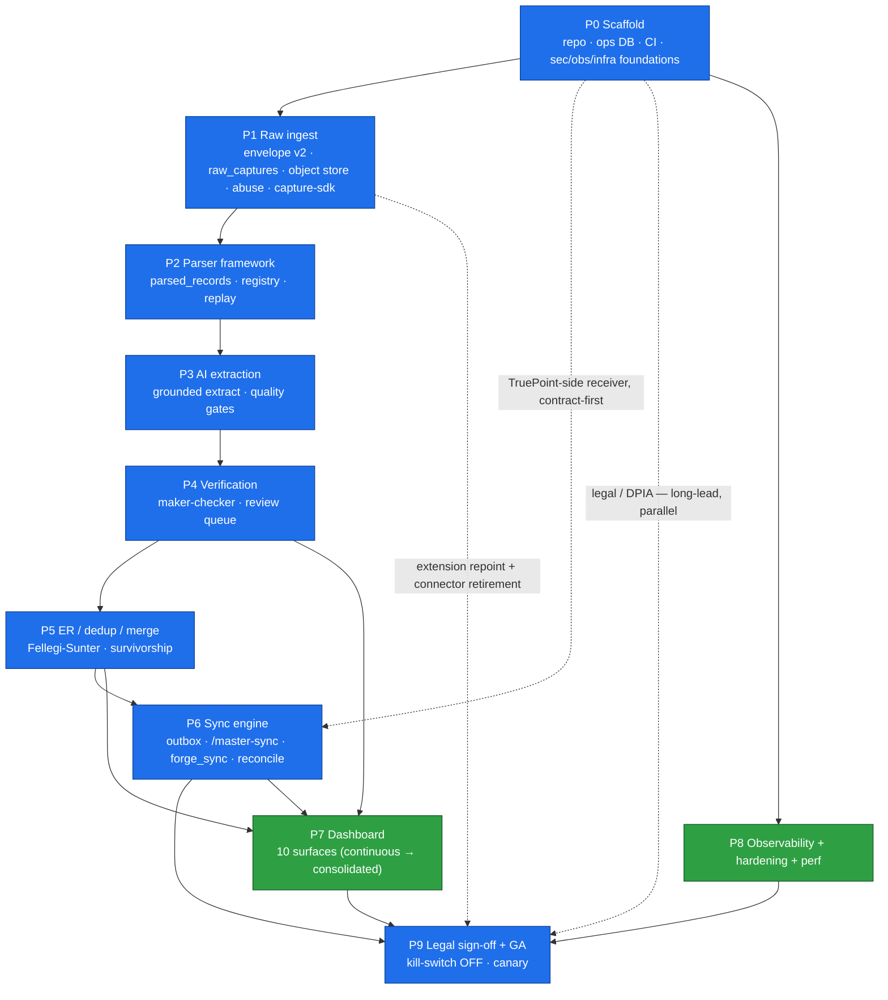

# 19 — Implementation Roadmap

> **Canonical contract:** this doc is the **settled owner of the detailed build sequence** for TruePoint
> Forge — the ten phases **P0…P9**, their dependency graph, what may run in parallel, the **critical
> path**, the **cross-repo migration/retirement of TruePoint's dark `chrome_extension` connector**
> (repointing the extension at Forge, **OQ-5**), and a **definition-of-done per phase** aligned to the
> QSA / green gate. It is the doc `03 §Milestones` explicitly defers to ("the roadmap doc owns the
> detailed sequencing and dependencies"), and it reconciles the per-doc **M-FORGE-A…F** milestone
> lattice (`03`/`04`/`06`/`07`/`08`/`09`/`10`/`11`/`12`/`13`/`14`/`15`/`16`/`17`) into one build order.
> **Locking ADRs: ADR-0046** (raw API interception as primary capture) **+ ADR-0047** (Forge owns ER +
> versioned `POST /api/v1/master-sync`).

This doc is the **owner of the deep sequencing detail** — it schedules the work but does **not restate**
what each neighbour owns. It does not redefine the service boundary (`03`), the directory tree or
boundary gate (`04`), the schema (`05`), the stage contracts (`06`), the ingest API / envelope v2
(`07`), the parser framework (`08`), the extraction adapter (`09`), the review/approval executor (`10`),
the sync wire contract (`11`), the queue map (`12`), the console IA (`13`), the security enforcement
(`14`), the telemetry (`15`), the infra footprint (`16`), or the capacity model (`17`). It cites those
owners and orders their delivery. Current-state TruePoint facts cite `_context/ecosystem-facts.md` by
`§`; industry practice cites `[S#]` in `_context/research-corpus.md`; frozen vocabulary is
`_context/decision-ledger.md` (L1–L11). The four-layer flow is always
**`raw_captures → parsed_records → verified_records → (sync) → TruePoint master graph`** (L2).

> **Numbering note.** The suite references an **entity-resolution design** and a **testing-strategy doc
> (`18`)** that are not yet authored in this 01–17 set; the ER engine's math is owned by `@forge/core`
> (L4, `10 §3`) and the CI-gate harness by the planned `18`. Where a cross-link's number is not yet
> stable, this doc names the **topic owner**; the Stage-8 consistency pass reconciles digits. These two
> not-yet-written owners are tracked as **G-FORGE-1901 / G-FORGE-1902** and both are on the critical path.

---

## Objectives

1. Turn the seventeen design docs into **one ordered, buildable delivery plan** — ten phases with, for
   each: objective, scope, deliverables, dependencies, risks, testing, a **provable phase-exit
   definition-of-done**, and a complexity estimate.
2. Fix the **critical path** (the longest dependency chain from empty repo to GA) and make explicit
   **what parallelises** off it — so up to four worker branches stay in flight without colliding on the
   remote (main-agent-prompt §7).
3. Sequence the **cross-repo work**: the TruePoint-side `POST /api/v1/master-sync` receiver + `forge_sync`
   connector, and the **migration/retirement of the dark `chrome_extension` connector** with the
   extension repointed at Forge (`ecosystem-facts §A/§E`, **OQ-5**, ADR-0046).
4. Keep **capture-undark** (`P1` flag) and **sync-egress-live** (`P6` flag) behind kill-switches until
   **`P9` legal sign-off** (OQ-2, ADR-0046) — the pipeline is exercised end-to-end on **synthetic PII in
   staging** (`16 §M-FORGE-A′`) [S132] throughout, so no live PII and no production write happens before GA.
5. Bind every phase to a **definition-of-done aligned to the QSA / green gate** (main-agent-prompt §11,
   `ecosystem-facts §D/§F`, `04 §Success criteria`) so "done" is provable, not asserted.

---

## Industry practice (cited [S#])

| Practice | What it means for the roadmap | Cite |
|---|---|---|
| **Medallion build order** — never ingest directly to silver; each tier is built by reading the tier below | The build order **is** the dataflow order: `raw_captures` (P1) before `parsed_records` (P2) before extraction/verify (P3/P4) before sync (P6) | [S81] |
| **Contract-first across service boundaries** — consumer-driven Pact, HTTP-testable | Freeze envelope v2 + `MasterSyncRequest` in `@forge/types` at **P0/P1** so the TruePoint-side receiver can be built **in parallel** (CRM owns the pact) | [S126][S127] |
| **Characterization / golden-master + differential + property gates** before a version bump | The parser (P2) and extraction (P3) publish gates block a version until a green diff on synthetic-PII fixtures | [S123][S125][S124] |
| **Staged rollout: observe-only → block** | Parser versions and DQ contracts roll out in observe-only before they gate promotion — de-risks each phase's cut-over | [S45] |
| **Effectively-once at the boundary** — at-least-once transport + idempotent apply, built once at the sync seam | The outbox + idempotent `/master-sync` upsert is a **single phase (P6)**, not sprinkled across earlier ones | [S20][S21][S23][S72] |
| **Progressive delivery** — expand/contract migrations, blue-green then metric-gated canary | GA (P9) ships behind a canary that auto-rolls-back on SLO regression; every deploy tolerates two versions | [S112][S113] |
| **Reconciliation as a safety net** — periodic checksum/data-diff between source and sink | Built with the sync (P6), asserted at scale in P8 | [S25][S128][S129] |
| **Synthetic-data-first in lower environments** | All of P1–P8 run on scrubbed synthetic PII; live capture and production write stay dark until P9 | [S131][S132] |
| **Long-lead compliance runs in parallel** — DPIA/LIA, Art 14 notice, single-purpose declaration are calendar items, not code | Legal sign-off (OQ-2) starts **Day 1 of P0** and is the parallel critical path to GA, not a P9 task that begins at P9 | [S116][S118][S16] |
| **Weighted DQ + five-pillar observability from the first commit** | Telemetry (P8) is threaded through every phase, not bolted on last; the two planes are wired at P0 | [S63][S64][S96] |

---

## Current-state / what already exists in TruePoint (cite ecosystem-facts)

The roadmap is **not** a greenfield: it stands up a new `truepoint-forge` repo but reuses TruePoint
patterns wholesale, and it retires one dark seam.

- **The ingestion stub is the gap Forge fills.** `POST /api/v1/ingest` today validates the envelope and
  returns `202` storing **nothing** (`§A`); the dark `chrome_extension` connector is registered **only if
  `CHROME_EXTENSION_ENABLED`** and otherwise `POST /ingest` returns `400 "no connector"` (`§A`). Forge
  builds the real pipeline behind a **new** contract (envelope v2, `@forge/types`), never an edit to
  `packages/types/src/ingestion.ts` (`§A`, L3).
- **The sync target exists schema-only.** `master_companies`/`master_persons`/`source_records`/
  `match_links` are shipped but have **no pipeline** feeding them (`§B`); ADR-0047 makes them a
  **downstream serving projection** fed only by `POST /api/v1/master-sync`. `source_records.content_hash`
  is already `UNIQUE` → the idempotency key the sync reuses (`§B`).
- **Reuse-and-extend, do not rebuild** (`§C`): the connector-registry pattern (→ `forge_sync`),
  maker-checker `approval_requests` + `data:*` staff RBAC, the import pipeline, enrichment/verification
  ledgers, the Fellegi-Sunter scorer (`er/fellegiSunter.ts`), the worker platform (`retryPolicies`/
  `deadLetter`/`leaderLock`/`outboxRelay`/`metrics`), the Anthropic seam (`nlSearchAdapter.ts`), and the
  audit writers. Forge **mirrors** each; it does not fork `@leadwolf/*` (L1).
- **The extension is mid-pivot.** It captures visible-DOM fields only and posts to TruePoint's `/ingest`
  today (`§E`); ADR-0046 moves it to **MAIN-world raw interception posting envelope v2 to Forge, never to
  TruePoint** (`§E`). Retiring the dark `chrome_extension` connector and repointing the extension is a
  first-class roadmap deliverable (**OQ-5**, `§ P1 / § Extension migration`).
- **Migrations are hand-authored; `drizzle-kit generate` is unsafe** (`§D`) — every phase that adds a
  table ships a hand-authored, CI-verified migration (the coordinator host has no Docker → new-table work
  is CI-gated).
- **The green gate is real** (`§F`, main-agent-prompt §11): nothing reaches `main` until QSA `APPROVED`
  **and** tests, lint/typecheck, `lint:boundaries`, security/secret scan, and brand+skill compliance all
  pass on a conflict-free rebase. Every phase below inherits that gate verbatim.

---

## Design — the phased build plan

### The phase spine (P0…P9 ↔ M-FORGE-A…F)

The suite's per-doc milestones use the letters **M-FORGE-A…F**; this roadmap refines them into ten
build phases. The mapping is deliberately **many-to-many**: the roadmap splits **M-FORGE-C**
(extract + resolve) into **P3** (extract + quality) and **P5** (ER/dedup/merge), and inserts the
**P4** verification framework between them (rationale in the critical-path note).

| Phase | Name | Owns / lands | M-FORGE | Owner docs | Complexity |
|---|---|---|---|---|---|
| **P0** | Scaffold | monorepo, ops DB + first migration, CI + boundary gate, security/obs/infra foundations | A (structure) | 03, 04, 14, 15, 16 | M |
| **P1** | Raw ingest + storage | envelope v2, `raw_captures`, object store, abuse controls, capture-sdk, **extension repoint** | A (S0) | 07, 05, 12, 04 | L |
| **P2** | Parser framework + registry + replay | versioned parsers → `parsed_records`, drift→quarantine, supersede-not-duplicate | B | 08, 06 | L |
| **P3** | AI extraction + quality validation | Anthropic grounded extraction, grounded-confidence, weighted-DAMA gates | C (extract) | 09, 06, 05 §Group 5 | L |
| **P4** | Verification & approval | maker-checker executor, ranked `review_tasks` queue, promotion → `verified_records` | D | 10 | L |
| **P5** | Dedup / ER / merge / survivorship | Forge-owned Fellegi-Sunter (TF + blocking + two thresholds), BVT survivorship, merge-review drawer | C (resolve) + D.1 | 05 §Group 6, 06, 17, 10 §3 | XL |
| **P6** | Sync engine | outbox + sync worker, `POST /api/v1/master-sync`, `forge_sync` connector (TruePoint side), reconciliation | E | 11, 12, 05 | L |
| **P7** | Operator dashboard | ten console surfaces (capture→audit), four-state, virtualized keyset lists | D/E/F (console) | 13 | L |
| **P8** | Observability + hardening + perf | OTel traces, five-pillar monitors, SLOs/alerts, DSAR, capacity/scale-out, security hardening | F | 15, 17, 14, 16 | L |
| **P9** | Legal sign-off + GA | DPIA/LIA + single-purpose declaration, kill-switch **off**, per-tenant canary cut-over | GA | 14 §11, ADR-0046 | M |

### Phase-dependency graph

### Relative-time gantt (planning units — durations pending calibration, G-FORGE-1903)

```mermaid
gantt
    title TruePoint Forge — phased build (relative weeks; not committed dates)
    dateFormat X
    axisFormat W%s
    section Long-lead (parallel)
    Legal / DPIA / LIA / single-purpose decl (→ GA gate) :crit, leg, 0, 30
    TruePoint-side /master-sync receiver + forge_sync     :active, rcv, 6, 10
    section Trunk (critical path)
    P0 Scaffold + foundations        :p0, 0, 3
    P1 Raw ingest + extension repoint :p1, 3, 5
    P2 Parser framework + replay      :p2, 8, 4
    P3 AI extraction + quality        :p3, 12, 4
    P4 Verification & approval        :p4, 16, 4
    P5 ER / dedup / merge             :p5, 20, 5
    P6 Sync engine                    :p6, 25, 4
    P9 GA (kill-switch off, canary)   :crit, p9, 29, 2
    section Cross-cutting (threaded)
    P7 Dashboard (surface-by-surface) :p7, 12, 17
    P8 Observability + hardening + perf :p8, 3, 26
```

*Units are relative weeks for sequencing only; absolute dates and durations are calibrated once team
velocity is known (**G-FORGE-1903**, mirrors the `17 §volume-model` calibration flag G-FORGE-1701).*

---

### P0 — Scaffold (monorepo, ops DB, CI, context)

| Facet | Detail |
|---|---|
| **Objective** | Stand up an empty-but-wired `truepoint-forge` repo on which every green gate passes, plus the security/observability/infrastructure foundations that thread through all later phases. |
| **Scope** | Full L8 tree (3 apps + 8 packages); root `package.json`/`turbo.json`/`biome.json`/`tsconfig.base.json`; ported `.dependency-cruiser.cjs` + `lint:boundaries` CI + arch-map hook (`04 §M-FORGE-A`); `@forge/types`/`@forge/config`/`@forge/db` skeletons + **first hand-authored migration** (`§D`); ops DB (Aurora + **transaction-mode pooler**), Redis HA, object store + lifecycle, KMS/Secrets Manager, per-env accounts, Bun image + one-shot migrate lane (`16 §M-FORGE-A`); SSO → `data_ops` + the six DB roles + **CI grant-test disjointness** + KMS hierarchy (`14 §M-FORGE-A`); OTel SDK + OTLP + `/metrics` + `/ready`/`/live` + PII-redaction serializer (`15 §M-FORGE-A`). |
| **Deliverables** | Green empty tree (`bun install` + `turbo typecheck` + `bun run lint:boundaries`); frozen directory tree (`04 §Deliverables 1`); the two-plane telemetry seam; the disjoint-role grant-test; the deploy footprint IaC. |
| **Depends on** | Nothing (root of the critical path). |
| **Parallelises with** | **Legal/DPIA** (starts here, long-lead) and the **TruePoint-side receiver** design once the contract types are frozen. |
| **Key risks** | Name collision with Atlassian Forge (**OQ-1**); `drizzle-kit generate` polluting the first migration (`§D`) → hand-author only; boundary-gate rules not load-bearing → prove a deliberate deep import fails CI (`04 §Success 1`). |
| **Testing** | Boundary-gate red-team (a planted `apps→apps` import must fail CI); grant-test proves no role reads raw PII **and** writes production [S121]; a hand-authored migration applies via the one-shot lane on a real Postgres in CI. |
| **Phase-exit DoD** | `bun install` + `turbo typecheck` + `lint:boundaries` green on the wired tree; a migration applies in CI; SSO login resolves to `data_ops`; `/metrics` + `/ready` answer (`04`/`14`/`15`/`16 §M-FORGE-A`). |
| **Complexity** | **M** — mostly a verbatim mirror of TruePoint tooling (`§C`, `04`). |

### P1 — Raw ingest + storage

| Facet | Detail |
|---|---|
| **Objective** | Land a captured **envelope v2** as an immutable `raw_captures` row + object-store blob, idempotent on `content_hash`, with abuse controls and the shared capture SDK — and **repoint the extension at Forge**. |
| **Scope** | `ingestionEnvelopeV2` in `@forge/types` (superset of `§A`, never an edit to `ingestion.ts`); `POST /v1/captures` (single) + `/v1/captures/batch` (chunked, gzip, `413`/`415`/`429`) + poll (`07 §M-FORGE-A/A′`); object-store offload past the TOAST cliff [S82][S83] (**OQ-4**); extended `checkCaptureRate` (record **+ byte**, fail-open) + `Retry-After` (`§A`); raw-layer SSE-KMS + inline column encryption + retention-TTL sweep (`07 §M-FORGE-A″`) [S117]; `@forge/capture-sdk` (interceptor + `buildEnvelopeV2` + redaction/size/PII guards, `types`-only) (**OQ-6**); the `capture-ingest` + `parse` queues with `jobId` = payload hash (`12 §M-FORGE-A`) [S75]; **extension MAIN-world raw-capture mode** posting envelope v2 to Forge (ADR-0046, `§E`). |
| **Deliverables** | Envelope v2 typed contract; the capture API + middleware chain + status codes; `content_hash` idempotency + object-store routing; the abuse throttle; the capture-sdk; the raw-PII posture; the **extension-repoint + dark-connector-retirement plan** (`§ Extension migration`). |
| **Depends on** | P0 (repo, DB, object store, security roles, telemetry). |
| **Parallelises with** | P0's TruePoint-side receiver track; the dashboard **Capture monitor** shell (`13 §M-FORGE-A`); the extension work (separate MV3 build) once envelope v2 is frozen. |
| **Key risks** | Interception **legal/ToS** exposure (**OQ-2**, GA-blocking, [S11][S10][S116]) → stays DARK behind kill-switch; capture-sdk single-sourcing (shared vs fork, **OQ-6**); a secret-bearing dep reaching the MV3 process → `capture-sdk-stays-thin` boundary rule (`04 §Success 3`). |
| **Testing** | Replay of the same envelope is a `202` no-op [S81]; ack `< 300 ms p95` and enqueues (never runs) the DAG [S46]; oversize → `413`; Redis-down still accepts (fail-open) [S72]; capture-sdk ships `types`-only (boundary gate green); synthetic-PII fixtures only [S132]. |
| **Phase-exit DoD** | A captured envelope v2 lands an immutable `raw_captures` row + blob, replay is a no-op, a double-enqueue is ignored, and capture is **off unless the flag is on** (`07 §M-FORGE-A`). |
| **Complexity** | **L** — new contract + object-store + SDK + cross-repo extension. |

### P2 — Parser framework + registry + replay

| Facet | Detail |
|---|---|
| **Objective** | Turn immutable `raw_captures` into `parsed_records` via **versioned, pure, framework-selected parsers**, with drift quarantined and historical raw replayable **supersede-not-duplicate**. |
| **Scope** | The `Parser` interface + `parsers`/`parser_versions` registry in `@forge/core`; first `voyager/identity/profiles` parser at `1-0-0`; selection by `(source, endpoint, schema_version)` + the three-route `NO_PARSER`/`SHAPE_DRIFT`/`DISTRIBUTION_DRIFT` disambiguation + cache/invalidation; SchemaVer + BACKWARD/TRANSITIVE compatibility matrix; `draft→active→deprecated→retired` lifecycle (one-active, maker-checker-gated publish); registry supersede link + `validation_info` driving the `06` partition-scoped backfill; the `maintenance` queue + leader-locked `forge-replay-sweep` + `parse-dlq` (`12 §M-FORGE-B`). |
| **Deliverables** | Parser interface + five invariants; selection algorithm; compatibility/SchemaVer model; lifecycle state machine; replay/supersede; the golden-fixture publish-gate hook (handed to `18`). |
| **Depends on** | P1 (`raw_captures` exist); **P0's telemetry** for the drift board (`15 §M-FORGE-B`). |
| **Parallelises with** | P3 adapter scaffolding (behind the boundary gate); the dashboard **Parsers** surface (`13 §M-FORGE-B`). |
| **Key risks** | Parser-version cache invalidation is not atomic (Iglu 10-min cache, [S43], **OQ-R16**) → observe-only→block staged rollout [S45]; **doc 18 not yet authored** blocks the publish gate (**G-FORGE-1902**). |
| **Testing** | Golden-master / characterization freeze of `vN` output, differential `vN` vs `vN+1` on the same synthetic raw [S123][S125]; property roundtrip [S124]; a `REVISION` bump forces a differential test; a publish invalidates the selection cache. |
| **Phase-exit DoD** | A `parser_version` bump re-derives `parsed_records` from immutable raw and marks the prior version superseded (not duplicated), drift is quarantined not accepted, and no version publishes without a green golden-fixture gate (`08 §M-FORGE-B.1…B.5`) [S43][S45][S123]. |
| **Complexity** | **L** — versioning + replay + registry lifecycle. |

### P3 — AI extraction + quality validation

| Facet | Detail |
|---|---|
| **Objective** | Extract canonical fields from parser residue via **Anthropic grammar-constrained, source-grounded** extraction, gate them with **weighted-DAMA** quality, and route uncertain fields to review — never auto-promoting a well-typed hallucination. |
| **Scope** | `ExtractionPort` (`@forge/core`) + Anthropic adapter (`@forge/ai`) mirroring `nlSearchAdapter.ts` field-for-field (`output_config.format`, adaptive thinking, authoritative Zod validator, one repair pass, fail-closed, injectable zero-spend transport) (`§C`) [S47]; deterministic-vs-AI routing (residue-only); char-offset **grounding** + must-ground + refuse-on-uncertain [S48]; the **grounded-confidence composite** (grounding × validator × judge − repair, **never** a model self-report) [S49]; per-job/per-tenant `budgetGuard` (refund-on-failure) + `extraction_runs` metering; weighted-DAMA inter-stage quality gates + **quarantine-not-discard** [S63][S67]; `ai-extract` (serial spend path, extended `lockDuration`) + `quality` queues + DLQs (`12 §M-FORGE-C`) [S73]. |
| **Deliverables** | Routing predicate; extraction adapter + outcome→disposition table; three hallucination guardrails; grounded-confidence composite + **confidence/spans handoff to P4**; eval/regression harness (synthetic-PII golden set → `18`); cost-control stack. |
| **Depends on** | P2 (`parsed_records`); P0 Anthropic config + telemetry. |
| **Parallelises with** | P4's maker-checker **executor + `review_tasks` queue infrastructure** (P4 can be scaffolded against fixture confidence payloads before P3 finishes). |
| **Key risks** | Confidence threshold is a **pilot calibration**, not a fixed number ([S49], **OQ-R13/OQ-R20**); `ai-extract` cost overshoot → concurrency-1 gate + atomic budget lease [S105]; well-typed hallucination promoted → grounding, not grammar, is the guard [S47][S48]. |
| **Testing** | Full extraction path runs at **zero live spend** via the injectable transport (`§C`); an ungrounded value is quarantined; a schema/model bump is gated by a passing diff on the golden set [S123][S125]; a grounding-coverage drop alarms [S103]. |
| **Phase-exit DoD** | Only residue reaches the model, a re-run is a keyed no-op, an ungrounded/low-confidence field routes to review (never `verified_records`), and spend is budget-capped + metered per job/tenant (`09 §M-FORGE-C₁…C₄`). |
| **Complexity** | **L** — AI adapter + grounding + eval harness + cost control. |

### P4 — Verification & approval (maker-checker, review queue)

| Facet | Detail |
|---|---|
| **Objective** | Promote a candidate to `verified_records` **only** through a server-enforced four-eyes gate, with an agreement-ranked review queue — the human governance tier the whole pipeline funnels into. |
| **Scope** | The `review_tasks` ranked queue (confidence·value·freshness·risk, **not FIFO**) [S54]; the `approval_requests` executor set with `requested_by != decided_by` enforced **in the executor, not the UI** [S57][S115]; promotion writing the full row-set (`verified_*`, `match_links='confirmed'`, `verified_record_events`, `sync_state`, hash-chained `forge_audit_log`, **`sync_outbox` in the same tx**) [S20]; claim assignment, SLA sweep, escalation → adjudication, honeypot seeding [S55][S56]; the `verify` executor queue + `review-notify` fan-out + priority `interactive` lane (`12 §M-FORGE-D`); ABAC maker≠checker + gated/audited decrypt reveal (`14 §M-FORGE-D`). |
| **Deliverables** | Review/approval state machine; queue prioritisation + claim + SLA + adjudication; promotion write-set table (outbox-in-tx); audit-trail read model; reviewer-productivity metrics. |
| **Depends on** | P3 (confidence + grounded spans to review); P0 audit + `data:review` capability. |
| **Parallelises with** | P5 (ER math prototyping); the dashboard **Review console** (`13 §M-FORGE-D`). |
| **Key risks** | Promoting **un-deduped** records before P5 → mitigated because **sync egress stays DARK until P9** and the pipeline runs on synthetic staging data; grey-zone volume overwhelming reviewers → auto-verify throttle + low grey-zone target (`17 §M-FORGE-D`) [S54]. |
| **Testing** | Self-approval (`requested_by == decided_by`) attempts count = **0** and never execute [S57]; nothing executes on submission (explicit `pending`) [S57]; a promotion writes the full set atomically or not at all [S20]; a replayed approval is a no-op. |
| **Phase-exit DoD** | No record verifies without a checker ≠ maker, a below-threshold record cannot promote, and promotion + outbox commit atomically (`10 §M-FORGE-D`) [S20][S57]. |
| **Complexity** | **L** — the segregation-of-duties executor + ranked queue + atomic write-set. |

### P5 — Dedup / ER / merge / survivorship

| Facet | Detail |
|---|---|
| **Objective** | Collapse duplicate candidates into golden entities with a **Forge-owned Fellegi-Sunter** engine, assemble the best-version-of-truth per attribute, and route grey-zone clusters into P4's review console — the one-way door of ADR-0047. |
| **Scope** | Forge-owned scorer in `@forge/core` (may relocate/adapt `er/fellegiSunter.ts`, `§C`, L4) with **mandatory term-frequency adjustment** [S36], **blocking** with UNION keys + a **block-size diagnostic gate** [S39], two thresholds (auto-merge / grey-zone / auto-reject) [S38], connected-components clustering [S37]; per-attribute survivorship ranking **authority + validation + completeness above recency** [S33][S28] (**OQ-R15**); the merge-review drawer (bits-of-evidence waterfall, BVT panel + steward override, reversible unmerge via append-only `merge_log`) (`10 §3`) [S29][S42][S90]; the `resolve` queue + DLQ + `ai-extract`/ER concurrency (`12 §M-FORGE-C`); incremental/re-openable ER when a generic value is later detected [S41]. |
| **Deliverables** | The ER engine + blocking + two-threshold routing; the survivorship/BVT rules; the merge-review UX (extends P4's console); the incremental-re-open design. |
| **Depends on** | P2/P3 (`parsed_records` + extracted fields to resolve); **P4** (grey-zone clusters land in its review queue). |
| **Parallelises with** | P6's TruePoint-side receiver (already built contract-first); P7 dedup surface (`13 §M-FORGE-D.1`). |
| **Key risks** | Thresholds need **calibration on Forge data** ([S38][S29], **OQ-R12**); deterministic-vs-ML ER at scale (**OQ-R11**, [S32]) → capture every maker-checker merge/reject as a training label; ER going quadratic → blocking + block-size gate [S39]; **the ER design doc is unwritten (G-FORGE-1901)** — must land before P5 starts. |
| **Testing** | Grey-zone pairs route to review (never auto-merge) [S38]; a hot block key fails the block-size gate before O(n²) [S39]; a merge shows its bits-of-evidence and unmerges via a compensating `merge_log` row, not a delete [S90]; skew/scale test L5 (`17`). |
| **Phase-exit DoD** | Auto-merge only above threshold, grey-zone routes to review, survivorship is per-attribute with steward override, and every merge is explainable + reversible (`10 §M-FORGE-D.1`, `17 §M-FORGE-C`) [S38][S29][S90]. |
| **Complexity** | **XL** — the math, blocking at scale, survivorship, reversible merge, and calibration. |

### P6 — Sync engine (contract, outbox, forge_sync connector, reconciliation)

| Facet | Detail |
|---|---|
| **Objective** | Carry governed `verified_records` into the TruePoint `master_*` graph **effectively-once** over a versioned server-to-server contract, driven by a transactional outbox, honouring the PII scheme byte-for-byte. |
| **Scope** | `POST /api/v1/master-sync` + `X-Forge-Sync-Version` + batch `MasterSyncRequest`/`Response` + partial-success semantics (`11 §1`); Forge egress = same-tx `sync_outbox` → `FOR UPDATE SKIP LOCKED` leaderless relay → HTTP push (`11 §2`, `12 §M-FORGE-E`) [S20]; idempotent apply on TruePoint side — the **`forge_sync` connector** + `processed_sync_events` dedup + keyed UPSERT on `content_hash`/blind-index setting `review_status='confirmed'` under `withErTx` (`11 §3`) [S21]; **system-principal** client-credentials JWT (`aud=truepoint-api`, `scope=master-sync`) on **mTLS**, never a session (`11 §4`, `14 §2`) [S119][S120]; supersede/unmerge/erasure propagation + version-monotonic guard (`11 §5`) [S23][S117]; reconciliation fingerprint-diff over `master_id_map` [S25][S129]; CRM-owned **Pact** + CI compat gate + data-diff [S126][S128]. |
| **Deliverables** | The versioned wire contract; the outbox relay; the idempotent apply + connector; the system-principal auth spec; supersede/erasure propagation + reconciliation; the DLQ/poison + contract-evolution discipline. |
| **Depends on** | P4/P5 (`verified_records` exist); **the TruePoint-side receiver built contract-first since P0**; P0 mTLS/KMS. |
| **Parallelises with** | P7 sync board (`13 §M-FORGE-E`); P8 reconciliation-at-scale (L6, `17`). |
| **Key risks** | Sync is a **one-way door** (Forge owns ER — **OQ-3**) → validate before P6; cross-repo release-train coordination (**G-FORGE-1904**); an unsupported contract version dropping records → **halt+page**, never drop [S24]. |
| **Testing** | A replayed/reordered sync is a `duplicate`/`superseded_stale` no-op [S21][S23]; no verified write commits without its outbox row in the same tx [S20]; one poison item never blocks a batch [S72]; clear PII never crosses (ciphertext + blind-index only, `§B`); the CRM-owned Pact + data-diff gate is green [S126][S128]. |
| **Phase-exit DoD** | A verified record syncs effectively-once, reconciliation detects and repairs an injected drift, and the machine sync uses a scoped mTLS system principal (never a session) (`11 §M-FORGE-E.1…E.5`) [S20][S25][S119]. |
| **Complexity** | **L** — plus the cross-repo TruePoint change. |

### P7 — Operator dashboard

| Facet | Detail |
|---|---|
| **Objective** | Give operators a `@leadwolf/ui` console over every medallion stage — the console **renders, it does not decide** (every gate is a server re-check). |
| **Scope** | `apps/dashboard` (Next 15 App Router, in-memory token + PKCE + `fetchWithAuth`, capability-gated nav) mirroring `apps/admin` (`§C/§E`); ten surfaces grouped by stage — Overview/health, Capture monitor, Imports, Parsers (registry/diff/replay), **Review console** (ranked virtualized keyset queue + record-diff/approval drawer + four-eyes-hidden Approve + bulk actions), **Dedup review** (cluster drawer + bits-of-evidence + BVT + unmerge), Sync-status board (firewall-safe ciphertext-only viewer), Data-quality dashboards (weighted DAMA + five pillars + quarantine), Jobs (queue depth/DLQ), Audit (record-history/lineage). |
| **Deliverables** | Console IA + nav map; app structure + auth client; the large-data rendering contract (virtualized `DataTable` + server keyset + server rank); the five key wireframes; the bulk-action/toast spec; component/token map + WCAG 2.2 AA + i18n. |
| **Depends on** | Each surface depends on **the FR it renders** — so P7 is **continuous, not a late monolith**: shells land at P0/P1, review at P4, dedup at P5, sync/DQ at P6, operate surfaces at P8. |
| **Parallelises with** | Every pipeline phase (each surface tracks its data-owner milestone, `13 §Milestones`). |
| **Key risks** | A hidden control not mirrored by a server re-check (privilege bypass) → every capability gate re-checked server-side [S115]; raw payload leaking into a diff → blind-index-backed diffs + ciphertext-only sync viewer (L5). |
| **Testing** | Four-eyes enforced in the executor even if the UI is bypassed [S57]; every list is virtualized keyset (nothing sorts the full set client-side) [S54]; all four async states wired via `StateSwitch`; bulk reports "N approved / M blocked" with drill-down [S60]. |
| **Phase-exit DoD** | An operator SSO-logs-in, sees only their capability's nav, works the review/dedup/sync/quality queues, and reconstructs any record's full history — with no PII or raw payload in the console (`13 §M-FORGE-A…F`). |
| **Complexity** | **L** — ten surfaces, but a faithful `apps/admin` mirror. |

### P8 — Observability + hardening + performance

| Facet | Detail |
|---|---|
| **Objective** | Make the pipeline **operable and provably scalable** — distributed tracing, five-pillar data monitors, SLO-driven symptom-first alerting, cross-layer DSAR, and the 10× capacity proof. |
| **Scope** | OTel tracing across `parse→extract→resolve→verify→sync` via `traceparent` + span **links** on fan-out [S97][S98]; five-pillar per-layer monitors + Forge-owned drift/confidence/budget monitors keyed to `parser_version` + raw fingerprint (**OQ-R9**) [S103]; per-stage freshness SLOs + outbox-lag + reconciliation-drift + **P1 sync-failure alert**; DLQ-age/retry-exhaustion alerting [S102]; lineage VIEWS (`forge_lineage_*`); the full metrics catalog (bounded cardinality, PII-free); **cross-layer DSAR/erasure orchestrator** raw→parsed→verified + production suppression ≤1 month [S117]; hash-chain + Merkle anchoring [S91]; KEDA per-stage queue-depth/load autoscaling [S104][S78]; the L1–L8 load/perf plan + 10× stress + bottleneck/scale-out playbook (`17`); blue-green + canary + expand/contract migration ordering [S112][S113]. |
| **Deliverables** | Two-plane telemetry + SLO→SLI map; distributed-tracing design; metrics + alert/runbook catalog; lineage VIEWS; DSAR orchestrator; capacity model + scale-out playbook; autoscaling + progressive-delivery process. |
| **Depends on** | Threaded through P1–P6 (foundations at P0); consolidated + hardened here. |
| **Parallelises with** | P7 operate surfaces; P9 prep. |
| **Key risks** | Alert-volume over-fire on high-variance interception ingest (**OQ-R20**) → alert on user-facing symptoms only [S101]; telemetry undoing the firewall → closed PII-free allow-list on logs/labels/attrs [S46]. |
| **Testing** | One trace follows a record across the async fan-out; a stuck queue **and** a drifting-data event both alarm independently (two planes) [S96][S64]; a DSAR erases across four layers + suppresses production ≤1 month, verifiably [S117]; the 10× soak holds freshness SLOs [S101]. |
| **Phase-exit DoD** | Alerts fire on symptoms, any record's lineage is one query, an alert deep-links to the broken thing, and the knee per stage is documented (`15`/`17 §M-FORGE-F`) [S89][S101]. |
| **Complexity** | **L** — cross-cutting, mostly reuse of shipped `metrics.ts`/`outboxRelay.ts`/`leaderLock.ts` (`§C`). |

### P9 — Legal sign-off + GA (kill-switch off)

| Facet | Detail |
|---|---|
| **Objective** | Take Forge to GA: obtain the **GA-blocking legal sign-off** (OQ-2), retire the dark `chrome_extension` connector, and flip capture + sync live behind a **per-tenant canary** — never a big-bang. |
| **Scope** | DPIA/LIA authored + signed, GDPR Art 14 ≤1-month notice mechanism, DPDP §7 consent posture for India-origin data (highest restriction), Chrome Web Store **single-purpose declaration** vs Aug-1-2026 Limited-Use enforcement (**OQ-R2**) [S14][S15][S16][S118]; kill-switch **off** staged per tenant — `CHROME_EXTENSION_ENABLED`/interception flags flipped **per tenant, not globally** (**G-FORGE-1905**); the **`chrome_extension` connector retirement** completed (`§ Extension migration`, **OQ-5**); metric-gated canary that auto-rolls-back on SLO regression [S112]; a sync-egress replay/reconcile DR drill unique to Forge (`16 §Success 6`) [S25]. |
| **Deliverables** | Signed DPIA/LIA + notice mechanism + single-purpose declaration; the per-tenant flag-flip runbook; the connector-retirement completion; the canary + backout runbook. |
| **Depends on** | **All of P0–P8**, and the long-lead legal track that started at P0. |
| **Parallelises with** | Nothing — it is the join point. |
| **Key risks** | Legal sign-off is **not a planning decision** — it needs counsel and can block GA regardless of build readiness ([S116][S11], **OQ-2/G-FORGE-1906**); the one-way-door sync (**OQ-3**) is now live. |
| **Testing** | A canary tenant runs the full live path and auto-rolls-back on an injected SLO regression; a DR drill meets RTO 1 h / RPO 5 m + a sync replay/reconcile [S25]; the firewall data-diff proves no raw field reached production [S128]. |
| **Phase-exit DoD** | DPIA signed **before** any live capture; capture + sync live for the canary tenant with kill-switch armed; the dark connector retired; a rollback proven (`14 §M-FORGE-F`, `16 §M-FORGE-F`, ADR-0046) [S117]. |
| **Complexity** | **M** build / **XL** compliance — the compliance work, not the code, gates GA. |

---

### Sequencing, parallelization & the critical path

**Critical path (the one-and-only longest chain):**
`P0 → P1 → P2 → P3 → P4 → P5 → P6 → P9`. This is the medallion dataflow trunk [S81]; each tier must
read the tier below, so it cannot be shortened by reordering — only by adding capacity within a phase.
**P5 (ER/dedup) is the fattest node (XL)** and the most likely schedule risk.

**What runs off the critical path (parallel):**
- **Legal / DPIA / LIA / single-purpose declaration** — a **long-lead parallel critical path to GA**.
  It starts **Day 1 of P0** and must complete by P9. It is calendar work, not build work; starting it at
  P9 would make it, not P5, the binding constraint (**G-FORGE-1906**, OQ-2) [S116][S118].
- **The TruePoint-side `/master-sync` receiver + `forge_sync` connector** — a separate-repo change built
  **contract-first** as soon as envelope v2 + `MasterSyncRequest` are frozen (P0/P1), so P6 is an
  integration, not a from-scratch build. Needs a coordinated cross-repo release train (**G-FORGE-1904**).
- **P7 dashboard** — **continuous**: each surface lands with the FR it renders (shells at P0/P1, review at
  P4, dedup at P5, sync/DQ at P6), then consolidates. No screen ships ahead of its data (`13 §Milestones`).
- **P8 observability/hardening/perf** — **threaded** through P1–P6 (foundations at P0), consolidated last.
- **Security (`14`)** — threads through every phase; its foundations (roles, KMS, grant-test) are P0.
- **The extension repoint** — a separate MV3 build that proceeds in parallel once envelope v2 is frozen (P1).

**Why P4 (verify) is built before P5 (resolve) even though runtime order is resolve→verify.** At
**runtime** the flow is `parse → extract → resolve → verify → sync` (`06`). At **build time** the roadmap
lands the **maker-checker executor + ranked `review_tasks` queue (P4) first**, because it is the generic
human-governance surface that ER's grey-zone merge clusters (P5) must land in (`10 §3` folds the
dedup-review drawer into the same console). P4 proves the **single-record** promotion path end-to-end;
P5 adds the **multi-record merge** dimension into the queue P4 already built. This is safe because
**sync egress (P6) and live capture (P1) stay dark until P9** — the pipeline runs on synthetic staging
data throughout, so promoting an as-yet-un-deduped record never reaches production [S132]. Once P5 lands,
promotion is gated on ER having run.

---

### Migration & retirement of TruePoint's dark `chrome_extension` connector (OQ-5)

Today the extension posts visible-DOM fields to TruePoint's `POST /api/v1/ingest`, and a
`chromeExtensionConnector` is registered **only if `CHROME_EXTENSION_ENABLED`** — which is **off**, so
that path is dark and stores nothing (`§A/§E`). ADR-0046 repoints the extension to **MAIN-world raw
interception posting envelope v2 to Forge, never to TruePoint** (`§E`). The migration is therefore a
**clean cut, not a dual-run**, and — because the TruePoint connector was never enabled — its retirement
is **low-risk**.

| Step | Where | When | Action | Guard |
|---|---|---|---|---|
| 1 | Forge | P1 | Ship `@forge/capture-sdk` + `POST /v1/captures` (envelope v2) | Capture DARK behind the kill-switch (OQ-2) |
| 2 | Extension | P1 | Add MAIN-world raw-capture mode → Forge; keep the DOM→`/ingest` path behind a flag as fallback | ADR-0046 guardrails; MAIN-world off until GA |
| 3 | TruePoint | P6→P9 | Mark the `chrome_extension` connector **deprecated** in `registerBuiltins.ts`; confirm no traffic | `CHROME_EXTENSION_ENABLED` stays off; telemetry shows zero `chrome_extension` ingests |
| 4 | Extension | P9 | Flip MAIN-world→Forge **live per tenant**; remove the DOM→`/ingest` fallback | Canary tenant + kill-switch armed |
| 5 | TruePoint | Post-GA | **Retire** the connector code + registration; `POST /ingest` `chrome_extension` returns `400` by design | The extension no longer targets TruePoint; a data-diff proves no raw byte reached the CRM (`14 §6`) [S128] |

**Sequencing rule:** never remove the old path (step 5) before the new path is proven live (step 4) — the
dark connector is a **fallback until GA**, then retired (**G-FORGE-1907**). This is a small TruePoint-repo
change on the cross-repo release train (**G-FORGE-1904**).

---

### Definition-of-done — the QSA / green gate (every phase)

Every merged branch in every phase inherits the **universal green gate** (main-agent-prompt §11,
`ecosystem-facts §D/§F`, `04 §Success`), *and* each phase adds its **provable phase-exit DoD** (the last
row of each phase table above).

| Universal green criterion (per merged branch) | Source |
|---|---|
| QSA verdict = **APPROVED** on the diff (never whole-file) | main-agent-prompt §11 |
| All automated tests pass — existing suite **and** the new tests, re-run on latest `main` | §11 |
| Lint / format / typecheck green (`bun x biome`, `turbo typecheck`) | §11, `§C` |
| **`bun run lint:boundaries` green** — a planted deep or `apps→apps` import **fails CI** | `04 §Success 1` |
| Security scan: **no new high/critical**; secret-scan clean | §11 |
| Brand + skill compliance verified (TruePoint brand, `@forge/*` scope, six `truepoint-*` skills) | §11, `§F` |
| Rebased on latest `main`, **no conflicts** | §11 |
| Any new table ships a **hand-authored, CI-verified** migration — `drizzle-kit generate` never run | `§D` |
| No decision answered from first principles where a `§`/`[S#]` grounds it | CLAUDE.md read-first rule |

A phase is **done** only when **every branch in it is green** *and* its provable phase-exit DoD holds
(demonstrated on synthetic PII in staging for P1–P8; on a canary tenant for P9).

---

## Security considerations

- **The compliance firewall is a build-order invariant, not a late check.** Raw stays in Forge; only
  `verified_records` sync (`03 §Success 1`). It is wired at P0 (disjoint DB roles + grant-test), enforced
  at P4 (maker≠checker executor), and **proven at P6/P9** by a CI data-diff showing no
  `raw_captures`/`parsed_records` field is reachable from production [S128] (`14 §6`).
- **No role reads raw PII and writes production** — the six-role split + CI grant-test lands at **P0** and
  gates every later phase [S121] (`05 §Success 4`, `14 §3`).
- **Live capture (P1) and sync egress (P6) stay dark until legal sign-off (P9)** — kill-switch armed,
  flipped **per tenant** (**G-FORGE-1905**, ADR-0046, OQ-2). No live PII enters any environment before GA
  [S132].
- **The machine sync is a scoped, short-lived mTLS system principal**, never a human/tenant session,
  built at P6, hardened at P8 [S119][S120] (`11 §4`, `14 §2`).
- **DSAR reachability spans all four layers** and is delivered before GA (P8), erasing raw→parsed→verified
  + suppressing production ≤1 month [S117] (`14 §7`).

## Scalability considerations

- **The critical path is capacity-shaped, not just dependency-shaped.** P5 (ER) is XL because blocking +
  the block-size gate + incremental probe must keep ER inside the Splink/Zingg tens-of-millions envelope
  [S39][S40]; it is the phase most likely to need extra capacity, not extra time.
- **The two real ceilings are named up front** ([S54], `17`): `ai-extract` scales only behind an atomic
  budget lease (P3), and the human-review queue is kept tractable by low grey-zone + auto-verify (P4/P5) —
  not by hiring reviewers.
- **Autoscaling reads queue depth/load, not CPU** — KEDA per-stage, wired at P8 from the same `/metrics`
  the SLO alerts use [S104][S78] (`12`/`16 §M-FORGE-F`).
- **Every deploy tolerates two versions in parallel** — expand/contract, hand-authored migrations gate the
  canary at P9 [S112][S113]; parser + contract evolution are BACKWARD/FULL-compatible [S24].
- **Reconciliation at 10× is a P8 proof** (L6), holding the sync freshness SLO under a 10× verified
  backlog [S25][S129] (`17 §M-FORGE-E`).

## Risks & mitigations

| # | Risk | Phase | Mitigation | Cite |
|---|---|---|---|---|
| **G-FORGE-1904** | Cross-repo release-train drift — the TruePoint-side receiver + connector retirement are a **separate repo** | P6/P9 | Freeze the contract in `@forge/types` at P0; build the receiver contract-first; CRM-owned Pact + CI compat gate; coordinated release train | [S126] |
| **G-FORGE-1906** | Legal sign-off (OQ-2) begun too late becomes the binding GA constraint | P0→P9 | Start DPIA/LIA/notice/declaration **Day 1 of P0**; track as the parallel critical path; GA-blocking | [S116][S118] |
| **G-FORGE-1907** | Removing the dark `chrome_extension` fallback before the new path is proven | P9/post-GA | Retire only **after** MAIN-world→Forge is live per canary tenant; data-diff proves no raw byte hit the CRM | [S128] |
| **G-FORGE-1903** | Phase durations are relative planning units, uncalibrated | all | Calibrate on team velocity after P0/P1; treat the gantt as sequencing, not commitment (mirrors G-FORGE-1701) | — |
| **G-FORGE-1901** | The **ER-engine design doc is unwritten** — P5's deepest phase has no owner doc | P5 | Author the ER design (owner `@forge/core`, `10 §3`) **before** P5 starts; it is on the critical path | [S35] |
| **G-FORGE-1902** | **Doc 18 (testing strategy) is unwritten** — the golden-fixture/Pact/data-diff CI gates that gate P2–P6 have no owner | P2→P6 | Author `18` **no later than P2**; every publish/sync gate depends on it | [S123][S126][S128] |
| **G-FORGE-1905** | Big-bang kill-switch flip at GA | P9 | Flip **per tenant** behind a metric-gated canary with auto-rollback; never global | [S112] |
| **G-FORGE-1908** | A phase ships with no documented backout | all | Every phase deliverable includes a **rollback/backout runbook**; expand/contract keeps old workers running | [S113] |

*(Roadmap gaps `G-FORGE-1901…1908` occupy this doc's assigned disjoint block (Ledger L9), so they stay
unique across the suite. They map to `28-enterprise-readiness-audit.md`'s cross-repo, compliance-readiness,
and release-management gap classes.)*

## Milestones

The roadmap **is** the milestone plan; this table is the canonical P↔M-FORGE↔wave reconciliation the rest
of the suite defers to (`03 §Milestones`).

| Wave | Phases | M-FORGE | Gate to advance |
|---|---|---|---|
| **W1 Foundation** | P0 | A (structure) + security/obs/infra foundations | green empty tree + migration + SSO + `/metrics` |
| **W2 Ingest & parse** | P1, P2 | A (S0), B | envelope v2 lands immutable + replay-safe; parser replay supersedes |
| **W3 Extract & verify** | P3, P4 | C (extract), D | grounded extraction gated; four-eyes promotion atomic |
| **W4 Resolve & sync** | P5, P6 | C (resolve), E | explainable/reversible merge; effectively-once sync + reconcile |
| **W5 Operate** | P7, P8 | D/E/F (console), F | console renders-not-decides; symptom-first SLOs + 10× proof |
| **W6 GA** | P9 | GA | DPIA signed; per-tenant canary live + kill-switch armed; dark connector retired |

## Deliverables

1. The **P0–P9 phase spine** with the P↔M-FORGE↔wave mapping (this doc) — the sequencing artifact the
   suite defers to.
2. The **phase-dependency graph** + the **relative-time gantt** (both Mermaid) with the explicit
   critical path and the parallel long-lead legal track.
3. The **per-phase build cards** (objective/scope/deliverables/depends/parallelises/risks/testing/
   phase-exit DoD/complexity) grounding each phase in its owner doc's exit criteria.
4. The **cross-repo sequencing** for the TruePoint-side `/master-sync` receiver + `forge_sync` connector
   (contract-first) and the **`chrome_extension` connector migration/retirement** table (OQ-5).
5. The **universal QSA/green-gate DoD** plus the per-phase provable exit gate.
6. The roadmap **gap register `G-FORGE-1901…1908`** mapped to `28-enterprise-readiness-audit.md`, and the
   open-questions carry-through (OQ-1…6).

## Success criteria

1. **There is one critical path and it is named** — `P0→P1→P2→P3→P4→P5→P6→P9`, with everything else shown
   as parallel; no phase is scheduled ahead of the data it consumes [S81].
2. **Nothing goes live before legal sign-off** — capture (P1) and sync (P6) stay dark behind per-tenant
   kill-switches until DPIA/LIA are signed at P9 (OQ-2, ADR-0046) [S116][S117].
3. **Every phase has a provable definition-of-done aligned to the green gate** — QSA `APPROVED` + tests +
   `lint:boundaries` + security/secret scan + brand/skill + hand-authored migration, *and* the phase's own
   exit criterion, demonstrated on synthetic PII (main-agent-prompt §11, `§D/§F`).
4. **The cross-repo work is de-risked by contract-first** — the TruePoint receiver is built off frozen
   `@forge/types`, verified by a CRM-owned Pact, before P6 integrates [S126].
5. **The dark connector is migrated, not stranded** — the extension repoints to Forge and the
   `chrome_extension` connector is retired only after the new path is proven live (OQ-5) [S128].
6. **No sequencing decision is answered from first principles where a `§`/`[S#]` grounds it** — each phase
   cites its owner doc's exit criteria and its research anchor (CLAUDE.md mandatory-read rule).

## Future expansion

- **Event-bus as an internal transport option** (Doc 20) — buffering the internal hop through Debezium
  WAL CDC vs the polling-publisher outbox (**OQ-R4**), without making event-bus the primary sync [S20].
- **Temporal durable execution** replacing chained BullMQ + hand-built DLQ/saga for the raw→verified→sync
  workflow (**OQ-R5**) [S76] — a P8+/post-GA orchestration upgrade.
- **A contributory "co-op" ingestion channel** as a complement to interception (**OQ-R3**), the industry's
  actual primary moat [S2] — a new P1-shaped ingestion phase, not a modification of the existing one.
- **EKS + KEDA + Karpenter** compute topology if continuous-container count crosses the ~15 crossover
  (**OQ-R6**) [S106][S107] — a P8/infra evolution.
- **A dedicated `18-testing-strategy` and an ER-engine design doc** promoted from gaps G-FORGE-1901/1902 into
  owned suite docs.

## Open questions

- **OQ-1 (name collision).** `truepoint-forge`/`@forge/*` collides with Atlassian Forge; surfaced at **P0**
  repo naming. User chose it deliberately — flagged, not blocking (L1).
- **OQ-2 (interception legal sign-off — GA-blocking).** The single hardest **GA** gate; started as a
  long-lead track at **P0**, must be signed before **P9**. Needs counsel, not planning (G-FORGE-1906) [S116].
- **OQ-3 (sync is a one-way door).** Once **P6** ships and Forge owns ER, `master_*` is a serving
  projection with no independent pipeline (ADR-0047) — validate the irreversibility before P6.
- **OQ-4 (raw-blob substrate).** Object-store-large / JSONB-small decided at **P1** ingest; the
  Iceberg-vs-Delta cold-tier choice (**OQ-R8**) defers to P8 [S82][S86].
- **OQ-5 (dark `chrome_extension` connector migration/retirement).** Fully sequenced in
  `§ Extension migration` — repoint at P1, deprecate at P6, retire post-GA (G-FORGE-1907).
- **OQ-6 (capture-sdk single-sourcing).** `@forge/capture-sdk` shared with the extension vs forked —
  decided at **P1** (the `capture-sdk-stays-thin`, `types`-only boundary rule favours shared, `04 §Success 3`).
- **Roadmap-specific:** the ER-engine design doc (**G-FORGE-1901**) and doc 18 (**G-FORGE-1902**) must be
  authored before P5 and P2 respectively; both are on the critical path and are the roadmap's two largest
  planning gaps.
