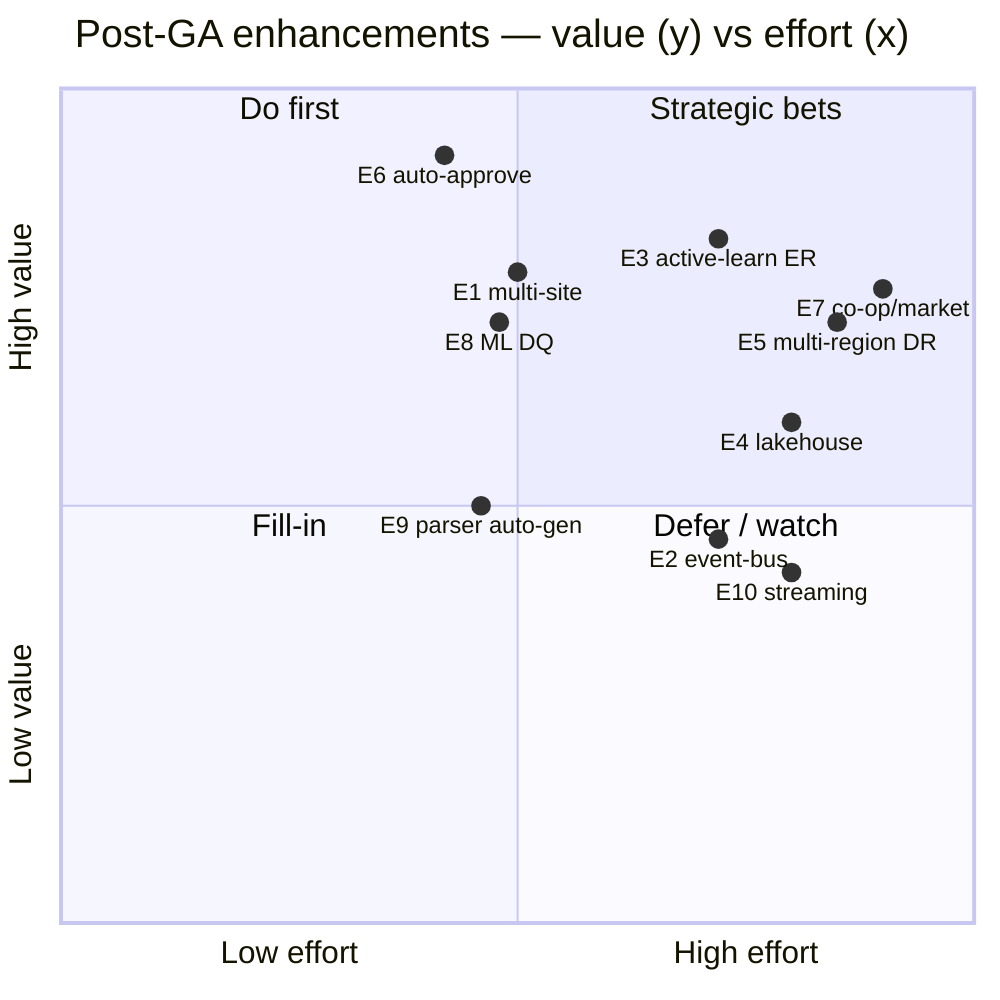
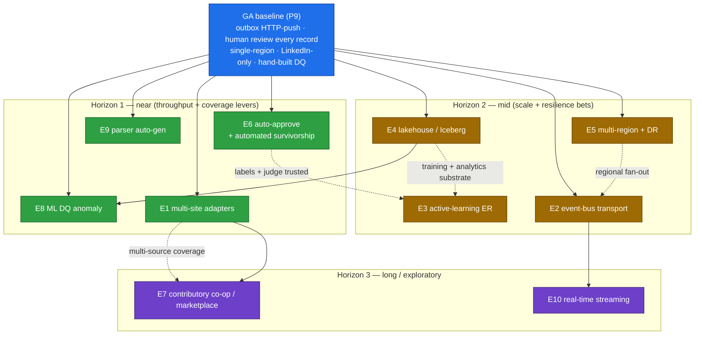

# 20 — Future Enhancements

> **Canonical contract:** this doc is the **settled registry of post-GA forward-looking options** for
> TruePoint Forge — the single place every other doc's `## Future expansion` bullet points to for the
> *deep* detail. It **commits nothing**: each option is a **deferred candidate** behind GA, sized with
> **value · prerequisites · risk · rough effort · horizon**, mapped to the **gap-ID(s) and Open
> question(s) it resolves**, and named with **who owns it once promoted** into a built doc. It is the
> owner of the deep detail that `07`/`08`/`09`/`10`/`11`/`13`/`14`/`15`/`16`/`17`/`19 §Future expansion`
> defer to (e.g. "the event-bus option doc (`20`)"), and it is where the **research corpus's
> `OQ-R#` register** is turned into a horizon-sequenced plan. Two invariants bind **every** option:
> the **compliance firewall** (raw never leaves Forge; only `verified_records` sync, `03 §Success 1`)
> and the **one-way door** (Forge owns ER; `master_*` is a serving projection, **OQ-3**). No enhancement
> may weaken either. **Locking ADRs: ADR-0046** (raw API interception as primary capture) **+ ADR-0047**
> (Forge owns ER + versioned `POST /api/v1/master-sync`) — several options below live specifically in
> those ADRs' **`§ Revisit if`** clauses.

This doc does **not restate** any neighbour's design; it names the **owner** each option promotes into.
Current-state TruePoint facts cite `_context/ecosystem-facts.md` by `§`; industry practice cites `[S#]`
in `_context/research-corpus.md`; frozen vocabulary is `_context/decision-ledger.md` (L1–L11). The
four-layer flow is always **`raw_captures → parsed_records → verified_records → (sync) → TruePoint
master graph`** (L2). Gap-IDs here are **G-FORGE-2001…2012** — a disjoint block assigned so gap-IDs
stay unique across the suite (L9).

---

## Objectives

1. Give every "not now, but later" idea scattered across the suite **one owner** — a horizon-sequenced
   catalog so a bullet in `11 §Future` ("Doc 20") resolves to a sized, gap-tracked entry here, not a
   dangling promise.
2. Size each option on a **common frame** — **value / prerequisites / risk / rough effort / horizon** —
   plus the **gap-ID and `OQ-R#`/`OQ-#` it resolves** and the **owner doc it becomes** when promoted, so
   prioritisation is a comparison, not a re-derivation.
3. Turn the research corpus's **twenty `OQ-R#`** and the ledger's **six `OQ-#`** into a **post-GA plan**:
   which are near-horizon throughput levers, which are strategic bets, and which are exploratory.
4. Hold the line: **state, per option, how the compliance firewall and the one-way door survive it** —
   an enhancement that would re-expose raw PII downstream or reopen ER ownership is flagged, not hidden.
5. Define the **promotion gate** — how an option here graduates into an owned build doc + ADR (mirroring
   how `19` promoted the ER-engine + testing-strategy gaps `G-FORGE-1901/1902` into scheduled work).

---

## Industry practice (cited [S#])

| Practice / signal | What it implies for a Forge enhancement | Cite |
|---|---|---|
| The category's **primary moat is the contributory "co-op" network** (ZoomInfo 200k+, Apollo 2M+ connected inboxes/CRMs), not crawling/interception | A contributory channel (E7) is the highest-leverage *complement* to interception-primary | [S2] |
| **Recency is event-driven**, not batch — ZoomInfo Tracker + Apollo auto-refresh on any new signal | Change-signal re-verification + real-time captures (E10) beat periodic re-scans for freshness | [S2] |
| **CDC (Debezium/WAL) beats polling** on latency; a durable outbox is *not* an event bus; Kafka EOS costs ~10–20% throughput for correctness | Event-bus/CDC transport (E2) is a latency/fan-out option **behind** the versioned contract, never the primary | [S20][S22][S23] |
| **Active-learning ER** reaches high accuracy from ~30–50 targeted human labels; ML+select-deterministic hybrid; **re-open** on later-detected generic values; capture every merge/reject as a training label | The maker-checker `merge_log` is a training corpus (E3); feed it back to recalibrate weights + thresholds | [S40][S32][S41] |
| **Weak supervision (Snorkel)** — parsers + AI as labeling functions combined by a label model auto-clear high-agreement records | Auto-approve/auto-verify (E6) reserves humans for the grey zone | [S62] |
| **Confidence-threshold routing** (≥0.80 straight-through, ~100% for sensitive), calibrated per use-case | E6's auto-approve band is a *calibrated* cutoff on the grounded-confidence composite, never a model self-report | [S49] |
| **Survivorship = authority + validation + completeness above recency** (recency-default is a known footgun) | Automated survivorship (E6) ranks trust, not freshness; per-role rule sets layer on later | [S33][S28] |
| **Lakehouse medallion**: gold is aggregated/dimensional serving; **Iceberg-on-S3** tag-driven Glacier tiering + managed **S3 Tables** remove self-run compaction | A lakehouse/Iceberg analytics + ML tier (E4) sits **over** raw/verified for analytics, distinct from the OLTP serving path | [S81][S84][S85][S86] |
| **Learned-baseline anomaly detection is commodity** (Monte Carlo/Bigeye/Databricks/AWS Glue) but none understands *parser-version → raw-fingerprint* drift | ML DQ (E8) buys the generic pillars, keeps Forge-owned drift monitors in-house | [S64][S65][S71][S100][S103] |
| **Aurora Multi-AZ** 99.99%/~30s failover; RDS Proxy cuts failover up to 66%; global-database cross-region read-replication | Multi-region + full DR (E5) is an Aurora-global + cross-region substrate step, not an app rewrite | [S108][S109] |
| **LLM-assisted extraction + source grounding** (LangExtract char-offsets); **self-describing schema registries** (Iglu/SchemaVer, `$supersedes`) | Parser auto-generation (E9) has the model *propose* a versioned parser draft from drifted raw; a human publishes | [S48][S47][S43] |
| **Ingestion cadence is a cost/latency lever** — streaming (higher cost, lower latency) vs batch; Sentry Relay normalizes then emits onto Kafka | Real-time streaming captures (E10) trade cost for freshness on the same envelope v2 | [S81][S46] |
| **Data-broker commercial axis** (credit-metering vs credit-free) + **Clearview €30.5M** for aggregating scraped PII with no lawful basis | A co-op/marketplace (E7) is as much a *legal/commercial* build as a technical one | [S8][S19][S116] |
| **Connector-framework standardization** (Airbyte/Fivetran/Meltano) is an **unresearched gap** (ws03 stub) | Multi-site adapters (E1) may standardize `source`/`endpoint` against a connector framework — needs the OQ-R7 research first | [S1] (ws03 gap) |

---

## Current-state / what already exists in TruePoint (cite ecosystem-facts)

The GA baseline these enhancements extend is what `01–19` lock; the deltas below are the "today" each
option moves off:

- **Sync is outbox-driven HTTP push, single transport.** `verified_records → sync_outbox` (same-tx) →
  `FOR UPDATE SKIP LOCKED` relay → `POST /api/v1/master-sync`, idempotent on `source_records.content_hash`
  **UNIQUE** (`ecosystem-facts §B/§C`, L5, `11`). Event-bus-as-primary is **explicitly rejected** but
  reserved as a future option (L5, `ADR-0047 §Revisit if`) → **E2/E10**.
- **Capture is LinkedIn-only, interception-primary.** The content script matches `linkedin.com/*` only
  (`ecosystem-facts §E`); envelope v2's `source` + `endpoint` **already generalize** across sites (L3,
  `07`) — the engine is source-agnostic, only the adapters are LinkedIn-specific → **E1/E10**. The
  contributory co-op channel is **not built** (interception-primary, ADR-0046) → **E7**.
- **ER is Forge-owned Fellegi-Sunter; every merge/reject is captured.** The scorer + `merge_log` live in
  `@forge/core` (`ecosystem-facts §C`, L4, `10 §3`); TruePoint's `er/` stays inert (L4). Weights/thresholds
  are hand-set and **uncalibrated** (**OQ-R12**); no feedback loop yet → **E3/E6**.
- **Every promotion is human maker-checker.** No record reaches `verified_records` without a checker ≠
  maker (`10`, `ecosystem-facts §C`); there is **no auto-approve lane** → **E6**.
- **The substrate is OLTP Postgres + object-store-large / JSONB-small.** Raw blobs offload past the ~2 kB
  TOAST cliff (**OQ-4**, `05`, `17`); there is **no lakehouse/Iceberg** analytics tier → **E4**.
- **DQ is a hand-built weighted-DAMA + five-pillar monitor set** (`15`); there is **no learned-baseline
  ML anomaly** layer → **E8**.
- **Deployment is single-region HA** (writer + cross-AZ reader, one pooler, KEDA per-stage autoscaling,
  `16`); there is **no multi-region / active-passive DR** beyond the P9 backup/replay drill → **E5**.
- **The Anthropic seam is shipped and reused** (`aiPort.ts`/`nlSearchAdapter.ts`, `ecosystem-facts §C`,
  `09`) — the substrate E9's parser auto-generation and E3's active-learning both build on.

---

## Design — the forward-looking option catalog

Ten options, in the brief's order (**E1…E10**). Each is sized on the common frame and tied to the
gap-ID + Open question(s) it resolves. **Nothing here is committed**; all are post-GA (`19 §P9` is the
line). Effort uses the roadmap's T-shirt scale (**M/L/XL**, `19 §phase spine`); horizon is **H1** (near —
first 1–2 quarters post-GA), **H2** (mid), **H3** (long / exploratory).

### The catalog at a glance

| # | Enhancement | Horizon | Value | Effort | Resolves (gap · OQ) | Promotes into (owner) |
|---|---|---|---|---|---|---|
| **E1** | Multi-site capture adapters (beyond LinkedIn) | H1 | High | L | **G-FORGE-2001** · OQ-R7, OQ-6, OQ-R2 | new `2x`-adapters doc + `07`/`08`/`14` |
| **E2** | Event-bus transport (Kafka/Debezium) behind the contract | H2 | Med | L | **G-FORGE-2002** · OQ-R4 | `11`/`16` + `ADR-0047 §Revisit if` |
| **E3** | Active-learning ER + human-in-the-loop model improvement | H2 | High | XL | **G-FORGE-2003** · OQ-R11, OQ-R12, OQ-R10 | ER-engine doc (`@forge/core`, `G-FORGE-1901`) |
| **E4** | Lakehouse / Iceberg analytics + ML tier | H2 | Med-High | XL | **G-FORGE-2004** · OQ-R8, OQ-4 | new analytics-tier doc + `05`/`17` |
| **E5** | Multi-region + full DR | H2 | High | XL | **G-FORGE-2005** · OQ-R6 | `16`/`17` |
| **E6** | Automated survivorship + high-confidence auto-approve | H1 | Very High | M | **G-FORGE-2006** · OQ-R10, OQ-R13, OQ-R15 | `10`/`09` |
| **E7** | Contributory data co-op / marketplace | H3 | High | XL | **G-FORGE-2007** · OQ-R3, OQ-R19 | new co-op doc + ADR + `14` |
| **E8** | ML-driven data-quality + anomaly detection | H1 | High | M | **G-FORGE-2008** · OQ-R9, OQ-R20 | `15` |
| **E9** | Parser auto-generation from schema samples | H1 | Med | M | **G-FORGE-2009** · OQ-R7, OQ-R16 | `08`/`09` |
| **E10** | Real-time streaming captures | H3 | Med | L | **G-FORGE-2010** · OQ-R4 | `07`/`11` (needs E2) |

### Value vs effort — where to spend first

### Horizon & prerequisite map

---

### E1 — Multi-site capture adapters (beyond LinkedIn) · G-FORGE-2001

| Facet | Detail |
|---|---|
| **Value** | Breaks the single-source ceiling. Envelope v2's `source`/`endpoint` already generalize (`ecosystem-facts §E`, L3); the engine, parser registry, ER, and sync are **source-agnostic today** — only the interceptor adapters are LinkedIn-specific. New sites (other professional networks, company sites, server-side provider webhooks) post the **same** envelope v2 to the **same** edge (`07 §Future`), multiplying coverage without touching the pipeline core. |
| **Prerequisites** | A stable `capture-sdk` interceptor contract (**OQ-6**, `04 §Success 3`); a versioned parser per new `(source, endpoint)` (`08`); a **per-source legal LIA** before any collection (each site is its own ToS/Art-6 fact pattern, `14`, ADR-0046); the connector-framework research gap resolved (**OQ-R7**) if adapters are standardized rather than bespoke. |
| **Risk** | Each new site multiplies the **interception legal surface** (per-source ToS/CFAA/GDPR, [S11][S116]) — the highest risk. Adapter sprawl in the MV3 process re-tests the `capture-sdk-stays-thin` boundary (`04`). |
| **Effort** | **L** per adapter (parser + interceptor + LIA), fixed pipeline. |
| **Firewall / one-way-door** | Both hold unchanged — new adapters feed `raw_captures` only; nothing changes downstream of parse. |
| **Resolves** | **G-FORGE-2001**; **OQ-R7** (connector-framework standardization), **OQ-6** (capture-sdk sharing across adapters), **OQ-R2** (off-store distribution if Web Store review rejects a site). |

### E2 — Event-bus transport (Kafka/Debezium) behind the versioned contract · G-FORGE-2002

| Facet | Detail |
|---|---|
| **Value** | Lower egress latency and multi-consumer fan-out **without** changing the wire contract. If a second downstream consumer of `verified_records` appears, or relay latency becomes the binding SLO, the internal outbox relay publishes to a durable bus (or a Debezium WAL tail replaces the polling publisher) **behind** `X-Forge-Sync-Version` (`11 §Future`, `16 §Future`) — mirroring TruePoint's ADR-0027 deferred-Kafka posture. |
| **Prerequisites** | A concrete second consumer or a measured relay-latency SLO breach (do not add infra speculatively); the no-Docker coordinator-host constraint resolved for Debezium (**OQ-R4**, memory); idempotent apply already in place (it is, `11 §3`) so at-least-once bus delivery is safe [S23]. |
| **Risk** | Net-new infra + ops; Kafka EOS costs ~10–20% throughput for correctness [S22]. The **key discipline**: a durable outbox/bus is **not** "event-bus-as-primary" — that reading stays rejected (L5); the bus buffers the **internal** hop only. |
| **Effort** | **L** (the outbox seam already exists; this swaps the relay/adds a publisher). |
| **Firewall / one-way-door** | Hold — only `verified_records` events traverse the bus; the contract and idempotency are unchanged. |
| **Resolves** | **G-FORGE-2002**; **OQ-R4** (polling publisher vs Debezium WAL CDC). Lives in **`ADR-0047 §Revisit if`**. |

### E3 — Active-learning ER + human-in-the-loop model improvement · G-FORGE-2003

| Facet | Detail |
|---|---|
| **Value** | Turns the maker-checker exhaust into a **self-improving ER model**. Every steward confirm/reject in the `merge_log` is a labeled Match/Non-Match pair (`10 §Future`); active-learning reaches high accuracy from ~30–50 targeted labels [S40], and feeding them back re-estimates Fellegi-Sunter weights + **recalibrates the auto-merge/grey-zone/auto-reject bands**, so the grey zone (and thus review load) **shrinks as the model learns** [S38][S40]. Adds **incremental re-open** when a later-detected generic value demotes a prior merge [S41]. |
| **Prerequisites** | The Forge-owned ER engine shipped (`G-FORGE-1901`, `19 §P5`) with `merge_log` accruing labels; enough labeled volume for EM re-estimation; a versioned model + eval harness (`18`) so a re-trained model is gated by a diff before it goes live; **calibrated thresholds** (**OQ-R12**). |
| **Risk** | Deterministic-vs-ML at scale is vendor-contested (**OQ-R11**, [S32]); a bad re-train silently raises false-merges → gate every model bump behind the same golden-master/diff gate as parsers [S123]. Feedback loops can amplify reviewer bias — mitigate with honeypots + IAA monitoring [S54][S56]. |
| **Effort** | **XL** — model versioning, EM retraining, threshold recalibration, eval harness. |
| **Firewall / one-way-door** | Hold — ER stays Forge-owned (reinforces the one-way door, OQ-3); labels never leave Forge. |
| **Resolves** | **G-FORGE-2003**; **OQ-R11** (deterministic vs ML ER), **OQ-R12** (threshold calibration), **OQ-R10** (auto-verify feeding). |

### E4 — Lakehouse / Iceberg analytics + ML tier over raw/verified · G-FORGE-2004

| Facet | Detail |
|---|---|
| **Value** | An analytics + ML substrate **beside** the OLTP serving path: land `raw_captures`/`parsed_records`/`verified_records` as **Iceberg-on-S3** tables for cheap large-scale analytics, coverage/quality reporting, and ML training (E3's re-training, E8's learned baselines) — with tag-driven Glacier cold-tiering for the append-only raw partitions [S84] and managed **S3 Tables** removing self-run compaction [S85]. Gold-as-aggregated-serving is the classic medallion endpoint [S81]. |
| **Prerequisites** | The raw-substrate substrate decision (**OQ-4**, object-store-large already leans this way, `05`); Iceberg-vs-Delta chosen (**OQ-R8**, engine-neutrality favours Iceberg [S86]); a compaction/snapshot/orphan maintenance lane (mandatory, not optional, [S84]) — the `maintenance` queue already exists (`12`). |
| **Risk** | A second copy of raw/verified data is a **firewall-relevant expansion** — the lakehouse must inherit the same per-layer least-privilege + no-raw-to-production discipline (`14`, **G-FORGE-2011**). Small-file/snapshot sprawl if maintenance lags [S84]. |
| **Effort** | **XL** — new substrate, catalog, maintenance, access-control extension. |
| **Firewall / one-way-door** | **At risk if careless** — an analytics tier that exposes raw PII to BI users breaks the firewall; mitigated by tiered least-privilege + column masking (see Security). |
| **Resolves** | **G-FORGE-2004**; **OQ-R8** (Iceberg vs Delta / managed S3 Tables), **OQ-4** (raw-blob substrate). |

### E5 — Multi-region + full DR · G-FORGE-2005

| Facet | Detail |
|---|---|
| **Value** | Raises Forge from single-region HA (`16`) to cross-region resilience + a real RPO/RTO story for an enterprise internal platform: Aurora **global database** cross-region replication (99.99%/~30s in-region failover [S108], RDS-Proxy-shrunk failover [S109]), regional object-store replication, and a warm/active-passive standby. Also the natural home for **data-residency-scoped** regional isolation (EU-origin raw stays in-region, DPDP India-origin highest-restriction, [S118]). |
| **Prerequisites** | The single-region footprint stable at 10× (`17`); the compute-topology decision (**OQ-R6**, EKS vs Fargate biases regional fan-out [S106][S107]); residency requirements from counsel (which layers must stay in-region); expand/contract migration discipline already in place (`16`). |
| **Risk** | Cross-region cost + operational complexity; split-brain on failover; residency mistakes are compliance incidents. The sync egress must remain the **only** cross-boundary edge per region (firewall). |
| **Effort** | **XL** — substrate, replication, failover runbooks, residency partitioning. |
| **Firewall / one-way-door** | Hold — DR replicates within Forge; the firewall edge (`/master-sync`) is unchanged; residency-scoping *strengthens* isolation. |
| **Resolves** | **G-FORGE-2005**; **OQ-R6** (compute topology / regional fan-out). Extends the P9 DR drill (`19 §P9`, `16 §Success 6`). |

### E6 — Automated survivorship + high-confidence auto-approve · G-FORGE-2006

| Facet | Detail |
|---|---|
| **Value** | **The single biggest review-throughput lever without headcount** (`10 §Future`, `17`). Treat versioned parsers + the AI extractor + honeypot-scored reviewers as **labeling functions** combined by a Snorkel-style consensus/label model to **auto-clear high-agreement records/clusters** [S62], reserving humans for the true grey zone; pair with **automated per-attribute survivorship** ranking **authority + validation + completeness above recency** [S33][S28] so the golden record assembles itself. Auto-approve fires only above a **calibrated** confidence band on the grounded-confidence composite (≥0.80-style, ~100% for sensitive [S49]) — never a model self-report [S47]. |
| **Prerequisites** | A **trusted golden set + LLM-as-judge** with bias mitigations [S51][S50]; the grounded-confidence composite emitting reliable scores (`09`); the maker-checker executor + ranked queue shipped (`10`, `19 §P4`); a **pilot to calibrate the cutoff** (**OQ-R13**) and the survivorship strategy menu (**OQ-R15**). |
| **Risk** | A well-typed hallucination auto-promoted [S47]; recency-default survivorship footgun [S28]; auto-approve is a **firewall-adjacent trust decision** → keep a sampled human audit of the auto-cleared band + an easy kill-switch back to full-review. |
| **Effort** | **M** — builds on shipped review + confidence infra; the hard part is calibration + the judge, not new pipeline. |
| **Firewall / one-way-door** | Hold — auto-approve still writes `verified_records` through the same executor; the four-eyes rule is *relaxed by policy for a calibrated band*, audited, reversible. |
| **Resolves** | **G-FORGE-2006**; **OQ-R10** (weak-supervision auto-verify), **OQ-R13** (confidence threshold), **OQ-R15** (survivorship default). |

### E7 — Contributory data co-op / marketplace · G-FORGE-2007

| Facet | Detail |
|---|---|
| **Value** | The industry's **actual primary moat** [S2] — a contributory network (consenting customers' connected inboxes/CRMs feeding the shared golden dataset) as a *complement* to interception-primary (**OQ-R3**, `07 §Future`). Also opens a commercial axis (credit-metered vs credit-free access to Forge-built data, [S8][S19]) if Forge ever meters downstream. |
| **Prerequisites** | Multi-source adapters (E1) as the ingestion substrate; a **consent + lawful-basis framework** far beyond interception (contributed data has its own Art-6/DPDP posture, [S116][S118]); a contribution/attribution + provenance model (the `hadPrimarySource` lineage already supports it [S89]); a commercial/legal model (**OQ-R19**) and likely a **new ADR**. |
| **Risk** | **Highest legal/compliance load in the catalog** — Clearview (€30.5M) is the cautionary tale for aggregating others' PII without a clean basis [S116]; a marketplace that resells derived data collides with Chrome Web Store Limited-Use resale bars (**OQ-R2**, [S14]). A loopback of CRM-side corrections back into Forge **reopens the one-way door** (OQ-3) — deliberately out of scope (`11 §Future`). |
| **Effort** | **XL** (technical) + **XL** (legal/commercial) — the legal build gates the technical one. |
| **Firewall / one-way-door** | **At risk** — contributory loopback would reopen OQ-3; kept strictly ingestion-side (co-op feeds `raw_captures`, never a CRM→Forge loop) to preserve the door. |
| **Resolves** | **G-FORGE-2007**; **OQ-R3** (contributory channel), **OQ-R19** (commercial/credit metering). |

### E8 — ML-driven data-quality + anomaly detection · G-FORGE-2008

| Facet | Detail |
|---|---|
| **Value** | Catches the **"unknown unknowns"** the hand-built weighted-DAMA + five-pillar monitors (`15`) cannot: learned-baseline freshness/volume/null/distribution anomaly detection over `verified_records`/`sync_state` [S64][S65][S71], layered **alongside** the Forge-owned `parser_version`-keyed drift monitors (which stay in-house because no vendor understands raw-fingerprint→parser drift, **OQ-R9**, [S103]). |
| **Prerequisites** | A stable metric history to learn baselines (a "training" warm-up state is a real design item [S65]); alert-volume tuning to user-facing symptoms so ML monitors don't over-fire on high-variance interception ingest (**OQ-R20**, [S100][S101]); optionally E4's lakehouse as the analytics substrate. |
| **Risk** | Alert fatigue [S100]; build-vs-buy — a managed product (Monte Carlo/Bigeye) vs in-house monitors (**OQ-R9**); telemetry must stay **PII-free by construction** so ML features never leak raw PII (`15`). |
| **Effort** | **M** — layers on the shipped `/metrics` + five-pillar seam (`15`). |
| **Firewall / one-way-door** | Hold — monitors read metrics/aggregates, PII-free (`15`, `ecosystem-facts §C`). |
| **Resolves** | **G-FORGE-2008**; **OQ-R9** (build vs buy anomaly detection), **OQ-R20** (alert-volume tuning). |

### E9 — Parser auto-generation from schema samples · G-FORGE-2009

| Facet | Detail |
|---|---|
| **Value** | Shrinks the `SHAPE_DRIFT` → new-parser loop (`08 §Future`). Use the Anthropic seam to **propose a `parser_version` draft** (field mappings + `output_schema`) from a sample of drifted raw [S47][S48], which a human reviews and publishes — the model **proposes, never authors the live parser directly**. Optionally promote the per-version accepted-input set into a **self-describing schema registry** (Iglu/SchemaVer, `$supersedes`) so `schema_version` admission is a registry lookup, cutting drift false-positives [S43]. |
| **Prerequisites** | The parser framework + registry + drift routing shipped (`08`, `19 §P2`); the extraction adapter + grounding (`09`); the golden-fixture publish gate (`18`, `G-FORGE-1802`) so an AI-drafted parser is gated exactly like a hand-written one; parser cache-invalidation/staged rollout (**OQ-R16**, [S43][S45]). |
| **Risk** | An AI-authored parser that silently mis-maps a field → the human-publish gate + golden-master diff is the guard [S123]; schema-registry cache lag (Iglu 10-min, [S43]). |
| **Effort** | **M** — a drafting tool on the shipped AI + registry seams; the gate already exists. |
| **Firewall / one-way-door** | Hold — parser drafts operate on `raw_captures`; publish stays maker-checker-gated (`08`). |
| **Resolves** | **G-FORGE-2009**; **OQ-R7** (connector/schema frameworks), **OQ-R16** (parser cache-invalidation / staged rollout). |

### E10 — Real-time streaming captures · G-FORGE-2010

| Facet | Detail |
|---|---|
| **Value** | For coverage classes where freshness beats cost, move ingestion from triggered/batch toward continuous streaming on the **same envelope v2** [S81] — event-driven recency is how the leaders keep data fresh [S2]. Sentry-Relay-style normalize→emit-onto-a-durable-queue is the stage pattern [S46]. |
| **Prerequisites** | **E2's event-bus substrate** (streaming ingest wants a bus, not the batch outbox); a per-source justification that lower latency is worth the higher cost [S81]; the abuse/rate posture extended for a continuous stream (`checkCaptureRate` fails open, `ecosystem-facts §A`); back-pressure + DLQ already in place (`12`). |
| **Risk** | Cost/complexity of always-on streaming; higher abuse surface; over-alerting on a high-variance real-time stream (**OQ-R20**). Only worth it where a batch cadence measurably hurts. |
| **Effort** | **L** on top of E2 (mostly cadence + back-pressure), **XL** if it drives E2. |
| **Firewall / one-way-door** | Hold — streaming still lands `raw_captures`; nothing downstream changes. |
| **Resolves** | **G-FORGE-2010**; **OQ-R4** (streaming transport / CDC). Gated behind **E2**. |

---

### Adjacent options already owned elsewhere (wired here for completeness)

These forward-looking items are **owned by another doc's `§ Future expansion`**; this doc lists them so
every research `OQ-R#` has a home and the futures view is complete — it does **not** re-own them.

| Option | Owner doc | Resolves |
|---|---|---|
| Durable-execution orchestration (Temporal) replacing chained BullMQ + hand-built DLQ/saga | `12 §Future`, `17 §Future` | OQ-R5 |
| Full SPIFFE/SPIRE workload identity for the sync principal | `14 §Future`, `11 §Future`, `16 §Future` | OQ-R18 |
| EKS Auto Mode / Karpenter + Spot past the ~15-container crossover | `16 §Future` | OQ-R6 |
| OpenLineage + Marquez as the lineage store; Merkle-root external anchoring | `15 §Future` | OQ-R17 |
| Field-level decay TTL + change-signal re-verification (~2.5%/mo decay) | `10 §Future`, `11 §Future`, `14 §Future` | OQ-R14 |
| Per-role survivorship groups | `10 §Future` | OQ-R15 |
| Sharding / Citus for the write primary past 10× | `17 §Future` | — |

---

## Security considerations

- **The two invariants gate every option.** No enhancement may (a) let raw or parsed PII reach the
  production CRM or any downstream consumer — the **compliance firewall** (`03 §Success 1`, `14 §6`) — or
  (b) reopen ER ownership / a CRM→Forge loopback — the **one-way door** (OQ-3). E4 (lakehouse) and E7
  (co-op loopback) are the two that come closest; both are explicitly scoped to preserve them.
- **A second copy of the data is a second attack surface.** E4's Iceberg tier and any E7 contribution
  store must inherit Forge's **per-layer least-privilege** posture (`ecosystem-facts §D`, `14`): no role
  reads raw PII **and** writes/serves production; BI/analytics access is column-masked so raw PII never
  materialises for a report reader (**G-FORGE-2011**). [S121][S87]
- **New capture surfaces are new legal fact patterns.** Each E1 site and the E7 co-op needs its **own
  documented Art-6 LIA / DPDP §7 consent posture + Art-14 notice** before collection — the Clearview
  (€30.5M) and per-source ToS risk does not generalise from LinkedIn (`14 §12`, OQ-2). [S116][S118][S16]
- **Auto-approve (E6) relaxes four-eyes by policy, not by removing it.** The executor still governs the
  write; the relaxation is a **calibrated, sampled-audited, kill-switchable** band — a sampled human audit
  of the auto-cleared set + an instant revert to full-review is a hard requirement [S49][S57].
- **Machine-identity depth scales with the estate.** As E5 (multi-region) and E2 (bus) grow the
  service-to-service surface, graduate the `forge_sync` principal from mTLS + scoped JWT toward
  SPIFFE/SPIRE short-lived SVIDs (OQ-R18, `14 §Future`). [S119][S120]

## Scalability considerations

- **The two real ceilings are the human-review queue and `ai-extract` spend** (`17`, `19 §Scalability`).
  E6 (auto-approve) and E3 (active-learning, shrinking the grey zone) attack the **review** ceiling
  directly — they are the scale story, not hiring reviewers [S54][S62]. E9 (parser auto-gen) attacks the
  **authoring** bottleneck.
- **E4 (lakehouse) is the analytics scale-out**: it offloads heavy coverage/quality/training queries off
  the OLTP primary onto Iceberg-on-S3, and is the natural substrate for E3's re-training and E8's learned
  baselines — but demands mandatory compaction/snapshot maintenance to stay fast [S84][S85].
- **E2/E10 (bus/streaming) trade latency for infra**; a low-volume verified stream favours correctness
  over throughput [S22], so they are justified by a *measured* SLO breach or a second consumer, never
  speculatively (`11 §Future`, `16 §Future`).
- **E5 (multi-region) is a resilience scale, not a throughput scale** — it buys availability + residency,
  and must not become a second write-primary that splits ER (one-way door). Sharding/Citus (`17 §Future`)
  is the throughput answer past 10×, distinct from E5.
- **Autoscaling stays queue-depth/load-based** (KEDA, `16`) as new stages (E1 adapters, E10 streaming)
  add per-stage queues — each new queue scales on its own homogeneous profile [S104][S105].

## Risks & mitigations

| # | Risk | Mitigation | Cite |
|---|---|---|---|
| **G-FORGE-2001** | Multi-site adapter sprawl multiplies the interception legal surface | Per-source LIA/consent gate **before** collection; reuse the fixed pipeline; only the adapter is new | [S11][S116] |
| **G-FORGE-2011** | A future analytics/ML tier (E4) or co-op (E7) re-exposes raw PII outside the firewall to BI/report/contribution consumers | Per-layer least-privilege inherited by every new store; column masking; the CI data-diff firewall proof extended to each new consumer | [S121][S128][S87] |
| **G-FORGE-2012** | Enhancements accreted without a triage/promotion gate → scope drift, half-built options, stale gap-IDs | The **promotion governance** below: an option only starts when its entry-gate is met and it is promoted into an owned doc + ADR; this doc is reviewed each planning cycle | [S66] |
| — | E7 contributory loopback silently reopens the one-way door (OQ-3) | Co-op is **ingestion-side only** (feeds `raw_captures`); no CRM→Forge correction loop; any loopback needs a new ADR superseding ADR-0047 | [S30] |
| — | E6 auto-approve promotes a well-typed hallucination or stale-recency survivor | Calibrated band on grounded-confidence (not self-report) + sampled human audit + kill-switch; authority-over-recency survivorship | [S47][S49][S28] |
| — | E2/E10 mistaken for "event-bus-as-primary" (rejected, L5) | The bus buffers the **internal** hop behind `X-Forge-Sync-Version`; a durable outbox/bus is not the primary transport; idempotent apply unchanged | [S46][S23] |
| — | E3 feedback loop amplifies reviewer bias or a bad re-train raises false-merges | Every model bump gated by golden-master/diff on the eval harness (`18`); honeypots + IAA monitoring; incremental re-open on generic values | [S123][S54][S41] |

*(New gaps **G-FORGE-2001…2012** are a disjoint block, unique across the suite (L9).
They map to `28-enterprise-readiness-audit.md`'s coverage-expansion, data-tiering, resilience, and
roadmap-governance gap classes.)*

## Milestones — the three horizons + the promotion gate

There are **no committed dates**; horizons are *readiness orderings* relative to GA (`19 §P9`).

| Horizon | Entry gate (what must be true post-GA to start) | Options |
|---|---|---|
| **H1 — near** | GA stable on a canary tenant; a trusted golden set + judge (E6/E8); parser framework + registry live (E9); one non-LinkedIn LIA cleared (E1) | E1, E6, E8, E9 |
| **H2 — mid** | H1 throughput levers proven; `merge_log` label volume sufficient (E3); 10× single-region envelope held (E4/E5); a measured egress-latency SLO breach or 2nd consumer (E2) | E2, E3, E4, E5 |
| **H3 — long / exploratory** | Multi-source coverage (E1) + a co-op legal/commercial model + ADR (E7); an event-bus substrate (E2) in place (E10) | E7, E10 |

**Promotion gate (how an option leaves this doc).** An option is promoted only when: (1) its entry-gate
holds; (2) it is written as an **owned build doc** (or folded into an existing owner per the catalog's
"Promotes into" column) with its own milestone lattice; (3) it carries a **decision (ADR)** where it
touches a locked contract (E2/E10 → `ADR-0047 §Revisit if`; E7 → a new ADR; E5 → residency ADR); and
(4) its gap-ID moves from "future option" to "scheduled" — mirroring how `19` promoted the ER-engine and
testing-strategy gaps (`G-FORGE-1901/1902`) into critical-path work. **G-FORGE-2012** tracks standing up
this cadence.

## Deliverables

1. The **ten-option catalog** (E1…E10) on a common value/prereq/risk/effort/horizon frame, each tied to
   its **gap-ID + `OQ-R#`/`OQ-#`** and its **promoted owner** — the registry the rest of the suite's
   `§ Future expansion` bullets resolve to.
2. The two Mermaid views — **value-vs-effort quadrant** and the **horizon/prerequisite map**.
3. The **adjacent-options roundup** wiring the remaining research questions (OQ-R5/R6/R14/R15/R17/R18) to
   their owning docs, so every `OQ-R#` has a home.
4. The **firewall + one-way-door survival statement per option**, and the **security/scalability**
   framing of the catalog.
5. The **three-horizon milestone plan + the promotion gate** (how an option becomes an owned build doc +
   ADR), and the **gap register `G-FORGE-2001…2012`** mapped to `28-enterprise-readiness-audit.md`.

## Success criteria

1. **Every `§ Future expansion` bullet in `07`–`17`/`19` resolves to a sized entry here** — no dangling
   "Doc 20" pointer; each option has value/prereq/risk/effort/horizon + a gap-ID + the OQ it resolves.
2. **Every research `OQ-R#` and ledger `OQ-#` is accounted for** — owned here (E1…E10) or wired to its
   owner (adjacent roundup); none is orphaned.
3. **No option weakens the two invariants** — each states how the compliance firewall and the one-way
   door survive it; the two closest (E4, E7) are explicitly scoped to preserve them (`03 §Success 1`,
   OQ-3).
4. **Prioritisation is a comparison, not a re-derivation** — the quadrant + horizon map make "do E6/E8
   first, defer E7/E10" legible from the frame, grounded in the corpus (throughput levers first [S62],
   infra bets on measured need [S22]).
5. **There is a promotion gate** — an option cannot be half-built; it graduates into an owned doc + ADR
   with its own milestones and its gap-ID reclassified (**G-FORGE-2012**), the same discipline `19` used.
6. **No sizing decision is answered from first principles where a `§`/`[S#]` grounds it** (CLAUDE.md
   mandatory-read rule) — every value/risk claim cites the corpus or ecosystem-facts.

## Future expansion

Even this catalog has a horizon-beyond-horizon — items too speculative to size today, parked for a later
pass so they are not lost:

- **Cross-vendor golden-record federation / identity graph** — resolving Forge's `verified_records`
  against external identity providers into a shared entity graph, an extension of E3/E7 once the co-op
  exists.
- **Confidential-compute / tokenized reveal** for the decrypt path so clear PII never materialises in an
  application process (`14 §Future`) — a security substrate upgrade orthogonal to the catalog.
- **Automated continuous-compliance evidence** (SOC 2 Type II control evidence, DSAR SLAs, key-event
  logs) wired into a live dashboard (`14 §Future`) [S121] — grows in weight as E5/E7 expand the
  compliance surface.
- **A living re-score of this catalog each planning cycle** — value/effort/horizon shift as GA data
  arrives (calibration mirrors `17`'s volume-model / `19`'s duration flags); the promotion gate
  (**G-FORGE-2012**) is the mechanism that keeps it honest.

## Open questions

This doc is where the suite's forward-looking questions are *sequenced*, not closed. It touches the
ledger's `OQ-1…6` and owns the "future" side of the research register's `OQ-R#`.

- **Ledger OQ-3 (one-way door).** E7's contributory loopback is the one enhancement that could reopen it;
  kept ingestion-side only. Any true CRM→Forge loopback needs an ADR superseding ADR-0047.
- **Ledger OQ-4 (raw-blob substrate).** E4 (lakehouse/Iceberg) is the substrate's endgame; the
  object-store-large default already leans that way (`05`), and **OQ-R8** (Iceberg vs Delta / managed S3
  Tables) is the concrete choice.
- **Ledger OQ-6 (capture-sdk single-sourcing).** E1 (multi-site adapters) stresses the shared-vs-fork
  decision hardest — many adapters over one thin SDK argues for shared (`04 §Success 3`).
- **Ledger OQ-1/OQ-2/OQ-5** are GA-scoped (name collision, interception legal sign-off, dark-connector
  retirement, `19 §P0/P9`) and not reopened here — but **E1 and E7 each add new per-source legal
  sign-offs** on the OQ-2 pattern.
- **Which H1 option, if any, should be pulled into the initial GA scope** rather than deferred — E8 (ML
  DQ) and E6 (auto-approve) are the candidates if the review queue proves the binding constraint before
  GA (`17`). Open, decided on GA telemetry.
- **The promotion cadence itself (G-FORGE-2012).** How often this catalog is re-scored and who owns the
  promotion gate — a planning-process question, not an architecture one.
- **Owned "future" research questions** carried from the corpus, each mapped above: **OQ-R3** (co-op, E7),
  **OQ-R4** (bus/CDC/streaming, E2/E10), **OQ-R6** (compute topology / regions, E5), **OQ-R7** (connector
  frameworks, E1/E9), **OQ-R8** (Iceberg vs Delta, E4), **OQ-R9/R20** (build-vs-buy DQ + alert tuning,
  E8), **OQ-R10/R13/R15** (auto-verify + confidence + survivorship, E6), **OQ-R11/R12** (ER model +
  thresholds, E3), **OQ-R16** (parser rollout, E9), **OQ-R19** (commercial metering, E7). The remainder
  (**OQ-R5, R14, R17, R18**) are owned by the adjacent docs in the roundup table.
