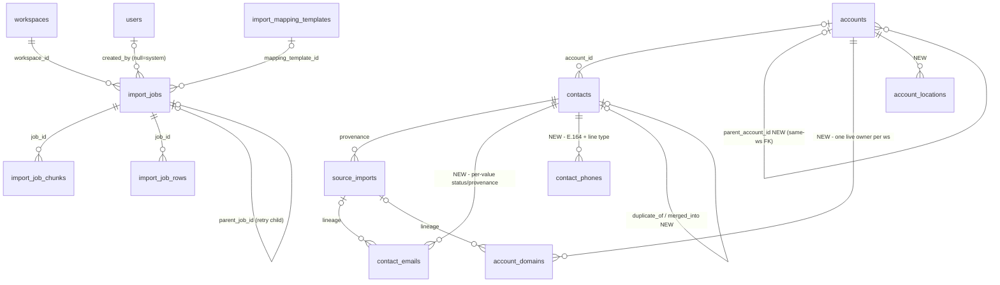

# 00 — Executive Summary & Recommendations

> **Status:** written last (deliverable #20) — the one document an executive reads. Every claim
> traces to a numbered doc, cited as (NN §x). Planning only: nothing in this series ships code or
> migrations; shipped-status lives exclusively in `16`. Reading order and the 20-deliverable
> traceability table are in the [README](README.md).

## 1. What was reported vs what the audit found

Two problems were reported: imports "not working correctly" (queued jobs visible to every user in
the workspace) and an unintuitive import UX. The code-grounded audit found (01, 02):

- **Two import systems, not one.** The live sync CSV path keeps job state **only in Redis**
  (evicted at 24 h / 1 000 jobs; the UI polls ~2 min then gives up, with no history page to check
  back — 01 §2.1, §4.2–4.3). A second, fully built durable pipeline (the
  `import_jobs`/`_chunks`/`_rows` trio) is **dark** behind two flags and three unmet infra gates —
  no production object store, AV scan permanently stubbed, COPY-FROM-STDIN unproven (01 §2.2, §3).
  The wizard still shows a "Large file" toggle that 403s — a recommended dead end (01 §4.1). The
  sync happy path is functional; the system *looks* broken because state evaporates and the UI
  abandons it (02 §RC-2, §RC-3).
- **The visibility bug is intra-workspace over-sharing, on every job surface.** Job tables carry
  workspace-only RLS; `created_by_user_id` exists and is never read; no grant gates submission at
  all. The identical shape leaks live on reveal jobs, enrichment jobs, and the Recent Imports card
  (01 §5; 02 §RC-1). Staff surfaces are correctly locked (01 §5.6). Not cross-tenant — the tenant
  wall holds.
- **Single-value phone/email columns** on `contacts`, while multi-value truth sits shape-only and
  never read in Layer-0; accounts have one domain, no hierarchy, no locations, no soft-delete
  (01 §6.2, §6.5; 02 §RC-4).
- **Marker-only dedup.** `duplicate_of_contact_id` markers accumulate; nothing ever merges; the
  staff executor annotates without re-pointing child rows (01 §6.9; 02 §RC-5).

## 2. The five headline recommendations

**(a) Unify sync + bulk on the durable `import_jobs` trio; retire Redis-only job state** (08 §1).
Every import becomes a trio row through one state machine; BullMQ carries work, never truth.
*Why not the alternative:* keeping two systems preserves both defect classes (evaporating state
and a dark twin), and a third system would discard a shipped, sound design-of-record
(`data-management/15`); small files ride the same machine as a one-chunk priority job, so
unification costs no fast-path latency (08 §1.1, 09 §1).

**(b) Overlay child tables `contact_emails`/`contact_phones` (and `account_domains`/`_locations`),
with the flat columns retained permanently as the primary-value cache** (05; 06). *Why not the
alternatives:* projecting Layer-0 master channels is path-isolated, holds no values today, and
cannot absorb workspace-local edits/pins (DM4 forbids adding tenancy to it); replacing the flat
columns is a big-bang cutover with no rollback — dedup, search facets, COPY staging, and reveal
all bind to them. Both market leaders run this dual shape (05 §Reconciliation).

**(c) App-layer owner predicate + elevated-role override on ALL job surfaces; no user GUC**
(10 §1). Import, reveal, enrichment lists and the Recent Imports card get one shared predicate,
enforced inside repository signatures (viewer = required parameter; omission is a compile error).
*Why not the alternative:* a user-identity GUC + RLS policy puts moving product policy into the
tenancy mechanism, enlarges the fail-closed GUC surface on pooled connections, and breaks every
worker path that has no user; RLS keeps owning the (unchanged) workspace wall (10 §1, §4).

**(d) A dedicated Imports UX: the server decides the processing path, progress is durable, dedup
is visible, duplicate review becomes a real queue** (11). Kill the client toggle (mode is a
server commit-time decision from measured rows/bytes — 08 §1); `/imports` history + `/imports/
[jobId]` durable progress survive navigation; the dismiss-only duplicates section upgrades to an
accept/merge review queue under Data Health. *Why not the alternative:* patching the existing
wizard leaves no history surface (the "check back" defect), keeps a client-trusted routing hint,
and leaves dedup outcomes invisible — the two reported problems are discoverability failures.

**(e) Phased rollout: quick wins ship first; the three infra gates bound Phase 2 only** (14).
Phase 0 (visibility fix + toggle kill) and Phase 1 (durable unification) need **no** new
infrastructure; the object-store/AV/COPY gates gate only copy-mode large files, and Phases 3–4
run parallel to or after Phase 1 regardless. *Why not the alternative:* gating the program on
infra approval delays the P0 security fix indefinitely; big-banging everything couples a
same-week fix to a multi-quarter data-model migration. If infra is never approved, the standing
fallback is an honest published 5 000-row/10 MB ceiling — better than today on every axis except
file size (14 §fallback).

## 3. Target-state ER at a glance

Shape only (~13 entities); full diagrams, attributes, and the constraint inventory are 07 §2–§4.

Flat `contacts.email_*`/`phone_*` and `accounts.domain` remain as the **permanent primary-value
cache** of the child tables (invariant CH-INV-1, 05 §3). Layer-0 stays read-only for this program
(07 §2.4); the per-job UNLOGGED COPY staging table remains the ONE sanctioned RLS bypass (07 §5).

## 4. Decision register

| # | Decision (one line) | Doc |
|---|---|---|
| 1 | Every import is an `import_jobs` row; DB is truth, BullMQ is transport; Redis-only poll state retires | 08 §1 |
| 2 | Server picks `fast` vs `copy` mode at commit from measured rows/bytes; the client toggle dies (flag-independent) | 08 §1 · 11 §1.4 |
| 3 | XLSX = cap, not convert: fast-path-only (5 k/10 MB), honest `xlsx_too_large` refusal; conversion is demand-triggered F07 | 08 §1 · 12 §5 |
| 4 | State machine extends additively (`draft`/`uploading`/`deferred`); illegal transitions = **409 `illegal_state`** (Surface 1 harmonizes from 422) | 08 §2 |
| 5 | Cancel = stop-remainder, never rollback; provenance-driven undo is a separate future verb (F08) | 08 §2.2 |
| 6 | Strategy surface = `merge_mode` (create_and_update/create_only/update_only) + `preserve_populated`; `keep_both` retired | 08 §5 |
| 7 | All import/merge field writes go through `planFieldWrite` — never SQL CASE; a pinned field survives every strategy | 08 §5.2 · 04 §3.2 |
| 8 | Artifact pair (repair CSV + `_REDACTED_` error report); **proxied-with-audit downloads**, presigned URLs demoted to bounded fallback | 08 §6 · 13 §4.3 |
| 9 | Per-row retry = child `import_jobs` row with `parent_job_id`, inherited mapping/strategy | 08 §6.3 |
| 10 | One import queue with **priority lanes** (fast=1), not a separate queue; named escape hatch if fast-lane p95 breaches | 09 §1 |
| 11 | Tenant fairness = bounded rolling chunk window (K=2) + per-workspace cap surfacing as visible `deferred`; no bespoke fair scheduler | 09 §2 |
| 12 | Lifecycle notifications ride the shipped transactional outbox; direct enqueue-at-commit retires | 09 §6 |
| 13 | Job visibility = app-layer owner predicate + admin/owner override; **no user GUC**; RLS keeps the workspace wall only | 10 §1 |
| 14 | Enforcement is the type system: required `JobViewer` param, unpredicated readers renamed away, detail-by-id same predicate, invisible ⇒ 404 | 10 §4 |
| 15 | "Import at all" grant = workspace role `member`+, with per-workspace `import_policy.who_can_import` knob; no new IAM system | 10 §3 |
| 16 | `shared_with_workspace` column ships day one in the predicate; the share UX is deferred (F06) | 10 §2.3 |
| 17 | Visibility narrowing rolls out **dual-gated** (`JOB_VISIBILITY_SCOPED` + per-tenant flag), staged cohorts + comms; flag-off = byte-identical | 10 · 15 §2.4 |
| 18 | Flat-cache invariant **CH-INV-1**: flat columns are a byte-exact projection of the live primary child row; one write path; drift sweep target 0 | 05 §3 |
| 19 | Email value unique **per workspace**; phone unique **per contact only** — a workspace phone collision is a match signal, never a constraint | 05 §2.2 |
| 20 | Dedup ladder: the three shipped primary uniques stay the only upsert targets; email rung widens to all live values; phone E.164 = signal, never a key | 04 §2 |
| 21 | Merge is human-only, 2 records, daily-capped, dual-gated — **irreversible with guardrails**; no unmerge verb, ever | 04 §3 |
| 22 | Merge re-points live operational children; historical job ledgers are never rewritten (tombstone `merged_into` provides the hop) | 04 §3.4 |
| 23 | Field history = in-tx `audit_log` before/after on hand-editable scalars + merge; temporal tables deferred (F12 ◇) | 04 §4 |
| 24 | Hierarchy: same-workspace composite FK, app-side cycle check (depth ≤ 10), denormalized `root_account_id`; display-only — never widens visibility | 06 §2 |
| 25 | **No rollup machinery** ships (no materialized aggregates, no scheduled recompute); `root_account_id` makes a future rollup cheap | 06 §6 |
| 26 | AV gate: vendor-agnostic scanner port (ClamAV baseline), scan-before-parse at both wire points, **fail-closed** on outage; infected ⇒ `failed` + object quarantine, no new state | 13 §2 |
| 27 | Partitioning does not block the program; every DDL step must be partition-compatible (R1–R5); `import_job_rows` is partition-first (F10) | 12 §7 |
| 28 | The `audit_log.action` CHECK is extended **once per phase**, with exactly that phase's actions | 15 §M1 |
| 29 | All DDL additive; the production rollback lever is always a flag, never a DROP; dual-write precedes the final backfill pass | 15 §Reconciliation |

## 5. Phases, gates, fallback (14; sequencing and per-phase test gates in 15)

- **P0 — Stop the bleeding (M):** owner-predicate on all four job surfaces + create grant + toggle
  kill. Dual-gated; closes G01/G02, the toggle half of G10, and the G04 hazard half (the
  unpredicated dead-code read is deleted; the routed list is P1). No infra needed.
- **P1 — Durable job unification (XL):** trio dual-write on the live path; history/list/cancel/
  retry/notifications; launch limits. `IMPORT_V2_ENABLED` dual gate; closes G03–G06, G11, G13, G14.
- **P2 — The three gates clear; large files live (L + infra lead time):** copy mode, draft flow,
  legacy retirement; graduates `BULK_IMPORT_ENABLED`; closes G07–G09, raises limits.
- **P3 — Multi-value channels (L, ∥ P2):** child tables, dual-write → backfill → read cutover;
  closes G15/G16. Needs none of the infra gates.
- **P4 — Company completeness + true merge + review UX (XL, after P3):** domains/locations/
  hierarchy/soft-delete, merge contract, duplicate-review queue; closes G17/G18/G20/G21.
- **P5 — Extensions (M–L):** scheduled/delta/API-push imports on the same trio.
- **Enable-gates (Phase 2's entry keys; live state tracked in 16):** **B** object store — criteria
  owned by 14 (aligned with db-mgmt-research/05); **C** AV scan — criteria owned by 13 §2.3;
  **A** COPY spike — criteria owned by 12 §3.2, with a measured batched-INSERT fallback (red ⇒
  launch at a 1 M-row ceiling, not a delay).
- **Standing fallback if Phase-2 infra is never approved:** P0/P1/P3/P4 ship regardless; the
  ceiling stays the honest fast pair (5 000 rows / 10 MB); the dark bulk machinery stays additive
  and dark (14 §fallback).

## 6. Top risks (full register: 14 §Risk)

- **R03** Visibility narrowing breaks a real shared-ops workflow → dual gate, cohorts, comms; day-one share column for a fast-follow verb.
- **R02** Channel backfill drifts the primary cache (CH-INV-1) → dual-write-first order, drift metric must read 0 before cutover; flag-off returns flat reads losslessly.
- **R04** Wrong-pair merge at scale (no unmerge exists) → human-only review, low caps at canary, pin immunity, audit-reconstructable; lever is stop-new-merges + provenance repair.
- **R01** COPY spike fails its criteria → same-seam batched-INSERT fallback; lower ceiling, no architecture change.
- **R07** Legacy-path retirement breaks an unnoticed consumer → compatibility window, status mapping, drain telemetry before removal.

## 7. Verified vs assumed

**Verified:** every design doc was adversarially reviewed against the repo; doc 01's claims carry
`file:line` citations re-verified at head, and reviewers spot-checked ≥5 per doc; no
external-platform claim enters a design doc except via 03's per-claim citation register (145
sources, confidence-graded); contradictions with prior series are reconciled and cited, never
silently diverged (e.g. 15 §Mismatches). **Assumed / owed:** CI gates — this sandbox cannot run
bun/docker, so typecheck, itests, and the soaks are CI deliverables, never asserted locally
(15 §Reconciliation rule 5); the COPY throughput/memory numbers are targets to be measured
(12 §3), and 12's envelope arithmetic rests on stated per-stage assumptions (A1–A3). The three
infra gates are ❌ at series open (16 §Gate-state tracker).

## 8. Where to go next

Cold-read arc: README → 01 (as-is) → 02 (root causes, G01–G26) → 14 (roadmap). Full reading
order: orient (00–03) → data model (04–07) → import platform (08–10) → experience (11) →
cross-cutting (12–13) → execute (14–16). Every one of the 20 engagement deliverables resolves in
the README's traceability table; shipped-status only ever changes in 16.
