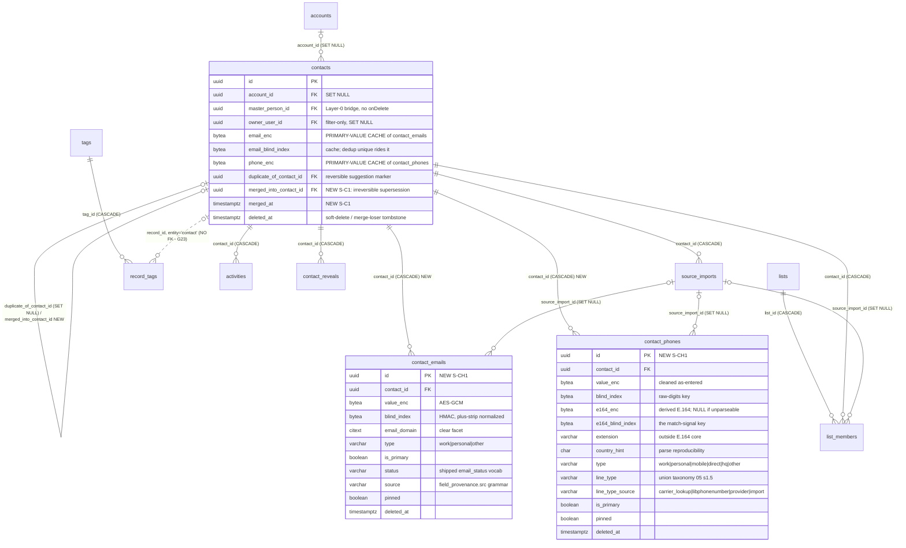
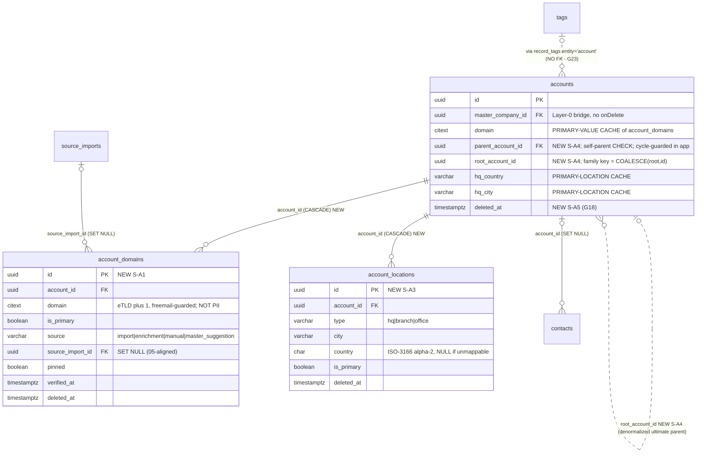
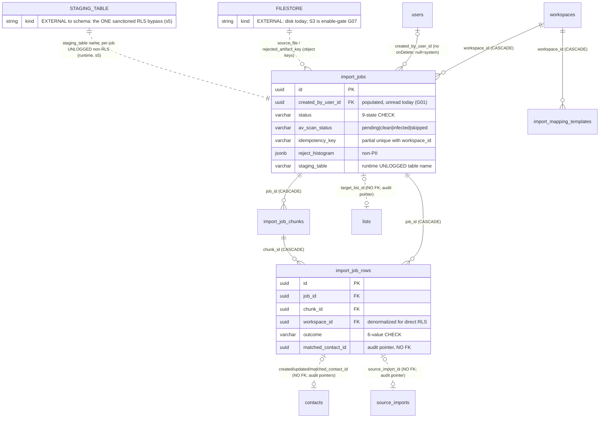
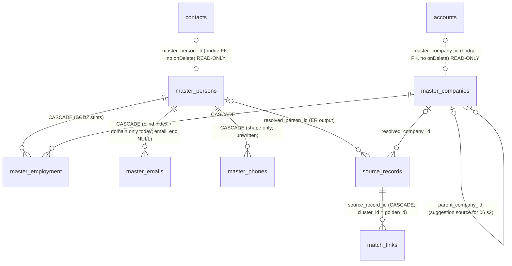
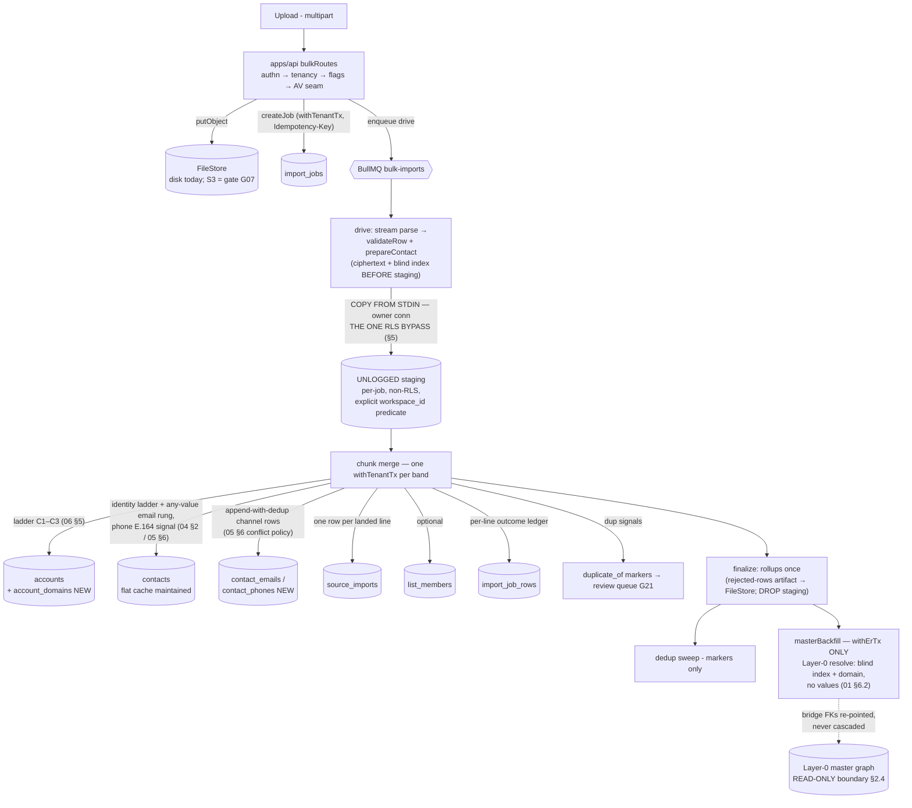

# 07 — Data-Model Relationships (consolidated ER, constraints, layer boundary)

> **Status of this doc:** complete (reference doc — the one target-state map every import doc in
> this series cites; written *after* docs `04`/`05`/`06` as the consistency check across them).
> **Evidence base:** schema ground truth re-verified at head for this doc
> (`packages/db/src/schema/{contacts,importJobs,lists,tags,masterGraph,importMappingTemplates}.ts`,
> `packages/db/src/rls/{contacts,importJobs,lists,tags,activity,billing}.sql`);
> design targets from [`04`](04-Contact-Schema-Design.md), [`05`](05-Multi-Value-Channel-Architecture.md),
> [`06`](06-Company-Schema-Design.md); gaps from [`02 §Register`](02-Root-Cause-and-Gap-Analysis.md).
> **Owns:** **G23 ◇** (`record_tags` FK-less polymorphism — disposition, §7) and the series-wide
> constraint/index inventory. Deliverable #11 in the README traceability table.
> **Migration references are step IDs only** (`S-C*` / `S-CH*` / `S-A*`, sequenced in doc `15`) —
> never fixed migration numbers (README §Conventions).

---

## Objective

One page-ish, citable answers to four questions every downstream doc (`08`–`15`) keeps asking:

1. **What does the target-state entity graph look like** once 04/05/06 land — as renderable ER
   diagrams split by domain (§2)?
2. **What holds it together** — every FK with its on-delete behavior, soft-delete semantics, and
   RLS policy per table (§3); every unique/dedup/pagination index, marked NEW vs EXISTING (§4)?
3. **Where is the layer boundary** — who may touch Layer-0, and what is the one (and only)
   sanctioned RLS bypass (§5)?
4. **What DDL does this series actually propose**, keyed by owning step ID, so doc `15` can
   sequence it (§8)?

Plus the consistency verdict across 04/05/06 (§1) — this doc runs after them precisely to catch
drift between three separately-authored designs of one schema.

## Reconciliation

- Every "EXISTING" claim below was re-verified against the schema/RLS files at head (paths in
  the header note); every "NEW" claim cites the owning design doc section and step ID.
- DM4 (tenancy unchanged), DM6 (one jsonb winner-map), ADR-0028 (custom fields stay jsonb), and
  the bulk-import design-of-record [`../data-management/15-bulk-import-design.md`](../data-management/15-bulk-import-design.md)
  bind everything here; nothing below contradicts them (§1 verifies the three designs don't either).
- Layer-0 (`masterGraph.ts`) is drawn in §2.4 **as a read-only boundary for this program** —
  consistent with 01 §6.1 and the prospect-database-platform series, which owns its internals.

---

## §1 Consistency verdict — 04 vs 05 vs 06

Cross-audited on the five axes below. Verdict: **consistent after nine minimal fixups** (applied
to docs 04 and 06 with this doc's authoring pass; each is a wrong cross-reference or a leftover
of the program brief's older shorthand that doc 05 deliberately refined — none was a design
disagreement that survived contact).

| # | Axis | Verdict |
|---|---|---|
| 1 | **Primary-cache sync contract** — one invariant, three applications: 04 §1 (email/phone columns as cache), 05 §3 (CH-INV-1 + `applyChannelWrite` single writer), 06 §1/§3 (`domain` + `hq_*` caches, deferring rationale to 05) | ✅ identical in shape: child rows own truth post-cutover; flat columns are a named cache rewritten in the **same `withTenantTx`** by a single write path; drift detected by a reconcile sweep whose repair direction is **phase-dependent** (flat wins pre-cutover, child wins after — 05 §3.4). *Fixed:* 04's pre-build and 06's pre-build both said "child wins, never the reverse" without the phase qualifier — both now cite 05 §3.4's phase rule. |
| 2 | **Merge contract vs child tables** — both directions | ✅ 04 §3.4's Class-A inventory includes 05's channel rows (demote-to-secondary, §3.3) and every verified contact-child FK; 05 delivers the prerequisites 04 names (stable ids, soft-delete, demotion targets); 06 delivers G18 (`deleted_at`) + merge-time cycle re-validation. The **account-merge child inventory** is enumerated nowhere in full — consolidated here (§3.1 note) by applying 04's contract to 06's children. *Fixed:* 06 §3 cross-referenced 04 for `contacts.account_location_id`, which 04 does not design — now marked deferred/adjacent-scope (§8). |
| 3 | **Dedup ladder** — 04 §2 identity ladder · 05 §2.2 channel uniques + signals · 06 §5 company C1–C3 | ✅ one coherent ladder: three contact primaries unchanged; the email rung widens to every live `contact_emails` value (safe: 05's per-workspace value unique keeps it deterministic); phone E.164 is a **signal, never an upsert key**; company matching is domain-first (C1 cache ≡ C2 whole-set), fuzzy name+geo review-only. *Fixed:* 04 §2 still carried the brief's shorthand (secondary-email hit = detection-only marker; "per-workspace value uniqueness" on both child tables) — contradicting 05 §2.2/§6, whose refinement (emails ws-unique → identity rung; phones per-contact-unique → signal) is the spec of record. 04 §2/§3.3/S-C6/T7 now match 05. |
| 4 | **Step-ID namespaces** | ✅ disjoint: `S-C1…S-C9` (04) · `S-CH1…S-CH5` (05) · `S-A1…S-A6` (06). §8 is the merged index. |
| 5 | **Provenance model** | ✅ identical DM6 split everywhere: the `field_provenance` winner-map governs the flat cache slot (pin blocks displacement, decided by `planFieldWrite`, never SQL); child rows carry per-value provenance (`source`, `source_import_id`, `pinned`, verification timestamps). *Fixed:* 06's `account_domains.source_import_id` was a bare uuid "to the import job" while 05's identically-named column is an FK → `source_imports` SET NULL — same concept, now same mechanics (bare-uuid pointers stay confined to job ledgers, §7). |

Two ordering checks from 05's flagged refinements: 04 sequences merge after 05's tables + backfill
(✅ no assumption of the older backfill-first order); 06's S-A1 embedded its backfill **before**
S-A2 dual-write — the exact write-gap hazard 05 §Implementation names — *fixed:* S-A1's backfill
now re-runs after S-A2 is live.

**Second-bypass check (verified while reading):** nothing in 04, 05, or 06 adds an RLS bypass.
04's merge runs on `withTenantTx` and "never the owner path" (04 §pre-build security); 05 stages
channel payloads as prepared ciphertext through the **same** existing staging table (05 §6) and
writes child rows inside the chunk `withTenantTx`; 06's composite FK is a constraint, not an
access path. The one sanctioned bypass stands alone (§5).

---

## §2 Target-state ER diagrams

Conventions: `||--o{` = real FK; `|o..o{` = pointer **without** FK (bare uuid); attributes shown
only for NEW tables and load-bearing columns. All Layer-1 tables also carry
`tenant_id`/`workspace_id` FKs → `tenants`/`workspaces` (ON DELETE CASCADE) — elided from the
diagrams for legibility, present in §3.

### 2.1 Contact domain (04 + 05 targets)

### 2.2 Company domain (06 targets)

### 2.3 Import domain (existing trio + templates; doc 08 extends, never replaces)

### 2.4 Layer-0 boundary — READ-ONLY for this program

Everything below the line is system-owned, carries **no tenancy columns and no RLS**
(`masterGraph.ts:6–9`; `rls/masterGraph.sql` creates no policies), and is reachable only via the
least-privilege `withErTx` path (§5). This series **never writes it and never joins it into a
tenant query**; the only edges crossing the boundary are the two nullable, re-pointable bridge
FKs (no onDelete — never cascade).

Boundary contract for this program: master hierarchy/domains surface **only as accept/reject
suggestions** (06 §2 — an accepted suggestion is an ordinary overlay write); the future
knowledge-DB projection *feeds* 05's child tables as one more `source`-labelled writer, never
replaces them (README §Relationship); grain-B master merge stays security-review-gated (01 §6.9).

---

## §3 Table-by-table relationship inventory

Layer-1 tables this series touches or re-points. RLS "ws-isolation" = the exact shipped idiom:
`USING/WITH CHECK (workspace_id = NULLIF(current_setting('app.current_workspace_id', true), '')::uuid)`,
ENABLE + FORCE, fail-closed (quoted from `rls/contacts.sql:31–33`; new tables get the same shape
verbatim — 05 §2.4, 06 §Security).

| Table | FKs (→ target, on-delete) | Soft-delete | RLS policy | Status |
|---|---|---|---|---|
| `contacts` | tenant/workspace → CASCADE; `account_id` → accounts SET NULL; `master_person_id` → master_persons (no onDelete — re-pointable bridge); `owner_user_id` → users SET NULL; `revealed_by_user_id` → users (no onDelete — immutable reveal credit); `pipeline_stage_id` → SET NULL; `duplicate_of_contact_id` → self SET NULL; **NEW** `merged_into_contact_id` → self (S-C1; loser-only, never cascades) | `deleted_at` (DSAR tombstone + **NEW** merge-loser producer, 04 §3.4) | ws-isolation (`contacts_workspace_isolation`) | EXISTING + S-C1 |
| `contact_emails` / `contact_phones` | tenant/workspace → CASCADE; `contact_id` → contacts **CASCADE** (hard-purge fanout only; product delete is soft); `source_import_id` → source_imports **SET NULL** | `deleted_at` (tombstoned rows = channel history; excluded from every partial index) | ws-isolation, **direct** on the denormalized `workspace_id` — never derived through the parent join (05 §2.4) | NEW S-CH1 |
| `accounts` | tenant/workspace → CASCADE; `master_company_id` → master_companies (no onDelete); **NEW** composite `(workspace_id, parent_account_id)` → `accounts (workspace_id, id)` SET NULL-on-purge (S-A4 — cross-workspace parent structurally impossible) | **NEW** `deleted_at` (S-A5, G18): children tombstone same-tx; hierarchy children spliced to grandparent; contacts keep `account_id` | ws-isolation (`accounts_workspace_isolation`) | EXISTING + S-A4/S-A5 |
| `account_domains` | tenant/workspace → CASCADE; `account_id` → accounts CASCADE (retention hard-purge only); `source_import_id` → source_imports SET NULL | `deleted_at` (soft-detach releases the ws-domain unique) | ws-isolation (06 §Security, quoted shape) | NEW S-A1 |
| `account_locations` | tenant/workspace → CASCADE; `account_id` → accounts CASCADE | `deleted_at` | ws-isolation | NEW S-A3 |
| `source_imports` | tenant/workspace → CASCADE; `contact_id` → contacts **CASCADE**; `imported_by_user_id` → users (no onDelete) | none (append-only lineage; retention class may reap) | ws-isolation (`source_imports_workspace_isolation`) | EXISTING; merge **re-points** rows to the survivor (04 §3.4 Class A) |
| `lists` | tenant/workspace → CASCADE; `owner_user_id` → users (no cascade); `saved_search_id` → SET NULL (⚠ FK proves existence, not workspace — write path validates under `withTenantTx`, `lists.ts:59–63`) | `deleted_at` (frees the name via partial unique) + `archived_at` | ws-isolation (`lists_workspace_isolation`) | EXISTING |
| `list_members` | tenant/workspace → CASCADE; `list_id` → lists CASCADE; `contact_id` → contacts CASCADE; `added_by_user_id` → SET NULL; `source_import_id` → SET NULL | none (hard rows; membership union on merge, conflict-skip) | ws-isolation (`list_members_workspace_isolation`) | EXISTING |
| `tags` | tenant/workspace → CASCADE | none | ws-isolation (`tags_workspace_isolation`) | EXISTING |
| `record_tags` | tenant/workspace → CASCADE; `tag_id` → tags CASCADE; **`record_id` = bare uuid, NO FK** (entity CHECK `contact|account`) | none | ws-isolation (`record_tags_workspace_isolation`) | EXISTING — **G23 ◇, §7** |
| `activities` | tenant/workspace → CASCADE; `contact_id` → contacts CASCADE; `actor_user_id` → users (null = system) | none (timeline re-points wholesale on merge) | ws-isolation (`activities_workspace_isolation`) | EXISTING |
| `contact_reveals` | tenant/workspace → CASCADE; `contact_id` → contacts CASCADE; `revealed_by_user_id` → users NOT NULL (no onDelete); unique claim `(workspace_id, contact_id, reveal_type)` | none (claims move on merge, never re-minted — 04 §3.4) | ws-isolation (`contact_reveals_workspace_isolation`) | EXISTING |
| `import_jobs` | tenant/workspace → CASCADE; `created_by_user_id` → users (null = system); `target_list_id` = bare uuid (audit pointer) | none (terminal statuses; retention reaps) | ws-isolation (`import_jobs_workspace_isolation`) — owner predicate is **app-layer**, doc `10` (no user GUC exists, 01 §5.1) | EXISTING (dark) |
| `import_job_chunks` | `job_id` → import_jobs CASCADE | none | scoped **through the parent job** (EXISTS subquery — `rls/importJobs.sql:26–34`; no own workspace_id) | EXISTING (dark) |
| `import_job_rows` | `job_id` → CASCADE; `chunk_id` → CASCADE; four `*_contact_id`/`source_import_id` = **bare uuids, NO FK** (point-in-time audit pointers — never rewritten by merge, Class B, 04 §3.4) | none (ledger; partitioning intent G25) | ws-isolation, direct on denormalized `workspace_id` | EXISTING (dark) |
| `import_mapping_templates` | tenant/workspace → CASCADE; `created_by_user_id` → users (null = system) | none (upsert-in-place by name) | ws-isolation (`rls/importMappingTemplates.sql`) | EXISTING |
| per-job staging table | none (UNLOGGED, non-RLS, runtime-created/dropped) | n/a (DROP on completion) | **none — the ONE sanctioned bypass, §5** | EXISTING (dark) |

**§3.1 Merge re-point contract (consolidated).** *Contact merge* (04 §3.4): Class A re-points
(channels demote-to-secondary; `list_members`/`source_imports`/`activities`/`record_tags`/
`contact_reveals`/`suppression_list(contact_id)`/`consent_records`/outreach/email/salesnav/intel
rows move to the survivor, conflict-skip under their uniques); Class B ledgers
(`import_job_rows`, `enrichment_job_rows`, `reveal_job_rows`, `provider_calls`) are **never
rewritten** — the loser tombstone's `merged_into_contact_id` is the traversal hop. *Account
merge* (04's contract applied to 06's children — enumerated here because neither doc lists it in
full): `account_domains` re-point + demote (collapse under the ws-domain unique, richer
verification wins), `account_locations` re-point, `contacts.account_id` re-points to the
survivor, `record_tags (entity='account')` re-point + dedupe, hierarchy edges inherit with
mandatory cycle re-validation + subtree `root_account_id` recompute (06 §2), loser tombstones
via S-A5. A future child table added without a merge rule must fail 04's T1 inventory itest.

---

## §4 Constraint & index inventory

### 4.1 Uniques & dedup keys

| Constraint (partial unless noted) | Table | Status | Role |
|---|---|---|---|
| `uniq_contacts_ws_email` `(workspace_id, email_blind_index)` WHERE non-null | contacts | EXISTING | primary identity rung 1 (binds to the primary cache) |
| `uniq_contacts_ws_linkedin` `(workspace_id, linkedin_public_id)` WHERE non-null | contacts | EXISTING | identity rung 2 |
| `uniq_contacts_ws_salesnav` `(workspace_id, sales_nav_lead_id)` WHERE non-null | contacts | EXISTING | identity rung 3 |
| `uniq_accounts_ws_domain` `(workspace_id, domain)` WHERE non-null | accounts | EXISTING → **modified S-A5** (adds `AND deleted_at IS NULL`; online swap) | company rung C1 (primary cache) |
| `uniq_source_imports_ws_content` `(workspace_id, content_hash)` WHERE non-null | source_imports | EXISTING | identical-payload idempotency |
| `uniq_list_members_list_contact` `(list_id, contact_id)` (full unique) | list_members | EXISTING | membership idempotency; merge conflict-skip target |
| `uniq_record_tags_tag_record` `(tag_id, entity, record_id)` (full unique) | record_tags | EXISTING | assignment idempotency (G23 §7) |
| `uniq_tags_ws_name` `(workspace_id, lower(name))` (full unique) · `uniq_lists_ws_name` (live-only partial) | tags / lists | EXISTING | name uniqueness |
| `uniq_import_jobs_ws_idempotency` `(workspace_id, idempotency_key)` WHERE non-null | import_jobs | EXISTING | submit idempotency |
| `uniq_import_job_chunks_job_chunk` `(job_id, chunk_index)` (full unique) | import_job_chunks | EXISTING | chunk claim dedup |
| `uniq_import_mapping_templates_ws_lower_name` `(workspace_id, lower(name))` (full unique) | import_mapping_templates | EXISTING | template upsert-in-place |
| `uniq_contact_emails_primary` `(contact_id)` WHERE `is_primary AND deleted_at IS NULL` (same shape for phones) | contact_emails/_phones | **NEW S-CH1** | at-most-one live primary (exactly-one is app-enforced + swept) |
| `uniq_contact_emails_ws_value` `(workspace_id, blind_index)` WHERE live | contact_emails | **NEW S-CH1** | one email *value* per workspace → any-value identity rung (05 §2.2) |
| `uniq_contact_emails_contact_value` / `uniq_contact_phones_contact_value` `(contact_id, blind_index)` WHERE live | both | **NEW S-CH1** | per-contact value dedup + FK-fanout index. **Phones are deliberately NOT ws-unique** — shared HQ lines are legal; cross-contact E.164 is a signal (05 §2.2) |
| `uniq_account_domains_ws_domain` `(workspace_id, domain)` WHERE live | account_domains | **NEW S-A1** | whole-set domain uniqueness → rung C2 safe |
| `uniq_account_domains_primary` `(account_id)` WHERE `is_primary AND deleted_at IS NULL` (locations sibling at S-A3) | account_domains/_locations | **NEW S-A1/S-A3** | one live primary per account |
| `uniq_accounts_ws_id` `(workspace_id, id)` (full unique) + composite FK `(workspace_id, parent_account_id)` | accounts | **NEW S-A4** | makes cross-workspace parentage a DB impossibility (FK checks bypass RLS — 06 §2) |
| CHECK `parent_account_id <> id` · CHECK extensions to `audit_log.action` (`contact.merge`, `channel_*`) | accounts / audit_log | **NEW S-A4 / S-C2** | self-parent block; closed audit enums |

### 4.2 Match-signal, facet & fetch indexes (non-unique)

| Index | Status | Role |
|---|---|---|
| `idx_contact_phones_ws_e164` `(workspace_id, e164_blind_index)` WHERE live+parsed | **NEW S-CH1** | the phone duplicate-*signal* probe (never an upsert key) |
| `idx_contact_emails_ws_contact` / `idx_contact_phones_ws_contact` `(workspace_id, contact_id)` | **NEW S-CH1** | per-contact channel fetch under the RLS predicate |
| `idx_contact_emails_ws_domain` `(workspace_id, email_domain)` WHERE live | **NEW S-CH1** | the any-value domain facet (G16 guard) |
| `idx_account_domains_account` `(account_id)` WHERE live | **NEW S-A1** | account-drawer domain set |
| `idx_accounts_ws_root` `(workspace_id, root_account_id)` WHERE non-null | **NEW S-A4** | family reads without recursive CTEs |
| partial index on `contacts.merged_into_contact_id` WHERE non-null | **NEW S-C1** | tombstone traversal / detector |
| `idx_contacts_duplicate_of` WHERE non-null · `idx_contacts_ws_owner` · `idx_contacts_ws_account` | EXISTING | review-queue input; owner filter (doc 10 rides it); per-account rollups |
| `idx_import_job_rows_job` · `idx_import_job_rows_ws_outcome` | EXISTING | job drill-down; outcome rollups |
| GIN pair on `custom_fields` (contacts + accounts) · `idx_accounts_technologies_gin` | EXISTING | ADR-0028 facets |

Index budget note: 05 caps its children at 6 indexes/table; 06 assumes small-N child sets.
Nothing beyond the rows above ships without a measured read (doc 12 owns the envelope).

### 4.3 Keyset-pagination indexes for the new list endpoints

House rule: cursor/keyset only, composite with `workspace_id` so pagination stays index-backed
under the RLS predicate.

| Endpoint (owning doc) | Index | Status |
|---|---|---|
| Tenant imports list `GET /imports` (doc 08, G04) | `(workspace_id, created_at DESC, id DESC)` on `import_jobs` — the order `listJobsByWorkspace` already uses (`importJobRepository.ts:170–176`) with **no backing composite today** (only `idx_import_jobs_ws_status`) | **NEW — doc 08's step set** (flagged here so 15 sequences it with the list route) |
| Accounts list (existing, unchanged) | `idx_accounts_ws_created_at` | EXISTING |
| Recent-imports feed (visibility-fixed in doc 10) | `idx_source_imports_ws_imported_at` `(workspace_id, imported_at DESC)` | EXISTING |
| Duplicate-review queue (docs 08/11, G21) | `idx_contacts_duplicate_of` partial; volume-based composite deferred to doc 12 | EXISTING |
| Channel / domain / location / family child sets | none — rendered fully (bounded small-N: ≤25 channels, ≤50 domains, ≤200 locations, depth-10 trees); **not paginated by design** (05 §pre-build, 06 §Scalability) | n/a |

---

## §5 Layer-boundary contract & the ONE sanctioned RLS bypass

**Three access paths, closed set** (`packages/db/src/client.ts`):

1. **`withTenantTx`** — the only path to Layer-1 overlay tables; sets the two fail-closed GUCs
   (`app.current_tenant_id`, `app.current_workspace_id`, `client.ts:82–91`) under non-BYPASSRLS
   `leadwolf_app`. There is **no user GUC** — "owner or admin" is inexpressible in policy; the
   job-visibility fix is app-layer by necessity (doc `10`; 02 §RC-1).
2. **`withErTx`** — the only path to Layer-0 (`leadwolf_er`, non-BYPASSRLS, no overlay grants,
   `client.ts:56–61`). Used by import's master resolve + backfill rollup; this program adds **no
   new `withErTx` call sites** — 06's suggestion surfacing reads through the existing bridge
   projection path only.
3. **`withPlatformTx`** — Surface-1 staff console (audited, capability-gated); out of this
   series' scope (README two-surface note).

**The one sanctioned bypass** — the per-job UNLOGGED staging table, quoted from the
design-of-record ([`../data-management/15-bulk-import-design.md`](../data-management/15-bulk-import-design.md)):
"COPY only fast-loads an **UNLOGGED, non-RLS** per-job staging table (Postgres forbids COPY on
RLS tables)" over the "**owner copy connection**", with rows *already prepared* — "PII is
encrypted even in staging"; isolation drops to access path — "all staging access is CONFINED to
this one repository" (`importStagingRepository`) on the owner connection, where "every read
carries an EXPLICIT `workspace_id` predicate" (quoted from `importStagingRepository.ts:1–8`;
01 §3.2). The schema declares the
same boundary: "the per-job UNLOGGED staging table is non-RLS by design … isolated by access
path in importStagingRepository — not here" (`rls/importJobs.sql:4–5`).

**No second bypass exists or is proposed.** Verified across all three designs while
consolidating (§1): 05's multi-value channel staging rides the *same* staging table as one
COPY-safe jsonb column of pre-encrypted bytes (05 §6); 04's merge and 06's writes run entirely
on `withTenantTx`. Any future design needing owner-connection access must amend
`data-management/15`, not this series.

---

## §6 Data flow — import → overlay → master (target state)

The as-is bulk path (01 §2.2) extended with the child-table writes (05 §6, 06 §5). The sync
path's unification onto this flow is doc `08`; nothing below changes the trust boundaries.

---

## §7 G23 ◇ disposition — `record_tags` FK-less polymorphism

**The fact** (`tags.ts:48–65`): `record_tags.record_id` is a bare uuid with an `entity` CHECK
(`'contact' | 'account'`) and **no FK** to either target table — the one polymorphic pointer in
the Layer-1 overlay. No referential integrity: deleting/merging a record cannot cascade or
SET-NULL its tag assignments.

**The risk, sized honestly.** Today the orphan window is small (contacts soft-delete, accounts
are rarely deleted, nothing merges). This series widens it on three fronts: a merge verb that
tombstones losers (04), account soft-delete + retention hard-purge (06/G18), and eventual bulk
deletes. Orphaned assignments are *harmless to reads* (tag filters join through the live parent,
so orphans are invisible) but they accumulate, distort tag-usage counts, and — worse — a
recycled-elsewhere uuid could in principle acquire stale tags. Severity stays P2 ◇ (02 §G23).

**Disposition — keep polymorphic; make every destructive verb tidy; defer the physical split:**

1. **Tidy-on-merge (already contracted):** 04 §3.4 re-points `(entity='contact',
   record_id=loser)` to the survivor with dedupe against `uniq_record_tags_tag_record`; the
   account-merge inventory (§3.1) does the same for `entity='account'`. 04's T1
   inventory-completeness itest is the guard.
2. **Tidy-on-purge (new requirement, recorded here):** the retention enforce-mode hard-purge of
   contact/account tombstones (06 §4) must delete matching `record_tags` rows in the same sweep
   — the manual analog of the CASCADE the missing FK would have provided. Soft-deleted (merely
   tombstoned) records keep their assignments — they are invisible via the live-parent join and
   preserved for restore.
3. **Orphan detector:** a nightly count of assignments whose `(entity, record_id)` resolves to
   no live row joins 06's detector family (cycles, cache drift, orphan children); alert > 0.
4. **Physical FK split deferred** (`contact_tags` + `account_tags` with real CASCADE FKs — the
   integrity-correct endgame): it is a table rewrite + dual-write + API migration for a P2 risk
   fully mitigated by 1–3, and this series' migration budget is spent on G15/G17/G18. Marked
   **adjacent-scope ◇**, owned by `14 §future`. The **principle it leaves behind is normative
   now**: every *new* overlay child table carries real FKs (05/06 all do — §3); bare-uuid
   pointers are permitted only in point-in-time job ledgers (`import_job_rows` Class-B posture)
   — `record_tags` is the sole legacy exception, and no new one may be added.

---

## §8 DDL summary by step ID (the index doc 15 sequences)

Every new table/column/index/constraint proposed by 04/05/06, keyed by owning step. "DDL" = No
means the step is code/flag/backfill only (listed because 15 sequences gates between them).

| Step (doc) | DDL | Contents |
|---|---|---|
| **S-CH1** (05) | Yes | Tables `contact_emails` + `contact_phones` (05 §1 column sets); uniques `uniq_*_primary`, `uniq_contact_emails_ws_value`, `uniq_*_contact_value`; indexes `idx_contact_phones_ws_e164`, `idx_*_ws_contact`, `idx_contact_emails_ws_domain`; RLS ENABLE+FORCE + ws-isolation policies + grants; `set_updated_at` triggers; retention-class seed rows (`ttlDays: null`, shadow) |
| **S-CH2** (05) | No | Dual-write via `applyChannelWrite` (env `CHANNEL_DUAL_WRITE`); flat stays authoritative |
| **S-CH3** (05) | No | Backfill: flat → primary child rows (email bytes verbatim; phones re-derive E.164); idempotent, re-runnable |
| **S-CH4** (05) | No | Read cutover (env `CHANNEL_READ_FROM_CHILD`); dedup/reveal/search/export read children; repair direction flips child-wins |
| **S-CH5** (05) | No | Permanent CH-INV-1 reconcile sweep + drift metric/alert |
| **S-C1** (04) | Yes | `contacts.merged_into_contact_id` (self-FK) + `merged_at`; partial index WHERE non-null |
| **S-C2** (04) | Yes | `audit_log.action` CHECK extension + `auditAction` enum: `contact.merge` (04 §4) and 05 §7's `channel_added/channel_promoted/channel_deleted/channel_primary_demoted` — one CHECK migration at PR time; scalar-edit audit-metadata contract |
| **S-C3** (04) | Seed | Per-tenant flag `contact_merge_enabled` (off) + env `CONTACT_MERGE_ENABLED` (dual-gate) |
| **S-C4–S-C5** (04) | No | Merge engine (`packages/core`, the ONLY value-moving implementation) + `POST /contacts/:id/merge` + preview + DTOs — after S-CH1..4 |
| **S-C6** (04) | No | Ladder extension: any-value email resolve + phone-signal markers in `findByDedupKeys` + bulk-staging equivalents |
| **S-C7–S-C9** (04) | No | Masked-DTO channel summary; cache↔child reconcile sweep; Surface-1 maker-checker wrapper on the same engine |
| **S-A1** (06) | Yes | Table `account_domains` (06 §1) + `uniq_account_domains_ws_domain`, `uniq_account_domains_primary`, `idx_account_domains_account`; RLS + trigger + grants; primary-row backfill (re-run after S-A2 — 05's ordering refinement) |
| **S-A2** (06) | No | Account dual-write (child + cache, one tx); cache authoritative until S-A6 |
| **S-A3** (06) | Yes | Table `account_locations` (06 §3) + primary partial unique + RLS; best-effort HQ backfill (unmappable country → NULL) |
| **S-A4** (06) | Yes | `accounts.parent_account_id` + `root_account_id`; `uniq_accounts_ws_id`; composite same-workspace FK; self-parent CHECK; `idx_accounts_ws_root` |
| **S-A5** (06) | Yes | `accounts.deleted_at` (G18); online swap of `uniq_accounts_ws_domain` → live-only partial; live-only partials on account list/search indexes per doc 12 |
| **S-A6** (06) | No | Per-tenant read cutover (dual-gate): `domains[]`/`locations[]`/hierarchy in API; ladder rung C2 activates |
| *(deferred, no step)* | — | `contacts.account_location_id` (06 §3 consuming edge — adjacent-scope ◇); `contact_tags`/`account_tags` physical split (§7); **G22 ◇ field-level history** (recorded here per 02 §Register: 04 §4's in-tx `audit_log` before/after metadata is the shipped answer; overlay temporal tables stay `14 §future` — no DDL in this series); doc 08's `import_jobs` keyset list index (§4.3) rides 08's step set |

**Hard ordering edges 15 must honor** (from 04/05/06, restated once): S-CH2 (dual-write)
**before** the final S-CH3 backfill pass; S-C4 (merge engine) **after** S-CH1–S-CH4 *and* S-A1 +
S-A5 (demotion targets + tombstones — 02 §RC-5); S-A6's C2 rung **after** S-A1's backfill
converges. Everything is additive; no column is renamed or dropped anywhere in this series.

---

## Testing / Rollout / Success (pointers)

Testing, rollout phases, and success metrics live with the owning designs (04/05/06 §Testing,
§Rollout) and the roadmap (doc `14`); doc `15` sequences the steps above with per-gate test
requirements. This doc adds exactly two cross-cutting guards of its own: **(a)** 04's T1
merge-inventory itest is the enforcement point for §3.1's consolidated inventory (a child table
without a merge rule fails loudly); **(b)** §7's orphan detector joins 06's nightly detector
family. UI/UX: not applicable (reference doc; surfaces live in doc `11`).
