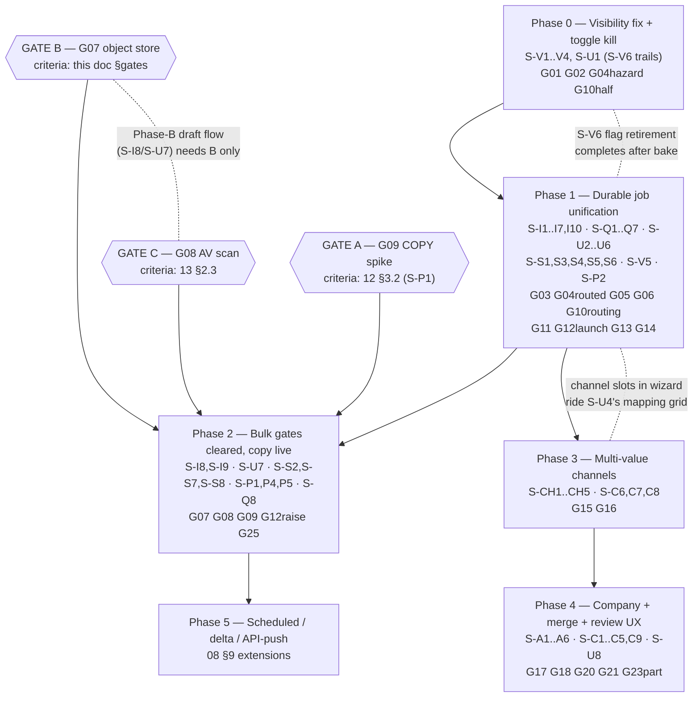

# 14 — Roadmap, Risk & Future Enhancements

> **Status of this doc:** complete (execution doc — deliverables #14 roadmap, #15 risk
> assessment, #19 future enhancements, merged deliberately: risk items ARE per-phase gate
> criteria; separating them guarantees drift).
> **What this doc owns:** the phase spine (Phase 0–5), the three infra enable-gates' roadmap
> placement — including **G07's gate criteria** (02 §Register assigns G07 here) — the risk
> register with rollback pointers, the deferral dispositions of **G19 ◇ / G22 ◇ / G24 ◇ /
> G26 ◇** (02 §Register routes each "deferred via 14" through this doc), and
> the Future-Enhancements backlog with triggers.
> **What this doc does not do:** re-specify any design (docs 04–13 own their step IDs) or
> sequence migrations/DDL (doc `15` consumes this doc's phase gates and owns step ordering,
> test-gate detail, and rollback rehearsal — the handles this doc gives it are `15 §M-SEQ`,
> `15 §T-P0…§T-P5`, `15 §R-P0…§R-P5`).

---

## Objective

Turn the gap register (02 §G01–G26) and the designs in docs 04–13 into an executable, gated,
dependency-ordered delivery plan. Acceptance test for this doc: **every non-◇ gap is placed in
exactly one phase; every ◇ gap is either phased or deferred with an explicit rationale**
(§Gap-coverage checklist, the closing table). Format follows the precedents:
`database-management-research/14-Implementation-Roadmap.md` (per-phase entry/exit gates, effort
bands, dependency graph) and `worker-platform/15-phased-implementation-plan.md` (hard gates
folded into phases; "do not fix a non-bug first").

Effort bands reuse the established T-shirt scale: **S** ≈ ≤3 eng-days · **M** ≈ 1–2 eng-weeks ·
**L** ≈ 3–5 eng-weeks · **XL** ≈ 6+ eng-weeks (multi-person). Estimates are engineering-only
and exclude vendor/infra lead time (called out where it gates a phase).

---

## Reconciliation (what this roadmap is pinned to)

- **Confirmed program decision ② (README §Confirmed):** this roadmap **assumes the three
  bulk-infra enable gates get cleared in their phase** (Phase 2): production S3-compatible
  object store (G07), real AV scan (G08), COPY-FROM-STDIN spike (G09). The assumption is
  explicit, not silent — §Standing fallback posture states what stands if it fails.
- **Enable-gates, not build-gates** (data-management/15 §6, restated by 08 §8): everything
  except copy-mode engagement and the Phase-B draft flow ships **dark ahead of the gates**,
  additive, dual-gated. This roadmap never converts an enable-gate back into a build-gate.
- **Dark subsystems graduate behind their *existing* flags, never by deleting the gate**
  (db-mgmt-research/14 rule 3): copy mode graduates the shipped `BULK_IMPORT_ENABLED` env +
  per-tenant `bulk_import_enabled` pair; no flag is removed until its 15 §R-handle rehearsal
  passed and its phase's bake period ended (10 S-V6 is the template).
- **Shipped-status lives in doc 16 only** (16 §Update protocol): badge changes flow
  `16 → 01 → 02 → the phase gate here`. The gate-state tracker (16 §Gate-state tracker) is the
  live record of G07/G08/G09; this doc's gate rows cite it, never fork it.
- **No fixed migration numbers** (README §Conventions); phases reference step IDs only.
- **Skill mandates encoded:** every phase carries a runbook/observability requirement before
  its flag flips (truepoint-operations: "you operate what you can see"; a feature without a
  runbook entry is not done), and no phase ships a destructive or spend-bearing verb without
  dual-gate + audit + rehearsed rollback (truepoint-security precedence; worker-platform F3
  precedent). The pre-build pass is answered at the delta level in §Pre-build answers.
- **Prior-series boundaries:** Surface-1 staff console work stays in
  `database-management-research/` (G26 ◇ hands off there); queue substrate posture is
  worker-platform's (its Phases 0–5 are implemented-pending-CI and are **assumed present**, not
  re-planned here); `prospect-database-platform/05`'s projection remains the future *feeder* of
  the channel tables, never their replacement (README §Relationship).

### Sequencing conflicts found between the design docs, and how this roadmap resolves them

| # | Conflict | Resolution (binding here) |
|---|---|---|
| 1 | Program-brief Phase 0 said "no schema", but 10 **S-V1 is DDL** (share-flag columns, keyset indexes, `import_policy`) | "No schema" is narrowed to **no data-model schema change**. S-V1's additive, unread-when-flag-off job-table DDL is in Phase 0 — it is the predicate's substrate and is byte-invisible flag-off (10 §Rollout) |
| 2 | Program-brief Phase 0 said "route the dead import list endpoint" (G04), but 08 **S-I4 requires S-I3's durable rows and ships "only with 10's predicate"** | Split: Phase 0 **disposes of the hazard** — S-V2 deletes the unpredicated `listJobsByWorkspace` read (rename-don't-overload, 10 §4.2 rule 1). The routed tenant list endpoint itself is Phase 1 (S-I4): before S-I3, `import_jobs` holds no sync-path rows, so a Phase-0 route would list nothing while shipping an unpredicated surface |
| 3 | Program-brief Phase 0 floated "notification-of-completion minimal wiring if 09 permits" | **09 does not permit it in Phase 0**: S-Q3/S-Q4 attach outbox intents to `import_jobs` status transitions, which exist only from S-I3 (Phase 1). A Phase-0 notification would rebuild the best-effort Redis-event insert 09 §6.1 disqualifies. Notifications land Phase 1 (S-Q3/S-Q4 + S-U5) — the first user-visible Phase-1 flip per 09 §Rollout |
| 4 | Program-brief Phase 1 said "retirement window for the legacy Redis path" as if it completes there; 08 §1.2 + 09 S-Q8 stagger it | The window **opens** in Phase 1 (poll reads the job row; legacy status mapping 08 §2.4) but **cannot close** before G07 (rows-in-payload transport stands until Phase B) — S-Q8 (queue retirement) and `/imports/bulk` retirement are Phase 2 exit items |
| 5 | Program-brief shorthand listed channel backfill before dual-write | Already resolved by 05 §Implementation Steps (ordering refinement): **S-CH2 before S-CH3's final pass** — expand → dual-write → backfill → cutover. This roadmap adopts 05's order; 15 encodes the gate between each |
| 6 | Program-brief Phase 3 bundled "04's cache/merge prerequisites"; 04's merge engine hard-depends on 06's S-A1 + S-A5 (07 §8 edge), which the brief put in Phase 4 | 04 splits cleanly: **S-C6/S-C7/S-C8** (ladder extension, masked channel DTO, reconcile sweep — pure channel consumers) ride Phase 3; **S-C1–S-C5 + S-C9** (merge contract) are Phase 4, internally ordered **after** S-A1/S-A5 land within the phase |
| 7 | 08 §8 left G08's launch-blocker status open ("blocker vs fast-follow") | 13 §2.3 decided it; this roadmap places it: G08 is a **hard blocker for copy mode (Phase 2 exit)** and for **Phase-B draft-flow GA** (files become long-lived shared-store objects at G07); the Phase-A fast path may run ahead of it, as it does today, with the upload-seam scan (S-S2's first wire point) preceding the store-side one |

---

## Current Challenges / Enterprise Best Practices / Gaps (template pointers)

The as-is is doc 01; the causal analysis and register are doc 02; external practice enters only
via doc 03 (this doc introduces no new platform claims — phase-shaping anchors are cited by the
owning designs). The gaps this doc **owns**: **G07** (gate criteria, §The three infra gates)
and the **deferral dispositions of G19 ◇, G22 ◇, G24 ◇, G26 ◇** (§Future enhancements). All other
gaps are placed, not re-analyzed (§Gap-coverage checklist).

---

## Recommended Solution — the phase spine

### At a glance

| Phase | Theme | Gaps closed | Headline flags | Effort | Ships schema? |
|---|---|---|---|---|---|
| **0** | Stop the bleeding: visibility fix + kill the dead end | G01 G02 · G10 (toggle half) · G04 (hazard half) | `JOB_VISIBILITY_SCOPED` + `job_visibility_scoped` | **M** | Additive DDL only (S-V1 + the P0 audit-action CHECK rider, 15 ruling M1) |
| **1** | Durable job unification (08 Phase A) | G03 G04 G05 G06 G11 G13 G14 · G10 (routing half) · G12 (launch numbers) | `IMPORT_V2_ENABLED` + `import_v2_enabled` | **XL** | S-I1/S-I2 additive |
| **2** | Clear the three bulk gates; large files live (08 Phases B+C) | **G07 G08 G09** · G12 (raise) · G25 (posture+alert) | graduates `BULK_IMPORT_ENABLED` + `bulk_import_enabled` | **L** (+ infra lead time) | S-I9 audit CHECK; S-P5 storage params |
| **3** | Multi-value channels | G15 G16 | `CHANNEL_DUAL_WRITE`, `CHANNEL_READ_FROM_CHILD` | **L** | S-CH1 |
| **4** | Company completeness + true merge + resolution UX | G17 G18 G20 G21 · G23 (mitigations 1–3) | `CONTACT_MERGE_ENABLED` + `contact_merge_enabled`; S-A6 dual-gate | **XL** | S-C1/S-C2/S-C3 · S-A1/S-A3/S-A4/S-A5 |
| **5** | Import platform extensions | — (08 §9 backlog; no register gaps) | per-extension dual-gates (named at design time) | **M–L** | `external_id` unique (sketch, 08 §9) |

### Cross-phase dependency diagram

Reading of the graph: **P2 and P3 are parallelizable** — the channel tables need none of the
three infra gates; if infra lead time stretches, Phase 3 (and 4) proceed while Phase 2 waits.
The strict chain is P0 → P1 (predicate before surfaces; durable rows before history), P1 → P2
(copy mode extends the unified engine), P3 → P4 (merge demotes into child rows; 07 §8's hard
edge), P2 → P5 (scheduled/API imports assume the draft flow + object store).

---

### Phase 0 — Stop the bleeding (visibility fix everywhere + kill the dead end)

**Objective.** Close the two *live, user-facing* defect classes without waiting for the
platform work: the visibility leak on every job surface (G01, program decision ③: import +
reveal + enrichment lists + Recent Imports card, uniformly) and the wizard's recommended-403
dead end (G10's toggle half). Ships independently of everything else.

**Contents (grouped step IDs — owning docs specify them).**
- 10 **S-V1** (additive DDL: share-flag columns, member-list keyset indexes, `import_policy`),
  **S-V2** (`JobViewer` + shared `jobVisibility` predicate; repository renames delete the
  unpredicated reads — this is the G04 hazard disposal), **S-V3** for the **live** surfaces
  (reveal list/detail, enrichment list/detail, home Recent Imports, import detail/legacy poll —
  propagation-matrix rows 2, 3, 6–9), **S-V4** (G02 create-grant + `import_policy` knob +
  template gates, riding the same flag so tenant behavior changes once).
- 11 **S-U1**: toggle kill (flag-independent — the server routes regardless, 08 §1.2) +
  TanStack adoption + `/imports` route scaffolding (nav entry hidden until Phase 1 gives it a
  page); Recent Imports card copy split (11 §1.5) rides the S-V3 flag.
- Matrix rows that ride Phase-1 endpoints (1, 4, 5, 10-write-gates already in S-V4) are
  explicitly **not** Phase 0 — new surfaces ship strict from birth in their own phase.

**Dependency edges.** None inbound (root phase). S-V1 → S-V2 → S-V3/S-V4.

**Entry gate.** Pre-build pass presented (this doc §Pre-build answers + 10's); comms plan
drafted — 10 §Rollout: **narrowing live visibility is a communicated product change, not a
silent fix** (release note + in-app notice; this is the "Phase 0 comms" 10 S-V6 cites).

**Exit gate (all must hold).**
- T-V1 green: flag-on ⇒ zero member-visible foreign jobs on every §5 surface; T-V4 green:
  flag-off ⇒ byte-identical legacy visibility (the rollback lever proven, not assumed).
- Cross-tenant + cross-user isolation itests in CI; repo grep: no unpredicated job-list read
  compiles (10 §4.2 rule 1 — the old names no longer exist).
- Toggle dead: zero `bulk_import_disabled` 403s servable from the wizard (08 §Success).
- Staged flip complete: internal workspaces → new-tenants-default-on → tenant cohorts with
  comms; only then S-V6 (branch deletion) — which may trail into Phase 1 (bake time).
- Runbook entry landed for the flag pair + the "member reports missing jobs" support path.

**Flags.** `JOB_VISIBILITY_SCOPED` (env kill-switch) + `job_visibility_scoped` (per-tenant,
seeded off, surfaces in the shipped generic flag console).
**Rollback lever.** Flag off ⇒ workspace-wide reads return, byte-identical (10 §Rollout);
rehearsal owned by **15 §R-P0**. S-V1 DDL is additive with written down-migrations.
**Effort.** **M** (S-V1 S · S-V2 M · S-V3 S · S-V4 S · S-U1 S — one engineer, ~2 weeks + comms
lead time).
**Success metrics.** 10 §Success verbatim: the reported defect class unreproducible; IDOR
probes 100% 404; <1% of import attempts 403 post-comms (G02 friction sanity); zero tickets
citing the Large-file toggle (11 §Success, shared).

---

### Phase 1 — Durable job unification (08 Phase A)

**Objective.** Every import — small files included — becomes a durable `import_jobs` row with
states, counters, per-row ledger, history, cancel, retry-failed, and outbox-driven completion
notification; the legacy Redis-only job state stops being the record. Kills RC-2/RC-3 for the
live path. No new infra: uses the shipped trio, queue, and outboxes.

**Contents (grouped).**
- 08 **S-I1/S-I2** (additive DDL), **S-I3** (fast-path dual-write wrapper — G03 closes),
  **S-I4** (list/detail/cancel — G04+G05 close; list ships with 10's predicate from birth,
  matrix rows 1, 4), **S-I5** (server-side routing — G10's routing half; `file_too_large`
  honest refusal until Phase 2), **S-I6** (strategy triad — G13), **S-I7** (artifact pair —
  G14 with 13's envelope), **S-I10** (retry-failed children + quota + deferred shed).
- 09 **S-Q1/S-Q2** (unified queue + fairness), **S-Q3/S-Q4** (outbox producers + notify
  consumer — G06 closes; first user-visible flip per 09 §Rollout), **S-Q5/S-Q7**
  (reaper extension + metrics/alerts/runbooks — gate-independent hardening, land any time),
  **S-Q6** (progress cadence + SSE names reserved, wiring stays dark).
- 11 **S-U2–S-U6** (history page, durable progress page + poller deletion — G11 closes with
  09 §4's never-give-up contract, wizard v2, notifications UI, error UX).
- 13 **S-S1/S-S5/S-S6** (upload envelope hardening on the new path), **S-S3/S-S4** (artifact
  neutralization + proxied download, strict from birth with S-I7/S-V5).
- 10 **S-V5** (artifact gate + download audit, rides S-I7).
- 12 **S-P2** (published limits — G12 launch numbers, rendered pre-upload).

**Dependency edges.** Phase 0's predicate substrate (S-V2/S-V3) is a hard prerequisite for
S-I4 (08: "list ships only with 10's predicate"). Internal: S-I1 → S-I3 → {S-I4, S-I5, S-I7};
S-Q3 → S-Q4; S-I4 → S-U2; S-I3 → S-U3. The legacy-retirement **window opens** here (poll reads
the row; 08 §2.4 status mapping) and closes in Phase 2 (conflict resolution #4).

**Entry gate.** Phase 0 exit green (predicate exists, comms done). Worker-platform CI gates
green (its outbox + DLQ substrate is what S-Q3 composes).

**Exit gate (all must hold).**
- Zero vanished imports: no "404 after 200" occurrences; 100% of committed imports listable
  (08 §Success); accounting-identity violations = 0 (alert wired, 09 §8).
- T-Q3 notification parity + T-Q5 Redis-flush drill green: every committed import reaches a
  terminal state through a worker crash and a Redis flush (09 §Success "zero lost jobs").
- Give-up copy ("taking longer than expected") deleted from the codebase; `useImport` poller
  deleted (S-U3); wizard submits → navigates to the durable page.
- Limits enforced from one constant set with RFC 9457 slugs (S-P2); fast-pair ceiling honest.
- Fast-path 2M-era soak N/A, but S-P4's **fast-path** scenario green (starts here per 12
  §Rollout); runbook entries for stall detector, DLQ, notification lag.
- Internal workspaces → design-partner canary → cohort flip on `import_v2_enabled` complete.

**Flags.** `IMPORT_V2_ENABLED` + `import_v2_enabled` (dual-gate; flag-off = byte-identical
legacy behavior — Phase-A dual-writes are additive). S-Q3's retirement of best-effort handlers
rides the same gate.
**Rollback lever.** Flag off at any point; executed imports keep their durable rows (data is
never rolled back by a flag — 08 §Rollout). Outbox rows drain harmlessly post-flip (09
§Rollout). Rehearsal: **15 §R-P1**.
**Effort.** **XL** (the widest phase: ~3 engineers · 4–6 weeks; S-I3 and S-Q3 are the critical
path; S-U4 wizard v2 is the largest single UI slice).
**Success metrics.** 08 + 09 + 11 §Success: "import broken/stuck" tickets ↓; notification
delivery ≥ 99.9%, p95 < 60 s; wizard funnel baseline captured; time-to-first-import ↓.

---

### Phase 2 — Clear the three bulk gates; large-file imports live (08 Phases B+C)

**Objective.** Execute confirmed decision ②: clear G07 (object store), G08 (AV), G09 (COPY
spike), then graduate the shipped-dark bulk pipeline — draft flow (Phase B), copy mode above
threshold (Phase C), per-tenant cohort rollout on the existing `bulk_import_enabled` pair —
and complete the legacy-path retirement.

**The three gates are §The three infra gates below** (criteria + owner). Phase-internal order:

1. **GATE B (G07)** cleared → 08 **S-I8** draft flow + 11 **S-U7** (canary only, not GA) +
   13 **S-S7** (artifact lifecycle/retention wiring — needs the store).
2. **GATE C (G08)** cleared (13 S-S2) → Phase-B **GA** (13 §2.3's binding: no GA of files-in-
   shared-store without the scanner; the no-new-`skipped` monitor turns on and never off).
3. **GATE A (G09)** cleared (12 S-P1 green in CI — or the §3.3 fallback lands with its own
   measured floor) → 08 **S-I9** copy-mode engagement: internal canary → per-tenant cohorts on
   `BULK_IMPORT_ENABLED` + `bulk_import_enabled` → published ceiling raised per 12 §5 only
   after S-P4's 2M soak is green.
4. Retirement completes: 09 **S-Q8** (legacy `imports` queue: producer switch → drain window →
   removal), `/imports/bulk` delegate window ends, Redis-poll read deleted (08 §1.2 targets).
5. 12 **S-P4** (nightly 2M soak + fairness scenario), **S-P5** (storage params — may ship any
   time from Phase 1), G25 posture: partition-compat rules R1–R5 asserted on all shipped DDL,
   100M-row alert wired (conversion itself: Future, F10). 13 **S-S8** (DSAR extension over
   stored artifacts/ledger — rides the retention track once S-S7's store wiring exists).
   12 **S-P3** stays trigger-conditional in every phase (each index ships only on its named
   route + a measured p95 breach — never speculatively).

**Dependency edges.** Phase 1 exit (copy mode extends the unified engine; S-I9 depends on
S-I4–S-I8). Gates B and C are independent of each other and of A; B alone unlocks the draft
flow; A+B+C together unlock copy mode. Infra procurement (bucket, KMS, scanner deployment) is
the schedule risk and starts at Phase-1 kickoff (lead time runs parallel).

**Entry gate.** Phase 1 exit green; infra approved and provisioned in a non-prod environment;
15 §T-P2 test plan reviewed (it inherits db-mgmt-research/05's AC1–AC3 so the two series
cannot diverge on "done").

**Exit gate (all must hold).**
- All three gate rows in **16 §Gate-state tracker** flipped with evidence links (the only
  place shipped-status lives).
- One canary tenant runs a real ≥100k-row file end-to-end (upload → scan → stage → promote →
  finalize → artifacts → notification), idempotency replay proven (same key ⇒ same job).
- EICAR infected path green end-to-end (T-S3); fail-closed outage drill run.
- 2M soak inside 12 §1.2's stage budgets; fast-lane p95 ≤ 3 min under whale load (12 §Success);
  worker RSS independent of file size (the constant-memory release gate).
- Legacy surfaces gone: S-Q8 drained + removed; `GET /imports/:jobId` legacy mapping window
  closed per the comms date this phase sets (the "retirement date" 08 pre-build assumption 4
  asks this doc for: **end of Phase 2, announced at Phase-2 entry with ≥ one release of
  notice**).
- Runbooks: scanner outage, store outage, staging-bloat, stuck-copy-drive entries landed.

**Flags.** Graduates the existing `BULK_IMPORT_ENABLED` + `bulk_import_enabled`; no new flag
for copy mode (db-mgmt-research/14 rule 3). Draft flow rides `IMPORT_V2_ENABLED`'s pair.
**Rollback lever.** Copy mode off per-tenant or fleet-wide ⇒ fast path + honest ceiling
(Phase-1 posture) — **not** a return to the Redis path once S-Q8 has run; that irreversibility
is why S-Q8 is exit-gated on a full drain + bake. Rehearsal: **15 §R-P2**.
**Effort.** **L** engineering (S-I8/S-I9 M each; S-S2 M; S-P1 S–M; S-Q8 S; S-P4 M) **plus
infra lead time** (bucket/KMS/scanner selection + deployment — external, may dominate).
**Success metrics.** 12 §Success (p95 wall time 2M ≤ 90 min at C=1; G09 closed with numbers);
13 §Success (0 new `skipped`; artifact audits 100%); zero `file_too_large` refusals above the
published ceiling (the ceiling is now the real product limit, not a gate apology).

---

### Phase 3 — Multi-value channels (emails + phones)

**Objective.** Close G15/G16: overlay child tables `contact_emails`/`contact_phones` via the
expand → dual-write → backfill → cutover → permanent-drift-sweep discipline (05), with the
flat encrypted columns retained permanently as the primary-value cache (CH-INV-1), plus the
channel consumers from 04 and the import mapping extension.

**Contents (grouped).** 05 **S-CH1 → S-CH2 → S-CH3 → S-CH4 → S-CH5** (strictly in 05's
refined order — conflict resolution #5); 04 **S-C6** (any-value dedup ladder extension),
**S-C7** (masked channel DTO), **S-C8** (cache↔child reconcile sweep, pairs with S-CH5);
import mapping channel slots (08 §3's mapping model + 11 §W2's slot UI — an increment on
S-U4's shipped grid, not a new wizard); 12 §9's projection contract fields on the dev
`SearchPort` adapter (counts/presence/any-value domain facet — the G16 guard made testable).

**Dependency edges.** Phase 1 (channel writes land once, on the unified write path;
enrichment/verification writers migrate onto `applyChannelWrite` during S-CH2 per 05
§Rollout). **Independent of Phase 2** — runs in parallel if infra stalls. Hard internal edges:
S-CH2 on → S-CH3 run+re-run → **drift = 0 verified** → S-CH4; S-CH1 before any S-C6/S-C7.

**Entry gate.** Phase 1 exit (write path unified); 15 §T-P3 parity plan reviewed (dual-write
byte-identity tests exist before the flag exists).

**Exit gate (all must hold).**
- Backfill completeness: contacts with flat values but no child rows = 0 before S-CH4 flips.
- Drift = 0 on the S-CH5 sweep for a full cycle post-cutover (05 §Success — the invariant
  holds in production, not just CI).
- Zero values dropped by import: multi-column files preserve 100% of parseable values.
- G16 guard green: dedup/search/export/reveal all resolve secondaries (T-suite per 05 §5);
  secondary values never appear in any index or mask-bypass (isolation review).
- RLS itests on both tables green; no cross-workspace or pre-reveal exposure.

**Flags.** `CHANNEL_DUAL_WRITE` (env kill-switch), `CHANNEL_READ_FROM_CHILD` (env), backfill
job-level flag + per-workspace batch control; per-tenant canary of S-CH4 optional via the
shipped dual-gate pattern (05 §Rollout).
**Rollback lever.** S-CH2 off ⇒ shipped write path byte-identical; S-CH4 off ⇒ reads return
to flat (still dual-write-maintained; secondaries invisible again, **nothing lost**); backfill
re-runnable, non-destructive. Rehearsal: **15 §R-P3**.
**Effort.** **L** (S-CH1 S · S-CH2 M · S-CH3 M incl. re-run/verify cycles · S-CH4 M ·
S-CH5+S-C8 S · S-C6/S-C7 M · mapping slots S).
**Success metrics.** 05 §Success verbatim, plus: secondary-hit dedup rate > 0 (the G15/G16
payoff measured); merge executor (Phase 4) unblocked.

---

### Phase 4 — Company completeness, true merge, resolution UX

**Objective.** Close the company-model gaps (G17/G18), activate the true-merge contract
(G20 — field union through `planFieldWrite`, child re-pointing, loser tombstone), and give
duplicate debt a resolution surface (G21). This is the phase where RC-5 ends.

**Contents (grouped, internally ordered).**
1. 06 **S-A1 → S-A5** (domains child table + dual-write + locations + hierarchy + accounts
   `deleted_at`) — the merge prerequisites (07 §8: S-C4 **after** S-A1 + S-A5); then **S-A6**
   (per-tenant read cutover; ladder rung C2 activates).
2. 04 **S-C1/S-C2/S-C3** (tombstone columns, audit CHECK extension, flag seed — additive DDL
   that rides this phase's migration train), then **S-C4/S-C5** (merge engine + API, after
   S-CH1–4 ✓ Phase 3 and S-A1/S-A5 ✓ step 1), **S-C9** (Surface-1 maker-checker wrapper on the
   same engine — supersedes grain-A's marker-only executor per 04 §3.5).
3. 11 **S-U8**: duplicate-review queue under Data Health + side-by-side merge panel +
   company-match tab (the G21 in-place upgrade of the dismiss-only DuplicatesSection).
4. G23 mitigations 1–3 land here structurally (07 §7): merge re-points `record_tags`
   (inventory-guarded by 04's T1 itest), retention purge tidies assignments, nightly orphan
   detector joins 06's detector family. The physical FK split stays deferred (Future F09).

**Dependency edges.** Phase 3 exit is a hard prerequisite (type-aware channel demotion is what
makes merge lossless — 02 §RC-4→RC-5). Phase 2 is **not** a prerequisite. Internal: S-A5
before S-C4; S-U8 after S-C4/S-C5.

**Entry gate.** Phase 3 exit green (drift = 0 baked); security review of the merge executor
scheduled (the standing grain-B deferral was "pending security review" — this phase is where
that review happens, with the executor's caps/guardrails from 04 §3.1 as its input).

**Exit gate (all must hold).**
- T1 merge-inventory completeness green (a loser with rows in every Class-A table merges to
  zero dangling references) — and the itest is the standing guard for future child tables.
- T3 pin preservation, T5 idempotent replay, T6 reveal/billing invariants green; zero
  cross-workspace merge writes (isolation alert wired).
- 06's nightly detector steady-state clean: 0 cycles, 0 cache drift, 0 orphaned children,
  root consistency 100%; account API byte-identical with S-A6 off (flag-off test).
- Merge preview + explicit irreversibility copy shipped (11 §5.2); caps low at canary
  (design-partner tenants first, per 04 §Rollout) for a full reconcile-sweep cycle before
  widening.
- Duplicate-marker backlog burndown measurable (04 §Success ≥X% in 30 days of enablement).

**Flags.** `CONTACT_MERGE_ENABLED` + `contact_merge_enabled` (dual-gate, seeded off); S-A6's
per-tenant read-cutover dual-gate (named at PR time); S-U8 rides the merge pair.
**Rollback lever.** Flags off ⇒ marker-only world returns; **merge itself is irreversible by
design** (04 §3.6) — the rollback lever is *stopping* new merges, never unmerging; that is
why caps + preview + canary are entry conditions, not niceties. Rehearsal: **15 §R-P4**
(includes the "merge executor incident" tabletop).
**Effort.** **XL** (06 family L · merge engine + API L · S-U8 M · detectors S).
**Success metrics.** 04 §Success + 06 §Success verbatim (duplicate-account rate ↓; 100% of
account deletes are tombstones; zero pinned-field overwrites by merge).

---

### Phase 5 — Import platform extensions

**Objective.** Graduate the 08 §9 sketches into shipped surfaces on the now-durable trio:
**scheduled imports** (cron → ordinary `import_jobs` row, leader-locked sweep),
**incremental/delta** (the `external_id` upsert option + `modified_since` for connected
sources, with 08 §9's honest caveats: cursors beat timestamps; deletes need periodic full
re-sync), **API-push imports** (`POST /imports` as a public JSON/NDJSON contract — the
Salesforce-Bulk-2.0-shaped surface the durable job model gives nearly free).
**CRM-pull is explicitly deferred to the crm-sync series** (08 §9's only pinned contract: a
pulled batch lands as an `import_jobs` row like everything else).

**Dependency edges.** Phase 2 (scheduled re-runs and API-push assume the draft flow + object
store; public packaging assumes published limits are real). Each extension is independently
shippable and dual-gated; none blocks another.
**Entry gate.** Phase 2 exit; per-extension design brief (each gets its own step IDs at design
time — none exist yet by 08's rule, and doc 16 gains rows as they ship).
**Exit gate.** Per extension: same durability/visibility/limits/audit bars as Phase 1 surfaces
(the uniformity invariant, 10 §5 — a scheduled job is a job row with system-attribution
semantics `created_by_user_id` null-with-schedule-pointer, visible to admins per the matrix).
**Rollback lever.** Per-extension flag off. Rehearsal: **15 §R-P5**.
**Effort.** **M–L** per extension (scheduled M · external_id delta M · API-push L including
public-API packaging, keys/scopes/docs).
**Success metrics.** Adoption per extension; zero new job-family visibility exceptions; API
misuse bounded by the S-P2 limits (429/quota metrics).

---

## The three infra gates (Phase 2's entry keys)

Placement and ownership: **G07's criteria live here** (02 §Register), G08's in 13 §2.3, G09's
in 12 §3.2 — restated as one table so Phase 2 has a single checklist. Live state: **16
§Gate-state tracker** (all three ❌ at series open).

| Gate | Gap | Cleared means | Criteria owner | Verified by |
|---|---|---|---|---|
| **B — Object store** | G07 | All of (per 08 §8, binding here): an S3-class adapter implements the `FileStore` port verbatim at the api/workers **composition roots** (`packages/core` stays SDK-free); presigned multipart upload; SSE-KMS at rest; signed **expiring** download URLs; the AV-scan-before-promote seam honored; `diskFileStore` never selectable when `NODE_ENV=production`; api + worker demonstrably read/write the same bucket from **different instances** (the 01 §3.1 multi-instance failure mode closed); put → signed-get → expiry integration test green in a non-prod bucket; lifecycle TTL rules for artifacts/drafts wired (13 §4.4/S-S7); **cost guardrail recorded** — object lifecycle + egress posture reviewed with truepoint-operations FinOps before GA (risk R05) | **this doc** (aligned with db-mgmt-research/05 §5.3 Gate B — the two series may not diverge on "done") | 15 §T-P2; 16 row flip |
| **C — AV scan** | G08 | 13 §2.3 verbatim: real scanner at both wire points (api + workers roots); EICAR infected path integration-tested end-to-end; fail-closed outage path tested; no new production upload ever records `av_scan_status='skipped'` (monitor on, permanently); no backfill needed (bulk never enabled in prod) | doc 13 | T-S3; 16 row flip |
| **A — COPY spike** | G09 | 12 §3.2 verbatim: the three banner assertions **plus** throughput floor ≥ 20k prepared rows/s sustained, producer RSS delta ≤ 128 MB plateau at ≥ 1M rows, clean mid-stream cancellation with pool restored — all as CI assertions (S-P1 extends `bulkImport.pipeline.itest.ts`); verdict recorded in an ADR addendum. **Red path:** 12 §3.3's batched-INSERT fallback behind the same repository seam, its own floor measured — launch-with-lower-ceiling (1M rows), not a delay | doc 12 | S-P1 in CI; 16 row flip |

---

## Standing fallback posture (pre-build worst case: Phase 2 infra is never approved)

Decision ② assumes the gates clear; the honest plan states what stands if they never do:

- **Phases 0, 1, 3, 4 are unaffected** — none touches the gates. The product ships with the
  visibility fix, durable history/cancel/notifications, multi-value channels, hierarchy, and
  true merge regardless.
- The import ceiling stays the **fast pair (5 000 rows / 10 MB)** with the honest
  `file_too_large` refusal (12 §5 last row) — a stated product limit, not a dead-end toggle.
  This is strictly better than today on every axis except maximum file size.
- The dark bulk machinery **remains dark and additive** (its resting state since
  data-management/15); no retirement of it is triggered by non-approval — the gates stay open
  offers, re-evaluated each planning cycle.
- Phase 5 shrinks to API-push-without-large-payloads and scheduled re-import of small files;
  delta upsert survives intact.
- What is *lost* is exactly G07/G08/G09's scope: >5k-row self-serve imports. The escalation
  path for a customer above the ceiling is the Surface-1 staff pipeline
  (db-mgmt-research/05), which has its own copy of these same gates — meaning the infra ask
  eventually returns; this posture is a deferral, never a solution.

---

## Risk register (deliverable #15)

Likelihood/Impact: L/M/H. Every row's rollback points at a 15 handle or a flag; owner-doc is
where the mitigation is designed (not who is on call).

| ID | Risk | Phase | Lik. | Impact | Mitigation | Rollback | Owner doc |
|---|---|---|---|---|---|---|---|
| R01 | COPY spike fails criteria (throughput/memory/cancel) | 2 | M | M | 12 §3.3 fallback loader behind the same seam; ceiling stays 1M; envelope survives (stage 6 dominates) | S-P1 red ⇒ fallback lands; no architecture change; 15 §R-P2 | 12 |
| R02 | Channel backfill corrupts primary-cache sync (CH-INV-1 drift) | 3 | M | H | 05's order (dual-write BEFORE final backfill pass); byte-verbatim email copy (no re-encrypt); drift metric + S-CH5 sweep must read 0 before S-CH4 | `CHANNEL_READ_FROM_CHILD` off ⇒ flat reads return, nothing lost; backfill re-runnable; 15 §R-P3 | 05 |
| R03 | Visibility narrowing breaks a real customer workflow (shared-ops teams relying on seeing peers' jobs) | 0 | M | M | Dual gate + staged cohorts + comms (10 §Rollout: a communicated product change); `shared_with_workspace` column exists day one so a per-job share verb can fast-follow (F06) without schema work | `JOB_VISIBILITY_SCOPED` off per-tenant or fleet; byte-identical legacy (T-V4); 15 §R-P0 | 10 |
| R04 | Merge irreversibility incident (wrong-pair merge at scale) | 4 | L | H | Preview + explicit confirm copy; caps low at canary; pins immune via `planFieldWrite`; T1 inventory guard; maker-checker on Surface-1; audit reconstructs decisions | No unmerge exists (04 §3.6, market posture) — lever is flags off to stop NEW merges + provenance-driven repair; tabletop in 15 §R-P4 | 04 |
| R05 | Object-store cost/latency surprise (egress, per-request, lifecycle misses) | 2 | M | M | Gate-B criterion includes FinOps review; lifecycle TTLs (13 §4.4: artifacts 90 d, drafts 48 h); proxied downloads audited (no hot-link egress); canary tenant cost measured before cohorts | Store stays; ceilings/quotas throttle volume (S-P2); worst case copy-mode off per-tenant; 15 §R-P2 | 13 / ops |
| R06 | AV false positives block legitimate imports | 2 | M | M | Vendor-agnostic port (swap scanner without redesign); quarantine + notify (not silent drop); support runbook with staff re-scan path; fail-closed policy is deliberate — availability never overrides admission (13 §2) | Disabling S-S2 is deliberately loud (13 §Rollout); per-tenant copy-mode off while triaging; 15 §R-P2 | 13 |
| R07 | Legacy-path retirement breaks an unnoticed consumer (script polling `GET /imports/:jobId`, bulk API caller) | 1–2 | M | M | Compatibility window + legacy status mapping (08 §2.4); `/imports/bulk` delegate window; retirement date announced at Phase-2 entry with ≥1 release notice; drain telemetry on S-Q8 before removal | Window re-extends (mapping is cheap to keep); S-Q8 is last and gated on drain-zero; 15 §R-P2 | 08 / 09 |
| R08 | Concurrent-tenant fairness regression (whale starves fast lane) | 1–2 | M | M | 09 §2 bounded rolling fan-out (window K) + per-workspace caps + `deferred` parking; 12 S-P4 fairness scenario is a standing nightly assertion, not a one-off | Tuning constants env-adjustable; worst case lower K / per-ws cap live; 15 §R-P1 | 09 / 12 |
| R09 | XLSX cap complaints (5k rows / 10 MB reads as arbitrary) | 2+ | H | L | Honest, published, pre-upload-rendered limit with the reason (12 §4: no streaming XLSX parse exists); repair-path copy suggests CSV export; conversion recorded as F07 with a demand trigger | N/A (product-limit posture, not a defect) | 12 |
| R10 | Scope creep from the ◇ gaps (employment history, field history, tags split, search engine pulled into phases) | all | M | M | ◇ discipline: this §register + §Future are the only doors; a ◇ item enters a phase only by editing THIS doc with a superseding rationale (and 02's register row) — the same reconcile-and-cite bar as any contradiction | n/a (process control) | 14 (this doc) |
| R11 | Multi-agent doc drift vs code reality (docs claim states the repo left behind) | all | M | M | 16 §Drift log is the single control: divergence gets a row + disposition (amend doc vs fix code); statuses flow 16→01→02→14 only; adversarial re-verification of file:line claims at each phase start | n/a (process control) | 16 |
| R12 | Dual-write write-amplification degrades import throughput (channels + accounts add rows per landed row) | 3–4 | L | M | 12 §2.2–2.3 priced it (bounded amplification, budget holds); S-P4 soak re-baselines after S-CH2/S-A2; caps on values-per-contact (05: 25/25) bound the worst row | `CHANNEL_DUAL_WRITE` off; account dual-write revert (S-A2 lever); 15 §R-P3 | 12 |
| R13 | Wrong-strategy import silently overwrites curated data (G13's new power misused) | 1 | L | H | `preserve_populated` + pins immune via `planFieldWrite`; preview shows would-update counts before commit; per-row ledger + provenance make repair tractable; org-admin default strategy (S-V4 policy row) | No flag (correct-by-construction path); recovery via provenance history; undo verb is F08 | 08 / 04 |

---

## Future enhancements (deliverable #19)

Each row: what it is, what unlocks it, the trigger that promotes it into a phase. Promotions
edit this doc (R10's control). ◇ rows discharge 02's register dispositions.

| ID | Enhancement | Unlocked by | Trigger to schedule |
|---|---|---|---|
| F01 | **SSE progress transport** — wire the reserved `import.job.*` events (09 §4.4) onto the shipped dark realtime backbone; polling remains the safety net | Phase 1 (names + throttled producers already registered in `@leadwolf/types`) | `REALTIME_SSE_ENABLED` GA for any other surface, or poll volume approaching 12 §8's bound |
| F02 | **Knowledge-DB projection convergence** — prospect-database-platform/05's survivorship projection *feeds* the overlay channel tables (suggestions with provenance, never direct writes; feeder-not-replacement, README §Relationship) | Phase 3 (child tables are the landing surface the projection always lacked) | The projection/projector actually ships in its own series (its build checklist is unchecked today) |
| F03 | **Probabilistic ER integration** — I5 shadow `match_links` proposals surface in the Phase-4 duplicate-review queue as a third candidate source (auto-markers, staff grain, ER) | Phase 4 (S-U8 queue exists; 04 §2 ladder semantics) | I5 exits shadow (`ER_SHADOW_ENABLED` graduation, owned by prospect-database-platform) |
| F04 | **Streaming/API ingestion maturity** — NDJSON streaming commit, webhook-ack push, partner rate tiers on the Phase-5 API-push surface | Phase 5 | Public-API program (keys/scopes/docs) exists; first partner integration request |
| F05 | **Import analytics/insights** — per-source quality trends, reject-histogram drilldowns, strategy-outcome dashboards over the (already-collected) trio + ledger + `reject_histogram` | Phase 1 data; Phase 2 volume | Product pull after history-page adoption is measurable |
| F06 | **Per-user grants & approval ladders** (10 §3's deferral) — true per-user import permission matrix + HubSpot-style approval flow; also the per-job share-verb UX on the day-one `shared_with_workspace` column (10 §2.3) | Phase 0 (column + predicate already honor the flag) | Enterprise-buyer demand for sub-role governance; an IAM/permission-sets initiative existing to host it |
| F07 | **XLSX at scale** — server-side conversion or a streaming XLSX parser, raising the 5k/10 MB cap (12 §4 rejected it for this program) | Phase 2 | Measured demand: sustained `xlsx_too_large` refusal volume from real tenants |
| F08 | **Provenance-driven undo** — the "revert this import's field writes" verb 08 §2.2 reserved (per-field descriptors make it computable) | Phases 1+3 (ledger + provenance density) | First real wrong-strategy incident (R13) or compliance ask |
| F09 | **`contact_tags`/`account_tags` physical split** — G23's integrity-correct endgame (real CASCADE FKs), deferred per 07 §7 (P2 risk fully mitigated by tidy-verbs + detector) | Phase 4's mitigations | Orphan-detector alert trends non-zero, or a tags-heavy feature raises the stakes |
| F10 | **`import_job_rows` partition conversion** — G25's execution: RANGE(created_at) monthly per 12 §7 R1; every shipped DDL is already partition-compatible by rule | Phase 2 posture | The 100M-row alert (12 §7) fires; conversion is then a maintenance window, not a redesign |
| F11 ◇ | **Overlay employment history (G19 ◇)** — stint child table surfacing Layer-0 SCD2. **Deferral rationale (owned here):** no surveyed CRM ships overlay stint history (02 §G19 — no market anchor); the overlay flat `account_id` + title serves every current workflow; Layer-0 SCD2 already preserves the data, so deferral loses nothing; 04 §5 records the design intent | F02 (the projection is the natural feeder) | Job-change tracking becomes a product bet (e.g. champion-tracking feature) |
| F12 ◇ | **Field-level temporal history (G22 ◇)** — before/after audit beyond the current winner. **Deferral rationale (owned here):** 04 §4's in-tx `audit_log` before/after metadata on scalar edits + merge is this series' shipped answer; full temporal tables are a storage/query subsystem with no driving requirement yet; `field_provenance` + audit reconstruct current-state lineage for support | Phase 4's audit-metadata contract (S-C2) | Compliance/DSAR requirement naming point-in-time reconstruction, or F08 needing deeper history |
| F13 ◇ | **Staff import-monitor drill-down (G26 ◇)** — per-job chunks/rows/DLQ/retry in `apps/admin`. **Deferral rationale (owned here):** Surface-1 scope; already designed and phased in db-mgmt-research (its G03 import drill-down, MVP/Phase 0 there) — building it here would fork the two-surface model (README §Two-surface note). Handoff, not backlog | db-mgmt-research/14 Phase 0 | That series' execution resuming |
| F14 ◇ | **Production search adapter (G24 ◇)** — OpenSearch/Typesense/ClickHouse per the deferred ADR-0021/0035 track. **Deferral rationale (owned here):** an external engine dependency with no current envelope breach — deferring loses nothing because 12 §9 pins the projection contract it must honor (counts include secondaries; no secondary values indexed), testable on the dev adapter today | Phase 3 (contract testable on the dev adapter) | A workspace crosses the Typesense envelope (12 §9's trigger, owner truepoint-operations) |
| F15 | **Plan-tier limit variation** — per-tier values for 12 §5's table (billing/settings surface) | Phase 2 (limits exist as constants) | Packaging/pricing initiative (data-management/15 §7's open question stands) |

---

## Gap-coverage checklist (this doc's acceptance test)

Every G01–G26: phased, deferred-with-rationale, or explicit out-of-scope handoff. ◇ = 02's
adjacent-scope marker.

| Gap | Sev | Disposition | Where |
|---|---|---|---|
| G01 | P0 | **Phase 0** (S-V1–S-V3, S-V6) | §Phase 0 |
| G02 | P1 | **Phase 0** (S-V4) | §Phase 0 |
| G03 | P0 | **Phase 1** (S-I3) | §Phase 1 |
| G04 | P0 | **Phase 0** (hazard: unpredicated dead code deleted, S-V2) + **Phase 1** (routed surface, S-I4/S-U2) | conflict #2 |
| G05 | P1 | **Phase 1** (S-I4 cancel; S-I10 retry-failed) | §Phase 1 |
| G06 | P1 | **Phase 1** (S-Q3/S-Q4) | §Phase 1 |
| G07 | P0 ❌ | **Phase 2 — Gate B**; criteria owned by this doc | §Gates |
| G08 | P0 ❌ | **Phase 2 — Gate C**; criteria 13 §2.3; blocker for copy mode + Phase-B GA | §Gates, conflict #7 |
| G09 | P0 ❌ | **Phase 2 — Gate A**; criteria 12 §3.2; red path = fallback, not delay | §Gates |
| G10 | P1 | **Phase 0** (toggle kill, S-U1) + **Phase 1** (server routing, S-I5) | §Phases 0–1 |
| G11 | P1 | **Phase 1** (S-U3 + S-Q6; 09 §4 poll-never-dies contract) | §Phase 1 |
| G12 | P2 | **Phase 1** (launch numbers, S-P2) + **Phase 2** (post-soak raise) | §Phases 1–2 |
| G13 | P2 | **Phase 1** (S-I6) | §Phase 1 |
| G14 | P1 | **Phase 1** (S-I7 + S-S3/S-S4) | §Phase 1 |
| G15 | P0 | **Phase 3** (S-CH1–S-CH5) | §Phase 3 |
| G16 | P1 ⚑ | **Phase 3** (S-CH4 + projection-contract guard tests) | §Phase 3 |
| G17 | P1 | **Phase 4** (S-A1–S-A4, S-A6) | §Phase 4 |
| G18 | P1 | **Phase 4** (S-A5) | §Phase 4 |
| G19 ◇ | P2 | **Deferred → F11** with rationale (no market anchor; SCD2 preserves data; 04 §5 intent recorded) | §Future |
| G20 | P1 | **Phase 4** (S-C1–S-C5, S-C9; after Phase 3 + S-A1/S-A5 per 07 §8) | §Phase 4 |
| G21 | P2 | **Phase 4** (S-U8) | §Phase 4 |
| G22 ◇ | P2 | **Deferred → F12** with rationale (04 §4 audit metadata is the in-series answer) | §Future |
| G23 ◇ | P2 | **Phase 4** mitigations 1–3 (tidy-on-merge/purge + detector, 07 §7); physical split **deferred → F09** | §Phase 4, §Future |
| G24 ◇ | P2 | **Deferred → F14** (external engine dep; contract pinned by 12 §9; trigger = Typesense envelope) | §Future |
| G25 | P2 | **Phase 2** (posture: R1–R5 rules on all DDL + 100M alert); conversion **trigger-deferred → F10** | §Phase 2, §Future |
| G26 ◇ | P2 | **Out-of-scope — Surface-1 handoff → F13** (db-mgmt-research owns it; two-surface wall) | §Future |

Coverage: 26/26. Non-◇ gaps all phased; ◇ gaps all carry explicit dispositions (G23 split:
mitigation phased, endgame deferred).

---

## Testing & CI gates per phase (summary level — 15 details them)

The sandbox cannot run gates (standing constraint); **every phase's exit gate is CI-verified,
never asserted locally**. Handles doc 15 must implement:

- **15 §M-SEQ** — the master step sequence honoring 07 §8's hard edges and this doc's phase
  boundaries; migration numbers taken at PR time only.
- **15 §T-P0…§T-P5** — per-phase test-gate bundles, composing the owning docs' suites:
  P0 = 10 §Testing (T-V1–T-V8); P1 = 08 T1–T12 (T12's draft leg follows S-I8 into P2 —
  15 §T-P1) + 09 T-Q1–T-Q9 (15 ruling M2) + 13 T-S1/T-S2/T-S4–T-S7;
  P2 = S-P1 spike assertions + T-S3 EICAR + db-mgmt-research/05 AC1–AC3 + the 2M soak;
  P3 = 05 §Testing (parity, backfill idempotency, drift-zero, G16 guard) + 04 T4/T7
  (they test S-C8/S-C6, Phase-3 steps per conflict ⑥ — 15 ruling M3); P4 = 04 T1–T3/T5/T6
  (T4 re-asserted under merge demotions) + 06 §Testing (RLS, ladder, cycles, detectors);
  P5 = per-extension.
- **15 §R-P0…§R-P5** — per-phase rollback rehearsal scripts (flag-off byte-identity proofs,
  backfill re-run drills, the P4 merge-incident tabletop, the P2 drain-and-retire checklist).
  A phase does not flip its per-tenant flag for external tenants until its R-handle rehearsal
  has actually been executed in staging — the worker-platform lesson (drills owed ≠ drills
  done) applied in advance.

---

## Pre-build answers (delta — the phase-level pass; owning docs answer their own)

- **Source of truth.** Phase/gate status: **16** (only). Step definitions: the owning design
  docs. Sequence: 15. This doc owns only placement and criteria-of-record for G07.
- **Failure modes.** Gate never clears → §Standing fallback posture (no phase downstream of a
  gate silently assumes it). Phase order violated → 15 §M-SEQ encodes the 07 §8 edges as
  sequencing preconditions, and the load-bearing ones are also enforced in code/tests (T1
  inventory guard; S-I4's compile-time viewer requirement).
- **Rollback.** Every phase: dual-gate or env kill-switch, flag-off byte-identity proven by a
  named test, rehearsed via 15 §R-Px before external flips. The two deliberate exceptions are
  documented: merge (irreversible by design — stop-new, never undo) and S-Q8 retirement
  (gated on drain-zero + bake because there is no return path after removal).
- **Monitoring.** Each phase's exit gate includes its runbook + alert entries (09 §8's
  catalog; 13 §9.2's incident hooks; the stall detector, drift metric, orphan detector,
  no-new-`skipped` monitor) — a phase without its signals is not exit-eligible
  (truepoint-operations: operate what you can see).
- **Worst case.** Named per risk (R02, R04, R13 are the data-shape worst cases; R03 the
  product-trust one). None is undetectable; the two hard-to-recover ones (merge, retirement)
  carry entry-condition brakes rather than post-hoc levers.

## UI/UX · DB & Backend · API (template pointers)

Owned entirely by the design docs this roadmap sequences (11; 04–07 + 12; 08–10). This doc
introduces no surface, schema, or contract of its own — by design, so it can never contradict
them.

## Success Metrics (roadmap-level)

- The two reported problems are dead measurably: G01's defect class unreproducible (Phase 0)
  and "imports broken/stuck" tickets at a new, lower baseline (Phase 1) — the 02 §Register P0
  bar (G01/G03/G04/G15 + gates) fully discharged by end of Phase 3.
- Every phase exited via its CI gate with its 16 rows flipped same-week (doc-drift ≤ 1 week,
  R11's control working).
- Zero unrehearsed rollbacks: any production flag-off during rollout was previously executed
  in a 15 §R-Px drill.
- Cold-read test holds: README + 01 + 02 + this doc state the whole arc without opening the
  design docs.
