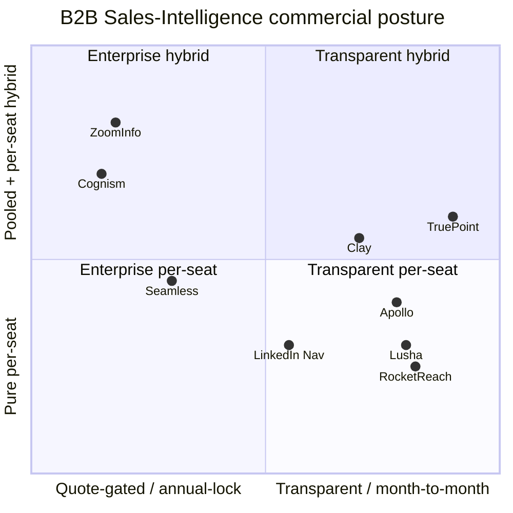
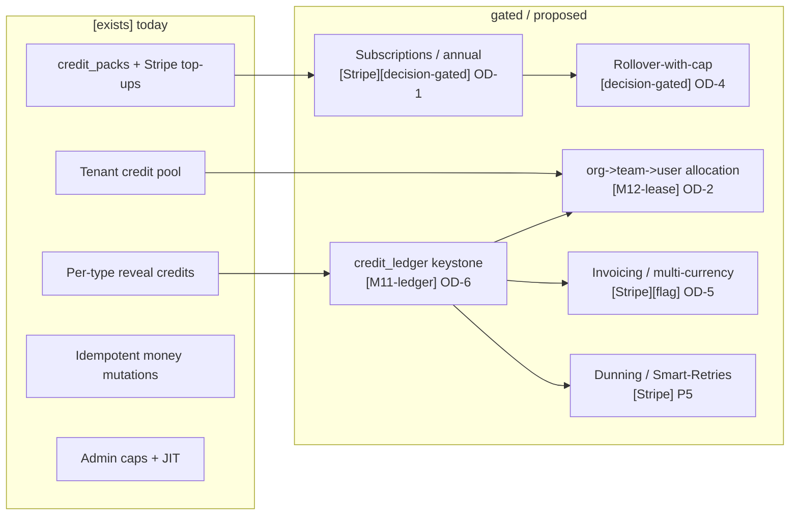
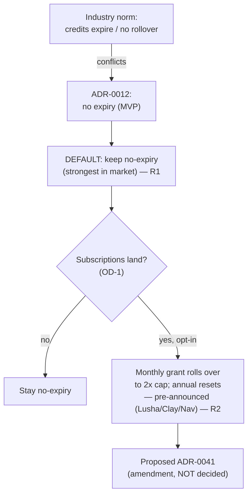

<!--
  TruePoint — Plans, Pricing, Credits, Subscriptions & Billing planning package
  Doc 01 — Industry Research (competitive + billing-infrastructure benchmark)
  Brand = TruePoint (user-facing); code scope = @leadwolf/* (npm) — deliberately
  different, never reconciled. See 00-README §2.
-->

# 01 — Industry Research

> **Spine doc:** part of `docs/planning/plans-pricing-credits/` — see
> [`00-README.md`](./00-README.md) for the scope, locked decisions (LD-1/LD-2),
> the Open-Decisions register (OD-1…OD-8), the shared vocabulary, and the gating
> legend (`[exists]` / `[exists-partial]` / `[M11-ledger]` / `[M12-lease]` /
> `[Stripe]` / `[flag]` / `[capability]` / `[decision-gated]`). This doc supplies
> the **external evidence base** that `06_*` scores against and that the
> recommendations in `00-README §4/§7` rest on.

## 0. Sourcing, dates & confidence

- **Research window:** vendor pricing captured 2025-2026; access date for all web
  citations below is **2026-06-30** unless noted. B2B-data pricing moves fast and
  is heavily quote-gated — **treat every dollar figure as indicative, not a quote**;
  cite the source + access date when reused downstream.
- **Confidence tags used in tables:** `[pub]` = vendor-published list price;
  `[3p]` = third-party/reseller-reported (verify before quoting to a customer);
  `[inferred]` = our synthesis, not a vendor statement.
- **Web-tool status:** WebSearch/WebFetch were available; primary vendor pages and
  third-party pricing teardowns were consulted. Where a figure rests only on a
  third-party teardown (not the vendor's own page) it is tagged `[3p]`.

---

## 1. Executive Summary

The B2B sales-intelligence market has converged on a **small set of commercial
patterns**, and TruePoint's current model (a **per-tenant reveal-credit counter** +
**Stripe one-time top-ups** + **plan templates for entitlements**, see
[`02_Current_System_Audit.md`](./02_Current_System_Audit.md) and
[`07-billing-credits.md`](../07-billing-credits.md)) sits at the **transparent,
no-lock-in end** of that market by deliberate design ([`ADR-0012`](../decisions/ADR-0012-transparent-pricing-no-lock-in.md)).

The eight competitors split cleanly into two camps:

| Camp | Vendors | Commercial signature |
|---|---|---|
| **Enterprise / quote-gated / annual-lock** | ZoomInfo, Cognism, Seamless.AI (paid tiers), LinkedIn Sales Navigator (Advanced+) | No public price, platform fee + per-seat, **annual contract, auto-renew, use-it-or-lose-it credits**, intent/add-on upsells |
| **Transparent / self-serve / month-to-month-friendly** | Apollo.io, Lusha, RocketReach, Clay | Published per-seat list price, free tier, **credit slider**, monthly OR annual, Apollo/Lusha/Clay/Nav offer **some rollover** |

**Eight findings that drive TruePoint's design:**

1. **Credit-metered reveals are universal**, but the *unit* and *cost asymmetry*
   vary: email ≈ 1 credit, **phone = 8-10× an email** (Apollo 8, Lusha 10). TruePoint
   already prices by reveal type ([`07-billing-credits` §3](../07-billing-credits.md);
   `revealCostFor`) — this is industry-standard, not a gap.
2. **"Unlimited" is always a fair-use cap.** Apollo, Cognism, Seamless all advertise
   unlimited/"unrestricted" data then cap it (Apollo's FUP ceiling; Cognism's
   ~2,000 records/user/mo). A **fair-usage policy is table-stakes**, not optional.
3. **No-rollover / annual-reset is the enterprise norm** (ZoomInfo, Seamless,
   RocketReach annual, Apollo). **Monthly rollover with a 2× cap** is the
   transparent-camp differentiator (Lusha, Clay, LinkedIn InMail). **This directly
   informs OD-4.**
4. **Annual contracts with auto-renew + 60-day non-renewal windows** are standard at
   the enterprise end (Seamless, Cognism) — and are **exactly what `ADR-0012`
   forbids**. Every such norm is routed to **OD-1** below as a *proposed amendment*,
   never asserted as decided.
5. **Charging for failed lookups** (Seamless deducts on no-result; 20-40% waste) is a
   widely-criticised dark pattern. TruePoint's **charge-by-verified-result**
   ([`ADR-0013`](../decisions/ADR-0013-charge-by-verified-result.md)) is a
   **marketable trust advantage** — surface it.
6. **Seat licensing + a base platform fee** is how the enterprise camp anchors ACV;
   the transparent camp is **pure per-seat with a credit slider**. TruePoint has
   `seat_limit`/`workspace_limit` but **no per-seat price object** yet.
7. **Hierarchical org→team→user credit allocation** exists in mature enterprise
   suites (pooled credits + per-seat monthly allotments at ZoomInfo/Cognism). This
   validates **OD-2 / `ADR-0029` M12 leases / proposed `ADR-0042`**.
8. **Billing infrastructure** (Stripe Billing, Chargebee, Recurly, Maxio) sets the
   *operational* table-stakes TruePoint's counter model cannot meet today —
   dunning/Smart-Retries, ASC-606 rev-rec, immutable price records, proration, plan
   versioning. These are **`[Stripe]` / `[M11-ledger]`-gated**, reused from the
   existing tab audits ([03-billing](../audits/platform-admin/03-billing.md),
   [05-pricing](../audits/platform-admin/05-pricing.md)).

The synthesized **table-stakes enterprise checklist** (§9) is the scorecard
`06_Competitive_Benchmark.md` uses. **Where an industry norm conflicts with
`ADR-0012`, this doc flags it and routes it to the Open-Decisions register (§10) —
it never overrides the ADR.**

---

## 2. Objectives

| # | Objective | Serves |
|---|---|---|
| O1 | Establish the **current (2025-26) commercial model** of the 8 named competitors, per-vendor, with sourced facts. | 06 scorecard; OD-1…OD-8 evidence |
| O2 | Produce **cross-cutting comparison tables** on every axis the owner named (credit systems, seats, usage/overage, rollover, monthly-vs-annual, team/org billing, enterprise custom, add-on packs, fair-usage, trials, expiry, billing/upgrade/downgrade workflows, history/audit, invoicing, payment & subscription lifecycle, renewals, allocation, org pools, user limits, permission-based controls). | 06; 03/04/05 design docs |
| O3 | Benchmark the **billing-infrastructure layer** (Stripe Billing, Chargebee, Recurly, Maxio) on dunning, rev-rec, entitlements, plan versioning, proration, trials, rollover, org-billing — reusing citations already in the tab audits. | `[Stripe]`-gated roadmap (P5) |
| O4 | Synthesize a **table-stakes enterprise checklist** and explain **WHY** enterprises adopt each pattern. | 06 scorecard; design rationale |
| O5 | **Flag every conflict with `ADR-0012`** (no auto-renewal, no credit expiry MVP) and route it to the Open-Decisions register — without asserting any amendment as decided. | OD-1, OD-4; proposed `ADR-0041` |
| O6 | Keep this doc **research-only**: it cites and analyses; it never restates TruePoint's reveal-tx SQL, counter model, or lease mechanics (those live in `07`). | anti-duplication (00-README §9) |

---

## 3. Research Findings — per-competitor teardowns

> Each teardown follows the same template: **pricing architecture · credit system
> (what consumes credits · monthly vs annual allotment · rollover · expiry) ·
> seat-based licensing · usage-based/overage billing · free trial · enterprise/custom
> · add-on credit packs · transparency posture · TruePoint read-across.** Figures are
> tagged `[pub]`/`[3p]`/`[inferred]`; access date 2026-06-30.

### 3.1 ZoomInfo — the enterprise anchor (quote-gated, annual-lock)

- **Pricing architecture.** No public list price; every quote is custom on seat
  count + bundle + negotiation. Tiers: **Professional / Advanced (incl. Advanced+) /
  Elite (incl. Elite+)**. Indicative: Professional ≈ **$14,995/yr** (3-5 users,
  ~5,000 bulk credits/yr); Advanced ≈ **$24,995/yr** (10,000 bulk + 1,000
  recurring **monthly per-user** credits); Elite **$35,995+**. Median verified
  contract ≈ **$31,875/yr**; real all-in **$30k-$60k** once seats/credits/features
  are added. `[3p]`
- **Credit system.** Two pools: **annual bulk credits** (export/list building) **plus
  monthly recurring per-user credits** (1,000/user on Advanced+) — i.e. a **pooled +
  per-seat hybrid**, the canonical org→user allocation pattern. Consumption: exports,
  bulk pulls, API. **Monthly vs annual:** bulk = annual allotment; per-user = monthly
  recurring. **Rollover:** none — **no rollover**. **Expiry:** annual credits expire
  at term end. `[3p]`
- **Seat licensing.** Base tier bundles 3 seats; **each extra seat ≈ $1,500/yr** on
  Professional. Per-user effective ≈ $4,499 (Pro) / $7,499 (Advanced). `[3p]`
- **Usage-based / overage.** Overage **$0.25-$0.50/credit**, **no rollover**. `[3p]`
- **Free trial.** No open self-serve paid trial; **ZoomInfo Lite** free tier with
  limited monthly credits; rest is sales-led. `[3p]`
- **Enterprise / custom.** The whole model is enterprise/custom; **Talent** SKU ≈
  $15k/yr (3 users, 5,000 credits). Intent topics are a priced add-on. `[3p]`
- **Add-on packs.** Credit overages + intent-topic packs + product add-ons (Talent,
  Chat, etc.). `[3p]`
- **Transparency posture.** **Low** — no public price, annual lock, auto-renew, ~10-15%
  renewal escalators reported. `[3p]`
- **TruePoint read-across.** Validates **OD-2** (pooled + per-seat monthly is real
  enterprise practice → `ADR-0029` M12 leases / proposed `ADR-0042`). Its **no-rollover
  + annual expiry + auto-renew** is the camp norm that **conflicts with `ADR-0012`**
  → route to **OD-1/OD-4**. Sources: [pipeline.zoominfo.com/sales/how-much-does-zoominfo-cost](https://pipeline.zoominfo.com/sales/how-much-does-zoominfo-cost) (2026-06-30); [factors.ai/blog/zoominfo-pricing](https://www.factors.ai/blog/zoominfo-pricing) (2026-06-30); [cleanlist.ai/blog/2026-03-19-zoominfo-pricing-guide](https://www.cleanlist.ai/blog/2026-03-19-zoominfo-pricing-guide) (2026-06-30).

### 3.2 Apollo.io — transparent self-serve credit metering

- **Pricing architecture.** Published per-seat: **Free / Basic / Professional /
  Organization**, **$49-$119 per user/mo annual** (≈ $59-$149 monthly). `[pub]`
- **Credit system.** Multi-pool: **email = 1 credit, phone/mobile = 8 credits**,
  **export = 1 export credit**. Email credits "unlimited" but **governed by a Fair
  Use Policy** (FUP ceiling cited as ~10,000/mo for free accounts; for paid, the
  lesser of $paid/$0.025 or ~1M/yr). Mobile/export are hard monthly caps (Free: 5
  mobile / 10 export; Pro: 100 mobile / 2,000 export; 10,000 data credits/yr).
  **Monthly vs annual:** allotments are monthly; data-credit caps stated annually on
  paid. **Rollover:** **none — credits expire at end of billing cycle, no rollover**
  ("use-it-or-lose-it"). **Expiry:** end of cycle. `[pub]`/`[3p]`
- **Seat licensing.** Pure per-user; no separate platform fee. `[pub]`
- **Usage-based / overage.** **Additional credits $0.20 each**; min purchase 250
  (monthly, $50) or 2,500 (annual, $500). `[3p]`
- **Free trial.** **Free tier ≈ 900 credits/yr**, basic filters, ~250 daily emails;
  trial of paid features available. `[3p]`
- **Enterprise / custom.** Organization tier = custom/sales-assisted. `[pub]`
- **Add-on packs.** Top-up credit purchases (above). `[3p]`
- **Transparency posture.** **High** — public price + free tier; the **no-rollover +
  fair-use** combo is the criticised edge. `[pub]`
- **TruePoint read-across.** Apollo is the closest **transparent-camp peer**; its
  **per-type credit asymmetry** mirrors TruePoint's `revealCostFor`
  ([`07` §3](../07-billing-credits.md)). Its **no-rollover** is the opposite of
  TruePoint's `ADR-0012` default → evidence for keeping **no-expiry** as a
  differentiator (**OD-4**). Sources: [apollo.io/pricing](https://www.apollo.io/pricing) (2026-06-30); [saleshandy.com/blog/apolloio-pricing](https://www.saleshandy.com/blog/apolloio-pricing/) (2026-06-30); [salesmotion.io/blog/apollo-pricing](https://salesmotion.io/blog/apollo-pricing) (2026-06-30).

### 3.3 Cognism — "unrestricted" data, platform fee + per-seat, annual-only

- **Pricing architecture.** Quote-only, **platform fee + per-seat**, two tiers
  (**Grow/Platinum**, **Elevate/Diamond**). Indicative: Grow ≈ **$1,500/user/yr**,
  Elevate ≈ **$2,500/user/yr**, **plus a base platform fee $15k-$25k/yr**. `[3p]`
- **Credit system.** Markets **"unrestricted" data** but enforces a **fair-use cap
  ≈ 2,000 records/user/mo**; a **credit system applies to bulk exports (>25
  contacts) and API calls**. **Monthly vs annual:** fair-use is monthly per seat;
  contract annual. **Rollover:** not advertised (fair-use is per-month, non-banking).
  **Expiry:** within fair-use window. `[3p]`
- **Seat licensing.** Per-seat on top of platform fee. `[3p]`
- **Usage-based / overage.** Bulk/API credit pool; intent topics **$1,600-$6,000/yr**
  (8-15 topics) add-on. `[3p]`
- **Free trial.** **No free plan**; sales-led demo/trial only. `[3p]`
- **Enterprise / custom.** Entire model is enterprise; **annual commitment, upfront or
  quarterly**, auto-renew clauses, 10-15% renewal increases reported. `[3p]`
- **Add-on packs.** Intent topics; bulk-credit/API expansion. `[3p]`
- **Transparency posture.** **Low** — no public price; "unrestricted" is a marketing
  term over a fair-use cap. `[3p]`
- **TruePoint read-across.** Confirms the **"unlimited = fair-use cap"** pattern is
  universal → TruePoint's fair-usage policy is **table-stakes**, not gold-plating.
  Its **annual-only + auto-renew** conflicts with `ADR-0012` → **OD-1**. Sources:
  [cognism.com/pricing](https://www.cognism.com/pricing) (2026-06-30); [salesmotion.io/blog/cognism-pricing](https://salesmotion.io/blog/cognism-pricing) (2026-06-30); [uplead.com/cognism-pricing](https://www.uplead.com/cognism-pricing/) (2026-06-30).

### 3.4 Lusha — transparent, credit-slider, **rollover that's a selling point**

- **Pricing architecture.** Published: **Free / Pro / Premium / Scale (custom)** with
  a **credit slider** inside each paid tier. Pro ≈ **$49.90/mo** ($37.45 annual,
  4,800 credits/yr, 1 user) up to ~$174.95/mo (24,000/yr); Premium ≈ **$399.90/mo**
  ($299.95 annual, 40,800/yr, 5 users) up to ~$659.95/mo (98,400/yr). `[3p]`
- **Credit system.** **email = 1 credit, phone = 10 credits**. **Monthly vs annual:**
  monthly plans drip credits monthly; annual plans grant the **full year upfront**.
  **Rollover (the key differentiator):** **monthly plans roll over unused credits and
  accumulate up to 2× the plan limit** while subscribed; **annual plans reset unused
  credits at the end of the annual cycle (no rollover)**. **Expiry:** monthly = banked
  to 2× cap; annual = reset at term. `[3p]`
- **Seat licensing.** Tier bundles users (1/2/5); per-seat scales with tier. `[3p]`
- **Usage-based / overage.** Credit slider replaces per-credit overage; Scale offers
  **50%+ off per-credit**. `[3p]`
- **Free trial.** **Free plan ≈ 40 credits/mo** (some sources 70). `[3p]`
- **Enterprise / custom.** **Scale** = custom-quoted, discounted per-credit. `[3p]`
- **Add-on packs.** Slider-based credit add-ons; Scale volume discount. `[3p]`
- **Transparency posture.** **High** — public price, slider, explicit rollover policy.
  Monthly costs ~33% more than annual. `[3p]`
- **TruePoint read-across.** Lusha is the **direct precedent for OD-4's recommended
  default** — "**monthly rollover with a cap (here 2×), annual upfront with reset**"
  is exactly the **`ADR-0012`-compatible** rollover shape TruePoint can adopt without
  introducing expiry. Sources: [lusha.com/pricing](https://www.lusha.com/pricing/) (2026-06-30); [salesmotion.io/blog/lusha-pricing](https://salesmotion.io/blog/lusha-pricing) (2026-06-30); [prospeo.io/s/lusha-pricing](https://prospeo.io/s/lusha-pricing) (2026-06-30).

### 3.5 Seamless.AI — credit "research", annual-lock, charges for misses

- **Pricing architecture.** **Free / Basic / Pro / Enterprise.** Free $0 (50 lifetime
  credits); **Basic ≈ $147/mo billed annually** (250 credits/mo); Pro ≈
  $79-$150/user/mo `[3p]` (annual, packages from 10,000, **often 5-seat minimum**);
  Enterprise custom **$20k-$100k+/yr**. `[3p]`
- **Credit system.** **1 credit = one phone OR email lookup ("research").** **Monthly
  vs annual:** Basic monthly drip; Pro annual packages. **Rollover:** none advertised.
  **Expiry:** annual term. **Dark pattern:** **credits deducted on every lookup
  attempt, including no-result lookups** — 20-40% reported wasted on misses. `[3p]`
- **Seat licensing.** Per-user, **5-license minimum** common on paid. `[3p]`
- **Usage-based / overage.** Annual packages; top-ups via sales. `[3p]`
- **Free trial.** Free $0 tier, 50 lifetime credits. `[3p]`
- **Enterprise / custom.** Custom quote; **annual-only, full upfront, 60-day
  non-renewal window or auto-renew for another year**. `[3p]`
- **Add-on packs.** Sales-assisted credit expansion. `[3p]`
- **Transparency posture.** **Low-medium** — one public price (Basic) but annual lock,
  auto-renew trap, and **pay-for-misses**. `[3p]`
- **TruePoint read-across.** Seamless is the **cautionary case**: its **pay-for-misses**
  is precisely what TruePoint's **charge-by-verified-result** (`ADR-0013`;
  `chargeFor.ts`) avoids — a **marketing wedge**. Its **60-day auto-renew trap**
  conflicts with `ADR-0012` → **OD-1**. Sources: [seamless.ai/pricing](https://seamless.ai/pricing) (2026-06-30); [cleanlist.ai/blog/2026-03-19-seamless-ai-pricing-guide](https://www.cleanlist.ai/blog/2026-03-19-seamless-ai-pricing-guide) (2026-06-30); [uplead.com/seamless-ai-pricing](https://www.uplead.com/seamless-ai-pricing/) (2026-06-30).

### 3.6 RocketReach — lookup credits, monthly-vs-annual divergence on top-ups

- **Pricing architecture.** **Free / Essentials / Pro / Ultimate.** Essentials (email
  only) ≈ **$399/yr** (~$33.25/mo, 1,200 lookups/yr) or **$53/mo**; Pro (email+phone)
  ≈ **$126/mo annual** ($1,512/yr) or **$179/mo**; Ultimate ≈ **$2,099/yr**
  (~$174.92/mo, 10,000 lookups/yr) or **$359/mo**. `[3p]`
- **Credit system.** **Each successful lookup burns one credit.** **Monthly vs
  annual:** monthly drip vs annual bucket. **Rollover:** **annual lookups do NOT roll
  over to the next term**. **Expiry:** annual term-end. `[3p]`
- **Seat licensing.** Individual plans per-user; team/SSO higher tiers. `[3p]`
- **Usage-based / overage.** **Monthly plans can buy additional lookups (auto-billed);
  annual plans cannot — they must upgrade tiers.** Overage **$0.30-$0.45/lookup**.
  `[3p]`
- **Free trial.** **5 free lookups**, no card. `[3p]`
- **Enterprise / custom.** Higher tiers + API/team plans, sales-assisted. `[3p]`
- **Add-on packs.** Monthly-only additional-lookup purchases. `[3p]`
- **Transparency posture.** **High** — public per-tier price + per-lookup overage. `[3p]`
- **TruePoint read-across.** The **"monthly can top-up, annual cannot"** asymmetry is
  a UX/billing-workflow pattern relevant to OD-1/OD-5 (how top-ups behave under a
  subscription). RocketReach's **only-charge-successful-lookup** aligns with
  `ADR-0013`. Sources: [rocketreach.co/pricing](https://rocketreach.co/pricing) (2026-06-30); [cleanlist.ai/blog/2026-03-19-rocketreach-pricing-guide](https://www.cleanlist.ai/blog/2026-03-19-rocketreach-pricing-guide) (2026-06-30); [bookyourdata.com/blog/rocketreach-pricing](https://www.bookyourdata.com/blog/rocketreach-pricing) (2026-06-30).

### 3.7 Clay — two-pool credits (Data + Actions), rollover with caps, top-up markup

- **Pricing architecture.** **Free / (legacy Starter, Explorer, Pro grandfathered) →
  Launch ($185/mo) / Growth ($495/mo) / Enterprise** (re-tiered 2026-03-11). Monthly
  or annual; **annual ≈ 10% discount**. `[3p]`
- **Credit system.** **Two separate pools (since 2026-03): Data Credits** (3rd-party
  marketplace enrichment, "a few pennies each") **and Actions** (workflow ops).
  Consumption = enrichment lookups + workflow runs. **Monthly vs annual:** allocation
  chosen monthly or annual. **Rollover (cap'd):** **unused Data Credits roll over up
  to 2× the monthly allocation** (e.g. Growth 6,000/mo → max 12,000); **annual plans
  get a 15% Data-Credit rollover** of unused on renew at same/higher tier. **Expiry:**
  beyond the 2×/15% cap. `[3p]`
- **Seat licensing.** Plan = workspace tier; seats bundled, less per-seat-centric than
  data vendors. `[3p]`
- **Usage-based / overage.** **Top-up credits carry ~30% markup** over plan rate
  (down from ~50% pre-2026-03). `[3p]`
- **Free trial.** Free plan with limited credits. `[3p]`
- **Enterprise / custom.** Enterprise tier, custom. `[3p]`
- **Add-on packs.** Marked-up top-ups; provider-priced marketplace. `[3p]`
- **Transparency posture.** **Medium-high** — public tiers + explicit rollover, but
  marketplace-variable per-enrichment cost makes effective spend hard to predict.
  `[3p]`
- **TruePoint read-across.** Clay's **2× rollover cap** independently corroborates
  Lusha's → strengthens **OD-4**'s "roll over with a cap" recommendation. Its
  **two-pool (Data vs Actions)** model is a useful precedent if TruePoint ever splits
  reveal-credits from enrichment-credits ([`ADR-0038`](../decisions/ADR-0038-bulk-enrichment-billing.md)).
  Sources: [university.clay.com/docs/actions-data-credits](https://university.clay.com/docs/actions-data-credits) (2026-06-30); [salesmotion.io/blog/clay-pricing](https://salesmotion.io/blog/clay-pricing) (2026-06-30); [university.clay.com/docs/plans-and-billing](https://university.clay.com/docs/plans-and-billing) (2026-06-30).

### 3.8 LinkedIn Sales Navigator — seat subscription + InMail credits with rollover

- **Pricing architecture.** **Core / Advanced / Advanced Plus.** Core **$99.99/mo**
  ($79.99/mo annual); Advanced **$169.99/mo** ($1,620/yr); **Advanced Plus = custom**
  (seat count, CRM integration, onboarding). `[pub]`/`[3p]`
- **Credit system.** Not data-reveal credits — **InMail message credits**: **all plans
  include 50 InMail/mo**. **Monthly vs annual:** monthly grant. **Rollover:** **unused
  InMail rolls over up to 3 months (max 150)**. **Expiry:** rolled credits expire after
  the 3-month window. `[pub]`/`[3p]`
- **Seat licensing.** Pure per-seat subscription; **Advanced Plus is the team/CRM
  tier**. `[pub]`
- **Usage-based / overage.** Largely flat-seat; InMail is the metered unit. `[3p]`
- **Free trial.** **30-day free trial**. `[3p]`
- **Enterprise / custom.** **Advanced Plus**, custom by team size + CRM. `[3p]`
- **Add-on packs.** Not credit-pack-centric; seat tiers carry the value. `[3p]`
- **Transparency posture.** **High** on Core/Advanced (public price), **low** on
  Advanced Plus (custom). Annual discount ~15-25%. `[3p]`
- **TruePoint read-across.** Nav is the **subscription + capped-rollover precedent**
  most aligned with what an opt-in TruePoint subscription (**OD-1 hybrid**) could look
  like: **flat per-seat term + a small metered allotment that rolls over within a
  cap** — and it is *not* defaulted onto data-reveal billing. Sources: [business.linkedin.com/sales-solutions/compare-plans](https://business.linkedin.com/sales-solutions/compare-plans) (2026-06-30); [evaboot.com/blog/how-much-does-linkedin-sales-navigator-cost](https://evaboot.com/blog/how-much-does-linkedin-sales-navigator-cost) (2026-06-30); [topo.io/blog/linkedin-sales-navigator-price](https://www.topo.io/blog/linkedin-sales-navigator-price) (2026-06-30).

---

## 4. Industry Best Practices — cross-cutting comparison tables

> One table per axis the owner named. Legend: ✅ yes · ⚠️ partial / conditional ·
> ❌ no · 🔒 custom/quote-only. Figures `[3p]` unless the vendor publishes them.
> The **TruePoint** column states **today's `[exists]` reality** + the gating tag of
> any target-state move (full design lives in `03/04/05/07_*`, not here).

### 4.1 Credit systems (what a credit is, what consumes it)

| Vendor | Credit unit | Email cost | Phone cost | Other consumers | Notes |
|---|---|---|---|---|---|
| ZoomInfo | bulk + per-user credit | — | — | export/list/API | dual pool (annual bulk + monthly per-seat) |
| Apollo | data/mobile/export credits | 1 | 8 | export = 1 | email "unlimited" under FUP |
| Cognism | record + bulk/API credit | fair-use | fair-use | bulk export >25, API | "unrestricted" = fair-use |
| Lusha | credit | 1 | 10 | — | slider-scaled |
| Seamless | "research" credit | 1 | 1 | — | **charges on no-result** |
| RocketReach | lookup credit | 1 | 1 | — | only successful lookups |
| Clay | Data Credit + Action | varies | varies | enrichment, workflow | two-pool |
| LinkedIn Nav | InMail credit | n/a | n/a | InMail send | not a data-reveal credit |
| **TruePoint `[exists]`** | **reveal credit (per type)** | `revealCostFor(email)` | `revealCostFor(phone)` | `full_profile`; bulk leases `[M12-lease]` | per-type asymmetry already built; **charge-by-verified** (`ADR-0013`) |

### 4.2 Seat-based licensing

| Vendor | Per-seat? | Base platform fee? | Seat minimum | TruePoint read |
|---|---|---|---|---|
| ZoomInfo | ✅ (+pooled) | ✅ implicit | 3 bundled | `seat_limit` exists; **no price object** `[Stripe]` |
| Apollo | ✅ pure | ❌ | 1 | closest peer |
| Cognism | ✅ | ✅ $15-25k | per quote | platform-fee model = enterprise anchor |
| Lusha | ✅ (tier-bundled) | ❌ | 1 | slider per tier |
| Seamless | ✅ | ❌ | **5** | min-seat lock |
| RocketReach | ✅ | ❌ | 1 | — |
| Clay | ⚠️ workspace-tier | ❌ | n/a | less seat-centric |
| LinkedIn Nav | ✅ pure | ❌ | 1 | subscription-seat precedent |
| **TruePoint** | `seat_limit`/`workspace_limit` `[exists]` | ❌ today | n/a | per-seat **pricing** = `[Stripe]`/`[decision-gated]` (OD-1) |

### 4.3 Usage-based / overage billing

| Vendor | Overage mechanism | Overage price | Monthly vs annual top-up |
|---|---|---|---|
| ZoomInfo | per-credit overage | $0.25-$0.50 | sales-assisted |
| Apollo | buy credits | $0.20 (min 250/2,500) | both |
| Cognism | bulk/API pool | quote | annual |
| Lusha | slider replaces overage | — | slider |
| Seamless | sales top-up | quote | annual |
| RocketReach | additional lookups | $0.30-$0.45 | **monthly only** |
| Clay | top-up credits | ~30% markup | both |
| LinkedIn Nav | flat-seat (InMail metered) | — | — |
| **TruePoint** | **`purchases` top-ups (Stripe)** `[exists]` `[Stripe]` | pack price (`credit_packs`) | one-time packs today; recurring = OD-1 |

### 4.4 Credit rollover — **the OD-4 evidence table**

| Vendor | Monthly rollover | Annual rollover | Cap | `ADR-0012`-compatible? |
|---|---|---|---|---|
| ZoomInfo | ❌ | ❌ | — | conflicts (expiry) |
| Apollo | ❌ | ❌ | — | conflicts (expiry) |
| Cognism | ❌ (fair-use/mo) | ❌ | — | conflicts |
| **Lusha** | ✅ | ❌ (reset) | **2× plan** | **monthly-rollover model is compatible** |
| Seamless | ❌ | ❌ | — | conflicts |
| RocketReach | ❌ | ❌ | — | conflicts |
| **Clay** | ✅ | ⚠️ 15% on renew | **2× monthly** | **compatible w/ cap** |
| **LinkedIn Nav** | ✅ (InMail) | n/a | **3 months / 150** | **compatible w/ cap** |
| **TruePoint** | **N/A — credits never expire (MVP)** `ADR-0012` | N/A | none | **default already stronger than peers** |

> **Read:** TruePoint's **no-expiry default beats every peer** on transparency. If a
> subscription lands (OD-1), the **Lusha/Clay/Nav "roll over with a 2× cap"** shape is
> the proven, `ADR-0012`-aligned amendment — **announced in advance** per the ADR.
> **Routed to OD-4.**

### 4.5 Monthly vs annual

| Vendor | Monthly offered? | Annual discount | Annual credit grant | Annual lock? |
|---|---|---|---|---|
| ZoomInfo | ❌ | n/a | upfront/annual | ✅ + auto-renew |
| Apollo | ✅ | ~17-20% | annual buckets | ❌ |
| Cognism | ❌ | n/a | annual | ✅ + auto-renew |
| Lusha | ✅ | ~25-33% | **full year upfront** | ❌ (monthly avail) |
| Seamless | ⚠️ Basic only | n/a | annual packages | ✅ + 60-day trap |
| RocketReach | ✅ | varies | annual buckets | ❌ |
| Clay | ✅ | ~10% | annual or monthly | ❌ |
| LinkedIn Nav | ✅ | ~15-25% | monthly grant | ❌ |
| **TruePoint** | **packs are one-time; no term today** `[exists]` | n/a | n/a | **❌ by `ADR-0012`** |

### 4.6 Team / org billing

| Vendor | Org-level pooling | Per-seat allotment | Centralised billing/admin |
|---|---|---|---|
| ZoomInfo | ✅ bulk pool | ✅ monthly per-user | ✅ admin console |
| Apollo | ⚠️ org tier | per-seat caps | ✅ |
| Cognism | ✅ fair-use/seat | ✅ | ✅ |
| Lusha | tier-bundled users | per tier | ✅ |
| Seamless | ✅ team package | per-seat | ✅ |
| RocketReach | team/API tiers | per-seat | ⚠️ |
| Clay | workspace pool | n/a | ✅ |
| LinkedIn Nav | Advanced Plus | per-seat | ✅ |
| **TruePoint** | **tenant pool (counter)** `[exists]`; team/workspace budgets `[M12-lease]` | per-user soft limits `[M12-lease]` | admin console `[exists]` (03/04/05 audits) |

### 4.7 Enterprise / custom plans

| Vendor | Custom tier | Quote-gated | Intent/add-on upsell | Negotiated escalators |
|---|---|---|---|---|
| ZoomInfo | Elite/Elite+ | ✅ | ✅ intent topics | ~10-15%/yr |
| Apollo | Organization | ⚠️ | ⚠️ | — |
| Cognism | both tiers | ✅ | ✅ $1.6-6k topics | 10-15%/yr |
| Lusha | Scale | ✅ | per-credit discount | — |
| Seamless | Enterprise | ✅ $20-100k | — | annual |
| RocketReach | API/team | ⚠️ | — | — |
| Clay | Enterprise | ✅ | marketplace | — |
| LinkedIn Nav | Advanced Plus | ✅ | CRM sync | — |
| **TruePoint** | **plan override** `[exists]` `[capability]` (`POST /admin/tenants/:id/plan`) | n/a | — | **none — `ADR-0012`** |

### 4.8 Add-on credit packs

| Vendor | Pack mechanism | Markup vs base | Self-serve? |
|---|---|---|---|
| ZoomInfo | overage + topic packs | — | sales |
| Apollo | credit top-ups | at-rate ($0.20) | ✅ |
| Cognism | bulk/API + topics | — | sales |
| Lusha | slider | discounted at scale | ✅ |
| Seamless | sales packages | — | sales |
| RocketReach | additional lookups | overage rate | ⚠️ monthly-only |
| Clay | top-ups | **~30% markup** | ✅ |
| LinkedIn Nav | n/a | — | n/a |
| **TruePoint** | **`credit_packs` catalog + Stripe checkout** `[exists]` `[Stripe]` | configurable | ✅ web Top-up `[exists]` |

### 4.9 Fair-usage policies

| Vendor | Has FUP? | Stated cap | Enforcement |
|---|---|---|---|
| ZoomInfo | ✅ | per-tier credits | hard credit cap |
| Apollo | ✅ | ~10k/mo free; paid formula | throttle/cap |
| Cognism | ✅ | ~2,000 records/user/mo | "unrestricted" cap |
| Lusha | ⚠️ | slider = the cap | credit cap |
| Seamless | ⚠️ | credit cap | hard |
| RocketReach | ⚠️ | lookup cap | hard |
| Clay | ✅ | plan + Actions | pool cap |
| LinkedIn Nav | ✅ | 50 InMail/mo | hard |
| **TruePoint** | **counter is the cap (balance ≥ 0)** `[exists]`; `email_send_quota` `[exists]`; `sendQuotaRepository` (unwired) | per-tenant balance | DB CHECK + `lockBalance` (`07` §3) |

### 4.10 Free trials

| Vendor | Trial type | Amount | Card required |
|---|---|---|---|
| ZoomInfo | Lite free tier | limited monthly | no |
| Apollo | free tier + paid trial | ~900 credits/yr | no |
| Cognism | demo only | — | n/a |
| Lusha | free plan | ~40/mo | no |
| Seamless | free tier | 50 lifetime | no |
| RocketReach | free lookups | 5 | no |
| Clay | free plan | limited credits | no |
| LinkedIn Nav | time-boxed | 30 days | yes |
| **TruePoint** | **signup-bonus credits = MVP trial (OD-7)** `[decision-gated]`; time-boxed trial deferred | tbd | no |

> **Read:** the dominant SI-vendor trial is a **free credit grant**, not a time-box —
> exactly TruePoint's **OD-7 recommendation** (signup-bonus credits). LinkedIn's
> 30-day time-box is the outlier (subscription product). Supports deferring full
> time-boxed trials.

### 4.11 Credit expiry

| Vendor | Credits expire? | When | Conflicts with `ADR-0012`? |
|---|---|---|---|
| ZoomInfo / Apollo / Cognism / Seamless / RocketReach | ✅ | cycle/annual term | — (they have no such ADR) |
| Lusha (annual) | ✅ | annual reset | — |
| Lusha (monthly) / Clay / LinkedIn | ⚠️ | beyond rollover cap | — |
| **TruePoint** | **❌ — credits do NOT expire (MVP)** `ADR-0012` | never | **N/A — this IS the differentiator** |

> **Flag → OD-4.** Industry norm = expiry. `ADR-0012` = no expiry. **Keep no-expiry as
> default; any expiry-with-rollover only as a proposed `ADR-0041` amendment,
> pre-announced.**

### 4.12 Billing workflows (checkout, payment, receipts)

| Capability | Enterprise norm (Stripe/Chargebee-backed) | TruePoint today |
|---|---|---|
| Hosted checkout | ✅ Stripe Checkout | ✅ `POST /credits/checkout` `[exists]` `[Stripe]` |
| Webhook-driven grant | ✅ | ✅ `POST /billing/webhook` is the only grant path `[exists]` |
| Idempotent money mutations | ✅ Idempotency-Key | ✅ `idempotency_keys`, `stripe_event_id` UNIQUE `[exists]` |
| Hosted invoice / receipt | ✅ | ❌ → `[Stripe]` `[flag]` (OD-5) |
| Customer portal | ✅ | ❌ → `[Stripe]` |

### 4.13 Upgrade / downgrade flows

| Capability | Norm | TruePoint |
|---|---|---|
| Self-serve upgrade | ✅ | ❌ web (admin plan-override only) `[exists]` `[capability]`; web upgrade = `[Stripe]` `[decision-gated]` |
| Self-serve downgrade/cancel | ✅ | ❌ → `[Stripe]` `[decision-gated]` (OD-1) |
| **Proration on change** | ✅ Stripe/Chargebee auto-prorate | ❌ → proposed `ADR-0041`, `[Stripe]` |
| Mid-term plan change | ✅ plan versioning | ❌ → `[Stripe]` |

### 4.14 Credit history / audit logs

| Capability | Norm (Maxio/Stripe ledger) | TruePoint |
|---|---|---|
| Per-event consumption log | ✅ | ✅ `contact_reveals`, `GET /credits/usage` (paginated) `[exists]` |
| Append-only money ledger | ✅ (rev-rec grade) | ❌ → `credit_ledger` `[M11-ledger]` (ADR-0029) |
| Admin audit of money actions | ✅ | ✅ `audit_log` (reveal/credit.adjust/credit.grant) `[exists]`; vocabulary `ADR-0032` |
| History filter/export (web) | ✅ | ❌ web credit-history filter/export → P2 `[exists-partial]` |

### 4.15 Invoice generation

| Capability | Norm | TruePoint |
|---|---|---|
| Auto invoice per charge | ✅ Stripe Invoices | ❌ → `[Stripe]` `[flag]` (OD-5) |
| Line items / tax | ✅ | ❌ → `[Stripe]` |
| Multi-currency price | ✅ Stripe Price per currency; Chargebee price points | ❌ `price_cents` implicitly USD → 05-pricing G; **USD authoritative** (OD-5) |
| Immutable price record | ✅ Stripe archive-and-replace | ❌ mutable `credit_packs` row → 05-pricing G2 |

### 4.16 Payment lifecycle (dunning / recovery)

| Capability | Norm | TruePoint |
|---|---|---|
| Failed-payment retry | ✅ Stripe Smart Retries / Recurly Intelligent Dunning | ❌ → `[Stripe]` worker (03-billing G5, P5) |
| Soft vs hard decline routing | ✅ Recurly | ❌ → `[Stripe]` |
| Dunning emails / portal | ✅ | ❌ → `[Stripe]` |

### 4.17 Subscription lifecycle

| Capability | Norm | TruePoint |
|---|---|---|
| Subscription object | ✅ | ❌ no `subscriptions` table → `[decision-gated]` `[Stripe]` (OD-1) |
| Trials in lifecycle | ✅ | signup-bonus credits (OD-7) `[decision-gated]` |
| Pause/resume | ✅ Stripe | ❌ → `[Stripe]` |

### 4.18 Renewal management

| Capability | Norm | TruePoint |
|---|---|---|
| Auto-renewal | ✅ (default ON at enterprise camp) | **❌ FORBIDDEN by `ADR-0012`** → opt-in only via proposed `ADR-0041` (OD-1) |
| Renewal reminders | ✅ | ❌ → `[Stripe]` |
| Escalators at renewal | ✅ (10-15% common) | **❌ — transparent-pricing posture** |

> **Flag → OD-1.** Auto-renewal + escalators are the single biggest **conflict** with
> `ADR-0012`. **Recommendation stands (LD-1):** month-to-month / no-auto-renew is the
> **default**; opt-in annual/subscription for enterprise, **never defaulted-on**;
> documented as a **proposed amendment**, not decided.

### 4.19 Team credit allocation

| Vendor | Per-team budgets | Admin can cap a team | TruePoint |
|---|---|---|---|
| ZoomInfo | ✅ (per-user monthly) | ✅ | tenant pool `[exists]`; per-team budgets `[M12-lease]` (ADR-0029) |
| Cognism | ✅ fair-use/seat | ✅ | OD-2 / proposed `ADR-0042` |
| others | ⚠️ | ⚠️ | — |

### 4.20 Org-level credit pools

| Vendor | Single org pool | Pool + per-seat hybrid | TruePoint |
|---|---|---|---|
| ZoomInfo | ✅ bulk | ✅ bulk + per-user | **tenant pool is authoritative** `[exists]`; hybrid = OD-2 target |
| Cognism | ⚠️ | ✅ | proposed `ADR-0042` |
| Clay | ✅ workspace | — | two-pool precedent (`ADR-0038`) |
| **TruePoint** | `tenants.reveal_credit_balance` `[exists]` | per-team budgets + per-user limits `[M12-lease]` | OD-2 |

### 4.21 User-level credit limits

| Vendor | Per-user soft cap | Per-user hard cap | TruePoint |
|---|---|---|---|
| ZoomInfo | ✅ (monthly per-user) | ✅ | per-user soft limits = OD-2 target `[M12-lease]` |
| Cognism | ✅ fair-use/user | ✅ | proposed `ADR-0042` |
| **TruePoint** | ❌ today | ❌ today | designed as **soft limits** (warn, don't block) per OD-2; ledger-backed |

### 4.22 Permission-based billing controls

| Vendor | Role-gated purchase | Approval workflow | TruePoint |
|---|---|---|---|
| ZoomInfo/Cognism (admin console) | ✅ admin-only | ⚠️ | **admin caps + JIT elevation** `[exists]` `[capability]` (`ADR-0011`); web **workspace-admin-only** purchase/allocate = OD-8 |
| most self-serve | ⚠️ | ❌ | **peer-approval spec-ed, not enforced v1** (OD-8) |

---

## 5. Current System Observations

> Full audit is [`02_Current_System_Audit.md`](./02_Current_System_Audit.md); the
> canonical mechanics are [`07-billing-credits.md`](../07-billing-credits.md). This
> section states only **how TruePoint maps onto the industry axes above** — it does
> **not** restate the reveal-tx SQL, counter model, or lease mechanics (anti-dup,
> 00-README §9).

| Axis | Where TruePoint already meets the norm | Where it diverges (by design) | Where it has a real gap |
|---|---|---|---|
| Credit metering | per-type reveal cost (`revealCostFor`); idempotent claim (`revealRepository.claimReveal`) | **charge-by-verified-result** (`ADR-0013`) — *better* than Seamless's pay-for-misses | — |
| Pool / allocation | tenant counter (`reveal_credit_balance`) | single authoritative pool (transparent) | per-team/per-user allocation `[M12-lease]` (OD-2) |
| Top-ups / packs | `credit_packs` + Stripe checkout + webhook grant | one-time packs, **no auto-renew** (`ADR-0012`) | recurring/subscription `[Stripe]` `[decision-gated]` (OD-1) |
| Rollover / expiry | — | **credits never expire** (`ADR-0012`) — *stronger* than peers | rollover-with-cap if subscriptions land (OD-4) |
| Fair-use | counter = the cap; `email_send_quota`; `sendQuotaRepository` (unwired) | — | send-quota caller not yet wired |
| Trials | — | — | signup-bonus credits (OD-7) `[decision-gated]` |
| Invoicing / multi-currency | webhook-driven, idempotent | USD-implicit | invoices/receipts, immutable price, multi-currency (OD-5) `[Stripe]` |
| Payment lifecycle | Stripe webhook source-of-truth | — | dunning/Smart-Retries `[Stripe]` (P5) |
| Subscription lifecycle | — | none by design (`ADR-0012`) | proposed `subscriptions` (OD-1) |
| History / audit | `contact_reveals` log + `audit_log` + `GET /credits/usage` | — | append-only `credit_ledger` `[M11-ledger]`; web history filter/export (P2) |
| Permission controls | admin caps + JIT (`ADR-0011`); render-gated controls | — | web workspace-admin gate (OD-8); peer-approval enforcement (OD-8) |

**No new claim of built infrastructure is made here:** every non-`[exists]` row is
tagged with its gate (00-README §8 legend).

---

## 6. Recommendations

> These align with — and supply the evidence for — the locked decisions (LD-1/LD-2)
> and Open-Decisions register in [`00-README §3/§4`](./00-README.md). They are
> **research-grounded recommendations**, not new decisions.

| # | Recommendation | Evidence | OD / ADR |
|---|---|---|---|
| R1 | **Keep no-expiry + month-to-month as the default and market it.** It is *stronger* than every peer; expiry is the industry norm, not a requirement. | §4.4, §4.11 (only Lusha-monthly/Clay/Nav avoid full expiry, and only with caps) | OD-4; `ADR-0012` |
| R2 | **If a subscription lands, adopt "monthly grant rolls over to a 2× cap; annual resets at term, pre-announced."** Proven by Lusha + Clay + LinkedIn. | §4.4 | OD-4; proposed `ADR-0041` |
| R3 | **Offer subscriptions/annual only as opt-in for enterprise, never defaulted-on; no auto-renew, no escalators.** | §4.5, §4.18 (auto-renew + escalators are the chief `ADR-0012` conflict) | OD-1; LD-1; proposed `ADR-0041` |
| R4 | **Build the hierarchical org→team→user allocation** (pool authoritative + per-team budgets + per-user *soft* limits). ZoomInfo/Cognism prove the hybrid. | §4.6, §4.19-4.21 | OD-2; LD-2; `ADR-0029` M12; proposed `ADR-0042` |
| R5 | **Make charge-by-verified-result a public trust message.** Seamless's pay-for-misses is widely criticised; TruePoint already avoids it. | §3.5, §4.1 | `ADR-0013` |
| R6 | **Ship a fair-usage policy explicitly** (the counter is already the cap; document it). "Unlimited" without a stated FUP is industry-standard but reputationally risky. | §4.9 | `07` §8 |
| R7 | **Make the MVP trial a signup-bonus credit grant**, defer time-boxed trials. Matches the SI-vendor norm; only Nav (a subscription product) time-boxes. | §4.10 | OD-7 |
| R8 | **Spec invoicing + multi-currency now, build behind Stripe + a flag; keep USD authoritative.** Immutable price records + per-currency Price objects are the Stripe/Chargebee norm. | §4.15, §7 (billing-infra) | OD-5; 05-pricing G2 |
| R9 | **Sequence the `credit_ledger` (M11) as the keystone** before dunning/rev-rec/allocation — those all depend on it. | §7 | OD-6; `ADR-0029`; 03-billing Phase 3 |
| R10 | **Add a per-seat price object** (currently `seat_limit` is an entitlement, not a charge) only under the subscription decision. | §4.2 | OD-1; `[Stripe]` |
| R11 | **Keep admin caps + JIT elevation; gate web purchase/allocate to workspace-admin; spec peer-approval but don't enforce v1.** | §4.22 | OD-8; `ADR-0011` |

---

## 7. Billing-infrastructure benchmark (Stripe Billing · Chargebee · Recurly · Maxio)

> Reuses the citations already established in
> [`audits/platform-admin/03-billing.md`](../audits/platform-admin/03-billing.md)
> (§4 best-practice, G5, Phase 4) and
> [`audits/platform-admin/05-pricing.md`](../audits/platform-admin/05-pricing.md)
> (§4 best-practice, G2), and **extends them into trials, rollover, and org-billing**.
> Every capability below is **`[Stripe]` and/or `[M11-ledger]`-gated** for TruePoint —
> none is built today.

| Capability | Stripe Billing | Chargebee | Recurly | Maxio | TruePoint gate |
|---|---|---|---|---|---|
| **Dunning / retry** | **Smart Retries** (ML-timed; ~57% of failed recurring recovered per Stripe) | branching dunning sequences (most control) | **Intelligent Dunning** (soft vs hard decline routing; ~28% more vs fixed) | basic | `[Stripe]` worker (03-billing G5/Phase 4) |
| **Revenue recognition** | Rev-Rec add-on (ASC 606/IFRS 15) | supported | supported | **purpose-built ASC 606** + SaaS metrics | `[M11-ledger]` then `[Stripe]` |
| **Entitlements** | **Entitlements API** (grant/revoke feature access by price) | feature entitlements | yes | yes | maps to `tenants.features` jsonb `[exists]`; API-grade = `[Stripe]` |
| **Plan versioning** | archive-and-replace Price (immutable) | **plan versioning + scheduled price changes + grandfathering** | yes | yes | `[Stripe]`; 05-pricing G2 (mutable `credit_packs`) |
| **Proration** | auto-prorate on up/down/cancel/pause | auto-prorate | auto-prorate | auto-prorate | proposed `ADR-0041` `[Stripe]` |
| **Immutable price / multi-currency** | Price objects immutable; **one Price per currency** | **price points per currency-frequency** | yes | yes | 05-pricing G2; OD-5; USD authoritative |
| **Trials** | trial in subscription lifecycle | trials + coupons | full-cycle trials | yes | OD-7 (signup-bonus credits as MVP) |
| **Rollover** | usage credits / credit grants | credit balances | balances | balances | OD-4 (roll-over-with-cap if subscriptions land) |
| **Org / multi-entity billing** | customers + sub-accounts | multi-entity, hierarchies | accounts | multi-entity, finance roll-up | OD-2 `[M12-lease]` |
| **Idempotency** | Idempotency-Key on all mutations | yes | yes | yes | **✅ `[exists]`** (`idempotency_keys`, `stripe_event_id` UNIQUE) |
| **MRR/ARR/churn analytics** | downloadable MRR + roll-forward | dashboards | recovery analytics | **finance metrics (MRR/churn/cohort)** | `[M11-ledger]`+subscription model (03-billing G1, P1) |

**Takeaway (matches 03-billing §4).** The billing-infra table-stakes are: **idempotent
money mutations (TruePoint ✅), dunning/failed-payment recovery, ASC-606-grade rev-rec
on an append-only ledger, immutable price records + multi-currency, plan versioning +
proration, and recurring-revenue analytics.** TruePoint meets **idempotency** today;
everything else is **`[Stripe]` / `[M11-ledger]`-gated** and sequenced behind the
ledger keystone (R9).

Billing-infra sources (reused from tab audits + verified 2026-06-30):
[docs.stripe.com/billing/revenue-recovery/smart-retries](https://docs.stripe.com/billing/revenue-recovery/smart-retries),
[stripe.com/billing/features](https://stripe.com/billing/features),
[chargebee.com/recurring-payments/dunning-management](https://www.chargebee.com/recurring-payments/dunning-management/),
[withorb.com/blog/recurly-vs-chargebee](https://www.withorb.com/blog/recurly-vs-chargebee),
[gartner.com/reviews/market/recurring-billing-applications](https://www.gartner.com/reviews/market/recurring-billing-applications).

---

## 8. Diagrams

### 8.1 Market positioning — transparency vs lock-in

> **Read:** TruePoint targets the **transparent + pooled/hybrid** corner — most
> transparent of all (no expiry, no auto-renew, charge-by-verified) while keeping the
> enterprise **pooled+per-seat allocation** ambition (OD-2). No peer occupies that
> exact corner — it is the deliberate differentiation.

### 8.2 Where each industry pattern lands in TruePoint's roadmap

### 8.3 Credit-rollover decision (OD-4) framed against `ADR-0012`

---

## 9. Tables — synthesized table-stakes enterprise checklist

> This is the **scorecard `06_Competitive_Benchmark.md` scores TruePoint against.**
> "Enterprise expectation" = the norm established in §3-§7. "Gate" = TruePoint's
> path. **A `[exists]` row is a met expectation; everything else is a tracked gap with
> its gate — never presented as built.**

| # | Table-stakes capability | Enterprise expectation | Why enterprises require it | TruePoint status + gate |
|---|---|---|---|---|
| TS-1 | Metered, per-type reveal credits | email≈1, phone 8-10× | predictable unit economics; phone data is costlier | ✅ `[exists]` (`revealCostFor`) |
| TS-2 | Charge only for verified results | no charge on misses | trust; Seamless's pay-for-misses is a churn driver | ✅ `[exists]` (`ADR-0013`) |
| TS-3 | Fair-usage policy on "unlimited" | stated cap | abuse/scraping control; honesty | ✅ counter = cap `[exists]`; send-quota caller unwired |
| TS-4 | Org credit pool | single authoritative pool | central budget control | ✅ `[exists]` (`reveal_credit_balance`) |
| TS-5 | Per-team / per-workspace budgets | admin can cap a team | cost control per department | ⚠️ `[M12-lease]` (OD-2, `ADR-0029`) |
| TS-6 | Per-user soft limits | warn/cap a heavy user | prevent one user draining the pool | ⚠️ `[M12-lease]` (OD-2) |
| TS-7 | Add-on credit packs (self-serve) | buy more without sales | demand smoothing, expansion revenue | ✅ `[exists]` `[Stripe]` (`credit_packs`, web Top-up) |
| TS-8 | Overage / top-up pricing | published per-credit | transparency; avoid bill shock | ✅ pack price `[exists]`; per-credit overage = design choice |
| TS-9 | Seat-based licensing | per-seat (+/- platform fee) | maps cost to team size | ⚠️ `seat_limit` entitlement `[exists]`; per-seat **charge** `[Stripe]` (OD-1) |
| TS-10 | Monthly **and** annual options | both, annual discounted | cash-flow flexibility; commitment discount | ⚠️ packs one-time today; recurring `[decision-gated]` (OD-1) |
| TS-11 | Credit rollover (capped) | monthly rolls to ~2× | reduce use-it-or-lose-it waste | ⚠️ N/A (no expiry beats it); cap'd rollover if subs land (OD-4) |
| TS-12 | No dark patterns (no auto-renew trap) | clear cancel, no escalators | trust; `ADR-0012` posture | ✅ `[exists]` (`ADR-0012`) — *exceeds* enterprise norm |
| TS-13 | Free trial | credit grant or 30-day | reduce activation friction | ⚠️ signup-bonus credits `[decision-gated]` (OD-7) |
| TS-14 | Self-serve upgrade/downgrade/cancel | in-product | low-friction expansion | ⚠️ admin override `[exists]`; web self-serve `[Stripe]` (OD-1) |
| TS-15 | Proration on plan change | automatic | fairness on mid-term change | ❌ proposed `ADR-0041` `[Stripe]` |
| TS-16 | Immutable price records | archive-and-replace | audit, in-flight purchase integrity | ❌ 05-pricing G2 `[Stripe]` |
| TS-17 | Multi-currency | per-currency price | international GTM | ❌ USD authoritative; `[Stripe]` `[flag]` (OD-5) |
| TS-18 | Plan versioning + grandfathering | mid-contract pricing change | iterate pricing without breaking customers | ❌ `[Stripe]` (Chargebee norm) |
| TS-19 | Invoices / receipts | hosted, line-itemed | finance/AP requirement | ❌ `[Stripe]` `[flag]` (OD-5) |
| TS-20 | Dunning / failed-payment recovery | Smart-Retries / soft-vs-hard | recover involuntary churn | ❌ `[Stripe]` worker (P5, 03-billing G5) |
| TS-21 | Subscription lifecycle (pause/resume/cancel) | full lifecycle | enterprise procurement | ❌ `[decision-gated]` `[Stripe]` (OD-1) |
| TS-22 | Renewal management (no forced auto-renew) | opt-in renewal, reminders | trust + retention without lock-in | ⚠️ opt-in only via proposed `ADR-0041` (OD-1) |
| TS-23 | Credit-history / consumption log | per-event, filterable, exportable | usage transparency, chargeback | ⚠️ `contact_reveals` + `GET /credits/usage` `[exists]`; web filter/export P2 |
| TS-24 | Append-only money ledger | rev-rec grade, `balance==SUM(delta)` | audit, dispute, reconciliation | ❌ `credit_ledger` `[M11-ledger]` (OD-6, `ADR-0029`) |
| TS-25 | Reconciliation invariant | balance ↔ Stripe ↔ spend agree | catch drift before disputes | ❌ `[M11-ledger]` worker (28-audit G-BIL-1, P3) |
| TS-26 | Idempotent money mutations | Idempotency-Key everywhere | exactly-once grants/charges | ✅ `[exists]` |
| TS-27 | Permission-based billing controls | role-gated purchase, optional approval | governance, separation of duties | ⚠️ admin caps + JIT `[exists]`; web gate + peer-approval (OD-8) |
| TS-28 | Recurring-revenue analytics (MRR/ARR/churn) | dashboards + roll-forward | finance/board reporting | ❌ needs subscription model + ledger (P1, 03-billing G1) |

**Why enterprises use each pattern (rationale digest).** Metered per-type credits +
charge-by-verified (TS-1/2) make spend predictable and trustworthy. Pools + budgets +
user limits (TS-4/5/6) give a central buyer department-level cost control —
**procurement will not sign without it at scale**. Seats + monthly/annual + proration +
plan versioning (TS-9/10/15/18) let pricing track team size and iterate without
breaking customers. Immutable prices + invoices + multi-currency (TS-16/17/19) are
**finance/AP requirements**, not nice-to-haves. Ledger + reconciliation + rev-rec +
MRR (TS-24/25/28) are what make the revenue **auditable** — the precondition for SOC 2,
disputes, and a board. Dunning (TS-20) recovers involuntary churn that is otherwise
pure lost revenue. **No-auto-renew + capped-rollover + clear cancel (TS-11/12/22) are
where TruePoint deliberately *exceeds* the enterprise norm** via `ADR-0012`.

---

## 10. `ADR-0012` conflict register → Open-Decisions routing

> **This doc never overrides `ADR-0012`.** Each industry norm that conflicts with it is
> recorded here and **routed to the Open-Decisions register in `00-README §4`** as a
> *proposed amendment* (future `ADR-0041`), never asserted as decided.

| Industry norm (evidence) | Conflicts with | Routed to | Recommended posture |
|---|---|---|---|
| Auto-renewal default-on (ZoomInfo, Cognism, Seamless) | `ADR-0012` no auto-renewal | **OD-1** → proposed `ADR-0041` | Opt-in only, enterprise, never defaulted (R3/LD-1) |
| 60-day non-renewal trap (Seamless) | `ADR-0012` transparency | **OD-1** | Reject; clear self-serve cancel |
| Renewal escalators 10-15% (ZoomInfo, Cognism) | `ADR-0012` transparent pricing | **OD-1** | Reject as default |
| Credits expire at cycle/term (Apollo, ZoomInfo, RocketReach, Lusha-annual) | `ADR-0012` no expiry (MVP) | **OD-4** | Keep no-expiry default; cap'd rollover only if subs land, pre-announced (R1/R2) |
| Annual-only, full upfront (Cognism, Seamless) | `ADR-0012` no lock-in | **OD-1** | Month-to-month default; annual opt-in |
| Charge for failed lookups (Seamless) | `ADR-0013` charge-by-verified | (no conflict — TruePoint already wins) | Market the difference (R5) |

---

## 11. Dependencies

| This doc depends on / feeds | Item |
|---|---|
| **Cites (existing, do not duplicate)** | [`00-README.md`](./00-README.md) (OD register, gating legend, vocabulary); [`02_Current_System_Audit.md`](./02_Current_System_Audit.md); [`07-billing-credits.md`](../07-billing-credits.md) §3/4/5/8/11; [`03-database-design.md`](../03-database-design.md) §8; [`28-enterprise-readiness-audit.md`](../28-enterprise-readiness-audit.md) (G-BIL-1/2); tab audits [03-billing](../audits/platform-admin/03-billing.md), [04-plans](../audits/platform-admin/04-plans.md), [05-pricing](../audits/platform-admin/05-pricing.md) |
| **ADRs referenced** | `ADR-0011`, `ADR-0012`, `ADR-0013`, `ADR-0029`, `ADR-0032`, `ADR-0038`; proposed `ADR-0041` (subscriptions/rollover amendment), proposed `ADR-0042` (hierarchical allocation) |
| **Feeds** | `06_Competitive_Benchmark.md` (scores against §9 checklist); `03/04/05_*` design docs (axis tables); `07_Implementation_Roadmap.md` (P0-P6 sequencing) |
| **External vendors** | the 8 competitors + Stripe/Chargebee/Recurly/Maxio (research subjects only — no integration implied here) |

---

## 12. Risks

| Risk | Likelihood | Impact | Mitigation |
|---|---|---|---|
| Vendor prices stale by build time (SI pricing moves fast, heavy `[3p]`) | High | Medium | Tags + access dates on every figure; re-verify before any customer-facing quote; never treat `[3p]` as a quote |
| A reader treats a `[decision-gated]`/`[Stripe]` norm as a TruePoint commitment | Medium | High | Every gap row carries its gate; §10 routes conflicts to OD register; explicit "never overrides `ADR-0012`" framing |
| Subscription/auto-renew norms silently erode `ADR-0012` | Medium | High | All such norms framed as **proposed `ADR-0041`** amendments only; default stays month-to-month/no-expiry (R1/R3) |
| "Unlimited"-style marketing copied without a stated FUP | Low | Medium | TS-3 mandates an explicit fair-usage policy (R6) |
| Over-indexing on enterprise camp drags TruePoint off its transparent position | Medium | Medium | Quadrant (§8.1) keeps TruePoint in the transparent/hybrid corner as the deliberate target |
| `[3p]` figures over-cited as fact in 06 | Medium | Medium | Confidence tags propagate; 06 must preserve them |

---

## 13. Future Enhancements

- **Live pricing-watch:** a lightweight quarterly re-scrape of the 8 vendors to keep
  §3-§4 current (feeds GTM, not the product).
- **Effective-cost modelling:** model true cost-per-verified-contact across vendors
  (accounting for Seamless misses, no-rollover waste) to quantify TruePoint's
  charge-by-verified + no-expiry advantage for sales enablement.
- **Two-pool credit study:** evaluate Clay's Data-Credits-vs-Actions split as a
  precedent for separating reveal-credits from enrichment-credits (`ADR-0038`) — only
  if the metering surface diverges enough to warrant it.
- **Procurement-readiness matrix:** map TS-1…TS-28 to the questions enterprise
  procurement actually asks (SOC 2, AP/invoicing, SSO billing roles) for 06.
- **Multi-currency GTM trigger:** define the international-GTM signal that flips
  OD-5's multi-currency flag on (USD-authoritative until then).

---

## 14. References

**Internal (path + section):**
- [`00-README.md`](./00-README.md) — §3 locked decisions, §4 OD register, §5 vocabulary, §7 P0-P6, §8 dependency matrix, §9 anti-dup map
- [`02_Current_System_Audit.md`](./02_Current_System_Audit.md) — current-state audit (this package)
- [`07-billing-credits.md`](../07-billing-credits.md) — §3 reveal tx, §4 bulk leases, §5 top-ups, §8 entitlements/quota, §11 reporting (CANONICAL — cited, not restated)
- [`03-database-design.md`](../03-database-design.md) §8 — billing/compliance schema
- [`28-enterprise-readiness-audit.md`](../28-enterprise-readiness-audit.md) — G-BIL-1 (no recon invariant), G-BIL-2 (tenant-row hot-lock)
- [`audits/platform-admin/03-billing.md`](../audits/platform-admin/03-billing.md) — §4 billing-infra best practice, G5 dunning, Phase 3/4
- [`audits/platform-admin/04-plans.md`](../audits/platform-admin/04-plans.md) — plan-template audit
- [`audits/platform-admin/05-pricing.md`](../audits/platform-admin/05-pricing.md) — §4 Stripe/Chargebee price-object best practice, G2 immutable price, multi-currency
- ADRs: [`ADR-0011`](../decisions/ADR-0011-platform-admin-privileged-access.md), [`ADR-0012`](../decisions/ADR-0012-transparent-pricing-no-lock-in.md), [`ADR-0013`](../decisions/ADR-0013-charge-by-verified-result.md), [`ADR-0029`](../decisions/ADR-0029-credit-ledger-leases.md), [`ADR-0032`](../decisions/ADR-0032-platform-audit-vocabulary.md), [`ADR-0038`](../decisions/ADR-0038-bulk-enrichment-billing.md); proposed `ADR-0041`, `ADR-0042`

**External — competitors (access date 2026-06-30):**
- ZoomInfo: [pipeline.zoominfo.com/sales/how-much-does-zoominfo-cost](https://pipeline.zoominfo.com/sales/how-much-does-zoominfo-cost) · [factors.ai/blog/zoominfo-pricing](https://www.factors.ai/blog/zoominfo-pricing) · [cleanlist.ai/blog/2026-03-19-zoominfo-pricing-guide](https://www.cleanlist.ai/blog/2026-03-19-zoominfo-pricing-guide) · [zoominfo.com/pricing](https://www.zoominfo.com/pricing)
- Apollo.io: [apollo.io/pricing](https://www.apollo.io/pricing) · [saleshandy.com/blog/apolloio-pricing](https://www.saleshandy.com/blog/apolloio-pricing/) · [salesmotion.io/blog/apollo-pricing](https://salesmotion.io/blog/apollo-pricing)
- Cognism: [cognism.com/pricing](https://www.cognism.com/pricing) · [salesmotion.io/blog/cognism-pricing](https://salesmotion.io/blog/cognism-pricing) · [uplead.com/cognism-pricing](https://www.uplead.com/cognism-pricing/)
- Lusha: [lusha.com/pricing](https://www.lusha.com/pricing/) · [salesmotion.io/blog/lusha-pricing](https://salesmotion.io/blog/lusha-pricing) · [prospeo.io/s/lusha-pricing](https://prospeo.io/s/lusha-pricing)
- Seamless.AI: [seamless.ai/pricing](https://seamless.ai/pricing) · [cleanlist.ai/blog/2026-03-19-seamless-ai-pricing-guide](https://www.cleanlist.ai/blog/2026-03-19-seamless-ai-pricing-guide) · [uplead.com/seamless-ai-pricing](https://www.uplead.com/seamless-ai-pricing/)
- RocketReach: [rocketreach.co/pricing](https://rocketreach.co/pricing) · [cleanlist.ai/blog/2026-03-19-rocketreach-pricing-guide](https://www.cleanlist.ai/blog/2026-03-19-rocketreach-pricing-guide) · [bookyourdata.com/blog/rocketreach-pricing](https://www.bookyourdata.com/blog/rocketreach-pricing)
- Clay: [university.clay.com/docs/actions-data-credits](https://university.clay.com/docs/actions-data-credits) · [university.clay.com/docs/plans-and-billing](https://university.clay.com/docs/plans-and-billing) · [salesmotion.io/blog/clay-pricing](https://salesmotion.io/blog/clay-pricing)
- LinkedIn Sales Navigator: [business.linkedin.com/sales-solutions/compare-plans](https://business.linkedin.com/sales-solutions/compare-plans) · [evaboot.com/blog/how-much-does-linkedin-sales-navigator-cost](https://evaboot.com/blog/how-much-does-linkedin-sales-navigator-cost) · [topo.io/blog/linkedin-sales-navigator-price](https://www.topo.io/blog/linkedin-sales-navigator-price)

**External — billing infrastructure (access date 2026-06-30; reused from tab audits):**
- Stripe: [docs.stripe.com/billing/revenue-recovery/smart-retries](https://docs.stripe.com/billing/revenue-recovery/smart-retries) · [stripe.com/billing/features](https://stripe.com/billing/features) · [docs.stripe.com/billing/subscriptions/analytics](https://docs.stripe.com/billing/subscriptions/analytics)
- Chargebee: [chargebee.com/recurring-payments/dunning-management](https://www.chargebee.com/recurring-payments/dunning-management/)
- Recurly / Maxio (3-way): [withorb.com/blog/recurly-vs-chargebee](https://www.withorb.com/blog/recurly-vs-chargebee) · [gartner.com/reviews/market/recurring-billing-applications](https://www.gartner.com/reviews/market/recurring-billing-applications)

> **Citation discipline.** Every dollar figure above is `[pub]`, `[3p]`, or
> `[inferred]`; `[3p]`/`[inferred]` items must be re-verified before use in any
> customer-facing or pricing-decision context. Vendor list prices change frequently —
> the access date is 2026-06-30 throughout.
