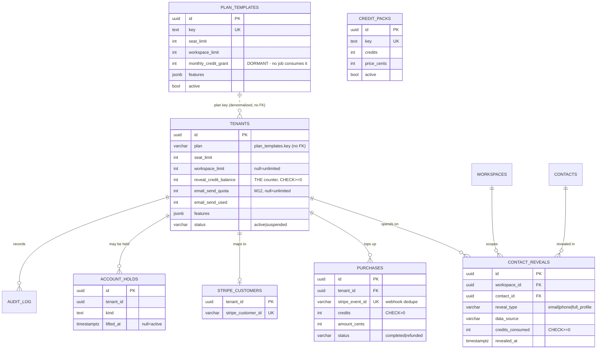
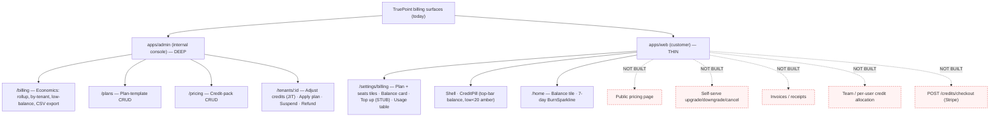

# 02 — Current System Audit (Plans / Pricing / Credits / Subscription / Billing)

> **Status:** Factual current-state base. **Load-bearing.** Every other doc in
> `docs/planning/plans-pricing-credits/` cites this file rather than re-deriving the schema, the
> endpoint list, or the repo inventory. Quotes here are taken from source as of `2026-06-30`
> (`main` @ `580eae0`). Where a claim is about *target* state it is tagged; everything untagged is
> **built and on `main`**.
>
> **Anti-duplication contract.** This audit deliberately **does not restate** the reveal-transaction
> SQL, the counter model, or the bulk-lease mechanics — those live in
> [`07-billing-credits.md`](../07-billing-credits.md) §3 / §4 / §5 / §8 / §11 and are *linked*, not
> copied. It also **reuses** the gap IDs and 7.x/8.x table designs from the three platform-admin tab
> audits ([`audits/platform-admin/03-billing.md`](../audits/platform-admin/03-billing.md),
> [`04-plans.md`](../audits/platform-admin/04-plans.md),
> [`05-pricing.md`](../audits/platform-admin/05-pricing.md)) rather than re-auditing those tabs.

---

## 1. Executive Summary

TruePoint's money system today is a **prepaid credit counter**, not a billing platform. The
authoritative balance is a single `integer` column — `tenants.reveal_credit_balance` — guarded by a
`CHECK (>= 0)` and a `SELECT … FOR UPDATE` row-lock. Credits enter **only** through a
signature-verified Stripe webhook (top-ups) or an audited platform-admin manual grant; they leave
through the in-transaction reveal claim. There is **no append-only credit ledger, no subscriptions
table, no invoices, no payment-method store, and no billing background job of any kind** (no
monthly-grant, renewal, reconciliation, expiry, rollover, dunning, lease-reaper, or
low-balance-notifier worker).

The **platform-admin** surface (`apps/admin`) is broad and mature: economics rollups, per-tenant
drill-downs, CSV export, low-balance lists, full credit-pack and plan-template CRUD, manual
credit grant/adjust (JIT-elevation-gated, idempotency-key-aware), plan override, and audited
refunds. The **customer-web** surface (`apps/web`) is thin: a read-only balance pill, a
balance-plus-usage Settings page whose "Top up" button toasts *coming soon* because
`POST /credits/checkout` **does not exist**, and a 7-day burn sparkline on Home. There is **no
public pricing page, no self-serve plan change, no invoices/receipts, and no team/per-user credit
allocation UI** anywhere in web.

The one-line verdict that the rest of the program builds on: **counter, not ledger; packs, not
subscriptions; admin-deep, web-thin.**

---

## 2. Objectives

This document exists to:

1. Provide the **single canonical inventory** of what is built across schema, API, core/repos, and
   both frontends — so no downstream doc re-audits and no two docs disagree on a fact.
2. Tag each surface with its **gating reality** (`[exists]` / `[M11-ledger]` / `[M12-lease]` /
   `[Stripe]` / `[decision-gated]`) so deferred infrastructure is never presented as built.
3. Pin the **invariants and their known weaknesses** (counter not ledger → no reconciliation;
   tenant-row hot-lock) by linking the canonical analysis, not re-deriving it.
4. Produce the **"What does NOT exist" master table** that every gap-and-roadmap doc references.
5. Inventory **every relevant ADR + `07`** in one line each, so later docs cite by stable handle.

Out of scope: recommendations, target architecture, and roadmap — those are docs `03`–`07`. This
file is description, not prescription, except where a verdict is unavoidable (§6, §13).

---

## 3. Research Findings (what the code actually says)

### 3.1 Data-model audit — billing-relevant tables, column by column

Source: `packages/db/src/schema/billing.ts`, `auth.ts`, `platformOps.ts`. RLS posture is the
deployed Postgres policy class; **owner-only** = written/read solely by the platform owner
connection (`withPlatformTx`), deny-all to the `leadwolf_app` customer role.

#### 3.1.1 `tenants` (in `auth.ts`) — the authoritative counter lives here

| Column | Type | Notes |
|---|---|---|
| `plan` | `varchar(50)` NOT NULL default `'free'` | Stores a `plan_templates.key` string — **denormalized**, no FK |
| `seat_limit` | `integer` NOT NULL default `1` | Entitlement cap; set by plan override |
| `workspace_limit` | `integer` (nullable) | `null` = unlimited |
| **`reveal_credit_balance`** | `integer` NOT NULL default `0` | **THE credit counter.** `CHECK (>= 0)` (the overdraft guard) |
| `email_send_quota` | `integer` (nullable) | `null` = unlimited (M12 send meter, mirrors the credit counter) |
| `email_send_used` | `integer` NOT NULL default `0` | `CHECK (email_send_used >= 0 AND (quota IS NULL OR used <= quota))` |
| `email_send_period_start` | `timestamptz` NOT NULL | Window anchor for the send meter |
| `features` | `jsonb` NOT NULL default `{}` | Denormalized entitlement flags, set by plan override |
| `status` | `varchar(50)` NOT NULL default `'active'` | `active` / `suspended` lifecycle gate |

> **Invariant + its weakness.** The balance is a bare counter, so there is no per-event debit trail
> to reconcile against and no rollback granularity. This is **G-BIL-1 (no reconciliation
> invariant)** and the **G-BIL-2 tenant-row hot-lock** of
> [`28-enterprise-readiness-audit.md`](../28-enterprise-readiness-audit.md); the lock/decrement
> mechanics are [`07-billing-credits.md`](../07-billing-credits.md) §3. **Not restated here.**

#### 3.1.2 `contact_reveals` (`billing.ts`) — the per-reveal *event* log (proto-ledger, debit side only)

| Column | Type | Notes |
|---|---|---|
| `id` | `uuid` PK (`uuid_generate_v7`) | |
| `tenant_id` / `workspace_id` | `uuid` NOT NULL FK (cascade) | Two-tier tenancy; RLS scopes by `workspace_id` |
| `contact_id` | `uuid` NOT NULL FK | |
| `revealed_by_user_id` | `uuid` NOT NULL FK | |
| `reveal_type` | `varchar(20)` | `CHECK IN ('email','phone','full_profile')` |
| `data_source` | `varchar(20)` default `'internal'` | `CHECK IN ('apollo','zoominfo','linkedin','internal')` |
| `credits_consumed` | `integer` NOT NULL default `1` | `CHECK (>= 0)` (a $0 / verified-free reveal is legal) |
| `revealed_fields` | `jsonb` default `{}` | |
| `revealed_at` | `timestamptz` NOT NULL | |

**Keys/indexes:** `UNIQUE (workspace_id, contact_id, reveal_type)` = **the reveal-idempotency
claim** (re-revealing the same workspace copy conflicts → free, ADR-0007/H2); composite
`(workspace_id, revealed_at DESC)` for the recency feed. **RLS:** workspace-scoped customer table.
This is the closest thing to a ledger that exists — but it records **only debits from reveals**, not
grants, top-ups, refunds, or send spend, so it cannot serve as the credit ledger.

#### 3.1.3 `purchases` (`billing.ts`) — idempotent Stripe top-ups (credit side)

| Column | Type | Notes |
|---|---|---|
| `id` | `uuid` PK | |
| `tenant_id` | `uuid` NOT NULL FK | |
| `stripe_event_id` | `varchar(255)` NOT NULL **UNIQUE** | **Webhook dedupe** — duplicate events grant once |
| `stripe_payment_intent_id` | `varchar(255)` (nullable) | |
| `credits` | `integer` NOT NULL | `CHECK (> 0)` |
| `amount_cents` | `integer` (nullable) | |
| `status` | `varchar(20)` default `'completed'` | `CHECK IN ('completed','refunded')` |

**RLS:** tenant-scoped. The grant/refund mutations run on the owner path (webhook) or platform path
(admin refund). No `currency` column → **single-currency (USD) by construction.**

#### 3.1.4 `stripe_customers` (`billing.ts`)

`tenant_id` **PK** → `stripe_customer_id varchar(255) UNIQUE`. One Stripe customer per tenant. No
payment-method, no subscription id, no default-source columns.

#### 3.1.5 `suppression_list` (`billing.ts`) — gates reveal **and** send

Scope `global | tenant | workspace` (`CHECK` coherence: global rows carry no tenant/workspace;
workspace rows carry both). Match by `email` (blind index) / `domain` (citext) / `phone` (blind
index) / `contact_id`, each with a presence `CHECK`. Compliance gate, not a billing object, but it
sits in `billing.ts` and is checked in-transaction on the reveal path.

#### 3.1.6 `idempotency_keys` (`billing.ts`) — stored-response replay for money endpoints

`UNIQUE (tenant_id, key)`; stores `response_status` + `response_body jsonb`. Tenant-scoped. Used by
the admin credit-grant path via `idempotencyRepository.findOwner/storeOwner` (owner connection).

#### 3.1.7 `audit_log` (`billing.ts`) — append-only customer audit

Append-only (UPDATE/DELETE blocked by trigger). Closed `action` enum includes the billing-relevant
`reveal`, `reveal.blocked`, `credit.adjust`, `send`, `export`. **Note:** the *platform* audit trail
for admin credit/plan moves is a **separate** table (`platform_audit_log`, written by
`withPlatformTx`) — see §3.3.

#### 3.1.8 Pricing catalog (`platformOps.ts`) — owner-only config, **not tenant data**

| Table | Key columns | Notes |
|---|---|---|
| `credit_packs` | `key UNIQUE`, `name`, `credits`, `price_cents`, `active`, `sort_order` | Pricing catalog. Retired = `active=false` (kept for history). **No customer-facing read wired** (the public pricing page is a separate, unbuilt surface). |
| `plan_templates` | `key UNIQUE`, `name`, `seat_limit`, `workspace_limit` (null=unlimited), `monthly_credit_grant` (null=none), `features jsonb`, `active`, `sort_order` | Plan/entitlement catalog. `monthly_credit_grant` exists **but nothing consumes it** — there is no monthly-grant job. |
| `account_holds` | `tenant_id`, `kind`, `reason`, `placed/lifted_*` | Abuse/fraud/payment hold flag (distinct from lifecycle suspend). |

Both catalog tables are **owner-written (`withPlatformTx`), deny-all to `leadwolf_app`** + the
`applyMigrations` REVOKE. `monthly_credit_grant` being a dormant column is the single clearest signal
that the **subscription/recurring layer is schema-anticipated but unbuilt.**

### 3.2 API-surface audit — every billing-relevant endpoint

Sources: `apps/api/src/features/billing/routes.ts`, `admin/billing.ts`, `admin/pricing.ts`,
`admin/routes.ts`. "Audit action" = the `withPlatformTx` action string (mutation strings are in the
ADR-0032 platform-audit enum; plain read strings are not). "Idem" = Idempotency-Key honored.

#### 3.2.1 Customer + webhook (`/api/v1`)

| Method · Path | Auth / Capability | Audit action | Idem | Notes |
|---|---|---|---|---|
| `POST /billing/webhook` | **None** — Stripe HMAC signature is the trust boundary (300 s skew) | — | via `purchases.stripe_event_id` UNIQUE | **The ONLY path that grants credits.** Unknown event type → `200 {granted:false}` so Stripe stops retrying. |
| `GET /credits/balance` | `authn`+`tenancy`; role `owner/admin/member/viewer` | — | — | Non-locking counter read. |
| `GET /credits/usage` | same | — | — | Workspace-scoped reveal list, `limit ≤ 500`. 403 if no workspace selected. |

> **`POST /credits/checkout` is NOT built.** The web client calls it and treats `404/501` as "Stripe
> not wired" (`available:false`). See §3.5. Tagged `[Stripe]`.

#### 3.2.2 Platform-admin economics — `/api/v1/admin/billing/*` (capability `billing:read`)

| Method · Path | Capability | Audit action | Notes |
|---|---|---|---|
| `GET /admin/billing/economics` | `billing:read` | `admin.billing_economics` | Rollup: credits sold/consumed, revenue, refunds, provider spend (`cost_micros/10_000`), cost-per-reveal, margin. Aggregates only. |
| `GET /admin/billing/economics/by-tenant` | `billing:read` | `admin.billing_economics_by_tenant` | Top tenants by provider spend, bounded `50`. |
| `GET /admin/billing/economics/by-tenant/export` | `billing:read` | `admin.billing_economics_export` (window in metadata) | CSV, cap `1000`; formula-injection-guarded `csvField`. |
| `GET /admin/billing/low-balance` | `billing:read` | `admin.billing_low_balance` | Active tenants at/under a threshold. |

#### 3.2.3 Platform-admin pricing/plans catalog — `/api/v1/admin/pricing/*` (capability `pricing:manage`)

| Method · Path | Capability | Audit action | Notes |
|---|---|---|---|
| `GET /admin/pricing/credit-packs` | `pricing:manage` | `admin.list_credit_packs` | Full catalog (active+retired). |
| `PUT /admin/pricing/credit-packs` | `pricing:manage` | `credit_pack.set` | Upsert (idempotent on `key`). |
| `POST /admin/pricing/credit-packs/:key/active` | `pricing:manage` | `credit_pack.set` | Toggle; unknown key → 404 thrown in-tx (audit row rolls back). |
| `GET /admin/pricing/plan-templates` | `pricing:manage` | `admin.list_plan_templates` | Full catalog. |
| `PUT /admin/pricing/plan-templates` | `pricing:manage` | `plan_template.set` | Upsert (idempotent on `key`). |
| `POST /admin/pricing/plan-templates/:key/active` | `pricing:manage` | `plan_template.set` | Toggle; unknown key → 404 in-tx. |

#### 3.2.4 Platform-admin tenant money ops — `/api/v1/admin/tenants/*` (`admin/routes.ts`)

| Method · Path | Capability | Audit action | Idem | Notes |
|---|---|---|---|---|
| `POST /tenants/:id/credits` | `tenants:credits` | `credit.grant` (Δ>0) / `credit.adjust` (Δ<0) | **Yes** (Idempotency-Key) | **JIT-elevation-gated** (consumes a live `credit.adjust` elevation in-tx; else `403 elevation_required`). Would-overdraw debit → 422 (rolls the elevation back). `FOR UPDATE` + `CHECK(>=0)` are the guards. |
| `POST /tenants/:id/plan` | `tenants:plan` | `plan.override` | — | Applies a `plan_templates` row's `plan/seat_limit/workspace_limit/features` to the tenant. **Does not grant credits** (the monthly grant "is the job's" — and the job does not exist). |
| `GET /tenants/:id/purchases` | `billing:read` | `admin.list_purchases` | — | Newest-first, bounded `100`; Stripe ids not projected. |
| `POST /tenants/:id/purchases/:pid/refund` | `tenants:credits` | `credit.adjust` | — | Marks `refunded`, reverses credits **clamped to balance** (the bare counter can't go negative); unrecoverable remainder is deferred to the M11 ledger reconciliation. |

All admin writes run through `withPlatformTx` (owner connection + an in-tx `platform_audit_log` row),
validate the path UUID **before** the tx, and require a mandatory `reason`; a no-op write throws
**inside** the tx so the audit row rolls back (no trace for an action that did not happen).

### 3.3 Core / repository audit

Sources: `packages/core/src/{billing,reveal,data-health}`, `packages/db/src/repositories/*`.

| Unit | Location | What it does |
|---|---|---|
| `verifyStripeSignature` | `core/billing` | HMAC-SHA256, 300 s skew tolerance. |
| `parseCreditGrantEvent` | `core/billing` | Maps a Stripe event → a `GrantInput`; unknown types return null (ignored). |
| `grantFromStripe` | `core/billing` | The credit-grant orchestrator behind the webhook. |
| `revealContact` / `revealCostFor` | `core/reveal` | Cost-by-`reveal_type`; composes the reveal tx (claim + lock + decrement). |
| `chargeFor` | `core/data-health` | **ADR-0013** charge-by-verified-result: `valid`=full cost, `invalid/catch_all/unknown`=0, `risky`=configurable. |
| `creditRepository` | `db/repositories` | `lockBalance` (`SELECT … FOR UPDATE`), `decrement`, `currentBalance`, `getBalance`, `burnByDay` (sparkline), `grantFromEvent` (idempotent on `stripe_event_id`, **system path — no tenant GUC**). |
| `revealRepository` | `db/repositories` | `getContactForReveal`, `claimReveal` (`INSERT … ON CONFLICT DO NOTHING`), `listByWorkspace`. |
| `creditPackRepository` | `db/repositories` | `list` / `upsert` / `setActive`. |
| `planTemplateRepository` | `db/repositories` | `list` / `upsert` / `getByKey` / `setActive`. |
| `platformBillingReadRepository` | `db/repositories` | `economicsSummary` / `economicsByTenant` / `lowBalanceTenants` / `listPurchases` — bounded owner-path aggregates. |
| `platformAdminWriteRepository` | `db/repositories` | `adjustCredits` (FOR-UPDATE, would-overdraw outcome), `refundPurchase` (clamped reversal), `applyPlan`. |
| `sendQuotaRepository` | `db/repositories` | `lock`/`consume`/`assertWithinQuota`/`release`/`setQuota`/`resetPeriod` — **copies the credit-counter discipline for the M12 email meter. The caller (`sendStep`) is not yet wired**, and `resetPeriod` has no driving job. |
| `idempotencyRepository` | `db/repositories` | `findOwner` / `storeOwner` (owner-path replay for the admin grant). |

> **No billing background jobs exist.** There is **no** monthly-grant worker (despite
> `plan_templates.monthly_credit_grant`), **no** renewal/subscription job, **no** reconciliation job
> (the counter has nothing to reconcile against — G-BIL-1), **no** credit expiry/rollover sweep, **no**
> dunning, **no** bulk-lease reaper (the M12 lease layer is unbuilt), **no** low-balance notifier, and
> **no** send-quota period reset job. Every "the job's responsibility" comment in the codebase points
> at a job that has not been written.

### 3.4 Admin-frontend audit (`apps/admin`)

Vanilla React + `fetchWithAuth` + `StateSwitch`; write controls render-gated by
`useStaffMe().canMaybe(capability)` (the API still enforces). Shared primitives from `@leadwolf/ui`.

| Feature folder · Route | Built surface |
|---|---|
| `features/billing` · `/billing` (`BillingEconomicsPage`) | Rollup `StatTile`s (revenue, provider spend, gross margin, cost-per-reveal, credits sold, reveals), per-tenant `DataTable`, low-balance table (≤100), period selector (7/30/90/365 d), **Export CSV**. |
| `features/plans` · `/plans` (`PlansPage`) | Plan-template catalog CRUD (seat/workspace caps, monthly grant, feature flags, active toggle). |
| `features/pricing` · `/pricing` (`PricingPage`) | Credit-pack catalog CRUD (credits, price, active toggle). |
| `features/tenants` · `/tenants/:id` (`TenantDetailPage`) | `TenantActions`: **Adjust credits** (signed delta + reason, mints `credit.adjust` JIT elevation then calls the gated endpoint), **Apply plan** (loads active templates), **Suspend/Reactivate** (suspend mints `tenant.suspend` elevation). `TenantPurchases`: list + **refund**. All controls capability-gated in the UI. |

Routes registered under `apps/admin/src/app/(shell)/{billing,plans,pricing,tenants/[id]}/page.tsx`.

### 3.5 Web-frontend audit (`apps/web`)

Vanilla React + `fetchWithAuth` (in-memory token, ADR-0016). **No TanStack Query** (per project
memory; the architecture skill is wrong on this point).

| Surface | Built behavior |
|---|---|
| `features/settings-billing` · `/settings/billing` (`BillingPage`) | Plan + seats + workspaces `StatTile`s, a credit-balance card with a **Top up** button, the "charged only for verified data; bounces credited back" reassurance, and a `UsageTable` of reveals. Data via `useBilling` → `api.ts`. |
| `components/shell/CreditPill` | Top-bar balance, deep-links to `/settings/billing`, amber dot when balance `< 20`, re-fetches on the `window:credits:changed` event. |
| `features/home` | Credit-balance tile + `BurnSparkline` (7-day burn). |

**The web "Top up" button does not actually buy credits.** `api.startCheckout` calls
`POST /api/v1/credits/checkout`, which returns `404/501` (the endpoint is unbuilt), so the button
toasts *"Top-up coming soon."* Plan data comes from `GET /tenants/me`, also treated as possibly-`null`
("not built yet"). No fabricated balances or checkouts.

**NOT built in web (explicit list):**

- Public / unauthenticated **pricing page**.
- **Self-serve** upgrade / downgrade / cancel / subscribe.
- **Invoices / receipts** (none exist server-side either).
- **Credit-history pagination / filter / export** (the usage table is a flat capped list).
- **Team / workspace credit allocation** UI (no per-team budget exists to surface).
- **Per-user budgets / soft limits** UI.
- **Low-balance email notifications** (no notifier job, no preference UI).
- A working **checkout** (blocked on `[Stripe]` `POST /credits/checkout`).

### 3.6 Existing-decisions inventory (one line each — cite by path + section)

| Handle | Path | One-line |
|---|---|---|
| **`07`** | [`07-billing-credits.md`](../07-billing-credits.md) | **Canonical billing/credit spec** — counter model, reveal tx (§3), Stripe top-ups (§4), bulk leases (§5), entitlements/quota, refunds, reconciliation, reporting (§9), testing, open questions. |
| `03` | [`03-database-design.md`](../03-database-design.md) | Schema; §8 billing/compliance; §12 partitioning intent for `contact_reveals`/`audit_log`. |
| `28` | [`28-enterprise-readiness-audit.md`](../28-enterprise-readiness-audit.md) | **G-BIL-1** (no reconciliation invariant), **G-BIL-2** (tenant-row hot-lock). |
| ADR-0004 | `decisions/0004-*` | Credit-ledger idempotency — **SUPERSEDED by 0007**. |
| ADR-0006 | `decisions/0006-*` | Per-workspace multitenancy. |
| ADR-0007 | `decisions/0007-*` | Per-workspace reveal + **credit counter**; names the M11 ledger upgrade path. |
| ADR-0011 | `decisions/0011-*` | Platform admin & privileged access (JIT elevation, impersonation). |
| **ADR-0012** | `decisions/0012-*` | **Transparent, no-lock-in**: NO auto-renewal, credits DO NOT expire (MVP), no data-destroy on churn, transparent self-serve pricing, prices are placeholders. **The default constraint.** |
| ADR-0013 | `decisions/0013-*` | Charge-by-verified-result + credit-back on bounce. |
| ADR-0022 | `decisions/0022-*` | Departments/teams intra-workspace segmentation (allocation seam). |
| ADR-0027 | `decisions/0027-*` | Real-time delivery + event backbone (the `credits:changed` event). |
| ADR-0029 | `decisions/0029-*` | **M11 append-only `credit_ledger` + batch reservation; M12 per-workspace/team leases.** |
| ADR-0030 | `decisions/0030-*` | Granular tenant org roles (billing-permission seam). |
| ADR-0032 | `decisions/0032-*` | Platform audit-action vocabulary (`credit.grant`, `credit.adjust`, `plan.override`, …). |
| ADR-0038 | `decisions/0038-*` | Bulk-enrichment billing / forecast / quota. |
| tab audits | [`03-billing.md`](../audits/platform-admin/03-billing.md) · [`04-plans.md`](../audits/platform-admin/04-plans.md) · [`05-pricing.md`](../audits/platform-admin/05-pricing.md) | Per-tab 18-section audits with gap IDs (G1..Gn) and competitor citations — **reused, not re-audited.** |

---

## 4. Industry Best Practices (only as a measuring stick for current state)

This file is description, so best-practice depth lives in docs `03`/`04`. As a *gauge of the current
gap* against the competitor benchmarks already cited in the tab audits (Stripe Billing, Chargebee,
Recurly, Maxio):

| Capability competitors treat as table-stakes | TruePoint today |
|---|---|
| Immutable double-entry **ledger** | ❌ bare counter + reveal-only debit log |
| **Subscriptions** + recurring invoicing | ❌ packs-only; `monthly_credit_grant` dormant |
| **Invoices / receipts / dunning** | ❌ none |
| **Multi-currency / price history** | ❌ USD-only by schema (no `currency` column) |
| **Self-serve** plan change / public pricing | ❌ admin-only catalog; web Top-up is a stub |
| Usage **rollover / expiry policy** | ❌ no expiry (ADR-0012 default), no rollover engine |
| **Reconciliation** to a payment processor | ❌ G-BIL-1 — nothing to reconcile against |

What TruePoint **does** match well: webhook idempotency (`stripe_event_id` UNIQUE), audited
privileged credit moves with JIT elevation, formula-injection-guarded CSV export, and
charge-by-verified-result (ADR-0013) — a fairness control most credit products lack.

---

## 5. Current System Observations (the consolidated read)

1. **The balance is one integer.** Correctness rests entirely on `FOR UPDATE` + `CHECK(>=0)`; there
   is no event-sourced history to audit a balance against (G-BIL-1) and the per-tenant lock is a
   throughput ceiling at scale (G-BIL-2). *Mechanics: `07` §3 — not restated.*
2. **Two half-ledgers, no whole one.** `contact_reveals` records debits-from-reveals; `purchases`
   records top-ups; manual grants/refunds touch only the counter (their trail is
   `platform_audit_log`, not a credit-event table). No single table reconstructs the balance.
3. **Credit ingress is single-and-trusted.** Only the signed webhook and the JIT-gated admin grant
   add credits — a strong security posture.
4. **The recurring layer is anticipated, not built.** `plan_templates.monthly_credit_grant`,
   `email_send_period_start`, and "the job's responsibility" comments all point at workers that do
   not exist.
5. **Admin is the real billing UI; web is a read-mostly mirror.** Every write that matters
   (grant, adjust, refund, plan, pricing) is admin-only and audited; the customer cannot self-serve.
6. **Web's purchase path is a documented stub** — the button exists, the endpoint does not.
7. **The M12 send-quota meter is a fully-built repository with no caller** — a preview of how the
   monetization layer is being staged ahead of wiring.

---

## 6. Recommendations (current-state verdict only)

Full recommendations are docs `03`–`07`. The **load-bearing verdict** this audit asserts, which
every downstream doc inherits:

> **Counter, not ledger; packs, not subscriptions; admin-deep, web-thin.**

Concretely, three current-state facts must be treated as fixed inputs by later docs:

1. **The credit ledger (ADR-0029 M11) is the program keystone**, because reconciliation, expiry,
   rollover, refund-of-spent-credits, and per-team allocation all *require* an event log the counter
   cannot provide. Tag: `[M11-ledger]`.
2. **Any subscription / auto-renewal / expiry design is a PROPOSED AMENDMENT to ADR-0012**, never a
   stated fact — to be carried as a future **ADR-0041** (next free number). The month-to-month,
   no-auto-renew, no-expiry model is the **default** and stays so until that ADR is approved.
3. **Hierarchical allocation (org → team/workspace → per-user)** builds on the M12 lease layer
   (ADR-0029) and is a future **ADR-0042**; the tenant pool stays authoritative beneath it.

---

## 7. Diagrams

### 7.1 Current-state ER — **existing billing tables only**

> **Deliberately absent** (do not read into the diagram): `credit_ledger`, `subscriptions`,
> `invoices`, `invoice_line_items`, `payment_methods`, `billing_cycles`, `trials`, `promotions`,
> `currencies`/`price_history`, `team_budgets`, `user_budgets`. See §9 master table.

### 7.2 Current admin-vs-web navigation tree

---

## 8. Tables

The factual tables are inline in §3 (data model 3.1, API 3.2, repos 3.3, frontends 3.4–3.5,
decisions 3.6). The consolidated **"What does NOT exist"** master table is §9.

---

## 9. Dependencies

### 9.1 The "What does NOT exist" master table

Tags: `[M11-ledger]` = waits on the ADR-0029 ledger · `[M12-lease]` = waits on the lease layer ·
`[Stripe]` = waits on Stripe wiring · `[decision-gated]` = waits on an owner decision (ADR-0041/0042).

| Missing thing | Class | Tag | Blocks |
|---|---|---|---|
| `credit_ledger` (append-only credit events) | table | `[M11-ledger]` | reconciliation, expiry, rollover, refund-of-spent, allocation |
| `subscriptions` | table | `[decision-gated]` | recurring revenue, auto-renew (ADR-0041) |
| `invoices` / `invoice_line_items` | table | `[Stripe]` `[decision-gated]` | receipts, finance export |
| `payment_methods` | table | `[Stripe]` | self-serve checkout, dunning |
| `billing_cycles` | table | `[decision-gated]` | period grants, proration |
| `trials` | table | `[decision-gated]` (OD-7: signup-bonus credits = MVP trial) | time-boxed trials |
| `promotions` / coupons | table | `[decision-gated]` | discounting |
| `currencies` / `price_history` | table | `[decision-gated]` (OD-5: USD authoritative) | international GTM |
| `team_budgets` / `user_budgets` | table | `[M12-lease]` `[decision-gated]` (OD-2) | hierarchical allocation (ADR-0042) |
| Monthly-grant job | worker | `[decision-gated]` | `plan_templates.monthly_credit_grant` is dormant |
| Renewal / subscription job | worker | `[decision-gated]` | recurring billing |
| Reconciliation job | worker | `[M11-ledger]` | G-BIL-1 |
| Credit expiry / rollover sweep | worker | `[M11-ledger]` `[decision-gated]` (OD-4) | usage policy |
| Dunning / retry job | worker | `[Stripe]` | failed-payment recovery |
| Bulk-lease reaper | worker | `[M12-lease]` | release stale reservations |
| Low-balance notifier | worker | — | proactive top-up email |
| Send-quota period reset | worker | `[M12-lease]` | `sendQuotaRepository.resetPeriod` has no caller |
| `POST /credits/checkout` | endpoint | `[Stripe]` | web Top-up button |
| `GET /tenants/me` (plan envelope) | endpoint | — | web plan tiles (today returns null-tolerant) |
| Public pricing read endpoint | endpoint | — | public pricing page |
| Self-serve plan-change endpoints | endpoint | `[decision-gated]` | web upgrade/downgrade/cancel |
| Public pricing page | web UI | — | conversion |
| Self-serve upgrade/downgrade/cancel | web UI | `[decision-gated]` | OD-3 web billing hub |
| Invoices/receipts | web UI | `[Stripe]` | — |
| Credit-history filter/export | web UI | — | — |
| Team/per-user allocation UI | web UI | `[M12-lease]` `[decision-gated]` | OD-2 |

### 9.2 Build-order dependencies (this host's constraints)

- **No `drizzle-kit generate`.** New billing tables (ledger, subscriptions, invoices, budgets) must
  be **hand-authored migrations, CI/docker-verified** — this host has no docker and stale meta
  snapshots pollute generated migrations (per project memory). Reflect in every migration/rollback
  section downstream.
- The ledger (`[M11-ledger]`) is the upstream dependency for the largest share of the "missing"
  rows; the program should treat it as the keystone (OD-6).

---

## 10. Risks

| # | Risk (current state) | Source |
|---|---|---|
| R1 | **No reconciliation surface** — a counter drift (a partial refund of spent credits, a bug in a future grant job) is undetectable; there is no ledger to reconcile against. | G-BIL-1 (`28`) |
| R2 | **Tenant-row hot-lock** — every reveal/grant takes `FOR UPDATE` on the single `tenants` row; a high-velocity tenant serializes its own spend. | G-BIL-2 (`28`), `07` §3 |
| R3 | **Refund cannot fully reverse spent credits** — `refundPurchase` clamps to the available balance; the unrecoverable remainder is silently deferred to a ledger job that does not exist. | `platformAdminWrites.refundPurchase` |
| R4 | **Dormant `monthly_credit_grant`** — a plan template can advertise a monthly grant that nothing applies, risking an entitlement-vs-reality mismatch the moment subscriptions are marketed. | `platformOps.plan_templates` |
| R5 | **Web Top-up stub UX** — the button exists; users may believe checkout works. Mitigated today by the explicit "coming soon" toast. | `settings-billing/api.ts` |
| R6 | **Single-currency by schema** — adding currency later is a migration + price-history retrofit, not a config change. | `purchases` (no `currency`) |
| R7 | **ADR-0012 collision risk** — any auto-renewal/expiry work that is *asserted* rather than framed as a proposed ADR-0041 amendment silently contradicts a shipped decision. | ADR-0012 |
| R8 | **Send-quota meter shipped without a caller** — `sendQuotaRepository` enforces nothing until `sendStep` is wired; an "enforced" quota that is not consumed is a false assurance. | `sendQuotaRepository` |

---

## 11. Future Enhancements (pointers only; designed in docs 03–07)

- **M11 credit ledger** (ADR-0029) → unlocks reconciliation, expiry/rollover, refund-of-spent,
  per-event audit. `[M11-ledger]`
- **M12 leases** (ADR-0029) → batch reservation + per-workspace/team budgets. `[M12-lease]`
- **Subscriptions / recurring** as a **proposed ADR-0041 amendment** to ADR-0012 (hybrid:
  month-to-month default, opt-in annual for enterprise, never defaulted-on). `[decision-gated]`
- **Hierarchical allocation** (org → team → user) as **proposed ADR-0042**. `[decision-gated]`
- **Stripe checkout + invoices + dunning** behind a feature flag, USD authoritative (OD-5).
  `[Stripe]`
- **Public pricing page + self-serve plan change** (OD-3 web billing hub). `[decision-gated]`

---

## 12. References

- [`07-billing-credits.md`](../07-billing-credits.md) — **canonical spec**; §3 reveal tx, §4 Stripe
  top-ups, §5 bulk leases, §8 entitlements/quota, §9 reporting, §11 testing. *(Reveal/top-up
  sequences are referenced, never restated here.)*
- [`03-database-design.md`](../03-database-design.md) — §8 billing/compliance, §12 partitioning.
- [`28-enterprise-readiness-audit.md`](../28-enterprise-readiness-audit.md) — G-BIL-1, G-BIL-2.
- ADRs: [`0004`](../decisions) (superseded), `0006`, `0007`, `0011`, **`0012`**, `0013`, `0022`,
  `0027`, **`0029`**, `0030`, `0032`, `0038` (next free: **0041**).
- Platform-admin tab audits — [`03-billing.md`](../audits/platform-admin/03-billing.md),
  [`04-plans.md`](../audits/platform-admin/04-plans.md),
  [`05-pricing.md`](../audits/platform-admin/05-pricing.md) (gap IDs + competitor citations reused).
- Source quoted: `packages/db/src/schema/{billing,auth,platformOps}.ts`;
  `apps/api/src/features/{billing/routes,admin/billing,admin/pricing,admin/routes}.ts`;
  `packages/db/src/repositories/{creditRepository,revealRepository,platformBillingReads,platformAdminWrites,sendQuotaRepository}.ts`;
  `apps/admin/src/features/{billing,plans,pricing,tenants}`;
  `apps/web/src/features/{settings-billing,home}`, `apps/web/src/components/shell/CreditPill.tsx`.

---

> **Cross-reference handles for downstream docs:** cite this file as `02 §<n>` (e.g. *"the
> counter-not-ledger verdict, `02 §6`"*, *"the What-does-NOT-exist master table, `02 §9.1`"*). When a
> later doc needs reveal/top-up mechanics, it must link `07 §3`/`§4` — never re-expand them here.
