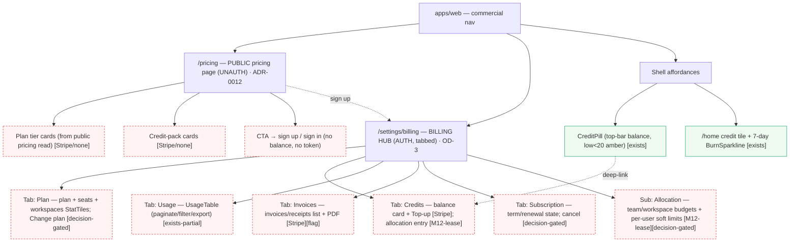
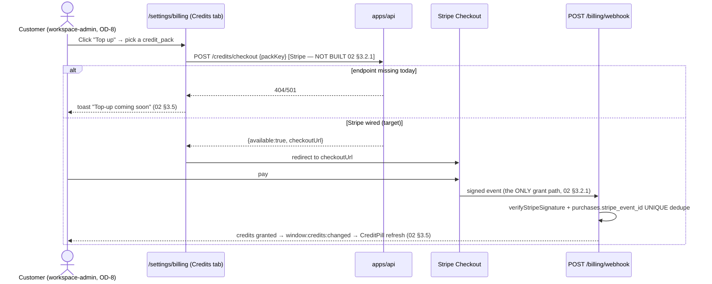
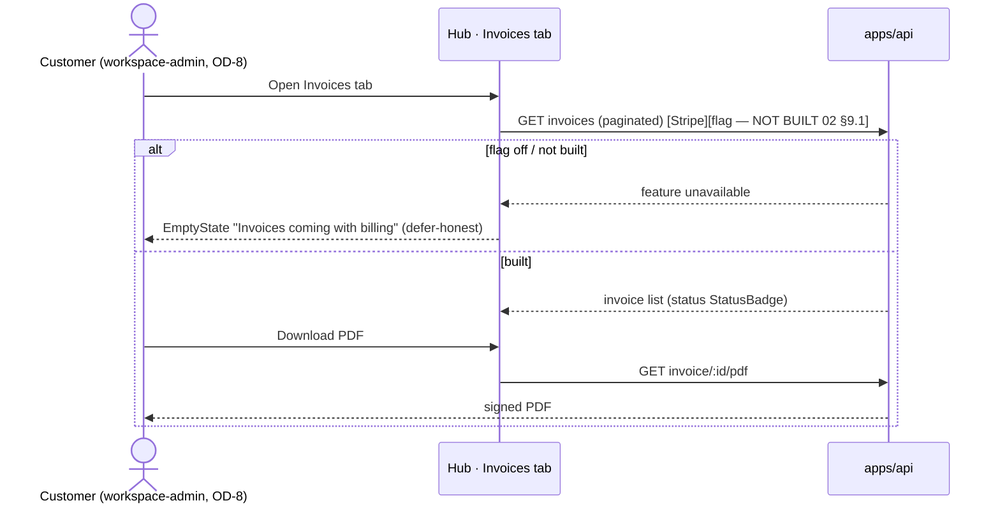
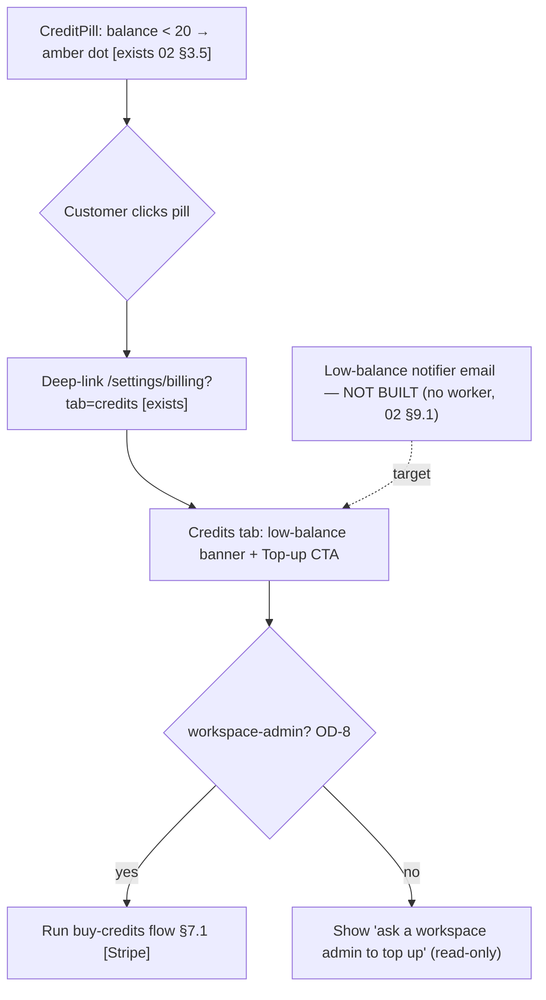
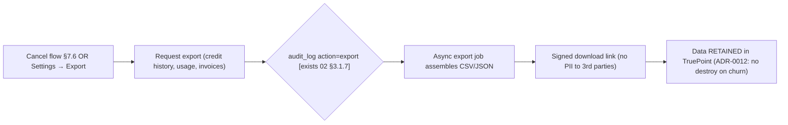

# 03 — Information Architecture

> **Reads first:** [`00-README.md`](./00-README.md) (locked decisions LD-1/LD-2, open-decisions
> register OD-1…OD-8, vocabulary, gating legend) and
> [`02_Current_System_Audit.md`](./02_Current_System_Audit.md) (the file-grounded as-built; cite as
> `02 §<n>`). This doc designs **where every commercial surface lives** — the navigation hierarchy,
> the consolidate-vs-separate decision per portal, where each deferred view slots in, the user
> flows, and low-fidelity wireframes. It does **not** re-derive the schema, the reveal transaction,
> or the counter model — those are `02 §3` and [`07 §3/§4/§5`](../07-billing-credits.md), linked
> never restated.
>
> **Gating discipline.** Every surface below carries a tag from the `00-README §8` legend:
> `[exists]` · `[exists-partial]` · `[M11-ledger]` · `[M12-lease]` · `[Stripe]` · `[flag]` ·
> `[capability]` · `[decision-gated]`. **A non-`[exists]` surface is never drawn as built.**
>
> **Wireframes** live under [`wireframes/admin/`](./wireframes/admin/) and
> [`wireframes/web/`](./wireframes/web/), indexed in [`wireframes/README.md`](./wireframes/README.md).
> They use **only** existing `@leadwolf/ui` primitives — `StatTile`, `DataTable`, `Progress`,
> `StatusBadge`, `StateSwitch`, `EmptyState`, `Skeleton` — and invent no component.

---

## 1. Executive Summary

This document settles the **information architecture** for TruePoint's commercial surfaces across the
two portals and decides the **consolidate-vs-separate question (OD-3)** per portal:

- **`apps/admin` (internal console) — KEEP SEPARATED.** Four distinct top-level destinations stay
  distinct: **Billing & Revenue Ops** (`/billing`), **Plans** (`/plans`), **Pricing** (`/pricing`),
  and **Tenant detail** (`/tenants/:id`, where per-tenant money ops live). New views —
  subscriptions, invoices, dunning, the credit ledger, allocation oversight — **slot into the
  existing destination that owns their concern** (revenue-ops under `/billing`, recurring config
  under `/plans`, per-tenant ledger/allocation under `/tenants/:id`), never a fifth mega-page.
  Rationale: staff are role-segmented (`billing:read` vs `pricing:manage` vs `tenants:credits`), and
  a separated IA lets capability gating map cleanly onto navigation.

- **`apps/web` (customer) — ONE BILLING HUB + a SEPARATE PUBLIC PRICING PAGE.** The authenticated
  customer gets a **single billing hub** at `/settings/billing` with tabs **Plan · Credits · Usage ·
  Invoices · Subscription**, plus an **allocation** sub-surface when M12 lands. A **public,
  unauthenticated pricing page** (`/pricing`, `ADR-0012` transparent self-serve) is a **separate
  surface** by design — it must render with no token, no tenant, and no balance.

The IA is **defer-honest**: today only the admin four-destination tree and a thin web
`/settings/billing` exist (`02 §3.4/§3.5`); the hub tabs, public pricing page, self-serve plan
change, invoices, and allocation are **target-state placements** with gating tags, not claims of
existence. The doc provides **seven user-flow Mermaid diagrams** (buy-credits, upgrade/downgrade
with proration preview, view-invoice, allocate team/user budget, low-balance top-up, cancel, export-
on-churn) and the **four-state + WCAG 2.2 AA + responsive + permission-aware** contract every screen
must satisfy.

---

## 2. Objectives

1. **Decide OD-3 per portal** and record the navigation hierarchy for each, with every node tagged.
2. **Place every deferred surface** (subscriptions, invoices, dunning, ledger, allocation) into the
   right destination so the roadmap (`07`) inherits a stable map, never a re-litigation.
3. **Specify the customer billing hub** (tab set, default tab, deep-link contract) and the **public
   pricing page** (unauth render contract, `ADR-0012` transparency, CTA routing).
4. **Diagram the seven canonical user flows** as Mermaid, each honoring the `00-README` locked
   decisions (no auto-renew default; no data-destroy on churn; counter→ledger keystone).
5. **Define the cross-cutting screen contract**: the four `StateSwitch` states, WCAG 2.2 AA, the
   responsive breakpoints, and the permission-aware rendering rule per portal
   (`useStaffMe().canMaybe(cap)` in admin; workspace-admin gating in web).
6. **Index the wireframes** and bind each to a destination + gating tag.

Out of scope: the target data model and endpoints (that is `06_Architecture_And_Data.md`), and the
phase sequencing (that is `07_Implementation_Roadmap.md`). This doc owns **placement and flow**, not
schema or schedule.

---

## 3. Research Findings

### 3.1 What the current IA actually is (from `02`)

| Portal | Built destinations | Gating |
|---|---|---|
| **admin** | `/billing` (economics rollup + by-tenant + low-balance + CSV export), `/plans` (plan-template CRUD), `/pricing` (credit-pack CRUD), `/tenants/:id` (Adjust credits · Apply plan · Suspend · Refund) | `[exists]` — `02 §3.4` |
| **web** | `/settings/billing` (plan/seat tiles + balance card + Top-up **stub** + usage table), shell `CreditPill`, `/home` balance tile + 7-day `BurnSparkline` | `[exists]` (Top-up `[Stripe]` stub) — `02 §3.5` |

The web Top-up button calls `POST /credits/checkout` which **does not exist** → toasts "coming
soon" (`02 §3.5`). No public pricing page, no self-serve plan change, no invoices, no allocation UI
exist anywhere in web (`02 §3.5` explicit NOT-built list).

### 3.2 How comparable products structure these surfaces (reuse, don't re-cite)

The competitor benchmarks (Stripe Billing analytics/dunning, Chargebee/Recurly intelligent dunning,
Maxio rev-rec) are already cited in the tab audits —
[`audits/platform-admin/03-billing.md §3`](../audits/platform-admin/03-billing.md),
[`04-plans.md`](../audits/platform-admin/04-plans.md),
[`05-pricing.md`](../audits/platform-admin/05-pricing.md). The **IA lesson** distilled from them:

| Pattern | Admin implication | Web implication |
|---|---|---|
| Revenue-ops is a **drill-down hierarchy** (rollup → tenant → event), not a flat board | New MRR/ARR/churn/dunning views **nest under `/billing`** | — |
| Recurring config (plans, grant cadence, proration rules) is **catalog-adjacent** | Subscription/grant config **nests under `/plans`** | — |
| Customers want **one money place**: plan, balance, history, invoices, subscription together | — | **One hub, tabbed** (OD-3) |
| Public pricing is a **conversion surface**, separate from the app, **must render logged-out** | — | **Separate `/pricing`**, unauth |
| Self-serve change lives **inside** the hub, not a separate wizard route | — | Upgrade/downgrade/cancel **in the Plan/Subscription tab** |

### 3.3 The consolidate-vs-separate decision (OD-3) — recorded

| Portal | Decision | Why | Tag |
|---|---|---|---|
| **admin** | **Separated** — 4 destinations, new views nest by concern | Role-segmented caps map onto nav; avoids a permission-mixed mega-page | `[exists]` + nested `[*]` |
| **web** | **One hub** (`/settings/billing`, tabbed) **+ separate public `/pricing`** | One money place for the customer; public page must render unauth | `[exists-partial]` + `[Stripe]`/`[flag]` |

> This matches the `00-README §4` OD-3 recommended default verbatim. The final pick is deferred to
> implementation approval, but the docs build on this default.

---

## 4. Industry Best Practices (applied to IA)

1. **Capability-shaped navigation (admin).** A staff member sees a destination only if they hold a
   read capability for it; write controls within it are independently gated. TruePoint already does
   this with `useStaffMe().canMaybe(cap)` render-gating + API enforcement (`02 §3.4`) — the IA
   extends, never weakens it. (Defer to **truepoint-security** on enforcement; UI gating is UX.)
2. **One customer money surface, progressive disclosure (web).** A single hub with tabs beats
   scattered pages; advanced/risky actions (cancel, allocate) sit one click deeper, behind a
   workspace-admin gate (OD-8).
3. **Public pricing renders with zero trust inputs.** No token, tenant, or balance — the page reads
   a **public pricing endpoint** (`[Stripe]`/`[flag]`, not built — `02 §9.1`) and never the
   authenticated balance.
4. **Proration is previewed before commit.** Any plan change shows a **proration preview** (read-only
   estimate) before the customer confirms — a `[decision-gated]` surface tied to proposed `ADR-0041`.
5. **No dark patterns on churn.** Per `ADR-0012` (no lock-in, no data-destroy), the cancel flow
   **always** offers data export and never destroys data — the IA hard-codes an export step into the
   cancel flow (§7.7).
6. **Four states, always.** Every data surface routes through `StateSwitch`
   (loading/empty/error/data) — the project's shipped convention (`02 §3.4/§3.5`).

---

## 5. Current System Observations

1. **Admin IA is already correctly separated** — the four destinations exist and are
   capability-gated (`02 §3.4`). The IA work is *additive placement*, not restructuring.
2. **Web IA is a single thin page, not yet a hub** — `/settings/billing` exists but has no tabs,
   no invoices, no subscription, no allocation (`02 §3.5`). The hub is a **re-shaping of an existing
   route into a tabbed container**, plus new tabs.
3. **No public surface exists** — there is no unauth route; the public pricing page is greenfield and
   needs a public read endpoint (`02 §9.1` "Public pricing read endpoint", tagged `[Stripe]`/none).
4. **The Top-up flow is a documented stub** — the IA must place a *working* buy-credits flow behind
   `[Stripe]` `POST /credits/checkout`, and keep the "coming soon" affordance until it lands.
5. **Allocation has no home yet** — no per-team/per-user budget exists (`02 §3.1`), so its UI is a
   `[M12-lease]` `[decision-gated]` placement under both an admin tenant-detail panel and a web hub
   tab.
6. **Permission model is asymmetric** — admin uses staff capabilities; web uses workspace-admin
   (OD-8). The IA keeps these in **separate labeled subsections** throughout (§6.1 admin, §6.2 web).

---

## 6. Recommendations — the navigation hierarchy

> Tags per node. `[exists]` = on `main` today (`02`). Everything else is target placement.

### 6.1 Admin IA (`apps/admin`) — KEEP SEPARATED

Top-level commercial destinations stay four. New capabilities **nest into the destination that owns
the concern** — never a new top-level "Subscriptions"/"Invoices"/"Ledger" mega-tab.

```mermaid
graph TD
    AROOT["apps/admin — commercial nav (KEEP SEPARATED)"]

    AROOT --> B["/billing — Billing & Revenue Ops · cap billing:read"]
    B --> B1["Economics rollup (StatTiles) [exists]"]
    B --> B2["By-tenant economics + CSV export [exists]"]
    B --> B3["Low-balance list [exists]"]
    B --> B4["MRR / ARR / churn drill-down [exists-partial]"]
    B --> B5["Dunning / failed-payment queue [Stripe][decision-gated]"]
    B --> B6["Reconciliation status (balance == SUM ledger) [M11-ledger]"]
    B --> B7["Invoices register (cross-tenant) [Stripe][flag]"]

    AROOT --> P["/plans — Plans catalog · cap pricing:manage"]
    P --> P1["plan_templates CRUD [exists]"]
    P --> P2["Plan-change impact preview / grandfathering [exists-partial]"]
    P --> P3["Subscription / recurring config (term, grant cadence) [decision-gated]"]
    P --> P4["monthly_credit_grant activation surface [decision-gated][M11-ledger]"]

    AROOT --> PR["/pricing — Pricing catalog · cap pricing:manage"]
    PR --> PR1["credit_packs CRUD [exists]"]
    PR --> PR2["Effective-date scheduling / price-change sim [exists-partial]"]
    PR --> PR3["Promotions / coupons [decision-gated]"]
    PR --> PR4["Multi-currency / price history [decision-gated]"]

    AROOT --> T["/tenants/:id — Tenant detail (per-tenant money ops) · cap tenants:credits / billing:read"]
    T --> T1["Adjust credits (JIT-gated) [exists][capability]"]
    T --> T2["Apply plan override [exists][capability]"]
    T --> T3["Suspend / Reactivate [exists][capability]"]
    T --> T4["Purchases + Refund [exists][capability]"]
    T --> T5["Per-tenant credit ledger view [M11-ledger]"]
    T --> T6["Per-tenant invoices + subscription state [Stripe][decision-gated]"]
    T --> T7["Allocation oversight (team/user budgets) [M12-lease][decision-gated]"]

    classDef ex fill:#eefaf0,stroke:#2a7;
    classDef gap fill:#fff3f3,stroke:#d33,stroke-dasharray:4 3;
    class B1,B2,B3,P1,PR1,T1,T2,T3,T4 ex;
    class B4,B5,B6,B7,P2,P3,P4,PR2,PR3,PR4,T5,T6,T7 gap;
```



**Where each new view slots in (admin placement table):**

| New view | Destination | Sub-placement | Gating | Capability |
|---|---|---|---|---|
| MRR/ARR/churn drill-down | `/billing` | new section below rollup tiles | `[exists-partial]` | `billing:read` |
| Dunning / failed-payment queue | `/billing` | new `DataTable` tab | `[Stripe]` `[decision-gated]` | `billing:read` |
| Reconciliation status | `/billing` | per-tenant `StatusBadge` column + summary tile | `[M11-ledger]` | `billing:read` |
| Cross-tenant invoices register | `/billing` | new `DataTable` | `[Stripe]` `[flag]` | `billing:read` |
| Subscription / recurring config | `/plans` | per-template panel | `[decision-gated]` | `pricing:manage` |
| `monthly_credit_grant` activation | `/plans` | per-template control (today dormant — `02 §3.1.8`) | `[decision-gated]` `[M11-ledger]` | `pricing:manage` |
| Promotions / coupons | `/pricing` | new sub-catalog | `[decision-gated]` | `pricing:manage` |
| Multi-currency / price history | `/pricing` | per-pack currency column + history drawer | `[decision-gated]` | `pricing:manage` |
| Per-tenant credit ledger | `/tenants/:id` | new panel under purchases | `[M11-ledger]` | `billing:read` |
| Per-tenant invoices + subscription | `/tenants/:id` | new panel | `[Stripe]` `[decision-gated]` | `billing:read` |
| Allocation oversight | `/tenants/:id` | new panel (read of team/user budgets) | `[M12-lease]` `[decision-gated]` | `tenants:credits` |

> **No new top-level admin destination is created.** This is the OD-3 "keep separated" decision in
> practice: depth grows *inside* the four existing destinations.

### 6.2 Web IA (`apps/web`) — ONE HUB + SEPARATE PUBLIC PRICING



**Web hub tab set (the OD-3 hub):**

| Tab | Purpose | Built today? | Gating | Workspace-admin gate (OD-8) |
|---|---|---|---|---|
| **Plan** | Current plan, seats, workspaces; entry to change plan | tiles `[exists]`; change `[decision-gated]` | `[exists-partial]` | change = ws-admin only |
| **Credits** | Balance, Top-up (buy credits), allocation entry | balance `[exists]`; Top-up `[Stripe]` stub | `[exists-partial]` | Top-up/allocate = ws-admin only |
| **Usage** | Reveal/credit history with pagination, filter, export | flat capped table `[exists]` | `[exists-partial]` | read = any member |
| **Invoices** | Invoices/receipts list + PDF download | not built | `[Stripe]` `[flag]` | read = ws-admin only |
| **Subscription** | Term/renewal state; cancel (export-first) | not built | `[decision-gated]` | cancel = ws-admin only |
| **Allocation** (sub) | Team/workspace budgets + per-user soft limits | not built | `[M12-lease]` `[decision-gated]` | manage = ws-admin only |

**Default tab:** **Credits** (the balance is the customer's most-checked datum; the shell
`CreditPill` deep-links here — `02 §3.5`). Deep-link contract: `/settings/billing?tab=<plan|credits|
usage|invoices|subscription>`; unknown/absent tab → Credits.

**Public pricing page render contract (`[Stripe]`/none):**

| Constraint | Rule |
|---|---|
| Auth | Renders with **no token, no tenant, no balance**. Never calls `/credits/balance`. |
| Data source | A **public pricing read endpoint** (`02 §9.1`, not built) returning active `credit_packs` + `plan_templates` only — no PII, no per-tenant data. |
| Prices | Per `ADR-0012`, prices are **placeholders/transparent**; show "prices in USD" (OD-5 USD authoritative). |
| CTA | "Get started" → sign-up; "Sign in" → auth. No in-page purchase (purchase requires auth + workspace-admin). |
| Self-serve | The page **is** the transparent self-serve pricing surface `ADR-0012` mandates. |

---

## 7. Diagrams — the seven user flows

> All flows honor `00-README` locked decisions: no-auto-renew is the default (OD-1/LD-1); proration
> and subscription are **proposed `ADR-0041`** surfaces; allocation is **proposed `ADR-0042`**
> (OD-2/LD-2); churn never destroys data (`ADR-0012`). Mechanism (the reveal tx, the grant tx) is
> **linked to `07 §3/§4`**, not redrawn.

### 7.1 Buy credits (web Top-up) `[Stripe]`



### 7.2 Upgrade / downgrade with proration preview `[decision-gated]` (proposed `ADR-0041`)

```mermaid
sequenceDiagram
    actor U as Customer (workspace-admin)
    participant Plan as Hub · Plan tab
    participant API as apps/api
    U->>Plan: "Change plan" → select target plan_template
    Plan->>API: GET proration preview {targetKey} [decision-gated — NOT BUILT]
    API-->>Plan: {deltaCents, effectiveDate, seatDelta, creditGrantDelta} (read-only estimate)
    Plan-->>U: Show proration preview (no charge yet)
    alt confirm
        U->>Plan: Confirm change
        Plan->>API: POST plan change {targetKey, idempotencyKey}
        Note over API: month-to-month default (LD-1): no auto-renew lock unless annual opt-in
        API-->>Plan: applied (entitlements updated; audit)
        Plan-->>U: success toast + updated StatTiles
    else cancel
        U->>Plan: Dismiss → no change
    end
```

### 7.3 View invoice `[Stripe]` `[flag]`



### 7.4 Allocate team / per-user budget `[M12-lease]` `[decision-gated]` (proposed `ADR-0042`)

```mermaid
sequenceDiagram
    actor U as Customer (workspace-admin, OD-8)
    participant Alloc as Hub · Allocation sub-surface
    participant API as apps/api
    Note over Alloc,API: Tenant pool stays AUTHORITATIVE (LD-2); budgets subdivide it
    U->>Alloc: Set team budget = N credits (≤ tenant pool)
    Alloc->>API: PUT team budget {teamId, cap} [M12-lease — NOT BUILT]
    API->>API: assert SUM(team budgets) ≤ tenant pool (ledger/lease invariant, ADR-0029)
    API-->>Alloc: applied (Progress bar per team)
    U->>Alloc: Set per-user soft limit (advisory, not a hard block)
    Alloc->>API: PUT user soft limit {userId, cap}
    API-->>Alloc: applied
```

### 7.5 Low-balance top-up `[exists]` pill → `[Stripe]` flow



### 7.6 Cancel — export-first, no data-destroy `[decision-gated]` (`ADR-0012`)

```mermaid
sequenceDiagram
    actor U as Customer (workspace-admin)
    participant Sub as Hub · Subscription tab
    participant API as apps/api
    U->>Sub: "Cancel plan"
    Note over Sub: ADR-0012 — no lock-in, no data-destroy. Default is month-to-month (no auto-renew).
    Sub-->>U: Step 1 — OFFER EXPORT (always, before confirm)
    U->>Sub: Export my data (→ flow §7.7)
    Sub-->>U: Step 2 — confirm cancel (credits DO NOT expire, ADR-0012; data retained)
    U->>Sub: Confirm
    Sub->>API: POST cancel {idempotencyKey} [decision-gated — NOT BUILT]
    API-->>Sub: downgraded to free/month-to-month; data + remaining credits retained
    Sub-->>U: confirmation (no destructive action taken)
```

### 7.7 Export on churn `[exists-partial]` (`ADR-0012` no data-destroy)



---

## 8. Tables

### 8.1 The cross-cutting screen contract (every commercial surface)

| Dimension | Requirement | Primitive / rule |
|---|---|---|
| **Loading** | Skeleton placeholder, no layout shift | `StateSwitch` → `Skeleton` |
| **Empty** | Purposeful empty copy + (gated) primary CTA | `StateSwitch` → `EmptyState` |
| **Error** | RFC 9457 `title`/`detail` surfaced; retry affordance | `StateSwitch` error branch |
| **Data** | The populated view | `StatTile`/`DataTable`/`Progress`/`StatusBadge` |
| **WCAG 2.2 AA** | Contrast ≥ 4.5:1 (text); focus-visible on all controls; balance/amber states never color-only (pair with icon/text); target size ≥ 24px; `aria-live=polite` on balance changes; tables have headers + scope | `var(--tp-*)` tokens; no invented color |
| **Responsive** | ≥1024px desktop grid; 768–1023 two-col; <768 single-col stacked tabs become a select; `DataTable` → horizontal scroll or card rows | existing primitive responsive behavior |
| **Permission-aware** | Controls render-gated; API still enforces | admin `useStaffMe().canMaybe(cap)`; web workspace-admin (OD-8) |
| **Defer-honest** | A `[Stripe]`/`[decision-gated]`/`[M11-ledger]`/`[M12-lease]` action that is unbuilt renders disabled or as `EmptyState` with an honest message — never a fake success | per `02 §3.5` Top-up precedent |

### 8.2 Permission-aware rendering — separate per portal

| Portal | Gate mechanism | Read | Write | Source |
|---|---|---|---|---|
| **admin** | `useStaffMe().canMaybe(cap)` (UI) + `requireCapability` (API) | `billing:read` / `pricing:manage` | `pricing:manage` / `tenants:credits` (+ JIT elevation for credit/suspend) | `02 §3.2/§3.4` |
| **web** | workspace-admin role (OD-8) | any member can read balance/usage | **workspace-admin only** for Top-up, plan change, allocate, cancel, invoice read | OD-8; `00-README §4` |

### 8.3 Wireframe index (binds files → destinations)

| Wireframe file | Portal | Destination | Gating |
|---|---|---|---|
| `wireframes/admin/billing-economics.md` | admin | `/billing` | `[exists]` + `[exists-partial]`/`[M11]`/`[Stripe]` nested |
| `wireframes/admin/plans.md` | admin | `/plans` | `[exists]` + `[decision-gated]` |
| `wireframes/admin/pricing.md` | admin | `/pricing` | `[exists]` + `[decision-gated]` |
| `wireframes/admin/tenant-detail.md` | admin | `/tenants/:id` | `[exists]` + `[M11]`/`[M12]`/`[Stripe]` |
| `wireframes/web/public-pricing.md` | web | `/pricing` (unauth) | `[Stripe]`/none |
| `wireframes/web/billing-hub.md` | web | `/settings/billing` (tabs) | `[exists-partial]` |
| `wireframes/web/plan-change.md` | web | hub · Plan/Subscription | `[decision-gated]` |
| `wireframes/web/allocation.md` | web | hub · Allocation | `[M12-lease]` `[decision-gated]` |

---

## 9. Dependencies

| Depends on | For | Tag |
|---|---|---|
| `02 §3` as-built inventory | the IA's "what exists" baseline | `[exists]` |
| `00-README §4` OD-3 | the consolidate-vs-separate decision | — |
| `POST /credits/checkout` | buy-credits / Top-up flow (§7.1, §7.5) | `[Stripe]` |
| Public pricing read endpoint | public pricing page (§6.2) | none/`[Stripe]` |
| Proration preview + plan-change endpoints | §7.2, plan-change wireframe | `[decision-gated]` |
| `credit_ledger` (M11) | per-tenant ledger view, reconciliation status | `[M11-ledger]` |
| M12 leases / `team_budgets`/`user_budgets` | allocation UI (§7.4) | `[M12-lease]` `[decision-gated]` |
| `invoices` + Stripe Billing | invoices tab/register (§7.3) | `[Stripe]` `[flag]` |
| Low-balance notifier worker | low-balance email (§7.5) | none (not built, `02 §9.1`) |
| `useStaffMe().canMaybe` / workspace-admin role | permission-aware rendering | `[capability]` |
| `06_Architecture_And_Data.md` | the schema/endpoints behind these placements | downstream |
| `07_Implementation_Roadmap.md` | phase sequencing of each placement | downstream |

---

## 10. Risks

| # | Risk | Mitigation |
|---|---|---|
| R1 | **Web hub becomes a mega-page** contradicting the admin "separated" decision and overwhelming the customer | Tabbed hub with **progressive disclosure**; risky actions one click deeper, ws-admin-gated (OD-8) |
| R2 | **Public pricing leaks authenticated data** (balance/tenant) | Hard render contract §6.2: no token/tenant/balance; public read endpoint returns catalog only |
| R3 | **Subscription/cancel IA asserts auto-renew** and silently contradicts `ADR-0012` | All recurring/cancel surfaces framed as **proposed `ADR-0041`**, default stays month-to-month; cancel is export-first, no destroy (§7.6/§7.7) |
| R4 | **Deferred surface drawn as built** (e.g. invoices tab looking live) | Defer-honest contract §8.1: unbuilt actions render disabled / `EmptyState` with honest copy (Top-up stub precedent `02 §3.5`) |
| R5 | **Allocation UI implies hierarchy exists** | Tenant pool stays authoritative (LD-2); allocation tagged `[M12-lease]` `[decision-gated]`, gated behind proposed `ADR-0042` |
| R6 | **Permission gate divergence** (UI hides but API would allow, or vice-versa) | UI gating is UX only; API enforcement is authoritative (security has final say); both documented separately §8.2 |
| R7 | **WCAG regressions on color-only state** (amber low-balance dot) | Pair every color state with icon/text + `aria-live`; §8.1 |
| R8 | **Deep-link tab param trusted** → invalid tab crashes hub | Unknown `?tab=` → default Credits (§6.2) |

---

## 11. Future Enhancements

- **Command-palette / global money search** in admin (jump to tenant billing) — post-P6.
- **Customizable web hub default tab** per user preference.
- **In-context proration what-if simulator** before opening the change flow (`[decision-gated]`).
- **Allocation visualizations** (tenant → team → user sunburst) once M12 budgets exist (`[M12-lease]`).
- **Public pricing A/B / localized currency** once multi-currency lands (`[decision-gated]`, OD-5).
- **Dunning self-service** (update card from a failed-payment banner) once Stripe Billing is wired
  (`[Stripe]`).

---

## 12. References

- [`00-README.md`](./00-README.md) — locked decisions LD-1/LD-2; OD-1…OD-8; vocabulary; gating
  legend (§8); anti-duplication map (§9).
- [`02_Current_System_Audit.md`](./02_Current_System_Audit.md) — as-built (`§3.4` admin, `§3.5`
  web), the "What does NOT exist" master table (`§9.1`).
- [`07-billing-credits.md`](../07-billing-credits.md) — canonical spec; **§3 reveal tx, §4 Stripe
  top-ups, §5 leases** (mechanism linked, never restated here).
- [`28-enterprise-readiness-audit.md`](../28-enterprise-readiness-audit.md) — G-BIL-1, G-BIL-2.
- Tab audits — [`audits/platform-admin/03-billing.md`](../audits/platform-admin/03-billing.md),
  [`04-plans.md`](../audits/platform-admin/04-plans.md),
  [`05-pricing.md`](../audits/platform-admin/05-pricing.md) (gap IDs + competitor citations reused).
- ADRs — `ADR-0007` (counter + M11 path), **`ADR-0012`** (no-lock-in default), `ADR-0029`
  (M11 ledger + M12 leases), `ADR-0030` (org roles / OD-8 seam); proposed **`ADR-0041`**
  (subscriptions amendment), **`ADR-0042`** (hierarchical allocation).
- Wireframes — [`wireframes/README.md`](./wireframes/README.md) and the eight files in §8.3.

---

> **Cross-reference handle for downstream docs:** cite this file as `03 §<n>` (e.g. *"the OD-3
> per-portal IA decision, `03 §6`"*, *"the seven user flows, `03 §7`"*, *"the screen contract,
> `03 §8.1`"*). `04`/`05` build their surface designs on §6's placements; `06` builds the schema
> behind them; `07` sequences them.
