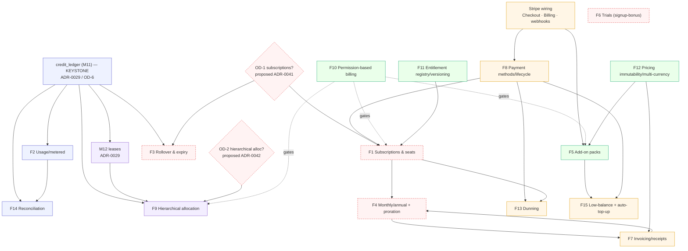
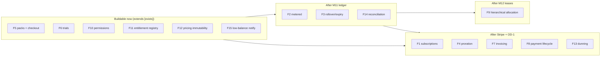

<!--
  TruePoint — Plans, Pricing, Credits, Subscriptions & Billing planning package
  Doc 04 — Enterprise Features (templated feature catalog + cross-feature gating)
  Brand = TruePoint (user-facing); code scope = @leadwolf/* (npm) — deliberately
  different, never reconciled. See 00-README §2.
-->

# 04 — Enterprise Features

> **Spine doc:** part of `docs/planning/plans-pricing-credits/` — see
> [`00-README.md`](./00-README.md) for scope, the locked decisions (LD-1/LD-2), the
> Open-Decisions register (OD-1…OD-8), the shared vocabulary (§5), and the gating
> legend (§8). This doc is the **feature catalog**: it takes the external evidence from
> [`01_Industry_Research.md`](./01_Industry_Research.md) and the as-built ground truth
> from [`02_Current_System_Audit.md`](./02_Current_System_Audit.md) and turns them into
> **15 templated feature specifications** — what each enterprise feature must do, how it
> behaves, what it touches in the schema/API/UI, who may use it, and where it breaks.
>
> **Anti-duplication contract.** This doc **never restates** the reveal-transaction SQL,
> the counter model, or the bulk-lease mechanics — those live in
> [`07-billing-credits.md`](../07-billing-credits.md) §3/§4/§5/§8/§11 and are *linked*.
> It **reuses** the gap IDs and `7.x`/`8.x` table/endpoint designs from the three
> platform-admin tab audits ([`03-billing.md`](../audits/platform-admin/03-billing.md),
> [`04-plans.md`](../audits/platform-admin/04-plans.md),
> [`05-pricing.md`](../audits/platform-admin/05-pricing.md)) rather than re-auditing
> those tabs. **Every** proposed table/job/endpoint carries a gating tag and **no**
> deferred infrastructure is presented as built.
>
> **ADR-0012 discipline (read first).** Every subscription / auto-renewal / credit-expiry
> / annual-lock element below is written as a **PROPOSED AMENDMENT** to be carried by a
> future **`ADR-0041`** — never as decided fact, never silently contradicting
> [`ADR-0012`](../decisions/ADR-0012-transparent-pricing-no-lock-in.md). The default
> across this package stays **month-to-month, no-auto-renew, no-expiry** (LD-1).

---

## 1. Executive Summary

This document specifies the **fifteen enterprise features** the commercial program needs,
each through a **uniform template** (§3.0) so that `05`/`06`/`07` can lift any one
subsection straight into a build brief. The features split into four bands by readiness:

| Band | Features | Gating reality |
|---|---|---|
| **Build on what exists** | F5 add-on credit packs, F6 trials (signup-bonus), F10 permission-based billing, F11 plan-entitlement registry/versioning, F12 pricing immutability/price-history | `[exists-partial]` / `[capability]` — extends shipped catalog + RBAC |
| **Needs the ledger keystone (M11)** | F2 usage-based/metered billing, F3 rollover & expiry, F9 hierarchical allocation, F14 reconciliation engine | `[M11-ledger]` (+ `[M12-lease]` for F9) — blocked on `credit_ledger` (`ADR-0029`) |
| **Needs Stripe + a decision** | F1 recurring subscriptions & seats, F4 monthly/annual + proration, F7 invoicing/receipts, F8 payment methods/subscription lifecycle, F13 dunning | `[Stripe]` `[decision-gated]` — **proposed `ADR-0041`** amendment |
| **Cross-cutting / mixed** | F15 low-balance notifications + auto-top-up | partly `[exists]`-adjacent, auto-top-up is `[Stripe]` |

The single load-bearing inheritance from [`02 §6`](./02_Current_System_Audit.md): **counter,
not ledger; packs, not subscriptions; admin-deep, web-thin.** Therefore the cross-feature
dependency graph (§7.1) shows the **`credit_ledger` (M11) as the keystone** that the
largest share of features sit on top of (`ADR-0029`; OD-6), with Stripe and the OD-1
subscription decision as the two other gates. The features are **not a flat backlog** — §7
makes the ordering explicit, and the edge-case appendix (§A) pins the failure modes
(mid-cycle proration, downgrade with over-allocated budgets, refund after partial spend,
currency rounding, trial-to-paid, churn-with-balance) that any sequencing must respect.

---

## 2. Objectives

| # | Objective | Serves |
|---|---|---|
| O1 | Define **one uniform feature template** and apply it to all 15 features, so every spec answers the same questions in the same order. | `05`/`06`/`07` build briefs |
| O2 | For each feature, tag **database impact** with `[exists]`/`[M11-ledger]`/`[M12-lease]`/`[Stripe]`/`[decision-gated]` so deferred infra is never presented as built. | 00-README §8 legend |
| O3 | Keep **admin (`apps/admin`) and web (`apps/web`) UI concerns in clearly separate labeled subsections** per feature. | OD-3; portal separation |
| O4 | **Reuse** the tab-audit gap IDs (04-plans G1-G9, 05-pricing G1-G9, 03-billing G5) and their proposed `7.x`/`8.x` tables/endpoints — extend, never re-audit. | anti-dup (00-README §9) |
| O5 | Frame **every** subscription/expiry/annual element as a **proposed `ADR-0041` amendment**, never decided fact. | LD-1; `ADR-0012` |
| O6 | Produce a **cross-feature dependency graph** (which features need M11/M12/Stripe/a decision) and an **edge-case & validation appendix**. | §7.1, §A |

---

## 3. Research Findings

> Evidence base is [`01`](./01_Industry_Research.md); current state is
> [`02`](./02_Current_System_Audit.md). This section states only the **per-feature
> findings that shape the spec** — it does not re-derive the competitor teardowns
> (`01 §3`) or the as-built inventory (`02 §3`).

### 3.0 The uniform feature template

Every feature in §6 uses **exactly these eleven fields, in this order**:

| Field | What it captures |
|---|---|
| **Summary & gating** | One-line intent + the headline gating tag(s). |
| **Functional requirements** | Enumerated `FR-n` the feature must satisfy. |
| **Business logic** | The rules/decisions/state machine behind the requirements. |
| **Database impact** | Tables touched/proposed, each tagged `[exists]`/`[M11-ledger]`/`[M12-lease]`/`[Stripe]`/`[decision-gated]`. |
| **API requirements** | Endpoints (existing + proposed), capability, audit action, idempotency. |
| **UI — admin (`apps/admin`)** | Internal-console surface. Omitted/"none" where not applicable. |
| **UI — web (`apps/web`)** | Customer surface. Omitted/"none" where not applicable. |
| **Permission model** | Staff capability and/or workspace role; JIT/peer-approval posture (OD-8). |
| **Dependencies** | Upstream features/infra/ADRs this needs. |
| **Edge cases** | The failure modes (cross-linked to appendix §A). |
| **Validation rules** | Server-side input/state guards (Zod bounds, CHECKs, invariants). |

### 3.1 Findings that cut across features

| # | Finding (from `01`/`02`) | Drives |
|---|---|---|
| RF1 | Per-type credit asymmetry (email≈1, phone 8-10×) is universal and **already built** (`revealCostFor`, `01 §4.1`). | F2 sits on existing cost model, not a new one |
| RF2 | **Charge-by-verified-result** (`ADR-0013`) already beats Seamless's pay-for-misses (`01 §3.5`). | F2 business logic cites the charge matrix, never restates it |
| RF3 | No-expiry is **stronger than every peer**; only Lusha-monthly/Clay/Nav avoid full expiry, with a 2× cap (`01 §4.4/§4.11`). | F3 keeps no-expiry default; cap'd rollover is the proven amendment |
| RF4 | Auto-renew + escalators are the **chief `ADR-0012` conflict** (`01 §4.18`, §10). | F1/F4 framed as opt-in, proposed-amendment only |
| RF5 | Pooled + per-seat hybrid allocation is real enterprise practice (ZoomInfo/Cognism, `01 §4.6/§4.19-21`). | F9 hierarchical model is validated, not speculative |
| RF6 | The **SI-vendor trial norm is a credit grant**, not a time-box (`01 §4.10`). | F6 = signup-bonus credits (OD-7) |
| RF7 | Immutable price + multi-currency + invoices are **finance/AP requirements** (`01 §4.15`, 05-pricing §4). | F7/F12 reuse 05-pricing 7.1/7.2/8.1 |
| RF8 | Dunning recovers involuntary churn (Smart-Retries ~57%, `01 §7`). | F13 reuses 03-billing G5 |
| RF9 | The **ledger is the keystone** for reconciliation/expiry/rollover/refund-of-spent/allocation (`02 §6`, `ADR-0029`). | §7.1 dependency graph |

---

## 4. Industry Best Practices

> Distilled from [`01 §4/§7/§9`](./01_Industry_Research.md) and the tab audits' §4
> best-practice sections — **cited, not re-derived**. Mapped to the features they govern.

| Best practice | Source | Governs |
|---|---|---|
| Metered per-type credits + charge only for verified results | `01 §4.1`, `ADR-0013` | F2 |
| Capped monthly rollover (~2×), annual resets, **pre-announced** | `01 §4.4` (Lusha/Clay/Nav) | F3, F4 |
| Opt-in (never default-on) auto-renew; no escalators | `01 §4.18`, §10 | F1, F4 |
| Auto-prorate on up/down/cancel/pause | `01 §7` (Stripe/Chargebee) | F4 |
| Self-serve top-up at published per-credit price | `01 §4.3/§4.8` | F5 |
| Trial as a free credit grant | `01 §4.10` | F6 |
| Hosted, line-itemed invoices/receipts; immutable price records | `01 §4.15`, 05-pricing §4/7.1 | F7, F12 |
| Idempotent money mutations on every write | `01 §7`, `02 §3.2` | F1-F8, F13 |
| Smart-Retries / soft-vs-hard decline dunning | `01 §7`, 03-billing G5 | F13 |
| Pooled + per-seat hierarchical allocation with admin caps | `01 §4.6/§4.19-21` | F9 |
| Role-gated purchase + optional approval (separation of duties) | `01 §4.22`, `ADR-0011` | F10 |
| Entitlement registry + immutable plan versioning + draft/publish | 04-plans 7.1/7.2/5.3 | F11 |
| Immutable price + price history + multi-currency + public read | 05-pricing 7.1/7.2/8.1 | F12 |
| Append-only, double-entry-style ledger; reconciliation invariant | `ADR-0029`, 28-audit G-BIL-1 | F14 |
| Proactive low-balance recovery + auto-top-up | `01 §4.16` (recovery) | F15 |

---

## 5. Current System Observations

> Full audit: [`02`](./02_Current_System_Audit.md). This section maps **each feature onto
> the current-state reality** so the spec starts from fact, not a blank page.

| Feature | What already exists (`02 §`) | What is missing (`02 §9.1`) |
|---|---|---|
| F1 recurring subs & seats | `seat_limit`/`workspace_limit` entitlements; plan override | `subscriptions` table; per-seat **price** object |
| F2 usage/metered | `revealCostFor`, `chargeFor` (ADR-0013), `contact_reveals` log | append-only `credit_ledger`; overage price object |
| F3 rollover & expiry | none — credits never expire (`ADR-0012`) | rollover/expiry sweep worker; ledger to track grant cohorts |
| F4 monthly/annual + proration | one-time packs only | `billing_cycles`, proration engine, plan-change endpoints |
| F5 add-on credit packs | `credit_packs` catalog + Stripe checkout + webhook grant | recurring packs; `POST /credits/checkout` (`[Stripe]`) |
| F6 trials | none | signup-bonus grant on tenant creation (OD-7) |
| F7 invoicing/receipts | webhook-idempotent purchases | `invoices`/`invoice_line_items`; hosted receipt |
| F8 payment methods/lifecycle | `stripe_customers` (id only) | `payment_methods`; subscription lifecycle |
| F9 hierarchical allocation | tenant pool (`reveal_credit_balance`) authoritative | `team_budgets`/`user_budgets`; M12 leases |
| F10 permission-based billing | admin caps + JIT (`ADR-0011`); render-gated controls | web workspace-admin gate; peer-approval enforcement |
| F11 entitlement registry/versioning | free-text `features` jsonb; binary `active` | `plan_features`, `plan_template_versions`, draft/publish |
| F12 pricing immutability/multi-currency | mutable `credit_packs` row; USD-implicit | price-history table; `currency`; public read endpoint |
| F13 dunning | none | dunning/Smart-Retries worker |
| F14 reconciliation | nothing to reconcile against (G-BIL-1) | reconciliation worker on the ledger |
| F15 low-balance notify + auto-top-up | low-balance **admin read**; `CreditPill` amber<20 | notifier worker; auto-top-up rule store |

---

## 6. Recommendations — the 15 feature specifications

> Each subsection is a complete, template-conformant spec. Tags per §3.0. **Admin and web
> UI are separately labeled.** Subscription/expiry/annual elements read as **proposed
> `ADR-0041`** amendments throughout.

### F1 — Recurring subscriptions & seat licensing `[decision-gated]` `[Stripe]`

> **PROPOSED AMENDMENT (ADR-0041), NOT DECIDED.** Per **LD-1/OD-1**, recurring
> subscriptions are documented as a hybrid where **month-to-month / no-auto-renew stays
> the DEFAULT**; subscriptions are **opt-in for enterprise, never defaulted-on**. Nothing
> here overrides [`ADR-0012`](../decisions/ADR-0012-transparent-pricing-no-lock-in.md).

- **Summary & gating.** A `subscriptions` object that grants credits + entitlements on a
  recurring cadence, plus a **per-seat price** so seats become a charge, not just a cap.
  `[decision-gated]` (OD-1 → `ADR-0041`) `[Stripe]`.
- **Functional requirements.**
  - FR1: A tenant MAY (opt-in) hold a subscription with `term` ∈ {monthly, annual}, a
    `plan_template` reference, a `seat_count`, and an explicit `auto_renew` flag that
    **defaults to `false`** (the `ADR-0012` posture).
  - FR2: On each cycle boundary, the subscription drives a recurring credit grant
    (consuming `plan_templates.monthly_credit_grant`, today a **dormant** column, `02 §3.1.8`)
    and re-asserts entitlements.
  - FR3: Per-seat charge = `seat_count × per_seat_price`; `seat_count` cannot exceed the
    plan's `seat_limit` without a plan change.
  - FR4: Cancellation is **self-serve and immediate-at-period-end** (no 60-day trap, `01 §3.5`);
    credits already granted **do not expire on cancel** unless F3's pre-announced policy is in force.
  - FR5: All money mutations are **idempotent** (Idempotency-Key + Stripe event dedupe, `02 §3.2`).
- **Business logic.** A subscription is a *schedule generator*: it emits cycle events that a
  **monthly-grant worker** (`[M11-ledger]` `[decision-gated]`, dormant today, `02 §3.3`) turns
  into ledger grant rows. The grant is **idempotent per (subscription_id, cycle_index)**.
  Auto-renew, if opt-in `true`, schedules the next cycle; if `false`, the subscription lapses
  to the **default month-to-month/packs posture** at term end with a renewal reminder, never a
  silent re-charge.
- **Database impact.**
  - `subscriptions` — **proposed** `[decision-gated]` `[Stripe]`: `tenant_id`, `plan_key`,
    `term`, `seat_count`, `auto_renew bool DEFAULT false`, `status` (trialing/active/past_due/
    canceled), `current_period_start/end`, `stripe_subscription_id`. (`02 §9.1`.)
  - `billing_cycles` — **proposed** `[decision-gated]`: per-cycle grant record (F4).
  - Per-seat price — folds into the price catalog (F12); **proposed** `[Stripe]`.
  - `plan_templates.monthly_credit_grant` — `[exists]` but **dormant** (nothing consumes it).
- **API requirements.**

  | Method · Path | Cap / Role | Audit action | Idem | Note |
  |---|---|---|---|---|
  | `POST /api/v1/subscriptions` (web self-serve) | workspace-admin (OD-8) | `subscription.create` (proposed) | Yes | opt-in; `auto_renew` explicit |
  | `POST /api/v1/subscriptions/:id/cancel` | workspace-admin | `subscription.cancel` | Yes | period-end, no trap |
  | `POST /admin/tenants/:id/subscription` | `tenants:plan` + JIT | `subscription.override` | Yes | admin enterprise setup |

- **UI — admin (`apps/admin`).** On `TenantDetailPage` (`02 §3.4`): a **Subscription** panel
  (term, seats, next-cycle, auto-renew state, history) and an **Apply subscription** action
  reusing the JIT-elevation pattern of *Adjust credits*. Capability-render-gated.
- **UI — web (`apps/web`).** In the OD-3 **billing hub** (`/settings/billing`): a
  **Subscription** card showing term/seats/renewal with explicit **"auto-renew is OFF unless
  you turn it on"** copy, self-serve **Cancel** (period-end), and **Upgrade/Downgrade** (F4).
  Gated to workspace-admin.
- **Permission model.** Admin: `tenants:plan` + JIT elevation (`ADR-0011`). Web:
  **workspace-admin-only** (OD-8); peer-approval **spec-ed, not enforced v1**.
- **Dependencies.** OD-1 decision; Stripe (F8); monthly-grant worker; ledger (F14) for grant
  rows; F4 for term/proration; F12 for per-seat price.
- **Edge cases.** §A-5 trial→paid; §A-6 churn-with-balance; downgrade with over-allocated seats
  (§A-2); auto-renew toggled mid-cycle.
- **Validation rules.** `auto_renew` defaults `false`; `seat_count ≤ plan.seat_limit`;
  `term ∈ {monthly, annual}`; cancel is idempotent; no auto-renew without explicit opt-in
  recorded in `audit_log`.

### F2 — Usage-based / metered billing on credits `[M11-ledger]`

- **Summary & gating.** Meter spend per reveal/enrichment at **charge-by-verified-result**
  (`ADR-0013`) and, optionally, bill **overage** above an included allotment. The metering
  engine is `[exists]`; durable per-event accounting is `[M11-ledger]`.
- **Functional requirements.**
  - FR1: Each chargeable event debits credits by `revealCostFor(type)` (`02 §3.3`) — **cited,
    not restated** (`07 §3/§4`).
  - FR2: Charge is **0 for unverified results** (`invalid`/`catch_all`/`unknown`) and full for
    `valid`, per `chargeFor` (`ADR-0013`); `risky` is configurable.
  - FR3: A **credit-back** on bounce reverses a prior debit (`ADR-0013`) — requires a ledger to
    record the reversing entry (the counter alone cannot, `02 §5`).
  - FR4: Overage (proposed): spend beyond an included monthly allotment is billed at a published
    per-credit price (or blocked, per plan policy).
- **Business logic.** The reveal transaction (claim + lock + decrement) is owned by `07 §3` and
  **not restated**. F2 adds only the **ledger-entry** layer: every debit/credit-back/overage is
  an append-only row so `balance == SUM(delta)` becomes auditable (closes G-BIL-1, F14). Overage
  policy is a plan attribute (block vs bill-through).
- **Database impact.**
  - `contact_reveals` — `[exists]`: the debit-side event log (`02 §3.1.2`).
  - `credit_ledger` — **proposed** `[M11-ledger]` (`ADR-0029`): append-only grant/spend/refund/
    credit-back entries; the substrate for FR3/FR4 and reconciliation.
  - Overage price — folds into F12 price catalog; **proposed** `[Stripe]` if billed.
- **API requirements.** No new customer endpoint for the debit (it is the reveal path, `07`).
  Proposed: `GET /api/v1/credits/ledger` (`[M11-ledger]`) for per-event history (F7/web history).
  Admin: economics reads already aggregate consumption (`/admin/billing/economics`, `[exists]`).
- **UI — admin (`apps/admin`).** Economics page already shows credits consumed / cost-per-reveal
  / margin (`02 §3.4`). Add (on ledger): a per-tenant **ledger drill-down** with credit-back rows.
- **UI — web (`apps/web`).** `UsageTable` (`02 §3.5`) already lists reveals; on ledger, extend to
  show **credit-back** and **overage** rows and the "charged only for verified data" reassurance
  (already shown, `02 §3.5`).
- **Permission model.** Customer reads workspace-scoped (RLS); admin economics `billing:read`.
- **Dependencies.** `credit_ledger` (F14/M11); `ADR-0013`; `ADR-0038` (enrichment metering,
  **out of scope** per 00-README §1.2 — referenced only).
- **Edge cases.** §A-3 refund/credit-back after partial spend; double-debit on retry (idempotent
  claim, `07 §4`); overage at exactly the allotment boundary.
- **Validation rules.** `credits_consumed ≥ 0` (CHECK, `02 §3.1.2`); credit-back cannot exceed the
  original debit; ledger entries are append-only (no UPDATE/DELETE).

### F3 — Credit rollover & expiry `[decision-gated]` `[M11-ledger]`

> **OD-4. DEFAULT = NO EXPIRY** (`ADR-0012`). Any rollover-with-cap or expiry is a **proposed
> `ADR-0041` amendment**, **announced in advance**, and only relevant **if subscriptions land**.

- **Summary & gating.** Keep **no-expiry as the default**; *if* recurring grants land, monthly
  grants **roll over with a cap** (Lusha/Clay/Nav precedent, `01 §4.4`) and annual grants reset
  at term — pre-announced. `[decision-gated]` (OD-4) `[M11-ledger]`.
- **Functional requirements.**
  - FR1 (default): credits **never expire** (`ADR-0012`); top-up packs are permanent.
  - FR2 (proposed, subs only): a monthly recurring grant accrues up to a **cap (e.g. 2× the
    monthly grant)**; excess beyond the cap is forfeited at next grant — *announced in advance*.
  - FR3 (proposed, annual): annual grants **reset at term**; no rollover (Lusha-annual precedent).
  - FR4: spend draws **oldest-first (FIFO by grant cohort)** so capped/expiring credits burn before
    permanent ones.
- **Business logic.** Rollover/expiry is **impossible on the bare counter** — it requires the
  ledger's grant **cohorts** (each grant row carries an `expires_at`/`cap_cohort`). A **rollover/
  expiry sweep worker** (`[M11-ledger]` `[decision-gated]`, does not exist, `02 §3.3`) runs at
  cycle boundaries, computes carry-over against the cap, and writes a **forfeiture ledger entry**
  for the excess. Permanent (pack/top-up) credits never carry an `expires_at`.
- **Database impact.**
  - `credit_ledger` — **proposed** `[M11-ledger]`: grant rows gain `expires_at` (nullable =
    permanent) and a `cohort` tag for FIFO.
  - rollover/expiry sweep worker — **proposed** `[M11-ledger]` `[decision-gated]`.
- **API requirements.** Admin: surface a tenant's **cohort breakdown** (permanent vs expiring) via
  the ledger read (F2). No customer mutation; policy is plan-driven.
- **UI — admin (`apps/admin`).** On `TenantDetailPage`: a **credit cohort** view (permanent /
  rolling / expiring-soon) and the active rollover policy. Read-only unless plan-driven.
- **UI — web (`apps/web`).** In the billing hub: a **"credits never expire"** badge by default; *if*
  a subscription with rollover is active, a clear **"X credits roll over (cap Y); annual grant
  resets on DATE"** disclosure — pre-announced, no surprise expiry.
- **Permission model.** Policy set by plan (admin `pricing:manage`/`plans:manage`); customer read-only.
- **Dependencies.** F1 (subscriptions) — rollover is **only** meaningful with recurring grants;
  `credit_ledger` (F14/M11); `ADR-0012` (default); OD-4.
- **Edge cases.** §A-2 downgrade with over-allocated budgets; forfeiture at the cap boundary;
  FIFO ordering when permanent + expiring credits coexist; policy change mid-cycle (must be
  pre-announced).
- **Validation rules.** `expires_at` nullable (null = permanent, the default); cap ≥ monthly grant;
  any expiry policy requires a recorded **advance announcement** (audit attestation) per `ADR-0012`.

### F4 — Monthly vs annual + renewal + upgrade/downgrade with proration `[decision-gated]` `[Stripe]`

> **PROPOSED AMENDMENT (ADR-0041).** Renewal is **opt-in, no escalators** (the chief `ADR-0012`
> conflict, `01 §4.18`). Month-to-month stays the default.

- **Summary & gating.** Term choice (monthly/annual), **opt-in** renewal, and self-serve
  upgrade/downgrade with **automatic proration**. `[decision-gated]` (OD-1) `[Stripe]`.
- **Functional requirements.**
  - FR1: A subscription offers **both** monthly and annual (annual discounted), neither forced
    (`01 §4.5`).
  - FR2: Renewal is **opt-in**; reminders are sent; **no auto-renew default, no escalators**.
  - FR3: Upgrade/downgrade mid-cycle **prorates** the charge (Stripe/Chargebee norm, `01 §7`).
  - FR4: Downgrade that would strand over-allocated team budgets (F9) is **blocked or warned**
    with an explicit reconcile step (§A-2).
  - FR5: Monthly plans may top up immediately; annual top-up behavior is plan policy
    (RocketReach "monthly can, annual must upgrade" asymmetry, `01 §3.6` — a *choice*, not a rule).
- **Business logic.** Proration delegates to **Stripe** (the immutable price + invoice-item engine,
  `01 §7`); TruePoint records the resulting credit/charge as ledger + invoice rows. A **downgrade**
  recomputes entitlements (seats, workspace_limit, budgets) and runs the **over-allocation guard**
  (§A-2) before applying. Renewal reminder is a worker (`[Stripe]`), never an auto-charge unless
  opt-in.
- **Database impact.**
  - `subscriptions` + `billing_cycles` — **proposed** `[decision-gated]` `[Stripe]` (F1).
  - `invoices`/`invoice_line_items` — **proposed** `[Stripe]` `[flag]` (F7) — proration line items.
  - renewal/dunning worker — **proposed** `[Stripe]` `[decision-gated]` (`02 §9.1`).
- **API requirements.**

  | Method · Path | Cap / Role | Audit | Idem | Note |
  |---|---|---|---|---|
  | `POST /api/v1/subscriptions/:id/change` (up/down) | workspace-admin | `subscription.change` | Yes | prorates via Stripe |
  | `POST /admin/tenants/:id/subscription/change` | `tenants:plan`+JIT | `subscription.change` | Yes | admin path |

- **UI — admin (`apps/admin`).** On `TenantDetailPage`: **Change term/plan** action with a
  **proration preview** (credit/charge) before commit; over-allocation guard surfaced inline.
- **UI — web (`apps/web`).** Billing hub: **Upgrade / Downgrade** flow with a **proration preview**
  ("you'll be charged/credited $X today"), monthly↔annual toggle showing the annual discount, and
  the downgrade over-allocation warning.
- **Permission model.** Admin `tenants:plan` + JIT; web **workspace-admin** (OD-8).
- **Dependencies.** F1 (subscriptions), F7 (invoices), F9 (over-allocation guard), Stripe (F8),
  OD-1.
- **Edge cases.** §A-1 mid-cycle proration math; §A-2 downgrade with over-allocated budgets;
  §A-4 currency rounding on prorated amounts; annual→monthly mid-term.
- **Validation rules.** No renewal without opt-in; proration uses Stripe's authoritative amount;
  downgrade blocked until budgets fit; `term` transition recorded in `audit_log`.

### F5 — Add-on credit packs `[exists]` `[Stripe]`

- **Summary & gating.** Extend the **shipped** `credit_packs` catalog (`02 §3.1.8`, 05-pricing) with
  recurring/auto-replenish options and the missing `POST /credits/checkout`. Core is `[exists]`;
  recurring + checkout are `[Stripe]`.
- **Functional requirements.**
  - FR1: One-time top-up via `credit_packs` + Stripe checkout + webhook grant — **the grant path
    already exists** (`POST /billing/webhook` is the only grant path, `02 §3.2`).
  - FR2: `POST /credits/checkout` (`[Stripe]`, **not built**, `02 §3.2`) returns a Stripe Checkout
    URL; today the web button stubs to "coming soon".
  - FR3 (proposed): **recurring/auto-replenish** pack (buy N credits when balance < threshold) —
    overlaps F15 auto-top-up.
  - FR4: pack purchase is **idempotent** on `stripe_event_id` (`02 §3.1.3`).
- **Business logic.** A pack is a SKU in `credit_packs` (key/credits/price_cents/active/sort_order).
  Purchase → Stripe Checkout → webhook → idempotent `grantFromStripe` (`02 §3.3`) → ledger grant
  (on M11) or counter increment (today). Retiring a pack = `active=false` (kept for history, `02 §3.1.8`).
- **Database impact.**
  - `credit_packs` — `[exists]`: catalog.
  - `purchases` — `[exists]` `[Stripe]`: idempotent top-up record (`02 §3.1.3`).
  - `POST /credits/checkout` — **proposed endpoint** `[Stripe]`.
  - auto-replenish rule store — **proposed** `[Stripe]` (shared with F15).
- **API requirements.** `GET /admin/pricing/credit-packs` + `PUT` + `:key/active` — **all
  `[exists]`** (`pricing:manage`, `02 §3.2.3`). New: `POST /credits/checkout` (`[Stripe]`),
  public pricing read (F12).
- **UI — admin (`apps/admin`).** `PricingPage` credit-pack CRUD — **already built** (`02 §3.4`).
  Add: in-use guard (05-pricing G9) before retire/edit.
- **UI — web (`apps/web`).** Balance card **Top up** button — **built but stubbed** (`02 §3.5`);
  wiring `POST /credits/checkout` makes it real. Add pack picker + auto-replenish opt-in (F15).
- **Permission model.** Admin `pricing:manage`; web purchase **workspace-admin** (OD-8).
- **Dependencies.** Stripe (F8); F12 (public read, in-use guard); F15 (auto-replenish).
- **Edge cases.** Retiring a pack mid-checkout (05-pricing G9); duplicate webhook (idempotent, FR4);
  §A-4 currency rounding once F12 multi-currency lands.
- **Validation rules.** `credits > 0`, `price_cents ≥ 0` (Zod + CHECK); retired packs not
  checkout-able; checkout amount matches catalog at purchase time.

### F6 — Trials `[decision-gated]`

> **OD-7. MVP trial = signup-bonus credits** (the SI-vendor norm, `01 §4.10`). Full time-boxed
> trials are **deferred**.

- **Summary & gating.** Grant a fixed **signup-bonus** of credits on tenant creation as the MVP
  trial; defer time-boxed trials. `[decision-gated]` (OD-7).
- **Functional requirements.**
  - FR1: On tenant creation, grant a configurable signup-bonus (`monthly_credit_grant`-style
    config or a dedicated `trial_bonus_credits` plan attribute).
  - FR2: The grant is **idempotent per tenant** (granted exactly once).
  - FR3 (deferred): a time-boxed trial (`trials` table, `02 §9.1`) with an end date and
    convert-to-paid path.
- **Business logic.** Signup-bonus = a one-time grant through the **same idempotent grant path** as
  a webhook (system path, no tenant GUC, `02 §3.3`). No expiry on the bonus (consistent with
  `ADR-0012`). Time-boxed trial (deferred) would need a `trials` table + an expiry worker.
- **Database impact.**
  - `plan_templates` — `[exists]`: extend with `trial_bonus_credits` (proposed column,
    hand-authored migration).
  - `trials` — **proposed** `[decision-gated]` (deferred; `02 §9.1`).
  - signup-bonus grant — uses existing grant path; ledger row on M11.
- **API requirements.** No new customer endpoint (grant fires on signup). Admin: bonus amount is a
  plan-template attribute via existing `PUT /admin/pricing/plan-templates` (`[exists]`).
- **UI — admin (`apps/admin`).** `PlansPage`: a **signup-bonus credits** field on the plan-template
  editor (alongside `monthly_credit_grant`).
- **UI — web (`apps/web`).** A one-time **"welcome credits"** banner/toast on first login; visible
  in the balance card.
- **Permission model.** Admin `pricing:manage`/`plans:manage`; grant is system-path (no user
  action).
- **Dependencies.** Tenant-creation flow (auth); ledger (F14) for the grant row; OD-7.
- **Edge cases.** §A-5 trial→paid conversion; double-signup (idempotent grant); bonus abuse
  (one-per-tenant; account_holds for fraud, `02 §3.1.8`).
- **Validation rules.** Bonus granted **exactly once** per tenant (idempotency key =
  `signup-bonus:{tenant_id}`); `trial_bonus_credits ≥ 0`.

### F7 — Invoicing & receipts `[Stripe]` `[flag]`

> **OD-5. Spec now, build behind Stripe + a flag. USD authoritative** until international GTM.

- **Summary & gating.** Hosted, line-itemed **invoices/receipts** for every charge (top-up,
  subscription, proration). `[Stripe]` `[flag]` (OD-5).
- **Functional requirements.**
  - FR1: Every money event (top-up, subscription cycle, proration, refund) produces an
    **invoice/receipt** with line items.
  - FR2: Receipts are **hosted** (Stripe) and downloadable (PDF/HTML).
  - FR3: Line items carry credits, price, tax (if any), currency (USD authoritative, OD-5).
  - FR4: Admin can list/export a tenant's invoices for finance/AP.
- **Business logic.** Invoicing delegates to **Stripe Invoices** (`01 §4.15`); TruePoint mirrors
  the invoice id + summary into `invoices`/`invoice_line_items` for in-app display and finance
  export. Refunds (F-existing) generate a credit-note line. **No invoice is fabricated** without a
  Stripe source event.
- **Database impact.**
  - `invoices` / `invoice_line_items` — **proposed** `[Stripe]` `[flag]` (`02 §9.1`).
  - `purchases` — `[exists]` `[Stripe]`: links to the invoice.
  - `currency` axis — **proposed** `[decision-gated]` (USD authoritative, OD-5; F12).
- **API requirements.**

  | Method · Path | Cap / Role | Audit | Note |
  |---|---|---|---|
  | `GET /api/v1/invoices` (web) | workspace-admin | — | tenant's own invoices |
  | `GET /api/v1/invoices/:id` (web) | workspace-admin | — | hosted receipt link |
  | `GET /admin/tenants/:id/invoices` | `billing:read` | `admin.list_invoices` | finance/AP |

- **UI — admin (`apps/admin`).** On `TenantDetailPage`: an **Invoices** list (alongside
  `TenantPurchases`, `02 §3.4`) with export to CSV (reusing the formula-injection-guarded `csvField`,
  `02 §3.2.2`).
- **UI — web (`apps/web`).** Billing hub **Invoices** tab (OD-3): list + download; "Receipts in USD"
  note until multi-currency GTM.
- **Permission model.** Admin `billing:read`; web **workspace-admin** (OD-8). PII: invoices contain
  billing identity — RLS tenant-scoped, security sign-off on web exposure.
- **Dependencies.** Stripe (F8); F12 (currency); F4 (proration line items); feature flag.
- **Edge cases.** §A-4 currency rounding; refund credit-note after partial spend (§A-3); invoice
  for a $0 verified-free reveal (no invoice — not a charge).
- **Validation rules.** Invoice mirrors a real Stripe event; line-item sum == invoice total;
  currency == USD until OD-5 flips; no invoice without a charge.

### F8 — Payment methods & subscription lifecycle `[Stripe]`

> See [`07 §4`](../07-billing-credits.md) for the **Stripe top-up mechanics** — **cited, not
> restated**.

- **Summary & gating.** Store payment methods and drive the full subscription **lifecycle**
  (trialing → active → past_due → canceled, pause/resume). `[Stripe]` (+ `[decision-gated]` for the
  subscription parts via OD-1).
- **Functional requirements.**
  - FR1: A tenant can add/update/remove a **payment method** via Stripe (no raw card data touches
    TruePoint — PCI scope stays in Stripe).
  - FR2: Subscription lifecycle states are mirrored from Stripe webhooks (the **only** trusted
    source, `02 §3.2`).
  - FR3 (proposed): **pause/resume** a subscription (Stripe, `01 §4.17`).
  - FR4: A failed charge moves the subscription to `past_due` and triggers dunning (F13).
- **Business logic.** Stripe is the **system of record** for payment methods and subscription state;
  TruePoint stores only references (`stripe_customer_id` exists, `02 §3.1.4`; `payment_methods` and
  `stripe_subscription_id` are proposed). All state transitions arrive via signature-verified
  webhooks (HMAC-SHA256, 300 s skew, `02 §3.3`) — **cited, not restated** (`07 §4`).
- **Database impact.**
  - `stripe_customers` — `[exists]` `[Stripe]`: id only (`02 §3.1.4`).
  - `payment_methods` — **proposed** `[Stripe]` (`02 §9.1`): brand/last4/exp, default flag; **no raw
    PAN**.
  - `subscriptions.status` — **proposed** `[decision-gated]` `[Stripe]` (F1).
- **API requirements.** `POST /billing/webhook` — **`[exists]`**, extended to handle subscription +
  payment-method events (`02 §3.2`). New: `POST /api/v1/billing/payment-methods` (web, Stripe
  SetupIntent), `POST /api/v1/subscriptions/:id/{pause,resume}` (`[Stripe]` `[decision-gated]`).
- **UI — admin (`apps/admin`).** On `TenantDetailPage`: lifecycle **status badge** (active/past_due/
  canceled) and a **read** of the default payment method (brand/last4 only). No card entry in admin.
- **UI — web (`apps/web`).** Billing hub **Payment methods** card (Stripe Elements/portal), default
  selection, and lifecycle status. Workspace-admin only.
- **Permission model.** Web **workspace-admin** (OD-8); admin reads `billing:read`. **Security:** raw
  card data never touches TruePoint; only Stripe references stored; webhook signature is the trust
  boundary.
- **Dependencies.** Stripe; F1/F4 (subscriptions); F13 (dunning on past_due).
- **Edge cases.** Card declined → past_due → dunning (F13); §A-6 churn-with-balance on cancel;
  webhook replay (idempotent, `02 §3.2`); payment-method removal while subscription active (block).
- **Validation rules.** Only Stripe references persisted (no PAN/CVV); webhook signature verified;
  default payment method required while a subscription is active.

### F9 — Hierarchical org / team / user credit allocation `[M12-lease]` `[decision-gated]`

> **LD-2 / OD-2.** The **tenant pool stays authoritative**; per-team/workspace budgets and per-user
> **soft** limits extend it. Built on **ADR-0029 M12 leases**; proposed **`ADR-0042`**. Cites
> [`ADR-0022`](../decisions/ADR-0022-departments-teams.md) (team segmentation) and `07 §5` (leases —
> **not restated**).

- **Summary & gating.** A three-level allocation hierarchy: **org pool → team/workspace budget →
  per-user soft limit**, phased. `[M12-lease]` `[decision-gated]` (OD-2).
- **Functional requirements.**
  - FR1: The **tenant `reveal_credit_balance` pool stays authoritative** (`02 §3.1.1`) — budgets
    subdivide it, they do not replace it.
  - FR2: An admin/workspace-admin can set a **per-team/per-workspace budget** (a cap on that team's
    draw from the pool).
  - FR3: A **per-user soft limit** **warns** (does not hard-block) when a user nears their cap
    (OD-2: soft, not hard).
  - FR4: A spend checks, in order: user soft-limit (warn) → team budget (enforce) → tenant pool
    (enforce, `CHECK ≥ 0`).
  - FR5: Reallocating/lowering a budget below current spend triggers the over-allocation flow (§A-2).
- **Business logic.** Budgets are **leases** against the pool (`ADR-0029` M12; `07 §5` — **not
  restated**): a team budget reserves a slice; per-user soft limits are advisory counters on the
  ledger. The pool remains the hard floor (`CHECK ≥ 0`). A **lease-reaper worker** (`[M12-lease]`,
  does not exist, `02 §3.3`) releases stale reservations.
- **Database impact.**
  - `team_budgets` / `user_budgets` — **proposed** `[M12-lease]` `[decision-gated]` (`02 §9.1`):
    scope (team/workspace/user), cap, period, soft/hard flag.
  - `credit_ledger` — **proposed** `[M11-ledger]`: per-scope debit attribution.
  - lease-reaper worker — **proposed** `[M12-lease]`.
- **API requirements.**

  | Method · Path | Cap / Role | Audit | Idem | Note |
  |---|---|---|---|---|
  | `PUT /api/v1/budgets/team/:id` (web) | workspace-admin | `budget.set` | Yes | per-team cap |
  | `PUT /api/v1/budgets/user/:id` (web) | workspace-admin | `budget.set` | Yes | soft limit |
  | `GET /admin/tenants/:id/budgets` | `billing:read` | `admin.list_budgets` | — | oversight |

- **UI — admin (`apps/admin`).** On `TenantDetailPage`: a **budget tree** (org → teams → users)
  showing caps vs spend; read/oversight (writes are customer-side per OD-8).
- **UI — web (`apps/web`).** **Allocation** surface in the billing hub: set team budgets, per-user
  soft limits, a **pool → team → user** allocation tree with spend bars (`Progress`), and the
  over-allocation reconcile flow. Workspace-admin only.
- **Permission model.** Web **workspace-admin** sets budgets (OD-8); admin `billing:read` oversight;
  per-user soft limit is **advisory** (warns the user, does not block — OD-2).
- **Dependencies.** `credit_ledger` (F14/M11); M12 leases (`ADR-0029`); `ADR-0022` (teams);
  `ADR-0030` (org roles); OD-2 / proposed `ADR-0042`.
- **Edge cases.** §A-2 downgrade/lower-budget below current spend; pool drained while a team budget
  still shows headroom (pool floor wins); stale lease (reaper); user soft-limit exceeded (warn,
  continue).
- **Validation rules.** Σ(team budgets) MAY exceed pool only if budgets are **soft**; hard budgets
  must sum ≤ pool; user limit is soft (warn-only); pool `CHECK ≥ 0` is the inviolable floor.

### F10 — Permission-based billing `[capability]` `[decision-gated]`

> **OD-8.** Billing-permission matrix = **admin staff capabilities + JIT elevation** (`ADR-0011`)
> and **web workspace-admin-only** purchase/allocate. **Peer-approval spec-ed, not enforced v1.**

- **Summary & gating.** A matrix governing **who can do which money action** across both portals.
  `[capability]` (`[exists]` for admin) + `[decision-gated]` for the web gate + peer-approval.
- **Functional requirements.**
  - FR1: Admin money writes require a **staff capability** (`tenants:credits`, `tenants:plan`,
    `pricing:manage`, `billing:read`) — **already enforced** (`02 §3.2`).
  - FR2: High-risk admin writes (credit grant/adjust, suspend) require **JIT elevation** consumed
    in-tx (`02 §3.2.4`) — **already built**.
  - FR3: Web purchase/allocate is **workspace-admin-only** (OD-8) — **proposed gate**.
  - FR4 (deferred): **peer-approval** on high-risk money paths (reuse `jit_elevations`/
    `approved_by_user_id`, 04-plans Phase 4) — **spec-ed, not enforced v1**.
- **Business logic.** Two enforcement layers: **staff capabilities + JIT** on the admin path
  (server-enforced, render-gated in UI via `useStaffMe().canMaybe()`, `02 §3.4`) and **workspace
  roles** on the web path. Peer-approval is documented as a future control, not switched on.
- **Database impact.** No new table for v1 (capabilities + JIT exist, `ADR-0011`). Peer-approval
  (deferred) would reuse the `jit_elevations` substrate. `[capability]`.
- **API requirements.** All existing money endpoints already carry capability + (where relevant)
  JIT (`02 §3.2`). New web mutations (F1/F4/F5/F9) carry the **workspace-admin** gate.
- **UI — admin (`apps/admin`).** Controls **render-gated** by `canMaybe(capability)` — already the
  pattern (`02 §3.4`); a `read_only` staffer sees no actionable money buttons (04-plans G2 fix).
- **UI — web (`apps/web`).** Purchase/allocate/subscription controls visible **only to
  workspace-admin**; members see read-only balance/usage. A "you need workspace-admin to buy
  credits" empty-state for members.
- **Permission model.** This **is** the permission model: admin = staff capability + JIT (`ADR-0011`,
  `ADR-0032` audit vocabulary); web = workspace role (`ADR-0030`); peer-approval deferred (OD-8).
- **Dependencies.** `ADR-0011`, `ADR-0030`, `ADR-0032`; F1/F4/F5/F9 (the gated actions).
- **Edge cases.** Member attempts purchase (403 + clear UX); JIT elevation expires mid-action (re-mint);
  capability removed mid-session (server rejects, UI may lag — server is the boundary).
- **Validation rules.** Server is the boundary (UI render-gate is UX, not security — design defers to
  security); every gated write audited (`ADR-0032`); JIT consumed in-tx (no replay).

### F11 — Plan entitlement registry + versioning + draft/publish `[exists-partial]`

> **Reuses 04-plans 7.1/7.2/5.3 verbatim** (gap IDs G1/G4/G5/G6). Extends, does not re-audit.

- **Summary & gating.** Replace free-text `features` with an **entitlement registry**, add
  **immutable plan versioning**, and a **draft → offered → retired** lifecycle. `[exists-partial]`
  (catalog exists; registry/versions/lifecycle proposed).
- **Functional requirements.**
  - FR1 (04-plans G1): feature keys validated against a **registry** (`plan_features`), not
    free-text — typos silently grant nothing today.
  - FR2 (04-plans G4/G5): every plan-template upsert writes an **immutable version snapshot**
    (`plan_template_versions`) — enables grandfathering + history.
  - FR3 (04-plans G6): a **draft/publish lifecycle** (`status` ∈ draft|offered|retired replaces bare
    `active`); only `offered` plans are selectable in the tenant override picker.
  - FR4 (04-plans G3): an **entitlement preview** ("what does this plan grant").
- **Business logic.** On `upsert`, insert a **new immutable version row in the same tx** (04-plans
  6.2/7.2) and enrich the `plan_template.set` audit with the full `{before, after}` diff. Publishing
  is a new audited action (`plan_template.publish`); already-applied tenants keep their **snapshot at
  apply time** (grandfathering) so a live edit never silently changes existing overrides (04-plans §10).
- **Database impact.**
  - `plan_templates` — `[exists]`: `active` → `status` (draft|offered|retired) migration (04-plans 5.3).
  - `plan_features` — **proposed** `[exists-partial]` (04-plans 7.1): entitlement registry.
  - `plan_template_versions` — **proposed** `[exists-partial]` (04-plans 7.2): append-only snapshots.
- **API requirements.**

  | Method · Path | Cap | Audit | Note |
  |---|---|---|---|
  | `GET /admin/pricing/plan-features` | `pricing:manage` | `admin.list_plan_features` | registry read (04-plans 8.1) |
  | `GET /admin/pricing/plan-templates/:key/versions` | `pricing:manage` | `admin.list_plan_template_versions` | history (04-plans 8.2) |
  | `POST /admin/pricing/plan-templates/:key/publish` | `pricing:manage` | `plan_template.publish` | lifecycle (04-plans 5.3) |
  | `PUT /admin/pricing/plan-templates` | `pricing:manage` | `plan_template.set` | `[exists]`, writes a version in-tx |

- **UI — admin (`apps/admin`).** `PlansPage`: **feature multi-select** from the registry (04-plans
  12.2, fixes G1), an **entitlement preview** panel, a **tri-state status badge** (draft/offered/
  retired), and a **per-plan version history** view. The tenant override picker filters to `offered`.
- **UI — web (`apps/web`).** None directly (plans are internal); the public pricing page (F12) reads
  only `offered` plans/packs.
- **Permission model.** `pricing:manage` (and/or `plans:manage`); render-gated (04-plans G2 fix).
- **Dependencies.** 04-plans Phase 3; `platformAuditCoverage` PENDING→WRITTEN for the new
  `plan_template.publish` enum (`ADR-0032`); hand-authored migration (no `drizzle-kit generate`).
- **Edge cases.** Editing a live plan (grandfathering via snapshot, 04-plans §10); a draft plan in
  the override picker (excluded); unknown feature key (rejected server-side, FR1).
- **Validation rules.** Feature keys validated against `plan_features` server-side (04-plans 6.1);
  version row written **per upsert** (itest, 04-plans Phase 3); drafts not offerable.

### F12 — Pricing immutability + price history + multi-currency + public read `[exists-partial]` `[Stripe]`

> **Reuses 05-pricing 7.1/7.2/8.1 verbatim** (gap IDs G1/G2/G4/G6). **USD authoritative** (OD-5).

- **Summary & gating.** Make a price an **immutable, versioned, multi-currency** record with a
  **public read** surface. `[exists-partial]` (catalog exists, mutable) `[Stripe]` (immutability
  model) `[decision-gated]` (multi-currency, OD-5).
- **Functional requirements.**
  - FR1 (05-pricing G1/G2): price changes are **archive-and-replace** (immutable history), not
    in-place mutation of `price_cents`.
  - FR2 (05-pricing G4): **multi-currency** via per-currency price rows; **USD default/authoritative**
    until international GTM (OD-5).
  - FR3 (05-pricing G6): a **public, read-only** pricing endpoint fulfilling `ADR-0012`'s
    transparent-pricing commitment.
  - FR4 (05-pricing G9): an **in-use guard** before retiring/editing a pack mid-checkout.
- **Business logic.** Each price change creates a **new immutable row and archives the old** (Stripe
  archive-and-replace, 05-pricing 7.1) so in-flight purchases reference the price they started with.
  Multi-currency = a `credit_pack_prices(pack_key, currency, price_cents)` child (05-pricing 7.2),
  USD always present. The public read is an **unauthenticated, rate-limited, cached** endpoint
  (05-pricing 8.1) serving only `offered` packs (no PII).
- **Database impact.**
  - `credit_packs` — `[exists]`: catalog (mutable today — the gap).
  - price-history table (archive-and-replace) — **proposed** `[exists-partial]` `[Stripe]`
    (05-pricing 7.1).
  - `credit_pack_prices` (currency child) — **proposed** `[decision-gated]` (05-pricing 7.2, OD-5).
- **API requirements.**

  | Method · Path | Cap / Auth | Audit | Note |
  |---|---|---|---|
  | `GET /api/v1/pricing` (public) | **none** (rate-limited) | — | public read (05-pricing 8.1); security sign-off |
  | `GET /admin/pricing/credit-packs/:key/history` | `pricing:manage` | `admin.list_price_history` | immutable history (05-pricing 7.1) |
  | `PUT /admin/pricing/credit-packs` | `pricing:manage` | `credit_pack.set` | `[exists]`, archive-and-replace on change |

- **UI — admin (`apps/admin`).** `PricingPage`: a **price-history** view, a **change-confirmation**
  on large deltas (05-pricing 5.3, fat-finger guard), a **currency editor** (USD default), and the
  in-use guard. Currency label parameterised (05-pricing 13, replaces hard-coded "USD").
- **UI — web (`apps/web`).** The **public pricing page** (OD-3, unauth) reading `GET /api/v1/pricing`;
  shows packs/plans in USD; "(USD)" label until multi-currency GTM.
- **Permission model.** Admin `pricing:manage`; **public read is unauthenticated** — must be
  rate-limited and cache-invalidated on `credit_pack.set` (05-pricing 13); **security sign-off
  required** on the public surface.
- **Dependencies.** 05-pricing Phase 2; cache invalidation on `credit_pack.set`; hand-authored
  migration; OD-5 (multi-currency); `ADR-0012` (public transparency).
- **Edge cases.** §A-4 currency rounding; mispriced pack offered publicly (change-confirmation +
  drift alert, 05-pricing 13); retiring a pack mid-checkout (in-use guard, G9); cache staleness on
  the public read.
- **Validation rules.** `price_cents ≥ 0`; per-credit price sanity (05-pricing G8); USD row always
  present; price changes are append-only (no in-place overwrite); public read serves only `offered`.

### F13 — Dunning / failed-payment recovery `[Stripe]`

> **Reuses 03-billing G5 / Phase 4** (Smart-Retries best practice, `01 §7`). `[Stripe]` worker.

- **Summary & gating.** Recover **involuntary churn** from failed recurring charges via retries,
  decline routing, and dunning notifications. `[Stripe]` worker (03-billing G5).
- **Functional requirements.**
  - FR1: A failed recurring charge moves the subscription to `past_due` (F8) and starts a **retry
    schedule** (Stripe Smart-Retries, ~57% recovery, `01 §7`).
  - FR2: **Soft vs hard decline** routing (retry soft declines; escalate hard, Recurly Intelligent
    Dunning, `01 §7`).
  - FR3: **Dunning emails** + an in-app banner prompt the customer to fix payment.
  - FR4: Exhausted retries → graceful lapse to the **default packs/month-to-month** posture (no data
    destruction — `ADR-0012` no-churn-destroy), not a hard cutoff.
- **Business logic.** Dunning is a **`[Stripe]` worker** (does not exist, `02 §3.3`/§9.1) consuming
  Stripe failed-charge webhooks; it schedules retries, sends notifications, and updates subscription
  status. On exhaustion, the tenant keeps existing credits/data (`ADR-0012`) and reverts to the
  no-subscription default.
- **Database impact.**
  - dunning/retry worker — **proposed** `[Stripe]` (`02 §9.1`).
  - `subscriptions.status` (past_due) — **proposed** `[decision-gated]` `[Stripe]` (F8).
  - notification log — reuse `audit_log`/activity (no new table required for v1).
- **API requirements.** `POST /billing/webhook` extended for failed-charge events (`[exists]` path).
  Admin: `GET /admin/tenants/:id` shows dunning state (`billing:read`).
- **UI — admin (`apps/admin`).** Dunning **status badge** on `TenantDetailPage`; a low-balance/
  past_due ops list (extends the existing `/billing/low-balance` surface, `02 §3.2.2`).
- **UI — web (`apps/web`).** A **payment-failed banner** in the billing hub with a "update payment
  method" CTA (F8); clear, non-punitive copy.
- **Permission model.** Worker is system-path; admin reads `billing:read`; web fix is workspace-admin.
- **Dependencies.** Stripe (F8), F1/F4 (subscriptions), F15 (notification channel), 03-billing G5/Phase 4.
- **Edge cases.** Card recovered mid-retry (cancel schedule); hard decline (escalate, no endless
  retry); retries exhausted with credits remaining (§A-6 — keep credits, no destruction).
- **Validation rules.** Retry schedule idempotent per failed-charge event; no data destruction on
  lapse (`ADR-0012`); notification deduped.

### F14 — Reconciliation engine / billing-recon worker `[M11-ledger]`

> Closes **28-audit G-BIL-1** (no-recon invariant). Cites [`07 §8`](../07-billing-credits.md)
> (reconciliation — **not restated**) and `ADR-0029` (the ledger).

- **Summary & gating.** A worker that proves **`balance == SUM(ledger deltas)` and that ledger ↔
  Stripe ↔ spend agree**, catching drift before disputes. `[M11-ledger]` worker.
- **Functional requirements.**
  - FR1: The append-only `credit_ledger` makes the **reconciliation invariant** computable
    (`balance == SUM(delta)`), impossible on the bare counter today (G-BIL-1, `02 §5`).
  - FR2: A **reconciliation worker** periodically asserts the invariant per tenant and **alerts on
    drift**.
  - FR3: Reconcile **Stripe charges ↔ purchases ↔ ledger grants** (three-way) so a missed/duplicate
    grant is detected.
  - FR4: Recover the **refund-of-spent-credits remainder** that `refundPurchase` currently clamps and
    silently defers (`02 §3.2.4`/R3) — the ledger records the negative remainder honestly.
- **Business logic.** The reconciliation engine is the **payoff** of the ledger keystone (`02 §6`,
  OD-6): every grant/spend/refund/credit-back is a ledger row, so the worker can fold deltas and
  compare to the counter and to Stripe. Drift → ops alert (operations skill). Mechanics of the
  reconciliation pass live in `07 §8` — **cited, not restated**.
- **Database impact.**
  - `credit_ledger` — **proposed** `[M11-ledger]` (`ADR-0029`): the substrate FR1-FR4 require.
  - reconciliation worker — **proposed** `[M11-ledger]` (`02 §9.1`).
- **API requirements.** Admin: `GET /admin/billing/reconciliation` (drift report, `billing:read`,
  proposed). No customer surface.
- **UI — admin (`apps/admin`).** A **reconciliation / drift** panel on the economics surface:
  per-tenant invariant status, drift amount, last-checked. Ops-facing.
- **UI — web (`apps/web`).** None (internal correctness concern).
- **Permission model.** Worker system-path; admin read `billing:read`.
- **Dependencies.** `credit_ledger` (M11, the keystone); `ADR-0029`; 28-audit G-BIL-1; `07 §8`.
- **Edge cases.** §A-3 refund after partial spend (negative remainder recorded); counter↔ledger
  drift detected (alert + manual reconcile); Stripe event missing its grant (three-way catch).
- **Validation rules.** Ledger append-only; invariant `balance == SUM(delta)` asserted per pass; any
  drift raises an alert (never silently corrected).

### F15 — Low-balance notifications + auto-top-up `[Stripe]`

- **Summary & gating.** Proactively warn on low balance and (opt-in) **auto-top-up** before the
  tenant runs dry. Notification is near-`[exists]` (data is there); auto-top-up is `[Stripe]`.
- **Functional requirements.**
  - FR1: A **low-balance notifier worker** emails/notifies when balance drops below a threshold —
    no worker exists today (`02 §3.3`/§9.1), though the **admin read** (`/billing/low-balance`) and
    the web `CreditPill` amber-at-<20 (`02 §3.5`) already exist.
  - FR2 (opt-in): **auto-top-up** buys a configured pack (F5) when balance < threshold, using the
    stored payment method (F8).
  - FR3: Notification preferences (threshold, channel) are tenant-configurable.
- **Business logic.** The notifier worker reads balances (reusing the `lowBalanceTenants` aggregate,
  `02 §3.3`) and sends a notification (event backbone, `ADR-0027`, powering the `credits:changed`
  event). Auto-top-up is an **opt-in rule** that triggers an idempotent pack purchase (F5) via the
  stored payment method (F8) — never a surprise charge (`ADR-0012` transparency).
- **Database impact.**
  - low-balance notifier worker — **proposed** (no table strictly required for v1; reuses balance
    reads).
  - auto-top-up rule store — **proposed** `[Stripe]` (threshold, pack_key, enabled) — shared with F5.
  - notification preferences — **proposed** (small config; could fold into `tenants`/a prefs table).
- **API requirements.** `PUT /api/v1/billing/auto-topup` (web, workspace-admin, `[Stripe]`,
  idempotent); `PUT /api/v1/billing/notifications` (preferences). Admin: low-balance list already
  exists (`02 §3.2.2`).
- **UI — admin (`apps/admin`).** The **low-balance** ops list already exists (`02 §3.4`); add an
  indicator for tenants with auto-top-up enabled.
- **UI — web (`apps/web`).** In the billing hub: a **low-balance threshold + notification** setting
  and an **auto-top-up** opt-in (pick a pack + threshold), with clear "we'll charge $X when you drop
  below Y" copy. The `CreditPill` amber dot (`02 §3.5`) is the at-a-glance signal.
- **Permission model.** Web auto-top-up = **workspace-admin** (it spends money, OD-8); notification
  prefs may be broader (member can opt into their own alerts).
- **Dependencies.** F5 (pack purchase), F8 (payment method), `ADR-0027` (event backbone), `ADR-0012`
  (no surprise charge).
- **Edge cases.** Auto-top-up loops (rate-limit / cooldown); payment method missing when auto-top-up
  fires (notify, don't error); notification spam (dedupe per period).
- **Validation rules.** Auto-top-up requires a stored payment method (F8) + explicit opt-in;
  idempotent purchase (one per threshold-crossing per cooldown); threshold ≥ 0; charge amount
  disclosed before enabling.

---

## 7. Diagrams

### 7.1 Cross-feature dependency graph (which features need M11 / M12 / Stripe / a decision)

> **Read.** Three roots gate almost everything: **`credit_ledger` (M11)** is the keystone for
> F2/F3/F9/F14; **Stripe** roots F5/F7/F8/F13/F15; and the **OD-1 subscription decision** roots
> F1/F3/F4. The **catalog/governance features (F10/F11/F12) are mostly `[exists]`** and can ship
> ahead of the keystone, gating the heavier features as they land. **F6 (trials)** is a near-term
> decision-gated grant. Nothing in the OD-1/OD-3 chain is presented as decided.

### 7.2 Feature readiness vs gating (state map)

---

## 8. Tables

The load-bearing tables are inline per feature in §6 (database impact, API, permission rows) and in
§5 (current-state map) and §A (edge-case/validation appendix). The consolidated **feature →
gating → keystone dependency** summary:

| Feature | Headline gating | Keystone dependency | Reuses (no re-audit) |
|---|---|---|---|
| F1 subscriptions & seats | `[decision-gated]` `[Stripe]` | OD-1 → ADR-0041; Stripe | `01 §4.2/§4.18` |
| F2 usage/metered | `[M11-ledger]` | credit_ledger | `ADR-0013`, `07 §3/§4` |
| F3 rollover & expiry | `[decision-gated]` `[M11-ledger]` | ledger cohorts; F1 | `01 §4.4/§4.11`, `ADR-0012` |
| F4 monthly/annual + proration | `[decision-gated]` `[Stripe]` | F1; Stripe | `01 §4.5/§7` |
| F5 add-on packs | `[exists]` `[Stripe]` | Stripe checkout | `02 §3.1.8`, 05-pricing |
| F6 trials | `[decision-gated]` | grant path | `01 §4.10`, OD-7 |
| F7 invoicing/receipts | `[Stripe]` `[flag]` | Stripe; F12 currency | `01 §4.15`, 05-pricing 7/8 |
| F8 payment methods/lifecycle | `[Stripe]` | Stripe | `07 §4` |
| F9 hierarchical allocation | `[M12-lease]` `[decision-gated]` | ledger + M12 leases | `ADR-0022/0029`, `07 §5` |
| F10 permission-based billing | `[capability]` `[decision-gated]` | (exists) | `ADR-0011/0030/0032` |
| F11 entitlement registry/versioning | `[exists-partial]` | (none) | 04-plans 7.1/7.2/5.3 |
| F12 pricing immutability/multi-currency | `[exists-partial]` `[Stripe]` | (none) | 05-pricing 7.1/7.2/8.1 |
| F13 dunning | `[Stripe]` | F8 | 03-billing G5 |
| F14 reconciliation | `[M11-ledger]` | credit_ledger | 28-audit G-BIL-1, `07 §8` |
| F15 low-balance + auto-top-up | `[Stripe]` | F5 + F8 | `02 §3.3`, `ADR-0027` |

---

## 9. Dependencies

| This doc depends on / feeds | Item |
|---|---|
| **Cites (existing, do not duplicate)** | [`00-README.md`](./00-README.md) (OD register, vocabulary, gating legend, dependency matrix); [`01_Industry_Research.md`](./01_Industry_Research.md) (evidence); [`02_Current_System_Audit.md`](./02_Current_System_Audit.md) (as-built); [`07-billing-credits.md`](../07-billing-credits.md) §3/§4/§5/§8 (mechanics — linked, never restated); [`28-enterprise-readiness-audit.md`](../28-enterprise-readiness-audit.md) (G-BIL-1/2); tab audits [03-billing](../audits/platform-admin/03-billing.md) (G5), [04-plans](../audits/platform-admin/04-plans.md) (G1/G4/G5/G6, 7.1/7.2/5.3), [05-pricing](../audits/platform-admin/05-pricing.md) (G1/G2/G4/G6/G9, 7.1/7.2/8.1) |
| **ADRs referenced** | `ADR-0011`, `ADR-0012`, `ADR-0013`, `ADR-0022`, `ADR-0027`, `ADR-0029`, `ADR-0030`, `ADR-0032`, `ADR-0038` (out of scope); **proposed** `ADR-0041` (subscriptions/rollover amendment), `ADR-0042` (hierarchical allocation) |
| **Open decisions applied** | OD-1 (subs hybrid), OD-2 (hierarchical), OD-3 (portal split), OD-4 (rollover), OD-5 (invoicing/currency), OD-6 (ledger keystone), OD-7 (trials), OD-8 (permissions) |
| **Feeds** | `05_*` (admin/web experience — lifts the UI subsections + wireframes); `06_*` (architecture — lifts the database-impact + API rows into the target schema/migrations); `07_*` (roadmap — uses §7.1 graph for P0-P6 sequencing) |
| **Build constraint** | **No `drizzle-kit generate`** (no docker on this host) — every proposed table (`subscriptions`, `invoices`, `payment_methods`, `credit_ledger`, `team/user_budgets`, `plan_features`, `plan_template_versions`, price-history) needs a **hand-authored, CI/docker-verified** migration (00-README §10) |

---

## 10. Risks

| # | Risk | Likelihood | Impact | Mitigation |
|---|---|---|---|---|
| R1 | A reader treats a subscription/expiry/annual feature (F1/F3/F4) as **decided** rather than a proposed `ADR-0041` amendment, silently eroding `ADR-0012`. | Medium | High | Every such feature carries the bold **PROPOSED AMENDMENT** banner; default stays month-to-month/no-expiry (LD-1). |
| R2 | The **ledger keystone (M11)** slips, blocking F2/F3/F9/F14 simultaneously. | Medium | High | §7.1 makes the single-point dependency explicit; OD-6 sequences it as the keystone; F5/F10/F11/F12 ship ahead of it for early value. |
| R3 | A proposed table is built via `drizzle-kit generate`, causing stale-snapshot drift. | Medium | High | §9 + 00-README §10 mandate hand-authored, CI/docker-verified migrations. |
| R4 | **Dormant `monthly_credit_grant`** is marketed (F1/F6) before the grant worker exists → entitlement-vs-reality mismatch. | Medium | High | F1/F6 tag the column dormant; the monthly-grant worker is a named, gated dependency. |
| R5 | The **public pricing read** (F12) is exposed without rate-limiting/cache-invalidation → abuse or stale prices on a public catalog. | Medium | Medium | 05-pricing 8.1/13 mandates rate-limit + cache invalidation + security sign-off. |
| R6 | **Refund-of-spent-credits** remainder (F14) stays silently deferred (R3 in `02 §10`) until the ledger lands. | High | Medium | F14 FR4 names it explicitly; reconciliation records the honest negative remainder once M11 ships. |
| R7 | Web money mutations (F1/F5/F9/F15) ship without the **workspace-admin gate** (OD-8) → any member can spend. | Low | High | F10 + every web mutation row carries the workspace-admin gate; server-enforced. |
| R8 | **Multi-currency rounding** (F4/F7/F12) introduces drift the counter can't reconcile. | Medium | Medium | USD authoritative (OD-5); §A-4 pins rounding; reconciliation (F14) on the ledger. |

---

## 11. Future Enhancements

- **Two-pool credits** (reveal vs enrichment, Clay precedent `01 §3.7`, `ADR-0038`) — only if the
  metering surfaces diverge enough to warrant a split.
- **Promotions / coupons** (`02 §9.1`, deferred) — discounting on top of F12's price catalog, once
  the subscription model lands.
- **Time-boxed trials** (F6 deferred path) — a `trials` table + expiry worker beyond the
  signup-bonus MVP.
- **Peer-approval enforcement** (F10 FR4, OD-8) — switch on the spec-ed approval workflow for
  high-risk money paths once governance demand is proven.
- **Procurement-readiness packaging** — map F1-F15 to the SOC 2 / AP / SSO-billing-role questions
  enterprise procurement asks (feeds `06`/`07`).
- **Auto-top-up smart thresholds** (F15) — burn-rate-aware thresholds (using `burnByDay`, `02 §3.3`)
  instead of a flat floor.

---

## 12. References

**Internal (path + section):**
- [`00-README.md`](./00-README.md) — §3 LD-1/LD-2, §4 OD register, §5 vocabulary, §8 dependency matrix + gating legend, §9 anti-dup map, §10 build constraints
- [`01_Industry_Research.md`](./01_Industry_Research.md) — §3 teardowns, §4 axis tables, §7 billing-infra, §9 TS-1…TS-28 checklist, §10 ADR-0012 conflict register
- [`02_Current_System_Audit.md`](./02_Current_System_Audit.md) — §3 as-built inventory, §6 verdict, §9.1 "what does NOT exist" master table, §10 risks
- [`07-billing-credits.md`](../07-billing-credits.md) — §3 reveal tx, §4 Stripe top-ups, §5 bulk leases, §8 reconciliation (CANONICAL — cited, never restated)
- [`03-database-design.md`](../03-database-design.md) §8 — billing/compliance schema baseline
- [`28-enterprise-readiness-audit.md`](../28-enterprise-readiness-audit.md) — G-BIL-1 (no-recon invariant), G-BIL-2 (tenant-row hot-lock)
- [`audits/platform-admin/03-billing.md`](../audits/platform-admin/03-billing.md) — §4 billing-infra best practice, **G5 dunning**, Phase 4
- [`audits/platform-admin/04-plans.md`](../audits/platform-admin/04-plans.md) — **G1/G3/G4/G5/G6**, 5.3 draft/publish, 6.1/6.2, **7.1 `plan_features` / 7.2 `plan_template_versions`**, 8.1/8.2 endpoints
- [`audits/platform-admin/05-pricing.md`](../audits/platform-admin/05-pricing.md) — **G1/G2/G4/G6/G9**, **7.1 immutable price history / 7.2 `credit_pack_prices` / 8.1 public read**, 13 cache/drift
- ADRs: [`ADR-0011`](../decisions/ADR-0011-platform-admin-privileged-access.md), [`ADR-0012`](../decisions/ADR-0012-transparent-pricing-no-lock-in.md), [`ADR-0013`](../decisions/ADR-0013-charge-by-verified-result.md), [`ADR-0022`](../decisions/ADR-0022-departments-teams.md), [`ADR-0027`](../decisions/ADR-0027-realtime-event-backbone.md), [`ADR-0029`](../decisions/ADR-0029-credit-ledger-leases.md), [`ADR-0030`](../decisions/ADR-0030-tenant-org-roles.md), [`ADR-0032`](../decisions/ADR-0032-platform-audit-vocabulary.md), [`ADR-0038`](../decisions/ADR-0038-bulk-enrichment-billing.md); **proposed `ADR-0041`** (subscriptions/rollover), **proposed `ADR-0042`** (hierarchical allocation)

**Source quoted (current state):** `packages/db/src/schema/{billing,auth,platformOps}.ts`;
`apps/api/src/features/{billing/routes,admin/billing,admin/pricing,admin/routes}.ts`;
`packages/db/src/repositories/{creditRepository,revealRepository,platformBillingReads,platformAdminWrites,sendQuotaRepository}.ts`;
`apps/admin/src/features/{billing,plans,pricing,tenants}`; `apps/web/src/features/{settings-billing,home}`.

---

## Appendix A — Edge-case & validation appendix

> The cross-feature failure modes any sequencing must respect. Each is referenced from the
> feature subsections above (§A-1…§A-6). These are **policy/correctness scenarios**, not a restatement
> of the reveal-tx or counter mechanics (those are `07 §3`).

### A-1. Mid-cycle proration (F1, F4)

- **Scenario.** A tenant upgrades from monthly Pro to monthly Org on day 12 of a 30-day cycle.
- **Rule.** Proration is computed by **Stripe** (authoritative), not re-derived in TruePoint; the
  resulting charge/credit is mirrored as an `invoice_line_item` + a ledger entry. Mid-cycle credit
  grants from the new plan are **prorated for the remaining days** and granted idempotently per
  (subscription_id, cycle_index).
- **Validation.** Proration amount == Stripe's; never double-grant the cycle; downgrade proration may
  produce a **credit** (future-cycle offset), never a cash refund unless explicitly configured.

### A-2. Downgrade with over-allocated team/user budgets (F4, F9)

- **Scenario.** A tenant on Org (10 seats, large pool) with three team budgets summing near the pool
  downgrades to Pro (smaller pool / fewer seats).
- **Rule.** The downgrade runs an **over-allocation guard**: if Σ(hard team budgets) or seat usage
  would exceed the new plan, the change is **blocked or warned** with an explicit **reconcile step**
  (lower budgets / remove seats) before applying. Soft per-user limits never block; they re-warn.
- **Validation.** Σ(hard budgets) ≤ new pool **before** commit; seats ≤ new `seat_limit`; the pool
  `CHECK ≥ 0` floor is inviolable; reconcile actions audited.

### A-3. Refund after partial spend (F2, F7, F14)

- **Scenario.** A tenant buys 1,000 credits, spends 600, then the purchase is refunded.
- **Rule (today).** `refundPurchase` **clamps the reversal to the available balance** (the bare
  counter can't go negative) and **silently defers** the unrecoverable remainder (`02 §3.2.4`, R3).
- **Rule (on M11, F14).** The ledger records the **honest negative remainder** as a reconcilable
  entry; reconciliation surfaces it for ops resolution; a credit-note line appears on the invoice (F7).
- **Validation.** Counter never < 0; the deferred remainder is **recorded, not lost**; refund + spend
  + grant ledger entries fold to the correct balance.

### A-4. Currency rounding (F4, F7, F12)

- **Scenario.** A prorated or multi-currency amount produces a sub-cent fraction.
- **Rule.** **USD is authoritative** (OD-5) until international GTM; amounts are integer `price_cents`;
  rounding follows Stripe's currency rules; the public catalog (F12) shows the rounded
  per-currency price. No floating-point money in the ledger.
- **Validation.** All money is integer minor units; per-currency rows each carry their own
  `price_cents`; rounding is deterministic and matches the invoice/Stripe amount.

### A-5. Trial-to-paid conversion (F1, F6)

- **Scenario.** A tenant with signup-bonus credits subscribes (opt-in).
- **Rule.** Signup-bonus credits **do not expire** and **carry into** the paid relationship
  (`ADR-0012`); the subscription's first recurring grant is **additive**, not a reset. No double-grant
  of the bonus.
- **Validation.** Bonus granted exactly once (idempotency `signup-bonus:{tenant_id}`); conversion does
  not forfeit existing credits; first cycle grant idempotent.

### A-6. Churn with remaining balance (F1, F8, F13)

- **Scenario.** A tenant cancels (self-serve) or dunning exhausts, while holding a credit balance.
- **Rule.** Per `ADR-0012` (no data destroy, no lock-in): **credits are retained**, data is **not
  destroyed**, the tenant reverts to the **default month-to-month/packs** posture. No forced
  forfeiture; any expiry (F3) applies **only** to pre-announced rolling grants, never to permanent
  pack/bonus credits.
- **Validation.** Cancel never zeroes the balance; no data destruction on churn; only F3's
  pre-announced rolling-grant cohorts may lapse, never permanent credits.
