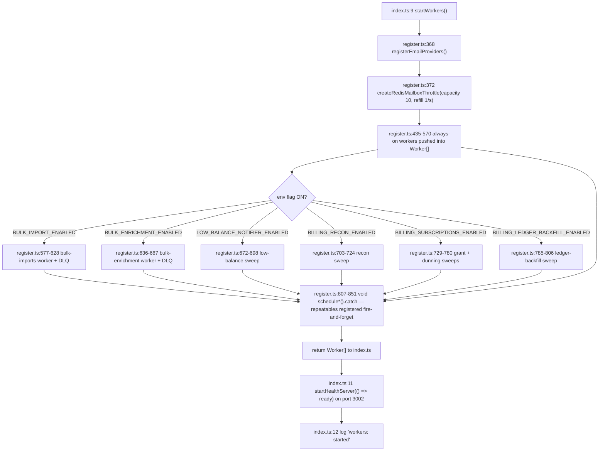
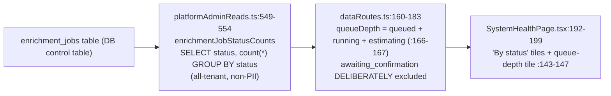

# Current Worker Architecture Audit

> **Register key.** This document keeps three voices strictly separate:
> **[AS-BUILT]** = what the code does today (every claim carries a `path:line` citation).
> **[INTENDED]** = what a design doc/ADR says the target is (cited to `docs/`).
> **[RECOMMENDATION]** = the author's proposal — never presented as if it exists.
> The single most important lens throughout is **by-design darkness** (safe-by-default,
> flag-gated inertness) **versus genuine defect** (a real fault an operator must fix). Most of
> what looks "broken" on the dashboard is the former; a small, precise set of items are the latter.

This is the as-built ground-truth reference for the TruePoint (`@leadwolf/*`) background-job
worker system (`apps/workers`, package `@leadwolf/workers`). It documents the runtime, the full
25-queue inventory, the boot/registration flow, leader-lock semantics, the health/logger
surface, the two feature-flag systems, the dashboard data path behind the reported
"Queued: 4 / Awaiting Confirmation: 1" counts, and the coordination-bus ruling. It is the most
detailed as-built document in the set; the sibling docs build on it:

- Root-cause of the stuck counts and the state machine → [02-root-cause-analysis.md](02-root-cause-analysis.md)
- Live commands to decide by-design vs fault → [03-live-inspection-runbook.md](03-live-inspection-runbook.md)
- Per-issue resolution plan → [04-issue-resolution-plan.md](04-issue-resolution-plan.md)
- Intended vs built gap matrix → [06-gap-analysis.md](06-gap-analysis.md)
- Target architecture / reliability / observability → [07-target-architecture.md](07-target-architecture.md), [09-reliability-fault-tolerance.md](09-reliability-fault-tolerance.md), [10-observability-alerting.md](10-observability-alerting.md)
- Operational runbooks → [13-operational-runbooks.md](13-operational-runbooks.md)

---

## 1. The headline, stated up front

**[AS-BUILT]** The dashboard reading **Queued: 4, Awaiting Confirmation: 1** is almost certainly
**by design, not a broken worker.** `queued` and `awaiting_confirmation` are values of the
`enrichment_jobs.status` **database control column** — they are *not* BullMQ queue depths. The
entire bulk-enrichment (confirm-before-spend) pipeline is deliberately **dark** behind an env
kill-switch that defaults off (`packages/config/src/env.ts:223`), a per-tenant feature flag that
defaults off (`packages/db/src/migrations/0048_seed_bulk_enrichment_flag.sql:1`), and a human
confirm-before-spend gate (`apps/api/src/features/enrichment/routes.ts:82`). When the switch is
off the consumer worker is **never even constructed** (`apps/workers/src/register.ts:636`), and
the initial bulk-enrich request writes a DB row and enqueues nothing
(`packages/core/src/prospect/bulkActions.ts:337-364`).

The rest of this document establishes the machinery that makes that verdict defensible, and — in
the same breath — enumerates the *genuine* failure modes an operator must still rule out on the
live environment (worker never booted, Redis wedged, boot crash from an unrelated missing env
var, a lost enqueue after confirm). The by-design/defect split is called out explicitly at every
turn. The full lifecycle trace lives in [02-root-cause-analysis.md](02-root-cause-analysis.md);
the decision procedure lives in [03-live-inspection-runbook.md](03-live-inspection-runbook.md).

---

## 2. Deployment topology (as-built)

**[AS-BUILT]** Production runs a **single** `workers` container defined by a shared app anchor,
launching `bun run --filter @leadwolf/workers start` (`docker-compose.prod.yml:115-117`). The
service definition has **no `healthcheck` and no published port** — so the health server
described in §6 is effectively never probed in prod, and a wedged worker is never auto-restarted.
The container image is the shared monorepo `Dockerfile:38`; the package entry is
`bun run src/index.ts` (`apps/workers/package.json:8`). Runtime deps are `bullmq ^5.0.0` and
`ioredis ^5.4.1` (`apps/workers/package.json:15-16`).

| Aspect | As-built | Citation | By-design vs defect |
|---|---|---|---|
| Replica count (prod) | **1** worker container | `docker-compose.prod.yml:115-117` | Acceptable at current scale; a scale gap, not a fault. See [11-capacity-finops.md](11-capacity-finops.md). |
| Container `healthcheck` | **none** on the `workers` service | `docker-compose.prod.yml:115-117` | **Genuine gap** — a hung worker is never restarted. |
| Published port for `/health`,`/ready` | **none** | `docker-compose.prod.yml:115-117` | **Genuine gap** — the port-3002 endpoints are unreachable by an orchestrator. |
| Redis durability (prod) | `--appendonly yes` | `docker-compose.prod.yml:26` | By-design; repeatables survive a restart. |
| Redis durability (dev) | `--save "" --appendonly no` | `docker-compose.yml:21` | By-design for dev, but a **dev Redis restart wipes all repeatables + queued jobs**. |
| Workers container in dev compose | **not run at all** | (dev compose omits the service) | By-design; devs run `bun run dev` locally against the compose Redis. |

**[RECOMMENDATION]** Add a container `healthcheck` that probes `GET /ready` and an orchestrator
restart policy, and publish/param the health port; run ≥2 replicas once autoscaling lands. Tracked
in [13-operational-runbooks.md](13-operational-runbooks.md) and [Phase 0 of 15-phased-implementation-plan.md](15-phased-implementation-plan.md).

---

## 3. Boot & composition flow (`index.ts` → `register.ts`)

**[AS-BUILT]** The process entry is `apps/workers/src/index.ts`. It calls `startWorkers()`
**synchronously at module load** (`apps/workers/src/index.ts:9`), starts the health server bound
to a `ready` closure (`apps/workers/src/index.ts:11`), then logs `workers: started` with the
processor count and health port (`apps/workers/src/index.ts:12`).

`apps/workers/src/register.ts` is the **composition root**. Its structure, top to bottom:

1. **One shared IORedis connection** — `new IORedis(env.REDIS_URL, { maxRetriesPerRequest: null })`
   (`apps/workers/src/register.ts:132`). This single object is handed to every `Queue`, every
   `Worker`, and the mailbox throttle (§4).
2. **Queue producer singletons** are constructed at module load and exported so any app can submit
   work (`apps/workers/src/register.ts:134-196`); the exported `enqueue*` helpers wrap them
   (`apps/workers/src/register.ts:199-348`).
3. **`instrument()`** attaches `completed`/`failed` structured-logging listeners to each worker and
   never logs payloads (`apps/workers/src/register.ts:351-362`).
4. **`startWorkers()`** (`apps/workers/src/register.ts:365-853`):
   - `registerEmailProviders()` so a Gmail send can refresh its OAuth token on the send path
     (`apps/workers/src/register.ts:368`);
   - `createRedisMailboxThrottle(connection, { capacity: 10, refillPerSec: 1 })`
     (`apps/workers/src/register.ts:372`);
   - **always-on** workers pushed into a `Worker[]` (`apps/workers/src/register.ts:435-570`);
   - **flag-gated** workers conditionally pushed (`apps/workers/src/register.ts:577-806`);
   - **repeatable sweeps** registered fire-and-forget via `void schedule*().catch(log.error)`
     (`apps/workers/src/register.ts:807-851`);
   - returns the `Worker[]` so `index.ts` can manage the lifecycle.

**Import-completion fan-out (as-built).** When an `imports` job completes, its listener enqueues
the idempotent per-workspace rollups — dedup (`apps/workers/src/register.ts:393`), firmographics
(`apps/workers/src/register.ts:398`), master-backfill (`apps/workers/src/register.ts:406`) — and,
if an importer user id is present, writes an `import_complete` notification on the base owner
connection (`apps/workers/src/register.ts:414-431`). All are best-effort: a rollup-enqueue failure
never fails the import.

### 3.1 Shutdown / drain (as-built)

**[AS-BUILT]** `shutdown(signal)` is bound to `SIGINT` and `SIGTERM`
(`apps/workers/src/index.ts:26-27`). It guards re-entrancy with a `draining` flag
(`apps/workers/src/index.ts:16`), flips `ready = false` so `/ready` starts returning 503
(`apps/workers/src/index.ts:18`), then `await Promise.all(workers.map((w) => w.close()))`
(`apps/workers/src/index.ts:20`), `await health.stop(true)` (`apps/workers/src/index.ts:21`), and
`process.exit(0)` (`apps/workers/src/index.ts:23`).

> **Genuine defect (latent).** There is **no drain timeout and no forced close**. Because every
> worker runs at **concurrency 1** (§5) with no per-vendor job timeout, a single hung job holds
> the BullMQ lock and `w.close()` waits **forever** — the process never exits and the orchestrator
> must SIGKILL it. This is a real reliability gap, distinct from the by-design darkness elsewhere.
> Remediation is in [09-reliability-fault-tolerance.md](09-reliability-fault-tolerance.md).

---

## 4. The single shared Redis connection

**[AS-BUILT]** A **single** IORedis instance is shared by every producer queue, every consumer
worker, and the mailbox throttle: `new IORedis(env.REDIS_URL, { maxRetriesPerRequest: null })`
(`apps/workers/src/register.ts:132`). `REDIS_URL` is a required, URL-validated env key
(`packages/config/src/env.ts:78`).

`maxRetriesPerRequest: null` is **required by BullMQ** for its blocking connection, but it has a
sharp operational consequence:

> **By-design mechanism, defect-shaped failure mode.** With `maxRetriesPerRequest: null`, when
> Redis becomes unreachable at runtime ioredis **reconnects forever and buffers commands instead
> of erroring**. The workers therefore **block silently** — jobs stay "Queued", **no crash is
> raised, and `/health` keeps returning 200** (§6). Nothing self-heals a wedged consumer, and (per
> §2) nothing restarts it either. This is the highest-value item on the live-inspection runbook
> ([03-live-inspection-runbook.md](03-live-inspection-runbook.md)).

**[AS-BUILT]** Boot-time Redis unreachability is subtler still: the `void schedule*().catch(...)`
repeatable registrations (`apps/workers/src/register.ts:807-851`) issue `add()` commands that may
be **buffered rather than resolved or rejected**, so a repeatable can simply **never register** and
the `.catch` never fires — no error line is emitted.

**[RECOMMENDATION]** Separate the blocking (worker) connection from a non-blocking command
connection, and add a `/ready` probe that actually PINGs Redis and inspects queue reachability
(the admin pull-probe in §11 already proves this is possible). See
[10-observability-alerting.md](10-observability-alerting.md).

### 4.1 Mailbox throttle

**[AS-BUILT]** `apps/workers/src/mailboxThrottle.ts` is an atomic Lua token bucket keyed
`email:throttle:{mailboxId}` (`apps/workers/src/mailboxThrottle.ts:11-35,54`), constructed with
fixed conservative defaults `{ capacity: 10, refillPerSec: 1 }` (~60/min)
(`apps/workers/src/register.ts:372`). A throttled outreach send is **deferred (re-enqueued), never
dropped and never a failure** (`apps/workers/src/queues/outreach.ts:56-62`).

---

## 5. Concurrency = 1 everywhere

**[AS-BUILT]** **Every worker runs at concurrency 1.** No `concurrency`, `limiter`,
`lockDuration`, `stalledInterval`, or `maxStalledCount` is set anywhere under `apps/workers/src`
(zero matches). Each `new Worker(...)` is constructed with only `{ connection }`
(e.g. `apps/workers/src/register.ts:375,438,442,445`). BullMQ v5 defaults therefore apply: a 30s
lock and a single stalled reclaim.

Consequence, stated plainly:

> **Genuine scalability/reliability gap (not by-design darkness).** A hung job with no vendor
> timeout holds the lock and **blocks the whole queue** — nothing else on that queue runs until the
> 30s lock lapses and the single stalled-reclaim fires (once). Throughput per queue is capped at one
> job at a time. This is fine at today's volume but is the primary blocker to the target scale
> ([06-gap-analysis.md](06-gap-analysis.md), [11-capacity-finops.md](11-capacity-finops.md)).

**[INTENDED]** `docs/planning/18-scalability-performance.md` calls for **per-tenant bulk
concurrency caps** and autoscaling on queue depth+age per domain (§3, §9, §11.2). None of that is
built today.

---

## 6. Health server and logger

**[AS-BUILT]** `apps/workers/src/health.ts` runs `Bun.serve` on **port 3002**
(`apps/workers/src/health.ts:7`). `GET /health` → 200 liveness
(`apps/workers/src/health.ts:15`); `GET /ready` → 200/503 read from the `isReady` closure per
request (`apps/workers/src/health.ts:16-20`). It **never checks Redis, queue depth, or worker
liveness** — `/health` is a pure "the process is up" signal and `/ready` only reflects the local
drain flag.

> **The two gaps compound.** `/health` staying 200 during a Redis wedge (§4) plus no container
> healthcheck/port (§2) means the platform's own liveness signal cannot detect the most likely real
> outage. Both are genuine defects.

**[AS-BUILT]** `apps/workers/src/logger.ts` is a minimal JSON-line logger — one JSON object per
line, `info`/`warn` → stdout, `error` → stderr (`apps/workers/src/logger.ts:9-11`). It has **no
correlation id, no tenant/workspace tags, and no log shipper**. Per-job observability is limited to
the `instrument()` `completed`/`failed` lines (`apps/workers/src/register.ts:352-359`).

**[INTENDED]** `docs/planning/19-observability-reliability.md` mandates structured logs with one
correlation id + tenant/workspace tags, X-Ray traces, GlitchTip errors, PostHog, CloudWatch +
Grafana dashboards, and SLO burn-rate alerts (§1–§3). **None** of that is installed today — there
are no telemetry libraries in the tree (the `@opentelemetry/api` entries in `bun.lock:726,896` are
an unused optional peer of drizzle-orm). Full gap analysis in
[10-observability-alerting.md](10-observability-alerting.md).

---

## 7. Leader-lock semantics and its sweeps-only scope

**[AS-BUILT]** `apps/workers/src/leaderLock.ts` exposes
`withLeaderLock(redis, key, ttlMs, fn)`. It does `SET key token PX ttlMs NX`
(`apps/workers/src/leaderLock.ts:24`); if the reply is not `"OK"` it **returns `false` and does
NOT run `fn`** (`apps/workers/src/leaderLock.ts:25`). Release is an owner-checked Lua
compare-and-delete — it deletes the key only if the stored token still matches this holder's token
(`apps/workers/src/leaderLock.ts:10-11,30`), so a slow holder whose TTL already lapsed cannot
delete a newer holder's lock.

This is a **per-tick mutex, not durable leadership.** The lock is acquired fresh each time a
repeatable job fires and released in the `finally`; there is no lease renewal and no stable
"leader" identity across ticks.

### 7.1 Sweeps-only scope

> **Critical scoping fact.** **Only the cron sweeps take the leader lock. The event queues have no
> leader guard and run on every instance.** With a single prod replica (§2), the sole instance
> always wins the lock, so **nothing starves today** — the leader lock is defensive belt-and-braces
> that only becomes load-bearing once there is more than one replica.

The header comment for the lock states its intent explicitly: it is "belt-and-suspenders on top of
the claim's `FOR UPDATE SKIP LOCKED` … + the BullMQ repeatable-job dedupe"
(`apps/workers/src/leaderLock.ts:1-5`). Each sweep processor is what calls `withLeaderLock` with a
sweep-specific key and TTL (see the per-queue table in §8, "Consumer" column). Examples:
`leader:email_sequence_tick` at TTL 55s (`apps/workers/src/register.ts` sequence-tick wiring;
`sequenceTick.ts`), `leader:email_token_refresh` at TTL 110s, and the daily sweeps at 5-/10-minute
TTLs.

**[RECOMMENDATION]** When the fleet scales past one replica, the event queues remain correctly
sharded by BullMQ (each job goes to exactly one consumer), but the sweeps' correctness then genuinely
depends on this lock — its TTLs should be re-derived from measured sweep runtimes. See
[09-reliability-fault-tolerance.md](09-reliability-fault-tolerance.md).

---

## 8. The 25 queues (as-built inventory)

**[AS-BUILT]** Twenty-five queues, all at **concurrency 1** on the **single shared connection**
(§4–§5). Each is either an **event-worker** (produced on demand) or a **cron-sweep** (a repeatable
job that self-schedules at boot). Queues #19–#25 are **flag-gated dark**: when their env switch is
off the queue, worker, and (for sweeps) schedule are **never constructed** — purely additive,
inert-by-default.

| # | Queue (const) | Type | Producer & retry | Consumer | DLQ / failure | Trigger |
|---|---|---|---|---|---|---|
| 1 | `imports` (`IMPORTS_QUEUE`) | event | api `import/queue.ts:38` attempts 3, exp 2000ms, `removeOnFail:false` | `processImport` `imports.ts:33` | **DLQ** `IMPORTS_DLQ` `imports.ts:75`, wired `register.ts:379-385` | CSV import; on complete fans out dedup/firmographics/masterBackfill + notify `register.ts:389-431` |
| 2 | `enrichment` `enrichment.ts:10` | event | `enqueueEnrichment` `register.ts:204` — **attempts 1, no retry, no DLQ** | `processEnrichment` `enrichment.ts:20` → `enrichContact` | none | on-demand — **producer NOT called by any live apps/api path** (docs only) |
| 3 | `scoring` `scoring.ts:7` | event | `enqueueScoring` `register.ts:210` attempts 1 | `processScoring` `scoring.ts:15` | none | on-demand — **no live producer** |
| 4 | `dsar` `dsar.ts:7` | event | `enqueueDsar` `register.ts:216` attempts 1 | `processDsar` `dsar.ts:15` | none | staff DSAR — **no live producer wired yet**; NOT flag-gated |
| 5 | `outreach` `outreach.ts:23` | event | `enqueueOutreach` `register.ts:222` attempts 1, supports `delay` | `makeProcessOutreach` `outreach.ts:44` | none; throttle → deferred re-enqueue not failure `outreach.ts:56-62` | sequence-tick `register.ts:506`; `consoleSender` unless per-tenant `email.send` flag `outreach.ts:51` |
| 6 | `dedup` `dedup.ts:9` | event | `enqueueDedup` `register.ts:323` attempts 1 | `processDedup` `dedup.ts:16` | none | import complete `register.ts:393` |
| 7 | `firmographics` `firmographics.ts:9` | event | `enqueueFirmographics` `register.ts:329` attempts 1 | `processFirmographics` `firmographics.ts:16` | none | import complete `register.ts:398` |
| 8 | `master-backfill` `masterBackfill.ts:11` | event | `enqueueMasterBackfill` `register.ts:335` **attempts 4, exp 30000ms** | `processMasterBackfill` `masterBackfill.ts:34` (throws on `errored>0` to self-heal `:26-32`) | none (retries → failed set) | import complete `register.ts:406`; sweep #9 |
| 9 | `master_backfill_sweep` `masterBackfillSweep.ts:14` | cron daily | `scheduleMasterBackfillSweep` `register.ts:255` (repeat 24h) | leader `leader:master_backfill_sweep` TTL 5min; cap 1000 ws | best-effort | daily |
| 10 | `projection_sweep` `projectionSweep.ts:20` | cron daily | `scheduleProjectionSweep` `register.ts:265` | leader TTL 5min; drains `projection_outbox` cap 2000; `markFailed` `:64` | inert when `INGESTION_EVIDENCE_ENABLED` off (empty outbox) | daily |
| 11 | `er_sweep` `erSweep.ts:21` | cron daily | `scheduleErSweep` `register.ts:275` | leader TTL 5min; **early-return if `!ER_SHADOW_ENABLED`** `erSweep.ts:89`; proposals only | daily |
| 12 | `email_sequence_tick` `sequenceTick.ts:14` | cron **60s** | `scheduleSequenceTick` `register.ts:228` | leader `leader:email_sequence_tick` TTL 55s; batch 200; enqueues to `outreach` dedupe `seqstep:{logId}:{step}` `register.ts:509` | every minute |
| 13 | `email_retention_sweep` `retentionSweep.ts:12` | cron daily | `scheduleRetentionSweep` `register.ts:237` | leader TTL 5min; deletes idempotency keys >30d, batch 5000 | daily |
| 14 | `reverification` `reverification.ts` | event | `enqueueReverification` `register.ts:281` **attempts 3, exp 60000ms**; api `reverificationQueue.ts:42` | `processReverification` `reverification.ts:19` | none | sweep #15 or on-demand |
| 15 | `reverification_sweep` `reverificationSweep.ts:17` | cron daily | `scheduleReverificationSweep` `register.ts:294` | leader TTL 5min; **skips if `!REACHER_BACKEND_URL`** `reverificationSweep.ts:40`; cap 1000 | daily |
| 16 | `data_quality_snapshot_sweep` `dataQualitySnapshotSweep.ts:14` | cron daily | `register.ts:303` | leader TTL 10min; cap 1000 | daily |
| 17 | `data_retention_sweep` `dataRetentionSweep.ts:18` | cron daily | `register.ts:314` | leader TTL 10min; **double-gated** per-tenant `retention_engine_enabled` + `mode==='enforce'`; shadow counts-only `deletedCount=0` `runRetentionSweep.ts:68-76,101-116` | daily |
| 18 | `email_token_refresh` `tokenRefresh.ts:13` | cron **2min** | `register.ts:246` | leader `leader:email_token_refresh` TTL 110s; batch 200 | every 2 min |
| 19 | `bulk-imports` | event drive→chunk | **gated `env.BULK_IMPORT_ENABLED`** `register.ts:577`; api `bulkQueue.ts:43` attempts 3 | `makeProcessBulkImport` `register.ts:585` | **DLQ** `BULK_IMPORTS_DLQ` `register.ts:620` | dark by default; per-tenant flag too; prod S3 store "injected later" `register.ts:582-584` |
| 20 | `bulk-enrichment` | event drive→chunk | **gated `env.BULK_ENRICHMENT_ENABLED`** `register.ts:636`; api `bulkEnrichQueue.ts:49` attempts 3, returns null if off | `makeProcessBulkEnrichment` `register.ts:643` | **DLQ** `BULK_ENRICHMENT_DLQ` `register.ts:659` | dark by default; confirm-gate |
| 21 | `low_balance_notifier_sweep` | cron daily | **gated `env.LOW_BALANCE_NOTIFIER_ENABLED`** `register.ts:672`, sched `:687` | leader TTL 10min; cap 1000 | dark; read-only |
| 22 | `billing_recon_sweep` | cron daily | **gated `env.BILLING_RECON_ENABLED`** `register.ts:703` | leader TTL 10min; logs drift only `billingReconSweep.ts:2-4,41` | dark; read-only |
| 23 | `subscription_grant_sweep` | cron **15min** | **gated `env.BILLING_SUBSCRIPTIONS_ENABLED`** `register.ts:729`, sched `:744` | leader TTL 10min; cap 500 | dark |
| 24 | `subscription_dunning_sweep` | cron daily | same gate `register.ts:755/759`, sched `:769` | leader TTL 10min; grace 14d; cap 500 | dark |
| 25 | `ledger_backfill_sweep` | cron **5min** | **gated `env.BILLING_LEDGER_BACKFILL_ENABLED`** `register.ts:785`, sched `:799` | leader TTL 10min; self-terminating; batch 100 | dark |

Notes on reading the table:

- **"dark by default"** in the Trigger column = **by-design darkness** (the queue/worker/schedule
  is not constructed until the env switch is `"true"` and the process restarts), not a fault.
- **"no live producer"** for #2/#3/#4 means the consumer is registered and healthy, but no
  `apps/api` code path currently calls the producer — so the queue is idle by construction, again
  by design (the feature is wired but not yet exposed).
- Queues #9–#18 and #21–#25 are the cron sweeps that take the leader lock (§7); #1–#8, #14, #19,
  #20 are event-driven.

### 8.1 Retry posture and DLQ coverage (as-built)

**[AS-BUILT]** Only **three** queues have a dead-letter queue, each PII-free and routed **only
after retries are exhausted**:

| DLQ | Wired at | Guards which queue |
|---|---|---|
| `IMPORTS_DLQ` | `apps/workers/src/register.ts:379` | `imports` (#1) |
| `BULK_IMPORTS_DLQ` | `apps/workers/src/register.ts:620` | `bulk-imports` (#19) |
| `BULK_ENRICHMENT_DLQ` | `apps/workers/src/register.ts:659` | `bulk-enrichment` (#20) |

**No DLQ** exists for enrichment, scoring, dsar, outreach, dedup, firmographics, master-backfill,
reverification, or any sweep. Six event queues run **attempts = 1 (no retry at all)**: enrichment,
scoring, dsar, outreach, dedup, firmographics
(`apps/workers/src/register.ts:205,211,217,223,324,330`).

> **By-design vs defect split.** The *absence of a producer* for the retry-less queues (#2/#3/#4)
> means their thin retry posture is presently harmless — nothing enqueues to them. But the design
> intent is the opposite of what is built: **[INTENDED]** ADR-0027
> (`docs/planning/decisions/ADR-0027-real-time-delivery-and-event-backbone.md`) mandates **per-domain
> BullMQ + DLQ + bounded retries + backpressure** for every domain event. The gap between "3 DLQs"
> and "DLQ everywhere with bounded retries" is a **genuine reliability gap** to be closed as those
> queues gain live producers. Full plan in [09-reliability-fault-tolerance.md](09-reliability-fault-tolerance.md).

---

## 9. Admin queue visibility (3 of 25)

**[AS-BUILT]** The admin System Health surface live-probes only **3 of the 25 queues** — imports,
bulk-imports, and reverification (`apps/api/src/features/admin/systemHealthProbes.ts:54-58`). The
`apps/api` process owns those three queue **producer** singletons, so it reads their real
depth/DLQ + connected-worker counts off Redis directly. Each per-queue accessor is bounded by its
own ~1.5s timeout and throws on timeout/Redis error; the aggregator fans them out with
`Promise.allSettled` so one dead queue never sinks the others, and reports an honest
`reachable:false` with **null (not zeroed) counts** for a queue that fails to answer
(`apps/workers`… — see `apps/api/src/features/admin/systemHealthProbes.ts:64-83`).

`deriveServiceHealth` (`apps/api/src/features/admin/systemHealthProbes.ts:43-51`) computes
`redis:"up"` iff ≥1 queue answered, and `workers:"up"` iff **any** reachable queue has ≥1 connected
worker (any-queue, not a sum — one worker process serving several queues must not read as "many").

> **Genuine observability gap.** There is **no depth / age / DLQ signal for the other 22 queues.**
> The oldest-job age — the single most useful "is a queue wedged" signal — is not surfaced anywhere.
> See [10-observability-alerting.md](10-observability-alerting.md).

---

## 10. The two feature-flag systems (why the system is dark)

**[AS-BUILT]** There are **two independent flag systems**, and the money paths are **dual-gated by
both**.

### 10.1 System 1 — env kill-switches (deploy-time)

Read only in `packages/config/src/env.ts`; `loadEnv()` parses at boot
(`packages/config/src/env.ts:328`) and freezes the `env` object
(`packages/config/src/env.ts:352`). Every switch uses a fail-closed
`.optional().transform((v) => v === "true")` — **only the literal string `"true"` arms it**;
`"false"`, `"0"`, `""`, and unset all read false.

| Env var | env.ts | Default | Gates |
|---|---|---|---|
| `BULK_IMPORT_ENABLED` | `:197` | OFF | bulk COPY-staging import (#19) |
| `BULK_ENRICHMENT_ENABLED` | `:223` | OFF | confirm-before-spend bulk enrichment — **the money path** (#20) |
| `ER_SHADOW_ENABLED` | `:234` | OFF | ER shadow proposer (#11) |
| `INGESTION_EVIDENCE_ENABLED` | `:213` | OFF | source_records/match_links evidence dual-write (feeds #10) |
| `CHROME_EXTENSION_ENABLED` | `:244` | OFF | scraping capture |
| `LOW_BALANCE_NOTIFIER_ENABLED` | `:252` | OFF | low-balance sweep (#21) |
| `BILLING_RECON_ENABLED` | `:263` | OFF | ledger recon sweep (#22) |
| `BILLING_LEDGER_BACKFILL_ENABLED` | `:270` | OFF | ledger backfill sweep (#25) |
| `BILLING_SUBSCRIPTIONS_ENABLED` | `:104` | OFF | grant + dunning sweeps (#23, #24) |
| `BILLING_CHECKOUT_ENABLED` | `:100` | OFF | credit-pack checkout |
| `AUTH_POLICY_ENFORCEMENT_ENABLED` | `:155` | OFF | auth-policy master-arm |

`REACHER_BACKEND_URL` (`packages/config/src/env.ts:133`, optional) soft-gates the reverification
sweep — the sweep skips when it is absent (`apps/workers/src/queues/reverificationSweep.ts:40`).

### 10.2 System 2 — per-tenant `feature_flags` / `tenant_feature_flags` (DB)

Types in `packages/types/src/featureFlags.ts`; evaluation in
`packages/core/src/featureFlags/evaluateFlag.ts:25-41` (per-tenant override → `global_enabled` →
default → **unknown = OFF**); the read helper is
`isFlagEnabledForTenant` (`packages/core/src/featureFlags/flagsForTenant.ts:56`). The seeded flags
are **all `global_enabled=false, default=false`**:

| Flag key | Seed migration |
|---|---|
| `retention_engine_enabled` | `packages/db/src/migrations/0034_seed_rollout_flags.sql:1` |
| `bulk_import_enabled` | `packages/db/src/migrations/0034_seed_rollout_flags.sql:2` |
| `data_health.reverification` | `packages/db/src/migrations/0046_seed_reverification_flag.sql:1` |
| `bulk_enrichment_enabled` | `packages/db/src/migrations/0048_seed_bulk_enrichment_flag.sql:1` |

### 10.3 Dual-gating and how flags flip on

**[AS-BUILT]** `bulk_import` and `bulk_enrichment` require **BOTH** the env switch AND the
per-tenant flag. For enrichment: Layer 1 `if (!env.BULK_ENRICHMENT_ENABLED) throw ForbiddenError`
(`apps/api/src/features/enrichment/routes.ts:85-87`); Layer 2 per-tenant
`isFlagEnabledForTenant(..., BULK_ENRICHMENT_FLAG_KEY)`
(`apps/api/src/features/enrichment/routes.ts:95-100`); and the producer self-gates a third time
(`apps/api/src/features/enrichment/bulkEnrichQueue.ts:48`). Env gates are surfaced **read-only** at
`GET /admin/feature-flags/env-gates` (`apps/api/src/features/admin/routes.ts:1194-1246`).

**How each flips on:**

- **Env switches** — set the var to `"true"` **and restart the process** (boot-time only; the admin
  console shows them read-only).
- **Per-tenant flags** — via the admin console global toggle or a per-tenant override
  (`packages/types/src/featureFlags.ts:49,53-57`) + `NewFlagDialog`; no restart.
- **Dual-gated features** — need **both** layers.

### 10.4 Internally-guarded (registered but inert) sweeps

**[AS-BUILT]** Distinct from "not even constructed", several sweeps **are** registered and run, but
guard themselves internally and do nothing until enabled — a second, finer layer of by-design
darkness:

| Sweep | Internal guard | Effect while off |
|---|---|---|
| `er_sweep` (#11) | `apps/workers/src/queues/erSweep.ts:89` | early-returns, proposes nothing |
| `reverification_sweep` (#15) | `apps/workers/src/queues/reverificationSweep.ts:40` | skips when `!REACHER_BACKEND_URL` |
| `projection_sweep` (#10) | empty `projection_outbox` | no-op when `INGESTION_EVIDENCE_ENABLED` off |
| `data_retention_sweep` (#17) | `runRetentionSweep.ts:68-76,101-116` | double-gated shadow; `deletedCount=0` `:112-115` |
| `outreach` (#5) | `apps/workers/src/queues/outreach.ts:51` | `consoleSender` unless per-tenant `email.send` flag |

> **DSAR is NOT flag-gated** (queue #4). It is gated by the staff workflow that would enqueue it —
> and that producer is not wired today, so the queue is idle for a different, non-flag reason.

---

## 11. The dashboard data path — "Queued: 4 / Awaiting Confirmation: 1"

**[AS-BUILT]** The reported counts come from a **DB aggregate over `enrichment_jobs`, not from
BullMQ.** The path, end to end:

- **Source query.** `enrichmentJobStatusCounts` is `SELECT status, count(*) FROM enrichment_jobs
  GROUP BY status` — all-tenant, non-PII, owner read
  (`packages/db/src/repositories/platformAdminReads.ts:549-554`).
- **Aggregation.** `dataRoutes.ts` builds `jobsByStatus` and computes
  `queueDepth = queued + running + estimating`
  (`apps/api/src/features/admin/dataRoutes.ts:166-167`) — **`awaiting_confirmation` is deliberately
  excluded from queue depth because it is waiting on a human**, and `deadLetter = failed`
  (`apps/api/src/features/admin/dataRoutes.ts:182`).
- **Render.** The admin System Health page shows the per-status tiles
  (`apps/admin/src/features/system-health/components/SystemHealthPage.tsx:192-199`) plus a
  queue-depth tile with the sublabel "Queued · estimating · running"
  (`apps/admin/src/features/system-health/components/SystemHealthPage.tsx:143-147`).

So the tiles are a **census of DB control rows**, deliberately built to distinguish
machine-waiting work (`queued`/`estimating`/`running`) from human-waiting work
(`awaiting_confirmation`). The full lifecycle of how a row lands in each status — and why exactly 4
sit in `queued` and 1 in `awaiting_confirmation` — is traced in
[02-root-cause-analysis.md](02-root-cause-analysis.md).

> **The two "queues" must never be conflated.** (1) The **DB control table** `enrichment_jobs`
> holds `queued`/`estimating`/`awaiting_confirmation`/… and is **not** BullMQ. (2) The **BullMQ
> `bulk-enrichment` queue** (name `"bulk-enrichment"`, `packages/types/src/bulkEnrichment.ts:15`)
> is what a `drive`/`chunk` job flows through. A DB row in `queued` has, by design, **no
> corresponding BullMQ job** — nothing consumes `queued` bulk-enrich rows. The dashboard reads (1);
> the worker consumes (2).

---

## 12. Coordination bus — ruled out as the source of the counts

**[AS-BUILT]** `tools/coord-bus/COORDINATION.md` is a **multi-agent software-development
orchestration protocol** — how AI coding agents (Lead / Workers worker-a, worker-b / Reviewer
reviewer-qs / Integrator) coordinate work over an MCP "coordination bus"
(`tools/coord-bus/COORDINATION.md:1-20`). Its task states are
`pending → claimed → in_progress → done → in_review → approved → merged` with a side state
`blocked` (`tools/coord-bus/COORDINATION.md:22-24`). That state lives in an MCP server (verbs
`register_agent`/`get_board`/`read_inbox`/`nudge`/`create_task`/`update_task`,
`tools/coord-bus/COORDINATION.md:28-45`); **there is no status file/JSON in the repo** and **no
`Queued` or `Awaiting Confirmation` states** anywhere in it.

> **Verdict: the coordination bus is NOT the source of the dashboard counts.** Those counts are the
> `enrichment_jobs` lifecycle (§11). The bus governs how agents build the product; it has nothing to
> do with the runtime worker system. Stated here explicitly so no reader chases it.

---

## 13. Boot gating and the shared-config SPOF

**[AS-BUILT]** `REDIS_URL` is required and URL-validated (`packages/config/src/env.ts:78`), and
`loadEnv()` **throws and crashes the process** on any invalid/missing key
(`packages/config/src/env.ts:328-335,352`). Because the schema is the **whole-app schema**, the
worker also fails to boot if unrelated keys are missing — `AUTH_ORIGIN`, `APP_ORIGINS`,
`AUTH_COOKIE_DOMAIN`, `JWT_SIGNING_KID`, `DATABASE_URL`, `BLIND_INDEX_KEY`
(`packages/config/src/env.ts:17,32,33,58,67,80`).

> **Genuine defect (shared-config SPOF).** A missing env var that the worker never uses — e.g. a
> web/auth-only key — still **crash-loops the worker at boot**. This is a real failure mode the
> operator must be able to recognise (the process exits immediately with a config error, distinct
> from a silent Redis wedge where the process stays up). Both are covered in
> [03-live-inspection-runbook.md](03-live-inspection-runbook.md) and
> [13-operational-runbooks.md](13-operational-runbooks.md).

---

## 14. As-built vs intended vs recommendation — consolidated

| Area | [AS-BUILT] | [INTENDED] (docs/ADR) | [RECOMMENDATION] |
|---|---|---|---|
| Replicas | 1 worker container `docker-compose.prod.yml:115-117` | Stateless autoscale on queue depth+age, ECS Fargate — `docs/planning/18-scalability-performance.md` §3 | Add healthcheck + restart; ≥2 replicas with autoscaling |
| Concurrency | 1 everywhere (no BullMQ tuning) | Per-tenant bulk concurrency caps + priority (bulk below money/real-time) — §18 §9, `18:221` | Per-queue concurrency + limiter; per-tenant fairness |
| Retries/DLQ | 3 DLQs; 6 queues attempts=1 `register.ts:205-330` | DLQ + bounded retries + backpressure per domain — ADR-0027 | DLQ everywhere; jittered exponential backoff |
| Enqueue safety | enqueue-after-commit; non-atomic `bulkActions.ts:337-364` + confirm `routes.ts:101,119` | **Transactional outbox** (DB commit ⇒ event published); ADR-0027 explicitly rejects enqueue-after-commit | Adopt the outbox |
| Health/readiness | liveness only, no Redis check `health.ts:15-20` | RED + queue depth/age; symptom-based alerting — `docs/planning/19-observability-reliability.md` §1–§3 | `/ready` PINGs Redis + checks depth |
| Observability | JSON logs, no correlation/tenant tags, no telemetry libs `logger.ts` | Correlation id + tenant tags, X-Ray, GlitchTip, PostHog, CloudWatch/Grafana — §19 | Instrument per [10-observability-alerting.md](10-observability-alerting.md) |
| Leader lock | per-tick mutex, sweeps-only `leaderLock.ts:24-25` | (belt-and-braces atop FOR UPDATE SKIP LOCKED + BullMQ dedupe) | Re-tune TTLs once multi-replica |
| Drain | no timeout / no forced close `index.ts:20` | graceful drain expected | Bounded drain + SIGKILL fallback |
| Flag darkness (#19-#25, guarded sweeps) | **by design** — never constructed / self-guarded | staged safe rollout | Keep; document flip runbook ([13](13-operational-runbooks.md)) |

**Bottom line.** The worker platform today is a set of **solid primitives** — BullMQ per-domain
queues, leader-locked sweeps, three PII-free DLQs, health/readiness endpoints, JSON logs, and
fail-closed dual-gating — deployed on a single replica with concurrency 1. The large "dark"
surface (the money paths and most billing/notifier sweeps) is **by-design, safe-by-default
darkness**, not a broken worker. The genuine defects are narrower and specific: no container
healthcheck/port, silent Redis-wedge with `/health` still green, no drain timeout, the
shared-config boot SPOF, thin DLQ/retry coverage, no observability layer, and the
non-transactional enqueue gap. Those are triaged in
[04-issue-resolution-plan.md](04-issue-resolution-plan.md) and sequenced in
[15-phased-implementation-plan.md](15-phased-implementation-plan.md).
