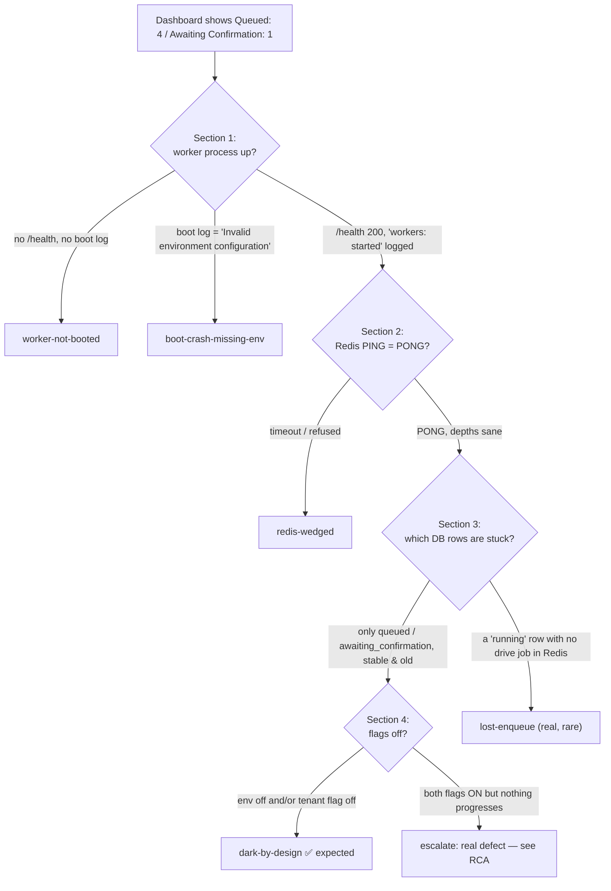

# Live Inspection Runbook

> **Objective 1 deliverable.** This runbook turns the headline verdict of the audit — that
> **Queued: 4, Awaiting Confirmation: 1** is almost certainly *dark-by-design*, not a broken worker —
> into a repeatable, copy-paste procedure an operator runs against the **live environment** to
> either confirm the by-design reading or pin one of the genuine failure modes.
>
> Read alongside [01-current-architecture-audit.md](01-current-architecture-audit.md) (the as-built
> system), [02-root-cause-analysis.md](02-root-cause-analysis.md) (the state machine and ranked
> stuck-causes this runbook falsifies), [04-issue-resolution-plan.md](04-issue-resolution-plan.md)
> (per-issue fixes), and [13-operational-runbooks.md](13-operational-runbooks.md) (the remediation
> runbooks each interpretation below routes to).

---

## 0. Read this first — scope, safety, and the two registers

**The audit sandbox cannot run any command in this document.** This environment has no live
Redis, no live Postgres, no Docker daemon, and no `bun` runtime with access to prod credentials
(see the operator's own constraints: bun/docker are the user's CI/live step, not the sandbox's).
Every command block below is written to be **run by a human operator on the live TruePoint
environment**, from a host that can reach the prod `workers` container, the prod Redis, and the
prod Postgres. Nothing here was executed to produce this document; the *expected* outputs are
derived from reading the code, not from a live run.

Keep three registers distinct throughout:

| Register | What it means here |
|---|---|
| **As-built reality** | What the code does today, cited `path:line`. This is what the commands probe. |
| **Intended design** | The sanctioned target in `docs/planning/18/19` and the ADRs — *not* what runs today. |
| **Recommendation** | The auditor's proposed change. Flagged explicitly; never presented as existing. |

And keep the central framing in front of you at every step:

> **By-design darkness vs genuine defect.** The bulk-enrichment pipeline is *deliberately* dark —
> an env kill-switch (default off) + a per-tenant flag + a human confirm-before-spend gate. A
> dashboard full of `queued` / `awaiting_confirmation` rows with a healthy worker and a reachable
> Redis is the **expected steady state of a safe-by-default rollout**, not an outage. This runbook
> exists to *rule out* the small set of real faults that would look superficially similar.

### The decision this runbook drives



Run the sections **in order**. Section 1 is cheap and rules out the two most alarming faults
(process down / boot crash) before you touch Redis or the DB.

---

## 1. Is the worker process up?

**What we are testing.** That the single prod `workers` container is running, booted past
`loadEnv()`, and serving its liveness/readiness endpoint. This falsifies *worker-not-booted* and
*boot-crash-missing-env*.

**Critical caveat before you start.** The prod `workers` service is defined as just `<<: *app` +
its start command, with **no `healthcheck` and no published port** (`docker-compose.prod.yml:115-117`).
So port **3002** is *not* reachable from the host network — you must exec **inside** the container
(or curl from another container on the same compose network). The health server itself listens on
port 3002 (`apps/workers/src/health.ts:7`).

```bash
# 1a. Confirm the container/process exists and how long it has been up.
#     A crash-loop (RESTARTS climbing, short "Up") is the tell for boot-crash-missing-env.
docker compose -f docker-compose.prod.yml ps workers
docker inspect -f '{{.State.Status}} restarts={{.RestartCount}} started={{.State.StartedAt}}' \
  "$(docker compose -f docker-compose.prod.yml ps -q workers)"

# 1b. Liveness + readiness — MUST run inside the container (no published port).
docker compose -f docker-compose.prod.yml exec workers sh -c \
  'curl -sS -o /dev/null -w "health=%{http_code}\n" http://localhost:3002/health; \
   curl -sS -o /dev/null -w "ready=%{http_code}\n"  http://localhost:3002/ready'
```

| Endpoint | Handler | Healthy | Meaning of the alternative |
|---|---|---|---|
| `GET /health` | `health.ts:15` | `200 ok` | Process up. **Blind to Redis and queue depth** — see the warning below. |
| `GET /ready` | `health.ts:16-19` | `200 ready` | Booted and not draining. `503 draining` = a `SIGINT`/`SIGTERM` drain is in flight (`apps/workers/src/index.ts:18`). |

> **`/health` and `/ready` are Redis-blind.** The readiness closure returns the process-local
> `ready` boolean only (`apps/workers/src/index.ts:10-11`, `apps/workers/src/health.ts:16-19`); it
> **never checks Redis or queue depth**. A worker whose Redis is wedged still returns `200` on both.
> Therefore Section 1 passing does **not** prove work is flowing — that is why Section 2 exists.
> *(Recommendation, tracked in [04-issue-resolution-plan.md](04-issue-resolution-plan.md): make
> `/ready` do a bounded `PING` and shallow depth read.)*

```bash
# 1c. Boot log — the definitive booted / not-booted / boot-crash discriminator.
#     Success: a single JSON line "workers: started" (apps/workers/src/index.ts:12).
docker compose -f docker-compose.prod.yml logs --since 24h workers | grep -F 'workers: started'

# 1d. loadEnv crash — the process throws BEFORE any worker starts if ANY env key is
#     invalid/missing (whole-app schema; packages/config/src/env.ts:328-335). The thrown
#     message is literally "Invalid environment configuration:" followed by the offending keys.
docker compose -f docker-compose.prod.yml logs --since 24h workers | grep -F 'Invalid environment configuration'

# 1e. Draining? (graceful shutdown was signalled) — apps/workers/src/index.ts:19,22
docker compose -f docker-compose.prod.yml logs --since 24h workers | grep -E 'workers: (draining|drained)'
```

**Interpreting Section 1:**

- `workers: started` present **and** `/health=200` → process is up and past `loadEnv`. Proceed to Section 2.
- No `workers: started`, `/health` connection-refused, container not `running` → **worker-not-booted**.
- `Invalid environment configuration:` present (and container crash-looping) → **boot-crash-missing-env**.
  The listed keys tell you which var is missing. Note the whole-app schema means an *unrelated* key
  crashes the worker: `REDIS_URL` (`packages/config/src/env.ts:78`), but also `DATABASE_URL`,
  `BLIND_INDEX_KEY` (`env.ts:80`), `AUTH_ORIGIN`, `APP_ORIGINS`, `AUTH_COOKIE_DOMAIN`,
  `JWT_SIGNING_KID`. This is a shared-config SPOF for the worker — the worker can be knocked out by a
  var it never uses. Route to [13-operational-runbooks.md](13-operational-runbooks.md) →
  *boot-crash-missing-env*.

---

## 2. Is Redis reachable, and what are the BullMQ queue depths?

**What we are testing.** That the shared IORedis connection can actually reach Redis, and that no
BullMQ queue is silently backing up. This falsifies *redis-wedged* and gives the depth signal the
health endpoint refuses to.

> **Why the worker can look healthy while Redis is dead.** There is **one** shared IORedis for every
> Queue and Worker, created with `maxRetriesPerRequest: null` (`apps/workers/src/register.ts:132`).
> With that setting ioredis **reconnects forever and buffers commands instead of erroring** — so a
> wedged Redis produces **no crash, `/health` stays 200, and jobs simply stop draining**. Nothing
> self-heals. That is precisely why a Section-1 pass is not enough.

### 2a. Reachability

```bash
# Run from a host/container that shares the prod Redis network. $REDIS_URL is the same value the
# worker parses at packages/config/src/env.ts:78. Expect: PONG.
redis-cli -u "$REDIS_URL" PING
```

- `PONG` → Redis reachable. Continue to depths.
- Timeout / `Could not connect` / `Connection refused` → **redis-wedged** (from the operator's side).
  Cross-check: if `/health` is still `200` (Section 1) while this fails, that is the exact
  buffered-command signature above. Route to [13-operational-runbooks.md](13-operational-runbooks.md)
  → *Redis wedged*.

### 2b. BullMQ v5 Redis key layout

Queues use the **default `bull` prefix** — no custom `prefix` is passed to any `new Queue(...)`
(`apps/workers/src/register.ts:132-149`), so every key is `bull:<queueName>:<part>`. BullMQ v5 key
types and the correct read command:

| Key | Redis type | Read with | Holds |
|---|---|---|---|
| `bull:<q>:wait` | LIST | `LLEN` | jobs waiting to be picked up (**backlog**) |
| `bull:<q>:active` | LIST | `LLEN` | jobs a worker is currently processing |
| `bull:<q>:delayed` | ZSET | `ZCARD` | scheduled/backoff-retry jobs not yet due |
| `bull:<q>:failed` | ZSET | `ZCARD` | jobs that exhausted retries (dead-lettered separately for the 3 DLQ queues) |
| `bull:<q>:completed` | ZSET | `ZCARD` | retained terminal jobs (bounded by `removeOnComplete`) |
| `bull:<q>:prioritized` | ZSET | `ZCARD` | v5 priority set (replaces v4's `:priority` list) |
| `bull:<q>:meta` | HASH | `HGETALL` | queue metadata; `EXISTS` here proves the Queue was ever instantiated |
| `bull:<q>:events` | STREAM | `XLEN` | the job event stream |

The four the audit cares about most are `wait`, `active`, `failed`, `delayed`. Inspect them for the
four live event queues — the exact queue-name strings are code constants:

| Queue name (verbatim key segment) | Constant | Citation |
|---|---|---|
| `bulk-enrichment` | `BULK_ENRICHMENT_QUEUE` | `packages/types/src/bulkEnrichment.ts:15` |
| `imports` | `IMPORTS_QUEUE` | `packages/types/src/contacts.ts:240` |
| `reverification` | `REVERIFICATION_QUEUE` | `packages/types/src/reverification.ts:13` |
| `enrichment` | `ENRICHMENT_QUEUE` | `apps/workers/src/queues/enrichment.ts:10` |

```bash
# 2b. Depths for the four queues. Copy-paste as-is.
for q in bulk-enrichment imports reverification enrichment; do
  printf '%-16s wait=%s active=%s delayed=%s failed=%s meta_exists=%s\n' "$q" \
    "$(redis-cli -u "$REDIS_URL" LLEN  "bull:$q:wait")" \
    "$(redis-cli -u "$REDIS_URL" LLEN  "bull:$q:active")" \
    "$(redis-cli -u "$REDIS_URL" ZCARD "bull:$q:delayed")" \
    "$(redis-cli -u "$REDIS_URL" ZCARD "bull:$q:failed")" \
    "$(redis-cli -u "$REDIS_URL" EXISTS "bull:$q:meta")"
done

# 2c. Dead-letter queues (the ONLY three DLQs that exist — register.ts:379, :620, :659).
for dlq in imports-dlq bulk-imports-dlq bulk-enrichment-dlq; do
  printf '%-20s wait=%s\n' "$dlq" "$(redis-cli -u "$REDIS_URL" LLEN "bull:$dlq:wait")"
done
```

**Interpreting Section 2:**

- **`bulk-enrichment` keys entirely absent (`meta_exists=0`, all depths `0`/nil).** This is the
  *expected* dark-by-design signature. The producer Queue is **lazily opened on first use and
  self-gates** — `if (!env.BULK_ENRICHMENT_ENABLED) return null` before any `Queue` is constructed
  (`apps/api/src/features/enrichment/bulkEnrichQueue.ts:16-22,48`) — and the consumer Worker is
  **only constructed when the flag is on** (`apps/workers/src/register.ts:636`). While dark, *nothing
  ever touches Redis for this queue*, so its keys do not exist at all. Absence here is confirmation,
  not a fault.
- **`active` > 0 and unchanging across repeated runs, `wait` climbing.** Concurrency is **1 for
  every worker** (no `concurrency`/`limiter`/`lockDuration` set anywhere in `apps/workers/src`), so a
  single hung job with no vendor timeout holds the lock and blocks the whole queue. Combined with a
  Redis `PING` timeout in 2a this is **redis-wedged**; with a healthy `PING` it is a **stuck/poison
  job** — route to [13-operational-runbooks.md](13-operational-runbooks.md) → *stuck job / backlog*.
- **`failed` climbing** on `imports`/`reverification`/`enrichment` → real processing failures; note
  that `enrichment` has **attempts=1 and no DLQ** (`register.ts:205`), so its failures are terminal
  and invisible except here. `bulk-enrichment-dlq` growth is the sanctioned dead-letter path.
- **`PONG` and all depths sane** → Redis is not your problem; proceed to Section 3.

> **Persistence footgun (context, not a live-prod step).** Dev Redis runs `--save "" --appendonly no`
> (`docker-compose.yml:21`) so a dev Redis restart **wipes all repeatables and queued jobs**; prod
> runs `--appendonly yes` (`docker-compose.prod.yml:26`). If you are inspecting a **non-prod** env and
> repeatables vanished, this is why — see [13-operational-runbooks.md](13-operational-runbooks.md) →
> *dev-redis-wiped-repeatables*.

---

## 3. What is the DB job state?

**What we are testing.** The actual `enrichment_jobs` control rows behind the dashboard tiles. This
is where `queued` and `awaiting_confirmation` live — they are **`enrichment_jobs.status` values, not
BullMQ states** (the DB control table and the BullMQ `bulk-enrichment` queue are two different
"queues"; never conflate them — see [02-root-cause-analysis.md](02-root-cause-analysis.md)).

The dashboard number is produced by exactly this aggregate:
`enrichmentJobStatusCounts` runs `SELECT status, count(*) ... GROUP BY status` over **all tenants**,
non-PII (`packages/db/src/repositories/platformAdminReads.ts:549-554`), and the API then computes
`queueDepth = queued + running + estimating` — **deliberately excluding `awaiting_confirmation`
because it waits on a human** (`apps/api/src/features/admin/dataRoutes.ts:166-167`).

> **RLS note.** `enrichment_jobs` is tenant-scoped by RLS. The dashboard reads it through
> `withPlatformTx` (owner connection, RLS-bypass, audited). To reproduce the cross-tenant numbers you
> must connect as the **platform/owner role** (RLS-bypassing) — or set the tenant GUC and query one
> tenant at a time. Do **not** widen RLS casually; prefer the owner read the app already uses.

```sql
-- 3a. Reproduce the dashboard tiles EXACTLY (platformAdminReads.ts:549-554). Run as the owner role.
SELECT status, count(*) AS count
FROM enrichment_jobs
GROUP BY status
ORDER BY status;
--   Expected shape of the reported dashboard: queued=4, awaiting_confirmation=1 (+ maybe others).

-- 3b. Inspect the actual stuck rows. Column is created_by_user_id (schema enrichmentJobs.ts:47);
--     credit_estimate_micros is enrichmentJobs.ts:56.
SELECT id,
       tenant_id,
       workspace_id,
       status,
       created_at,
       credit_estimate_micros,
       created_by_user_id
FROM enrichment_jobs
WHERE status IN ('queued', 'awaiting_confirmation')
ORDER BY created_at;

-- 3c. Age + confirm-readiness signal. A NULL credit_estimate_micros on a `queued` row is the
--     dark-by-design fingerprint: the flag-OFF lane inserts `queued` and NEVER estimates
--     (packages/core/src/prospect/bulkActions.ts:353-354). An `awaiting_confirmation` row DOES
--     carry a ceiling (bulkActions.ts:360-361) and is simply waiting for a human click.
SELECT status,
       count(*)                                   AS n,
       min(created_at)                            AS oldest,
       count(*) FILTER (WHERE credit_estimate_micros IS NULL) AS null_estimate
FROM enrichment_jobs
WHERE status IN ('queued', 'awaiting_confirmation')
GROUP BY status;

-- 3d. RULE OUT lost-enqueue: a `running` job (Section 2 showed no bull:bulk-enrichment drive job)
--     is the genuine at-least-once gap. These, not the reported states, are what a real failure
--     looks like. Cross-check any id here against bull:bulk-enrichment:{wait,active} in Redis.
SELECT id, tenant_id, workspace_id, status, started_at
FROM enrichment_jobs
WHERE status IN ('running', 'paused')
ORDER BY started_at;
```

**Interpreting Section 3:**

- **`queued` rows, old, stable, `credit_estimate_micros IS NULL`.** Textbook by-design. The
  comment in the code is explicit: *"Nothing consumes `queued` bulk-enrich jobs, so it stays an inert
  orphan exactly as today (no worker, no spend)"* (`packages/core/src/prospect/bulkActions.ts:330-331`).
  There is **no `queued → *` transition wired at all** — the flag-ON lane skips `queued` entirely. A
  `queued` count that never moves is correct behaviour, not a stuck worker.
- **`awaiting_confirmation` row with a non-NULL ceiling.** The intended resting state: the job is
  **armed and waiting for an owner/admin to click confirm** (`POST /enrichment/jobs/:jobId/confirm`,
  `apps/api/src/features/enrichment/routes.ts:82`). It will sit here indefinitely until a human acts —
  by design. See [13-operational-runbooks.md](13-operational-runbooks.md) → *confirm a stuck
  awaiting_confirmation* for the safe release procedure.
- **A `running` (or `paused`) row whose id is absent from `bull:bulk-enrichment:{wait,active,delayed}`**
  → this is the one genuine defect this runbook can surface: **lost-enqueue**. The DB insert and the
  BullMQ enqueue are not in one transaction — the row is created with zero BullMQ interaction
  (`bulkActions.ts:337-364`) and the single drive enqueue happens later, outside any shared
  transaction, in the confirm handler (`routes.ts:101` confirm, then `:119` enqueue). If the process
  dies between those two, or the producer returned `null` (flag off), you get a `running` job with no
  drive job in Redis, and `runBulkEnrich` is resumable **only if a drive job lands** — so it does not
  self-heal. Route to [04-issue-resolution-plan.md](04-issue-resolution-plan.md) (outbox / atomic
  enqueue) and [13-operational-runbooks.md](13-operational-runbooks.md).
- **`paused` rows.** A trap state: the only resume path guards on `status === "running"` and returns
  `skipped` otherwise, and **nothing flips `paused → running`** (per RCA). Flag, don't wait on it.

---

## 4. What are the flag states?

**What we are testing.** Whether the dual gate that keeps the money path dark is, in fact, off —
which is the *reason* the DB rows above are inert. Bulk enrichment requires **both** an env
kill-switch **and** a per-tenant DB flag; either being off keeps the pipeline dark end-to-end.

### 4a. Env kill-switch (`BULK_ENRICHMENT_ENABLED`)

This is read only in `packages/config/src/env.ts` and armed **only** by the literal string `"true"`
via `.optional().transform((v) => v === "true")` (`env.ts:223-226`) — `"false"`, `"0"`, `""`, and
unset all read falsy. It is a **boot-time** value (changing it requires a process restart).

```bash
# Read the raw env as the container sees it (before the transform). Anything other than exactly
# "true" means the global gate is OFF.
docker compose -f docker-compose.prod.yml exec workers printenv BULK_ENRICHMENT_ENABLED
docker compose -f docker-compose.prod.yml exec api     printenv BULK_ENRICHMENT_ENABLED
```

> The admin console surfaces env gates **read-only** at `GET /admin/feature-flags/env-gates`
> (`apps/api/src/features/admin/routes.ts:1194-1246`); you cannot flip an env switch from the UI —
> it is a deploy-time change. See [01-current-architecture-audit.md](01-current-architecture-audit.md)
> for the full env-gate table.

### 4b. Per-tenant DB flag (`bulk_enrichment_enabled`)

Seeded `global_enabled=false, default=false` (`packages/db/src/migrations/0048_seed_bulk_enrichment_flag.sql:1`).
Evaluation order is per-tenant override → `global_enabled` → `default` → **unknown = OFF**
(`packages/core/src/featureFlags/evaluateFlag.ts:25-41`). Table names:
`feature_flags` (`packages/db/src/schema/featureFlags.ts:15`) and `tenant_feature_flags`
(`featureFlags.ts:29`; column `"default"` is exposed in TS as `defaultEnabled`, `featureFlags.ts:21`).

```sql
-- 4b-i. The global row for the flag. Effective-when-both-on; here default & global are the seed values.
SELECT key, global_enabled, "default"
FROM feature_flags
WHERE key = 'bulk_enrichment_enabled';

-- 4b-ii. Any per-tenant overrides. NO rows = every tenant falls back to global/default = OFF.
--        A row with enabled = true is a tenant explicitly enrolled.
SELECT flag_key, tenant_id, enabled, updated_at
FROM tenant_feature_flags
WHERE flag_key = 'bulk_enrichment_enabled'
ORDER BY updated_at DESC;
```

The confirm endpoint enforces both layers in order: Layer 1 `if (!env.BULK_ENRICHMENT_ENABLED) throw
ForbiddenError` (`apps/api/src/features/enrichment/routes.ts:85-87`), then Layer 2 per-tenant
`isFlagEnabledForTenant(..., BULK_ENRICHMENT_FLAG_KEY)` (`routes.ts:95-100`), then role
`requireRole("owner","admin")` (`routes.ts:82`). The producer self-gates on the env switch a third
time (`bulkEnrichQueue.ts:48`).

**Interpreting Section 4:**

| Env `BULK_ENRICHMENT_ENABLED` | Tenant flag for the stuck job's tenant | Meaning |
|---|---|---|
| not `"true"` | any | **Dark-by-design.** Confirm 403s for everyone; producer enqueues nothing; consumer never constructed. All `queued`/`awaiting_confirmation` rows are inert & expected. |
| `"true"` | no override, `global_enabled=false` | Global armed but the tenant is **not enrolled** → confirm 403s for *that* tenant → its `awaiting_confirmation` row is armed-but-unconfirmable. Expected for an un-enrolled tenant. |
| `"true"` | override `enabled=true` | Both gates open. An `awaiting_confirmation` row now means **no human clicked confirm** (owner/admin only) — still by-design. If a `running` row also fails to progress here, escalate (real defect). |

---

## 5. Interpretation matrix (observation → conclusion)

Read left-to-right; the **first** row whose signals all match is your conclusion. `S1`=Section 1,
`S2`=Section 2, etc.

| # | `/health` (S1) | Boot log (S1) | Redis `PING` (S2) | BullMQ depths (S2) | DB rows (S3) | Flags (S4) | **Conclusion** | Route to |
|---|---|---|---|---|---|---|---|---|
| 1 | `200` | `workers: started` | `PONG` | `bulk-enrichment` keys absent; others sane | only `queued`/`awaiting_confirmation`, old, stable | env off **or** tenant off | **dark-by-design** — expected steady state, no action | this doc §0; [02](02-root-cause-analysis.md) |
| 2 | refused / no route | no `workers: started` | n/a | n/a | n/a | n/a | **worker-not-booted** | [13](13-operational-runbooks.md) → worker down |
| 3 | refused; container crash-looping | `Invalid environment configuration:` + key list | n/a | n/a | n/a | n/a | **boot-crash-missing-env** (SPOF: even unrelated keys crash it) | [13](13-operational-runbooks.md) → boot-crash-missing-env |
| 4 | `200` (blind!) | `workers: started` | timeout / refused | stale; `active` frozen, `wait` climbing | rows not progressing | any | **redis-wedged** (buffered commands, no crash) | [13](13-operational-runbooks.md) → Redis wedged |
| 5 | `200` | `workers: started` | `PONG` | a queue's `active`>0 unchanging, `wait` climbing | matching `running` rows old | any | **stuck/poison job** (concurrency 1, no timeout) | [13](13-operational-runbooks.md) → stuck job |
| 6 | `200` | `workers: started` | `PONG` | **no** drive job in `bull:bulk-enrichment:{wait,active,delayed}` | a `running`/`paused` `enrichment_jobs` row exists | env+tenant were on at confirm | **lost-enqueue** (non-atomic enqueue-after-commit gap) | [04](04-issue-resolution-plan.md); [13](13-operational-runbooks.md) |
| 7 | `200` | `workers: started` | `PONG` | sane | `awaiting_confirmation` armed (ceiling set) | env on **and** tenant on | **awaiting a human confirm** (owner/admin only) — by-design | [13](13-operational-runbooks.md) → confirm awaiting_confirmation |
| 8 | `200` | `workers: started` | `PONG` | sane | `running` rows progress but stall in `paused` | env+tenant on | **paused-trap** (no `paused→running` resume wired) | [02](02-root-cause-analysis.md); [04](04-issue-resolution-plan.md) |

### For the reported dashboard specifically (Queued: 4, Awaiting Confirmation: 1)

The expected finding is **row 1 (dark-by-design)**: `BULK_ENRICHMENT_ENABLED` is not `"true"` and/or
no `tenant_feature_flags` override exists, the `bulk-enrichment` BullMQ keys are absent, the four
`queued` rows carry `NULL` estimates and never move, and the one `awaiting_confirmation` row is armed
and waiting on a human. In that state **there is nothing to fix** — the worker is healthy and the
pipeline is doing exactly what a safe-by-default rollout is supposed to do. The value of running this
runbook is the *evidence* that lets you say so with confidence, and the falsification of rows 2–6 that
would indicate a genuine fault.

> **Not the coord-bus.** The multi-agent `tools/coord-bus/COORDINATION.md` protocol has task states
> `pending → claimed → in_progress → done → in_review → approved → merged` (+ `blocked`) and **no
> `Queued`/`Awaiting Confirmation` states**; it stores nothing in the repo and is **not** the source of
> these dashboard numbers. Do not chase it. (Detail in [01-current-architecture-audit.md](01-current-architecture-audit.md).)

---

## 6. Quick reference — one-screen checklist

```text
[ ] S1  docker ps workers                        → running, RestartCount low
[ ] S1  exec curl :3002/health                   → 200
[ ] S1  exec curl :3002/ready                    → 200
[ ] S1  logs | grep 'workers: started'           → present
[ ] S1  logs | grep 'Invalid environment config' → ABSENT
[ ] S2  redis-cli PING                            → PONG
[ ] S2  LLEN/ZCARD bull:<q>:{wait,active,failed,delayed} for bulk-enrichment,imports,reverification,enrichment
[ ] S2  bull:bulk-enrichment:meta EXISTS         → 0 expected while dark
[ ] S2  LLEN bull:{imports,bulk-imports,bulk-enrichment}-dlq:wait → not climbing
[ ] S3  SELECT status,count(*) FROM enrichment_jobs GROUP BY status  (matches dashboard)
[ ] S3  inspect queued/awaiting_confirmation rows (NULL estimate on queued = by-design)
[ ] S3  no orphan 'running' row missing its drive job (lost-enqueue check)
[ ] S4  printenv BULK_ENRICHMENT_ENABLED          → not "true" ⇒ dark
[ ] S4  feature_flags + tenant_feature_flags for 'bulk_enrichment_enabled' → off
→ All boxes as annotated ⇒ DARK-BY-DESIGN (expected). Any deviation ⇒ matrix rows 2–8.
```

---

### Related documents

- [01-current-architecture-audit.md](01-current-architecture-audit.md) — the full as-built system this runbook probes.
- [02-root-cause-analysis.md](02-root-cause-analysis.md) — the state machine, transitions, and ranked stuck-causes.
- [04-issue-resolution-plan.md](04-issue-resolution-plan.md) — fixes for the real defects (lost-enqueue, paused-trap, Redis-blind readiness).
- [13-operational-runbooks.md](13-operational-runbooks.md) — the remediation runbooks each matrix conclusion routes to.
