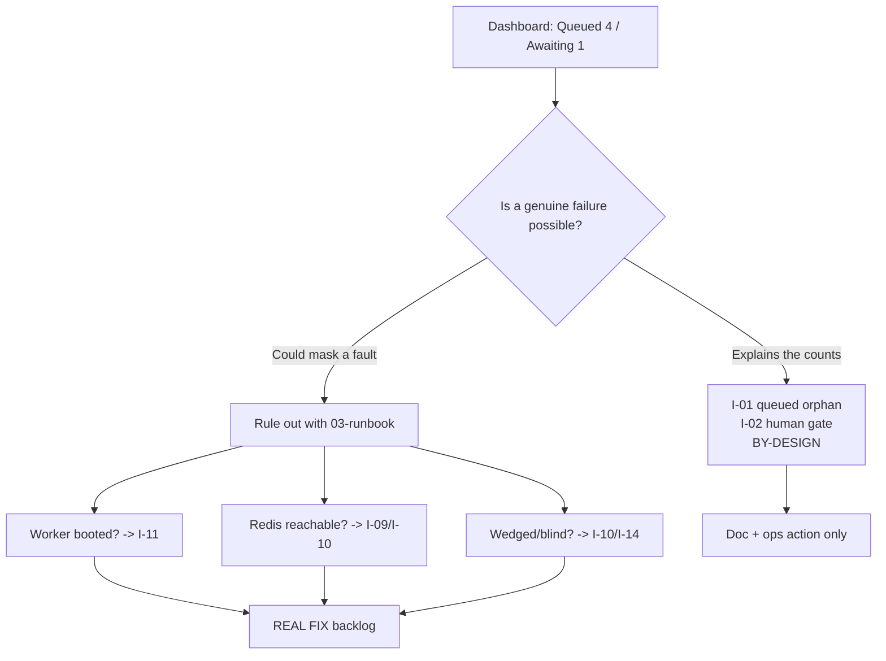
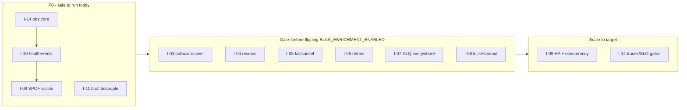

# Issue Resolution Plan

> **Scope.** This document turns the findings of the worker-system audit into a concrete,
> per-issue resolution plan. Each issue is written to a fixed schema —
> **Root cause · Impact · Dependencies · Proposed fix · Rollback · Validation** — and is tagged
> with one of two dispositions:
>
> - **BY-DESIGN (doc/ops only)** — the observed behaviour is the *intended* safe-by-default
>   posture of a feature that is deliberately dark. There is **no application-code defect**; the
>   only "resolution" is documentation, an operational runbook, or a deliberate decision to flip a
>   flag. Writing code here would be a regression, not a fix.
> - **REAL FIX** — a genuine gap between what the system *should* guarantee and what the code
>   actually does. These carry a code/config change with a rollback and a validation gate.
>
> This split is the spine of the whole audit. See [`00-executive-summary.md`](00-executive-summary.md)
> for the verdict, [`02-root-cause-analysis.md`](02-root-cause-analysis.md) for the lifecycle
> derivation behind every root cause below, and [`03-live-inspection-runbook.md`](03-live-inspection-runbook.md)
> for the live commands referenced throughout **Validation**. Deep designs for the REAL FIXes live
> in [`09-reliability-fault-tolerance.md`](09-reliability-fault-tolerance.md),
> [`10-observability-alerting.md`](10-observability-alerting.md), and the sequenced code work is in
> [`15-phased-implementation-plan.md`](15-phased-implementation-plan.md).

---

## How to read this document

Three registers are kept strictly separate and are never blended:

| Register | Meaning | How it appears |
|---|---|---|
| **As-built reality** | What the code does today | A `path:line` citation in backticks |
| **Intended design** | What a doc/ADR mandates | "ADR-00xx / §nn says…" (target, not current) |
| **Recommendation** | What *this audit* proposes | The **Proposed fix** field only |

Nothing in a **Proposed fix** field exists in the codebase yet. Where a fix is code, it is a
recommendation; where a fix is documentation or a flag decision, it is an operational action.

### The headline, restated

The dashboard reading **Queued: 4 · Awaiting Confirmation: 1** is **almost certainly by design.**
Both are `enrichment_jobs.status` values on a pipeline that is dark behind an env kill-switch
(default off) + a per-tenant flag + a human confirm-before-spend gate. Issues **I-01** and **I-02**
below explain those two counts and are tagged BY-DESIGN. The plan's job is to *simultaneously*
(a) document why that is correct and (b) hand the operator the fixes and runbooks needed to rule
out the genuine failure modes (I-10, I-11, I-14 especially).

---

## Issue index

| ID | Issue | Class | Sev | Only bites when… |
|---|---|---|---|---|
| [I-01](#i-01--queued-bulk-enrich-jobs-are-inert-orphans) | `queued` bulk-enrich jobs are inert orphans | **BY-DESIGN** | P3 (doc) | never — always dark |
| [I-02](#i-02--awaiting_confirmation-jobs-wait-forever-on-a-human) | `awaiting_confirmation` waits forever on a human | **BY-DESIGN** | P3 (doc) | `BULK_ENRICHMENT_ENABLED` on |
| [I-03](#i-03--non-atomic-confirmrunning--enqueue-gap) | Non-atomic confirm→running→enqueue gap | **REAL FIX** | P1 | `BULK_ENRICHMENT_ENABLED` on |
| [I-04](#i-04--the-paused-trap-no-resume-transition) | The `paused` trap — no resume transition | **REAL FIX** | P1 | `BULK_ENRICHMENT_ENABLED` on |
| [I-05](#i-05--dead-failedcancelled-enum-values) | Dead `failed`/`cancelled` enum values | **REAL FIX** | P2 | `BULK_ENRICHMENT_ENABLED` on |
| [I-06](#i-06--attempts1-no-retry-on-six-event-queues) | `attempts:1` (no retry) on six event queues | **REAL FIX** | P1 | those queues active |
| [I-07](#i-07--partial-dlq-coverage-3-of-25-queues) | Partial DLQ coverage (3 of 25 queues) | **REAL FIX** | P1 | any non-DLQ queue fails |
| [I-08](#i-08--no-stalledlock-tuning--no-vendor-timeouts) | No stalled/lock tuning, no vendor timeouts | **REAL FIX** | P1 | a job hangs |
| [I-09](#i-09--concurrency-1--single-redis-single-replica-spof) | Concurrency-1 + single-Redis / single-replica SPOF | **REAL FIX** | P0 (avail) | Redis/replica fails, or at scale |
| [I-10](#i-10--health-never-checks-redis--prod-has-no-healthcheck) | `/health` ignores Redis; prod has no healthcheck | **REAL FIX** | P0 | worker wedges |
| [I-11](#i-11--whole-app-env-schema-couples-worker-boot) | Whole-app env schema couples worker boot | **REAL FIX** | P1 | any unrelated key missing |
| [I-12](#i-12--consumers-with-no-live-producer-enrichment-scoring-dsar) | Consumers with no live producer (enrichment/scoring/dsar) | **BY-DESIGN** | P3 (doc) | never — no producer |
| [I-13](#i-13--dev-redis-non-persistence-wipes-repeatables) | Dev Redis non-persistence wipes repeatables | **BY-DESIGN** | P3 (doc) | dev Redis restarts |
| [I-14](#i-14--absent-observability-and-alerting) | Absent observability & alerting | **REAL FIX** | P0 | always (blind ops) |
| [I-15](#i-15--no-drain-timeout-on-shutdown) | No drain timeout on shutdown | **REAL FIX** | P2 | a job hangs during deploy |

Severity is *operational risk to the live system*, not effort. Note the asymmetry: every P0/P1
REAL FIX either (a) exists **regardless** of the dark features (I-09, I-10, I-11, I-14, I-15) or
(b) is latent until a flag is flipped on (I-03, I-04, I-05, I-06, I-07, I-08) — which is precisely
why they must be closed **before** enabling bulk-enrichment, not after.



---

## I-01 — `queued` bulk-enrich jobs are inert orphans

**Classification: BY-DESIGN (doc/ops only). Severity: P3 (documentation).**

### Root cause
With `BULK_ENRICHMENT_ENABLED` off (the default), `bulkActions.bulkEnrich` inserts the
`enrichment_jobs` row with `status: "queued"` and does nothing else
(`packages/core/src/prospect/bulkActions.ts:346-357`, ternary at `:354`). The in-code comment is
explicit: *"Nothing consumes `queued` bulk-enrich jobs, so it stays an inert orphan exactly as
today (no worker, no spend)"* (`packages/core/src/prospect/bulkActions.ts:330-332`). There is **no
`queued → *` transition anywhere** — the flag-ON lane skips `queued` entirely and starts at
`estimating` (`bulkActions.ts:354`). The BullMQ consumer is only *constructed* when the flag is on
(`apps/workers/src/register.ts:636`), so even a running worker never reads `queued` rows. `queued`
is therefore a terminal-by-omission resting state, by construction.

### Impact
None to correctness or spend — this is the safe default. The only "impact" is **operator
confusion**: a non-zero `Queued` tile (`apps/admin/src/features/system-health/components/SystemHealthPage.tsx:192-199`)
reads like a backlog when it is an intentional no-op. The count is fed by an all-tenant
`GROUP BY status` (`packages/db/src/repositories/platformAdminReads.ts:549-554`) and the derived
`queueDepth = queued + running + estimating` (`apps/api/src/features/admin/dataRoutes.ts:166-167`).

### Dependencies
None (no code change). Depends only on the flag remaining off.

### Proposed fix (doc/ops)
1. Document in [`02-root-cause-analysis.md`](02-root-cause-analysis.md) and the admin UI help text
   that `Queued` for enrichment jobs is an *inert-by-design* count while the pipeline is dark.
2. **Optional UX (design-owned, low priority):** relabel the tile sublabel to distinguish "queued
   (inert while bulk-enrichment disabled)" from a live BullMQ backlog. This is copy, not logic.
3. Do **not** add a `queued`-draining consumer — that would defeat the confirm-before-spend gate.

### Rollback
N/A for docs. If the optional relabel ships, it is a copy revert.

### Validation
Confirm on the live env per [`03-live-inspection-runbook.md`](03-live-inspection-runbook.md): env
gate reads off at `GET /admin/feature-flags/env-gates`, and the `queued` rows have no corresponding
BullMQ `bulk-enrichment` jobs (`LLEN bull:bulk-enrichment:wait` ≈ 0). Both true ⇒ by design.

---

## I-02 — `awaiting_confirmation` jobs wait forever on a human

**Classification: BY-DESIGN (doc/ops only). Severity: P3 (documentation).**

### Root cause
`awaiting_confirmation` is the *armed, unconfirmed* resting state of the confirm-before-spend gate.
When the flag is on, `bulkEnrich` inserts `estimating`, persists the worst-case credit ceiling, and
arms the gate via `setEstimateAwaitingConfirmation`
(`packages/db/src/repositories/enrichmentJobRepository.ts:331-345`, caller `bulkActions.ts:361`).
The **only** exit is a human owner/admin clicking confirm:
`POST /enrichment/jobs/:jobId/confirm` (`apps/api/src/features/enrichment/routes.ts:82-126`),
gated by `requireRole("owner","admin")` (`:82`). The state is *supposed* to sit until a person
accepts the shown spend ceiling. It is deliberately **excluded** from the queue-depth tile because
it waits on a human, not a worker (`apps/api/src/features/admin/dataRoutes.ts:166-167`).

### Impact
None to spend (nothing runs until confirm). The failure-*looking* subtlety is that four distinct
situations all present identically as a stuck `awaiting_confirmation` — only one is a bug-shaped
condition and it is still policy, not a code defect:

| Sub-cause | Nature |
|---|---|
| No one clicked confirm | Intended resting state |
| Confirm 403s — global switch off (`routes.ts:85-87`) | Armed-but-unconfirmable (config) |
| Confirm 403s — tenant not flag-enrolled (`routes.ts:95-100`) | Armed-but-unconfirmable (config) |
| Role starvation — member/viewer can GET but not confirm (`routes.ts:82`) | Intended authz |
| Armed, then flag flipped **off** | Permanently stuck until flag returns |

### Dependencies
None (no code change). The "armed-then-flag-off" trap depends on operational flag discipline.

### Proposed fix (doc/ops)
1. Document the five sub-causes and the confirm runbook in
   [`13-operational-runbooks.md`](13-operational-runbooks.md) ("confirm a stuck `awaiting_confirmation`").
2. **Ops guardrail (recommendation):** never flip `BULK_ENRICHMENT_ENABLED` *off* while
   `awaiting_confirmation` rows exist for enrolled tenants — drain or cancel them first. This is a
   process rule; it becomes enforceable once I-05 (a real cancel transition) lands.
3. Surface, in the admin job view, *why* confirm is unavailable (switch off vs not enrolled vs
   role) so the state is self-explaining. Design/UX, not worker logic.

### Rollback
N/A for docs/process.

### Validation
Per [`03-live-inspection-runbook.md`](03-live-inspection-runbook.md): confirm the row's tenant flag
state and the env gate. If either gate is off, the "stuck" state is expected. If both are on and
the tenant has an owner/admin, escalate to the human-workflow runbook — still not a worker fault.

---

## I-03 — Non-atomic confirm→running → enqueue gap

**Classification: REAL FIX. Severity: P1 (data integrity; latent until `BULK_ENRICHMENT_ENABLED` on).**

### Root cause
The DB state transition and the BullMQ enqueue are two **separate, non-transactional** steps in the
confirm HTTP handler. `confirmAwaitingJob` flips the row to `running` and stamps `started_at`
(`packages/db/src/repositories/enrichmentJobRepository.ts:354-365`), invoked at
`apps/api/src/features/enrichment/routes.ts:101`. The drive is enqueued **afterward and outside any
shared transaction** at `routes.ts:119-123`. The initial job row is created with **zero** BullMQ
interaction (`bulkActions.ts:337-364`). Two windows exist:

1. Process dies between `:101` (row now `running`) and `:119` (enqueue) → a `running` job with **no
   drive job in Redis**.
2. Producer returns `null` because the flag flipped off between layer-2 check and enqueue
   (`apps/api/src/features/enrichment/bulkEnrichQueue.ts:48`) → same outcome.

`runBulkEnrich` is *resumable only if a drive job lands* (`packages/core/src/enrichment/bulk/runBulkEnrich.ts:63-92`);
a lost enqueue is **not self-healing** — nothing re-drives a `running` job that never got a drive.
This is precisely the **enqueue-after-commit pattern that ADR-0027 explicitly rejects** (a crash
between commit and publish drops the event); the ADR mandates a transactional outbox instead.

### Impact
An at-least-once gap presenting as a **permanently stuck `running` job** (not one of the reported
states). No spend leaks (nothing runs), but the job never completes and never fails — it needs
manual intervention. Frequency is low (crash-window), but it is a silent correctness hole that
compounds with I-04 (no resume) and I-05 (no fail path): the job cannot self-heal, be paused-resumed,
or be failed.

### Dependencies
- ADR-0027 transactional-outbox pattern (intended design).
- A durable `job_outbox`/`enrichment_outbox` table in `packages/db` and a drain sweep in
  `apps/workers` (new).
- Reconciliation sweep that finds `running` jobs with no live drive/chunk and re-drives them —
  overlaps the I-04 resume work.
- Must land **before** `BULK_ENRICHMENT_ENABLED` is enabled in prod.

### Proposed fix (recommendation)
Two options, in order of preference:

1. **Transactional outbox (ADR-0027 conformant).** In the confirm path, within *one* DB
   transaction: `confirmAwaitingJob` (→ `running`) **and** insert an outbox row
   `{kind: "drive", jobId, scope}`. A leader-gated outbox-drain sweep (mirror the existing
   `projection_sweep` pattern, `apps/workers/src/queues/projectionSweep.ts`) enqueues to BullMQ and
   marks the outbox row published. Crash-safe: commit ⇒ eventually published.
2. **Reconciliation-only (cheaper interim).** Keep the direct enqueue but add a leader-gated
   `enrichment_drive_recovery_sweep`: any job `running` with `started_at` older than N minutes and
   **no live BullMQ drive/chunk** gets a drive re-enqueued (idempotent — `runBulkEnrich` re-drives
   only unfinished chunks, `runBulkEnrich.ts:82-92`). This closes the hole without the outbox, but
   is at-least-once with a latency tail, not commit-atomic.

```mermaid
sequenceDiagram
  participant U as Owner
  participant API as confirm handler
  participant DB
  participant OB as Outbox sweep
  participant Q as BullMQ
  U->>API: POST /jobs/:id/confirm
  API->>DB: TX { status=running + insert outbox(drive) }
  Note over DB: commit is the single source of truth
  OB->>DB: poll unpublished outbox
  OB->>Q: enqueue drive
  OB->>DB: mark published
  Note over API,Q: crash anywhere -> sweep re-drives; no lost enqueue
```

### Rollback
Feature-neutral: the fix is inert while `BULK_ENRICHMENT_ENABLED` is off (no confirms happen). If
the outbox drain misbehaves, disable the new sweep's scheduler (fire-and-forget registration,
`register.ts:807-851` pattern) — the direct enqueue path still works exactly as today. The outbox
table is additive and can be left in place.

### Validation
- Unit/itest: kill the process between `confirm` and enqueue (inject a throw at `routes.ts:119`);
  assert the sweep re-drives and the job reaches `completed`.
- Itest: flip flag off mid-confirm; assert the job is not left orphaned `running`.
- Live: after enabling, the recovery sweep's log line should report **0** re-drives in steady
  state; a non-zero count is an alert (see [`10-observability-alerting.md`](10-observability-alerting.md)).

---

## I-04 — The `paused` trap (no resume transition)

**Classification: REAL FIX. Severity: P1 (latent until `BULK_ENRICHMENT_ENABLED` on).**

### Root cause
A chunk that trips a spend brake flips the job `running → paused`
(`packages/core/src/enrichment/bulk/bulkProcessEnrichChunk.ts:206-210`, unguarded write). But the
**only** resume path, `runBulkEnrich`, guards on `status === "running"` and returns `skipped` for
anything else (`packages/core/src/enrichment/bulk/runBulkEnrich.ts:71-80`). **Nothing flips
`paused → running`** — no endpoint, no sweep, no worker step writes that transition. A paused job is
a dead end until a human uses the generic, **unguarded** `updateJobStatus`
(`enrichmentJobRepository.ts:284-288`) out-of-band — which is itself unsafe (I-05).

### Impact
Any brake trip permanently parks a partially-enriched bulk job. Spend already incurred on completed
chunks is stranded; remaining chunks never run and never fail. Presents as a stuck `paused` (again,
not one of the reported dashboard states). Because brakes are a *core safety mechanism* of the money
path, a pause with no resume means the safety mechanism is one-way — you can stop spend but never
safely restart it through a supported path.

### Dependencies
- Depends on I-03's resume/reconciliation machinery (a re-drive that respects chunk idempotency).
- A guarded `resumeJob` repository method (`WHERE status='paused'`) mirroring the pattern of
  `confirmAwaitingJob` (`enrichmentJobRepository.ts:354-365`).
- Spend-cap/breaker state must be re-checked on resume (owned by
  [`11-capacity-finops.md`](11-capacity-finops.md)).

### Proposed fix (recommendation)
1. Add a guarded `resumePausedJob(scope, jobId)` (`WHERE status='paused' → 'running'`) and a
   `POST /enrichment/jobs/:jobId/resume` endpoint, `requireRole("owner","admin")`, dual-gated
   identically to confirm (`routes.ts:82,85-87,95-100`). On resume, re-check the daily breaker and
   per-run cap **before** re-enqueuing a drive; `runBulkEnrich` then re-drives only unfinished
   chunks (`runBulkEnrich.ts:82-92`).
2. Emit an explicit "job paused — action required" signal (I-14) so a pause is never silent.

### Rollback
Inert while the flag is off. If resume misbehaves, remove the endpoint route registration; the
generic `updateJobStatus` manual path remains as the pre-fix escape hatch. Additive only.

### Validation
- Itest: force a brake trip → assert `paused`; call resume → assert `running` and only unfinished
  chunks re-enqueue (no double-spend on completed chunks).
- Itest: resume when the daily breaker is exhausted → assert the resume is refused and the job stays
  `paused` (no spend).
- Live: `paused` job count with age > threshold is an alert.

---

## I-05 — Dead `failed`/`cancelled` enum values

**Classification: REAL FIX. Severity: P2 (latent until `BULK_ENRICHMENT_ENABLED` on).**

### Root cause
`failed` and `cancelled` are declared in all three mirrors of the status vocabulary — DB CHECK
(`packages/db/src/schema/enrichmentJobs.ts:73-76`), Zod enum
(`packages/types/src/bulkEnrichment.ts:71-81`), and UI labels/tones
(`apps/web/src/features/enrichment-jobs/components/format.ts:49-58,65-74`) — but **no production
code writes either value** for `enrichment_jobs`. This is now **confirmed, not conjectured** (reconciled
with [`02-root-cause-analysis.md`](02-root-cause-analysis.md) §5.3, now **VERIFIED** — resolves its
former `[NEEDS VERIFICATION]`): a repo-wide grep finds zero production writers of `failed`/`cancelled`
to `enrichment_jobs`. The only production `updateJobStatus` writers in the enrichment pipeline set
**benign** states — `runBulkEnrich.ts:99` (→ `completed` on an empty job), `bulkProcessEnrichChunk.ts:208`
(→ `paused` when a brake trips), and `bulkProcessEnrichChunk.ts:221` (→ `completed` on the last chunk);
`failed`/`cancelled` appear **only** in the read-only classification helper
`packages/core/src/enrichment/jobStatus.ts:34` (a `TERMINAL_STATUSES` set used by `toEnrichmentJobSummary`)
and in tests (`jobStatus.test.ts:59,83-89`) — never on a write path. There is no fail transition (a
dead-lettered or exhausted bulk-enrich job never marks the *control row* failed) and no cancel
transition (there is no cancel endpoint). The vocabulary promises terminal outcomes the state
machine cannot reach.

### Impact
Two real consequences:
- **No terminal failure:** a bulk-enrich job that genuinely cannot complete (poison chunk, vendor
  outage, exhausted retries → DLQ) leaves the control row stuck `running`/`paused` forever. The DLQ
  route (`apps/workers/src/register.ts:659`) captures the BullMQ job, and its handler
  (`apps/workers/src/queues/bulkEnrichment.ts`) records only a PII-free dead-letter — it **does not**
  reconcile the control row to `failed` (the word "failed" there is only a comment at `:117`). The DB
  job the *user* sees is never marked failed, so operators and users cannot tell a live job from a
  dead one.
- **No user cancel:** an armed or running job cannot be cancelled through a supported path, forcing
  the unguarded `updateJobStatus` (`enrichmentJobRepository.ts:284-288`) — which can write *any*
  patch over *any* state and is a foot-gun (it is the mechanism that makes I-04's trap "escapable"
  only unsafely).

### Dependencies
- Guarded transition methods (`WHERE status IN (...)`) added to `enrichmentJobRepository`.
- The DLQ→control-row reconciliation depends on I-07 (DLQ everywhere) and the per-bulk-job
  three-way accounting design in `docs/planning/19-observability-reliability.md` §9.
- Should ship alongside I-03/I-04 as one "lifecycle completeness" change.

### Proposed fix (recommendation)
1. **Wire `failed`:** on `bulk-enrichment` DLQ routing (`register.ts:659`), reconcile the control
   row to `failed` (guarded `WHERE status IN ('running','paused')`) with a non-PII reason. A drive
   that throws after exhausting retries marks the job `failed`, not orphaned `running`.
2. **Wire `cancelled`:** add `POST /enrichment/jobs/:jobId/cancel` (owner/admin, dual-gated) with a
   guarded `cancelJob` (`WHERE status IN ('queued','estimating','awaiting_confirmation','paused')`);
   remove any pending drive/chunk jobs from BullMQ.
3. **Constrain the foot-gun:** narrow generic `updateJobStatus` to legal transitions or restrict its
   callers, so the enum is authoritative.

### Rollback
Inert while the flag is off. Each transition is independently revertible (remove the route /
reconciliation hook). Additive; no destructive schema change (the enum values already exist).

### Validation
- Itest: DLQ a bulk-enrich drive → assert the control row becomes `failed` with a non-PII reason.
- Itest: cancel from each legal source state → assert `cancelled` and no residual BullMQ jobs;
  cancel from `completed` → assert 409 (illegal transition rejected).
- Grep gate: `failed`/`cancelled` now have a production writer for `enrichment_jobs`.

---

## I-06 — `attempts:1` (no retry) on six event queues

**Classification: REAL FIX. Severity: P1 (bites whenever the queue is active).**

### Root cause
Six event producers **omit the `attempts` option entirely** on their `.add(...)` call and so
inherit BullMQ's **default of 1** (there is no written-down `attempts: 1` anywhere) — a single try,
no backoff, no retry: `enrichment`, `scoring`, `dsar`, `outreach`, `dedup`, `firmographics`
(`apps/workers/src/register.ts:205,211,217,223,324,330`; `outreach` at `:223` passes only a `delay`,
still no `attempts`). A transient fault (vendor 429/5xx, a
momentary DB blip, a network flake) is fatal on the first miss. Compare the queues that *do* retry:
`imports` (attempts 3, exp 2000ms, via `apps/api/src/features/import/queue.ts:38`),
`master-backfill` (attempts 4, exp 30000ms, `register.ts:335`), and `reverification` (attempts 3,
exp 60000ms, `register.ts:281`). The retry-less six are the odd ones out.

### Impact
Transient failures become permanent job loss for the affected domains. Worst offenders by blast
radius: `dedup` and `firmographics` fan out from *every* CSV import (`register.ts:393,398`) — a
single Redis/DB hiccup silently drops a shard of an import's post-processing with **no DLQ**
(I-07) and **no retry**, so there is no trace and no recovery. `outreach` is partially shielded (a
throttle defers via re-enqueue rather than failing, `apps/workers/src/queues/outreach.ts:56-62`),
but a *non-throttle* fault still dies on attempt 1.

### Dependencies
- Requires idempotent consumers so retries are safe (most are effectively idempotent upserts;
  verify per domain — owned by [`09-reliability-fault-tolerance.md`](09-reliability-fault-tolerance.md)).
- Pairs with I-07 (DLQ) and I-08 (stalled recovery) — retries without a DLQ still eventually lose
  poison jobs.
- `dsar` (`register.ts:217`) has no live producer today (I-12) — retry config is defense-in-depth
  for when it is wired.

### Proposed fix (recommendation)
Set `attempts: 3–5` with exponential backoff **and jitter** (BullMQ `backoff: { type: 'exponential',
delay }`; add jitter to avoid thundering-herd on a recovering dependency) on all six producers,
matched to each domain's cost profile (cheap idempotent ops → more attempts; spendy ops → fewer +
tighter caps). Classify errors transient-vs-deterministic (per `19-observability-reliability.md`
§9.2) so a deterministic failure (bad input) does not burn retries. Wire each to a DLQ (I-07).

### Rollback
Per-queue config change; **remove** the added `attempts`/`backoff` object to restore current
behaviour (the `.add(...)` call again omits `attempts`, so BullMQ's default of 1 applies). Low blast
radius, independently revertible per queue.

### Validation
- Itest per queue: inject a transient throw on attempt 1 → assert success on retry; inject a
  permanent throw → assert it lands in the DLQ after N attempts (post-I-07).
- Load: confirm backoff+jitter spreads retries (no synchronized retry spike) against a flapping
  dependency stub.

---

## I-07 — Partial DLQ coverage (3 of 25 queues)

**Classification: REAL FIX. Severity: P1.**

### Root cause
Only three of the 25 queues route exhausted jobs to a dead-letter queue: `IMPORTS_DLQ`
(`apps/workers/src/register.ts:379-385`), `BULK_IMPORTS_DLQ` (`:620`), and `BULK_ENRICHMENT_DLQ`
(`:659`). The other 22 — including every retry-less event queue from I-06 and every cron sweep —
have **no DLQ**. A job that exhausts its retries (or the retry-less ones that fail once) is simply
gone from BullMQ's completed/failed sets with no durable, inspectable record. ADR-0027 mandates
"**DLQ + bounded retries + backpressure**" per domain; only 3/25 meet it.

### Impact
Silent data loss with no forensic trail. For `dedup`/`firmographics` (import fan-out) this means a
failed post-processing shard vanishes with no way to redrive or even know it happened. For sweeps,
a failed tick is only visible as an `instrument()` "failed" log line (`register.ts:350-362`) that
scrolls away — there is no queue an operator can inspect or redrive. This directly blocks the
"DLQ growth" alert and the redrive runbook that [`13-operational-runbooks.md`](13-operational-runbooks.md)
depends on.

### Dependencies
- Reuse the existing DLQ pattern (`register.ts:379-385,620,659`) and the PII-free dead-letter shape
  already established (`ImportDeadLetter`).
- Pairs with I-06 (retries feed the DLQ) and I-14 (DLQ-depth metric + alert).
- Security: dead-letters must stay PII-free (see [`12-security-review.md`](12-security-review.md)) —
  store IDs and error class, never row payloads.

### Proposed fix (recommendation)
1. Extend DLQ coverage to **all event queues**, starting with the highest-value:
   `enrichment`, `scoring`, `dsar`, `outreach`, `dedup`, `firmographics`, `master-backfill`,
   `reverification`. Use one shared `deadLetter*` helper to avoid 8 bespoke implementations.
2. For **sweeps** (idempotent, re-run next tick), a full DLQ is lower value; instead record a
   durable "last sweep failed" signal (metric + structured error, I-14) and let the next tick
   retry. Document this asymmetry rather than forcing a DLQ where re-run already covers it.
3. Add a generic **redrive** admin action (bounded, PII-free) per DLQ.

### Rollback
Additive per queue — remove the `.on("failed", …)` dead-letter hook to revert a single queue. No
change to happy-path behaviour.

### Validation
- Itest per newly-covered queue: force retry exhaustion → assert a PII-free record lands in its DLQ;
  redrive → assert the job re-processes idempotently.
- Grep gate: every event queue in the 25-queue table has either a DLQ or a documented re-run
  rationale.

---

## I-08 — No stalled/lock tuning, no vendor timeouts

**Classification: REAL FIX. Severity: P1.**

### Root cause
No `concurrency`, `limiter`, `lockDuration`, `stalledInterval`, or `maxStalledCount` is set anywhere
in `apps/workers/src` (zero matches — briefing §1). BullMQ v5 defaults apply (30s lock, 1 stalled
reclaim, `bullmq ^5.0.0` at `apps/workers/package.json:15`). Combined with **concurrency 1**
(I-09) and **no vendor/HTTP timeout** on enrichment/verification calls, a single hung job holds the
queue's lock and blocks the queue: at concurrency 1 the worker processes nothing else until the hang
resolves, and with no timeout it may never resolve. BullMQ's 30s lock + 1 stalled reclaim can also
*re-run* a long-but-live job that outlives the lock, causing duplicate execution if consumers are
not idempotent.

### Impact
A single poison/hung job is a per-queue denial of service. A slow vendor with no timeout stalls the
whole queue indefinitely; there is no `/health` signal (I-10) and no metric (I-14) to catch it. The
30s default lock is also mismatched to genuinely long jobs (a large chunk), risking spurious stalled
reclaims and duplicate work — the exact scenario idempotency must cover.

### Dependencies
- Requires idempotent consumers (shared with I-06) so a stalled-reclaim re-run is safe.
- Vendor-call timeouts live in `packages/integrations` (enrichment/verification adapters).
- `lockDuration` must be tuned per queue to the longest legitimate job for that domain.
- Concurrency raise (I-09) amplifies the need for correct lock tuning.

### Proposed fix (recommendation)
1. Set an explicit per-queue `lockDuration` sized to the domain's p99 job duration + margin, and a
   sane `stalledInterval`/`maxStalledCount`, so live-but-slow jobs are not falsely reclaimed while
   truly stalled ones are.
2. Add a hard **timeout on every outbound vendor call** (enrichment, verification, firmographics) —
   an unbounded external call is the primary hang source. On timeout, fail the attempt so retry
   (I-06) / DLQ (I-07) can act.
3. Add `AbortSignal`/deadline plumbing so a draining shutdown (I-15) can cut a hung job.

### Rollback
Config-level; revert `lockDuration`/`stalledInterval` to omit (restore v5 defaults). Vendor timeouts
are additive with a generous default and can be widened via config.

### Validation
- Itest: stub a vendor that hangs → assert the timeout fires, the attempt fails, and retry/DLQ
  engages (no indefinite queue block).
- Itest: a legitimately long job under the tuned `lockDuration` completes without a stalled reclaim
  (no duplicate execution).

---

## I-09 — Concurrency-1 + single-Redis / single-replica SPOF

**Classification: REAL FIX. Severity: P0 (availability). Concurrency itself is P2 today.**

### Root cause
Three coupled single-points-of-failure:
- **One shared IORedis** for every Queue, every Worker, and the mailbox throttle
  (`apps/workers/src/register.ts:132`). One Redis endpoint, no cluster, no replica.
- **Concurrency 1** on every worker (no `concurrency` set — I-08). Throughput is one job at a time
  per queue per replica.
- **A single prod `workers` container** (`docker-compose.prod.yml:115-117`). One replica, so the
  leader lock (`apps/workers/src/leaderLock.ts:24-25`) always resolves to that instance — which is
  why nothing starves *today*, but also means there is **no failover**.

`maxRetriesPerRequest: null` (`register.ts:132`) means a Redis outage does not crash the worker — it
buffers commands and blocks silently (see I-10). So a Redis failure is invisible *and* total.

### Impact
- **Availability (P0):** if Redis is down or the single replica dies, *all* async processing stops
  and — because of `maxRetriesPerRequest: null` — does so **silently** with `/health` still green
  (I-10). No auto-restart (I-10), no failover.
- **Throughput (P2 today, P0 at target scale):** concurrency 1 caps each queue to serial
  processing. Fine while features are dark; a hard wall against the ADR-0024 target (≥5000 concurrent
  users, millions of jobs) and the `18-scalability-performance.md` freshness SLOs
  (bulk-enrichment <30min/100k rows, §-cited target).

### Dependencies
- ADR-0024 (capacity model, RDS Proxy, replicas) and `18-scalability-performance.md` §3 (stateless
  workers autoscale on ECS Fargate on queue depth+age) are the sanctioned target.
- Raising concurrency depends on I-08 (lock tuning) and idempotency (I-06).
- HA Redis (cluster/replica or managed ElastiCache) is infra work; separate blocking vs non-blocking
  connections is a BullMQ best practice.
- Multi-replica requires the leader lock to be genuinely durable across instances (it already is —
  `leaderLock.ts` is per-tick correct — but must be validated under contention).

### Proposed fix (recommendation)
Phased, per [`08-migration-strategy.md`](08-migration-strategy.md):
1. **Now (safety):** make the Redis SPOF *visible* — I-10's `/ready` Redis check + a healthcheck
   turns a silent wedge into a restart/alert. This is the P0 slice.
2. **Near:** managed HA Redis (replica + automatic failover); split the shared connection into a
   blocking consumer connection and a non-blocking command connection.
3. **Scale:** per-queue `concurrency` > 1 (tuned with I-08), autoscale replicas on queue depth+age
   (`18` §3), per-tenant concurrency caps for fairness ([`11-capacity-finops.md`](11-capacity-finops.md)).

### Rollback
Concurrency and replica count are config (compose/ECS) — revert to 1/1 instantly. HA Redis is an
infra migration with its own cutover/rollback (blue-green Redis or failback to single node).

### Validation
- Chaos: kill Redis → assert `/ready` goes 503 and the orchestrator restarts/alerts (post-I-10);
  kill the replica → assert autoscaler replaces it (post-scale phase).
- Load: raise concurrency, replay a synthetic backlog → assert no duplicate effects (idempotency)
  and depth/age within SLO.

---

## I-10 — `/health` never checks Redis; prod has no healthcheck

**Classification: REAL FIX. Severity: P0.**

### Root cause
`GET /health` returns a static 200 and `GET /ready` returns 200/503 purely from the in-process
`ready` drain flag — **neither ever touches Redis or queue depth**
(`apps/workers/src/health.ts:15-20`). Worse, the prod `workers` container declares **no
`healthcheck` and no published port** (`docker-compose.prod.yml:115-117`), so port 3002
(`health.ts:7`) is effectively never probed at all. Combined with `maxRetriesPerRequest: null`
(`register.ts:132`), a Redis outage leaves the worker *up*, `ready === true`, `/health` = 200, while
it silently buffers commands and processes nothing. **Nothing self-heals a wedged consumer** and
nothing would restart it even if it crashed.

### Impact
The single most dangerous operational gap: a fully wedged worker is **indistinguishable from a
healthy one** to every automated system. This is exactly the failure mode the operator must be able
to *rule out* when they see the dashboard counts — and today they cannot, from health signals alone.
No auto-restart, no alert, no page. A Redis wedge (I-09) is therefore both silent and unrecovered.

### Dependencies
- `/ready` must gain a real dependency probe (Redis PING + optionally shallow queue reachability),
  reusing the honest `reachable:false` probe style already proven in
  `apps/api/src/features/admin/systemHealthProbes.ts:64-83`.
- Prod compose/ECS must add a `healthcheck` hitting `/ready` (3002) with a restart policy.
- Pairs with I-14 (a metric/alert on `/ready` failing) and I-09 (makes the SPOF recoverable).

### Proposed fix (recommendation)
1. **Deepen `/ready`:** on each probe, `redis.ping()` with a bounded (~1.5s) timeout and, ideally, a
   shallow check that the connection is not in a reconnecting/buffering state; return 503 if Redis is
   unreachable. Keep `/health` as pure liveness (process up).
2. **Add a prod healthcheck:** `healthcheck` on the `workers` service targeting `GET /ready` on 3002
   with an interval/retries/`restart: unless-stopped` (or ECS health check + replacement), so a
   wedged worker is auto-replaced.
3. Optionally expose a `/metrics`-lite depth/age reading for I-14.

### Rollback
`/ready` deepening is additive; if the probe is too aggressive (flaps), widen the timeout or revert
to the drain-only closure (`health.ts:16-20`). The healthcheck is compose/ECS config — remove to
revert. Low blast radius.

### Validation
- Itest: stub Redis unreachable → assert `/ready` returns 503 within the timeout while `/health`
  stays 200.
- Chaos: block Redis in a running container → assert the orchestrator marks it unhealthy and
  restarts/replaces it; confirm processing resumes after Redis returns.
- Live: verify the prod service now reports a health status (it reports none today).

---

## I-11 — Whole-app env schema couples worker boot

**Classification: REAL FIX. Severity: P1.**

### Root cause
The worker imports the **whole-app** env schema. `loadEnv()` `safeParse`s the entire `appEnvSchema`
and **throws (crashing the process)** on any invalid/missing key
(`packages/config/src/env.ts:328-335`), and `env` is loaded at module import
(`env.ts:352`). Because it is one schema for all apps, the worker fails to boot if **unrelated**
keys are missing — `AUTH_ORIGIN`, `APP_ORIGINS`, `AUTH_COOKIE_DOMAIN`, `JWT_SIGNING_KID`,
`DATABASE_URL`, `BLIND_INDEX_KEY` (`env.ts:17,32,33,58,67,80`) — even though the worker only truly
needs `REDIS_URL` (`env.ts:78`) and its own domain keys. A shared-config SPOF: an auth-only or
frontend-only misconfiguration takes the workers down.

### Impact
A boot crash that *looks like* "the worker never started" — one of the three genuine failure modes
the audit must let the operator rule out against the dashboard counts. It is fail-*safe* (a
misconfigured worker refusing to boot beats one running half-configured), so this is a
**robustness/operability** issue, not a correctness bug — but the coupling makes the blast radius of
any single env mistake unnecessarily large and the failure mode ambiguous (the crash message names
an unrelated key).

### Dependencies
- A per-app / per-service env schema slice (worker needs `REDIS_URL` + its domain vars + shared
  crypto it actually uses), without breaking the "one process.env reader" rule (`env.ts:328`).
- Coordinate with `packages/config` owners — this is a shared package touched by every app.
- Deploy config (ensure the worker's required-set is complete and documented).

### Proposed fix (recommendation)
1. **Preferred:** factor `appEnvSchema` into composable slices (`baseEnv`, `workerEnv`, `apiEnv`, …)
   so each entry point validates only the keys it needs. The worker's `loadEnv` validates
   `workerEnv` and fails only on keys it actually uses. Keeps fail-closed, shrinks the coupling.
2. **Minimum (if refactor is deferred):** document the exact required-set for the worker and add a
   startup self-test that names *which* worker-relevant key is missing, so a boot crash is
   diagnosable in one line rather than surfacing an unrelated key.

### Rollback
The slice refactor is a `packages/config` change guarded by the existing typecheck/itests across all
apps; revert the slicing to fall back to the single schema. No runtime behaviour change when all keys
are present (still fail-closed).

### Validation
- Itest: boot the worker with only the worker-required set present and an unrelated key (e.g.
  `AUTH_ORIGIN`) absent → assert it boots (post-fix) vs crashes (today).
- Itest: boot with `REDIS_URL` absent → assert it still fails closed with a worker-specific message.
- Regression: full env present → identical behaviour across all apps (no key silently dropped).

---

## I-12 — Consumers with no live producer (enrichment, scoring, dsar)

**Classification: BY-DESIGN (doc/ops only). Severity: P3 (documentation).**

### Root cause
Three always-on consumers are registered with **no live `apps/api` producer** wired:
- `enrichment` — `processEnrichment` (`apps/workers/src/queues/enrichment.ts:20`), producer
  `enqueueEnrichment` (`register.ts:204`) is not called by any live API path (docs only).
- `scoring` — `processScoring` (`apps/workers/src/queues/scoring.ts:15`), `enqueueScoring`
  (`register.ts:210`) has no live producer.
- `dsar` — `processDsar` (`apps/workers/src/queues/dsar.ts:15`), `enqueueDsar` (`register.ts:216`)
  has no live producer wired yet; notably **not flag-gated** (it is gated by the staff DSAR
  workflow that would enqueue it).

These are *forward-wired* consumers: the worker side is ready so that landing the producer later is a
one-line change, not a worker deploy. They consume nothing because nothing is produced — correct,
intended, and cheap (an idle BullMQ worker at concurrency 1 costs a blocking BRPOP).

### Impact
None functional. The only risks are (a) **operator confusion** (a registered queue that never moves)
and (b) a **latent readiness trap**: because `dsar` is not flag-gated, the day a producer is wired,
these queues go live with today's weak reliability posture — `attempts:1`, no DLQ (I-06/I-07). That
is a *dependency to close before enabling*, not a current defect.

### Dependencies
None today. When a producer is wired, it inherits I-06 (retry) and I-07 (DLQ) as prerequisites.

### Proposed fix (doc/ops)
1. Document these as intentionally-forward-wired dark consumers in
   [`01-current-architecture-audit.md`](01-current-architecture-audit.md) and the 25-queue table.
2. **Gate the enable:** make "close I-06 + I-07 for this queue" an explicit exit criterion in
   [`15-phased-implementation-plan.md`](15-phased-implementation-plan.md) before any of these
   producers is wired — especially `dsar`, which is compliance-sensitive and not flag-gated.
3. No code removal — deleting the consumers would just create future work.

### Rollback
N/A (docs). If a consumer were removed and later needed, it is a re-add.

### Validation
Confirm on the live env that these queues have zero enqueues (no producer). Per
[`03-live-inspection-runbook.md`](03-live-inspection-runbook.md), `LLEN`/`bull:*:wait` ≈ 0 with no
inflow ⇒ by design, not a stuck backlog.

---

## I-13 — Dev Redis non-persistence wipes repeatables

**Classification: BY-DESIGN (doc/ops only). Severity: P3 (documentation).**

### Root cause
The **dev** Redis runs with persistence disabled — `--save "" --appendonly no`
(`docker-compose.yml:21`). A dev Redis restart therefore **wipes all repeatable schedules and queued
jobs**. Because repeatables are registered fire-and-forget at boot
(`apps/workers/src/register.ts:807-851`), they only re-materialize when the worker process next
boots and re-runs `startWorkers()`; and the dev compose does **not run the workers container at
all**, so in a pure dev stack there is nothing re-registering them. **Prod is different and correct:**
it uses `--appendonly yes` (`docker-compose.prod.yml:26`), so repeatables survive a Redis restart.

### Impact
Dev-only. A developer restarting the dev Redis can see sweeps silently stop until the worker is
re-run — confusing but harmless, and it does not exist in prod. There is **no production impact**; the
prod persistence config is right.

### Dependencies
None. The prod path is already correct.

### Proposed fix (doc/ops)
1. Document the dev behaviour and the "re-run the worker after a dev Redis restart" step in the dev
   README / [`13-operational-runbooks.md`](13-operational-runbooks.md) ("dev-redis-wiped-repeatables").
2. **Optional dev-DX:** enable `--appendonly yes` in dev too (cheap; only downside is a persisted dev
   volume) to remove the surprise. Purely a developer-convenience choice.
3. Do **not** change prod (already correct).

### Rollback
Docs only. The optional dev flag flip is a one-line compose revert.

### Validation
Confirm prod uses `--appendonly yes` (`docker-compose.prod.yml:26`) and that after a *prod* Redis
restart, repeatable schedules persist. In dev, document the re-run step; no prod validation needed.

---

## I-14 — Absent observability and alerting

**Classification: REAL FIX. Severity: P0 (blind operations).**

### Root cause
There is effectively no telemetry. What exists: liveness/readiness (drain-only, I-10), JSON-line logs
with **no correlation id, no tenant/workspace tags, no shipper**
(`apps/workers/src/logger.ts:9-11`), per-job `instrument()` completed/failed log lines
(`register.ts:350-362`), three DLQs (I-07), and an admin pull-probe covering **only 3 of 25 queues**
(`apps/api/src/features/admin/systemHealthProbes.ts:54-58`) with no depth/age/DLQ signal for the
other 22 (`:64-83`). **No telemetry libraries are installed** — no OpenTelemetry, Sentry/GlitchTip,
Prometheus/prom-client, StatsD, X-Ray, PostHog (the `@opentelemetry/api` in `bun.lock:726,896` is an
unused optional peer of drizzle-orm). This is the widest gap versus the sanctioned target
(`docs/planning/19-observability-reliability.md`: CloudWatch+Grafana RED, queue depth/age, X-Ray,
GlitchTip, SLOs + burn-rate alerts, per-bulk-job three-way accounting §9; ADR-0024 SLO/error-budget
model).

### Impact
The operator is **blind**. There is no signal to distinguish "dark by design" (I-01/I-02) from
"wedged Redis" (I-09/I-10) other than manual inspection — which is the entire reason this audit
needs a live runbook (03) instead of a dashboard. No queue-depth/age metric, no oldest-job age, no
DLQ-growth alert, no stuck-`running`/`paused` alert (I-03/I-04), no burn-rate release gate. A silent
wedge (I-10) can persist indefinitely with nobody paged.

### Dependencies
- Sequenced entirely by [`10-observability-alerting.md`](10-observability-alerting.md) and gapped in
  [`06-gap-analysis.md`](06-gap-analysis.md); tie to `19-observability-reliability.md` and ADR-0024.
- Correlation-id/tenant-tag propagation touches `logger.ts` and every producer/consumer.
- Metrics backend + dashboards are infra (CloudWatch/Grafana per the target).
- Enables the alerts that I-03, I-04, I-07, I-09, I-10 reference.

### Proposed fix (recommendation)
Phase per [`15-phased-implementation-plan.md`](15-phased-implementation-plan.md), highest-leverage
first:
1. **Correlation + tenant tags** in `logger.ts` and threaded through job data (cheap, immediately
   useful for tracing a stuck job).
2. **Core queue metrics**: per-queue depth, age, oldest-job age, completed/failed/retry rate, DLQ
   depth — emitted from the worker and scraped/pushed to the metrics backend. Extend the admin probe
   from 3/25 to all 25 as an interim (`systemHealthProbes.ts` pattern).
3. **Alerts**: queue-age, DLQ-growth, stuck-`running`/`paused`, `/ready` failing, Redis-unreachable
   — symptom-based, with severity ladder + on-call (per `19` §3).
4. **Per-bulk-job telemetry**: rows/sec + three-way succeeded/failed/unprocessed reconcile (`19` §9),
   feeding I-05's failed-reconciliation.
5. Later: traces (X-Ray), error tracking (GlitchTip), SLO/error-budget burn-rate release gates.

### Rollback
Instrumentation is additive and can be feature-flagged / sampled; disable the emitter to revert. No
happy-path behaviour change. Alerts are config in the monitoring stack.

### Validation
- Synthetic: inject a stuck `running` job → assert the stuck-job alert fires within the SLO window.
- Inject retry exhaustion → assert DLQ-depth metric increments and the growth alert fires.
- Trace a single job end-to-end by correlation id across producer → worker → completion.
- Confirm all 25 queues report depth/age (today only 3 do).

---

## I-15 — No drain timeout on shutdown

**Classification: REAL FIX. Severity: P2.**

### Root cause
On `SIGINT`/`SIGTERM`, shutdown does `await Promise.all(workers.map(w => w.close()))` with **no drain
timeout and no forced close** (`apps/workers/src/index.ts:20`, within `:15-24`). At concurrency 1
(I-09) with no vendor timeout (I-08), a single hung in-flight job makes `close()` wait **forever** —
the process never exits, the orchestrator eventually SIGKILLs it, and any partial work is left in an
ambiguous state.

### Impact
Deploys and rollbacks stall behind a hung job; the graceful-drain intent (`index.ts:18` sets
`ready = false` to shed traffic) is defeated because the drain never completes. Low frequency (needs
a concurrently-hung job during a deploy) but it directly undermines safe rollout — which matters most
precisely when enabling a risky feature.

### Dependencies
- Pairs with I-08 (vendor timeouts / `AbortSignal`) so a hung job can actually be cut.
- BullMQ `worker.close(force)` semantics; a bounded `Promise.race` with a timeout.

### Proposed fix (recommendation)
Wrap the drain in a bounded `Promise.race([Promise.all(closes), timeout(N seconds)])`; on timeout,
`close(true)` (force) the remaining workers and exit non-zero so the orchestrator records an unclean
drain. Combine with I-08's per-job deadline so in-flight work is cancelled, not orphaned.

### Rollback
Isolated change to `shutdown()` in `index.ts`; revert to the unbounded `Promise.all` to restore
current behaviour. Very low blast radius.

### Validation
- Itest: start a job that hangs, send SIGTERM → assert the process exits within the timeout (forced)
  rather than hanging indefinitely.
- Deploy drill: rolling restart under a synthetic hung job → assert bounded drain and clean replace.

---

## Consolidated resolution roadmap

Priority is *risk to the live system*, sequenced so that everything required to safely enable the
money path is closed **before** the flag flips. Full sequencing and exit criteria live in
[`15-phased-implementation-plan.md`](15-phased-implementation-plan.md).

| Phase | Theme | Issues | Gate to advance |
|---|---|---|---|
| **P0 — Make the dark system observable & recoverable** | These bite regardless of the dark features | I-10, I-14 (core slice), I-09 (visibility slice), I-11 | Wedged worker is now visible + auto-restarted; boot failures are diagnosable |
| **P0 — Confirm-on-live (no code)** | Rule out genuine faults behind the counts | I-01, I-02, I-12, I-13 (all doc/ops) | Runbook 03 proves counts are by-design on the live env |
| **P1 — Reliability before enabling spend** | Latent until `BULK_ENRICHMENT_ENABLED` on | I-03, I-04, I-05, I-06, I-07, I-08 | Bulk-enrich lifecycle is complete, retried, DLQ'd, resumable |
| **P1 — Robustness** | Reduce blast radius | I-11 (refactor), I-15 | Worker boot decoupled; drains are bounded |
| **P2/P0-at-scale — Scale** | Target scale (millions/billions) | I-09 (HA Redis, concurrency, autoscale), I-14 (full) | Meets ADR-0024 / §18 / §19 targets |



### The two things an operator does *first*

1. **Nothing code.** Run [`03-live-inspection-runbook.md`](03-live-inspection-runbook.md) to confirm
   the **Queued: 4 / Awaiting Confirmation: 1** counts are I-01/I-02 by-design, and rule out I-09
   (Redis), I-10 (wedge), I-11 (boot crash) as the true state of the live worker.
2. **The P0 slice.** Land I-10 (`/ready` Redis check + prod healthcheck) and the I-14 core metrics so
   the *next* time these counts appear, the by-design vs fault question is answered by a signal, not a
   manual inspection.

---

*Cross-references:* [`00-executive-summary.md`](00-executive-summary.md) ·
[`01-current-architecture-audit.md`](01-current-architecture-audit.md) ·
[`02-root-cause-analysis.md`](02-root-cause-analysis.md) ·
[`03-live-inspection-runbook.md`](03-live-inspection-runbook.md) ·
[`06-gap-analysis.md`](06-gap-analysis.md) ·
[`09-reliability-fault-tolerance.md`](09-reliability-fault-tolerance.md) ·
[`10-observability-alerting.md`](10-observability-alerting.md) ·
[`11-capacity-finops.md`](11-capacity-finops.md) ·
[`12-security-review.md`](12-security-review.md) ·
[`13-operational-runbooks.md`](13-operational-runbooks.md) ·
[`15-phased-implementation-plan.md`](15-phased-implementation-plan.md)
