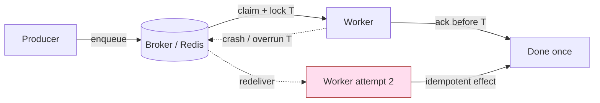
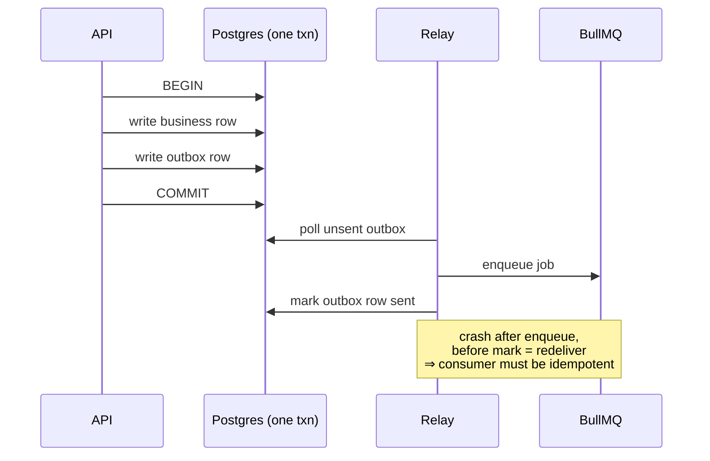
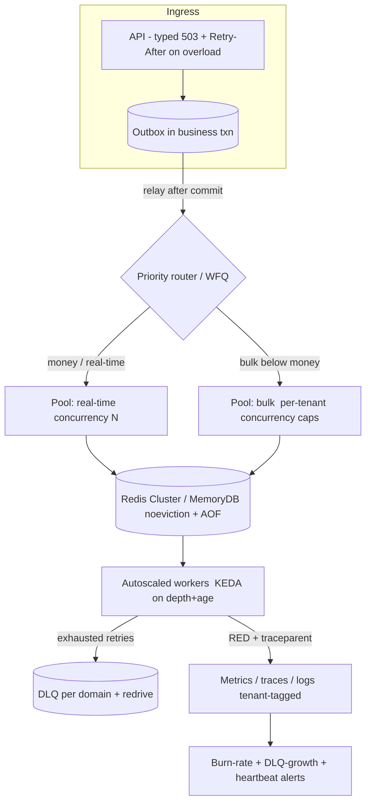

# Enterprise Best-Practice Research - Large-Scale Background Job Processing

> **Objective 3.** A code-verified survey of how the industry runs background jobs at the scale
> TruePoint targets ("millions of users / billions of jobs"), with each practice tied back to the
> **as-built** TruePoint worker system. This file is the research spine the design docs build on:
> [07-target-architecture.md](07-target-architecture.md), [09-reliability-fault-tolerance.md](09-reliability-fault-tolerance.md),
> [10-observability-alerting.md](10-observability-alerting.md), and [11-capacity-finops.md](11-capacity-finops.md)
> all draw their patterns from here. For the as-built inventory see
> [01-current-architecture-audit.md](01-current-architecture-audit.md); for why the dashboard shows
> `Queued: 4 / Awaiting Confirmation: 1` see [02-root-cause-analysis.md](02-root-cause-analysis.md).

## How to read this document — three registers, one framing

Every claim below is labelled with one of three registers. Keep them distinct:

| Register | Meaning | Citation style |
|---|---|---|
| **As-built** | What the code does today | `path:line` in backticks |
| **Intended** | Sanctioned design not yet built (planning docs / ADRs) | `docs/planning/...`, `ADR-00xx` |
| **Recommendation** | This audit's proposal; does **not** exist yet | prose, marked *Recommendation* |

The single most important framing of the whole audit runs through every "Applicability to TruePoint"
note: **most of the darkness in TruePoint's worker system is by design (safe-by-default rollout), not a
defect.** The bulk-enrichment money path is deliberately dark behind an env kill-switch + a per-tenant
flag + a human confirm-before-spend gate. A minority of findings are **genuine defects** — places where
the current code would silently misbehave even with the feature *on*. Each section closes by sorting the
gap into one of those two buckets.

Research is grounded in the six-pack research digest supplied with this audit (URLs preserved inline) and
augmented where noted. Where an industry system is named (SQS, BullMQ, Kafka, Temporal, KEDA, Sidekiq,
Inngest, Stripe, Shopify, Netflix, Airbnb, Segment, GitHub, Google SRE) the citation is the system's own
documentation or engineering blog.

---

## 0. The delivery-semantics baseline (foundational — read first)

Every practice in this document rests on one fact: **broker-level "exactly-once delivery" is impossible
over a lossy network with finite messages** (the Two Generals Problem). What real systems ship is
**at-least-once delivery + idempotent/dedup processing = "effectively-once"** — each message's *side
effects* apply once inside a transaction boundary, even though the message may be *delivered* many times.
(Jack Vanlightly, "RabbitMQ vs Kafka Part 4", jack-vanlightly.com; Hossein Nejati, "Exactly-Once
Delivery: The Myth and the Reality", hosseinnejati.medium.com; Strimzi, "Exactly-once semantics with
Kafka transactions", strimzi.io/blog/2023/05/03.)

The universal at-least-once mechanism is the **visibility timeout / job lock**: the broker hides a claimed
job for T seconds; ack/delete before T ⇒ done; crash (or overrun T) before T ⇒ redelivery — *guaranteed,
not exceptional*. If processing exceeds the timeout the message is delivered twice even with a single
consumer (AWS SQS docs, `sqs-visibility-timeout`). BullMQ's equivalent is the job **lock** with a
`lockDuration`; a handler that stalls the Node event loop past `lockDuration` loses the lock and the job
is re-queued as **stalled** (docs.bullmq.io — Important Notes; discussions/2223).



**Applicability to TruePoint.** TruePoint's broker is **Redis via BullMQ v5** (`apps/workers/package.json:15-16`),
which the BullMQ docs classify as at-least-once ("aims to deliver exactly one time, at least once in worst
case"). The worker fleet sets **no `lockDuration`, `stalledInterval`, or `maxStalledCount` anywhere** in
`apps/workers/src` — BullMQ v5 defaults apply (30 s lock, 1 stalled reclaim). Combined with **concurrency
1 on every worker** and **no per-vendor job timeout**, a hung handler holds the 30 s lock, is reclaimed
once as stalled, and — because most event queues run `attempts: 1` (`register.ts:205,211,217,223,324,330`)
— fails permanently after that single reclaim. So TruePoint *inherits* at-least-once semantics but has
**not yet built the idempotent-consumer discipline that makes at-least-once safe** across all queues. This
is the through-line of [09-reliability-fault-tolerance.md](09-reliability-fault-tolerance.md): every
recommendation below reduces to "make the handler safe to run twice."

---

## 1. Queue orchestration & broker selection

### 1.1 The broker landscape

| System | Model | Delivery | Ordering | Practical ceiling | Best fit |
|---|---|---|---|---|---|
| **BullMQ / Redis** | Redis lists + Lua | at-least-once | none @ concurrency > 1 | single Redis/cluster throughput | Node app, moderate scale |
| **AWS SQS (standard)** | managed queue | at-least-once | best-effort | near-unlimited TPS | ops-light cloud fan-out |
| **AWS SQS FIFO** | managed queue | exactly-once *processing* | per `MessageGroupId` | 300/s (3k batched); high-throughput FIFO 70k/s | order/dedup required |
| **RabbitMQ** | AMQP broker | at-least-once | per-queue | ~tens of k msg/s (~40k class) | complex routing, low latency |
| **Kafka** | log | EOS (idempotent producer + txns) | per-partition | ≥500k msg/s | streaming/replay, high throughput |
| **Temporal / Cadence** | durable execution | exactly-once over the DAG | workflow-ordered | 12B executions/mo @ Uber (Cadence) | long-running stateful sagas |
| **River (Go/Postgres)** | `FOR UPDATE SKIP LOCKED` | at-least-once | none | Postgres | same-DB transactional jobs |
| **Sidekiq / Celery / Faktory** | Redis/pluggable | at-least-once | none | broker-bound | Ruby / Python / polyglot |

Sources: docs.bullmq.io; AWS SQS docs (FIFO-queues-understanding-logic, high-throughput-fifo);
tech-insider.org/kafka-vs-rabbitmq-2026; conduktor.io/glossary/exactly-once-semantics-in-kafka;
temporal.io, cadenceworkflow.io; brandur.org/river.

**Selection heuristics** (research pack 1): same-DB transactional jobs → River/Postgres; Node app at
moderate scale → **BullMQ**; managed cloud fan-out → SQS+SNS (FIFO only when order/dedup truly needed,
accepting 300/s-per-group); complex routing → RabbitMQ; streaming/replay/high throughput → Kafka;
long-running stateful sagas → Temporal. **Always design idempotent consumers regardless of the
"exactly-once" marketing.**

### 1.2 Applicability to TruePoint

**As-built:** TruePoint runs **25 BullMQ queues on one shared IORedis connection**
(`apps/workers/src/register.ts:132`) — `new IORedis(env.REDIS_URL, { maxRetriesPerRequest: null })` is
passed to every `Queue`, every `Worker`, and the mailbox throttle. This is squarely the "Node app,
moderate scale → BullMQ" heuristic and is the **correct starting choice**; BullMQ is a solid primitive and
should not be replaced wholesale.

The **intended** design ([ADR-0027](../decisions/ADR-0027-real-time-delivery-and-event-backbone.md) per the
audit brief) keeps per-domain BullMQ + DLQ + bounded retries and **explicitly defers Kafka** — matching the
"≥500k msg/s before Kafka's TCO wins" heuristic. That is a well-calibrated decision, not a gap.

**Gap type — mostly by-design, one structural limit.** Choosing BullMQ is by-design and appropriate. The
genuine structural limit is that a **single Redis instance is the throughput ceiling and a SPOF** (one
`connection` object at `register.ts:132` for the whole fleet); at target scale this needs Redis Cluster
or a durable managed store (see §17). For long-running multi-step flows (bulk import/enrichment state
machines) the durable-execution pattern (Temporal-style replay) is worth evaluating in
[07-target-architecture.md](07-target-architecture.md) — but that is a *recommendation*, not a
condemnation of BullMQ.

---

## 2. Distributed workers & the composition/deployment model

### 2.1 Industry pattern

Distributed workers are **stateless, horizontally replicated consumers** that pull from a shared broker.
Three disciplines make them safe to run as a fleet:

1. **Idempotent handlers** — redelivery on scale/crash events is guaranteed, so re-running must be a no-op
   after the first success (KEDA prerequisites, keda.sh/docs/2.20/concepts/scaling-jobs).
2. **Graceful shutdown** — on `SIGTERM` a worker must stop consuming, drain in-flight work, and exit inside
   the orchestrator's `terminationGracePeriod`; otherwise a deploy either loses in-flight jobs or hangs
   (KEDA; alxibra.medium.com).
3. **Leader election for singleton work** — sweeps/cron that must run once per tick use a distributed lock
   (Redis `SET NX PX`, or a DB advisory lock) so N replicas don't all fire the same sweep.

Shopify's `job-iteration` adds **interruptible/resumable iteration**: a long job checkpoints a cursor
after each batch and re-enqueues, so any worker can be killed mid-run and resume — making workers safe to
kill for deploys or throttle under DB load (github.com/Shopify/job-iteration; railsatscale.com).

### 2.2 Applicability to TruePoint

**As-built — composition root is sound.** `startWorkers()` (`register.ts:365`) is a clean composition
root: always-on workers are pushed into a `Worker[]` (`register.ts:435-570`), flag-gated workers are
conditionally pushed (`register.ts:577-806`), and repeatable sweeps are registered fire-and-forget
(`register.ts:807-851`). `instrument()` attaches `completed`/`failed` logging listeners
(`register.ts:351-362`).

**Leader election exists and is correct for singletons.** `withLeaderLock(redis, key, ttlMs, fn)` does
`SET key token PX ttl NX` and returns `false` without running `fn` if it doesn't win
(`apps/workers/src/leaderLock.ts:24-25`), with an owner-checked Lua compare-and-delete release
(`leaderLock.ts:10-11,30`). It is correctly described in-code as a **per-tick mutex, not durable
leadership** — only **sweeps** are leader-gated; **event queues have no leader guard** and run on every
instance (which is correct: event queues *want* every replica consuming). With one prod replica the sole
instance always wins, so nothing starves today.

**Graceful shutdown — partially built, one genuine defect.** `index.ts` handles `SIGINT`/`SIGTERM`
(`apps/workers/src/index.ts:26-27`): sets `ready=false`, `await Promise.all(workers.map(w => w.close()))`,
`health.stop(true)`, `process.exit(0)`, with a re-entrancy `draining` guard (`index.ts:16`). But there is
**no drain timeout and no forced close** — with concurrency 1 and no per-job timeout, a single hung job
makes `close()` wait *forever* and the container never exits within `terminationGracePeriod`. **Genuine
defect** (a deploy or scale-in event can hang). *Recommendation:* wrap the drain in `Promise.race` against
a bounded deadline, then force-close — detailed in [13-operational-runbooks.md](13-operational-runbooks.md).

**Resumable iteration — not built.** No `job-iteration`-style cursor-checkpoint exists for the always-on
queues. The bulk-enrichment consumer *does* re-read and chunk (`runBulkEnrich` fan-out; see
[02-root-cause-analysis.md](02-root-cause-analysis.md)) but the general pattern is absent. This is a
**recommendation** for the target, not a current bug, because the always-on jobs are short.

---

## 3. Horizontal autoscaling

### 3.1 Scale on backlog, not CPU

Queue workers idle-block on I/O, so **CPU/memory stay low while backlog explodes** — CPU-based HPA
*under-provisions* a queue fleet. Autoscale on **queue length and, better, message *age*/dwell** instead
(keda.sh; plural.sh/blog/keda-kubernetes-autoscaling).

- **KEDA** is the de-facto Kubernetes pattern: event-driven scalers for SQS, RabbitMQ, Redis/BullMQ, and
  Kafka lag drive the HPA and can **scale-to-zero**, waking pods on arrival. `ScaledJob` = one pod per
  message for long/one-shot work; `ScaledObject` = long-running consumers. Tune `pollingInterval`,
  `cooldownPeriod`, and stabilization windows to damp flapping (keda.sh/docs/2.20/concepts/scaling-jobs;
  oneuptime.com KEDA-SQS).
- ECS equivalent: target-tracking on `ApproximateNumberOfMessagesVisible`, or a backlog-per-task custom
  metric (alxibra.medium.com).
- **Scale on oldest-message-age when jobs vary in size** — depth alone misprices a queue of few-but-huge
  jobs (a 5-job queue where each job is 100k rows is not "nearly empty").

**Prerequisites for safe scale-down:** idempotent workers (redelivery on scale events) + graceful shutdown
(drain in-flight before exit).

### 3.2 Applicability to TruePoint

**As-built:** there is **no autoscaling**. Prod runs a **single `workers` container**
(`docker-compose.prod.yml:115-117`) with no replica controller. The health server binds **port 3002**
(`apps/workers/src/health.ts:7`) but the prod container publishes **no port and defines no `healthcheck`**,
so nothing even probes liveness, let alone drives scaling.

**Intended:** `docs/planning/18-scalability-performance.md` §3 specifies **stateless api+workers that
autoscale on ECS Fargate on queue depth + age per domain** — exactly the industry pattern above. This is a
sanctioned target, not built.

**Gap type — by-design for today, genuine gap for scale.** At the current single-tenant-ish, feature-dark
scale, one worker is a *reasonable* operational choice and not itself a bug. But the two autoscaling
**prerequisites are unmet defects**: (1) idempotency is inconsistent (see §5–6), and (2) graceful shutdown
has no drain timeout (§2.2). Before autoscaling can be turned on, both must be fixed. Autoscaling also
requires the **backlog signals** that don't exist yet — see §11/§14. Sequenced in
[08-migration-strategy.md](08-migration-strategy.md) and [11-capacity-finops.md](11-capacity-finops.md).

---

## 4. Fault tolerance: retries, backoff & jitter

### 4.1 Backoff + jitter

Pure exponential backoff still **synchronizes clients into thundering-herd spikes**; adding randomness
spreads load to a near-constant rate. AWS tested two variants and both slash server load vs no jitter
(AWS Architecture Blog, "Exponential Backoff And Jitter"; AWS Builders' Library, "Timeouts, retries, and
backoff with jitter"):

```
Full Jitter:          sleep = random(0, min(cap, base * 2^attempt))
Decorrelated Jitter:  sleep = min(cap, random(base, prev * 3))
```

Full Jitter does less client work; Decorrelated finishes marginally faster. **Jitter is standard for
remote clients.**

**Retry only transient/retryable errors** — throttling (429), 503, timeouts, connection resets. **Never
retry deterministic failures** (400, 404, validation, auth): they fail identically and only amplify load.
Cap total attempts *and* add an absolute deadline (AWS Builders' Library). Segment's Centrifuge learned
the same: retry only 500s/429s/timeouts, cap attempts, then dead-letter (segment.com/blog/introducing-centrifuge).

### 4.2 Retry budgets — bound the amplification

Retries at every layer multiply: 4 attempts × 3 nested layers ⇒ 4³ = **64 DB hits per user action**.
Bound this. Google SRE uses a per-request cap (~3 attempts) **plus** a per-client budget: retries must stay
under **10 %** of a client's request ratio, else the failure bubbles up (Google SRE Book, "Handling
Overload" / "Addressing Cascading Failures"). Prefer a **token-bucket retry budget** — each success
deposits a partial token, each retry costs a full token, empty bucket ⇒ stop — paired with client-side
throttling and circuit breakers (Marc Brooker, "Fixing retries with token buckets", brooker.co.za).

### 4.3 Applicability to TruePoint

**As-built — inconsistent and mostly untuned.** Retry policy is set per-producer and varies wildly:

| Queue | attempts | backoff | DLQ | Assessment |
|---|---|---|---|---|
| `imports` | 3 | exp 2000 ms | `IMPORTS_DLQ` (`register.ts:379`) | good |
| `bulk-imports` / `bulk-enrichment` | 3 | exp 2000 ms (`bulkEnrichQueue.ts:27-28`) | dedicated DLQ (`register.ts:620,659`) | good (but dark) |
| `master-backfill` | 4 | exp 30000 ms | none (retries → failed set) | partial |
| `reverification` | 3 | exp 60000 ms | none | partial |
| `enrichment`, `scoring`, `dsar`, `outreach`, `dedup`, `firmographics` | **1** | none | **none** (`register.ts:205,211,217,223,324,330`) | **defect** |

**No jitter anywhere** — every backoff is `type: "exponential"` (e.g. `bulkEnrichQueue.ts:28`), which is
pure exponential; BullMQ does not add jitter unless a custom backoff strategy is supplied. **No
transient-vs-deterministic error classification** and **no retry budget** — a poison payload on a
retrying queue re-fails on the same schedule until attempts exhaust.

**Intended:** `docs/planning/19-observability-reliability.md` §9.2 calls for
**transient-vs-deterministic retry classification** and per-bulk-job reconcile — sanctioned, not built.

**Gap type — mixed.** `attempts: 1` on `enrichment/scoring/dsar/...` is **safe-by-design for the queues
with no live producer** (enrichment and scoring have *no live producer wired at all* — they are dark by
absence, not by kill-switch) but is a **genuine reliability defect for the live ones** (`outreach`,
`dedup`, `firmographics` do run): a transient DB blip loses the job with no retry and no DLQ. Adding jitter
and a `defaultJobOptions` retry/backoff floor is a **P1 quick win** in
[04-issue-resolution-plan.md](04-issue-resolution-plan.md) / [15-phased-implementation-plan.md](15-phased-implementation-plan.md).

---

## 5. Idempotency, duplicate prevention & exactly-once *effects*

### 5.1 The pattern

Because transport is at-least-once, **exactly-once must be engineered at the effect layer**:

- **Client-generated idempotency key** (V4 UUID / high-entropy) on every mutating request; the server
  persists the first response (status + body) keyed by it and **replays that stored result on retries** —
  including replaying 5xx. **Never generate the key server-side** (a timeout-retry would mint a new key and
  bypass dedup). Compare stored request params against the retry; mismatch ⇒ error. Expire keys ~24 h
  (Stripe, "Designing robust and predictable APIs with idempotency"; IETF "The Idempotency-Key HTTP Header
  Field" draft).
- **Strongest form: a DB unique constraint in the *same transaction* as the business write**, so dedup and
  effect commit atomically (Stripe blog).
- Stripe/Brandur store a **`recovery_point` (state-machine checkpoint), `locked_at` (concurrency guard with
  timeout), and cached response**, advancing through "atomic phases" that separate *retryable local DB ops*
  from *non-retryable foreign calls* (charges), checkpointing between them (brandur.org/idempotency-keys).

Kafka's broker-level analogue: the **idempotent producer** (PID + per-partition sequence numbers drop
duplicate appends) + **transactions** — but this is Kafka-to-Kafka only; it does not extend to external
sinks (strimzi.io/blog/2023/05/03). The lesson generalizes: **duplicate prevention is a property of the
consumer's write, not the transport.**

### 5.2 Applicability to TruePoint

**As-built — idempotency primitives exist and are used in places.** The email retention sweep deletes
**idempotency keys > 30 days** in batches of 5000 (`register.ts:237` sweep #13), which means an
idempotency-key store already exists in the email/outreach path. The sequence tick enqueues to `outreach`
with a **dedupe jobId `seqstep:{logId}:{step}`** (`register.ts:509`) — a correct BullMQ-level dedup that
prevents the same sequence step being enqueued twice. The mailbox throttle is an **atomic Lua
refill-then-consume** keyed `email:throttle:{mailboxId}` (`apps/workers/src/mailboxThrottle.ts:11-35`) so
"concurrent workers can never oversend one mailbox." These are good, correct primitives.

**But there is no *general* idempotency discipline across the 25 queues.** The event queues with
`attempts: 1` and no dedup key would double-apply on the one stalled-job reclaim BullMQ guarantees (§0).
`processMasterBackfill` is *designed* to be re-runnable (it throws on `errored > 0` to self-heal
`masterBackfillSweep`), which is the right instinct, but is not the norm.

**Duplicate prevention on the money path is *not* the risk — the *lost* job is.** See
[02-root-cause-analysis.md](02-root-cause-analysis.md): the bulk-enrichment DB rows are created with
**zero BullMQ interaction** (`packages/core/src/prospect/bulkActions.ts:337-364`) and the single enqueue
happens **later, outside any shared transaction** in the confirm handler
(`apps/api/src/features/enrichment/routes.ts:101` confirm, then `:119` enqueue). So the failure mode is a
job flipped to `running` whose drive job is **never enqueued** (process dies, or producer returns `null`
because the flag is off) — an **at-least-once *gap*, not a duplicate**. `runBulkEnrich` is resumable only
if a drive job lands, so a lost enqueue is **not self-healing**.

**Gap type — genuine architectural gap (the outbox is the fix, §6).** The idempotency *primitives* are
by-design-good; the *missing* piece is a uniform "handler is safe to run twice" contract and an atomic
enqueue. Detailed in [09-reliability-fault-tolerance.md](09-reliability-fault-tolerance.md) and
[12-security-review.md](12-security-review.md) (idempotency-key spoofing).

---

## 6. Transactional outbox & the dual-write problem

### 6.1 The pattern

A DB write and a queue publish **cannot share one atomic commit** (the dual-write problem): if you write
the row then publish, a crash in between drops the event; if you publish then write, a crash orphans the
event. The **transactional outbox** solves it: write the business row **and** an `outbox` row in **one
local transaction**; a separate relay publishes committed outbox rows and marks them sent
(microservices.io, "Transactional outbox"; AWS Prescriptive Guidance).

- Relay options: **Polling Publisher** (query the outbox) or, preferred, **Transaction Log Tailing / CDC**
  (Debezium reading the WAL) for low-latency, low-load publishing (developer.confluent.io; decodable.co).
- The outbox guarantees **at-least-once, not exactly-once** — the relay can crash after publish, before
  marking sent — so **consumers must still be idempotent** (§5).
- Stripe/Brandur's `staged_jobs` and Shopify's staging table are production instances: jobs are inserted
  **inside the same DB transaction** as the business write; an external enqueuer drains committed rows to
  the queue **only after commit** — no orphaned jobs if the txn rolls back (stripe.com/blog/idempotency;
  shopify.engineering).



### 6.2 Applicability to TruePoint

**Intended — and the current code does the exact thing the ADR forbids.**
[ADR-0027](../decisions/ADR-0027-real-time-delivery-and-event-backbone.md) mandates a **transactional
outbox** ("DB commit ⇒ event published", at-least-once, crash-safe) with idempotent consumers and
**explicitly rejects enqueue-after-commit without an outbox** (it drops events on crash). **As-built, the
confirm path uses precisely the rejected enqueue-after-commit pattern**: DB status flip at
`routes.ts:101`, then a non-transactional enqueue at `routes.ts:119` — the "non-atomic enqueue gap"
documented in [02-root-cause-analysis.md](02-root-cause-analysis.md).

**Partial infra already exists.** A `projection_outbox` table is drained by the daily `projection_sweep`
(`register.ts:265`, sweep #10) — so the **outbox pattern is already in the codebase for the
survivorship-projection domain** (inert while `INGESTION_EVIDENCE_ENABLED` is off, so the outbox is
empty). This is the template to generalize to the enrichment enqueue.

**Gap type — genuine architectural gap, ADR-sanctioned fix.** The enqueue-after-commit on the money path
is a real defect against ADR-0027, though it is masked today because the whole path is flag-dark. The fix
is to route the confirm enqueue through an outbox in the same transaction as the `awaiting_confirmation →
running` flip. Detailed in [09-reliability-fault-tolerance.md](09-reliability-fault-tolerance.md).

---

## 7. Dead-letter queues, poison messages & redrive

### 7.1 The pattern

After `maxReceiveCount` deliveries without deletion, a message is **poisoned** and moved to a **dead-letter
queue** for isolation/debugging — it doesn't block the live queue (AWS SQS Dev Guide, "Using dead-letter
queues"). Rules of thumb:

- **Visibility timeout must exceed worst-case processing time** — too short and a *slow* (not broken)
  message is redelivered concurrently and prematurely DLQ'd (AWS SQS; ranthebuilder.cloud).
- **Process/ack per-item in batch consumers** so one poison message is isolated, not blocking siblings
  (SQS partial-batch-failure reporting; pilotcore.io).
- **DLQ retention at the 14-day max** for triage headroom; **redrive** via an automated replay back to the
  source once the bug is fixed (AWS SQS docs).
- Keep dead-letters **PII-free** where the domain is sensitive (a DLQ is a long-lived store of failed
  payloads).

### 7.2 Applicability to TruePoint

**As-built — 3 of 25 queues have a DLQ, and they are exemplary.** Only `IMPORTS_DLQ` (`register.ts:379`),
`BULK_IMPORTS_DLQ` (`register.ts:620`), and `BULK_ENRICHMENT_DLQ` (`register.ts:659`) exist. They are
routed **only after retries are exhausted** and are **PII-free** — `imports` dead-letters via
`deadLetterFailedImport(importDeadLetterQueue, job, err)` on the `failed` event (`register.ts:379-385`).
This matches best practice: post-retry, isolated, PII-free.

**The other 22 queues have no DLQ.** `enrichment`, `scoring`, `dsar`, `outreach`, `dedup`, `firmographics`,
`master-backfill`, `reverification`, and every sweep drop failures into BullMQ's `failed` set with **no
dead-letter, no redrive path, and — for the `attempts: 1` queues — no retry first**.

**No redrive tooling exists.** There is no scheduled replay from any DLQ back to its source; a fixed poison
message stays dead-lettered until manually handled.

**Gap type — mixed.** The *design* of the three DLQs is by-design-correct and should be the template. The
absence of DLQs on the live event queues (`outreach`, `dedup`, `firmographics`) is a **genuine defect** —
a failed job there is simply lost. The absence on dark/no-producer queues is safe-by-default. Universal DLQ
+ redrive is the top item in [09-reliability-fault-tolerance.md](09-reliability-fault-tolerance.md); DLQ
PII hygiene is reviewed in [12-security-review.md](12-security-review.md).

---

## 8. Priority queues & weighted fair queuing

### 8.1 The pattern

**Strict priority starves** low tiers and causes head-of-line blocking. **Weighted Fair Queuing (WFQ)**
maintains per-tenant virtual queues, cycling small batches from each, weighted by tier — a free tenant
gets 1/10 the share of an enterprise tenant but is **never starved** (systemdr.systemdrd.com). **Burst-Aware
WFQ (2024)** cut a P99 latency gap from 8.5 s → 2.1 s while retaining 94 % throughput
(publisher.uthm.edu.my JSCDM/BWFQ).

- **Netflix Timestone**: enqueue with **deadlines**, dequeue **earliest-deadline-first**; **exclusive
  queues** mark non-parallelizable work without consumer-side locking; ~30k dequeue RPS @ P99 45 ms
  (netflixtechblog.com).
- **BullMQ** supports per-job **priority**, **rate limiting** (`max`/`duration`), and **groups** with
  per-group concurrency + rate caps (bullmq.io; markaicode.com).
- Prioritization principle for cost systems: **bulk below money/real-time.**

### 8.2 Applicability to TruePoint

**As-built — no priority anywhere.** No queue sets a BullMQ `priority`, and each domain is a *separate
queue* rather than one queue with priority classes — so isolation is by physical queue, not by weight. All
25 queues are equal-footing at concurrency 1.

**Intended:** `docs/planning/18-scalability-performance.md:221` states **"Priority: bulk below
money/real-time"** and §9.1 sets an ER latency SLO of p95 < 15 min *fair-share* — i.e. WFQ intent is
sanctioned but unbuilt.

**Gap type — by-design-adequate today, gap for scale.** With one replica and dark bulk queues, the lack of
priority causes no observable harm — the real-time outreach tick and the daily sweeps don't contend
meaningfully. It becomes a **genuine gap** the moment bulk-enrichment is enabled at scale, where a large
bulk run on a shared worker could starve real-time work. *Recommendation:* separate worker pools
(bulkheads) or BullMQ groups so bulk cannot starve money/real-time — see
[07-target-architecture.md](07-target-architecture.md) and [11-capacity-finops.md](11-capacity-finops.md).

---

## 9. Rate limiting & metered-spend control

### 9.1 The pattern

Rate limiting protects **downstream dependencies** (a vendor API) and **enforces per-tenant fairness**.
The token bucket is the canonical algorithm: a bucket refills at a steady rate up to a burst capacity;
each unit of work consumes a token; empty bucket ⇒ defer/deny. BullMQ exposes queue-level rate limiting
(`max`/`duration`, e.g. 10 jobs/s) and per-**group** rate caps (bullmq.io). For metered/paid work, rate
limiting doubles as a **spend guardrail** — the same brake that protects the vendor caps the bill.

### 9.2 Applicability to TruePoint

**As-built — one excellent, atomic rate limiter, scoped to email.** `createRedisMailboxThrottle(connection,
{ capacity: 10, refillPerSec: 1 })` (`register.ts:372`) is a per-mailbox token bucket implemented as an
**atomic Lua refill-then-consume** keyed `email:throttle:{mailboxId}`
(`apps/workers/src/mailboxThrottle.ts:11-35,44-63`). A denied send returns `retryAfterMs`, which the
outreach processor uses as a **re-enqueue delay — "defer, never drop"** (`mailboxThrottle.ts:4`;
outreach throttle → deferred re-enqueue, not a failure, per the audit brief). This is exactly the
best-practice token-bucket pattern, done atomically so "concurrent workers can never oversend one mailbox."

**No BullMQ-level rate limiting on any queue**, and no rate limit on the metered enrichment-vendor calls in
the worker (the mailbox throttle is email-specific). The bulk-enrichment spend brakes live *inside*
`bulkProcessEnrichChunk` (the only spend step, with per-batch credit-lease brakes — see
[02-root-cause-analysis.md](02-root-cause-analysis.md)), not as a queue rate limiter.

**Gap type — by-design for email (correct primitive), gap for enrichment spend at scale.** The email
throttle is a model to generalize. When bulk-enrichment goes live, a **per-tenant enrichment rate limit**
(protecting both the vendor and the tenant's balance) should be added as a queue/group limiter; today the
spend control is the confirm-gate + in-chunk credit lease, which is safe-by-design but not a *rate*
control. Metered-spend guardrails are owned by [11-capacity-finops.md](11-capacity-finops.md).

---

## 10. Job scheduling (cron, delayed, durable timers)

### 10.1 The pattern

Three scheduling needs, three patterns:

- **Recurring (cron)**: a repeatable job fires on a schedule; in a fleet it must be **leader-gated** so N
  replicas don't all fire it. BullMQ repeatable jobs with a stable `jobId` dedupe naturally.
- **Delayed / scheduled-once**: **Airbnb Dynein** separates *scheduling durability* from *execution* —
  delayed jobs land in an inbound queue, a scheduler persists a per-job trigger in **DynamoDB** ("jobs
  overdue now"), then dispatches to an SQS service queue at fire time; guarantees at-least-once, survives
  restart, ~10 s accuracy (medium.com/airbnb-engineering/dynein).
- **Long-running / stateful**: **durable-execution engines** (Temporal/Cadence) replace ad-hoc delayed
  queues with **durable timers** backed by a persisted event history; distributed cron becomes a
  first-class workflow (uber.com/blog/announcing-cadence; temporal.io).

Treat **backfills/migrations as pausable, observable jobs** (Shopify `maintenance_tasks`), not fire-and-
forget scripts.

### 10.2 Applicability to TruePoint

**As-built — a solid leader-gated cron fleet.** TruePoint schedules **14 repeatable sweeps** via
`void schedule*().catch(log.error)` (`register.ts:807-851`), each guarded by `withLeaderLock`. Intervals
are correct for the work: `email_sequence_tick` every **60 s** (leader TTL 55 s, `register.ts:228`),
`email_token_refresh` every **2 min** (TTL 110 s, `register.ts:246`), `subscription_grant_sweep` every
**15 min**, `ledger_backfill_sweep` every **5 min**, and the rest **daily**. Stable `jobId`s dedupe the
repeatables. The leader TTLs are correctly sized *below* the interval so a crashed holder's lock frees
before the next tick — this is careful engineering.

Delayed jobs are supported at the queue level: `outreach` supports a `delay` (`enqueueOutreach`,
`register.ts:222`), and the sequence tick re-enqueues throttled sends with a delay. There is **no
Dynein-style durable scheduling store** and **no durable-execution engine** — scheduling durability rests
entirely on Redis persistence.

**One environment-specific hazard:** dev Redis runs `--save "" --appendonly no`
(`docker-compose.yml:21`), so a **dev Redis restart wipes all repeatables + queued jobs**; prod uses
`--appendonly yes` (`docker-compose.prod.yml:26`). A repeatable that fails to register at boot (see the
buffered-`void schedule*().catch` boot hazard in §14) simply never fires and **`.catch` never sees a
rejection**.

**Gap type — by-design-good, two watch-items.** The cron fleet is well-built and correct. The two
watch-items — dev-Redis wipe and the buffered boot-time registration — are **genuine operational
hazards** (runbooks in [13-operational-runbooks.md](13-operational-runbooks.md)), not design flaws. A
durable scheduling store is a *recommendation* only if scheduling accuracy/SLOs tighten at scale.

---

## 11. Queue partitioning, sharding & multi-tenant fairness

### 11.1 The pattern

- **Queue-per-tenant (or per-function)** is the strongest isolation. **Inngest** uses a **two-tier
  design**: a queue per function + a higher-level index queue holding each function's earliest-available
  job; workers **priority-shuffle** peeked jobs into weighted-random order to avoid thundering-herd
  contention on hot functions (inngest.com/blog, "Building the Inngest queue pt.1").
- **AWS SQS Fair Queues (2025)**: tag messages with `MessageGroupId` = tenant; SQS continuously monitors
  in-flight distribution, **identifies the noisy tenant**, and **reorders delivery to prioritize quiet
  tenants** — no added API latency, **no per-tenant rate cap** (the noisy tenant still drains on spare
  capacity) (aws.amazon.com/blogs/compute, "Building resilient multi-tenant systems with SQS Fair Queues").
- **Per-tenant concurrency limits are the primary noisy-neighbor dial** — Inngest's follow-up isolates
  per-tenant concurrency so one account's 5,000-message burst can't block another's single job
  (inngest.com/blog, "Fixing multi-tenant queueing"). Combine **quotas + weights + per-tenant concurrency +
  rate limits** (csoonline.com, "The noisy tenants").
- **Sharding:** Redis Cluster auto-shards (16384 hash slots); keep the **queue Redis separate from cache
  Redis** so a cache stampede can't take the queue down (oneuptime.com BullMQ). ~50k jobs/min on one Redis
  + 8 workers; the bottleneck is usually the downstream API, not the broker.
- Segment's lesson: **never mix fresh + retried traffic in one queue** — a single slow destination causes
  head-of-line blocking; use **per-(customer, endpoint) queues** (segment.com/blog/introducing-centrifuge).

### 11.2 Applicability to TruePoint

**As-built — partitioning is by *domain*, not by *tenant*.** The 25 queues partition work by **function**
(imports vs enrichment vs outreach vs …) — the "queue-per-function" half of Inngest's model. But **within a
queue there is no per-tenant isolation**: `enrichment`, `outreach`, `dedup`, etc. are single global queues
shared by all tenants at concurrency 1, so a large tenant's backlog **head-of-line-blocks** every other
tenant on that queue. The `reverification` queue is described as "a per-workspace queue" in-code
(`register.ts:174` comment) but is still one BullMQ queue keyed by data, not physically sharded per tenant.

**One shared Redis for everything** — the same `connection` (`register.ts:132`) backs queues *and* the
mailbox throttle. There is **no separation of queue Redis from cache Redis** and **no Redis Cluster**, so
the broker is a single shard and a SPOF.

**Intended:** `docs/planning/18-scalability-performance.md` §9/§11.2 specifies **per-tenant bulk concurrency
caps** and ER fair-share (§9.1) — the WFQ/per-tenant-concurrency intent, unbuilt.

**Gap type — by-design today, top scale gap.** With dark bulk queues and effectively low multi-tenant
concurrency, head-of-line blocking is not observable now, so single global queues are a reasonable current
choice, not a bug. It is the **#1 genuine gap for the target scale**: at millions of users, per-tenant
concurrency isolation (the "primary noisy-neighbor dial") and a sharded/separated queue Redis are
mandatory. Sequenced in [07-target-architecture.md](07-target-architecture.md), capacity-modelled in
[11-capacity-finops.md](11-capacity-finops.md), tenant-isolation-reviewed in
[12-security-review.md](12-security-review.md).

---

## 12. Backpressure & load shedding

### 12.1 The pattern

**Queues don't fix overload — they defer it.** An unbounded queue converts a throughput problem into an
**unbounded-latency + OOM** problem; if arrival > service rate *sustainedly*, only more consumers or
**shedding** helps. Size buffers for **bursts, not sustained overload** (Fred Hébert, "Queues Don't Fix
Overload" and "Handling Overload", ferd.ca).

- Use **bounded queues** so a full buffer pushes back on producers (block/reject).
- **Shed lowest-priority first** to keep critical work flowing; combine with **bulkheads** (isolated pools)
  + **circuit breakers** so a failure in one tier (API→queue→worker→DB) doesn't cascade
  (dev.to/devcorner, distributed backpressure).
- **Prefer shedding at ingress** over deep-queue timeouts — reject work that will exceed its deadline on
  *enqueue*, not after executing it, to avoid "dead work."
- Autoscaling and backpressure are complementary: scale first, shed when scaling can't keep up.

### 12.2 Applicability to TruePoint

**As-built — no backpressure, no load shedding, no circuit breakers.** All 25 queues are **unbounded**;
producers enqueue unconditionally (e.g. `enqueueDedup`/`enqueueFirmographics` fire on every import
completion, `register.ts:393,398`). There is **no bounded buffer, no ingress shedding, no circuit breaker,
and no typed 503 + Retry-After** on the producer side.

The one exception is a **local, deliberate backpressure**: the outreach mailbox throttle **defers** (re-
enqueues with delay) rather than failing when a mailbox is over its rate (`mailboxThrottle.ts:4`;
outreach re-enqueue) — a correct, narrow instance of "push back, don't drop."

**Intended:** `docs/planning/18-scalability-performance.md` §9 specifies **depth/age → autoscale → shed/
slow producers**, DLQ + alerts, and per-tenant bulk concurrency caps; §4 of
`docs/planning/19-observability-reliability.md` adds **circuit breakers + typed 503 + Retry-After**.
[ADR-0036](../decisions/ADR-0036-bulk-async-job-and-staging-pipeline.md) specifies **server-owned ~10k
chunking + backpressure** for bulk import/export. All sanctioned, unbuilt.

**Gap type — by-design-tolerable now (dark, single-tenant-ish load), genuine gap for scale.** An unbounded
queue is fine while arrival ≪ service rate, which holds today. It becomes a **genuine reliability defect at
scale**: a burst with no shedding grows Redis memory and, with `maxmemory-policy` other than `noeviction`,
would silently drop job keys (§17). *Recommendation:* bounded queues + ingress shedding + circuit breakers
per ADR-0036/§9/§4 — in [09-reliability-fault-tolerance.md](09-reliability-fault-tolerance.md) and
[11-capacity-finops.md](11-capacity-finops.md).

---

## 13. Resource optimization

### 13.1 The pattern

- **Right-size concurrency to the bottleneck.** For I/O-bound handlers, per-worker concurrency > 1 keeps
  the CPU busy while jobs wait on the network; for CPU-bound handlers, keep units small so they don't stall
  the event loop past `lockDuration` (docs.bullmq.io — Important Notes).
- **Memory hygiene:** GitHub's Resque **forks a child per job** so leaked memory is reclaimed on completion
  and stuck children can be killed (github.blog, "Introducing Resque").
- **Checkpoint + re-enqueue long jobs** so they can be interrupted for deploys/throttling and resumed at a
  cursor (Shopify job-iteration).
- **Scale-to-zero** idle consumers (KEDA) to stop paying for idle workers.
- **Separate the queue broker from other Redis workloads** so cache pressure doesn't steal queue capacity
  (oneuptime.com).

### 13.2 Applicability to TruePoint

**As-built — concurrency 1 on *every* worker.** No `concurrency`, `limiter`, or `lockDuration` is set
anywhere in `apps/workers/src` (zero matches per the audit brief; confirmed by the absence in
`register.ts` worker constructions, e.g. `new Worker<ImportJobData>(IMPORTS_QUEUE, processImport,
{ connection })`, `register.ts:375`). For **I/O-bound** handlers (enrichment vendor calls, DB writes,
email sends) concurrency 1 **under-utilizes each worker** — the CPU idles while one job waits on the
network. There is **no per-job fork/isolation** (Bun process model) and **no scale-to-zero** (single
static container).

**One deliberate optimization:** the mailbox throttle's Lua is atomic and its buckets **expire once fully
refilled + margin** (`mailboxThrottle.ts:48`) so idle tenants don't accumulate Redis keys — good hygiene.

**Gap type — by-design-conservative, tunable.** Concurrency 1 is the *safe* default (it sidesteps the
ordering and lock-contention questions) and is not a *bug*; but it is the primary **resource-optimization
lever** left on the table. Because the handlers are I/O-bound, raising per-worker concurrency (with a tuned
`lockDuration` and idempotent handlers) is a high-leverage, low-risk change once §5–6 land. Modelled in
[11-capacity-finops.md](11-capacity-finops.md) (Little's law: throughput = concurrency ÷ service time).

---

## 14. Worker health monitoring

### 14.1 The pattern

- **Distinguish liveness from readiness** — liveness = "process is up"; readiness = "can accept work"
  (broker reachable, not draining). A readiness probe that never checks the broker is **liveness in
  disguise** and will report "ready" while the consumer is wedged.
- **Add a process-loop heartbeat** (e.g. a 5-min ping *from the consume loop itself*), not just per-job
  pings — this catches **"silent consume-loop death"** where the process lives but stopped pulling work
  (drumbeats.io/queue-worker-monitoring).
- **Three primary queue-health alerts:** DLQ growth, consumer-count drop, missed heartbeats (drumbeats.io).
- Ops signal (GitHub Aqueduct): **queue depth that never drains to 0 = worker saturation or stuck jobs** —
  monitor depth vs worker capacity as a core SLO (github.blog).
- The orchestrator must **actually probe** the health endpoint and restart on failure — an unprobed health
  server is decorative.

### 14.2 Applicability to TruePoint

**As-built — a liveness/readiness server that is never probed and never checks the broker.** `health.ts`
serves `GET /health` → 200 liveness and `GET /ready` → 200/503 from the `isReady` closure
(`apps/workers/src/health.ts:15-20`). But **`/ready` never checks Redis or queue depth** — it reflects
only the in-process `ready` flag, which is `true` until `SIGTERM` (`index.ts:10,18`). So the classic
failure the pattern warns about is **built in**: because `maxRetriesPerRequest: null` makes ioredis
**reconnect forever and buffer commands instead of erroring**, a **wedged consumer keeps `/health` at 200
and `/ready` at 200** while processing nothing — "silent consume-loop death" that health checks cannot see.

**Worse, nothing probes the endpoint.** The prod `workers` container defines **no `healthcheck` and
publishes no port** (`docker-compose.prod.yml:115-117`), so `health.ts:3002` is **effectively never
probed** and a wedged worker is **never auto-restarted**. There is **no consume-loop heartbeat, no
DLQ-growth alert, and no consumer-count monitor.**

**Admin visibility is thin:** `apps/api/src/features/admin/systemHealthProbes.ts` live-probes **only 3 of
25 queues** (imports, bulk-imports, reverification, `:54-58`) with bounded ~1.5 s timeouts,
`Promise.allSettled`, and an honest `reachable:false` (`:64-83`). The other **22 queues have no depth/age/
DLQ signal** at all.

**Gap type — genuine defects, top-priority.** Three concrete defects: (1) `/ready` doesn't check Redis
(makes readiness meaningless under the exact failure that matters); (2) the prod container has no
healthcheck so wedges never self-heal; (3) no consume-loop heartbeat. These are **not by-design** — they
are the failure modes the live-inspection runbook exists to catch
([03-live-inspection-runbook.md](03-live-inspection-runbook.md)). Fixes (a Redis-aware `/ready`, a prod
healthcheck, a heartbeat) are P0/P1 quick wins in
[15-phased-implementation-plan.md](15-phased-implementation-plan.md).

---

## 15. Observability: metrics, tracing & logs

### 15.1 Metrics — combine RED + USE, and age beats depth

- **RED** (Rate, Errors, Duration — Tom Wilkie) is the *service* view: treat each **job execution as a
  request** — jobs/sec, failed jobs, duration histograms (p50/p95/p99) (grafana.com/blog/the-red-method).
- **USE** (Utilization, Saturation, Errors — Brendan Gregg) is the *resource* view: worker CPU/mem,
  concurrency/thread-pool saturation, connection-pool exhaustion (last9.io). RED + USE are complementary.
- **Google's Four Golden Signals** (latency, traffic, errors, saturation) is the SRE superset (sre.google).
- **Async-specific SLI — oldest-message age, not just depth.** Age (time from the oldest waiting job's
  enqueue to now) directly reflects user-perceived staleness; **depth alone hides slow drain**. AWS
  `ApproximateAgeOfOldestMessage` and Sidekiq's `queue latency` are the canonical signals — **alert on
  rising age even when depth is flat** (docs.aws.amazon.com SQS metrics; github.com/fastly/sidekiq-prometheus).
- **Core async metric set:** queue depth, DLQ depth, consumer count, job wait latency, job run duration
  (web-alert.io). BullMQ exposes per-queue Prometheus gauges (active/pending/delayed/failed) via
  `bullmq-prometheus` (github.com/igrek8/bullmq-prometheus).
- **DLQ / failed-count growth is the single most actionable signal** — it means user actions permanently
  failed.

### 15.2 Tracing & logs

- **Distributed tracing across the enqueue boundary:** the producer must **inject W3C `traceparent`/
  `tracestate`** into message headers so the consumer span correlates to the producer. OTel messaging
  semconv uses **span links (not parent-child) as the default** producer↔consumer correlation — the only
  structure that holds under batching (opentelemetry.io/docs/specs/semconv/messaging). Span kind PRODUCER
  on publish, CONSUMER on process.
- **Structured logging + one correlation ID across all RPCs and jobs**; for multi-tenant systems add
  `tenant_id`/`workspace_id` and `job_id`/`queue` as structured tags so every log line is filterable by
  tenant and correlatable to its trace (sre.google/sre-book/monitoring-distributed-systems).
- **Duplicate executions must be observable** (dedup/retry-count metrics), not silently double-counted in
  RED rates — a consequence of at-least-once.

### 15.3 Applicability to TruePoint

**As-built — thin but honest.** Observability today is: the liveness/readiness server (§14); JSON-line logs
via a minimal logger (`apps/workers/src/logger.ts:9-11`, info/warn→stdout, error→stderr) with **no
correlation id, no tenant/workspace tags, and no log shipper**; per-job `instrument()` `completed`/`failed`
log lines (`register.ts:351-362`); 3 DLQs (§7); and the 3-of-25 admin pull-probe (§14). **No telemetry
library is installed** — no OpenTelemetry, no Sentry/GlitchTip, no Prometheus/prom-client, no StatsD,
X-Ray, or PostHog. (`@opentelemetry/api` appears in `bun.lock` only as an unused optional peer of
drizzle-orm.) `apps/api/src/instrumentation.ts` is a **boot warmup** — DB pool + JWKS pre-fill — **not
telemetry**, despite the filename.

So **none** of RED, USE, oldest-message-age, trace context propagation, or tenant-tagged structured logs
exists as built.

**Intended:** `docs/planning/19-observability-reliability.md` §1 specifies **CloudWatch + Grafana (RED,
queue depth/age)**, structured logs with **one correlation id + tenant/workspace tags**, **X-Ray traces**,
**GlitchTip errors**, **PostHog**, and **CloudWatch Synthetics**; §9 adds **per-bulk-job telemetry** —
rows/sec, three-way **succeeded/failed/unprocessed** reconcile, DLQ depth, and transient-vs-deterministic
retry classification. Fully sanctioned, none built.

**Gap type — genuine gap, but the darkness is expected at this maturity.** The absence of a telemetry stack
is not a "safe-by-default" darkness — it is a **real gap** that makes the live env hard to reason about
(which is *why* [03-live-inspection-runbook.md](03-live-inspection-runbook.md) leans on `redis-cli` and DB
queries instead of dashboards). The **primitives to build on exist** (structured JSON logs, per-job
instrument hooks, DLQs, the admin probe). Full build-out is
[10-observability-alerting.md](10-observability-alerting.md); the minimal first step (oldest-job-age +
DLQ-depth + consumer-count, tenant-tagged logs) is a P1 in
[15-phased-implementation-plan.md](15-phased-implementation-plan.md).

---

## 16. SLOs, error budgets & alerting

### 16.1 The pattern

- **Define SLIs, then SLOs + error budgets.** For async, define the SLI as the **ratio of jobs completed
  within a latency target** (a *freshness* SLO), not just success rate (sre.google/workbook/alerting-on-slos).
- **Multiwindow, multi-burn-rate alerting** is Google's default: a **long window** detects a sustained
  issue and a **short window** confirms it's still current (both must fire), which cuts noise while keeping
  fast detection. Canonical 30-day-budget thresholds: **14.4× over 1 h** (page, 2 % budget), **6× over 6 h**
  (page, 5 %), **1× over 3 d** (ticket, 10 %) (docs.cloud.google.com/stackdriver, burn-rate).
- **Page on symptoms (user-visible), not causes.** A page answers "what's broken" (symptom); a dashboard
  answers "why" (cause). Over-alerting on causes is the anti-pattern; progressively turn off cause-based
  pages (cloud.google.com/blog, "Why focus on symptoms, not causes"; sre.google).
- **Three primary async alerts:** DLQ/failed growth, consumer-count drop, missed heartbeats (drumbeats.io).

### 16.2 Applicability to TruePoint

**As-built — no SLOs, no error budgets, no alerting.** There is **no burn-rate alerting, no symptom-based
alert catalog, no on-call severity ladder, and no per-alert runbook wiring** in code. The only failure
surfacing is `log.error` lines (e.g. `register.ts:807-851` sweep-registration `.catch(log.error)`, the
dead-letter routing error at `register.ts:381`) landing in stdout/stderr with no shipper, and the
best-effort admin probe (§14). Nothing pages a human.

**Intended:** `docs/planning/19-observability-reliability.md` §2–§3 specifies **SLOs + monthly error
budgets** with fast/slow **burn-rate alerts gating releases**, **symptom-based alerting** (SLO burn, error
rate, queue age, DLQ growth, replica lag), a **severity ladder + on-call + per-alert runbooks**;
[ADR-0024](../decisions/ADR-0024-performance-slos-and-capacity-model.md) sets the SLO/error-budget model
and **99.9 % availability**. Sanctioned, unbuilt.

**Gap type — genuine gap.** Like §15 this is a real gap, not by-design darkness — but it is *downstream* of
§15 (you cannot alert on burn rate without the metrics to compute it). Sequence: metrics → SLOs → burn-rate
alerts. The **three quick-win alerts** (DLQ growth, consumer-count/heartbeat, oldest-job-age) can ship the
moment §14–15's minimal signals exist. Full catalog in
[10-observability-alerting.md](10-observability-alerting.md); operator response in
[13-operational-runbooks.md](13-operational-runbooks.md).

---

## 17. HA, DR & multi-region for the queue + Redis layer

### 17.1 Redis durability & HA (the layer TruePoint depends on)

- **BullMQ requires `maxmemory-policy noeviction`** — the *only* policy that guarantees correct queue
  behavior; any eviction policy silently drops job keys (docs.bullmq.io/guide/going-to-production).
- **Persistence:** BullMQ recommends **AOF with `appendfsync everysec`** (~1 s worst-case loss) over RDB
  snapshots (minutes of loss). AOF is a **durability floor, not HA** — a lost primary still needs failover.
- **Redis Sentinel** (HA within a region): primary-replica + ≥3 Sentinels across failure domains; a quorum
  agrees the primary is down and promotes a replica. **Async replication ⇒ non-zero RPO** (acked-but-
  unreplicated writes are lost on failover). Good < ~50 GB, no sharding.
- **Redis Cluster** (scale + HA): 16384 hash slots sharded across primaries with replicas, auto-failover
  per shard; needs cluster-aware clients + key co-location (hash tags). Guidance: **start Sentinel, move to
  Cluster when size/throughput demands.**
- **Managed durability fork:** **ElastiCache** acks on primary-processed ⇒ can lose recent writes on node
  failure even with persistence; multi-AZ failover ~35 s. **MemoryDB** commits writes to a **multi-AZ
  transaction log before ack** ⇒ **RPO ≈ 0**, failover < 20 s unplanned. **For a job queue that can't lose
  enqueued work, MemoryDB's semantics map best** (aws.amazon.com/memorydb/faqs).

### 17.2 Multi-region & DR

- **Active-passive:** one region takes writes; the secondary replicates and is promoted on DR. ElastiCache
  **Global Datastore** gives cross-region RPO < 1 s, RTO < 1 min. Simpler; keep idempotency + a re-drain
  step for the stale/duplicate-job window at cutover.
- **Active-active (Redis Enterprise CRDBs):** multi-primary via CRDTs, strong eventual consistency —
  **Enterprise/Cloud only, not OSS**. **Caveat for queues: CRDTs give no distributed locks/ordering**, so
  running one logical BullMQ queue active-active across regions risks **double-processing** — prefer
  **region-pinned queues with active-passive failover**, not shared active-active queue state.
- **Define RTO/RPO per tier**, back up (AOF + snapshots), and **rehearse restore** — untested backups
  aren't DR. AWS Well-Architected **REL12-BP04** mandates testing resiliency via fault injection; run
  **game days** (AWS FIS / Gremlin) that force Redis primary failover, add latency, block Redis, and
  terminate workers — verifying jobs re-drain, no loss beyond RPO, and failover within RTO
  (docs.aws.amazon.com/wellarchitected; oneuptime.com chaos-engineering-game-days).

### 17.3 Applicability to TruePoint

**As-built — single region, single container, single Redis, no DR.** Prod is **one `workers` container**
(`docker-compose.prod.yml:115-117`) against **one Redis** (`register.ts:132`). Prod Redis persistence is
**AOF on** (`--appendonly yes`, `docker-compose.prod.yml:26`) — the recommended durability floor — but
**dev Redis is `--save "" --appendonly no`** (`docker-compose.yml:21`), so a dev restart **wipes all
repeatables + queued jobs** (§10). There is **no Sentinel, no Cluster, no managed MemoryDB, no multi-AZ
replica, no cross-region standby, and no game-day tooling.**

**`maxmemory-policy` is unverified in the briefing.** The briefing does not cite a `maxmemory-policy noeviction`
setting for prod Redis. **[NEEDS VERIFICATION]** — this is the single most important Redis correctness knob
for BullMQ (a non-`noeviction` policy silently drops job keys under memory pressure). The runbook must
confirm it on the live env ([13-operational-runbooks.md](13-operational-runbooks.md)).

The **at-runtime Redis-unreachable behaviour is a genuine hazard:** `maxRetriesPerRequest: null`
(`register.ts:132`) makes ioredis **reconnect forever and buffer commands** — workers block silently, jobs
stay "Queued," **no crash, `/health` stays 200** (§14). A wedged Redis does **not** self-heal.

**Intended:** `docs/planning/19-observability-reliability.md` §6 specifies **DR RTO 1 h / RPO 5 min
cross-region warm standby**, §4 multi-AZ + circuit breakers, §7 chaos/game days;
[ADR-0024](../decisions/ADR-0024-performance-slos-and-capacity-model.md) sets 99.9 % availability. Fully
sanctioned, none built.

**Gap type — by-design for MVP scale, genuine gap for the target.** A single region is a legitimate MVP
posture and not itself a defect. The **genuine defects within that posture** are: the unverified
`maxmemory-policy` (**data-loss risk**), the dev-Redis no-persistence wipe (**dev-only, still a footgun**),
and the buffer-forever wedge with no self-heal (§14). For the target scale, adopt **region-pinned queues +
active-passive failover** (never shared active-active queue state) on **MemoryDB or durable-storage
ElastiCache**, validated by recurring FIS/Gremlin game days. Detailed in
[09-reliability-fault-tolerance.md](09-reliability-fault-tolerance.md) and
[07-target-architecture.md](07-target-architecture.md).

---

## 18. Scaling to millions of users / billions of jobs — reference architectures

### 18.1 What "billions of jobs" looks like in practice

| System | Scale | Key pattern | Source |
|---|---|---|---|
| **Uber Cadence** | ~12B workflow executions/mo, 4,000+ domains | durable execution (replay from event history) + multi-tenant noisy-neighbor isolation | uber.com/blog/announcing-cadence; infoq.com |
| **Netflix Timestone** | ~30k dequeue RPS @ P99 45 ms | Redis+Kafka+Flink+ES; deadline-ordered priority queue; exclusive queues | netflixtechblog.com |
| **Shopify** | core monolith backfills | interruptible/resumable `job-iteration` + `maintenance_tasks` (pause/resume/cancel) | github.com/Shopify/job-iteration |
| **Airbnb Dynein** | delayed jobs at scale | SQS + DynamoDB trigger store; scheduling durability separated from execution | medium.com/airbnb-engineering |
| **Stripe** | payment idempotency | `staged_jobs` in the business txn + idempotency keys with recovery_point | stripe.com/blog/idempotency |
| **Segment Centrifuge** | webhook fan-out | per-(customer,endpoint) queues; no shared retry queue | segment.com/blog |
| **GitHub Resque/Aqueduct** | CI/webhooks | fork-per-job memory reclaim; depth-never-drains-to-0 = saturation SLO | github.blog |

**Cross-cutting patterns that recur at every scale:**

1. **At-least-once + idempotent consumers** — never rely on transport "exactly-once."
2. **Isolate queues by tenant/destination**; never mix fresh + retried traffic.
3. **Checkpoint + re-enqueue** long jobs; make every batch idempotent.
4. **Stage jobs in the DB transaction**, drain after commit (outbox).
5. **Separate the durable scheduling store from the execution queue.**
6. **Capped exponential backoff + jitter + DLQ**; classify retryable vs terminal.
7. **Durable-execution engines** for multi-step/long-lived flows over hand-rolled state.
8. **Treat backfills/migrations as pausable, observable jobs.**
9. **SLO on queue depth, oldest-message age, and worker saturation.**

### 18.2 A target reference shape



### 18.3 Applicability to TruePoint

**As-built vs the target — the honest distance.** TruePoint today has the **left-of-broker primitives**
(BullMQ, leader-locked sweeps, 3 exemplary PII-free DLQs, health/readiness server, JSON logs, atomic
token-bucket throttle, fail-closed dual-gating) but **none of the scale layer**: no outbox (it uses the
enqueue-after-commit pattern ADR-0027 rejects — §6), no priority/WFQ, no per-tenant concurrency isolation,
no backpressure, no autoscaling, no metrics/traces/alerting, and no HA/DR/multi-region. The single shared
Redis (`register.ts:132`) and single prod container (`docker-compose.prod.yml:115-117`) are the current
throughput ceiling and SPOF.

**The framing that matters:** the *distance* is large, but **most of it is by-design darkness, not
brokenness.** The money path is intentionally dark behind an env kill-switch + per-tenant flag + human
confirm-gate (see [02-root-cause-analysis.md](02-root-cause-analysis.md)); the sweeps are intentionally
inert until their flags flip. The genuine defects — the ones that would misbehave *with the feature on* —
are a **short, tractable list**: no Redis-aware `/ready`, no prod healthcheck, no drain timeout, `attempts:
1`/no-DLQ on live event queues, no jitter, the non-atomic enqueue (outbox gap), the unverified
`maxmemory-policy`, and no observability/alerting. Those are the P0/P1 backlog in
[04-issue-resolution-plan.md](04-issue-resolution-plan.md) and
[15-phased-implementation-plan.md](15-phased-implementation-plan.md).

**Recommendation (sequencing to the target):** (1) close the genuine defects (health/ready, drain timeout,
retry+DLQ floor with jitter, `maxmemory-policy` verification); (2) build the minimal observability triad
(oldest-job-age, DLQ depth, consumer count/heartbeat, tenant-tagged logs) so SLOs/burn-rate alerts become
possible; (3) generalize the existing `projection_outbox` to a **transactional outbox** on the enrichment
enqueue; (4) then invest in the scale layer — per-tenant concurrency isolation, KEDA autoscaling on
depth+age, priority pools, and region-pinned active-passive DR on a durable Redis. This ordering is what
[08-migration-strategy.md](08-migration-strategy.md) sequences and
[14-re-audit-and-risks.md](14-re-audit-and-risks.md) adversarially stress-tests.

---

## Appendix — Objective-3 practice → industry standard → TruePoint gap matrix

| Practice | Industry standard (source) | TruePoint as-built | Gap type |
|---|---|---|---|
| Distributed workers | stateless idempotent fleet + graceful drain (KEDA) | clean composition root `register.ts:365`; **no drain timeout** `index.ts:20` | mixed: sound + 1 defect |
| Queue orchestration | broker per fit; idempotent consumers (pack 1) | 25 BullMQ queues, 1 shared Redis `register.ts:132` | by-design; scale SPOF |
| Horizontal autoscaling | scale on depth+age (KEDA) | none; single container `docker-compose.prod.yml:115-117` | by-design now / gap for scale |
| Fault tolerance / retries | capped exp backoff + **jitter**, classify errors (AWS) | mixed attempts, **no jitter**, `attempts:1` on live queues `register.ts:223` | mixed: partial + defect |
| Idempotency | client key + same-txn unique (Stripe) | good primitives (jobId dedupe `register.ts:509`); no uniform contract | by-design primitives / gap |
| DLQ | post-retry, PII-free, redrive (SQS) | 3 of 25 exemplary `register.ts:379,620,659`; 22 none | mixed: template + defect |
| Priority queues | WFQ, bulk below real-time (systemdr) | none; per-domain queues only | by-design now / gap for scale |
| Rate limiting | token bucket per dependency (BullMQ) | atomic email throttle `mailboxThrottle.ts:11-35`; none elsewhere | by-design email / gap enrich |
| Job scheduling | leader-gated cron; durable timers (Dynein) | 14 leader-locked sweeps `register.ts:807-851` | by-design-good |
| Worker health monitoring | Redis-aware `/ready` + heartbeat, must be probed | `/ready` no-Redis `health.ts:16-20`; **prod unprobed** | genuine defect |
| Observability / metrics | RED+USE, oldest-age, traceparent (SRE/OTel) | JSON logs only `logger.ts:9-11`; no telemetry lib | genuine gap |
| Alerting | multi-burn-rate, symptom-based (SRE) | none | genuine gap |
| HA / DR / multi-region | Sentinel/Cluster/MemoryDB, RTO/RPO, game days | single region/container/Redis; AOF on `docker-compose.prod.yml:26` | by-design MVP / gap |
| Queue partitioning | per-tenant/function; separate queue Redis (Inngest/SQS) | per-**function** only; shared Redis | by-design now / top scale gap |
| Backpressure | bounded queues, shed at ingress (Hébert) | unbounded; outreach defer-not-drop only | by-design now / gap for scale |
| Exactly-once / dedup | effectively-once via idempotent effects (Two Generals) | at-least-once inherited; no uniform idempotency | inherited; gap |
| Duplicate prevention | consumer write dedup, not transport | jobId dedupe `register.ts:509`; not uniform | by-design partial |
| Resource optimization | tune concurrency, fork/reclaim, scale-to-zero | **concurrency 1 everywhere**; I/O-bound under-utilized | by-design-conservative |
| Millions/billions | Cadence/Timestone/Shopify patterns (§18) | primitives present, scale layer absent | mostly by-design darkness |
```

*Cross-references:* [00-executive-summary.md](00-executive-summary.md) ·
[01-current-architecture-audit.md](01-current-architecture-audit.md) ·
[02-root-cause-analysis.md](02-root-cause-analysis.md) ·
[03-live-inspection-runbook.md](03-live-inspection-runbook.md) ·
[06-gap-analysis.md](06-gap-analysis.md) · [07-target-architecture.md](07-target-architecture.md).
