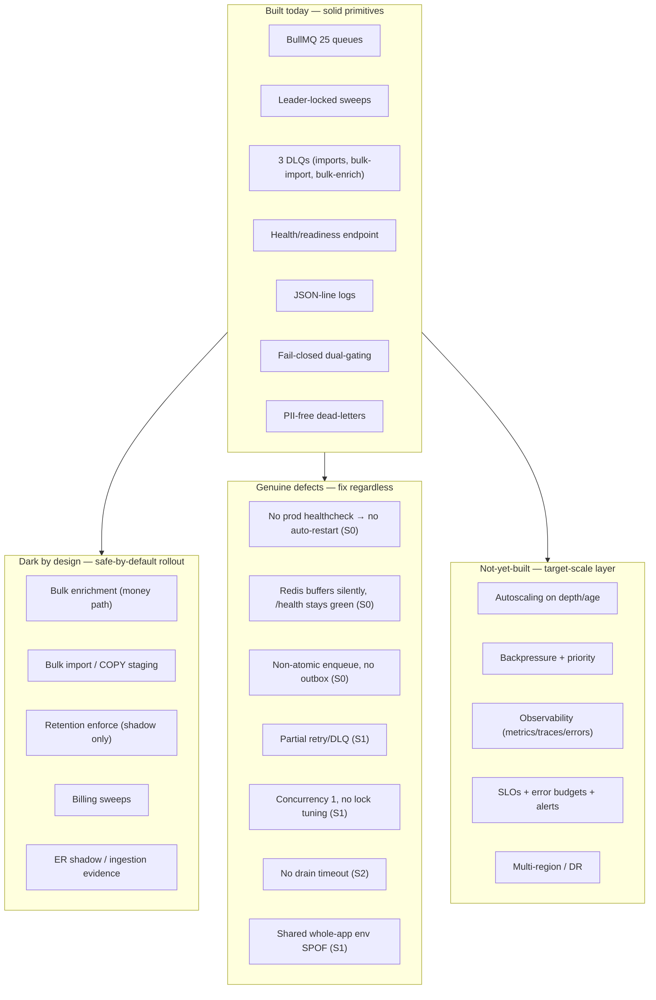

# Gap Analysis - Intended vs Built

> **Scope.** This document reconciles the **intended** worker-platform architecture (as written
> in `docs/planning/` and the ADRs) against the **as-built** system in `apps/workers`,
> `apps/api`, `packages/*`, and the deploy manifests. It produces (1) a capability-by-capability
> gap matrix and (2) a ranked bottleneck list. It is the bridge between the as-built audit
> ([01-current-architecture-audit.md](01-current-architecture-audit.md)) / root-cause
> ([02-root-cause-analysis.md](02-root-cause-analysis.md)) and the target design
> ([07-target-architecture.md](07-target-architecture.md)) and its remediation plans
> ([04-issue-resolution-plan.md](04-issue-resolution-plan.md),
> [15-phased-implementation-plan.md](15-phased-implementation-plan.md)).

## How to read this document — three registers, kept distinct

Every row separates three things and never blends them:

| Register | Meaning | Sourced from |
|---|---|---|
| **Built (as-built reality)** | What the code does **today**. | `path:line` citations to shipped source. |
| **Intended (design intent)** | What the sanctioned planning docs / ADRs say the system **should** be. | `docs/planning/*`, `docs/planning/decisions/ADR-*`. |
| **Recommendation** | What this audit proposes to close the gap. Never presented as if it exists. | This audit; detailed in siblings 07–11, 15. |

## The single most important framing: by-design darkness vs genuine defect

Most of the "missing" behaviour below is **not** a broken worker. TruePoint's spend-and-risk
surfaces (bulk import, bulk enrichment, retention deletion, billing sweeps, ER shadow, ingestion
evidence) are **deliberately dark** behind fail-closed env kill-switches plus per-tenant flags
plus, for the money path, a human confirm-before-spend gate. That darkness is a **safe-by-default
rollout posture**, not a fault. The headline dashboard reading — **Queued: 4, Awaiting
Confirmation: 1** — is `enrichment_jobs.status` accounting for jobs parked by design, not a stuck
consumer (see [02-root-cause-analysis.md](02-root-cause-analysis.md)).

So each gap row is tagged in the **Gap class** column with one of:

- **By design** — the behaviour is intentionally absent/inert today; enabling it is a gated,
  reversible rollout decision, not a code fix. No defect. Frequently a *doc-only* resolution.
- **Defect** — a genuine reliability/observability/correctness hole that would hurt at scale or
  can already bite on the live env (e.g. lost enqueue, no drain timeout, no prod healthcheck).
- **Not-yet-built** — a target-scale capability that was always planned as future work; its
  absence is expected at the current stage but is a real gap against the target.

> A gap being *By design* does **not** make it safe forever. It means the correct remediation is a
> **rollout/runbook** decision ([13-operational-runbooks.md](13-operational-runbooks.md)), not an
> emergency patch. A gap being *Defect* means it should be fixed regardless of whether any dark
> feature is ever enabled.

---

## 1. Capability gap matrix

Severity legend: **S0** = active correctness/data-loss or silent-failure risk on the live env
today · **S1** = will break or badly degrade at target scale (millions of users / billions of
jobs) · **S2** = missing operational maturity, degraded but survivable · **S3** = cosmetic /
nice-to-have. "By design" rows carry a severity for *when the feature is enabled*, annotated as
such.

### 1.1 Concurrency, throughput & scaling

| Capability | Intended (docs/ADR) | Built (code) | Gap class | Sev |
|---|---|---|---|---|
| Per-worker concurrency | Autoscale stateless workers; async freshness SLOs (enrichment p95 <10min; **bulk-enrichment <30min / 100k rows**; scoring <5min) — implies real parallelism (`docs/planning/18-scalability-performance.md` §9) | **Concurrency 1 for every worker** — no `concurrency`/`limiter` set anywhere in `apps/workers/src` (zero matches); BullMQ v5 defaults apply | Defect (latent) | S1 |
| Horizontal autoscaling | Stateless api+workers **autoscale on ECS Fargate on queue depth+age per domain** (`docs/planning/18-scalability-performance.md` §3, `18:57`) | **Single `workers` container**, no autoscale (`docker-compose.prod.yml:115-117`) | Not-yet-built | S1 |
| Priority classes | **Bulk below money/real-time** priority (`docs/planning/18-scalability-performance.md` `18:221`) | No priority: all 25 queues share one pool, FIFO within each, no cross-queue weighting | Not-yet-built | S1 |
| Per-tenant fairness / bulk caps | **Per-tenant bulk concurrency caps** + fair-share (`18` §9, §11.2; ER p95 <15min fair-share §9.1) | No per-tenant caps in worker layer; only in-job spend brakes (`bulkProcessEnrichChunk.ts`) | Not-yet-built | S1 |
| Backpressure / load shed | Depth/age → autoscale → **shed / slow producers**; typed 503 + Retry-After (`18` §9; `docs/planning/19-observability-reliability.md` §4) | **None.** Producers enqueue unconditionally; no depth check, no shed, no Retry-After | Not-yet-built | S1 |
| Bulk chunking + server-owned backpressure | **Server-owned ~10k chunking + backpressure**, streaming parse (ADR-0036) | Chunk fan-out exists for bulk-enrich (`makeProcessBulkEnrichment` drive→chunk) but **gated dark** (`register.ts:636`); no backpressure | By design (dark) | S1 (when on) |

### 1.2 Reliability & fault tolerance

| Capability | Intended (docs/ADR) | Built (code) | Gap class | Sev |
|---|---|---|---|---|
| Transactional outbox | **Transactional outbox** — writers append an `outbox` row in the **same transaction** as the state change; "DB commit ⇒ event published", at-least-once, crash-safe; **enqueue-after-commit explicitly rejected** (`ADR-0027-real-time-delivery-and-event-backbone.md:11,18,25,49`) | **No outbox.** The confirm path does a DB status flip then a **separate** enqueue outside any shared transaction (`apps/api/src/features/enrichment/routes.ts:101` then `:119`); DB rows are created with zero BullMQ interaction (`packages/core/src/prospect/bulkActions.ts:337-364`) | Defect | S0 |
| Retry + backoff (all queues) | **Bounded retries + backoff** per domain (`ADR-0027`; `18` §9) | **Partial.** `attempts=1` (no retry) for enrichment, scoring, dsar, outreach, dedup, firmographics (`register.ts:205,211,217,223,324,330`). Only imports (3×2000ms), master-backfill (4×30000ms), reverification (3×60000ms), bulk-* (3×) retry | Defect | S1 |
| DLQ coverage | **DLQ everywhere** + redrive (`ADR-0027`, `ADR-0036`; `18` §9) | **3 of 25** queues have a DLQ: `IMPORTS_DLQ` (`register.ts:379`), `BULK_IMPORTS_DLQ` (`:620`), `BULK_ENRICHMENT_DLQ` (`:659`). No DLQ for enrichment, scoring, dsar, outreach, dedup, firmographics, master-backfill, reverification, or any sweep | Defect | S1 |
| Idempotent consumers | **Idempotent consumers** (`ADR-0027`) | Partial/ad-hoc: sequence-tick dedupe key `seqstep:{logId}:{step}` (`register.ts:509`); confirm/status transitions guarded by `WHERE status=…` (`enrichmentJobRepository.ts:331-345,354-365`); but generic `updateJobStatus` is **unguarded** (`enrichmentJobRepository.ts:284-288`) and no global idempotency contract | Defect | S1 |
| Stalled-job recovery / lock tuning | Implied by autoscale + freshness SLOs; recover a crashed holder | No `lockDuration`/`stalledInterval`/`maxStalledCount` set (BullMQ defaults: 30s lock, 1 stalled reclaim). A hung job (concurrency 1, no vendor timeout) holds the lock and blocks the whole queue | Defect | S1 |
| Graceful drain with timeout | Multi-AZ, controlled shutdown (`19` §4) | Shutdown drains via `await Promise.all(workers.map(w => w.close()))` (`apps/workers/src/index.ts:20`) with **no drain timeout / no forced close** — a hung job makes `close()` wait forever | Defect | S2 |
| Circuit breakers / vendor timeouts | **Circuit breakers**, typed 503 (`19` §4) | None. No per-job vendor timeout; a wedged upstream stalls the single-concurrency consumer indefinitely | Not-yet-built | S1 |
| Poison-job containment | DLQ + retry classification (`19` §9.2) | Only where a DLQ exists (3 queues). Elsewhere a poison job either dies with no retry (attempts=1) or retries into the failed set with no dead-letter | Defect | S1 |
| Multi-region / DR | **DR RTO 1h / RPO 5min**, cross-region warm standby (`19` §6); 99.9% availability (`ADR-0024`) | Single region, single Redis, single worker; no standby | Not-yet-built | S1 |
| Redis durability | Prod Redis `--appendonly yes` (`docker-compose.prod.yml:26`) | Prod persists; **dev** Redis `--save "" --appendonly no` (`docker-compose.yml:21`) → a dev Redis restart wipes all repeatables + queued jobs | By design (dev-only) | S2 (dev) |

### 1.3 Redis, connection topology & boot resilience

| Capability | Intended (docs/ADR) | Built (code) | Gap class | Sev |
|---|---|---|---|---|
| Connection pooling / partitioning | RDS Proxy pooling, per-domain isolation, scale to ≥5000 concurrent users/large workspace (`ADR-0024`; `18` §3) | **One shared IORedis** (`register.ts:132`) passed to every Queue, every Worker, and the mailbox throttle. Single blocking connection point | Defect (SPOF) | S1 |
| Redis-unreachable-at-runtime handling | Symptom-based alerting on replica lag / queue age (`19` §3) | `maxRetriesPerRequest:null` (`register.ts:132`) → ioredis reconnects forever and **buffers commands instead of erroring**; workers block silently, jobs stay "Queued", **no crash and `/health` stays 200** | Defect | S0 |
| Redis-unreachable-at-boot handling | — | `void schedule*().catch` repeatables (`register.ts:807-851`) may never resolve/reject (buffered) → a repeatable may **never register** and `.catch` never fires | Defect | S1 |
| Boot config isolation | Per-service config; a worker should not depend on unrelated web/auth keys | Worker validates the **whole-app** env schema; `loadEnv()` **throws and crashes** on any invalid/missing key (`packages/config/src/env.ts:328-335,352`). Missing `AUTH_ORIGIN`/`APP_ORIGINS`/`JWT_SIGNING_KID`/`DATABASE_URL`/`BLIND_INDEX_KEY` etc. (`env.ts:17,32,33,58,67,80`) crash the worker — shared-config SPOF | Defect | S1 |
| Leadership model | Durable leadership for sweeps (implied by "one owner per interval") | `withLeaderLock` is a **per-tick mutex, not durable leadership** — `SET … PX ttl NX`, returns false and skips `fn` if not owner (`apps/workers/src/leaderLock.ts:24-25`). Only sweeps are leader-gated; event queues run on every instance. Safe today with one replica | By design / latent | S2 |

### 1.4 Observability, SLOs & alerting

| Capability | Intended (docs/ADR) | Built (code) | Gap class | Sev |
|---|---|---|---|---|
| Metrics (RED + depth/age/oldest-job) | **CloudWatch + Grafana**, RED + queue depth/age (`19` §1) | **None.** No metrics emission anywhere in `apps/workers/src` | Not-yet-built | S1 |
| Distributed tracing | **X-Ray traces**, context propagation (`19` §1) | **None.** No telemetry libs installed — no OpenTelemetry/Sentry/Prometheus/StatsD/X-Ray. (`@opentelemetry/api` in `bun.lock:726,896` is only an unused optional peer of drizzle-orm) | Not-yet-built | S1 |
| Structured logs w/ correlation + tenant | **One correlation id + tenant/workspace tags** (`19` §1) | Minimal JSON-line logger (`apps/workers/src/logger.ts:9-11`) — **no correlation id, no tenant/workspace tags, no log shipper** | Defect | S2 |
| Error tracking | **GlitchTip** errors (`19` §1) | None | Not-yet-built | S2 |
| Product analytics / synthetics | **PostHog**, **CloudWatch Synthetics** (`19` §1) | None | Not-yet-built | S3 |
| SLOs + error budgets + burn-rate alerts | **SLOs + monthly error budgets** with fast/slow burn-rate alerts **gating releases** (`19` §2; `ADR-0024`) | None | Not-yet-built | S2 |
| Symptom-based alert catalog + on-call | SLO burn, error rate, **queue age, DLQ growth**, replica lag; severity ladder; per-alert runbooks (`19` §3) | None; per-job `instrument()` only logs completed/failed lines (`register.ts:350-362`) | Not-yet-built | S1 |
| Queue depth/age visibility | Real-time depth/age dashboards (`19` §1) | Admin pull-probe covers **only 3 of 25** queues (imports, bulk-imports, reverification) with ~1.5s timeouts and honest `reachable:false` (`apps/api/src/features/admin/systemHealthProbes.ts:54-58,64-83`). No depth/age/DLQ signal for the other 22 | Defect | S1 |
| Worker liveness/readiness depth | Health that reflects real capacity | `/health`→200 liveness, `/ready`→200/503 from a drain closure (`apps/workers/src/health.ts:15-20`) — **never checks Redis or queue depth**; readiness is green while the consumer is wedged | Defect | S1 |
| Prod health probing / auto-restart | Container orchestrator restarts unhealthy workers | Prod `workers` service has **no `healthcheck` and no published port** (`docker-compose.prod.yml:115-117`) → `health.ts:3002` is effectively never probed; a wedged worker is never auto-restarted | Defect | S0 |
| Per-bulk-job telemetry | Rows/sec, **three-way succeeded/failed/unprocessed reconcile**, DLQ depth, **transient-vs-deterministic retry classification**, stuck-job/DLQ-growth alerts (`19` §9, §9.2, §9.3) | None (bulk path is dark; even when on, no per-job telemetry emitted) | By design + Not-yet-built | S1 (when on) |

### 1.5 Job lifecycle correctness (enrichment control table)

See [02-root-cause-analysis.md](02-root-cause-analysis.md) for the full state machine.

| Capability | Intended (docs/ADR) | Built (code) | Gap class | Sev |
|---|---|---|---|---|
| Atomic "create job + enqueue" | Outbox guarantees commit⇒publish (`ADR-0027`) | Non-atomic: rows created with no BullMQ interaction (`bulkActions.ts:337-364`); enqueue is a later, separate step (`routes.ts:119`). A confirmed job can flip to `running` then the process dies before enqueue → a `running` job with **no drive job in Redis**, not self-healing | Defect | S0 |
| `failed` / `cancelled` transitions | Full 8-state machine incl. failure (`bulk import` state machine, ADR-0036) | `failed` and `cancelled` are in the enum + UI + DTOs but **no production code writes them** for `enrichment_jobs` — no fail/cancel transition is wired | Defect | S1 |
| `paused → running` resume | State machine `↘partial`/resume (ADR-0036); checkpoint/resume watermark | `paused` is a **trap** — the only resume path guards on `status==="running"` (`packages/core/src/enrichment/bulk/runBulkEnrich.ts:71`) and returns `skipped`; **nothing flips `paused → running`** | Defect | S1 |
| Guarded status writes | Idempotent consumers (`ADR-0027`) | Mixed: `setEstimateAwaitingConfirmation`/`confirmAwaitingJob` are guarded (`enrichmentJobRepository.ts:331-345,354-365`); generic `updateJobStatus` is **unguarded** (`:284-288`) | Defect | S2 |
| Nothing consumes `queued` bulk-enrich | Job is enqueued and worked | **By design** — the flag-ON lane skips `queued` (`∅→estimating`), and the code comment at `bulkActions.ts:330-332` states "Nothing consumes `queued` bulk-enrich jobs … inert orphan … no worker, no spend" | By design | S2 (when on) |

### 1.6 Security & data governance in async paths

Security has final say; full treatment in [12-security-review.md](12-security-review.md).

| Capability | Intended (docs/ADR) | Built (code) | Gap class | Sev |
|---|---|---|---|---|
| Dead-letter PII hygiene | DLQ records PII-free (`ADR-0027`) | The 3 DLQs are documented PII-free and routed only after retries exhausted (`register.ts:379,620,659`) | Met | — |
| Non-RLS staging isolation | **COPY→UNLOGGED non-RLS staging** (RLS `COPY FROM` constraint) with dedup + chunked upsert (ADR-0036) | Staging path is dark (`BULK_IMPORT_ENABLED` off, `register.ts:577`); non-RLS staging risk latent until enabled | By design (dark) | S1 (when on) |
| Fail-closed feature gating | Kill-switches default off | Met — all env switches use `.optional().transform(v => v === "true")`; only literal `"true"` arms (`packages/config/src/env.ts`); per-tenant eval `unknown = OFF` (`packages/core/src/featureFlags/evaluateFlag.ts:25-41`) | Met (by design) | — |
| Retention/DSAR safety | Double-gated shadow before enforce | `data_retention_sweep` **double-gated** per-tenant `retention_engine_enabled` + `mode==='enforce'`; shadow counts-only `deletedCount=0` (`runRetentionSweep.ts:68-76,101-116`); DSAR **not** flag-gated (gated by staff workflow that enqueues it) | By design | S2 (when on) |

---

## 2. Gap density at a glance

The system is **primitives-complete and product-dark**: the load-bearing building blocks exist,
the risky features are intentionally off, and the enterprise reliability/observability layer was
always planned as later work. The genuine defects are a *small, tractable* set — most of them
Phase-0 quick wins (see [15-phased-implementation-plan.md](15-phased-implementation-plan.md)).

---

## 3. Ranked bottleneck list

Ranked by blast radius at the target scale (millions of users / billions of jobs), with the
live-env risk noted. Each entry cites as-built, states the intent it violates, and points to the
sibling doc that carries the fix. **These are recommendations — they do not exist today.**

### #1 — Concurrency = 1 on every worker

- **Built:** no `concurrency`/`limiter`/`lockDuration`/`stalledInterval`/`maxStalledCount`
  anywhere in `apps/workers/src`; BullMQ v5 defaults (30s lock, 1 stalled reclaim). One shared
  IORedis (`register.ts:132`).
- **Consequence:** a single queue processes **one job at a time**; a hung job with no vendor
  timeout holds the lock and blocks the whole queue. Throughput ceiling is `1 × replicas`, and
  there is exactly **one** worker replica in prod (`docker-compose.prod.yml:115-117`).
- **Violates:** async freshness SLOs (bulk-enrichment <30min/100k rows; 1M-row <30min)
  (`docs/planning/18-scalability-performance.md` §9).
- **Class:** Defect (latent) — invisible while everything is dark, catastrophic the moment bulk
  is enabled at volume. **Fix:** per-queue concurrency + lock tuning →
  [09-reliability-fault-tolerance.md](09-reliability-fault-tolerance.md),
  [11-capacity-finops.md](11-capacity-finops.md).

### #2 — Single shared Redis connection & instance (SPOF, silent wedge)

- **Built:** one `new IORedis(env.REDIS_URL, { maxRetriesPerRequest: null })` (`register.ts:132`)
  shared by every Queue, Worker, and the mailbox throttle; one Redis instance.
- **Consequence:** Redis is a **single point of failure** for all 25 queues. Worse, with
  `maxRetriesPerRequest:null` an unreachable Redis makes ioredis **reconnect forever and buffer
  commands** — workers block silently, jobs stay "Queued", **no crash, `/health` stays 200**, and
  nothing self-heals (`register.ts:807-851` repeatables may never register).
- **Violates:** RDS-Proxy-style pooling / 99.9% availability (`ADR-0024`), symptom-based alerting
  on queue age (`19` §3).
- **Class:** Defect (S0 silent-failure) + Not-yet-built (HA topology). **Fix:** readiness Redis
  ping + queue-age alerts + HA/clustered Redis →
  [09-reliability-fault-tolerance.md](09-reliability-fault-tolerance.md),
  [10-observability-alerting.md](10-observability-alerting.md).

### #3 — No autoscaling

- **Built:** single `workers` container, static (`docker-compose.prod.yml:115-117`).
- **Consequence:** no elasticity; backlog cannot be absorbed by adding capacity; the concurrency-1
  ceiling is fixed.
- **Violates:** stateless workers **autoscale on ECS Fargate on queue depth+age per domain**
  (`docs/planning/18-scalability-performance.md` §3, `18:57`).
- **Class:** Not-yet-built (S1). **Fix:** depth/age-driven autoscaling →
  [07-target-architecture.md](07-target-architecture.md),
  [11-capacity-finops.md](11-capacity-finops.md).

### #4 — No transactional outbox (enqueue-after-commit; non-atomic create+enqueue)

- **Built:** DB job rows created with **zero** BullMQ interaction (`bulkActions.ts:337-364`); the
  single enqueue happens later, outside any shared transaction, in the confirm handler
  (`apps/api/src/features/enrichment/routes.ts:101` flip, then `:119` enqueue).
- **Consequence:** a job can flip to `running` and the process die before enqueue → a `running`
  job with **no drive job in Redis**, not self-healing (at-least-once gap, not transactional).
- **Violates:** the pattern **ADR-0027 explicitly rejects** — "enqueue-after-commit without an
  outbox drops events on crash" (`ADR-0027-real-time-delivery-and-event-backbone.md:11,13,49`);
  mandate is a transactional outbox (`:18,25`).
- **Class:** Defect (S0). **Fix:** outbox + relay, idempotent consumers →
  [09-reliability-fault-tolerance.md](09-reliability-fault-tolerance.md).

### #5 — Partial DLQ + partial retry

- **Built:** DLQ on only 3 of 25 queues (`register.ts:379,620,659`); `attempts=1` (no retry) for
  enrichment, scoring, dsar, outreach, dedup, firmographics (`register.ts:205,211,217,223,324,330`).
- **Consequence:** a transient failure on an attempts=1 queue is **lost with no dead-letter and no
  retry**; a poison job on a no-DLQ queue silently accumulates in the failed set with no operator
  signal.
- **Violates:** **DLQ everywhere + bounded retries** (`ADR-0027`; `18` §9; ADR-0036).
- **Class:** Defect (S1). **Fix:** standard retry+backoff+jitter policy and DLQ+redrive on every
  queue → [09-reliability-fault-tolerance.md](09-reliability-fault-tolerance.md).

### #6 — No observability (metrics / traces / errors / SLOs / alerts)

- **Built:** health/readiness (liveness only, no Redis check, `health.ts:15-20`), JSON-line logs
  with no correlation id/tenant tags/shipper (`logger.ts:9-11`), per-job completed/failed log
  lines (`register.ts:350-362`), and a 3-queue admin pull-probe
  (`systemHealthProbes.ts:54-58,64-83`). **No telemetry libraries installed at all.**
- **Consequence:** operators are effectively blind — no queue depth/age, no oldest-job, no DLQ
  growth, no burn-rate alerting; a wedge is discovered by users, not monitors. Directly
  compounds #2.
- **Violates:** CloudWatch+Grafana RED + depth/age, X-Ray traces, correlation+tenant logs,
  GlitchTip, SLOs+error budgets, symptom-based alert catalog (`docs/planning/19-observability-reliability.md`
  §1–§3); per-bulk-job three-way accounting (`19` §9).
- **Class:** Not-yet-built + partial Defect (missing correlation/tenant tags on existing logs, S2).
  **Fix:** full observability layer → [10-observability-alerting.md](10-observability-alerting.md).

### #7 — No backpressure / no priority classes

- **Built:** producers enqueue unconditionally; all queues share one pool with no cross-queue
  weighting; no depth check, no load-shed, no Retry-After.
- **Consequence:** a bulk flood can starve latency-sensitive money/real-time work; no controlled
  degradation under overload.
- **Violates:** depth/age → autoscale → **shed/slow producers** and **bulk below money/real-time**
  priority (`18` §9, `18:221`); per-tenant bulk concurrency caps (`18` §9, §11.2).
- **Class:** Not-yet-built (S1). **Fix:** priority lanes + per-tenant caps + backpressure/shed →
  [07-target-architecture.md](07-target-architecture.md),
  [11-capacity-finops.md](11-capacity-finops.md).

### #8 — No multi-region / DR

- **Built:** single region, single Redis, single worker; no standby.
- **Consequence:** a regional or Redis-instance failure is a full worker-plane outage; no RTO/RPO
  guarantee.
- **Violates:** **DR RTO 1h / RPO 5min** cross-region warm standby (`19` §6); 99.9% availability
  (`ADR-0024`).
- **Class:** Not-yet-built (S1, longest lead time). **Fix:** cross-region warm standby, DR
  runbooks → [07-target-architecture.md](07-target-architecture.md),
  [09-reliability-fault-tolerance.md](09-reliability-fault-tolerance.md).

### Bottleneck ranking summary

| # | Bottleneck | Primary class | Sev | Live-env risk today | Fix owner doc |
|---|---|---|---|---|---|
| 1 | Concurrency = 1 everywhere | Defect (latent) | S1 | Low (dark) → severe when bulk on | 09, 11 |
| 2 | Single shared Redis (SPOF + silent wedge) | Defect + Not-built | S0 | **Real now** (silent stall, green health) | 09, 10 |
| 3 | No autoscaling | Not-yet-built | S1 | Low (dark) | 07, 11 |
| 4 | No outbox / non-atomic enqueue | Defect | S0 | **Real when confirm used** (lost drive) | 09 |
| 5 | Partial DLQ + partial retry | Defect | S1 | Moderate (attempts=1 loss) | 09 |
| 6 | No observability | Not-built + Defect | S1 | **Real now** (blind to wedge) | 10 |
| 7 | No backpressure / priority | Not-yet-built | S1 | Low (dark) | 07, 11 |
| 8 | No multi-region / DR | Not-yet-built | S1 | Low (single-tenant blast) | 07, 09 |

> **Two S0s are live regardless of any dark feature:** the prod worker has **no healthcheck /
> auto-restart** (`docker-compose.prod.yml:115-117`) and Redis-unreachable **buffers silently
> while `/health` stays 200** (`register.ts:132`). These are the top of the Phase-0 quick-win list
> in [04-issue-resolution-plan.md](04-issue-resolution-plan.md) and
> [15-phased-implementation-plan.md](15-phased-implementation-plan.md), and are diagnosed on the
> live env via [03-live-inspection-runbook.md](03-live-inspection-runbook.md).

---

## 4. Reconciliation notes (avoiding false alarms)

- **The dashboard counts are not a bottleneck.** "Queued: 4 / Awaiting Confirmation: 1" are
  `enrichment_jobs.status` counts for jobs parked by design (flag off / no human confirm), not a
  stuck consumer. The coord-bus protocol (`tools/coord-bus/COORDINATION.md`) has no
  `Queued`/`Awaiting Confirmation` states and is **not** the source. See
  [02-root-cause-analysis.md](02-root-cause-analysis.md).
- **Dark ≠ broken.** Every "By design" row in §1 is a rollout decision, not a patch. The correct
  first action for the operator is to **confirm by-design vs fault on the live env** using
  [03-live-inspection-runbook.md](03-live-inspection-runbook.md), *then* schedule the genuine
  defects.
- **The primitives are real.** BullMQ per-domain queues, leader-locked sweeps, three PII-free
  DLQs, health/readiness, JSON logs, and fail-closed dual-gating already exist — the target
  architecture ([07-target-architecture.md](07-target-architecture.md)) extends them, it does not
  replace them.

---

### See also

- [00-executive-summary.md](00-executive-summary.md) — verdict and P0/P1/P2 roadmap.
- [01-current-architecture-audit.md](01-current-architecture-audit.md) — full as-built detail (25-queue table, flags, deploy).
- [02-root-cause-analysis.md](02-root-cause-analysis.md) — the stuck-counts state machine.
- [03-live-inspection-runbook.md](03-live-inspection-runbook.md) — decide by-design vs fault on the live env.
- [07-target-architecture.md](07-target-architecture.md) · [09-reliability-fault-tolerance.md](09-reliability-fault-tolerance.md) · [10-observability-alerting.md](10-observability-alerting.md) · [11-capacity-finops.md](11-capacity-finops.md) — the remediations these gaps point to.
