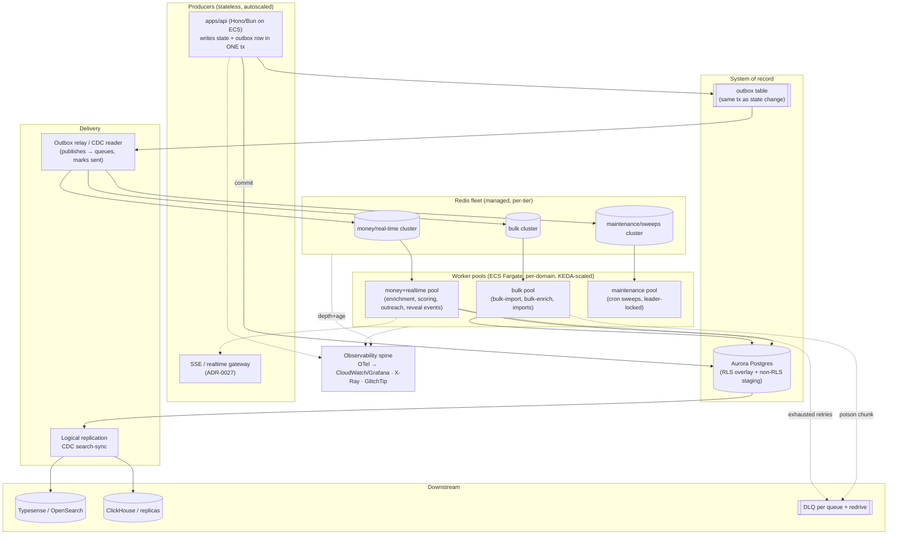
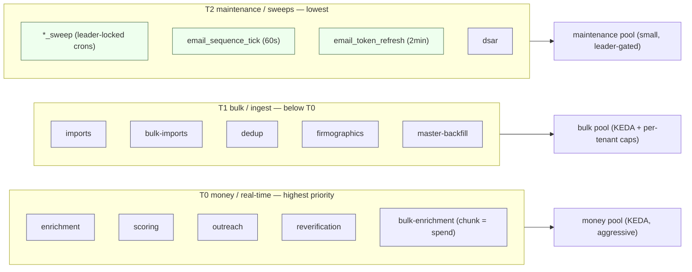
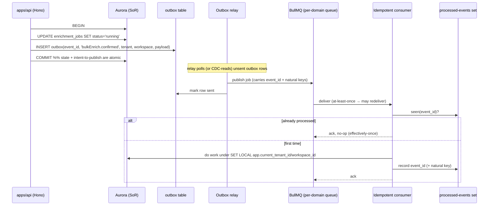
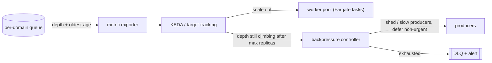
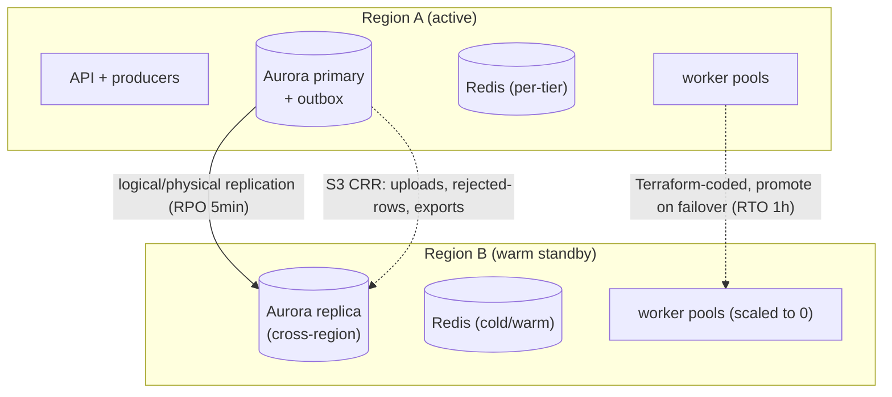

# Target Enterprise Worker Architecture

> **Objective 4 deliverable.** This document specifies the *target* background-job platform for
> TruePoint (`@leadwolf/*`) at enterprise scale — **millions of users, billions of jobs** — and
> maps every element back to the sanctioned intent already accepted in the corpus
> ([ADR-0024](../decisions/ADR-0024-performance-slos-and-capacity-model.md),
> [ADR-0027](../decisions/ADR-0027-real-time-delivery-and-event-backbone.md),
> [ADR-0036](../decisions/ADR-0036-bulk-async-job-and-staging-pipeline.md),
> [§18](../18-scalability-performance.md), [§19](../19-observability-reliability.md)).
>
> It is a *design*, not a work order — the phased, code-level path is
> [08-migration-strategy.md](08-migration-strategy.md) and
> [15-phased-implementation-plan.md](15-phased-implementation-plan.md). Read alongside
> [06-gap-analysis.md](06-gap-analysis.md) (what is missing) and
> [09-reliability-fault-tolerance.md](09-reliability-fault-tolerance.md) /
> [10-observability-alerting.md](10-observability-alerting.md) /
> [11-capacity-finops.md](11-capacity-finops.md) / [12-security-review.md](12-security-review.md),
> which each drill one axis of this target.

> **Reconciliation with re-audit ([14](14-re-audit-and-risks.md)).** The second-pass adversarial
> review of *this* target found weaknesses in the proposed cure itself; the findings that change this
> document have been folded back in inline (each marked "reconciled with 14-re-audit-and-risks.md,
> F#"): **F1** — the outbox relay is **leaderless and partitioned** (competing-consumer `SKIP LOCKED`),
> not single-leader-pinned (§5); **F5** — `withLeaderLock` is declared **intra-cluster and fenceless**,
> so any cross-region singleton needs a DB-issued region-role + fencing token (§9); **F7** — the
> per-tenant cap is a **TTL-reclaimed concurrency lease (semaphore)**, not the mailbox rate-limiter's
> token-bucket (§6.2); **F11** — the money tier (T0) holds a **warm min-replica ≥ 1** rather than
> scaling to zero (§6.1). The remaining findings are addressed in their primary sibling docs; see
> [14-re-audit-and-risks.md](14-re-audit-and-risks.md).

## 0. How to read this document — three registers

Everything below is tagged as one of three things. Conflating them is the single most common way to
misread this audit.

| Register | Meaning | Example marker |
|---|---|---|
| **As-built** | What the code does *today*, with a `path:line` citation. | `apps/workers/src/register.ts:132` |
| **Intended (sanctioned)** | Already-accepted design in an ADR or `§18`/`§19`. Not built, but *decided*. | `ADR-0027 …:26` |
| **Recommendation** | This document's proposal where neither the code nor an ADR yet settles it. | prefixed **Rec:** |

**And the framing that governs the whole audit:** most of the "missing" behaviour in the worker
system today is **by-design safe-by-default darkness**, not a defect. Bulk enrichment, bulk import,
billing sweeps, ER shadow and the evidence pipeline are gated *off* by env kill-switches and
per-tenant flags precisely so an unfinished money path cannot spend or mutate data before it is
ready (see [02-root-cause-analysis.md](02-root-cause-analysis.md) for the "Queued: 4 / Awaiting
Confirmation: 1" verdict). This document is careful to separate:

- **By-design gaps** — the darkness is intentional; the target keeps the gate, hardens what runs
  behind it. (e.g. `bulk-enrichment` worker is *never constructed* when `BULK_ENRICHMENT_ENABLED`
  is off — `apps/workers/src/register.ts:636`.)
- **Genuine defects** — things that are unsafe or unscalable *even in the always-on path* that runs
  in production today. (e.g. one shared Redis connection for all 25 queues —
  `apps/workers/src/register.ts:132`; no drain timeout — `apps/workers/src/index.ts:20`.)

The target architecture **fixes the defects** and **industrialises the gates**, never removes them.

---

## 1. Design goals & the quantified contract

The target is bound by the accepted performance contract, not invented here:

| Dimension | Target | Source (intended) |
|---|---|---|
| Registered users | millions | `18-scalability-performance.md:12` |
| Concurrent users / large workspace | ≥ 5,000 | `ADR-0024-performance-slos-and-capacity-model.md:26` |
| Master graph | billions of golden records (Citus-sharded) | `18-scalability-performance.md:15` |
| Core API availability | **99.9 % monthly** | `ADR-0024-performance-slos-and-capacity-model.md:24` |
| Enrichment freshness | p95 < 10 min | `ADR-0024-performance-slos-and-capacity-model.md:25` |
| **Bulk-enrichment job** | p95 < 30 min / 100k rows | `18-scalability-performance.md:36` |
| Bulk **ingest** throughput | ≥ 5,000 rows/s per tenant; **1M rows < 30 min** | `18-scalability-performance.md:46` |
| Scoring freshness | p95 < 5 min | `ADR-0024-performance-slos-and-capacity-model.md:25` |
| Search-sync (CDC→index) | p95 < 5 s | `ADR-0024-performance-slos-and-capacity-model.md:25` |
| ER resolution latency (1M-row burst) | p95 < 15 min, fair-share | `18-scalability-performance.md:157-160` |
| DR | **RTO 1 h / RPO 5 min** | `19-observability-reliability.md:55` |

Six architectural principles fall out of that contract and thread through the rest of this doc:

1. **Effectively-once** — at-least-once delivery + idempotent consumers, made crash-safe by a
   **transactional outbox** (`ADR-0027 …:26-27`). Never "enqueue after commit" (`ADR-0027 …:49`).
2. **Per-domain isolation** — queues, worker pools and Redis blast-radius partitioned by domain and
   priority tier so bulk never starves money (`18-scalability-performance.md:221`).
3. **Elastic on the right signal** — autoscale on **queue depth + age**, not CPU
   (`18-scalability-performance.md:58`).
4. **Fair-share & bounded** — per-tenant concurrency caps + backpressure so one tenant's burst can
   never monopolise shared workers (`18-scalability-performance.md:146-149`).
5. **Fail visibly, never silently** — DLQ everywhere + redrive; a job that cannot complete surfaces,
   it does not wedge (`ADR-0027 …:29-30`, `19-observability-reliability.md:118-120`).
6. **Safe-by-default** — every spend/mutation path stays dual-gated (env kill-switch + per-tenant
   flag + human confirm where money is involved); scale never dilutes the gate.

---

## 2. Target topology (system view)

**Register: Recommendation, realising the intended design.** The target keeps the current building
blocks — Hono/Bun API, BullMQ on Redis, ECS Fargate, Aurora, CDC→search — and adds the outbox
relay, per-domain worker pools, DLQ+redrive, autoscaler, and the observability spine that
`§18`/`§19` require but that the code does not yet have.

**Contrast with as-built (all genuine, not by-design):** today there is *one* Redis connection for
every queue and worker (`apps/workers/src/register.ts:132`), *one* worker container in prod with no
healthcheck and no published port (`docker-compose.prod.yml:115-117`), *no* outbox (the code
enqueues after commit, the exact pattern `ADR-0027 …:49` rejects), and *no* observability library
installed at all (see [10-observability-alerting.md](10-observability-alerting.md)). The topology
above is the destination; [08-migration-strategy.md](08-migration-strategy.md) sequences it.

---

## 3. Per-domain queue partitioning & priority tiers

**Intended:** `ADR-0027 …:29` mandates "per-domain BullMQ queues"; `18-scalability-performance.md:221`
mandates "Bulk sits **below** money/real-time paths in queue priority". **As-built:** 25 queues
already exist and are logically per-domain (full table in
[01-current-architecture-audit.md](01-current-architecture-audit.md)), but they all share **one
Redis connection and one worker process at concurrency 1** — so the *logical* partitioning buys no
*physical* isolation. A hung enrichment job blocks nothing else only because each queue has its own
BullMQ `Worker`, but they contend on the same connection and the same container's CPU.

**Rec: map the 25 domain queues onto three priority tiers, each with its own Redis cluster and its
own autoscaled worker pool.** Priority is expressed both by *pool placement* (a starved tier scales
independently) and by BullMQ job `priority` within a tier.

| Tier | Domains (as-built queue names) | Why this tier | Redis cluster | Scaling signal |
|---|---|---|---|---|
| **T0 — money / real-time** | `enrichment`, `scoring`, `outreach`, `reverification`, `bulk-enrichment` (chunk step, the only spend) | latency- & spend-sensitive; user-visible freshness SLOs (`ADR-0024 …:25`) | money cluster | depth+age, tight |
| **T1 — bulk / ingest** | `imports`, `bulk-imports`, `dedup`, `firmographics`, `master-backfill` | high-volume, throughput-governed, **below T0** (`18 …:221`) | bulk cluster | depth+age + per-tenant caps |
| **T2 — maintenance / sweeps** | all `*_sweep` crons, `email_sequence_tick`, `email_token_refresh`, `dsar` | scheduled/leader-locked, tolerant of lag | maintenance cluster | fixed/low; leader-gated |

**Isolation rationale (Rec):** a million-row bulk burst (T1) and the daily billing sweeps (T2) must
never contend for the same Redis command pipeline or worker CPU as an interactive enrichment (T0).
Separate clusters give each tier its own memory ceiling, its own failure domain, and its own
autoscale curve. This is the physical realisation of the priority ordering `18-scalability-performance.md:221`
already decided.

> **By-design note:** the *dark* T0/T1 queues (`bulk-enrichment`, `bulk-imports`) keep their env +
> per-tenant + confirm gates unchanged (`apps/workers/src/register.ts:577,636`). Tiering changes
> *where they run when armed*, not *whether they are armed*.

---

## 4. Redis platform: managed choice, cluster caveats, and the graduation path

**As-built:** a single `new IORedis(env.REDIS_URL, { maxRetriesPerRequest: null })`
(`apps/workers/src/register.ts:132`) is shared by every `Queue`, every `Worker`, and the mailbox
throttle. `maxRetriesPerRequest: null` is *required* by BullMQ for its blocking connection
(`apps/workers/src/register.ts:131` comment), but it also means that when Redis is unreachable at
runtime, ioredis **buffers commands forever instead of erroring** — workers block silently, jobs
stay "Queued", nothing crashes and `/health` stays 200 (see
[03-live-inspection-runbook.md](03-live-inspection-runbook.md)). Dev Redis runs with persistence off
(`--save "" --appendonly no`, `docker-compose.yml:21`) so a restart wipes repeatables and queued
jobs; prod uses `--appendonly yes` (`docker-compose.prod.yml:26`). **This is a genuine defect / risk
surface, not by-design.**

**Rec — managed Redis, tiered:**

| Concern | Recommendation | Rationale |
|---|---|---|
| **Engine** | **ElastiCache for Redis** (Multi-AZ, automatic failover) as the default; **MemoryDB** for the money/ledger-adjacent tier if durable, Multi-AZ, transactionally-consistent Redis is required (MemoryDB persists to a multi-AZ log). | `§18` already names "ElastiCache Redis (cluster mode)" as the cache/realtime scaling unit (`18-scalability-performance.md:63`); MemoryDB upgrades durability for the tier where a lost job = lost money. |
| **Topology per tier** | One cluster per priority tier (§3). Start each **non-cluster-mode** (primary + replicas) and only enable **cluster mode (sharding)** when a single primary's memory or connection ceiling is the bottleneck. | Isolation + independent failover per tier; defer sharding complexity until measured. |
| **Connections** | **Separate connections/pools per queue-role** (blocking consumer vs. producer vs. throttle), not one shared client. BullMQ needs a dedicated blocking connection per worker; producers can share a non-blocking pool. | Removes the single-connection SPOF at `register.ts:132`; a wedged blocking read no longer starves producers. |
| **Runtime failure behaviour** | Keep `maxRetriesPerRequest: null` on blocking connections (BullMQ requirement) but add an **explicit Redis reachability probe** feeding `/ready` (§9) and an **offline/backpressure state** so a wedged Redis fails readiness and sheds new work instead of buffering silently. | Turns the silent-buffer failure mode into an observable, sheddable one. |

### 4.1 The BullMQ + Redis Cluster hash-tag caveat (must not be skipped)

**Rec / hard constraint.** BullMQ stores each queue's state across **many Redis keys**
(`bull:<queue>:wait`, `:active`, `:completed`, `:events`, `:meta`, per-job hashes, …) and uses
multi-key Lua scripts to move jobs between states atomically. On **Redis Cluster**, a multi-key
operation only works if every key lives in the **same hash slot** — which requires that all of a
queue's keys share a **hash tag** (the substring inside `{…}`). BullMQ supports this by expecting the
queue prefix to be wrapped so keys collapse to one slot (e.g. prefix `bull:{myqueue}`).

Consequences the target must respect:

- **All keys of one queue must colocate** on one slot → a single queue does **not** shard across the
  cluster; sharding buys you *more queues across more slots*, not a bigger single queue.
- **Cross-queue atomic ops are impossible** across slots. Flows/parent-child dependencies that span
  queues must live in the same slot or avoid cross-slot atomicity.
- **Therefore prefer many single-slot queues over cluster-mode-for-one-hot-queue.** Our per-domain,
  per-tenant-fan-out model (§3, §6) fits this well: partition *by queue*, colocate each queue's keys
  with a hash tag, and let cluster mode spread *queues* across slots.

This caveat is why §3 recommends **separate clusters per tier** first and **cluster-mode sharding
only when a single primary is the proven bottleneck** — it avoids paying the hash-tag/atomicity tax
before it is needed.

### 4.2 When to graduate off Redis/BullMQ

`ADR-0027 …:51` explicitly **defers Kafka** ("operational weight not yet justified; revisit at very
high event volume") and `ADR-0027 …:62-63` sets the revisit trigger: "Event volume or multi-region
fan-out outgrows BullMQ/Redis — then introduce a log-based bus (e.g. Kafka) behind the same event
catalog." **Rec — codify the graduation thresholds:**

| Symptom (measured) | Graduate to | Why |
|---|---|---|
| Sustained event volume saturates a Redis primary's write path even after tier-sharding; consumers need **replay / long retention / multiple independent consumer groups** on the same stream | **Kafka / Kinesis** behind the same domain-event catalog (`ADR-0027 …:62-63`) | Log-based bus gives durable ordered replay + fan-out that Redis lists do not |
| Long-running, **multi-step, stateful** workflows (bulk import state machine `created→…→completed`, `ADR-0036 …:54-57`; multi-day dunning) need durable orchestration, timers, compensation, and visibility | **Temporal** (or Step Functions) for the *orchestration* layer, BullMQ still driving the leaf work | A state machine spread across BullMQ jobs + DB columns (as today, e.g. `enrichment_jobs.status`) has no durable timers, no built-in compensation, and trap states (see below) |
| Cross-region active/active fan-out | log bus with geo-replication (Kafka MirrorMaker / MSK replication) | Redis pub/sub does not durably cross regions |

**Framing:** the trap-state and lost-enqueue problems in the *current* bulk-enrichment lifecycle
(`paused` has no resume path; a lost drive-enqueue is not self-healing — see
[02-root-cause-analysis.md](02-root-cause-analysis.md)) are exactly the class of defect a durable
workflow engine removes. **Rec:** treat Temporal as the *long-term* home for the bulk state machine,
but the *near-term* fix is the transactional outbox (§5) — do not reach for Temporal to paper over a
missing outbox.

---

## 5. Transactional outbox + idempotent consumers (effectively-once)

**This is the keystone.** `ADR-0027 …:26-27` mandates it and `ADR-0027 …:49` explicitly rejects the
alternative the code currently uses.

**As-built (genuine defect, not by-design):** the DB rows for a bulk-enrichment job are created with
**zero** BullMQ interaction (`packages/core/src/prospect/bulkActions.ts:337-364`); the single enqueue
happens *later*, in the confirm HTTP handler, **outside any shared transaction** — the handler
confirms the job (`apps/api/src/features/enrichment/routes.ts:101`) and *then* enqueues the drive job
(`routes.ts:119`). So a job can be flipped to `running` and the process can die before the enqueue,
leaving a `running` DB row with **no drive job in Redis** and **no self-healing** (`runBulkEnrich`
only resumes if a drive job lands). This is the precise "enqueue after commit drops events on crash"
failure `ADR-0027 …:49` names.

**Target — outbox pattern (Rec, realising `ADR-0027 …:26-27`):**

**Two publication mechanisms — pick per domain (Rec):**

1. **Polling relay (leaderless, partitioned — competing consumers)** — **N** drainers each run
   `SELECT … FROM outbox WHERE sent_at IS NULL … FOR UPDATE SKIP LOCKED` over a **partitioned** outbox
   (hash by `domain`/`tenant_id` into P partitions), publish, and mark sent. Simple, no infra
   dependency, at-least-once, and **horizontally scalable** — which is exactly what `SKIP LOCKED` is
   for: many drainers contend safely without a serialization point. **Do not pin the relay to a single
   `withLeaderLock` leader** (`apps/workers/src/leaderLock.ts:24`): a single-leader relay throws away
   the `SKIP LOCKED` concurrency and turns the relay into a fleet-wide bottleneck on the exact path the
   outbox exists to make reliable — and because idempotent consumers (below) already make a
   double-publish harmless, the leader lock buys nothing here (reconciled with 14-re-audit-and-risks.md,
   F1). Pair the relay with a **relay-lag SLO/alert** (age of the oldest unsent row) so a stalled
   partition surfaces instead of silently converting "lost-enqueue" into "delayed-enqueue".
2. **CDC relay (log-based)** — read the `outbox` inserts off Aurora **logical replication** (the same
   CDC stream `ADR-0027 …:34-36` already uses for search-sync). Lower latency, no polling load. `§18`
   already range-partitions an `outbox` table (`18-scalability-performance.md:124`), so the table is
   anticipated.

**Idempotent consumers / effectively-once (Rec, `ADR-0027 …:27`):** every consumer keys on
`event_id` + natural keys and is a **no-op on redelivery**. `ADR-0036 …:86-89` already specifies this
shape for bulk: a **batch idempotency key**, a **deterministic chunk id**, and a **resume
watermark** so "re-running a job is a no-op past the watermark". `18-scalability-performance.md:222`
extends it to rows: "chunk/row processors are idempotent on `(job_id, chunk_id, row_id)` so
re-delivery is a no-op, not a double-charge." **This is the effectively-once contract**: at-least-once
transport + idempotent, watermarked consumers = each side effect (spend, write, event) happens once.

**CDC vs. outbox — complementary, not competing** (`ADR-0027 …:34-36`): CDC drives *projections*
(search-sync, ClickHouse analytics) — "record has changed, re-index it"; the outbox drives
*semantics* — "this domain event happened, run these consumers." The target uses both; do not collapse
one into the other.

> **By-design vs defect here:** the *absence* of the outbox is a **genuine defect** in the
> always-on-once-armed money path (it can lose a confirmed job on crash). It is **masked today only
> because the whole path is dark** (`BULK_ENRICHMENT_ENABLED` off by default,
> `apps/workers/src/register.ts:636`). The outbox must land **before** the flag is ever flipped on in
> production — it is a Phase-0/1 prerequisite in
> [08-migration-strategy.md](08-migration-strategy.md), not a nice-to-have.

---

## 6. Autoscaling, priority, fair-share & per-tenant caps

### 6.1 Autoscale on depth + age (not CPU)

**Intended:** `18-scalability-performance.md:58` scales the workers tier on "**queue depth + age**
per domain"; `18-scalability-performance.md:142-144` uses depth/age thresholds to "autoscale
workers, then **shed or slow producers**." **As-built:** prod runs a **single** static workers
container (`docker-compose.prod.yml:115-117`) — no autoscaler, no scaling signal exported at all.

**Rec — KEDA (on EKS) or an ECS `Fargate` target-tracking policy driven by a custom metric:**

- **Primary signal: oldest-job age** per queue (a queue can be *shallow but stale* if a job is
  wedged — depth alone misses it). Secondary: **backlog depth**.
- **KEDA Redis/BullMQ scaler** reads `wait`+`active` list lengths per queue and scales the tier's
  deployment 0→N. On Fargate-only shops, publish depth+age to CloudWatch and target-track.
- **Per-tier curves (§3):** T0 aggressive (protect freshness SLOs) **and held at a warm min-replica ≥
  1 — T0 never scales to zero**, so a bursty, confirm-gated bulk-enrich job (a full job materialises
  the instant a human clicks confirm) does not pay Fargate task-pull + Bun boot + fail-closed
  env-validation (`packages/config/src/env.ts:328-335`) as a cold-start on the critical path of a
  freshness SLO (reconciled with 14-re-audit-and-risks.md, F11); **scale-to-zero-when-idle is for T1/T2
  only**. T1 throughput-shaped with caps, T2 near-fixed (leader-gated crons don't parallelise).
- **Headroom target** ~60 % so spikes are absorbed, per `18-scalability-performance.md:65`.

### 6.2 Priority, fair-share & per-tenant concurrency caps

**Intended:** `18-scalability-performance.md:146-149` mandates "Per-tenant bulk concurrency caps: the
bulk ingest/export queues enforce a **max concurrent jobs + in-flight rows per tenant** … excess jobs
queue (fair-share), they don't fan out unbounded"; `18-scalability-performance.md:157-160` sets a
fair-share ER latency SLO. **As-built:** concurrency is **1 for every worker** — no `concurrency`,
`limiter`, `lockDuration`, `stalledInterval` or `maxStalledCount` is set anywhere in
`apps/workers/src` (zero matches; BullMQ v5 defaults apply). There is **no per-tenant fairness** at
all; the *only* rate control that exists is the mailbox email throttle
(`apps/workers/src/mailboxThrottle.ts:11-35`).

**Rec — three composable controls:**

| Control | Mechanism | Target |
|---|---|---|
| **Cross-tier priority** | Separate pools (§3) + BullMQ job `priority` within a tier | Bulk (T1) starves before money (T0) — `18 …:221` |
| **Per-tenant concurrency cap** | A Redis-backed **active-count semaphore** (leased-slot counter) keyed `caps:{tier}:{tenantId}`: **acquire-on-start / release-on-finish**, with a **TTL/heartbeat reclaim** so a crashed holder's slot auto-frees (mirror the leader lock's TTL-bounded holder, `apps/workers/src/leaderLock.ts:24`); a chunk only starts if the tenant holds a free slot, else it re-queues. This is a **concurrency limiter, not a rate limiter** — do **not** reuse the mailbox throttle's refill token-bucket (`apps/workers/src/mailboxThrottle.ts:11-35`), which admits *more* than the ceiling after each refill interval and never releases, so a tenant could exceed its concurrent cap; a plain lease counter without TTL reclaim would instead **leak slots on crash** and starve the tenant it protects (reconciled with 14-re-audit-and-risks.md, F7). Track **in-flight rows** alongside job-count under the same reclaim discipline. | Max concurrent jobs + in-flight rows/tenant — `18 …:146-149,215-217` |
| **Fair-share dispatch** | Weighted round-robin across tenants when draining a tier (avoid FIFO head-of-line by one whale tenant), **with aging** so a tenant flooding many small jobs cannot repeatedly beat a starved tenant's single large job (reconciled with 14-re-audit-and-risks.md, F7) | Fair-share queueing — `18 …:149,160` |

> **By-design note:** raising concurrency above 1 is a **defect fix** for the always-on queues, but it
> must land **with** per-tenant caps and idempotency (§5) — bumping concurrency without caps would let
> one tenant's bulk burst starve interactive work, the exact failure `18 …:146-149` guards against.

### 6.3 Backpressure & load-shedding

**Intended:** `18-scalability-performance.md:142-144` — depth/age → autoscale → **shed or slow
producers** (e.g. defer non-urgent enrichment) *before* freshness SLOs break; typed `503` +
`Retry-After` on saturation (`19-observability-reliability.md:41`); over-quota imports **rejected at
enqueue**, not accepted-then-stalled (`18-scalability-performance.md:172-174`). **As-built:** none —
producers enqueue unconditionally; there is no depth check, no shed, no typed-503 path in the worker
producers.

**Rec — layered backpressure:**

1. **Admission control at enqueue** — reject over-quota / over-cap jobs with a typed `429/503 +
   Retry-After` at the API boundary (`18 …:172-174`, `19 …:41`), never silently stall.
2. **Autoscale first** (§6.1), then **slow/defer non-urgent producers** (lower T0 background
   enrichment, pause T1 fan-out) when depth+age keep climbing at max replicas.
3. **Shed to DLQ + alert** only on genuine exhaustion (`18 …:144`), never drop silently.

---

## 7. Reliability: DLQ everywhere + redrive, stalled/lock tuning

*(Full treatment in [09-reliability-fault-tolerance.md](09-reliability-fault-tolerance.md); the
target-level requirements are stated here.)*

### 7.1 DLQ coverage & redrive

**As-built:** only **3 of 25** queues have a DLQ — `IMPORTS_DLQ` (`apps/workers/src/register.ts:379`),
`BULK_IMPORTS_DLQ` (`register.ts:620`), `BULK_ENRICHMENT_DLQ` (`register.ts:659`); dead-letters are
PII-free and routed only after retries exhaust. Six event queues run **attempts = 1 (no retry, no
DLQ)** — enrichment, scoring, dsar, outreach, dedup, firmographics
(`apps/workers/src/register.ts:205,211,217,223,324,330`). A poison job on those simply lands in the
BullMQ `failed` set with nowhere to go and no alert.

**Intended:** `ADR-0027 …:29-30` — "a **dead-letter queue** with alerts, and documented
**backpressure**"; `19-observability-reliability.md:118-120` — DLQ-growth alert + a bulk-job/DLQ
**redrive** runbook.

**Rec:**
- **DLQ on every event queue** (T0/T1). Sweeps (T2) are idempotent crons — a failed tick retries next
  tick, so they need alerting, not a DLQ.
- **Bounded retries with exponential backoff + jitter** before dead-lettering (`ADR-0027 …:29`,
  `19 …:104`). Classify **transient vs. deterministic** (`19 …:99-110`): transient → retry then
  surface as *unprocessed*; deterministic → reject file, counted *failed*, no retry.
- **Redrive is first-class:** an operator-triggered, idempotent replay from DLQ back onto the source
  queue (safe because consumers are idempotent, §5). Runbook in
  [13-operational-runbooks.md](13-operational-runbooks.md); DLQ-growth alert in
  [10-observability-alerting.md](10-observability-alerting.md).

### 7.2 Stalled-job & lock tuning

**As-built (genuine defect):** no `lockDuration`, `stalledInterval`, or `maxStalledCount` is set — BullMQ
v5 defaults apply (30 s lock, 1 stalled reclaim). Combined with **concurrency 1** and **no per-job
vendor timeout**, a single hung job (e.g. an enrichment provider that never returns) holds the lock
and **blocks its queue indefinitely**. On shutdown there is **no drain timeout**:
`await Promise.all(workers.map(w => w.close()))` (`apps/workers/src/index.ts:20`) waits forever on a
hung job before `process.exit(0)`.

**Rec:**
- **Per-job timeouts** on every external call (enrichment/verification providers, email) so a job
  cannot hang forever; on timeout it fails → retry/backoff → DLQ.
- **Tune `lockDuration` to > p99 job time, `stalledInterval` and `maxStalledCount`** per domain so a
  crashed worker's job is reclaimed promptly but a slow-but-alive job is not stolen.
- **Bounded drain timeout** on shutdown (force-close after N seconds) so deploys/rollbacks are not
  hostage to one hung job — fixes `apps/workers/src/index.ts:20`.

---

## 8. Worker health, including Redis readiness

**As-built:** `apps/workers/src/health.ts` serves `/health`→200 liveness and `/ready`→200/503 from an
`isReady` closure (`apps/workers/src/health.ts:15-20`) on port 3002 (`health.ts:7`). It **never checks
Redis or queue depth** — so a worker whose Redis connection is wedged (buffering silently, §4) still
returns `/ready`→200. Worse, prod defines **no `healthcheck` and publishes no port**
(`docker-compose.prod.yml:115-117`), so the endpoint is effectively never probed and a wedged worker
is never auto-restarted. Readiness only flips false during drain (`apps/workers/src/index.ts:18`).

**Rec — make readiness *mean* ready:**

| Probe | Checks | Fail action |
|---|---|---|
| `/health` (liveness) | process event loop responsive | orchestrator restarts task |
| `/ready` (readiness) | **Redis `PING` OK** + not draining + (optionally) blocking connection subscribed | pull task out of rotation; if Redis wedged, fail readiness so autoscaler/orchestrator restarts |
| Startup probe | all queues constructed, relay drainer's outbox/Redis reachable (leaderless, per F1 §5) | delay traffic until booted |

- **Wire the prod `healthcheck`** against `/ready` and give the orchestrator restart-on-unhealthy
  (fixes `docker-compose.prod.yml:115-117`). This alone converts the silent-wedge failure into a
  self-healing restart.
- **Export queue depth+age** from a sidecar/metrics endpoint (feeds §6.1 autoscaling and §10
  alerting) — distinct from readiness, but same worker.

---

## 9. Multi-region & disaster recovery (RTO 1 h / RPO 5 min)

**Intended:** `19-observability-reliability.md:55` — "**RTO 1 h / RPO 5 min**", via Aurora PITR +
**cross-region warm standby**, S3 cross-region replication, Terraform-coded region rebuild, secrets in
Secrets Manager/KMS (`19 …:56-57`); **Multi-AZ** across 3 AZs for ALB/ECS/Aurora/ElastiCache
(`19 …:39`); failover is a documented, partly-automated promotion runbook (`19 …:58`); backup-restore
is drill-verified quarterly (`19 …:59-60`). **As-built:** single-region, single worker container, no
DR mechanism in the worker deploy at all (`docker-compose.prod.yml:115-117`).

**Rec — warm-standby worker plane:**

DR principles specific to the async plane (Rec):

- **The outbox is the recovery anchor.** Because state + intent-to-publish commit atomically (§5),
  a region promoted from the Aurora replica can **rebuild queue work by re-scanning unsent outbox
  rows** — in-flight Redis jobs that did not cross regions are reconstructed from the SoR, not lost.
  This is precisely why the outbox is a DR prerequisite, not just a correctness one.
- **Redis is treated as reconstructable, not authoritative.** Queue state (BullMQ in Redis) is
  ephemeral relative to the outbox; RPO is bounded by Aurora replication (5 min), not Redis
  persistence. This tolerates a cold standby Redis.
- **Idempotent consumers (§5) make re-drive after failover safe for the applied effect** — replaying
  outbox events into the promoted region does not double-*apply* a write.
- **`withLeaderLock` is intra-cluster and fenceless — it is NOT a cross-region mutual-exclusion
  primitive** (reconciled with 14-re-audit-and-risks.md, F5). It is a `SET key token PX ttl NX` on
  **one** Redis instance (`apps/workers/src/leaderLock.ts:24`), and each region owns its own Redis
  (`A_RD`/`B_RD` above), so a lock held in region A is invisible to region B. Under a **network
  partition** (as opposed to a clean, coordinated failover) both regions can win their *local* leader
  lock and **double-run the same destructive sweep** — `data_retention_sweep` owner-connection
  `DELETE`s and the billing-ledger sweeps — a split-brain that the idempotent-consumer story does
  **not** cover (retention has no per-chunk idempotency contract the way bulk-enrich does). Therefore:
  run singleton/destructive sweeps **only in the active region**, gated by a **DB-issued region-role
  token** (the promotion state is the SoR, not a Redis lock), and require a **monotonic DB-issued
  fencing token** checked at the destructive write so a stale primary's late write is rejected. This
  sits alongside [12-security-review.md](12-security-review.md)'s "do not scale beyond one replica
  without the isolation gates" blocker.
- **DR is drill-verified** (`19 …:59-60`); the worker failover runbook lives in
  [13-operational-runbooks.md](13-operational-runbooks.md).

---

## 10. Security in the async plane

*(Security has final say; full review in [12-security-review.md](12-security-review.md). Target
requirements summarised here.)*

| Requirement | Target (Rec / intended) | As-built anchor |
|---|---|---|
| **Tenant isolation in workers** | Every worker DB write runs under `SET LOCAL app.current_tenant_id/app.current_workspace_id` inside its tx (RLS enforced), per `ADR-0024 …:30` / `ADR-0036 …:82-84`. Job payloads carry `tenant_id`/`workspace_id` and are re-validated, never trusted from Redis. | `ADR-0036 …:82-84` |
| **Non-RLS staging risk** | Bulk staging is **deliberately non-RLS** because `COPY FROM` is unsupported on RLS tables (`ADR-0036 …:79-84`) — a *by-design* constraint, not a defect. Compensate: staging is system-owned, `job_id`+`workspace_id`-keyed, and rows move into live RLS tables via `INSERT … SELECT` under the GUC. Security reviews this in [12-security-review.md](12-security-review.md). | `ADR-0036 …:79-84` |
| **DLQ PII hygiene** | Dead-letters stay **PII-free** — already the as-built contract for the 3 DLQs (`apps/workers/src/register.ts:135` comment). Extend to every new DLQ (§7). | `apps/workers/src/register.ts:135` |
| **Secrets / KMS** | Redis auth, provider keys, DB creds from Secrets Manager (KMS), never in job payloads or logs; env schema already fails closed on missing keys (`packages/config/src/env.ts:328-335`). | `packages/config/src/env.ts:328-335` |
| **Poison-job DoS** | Bounded retries + DLQ + per-tenant caps (§6.2, §7) prevent a crafted poison chunk from wedging a queue or exhausting workers. | §7.1 |
| **Idempotency-key integrity** | Consumer idempotency keys derive from server-issued `event_id` + natural keys (§5), not client-supplied strings, so a spoofed key can't skip or replay a charge. | `18 …:222` |
| **Least-privilege worker DB role** | Worker role is non-`BYPASSRLS` (`ADR-0036 …:80`); scope further to only the tables each pool touches. | `ADR-0036 …:80` |
| **Safe-by-default gates preserved** | Every spend/mutation path keeps its dual gate (env kill-switch + per-tenant flag) and, for money, the human confirm step — unchanged by any scaling work. | `apps/workers/src/register.ts:577,636` |

---

## 11. As-built → target delta (by-design vs. genuine defect)

The consolidated scorecard. **This table is the heart of the audit's framing** — read the last
column before proposing any fix.

| # | As-built (cited) | Target | Class |
|---|---|---|---|
| 1 | One shared Redis connection for all 25 queues+workers (`apps/workers/src/register.ts:132`) | Per-role connections; per-tier managed Redis clusters (§4) | **Genuine defect** (SPOF, always-on) |
| 2 | Concurrency **1** everywhere; no lock/stalled tuning (no matches in `apps/workers/src`) | Tuned concurrency + per-tenant caps + lock/stalled tuning (§6.2, §7.2) | **Genuine defect** (throughput ceiling) |
| 3 | No drain timeout — `close()` waits forever (`apps/workers/src/index.ts:20`) | Bounded drain + force-close (§7.2) | **Genuine defect** |
| 4 | `/ready` never checks Redis; prod has no healthcheck (`apps/workers/src/health.ts:15-20`, `docker-compose.prod.yml:115-117`) | Redis-aware readiness + wired healthcheck (§8) | **Genuine defect** |
| 5 | Enqueue-after-commit, non-atomic (`packages/core/src/prospect/bulkActions.ts:337-364`, `apps/api/src/features/enrichment/routes.ts:101,119`) | Transactional outbox + idempotent consumers (§5) | **Genuine defect** — masked only by darkness |
| 6 | DLQ on only 3/25 queues; 6 queues `attempts=1` (`apps/workers/src/register.ts:205,211,217,223,324,330,379,620,659`) | DLQ + bounded backoff/jitter on all event queues; redrive (§7.1) | **Genuine defect** |
| 7 | No autoscaling; single static container (`docker-compose.prod.yml:115-117`) | KEDA/Fargate autoscale on depth+age; backpressure (§6) | **Gap vs. intended** (`18 …:58`) |
| 8 | No observability library installed at all | OTel/X-Ray/GlitchTip + SLO burn-rate alerts | **Gap vs. intended** (`19 …:9-16`); see [10](10-observability-alerting.md) |
| 9 | Single region, no DR mechanism in worker deploy | Warm-standby, RTO 1h/RPO 5min (§9) | **Gap vs. intended** (`19 …:55`) |
| 10 | `paused` trap state; no `queued→*` transition; lost-enqueue not self-healing (see [02](02-root-cause-analysis.md)) | Outbox-anchored resume + (later) durable workflow engine (§4.2, §5) | **Genuine defect** — behind a by-design gate |
| 11 | `bulk-enrichment`/`bulk-imports` worker **not constructed** when flag off (`apps/workers/src/register.ts:577,636`) | Unchanged — keep the gate; harden what runs behind it | **By-design** (safe-by-default) |
| 12 | Dark billing/ER/evidence sweeps gated off by env kill-switches (`packages/config/src/env.ts`) | Unchanged gates; industrialise the runtime | **By-design** (safe-by-default) |
| 13 | Non-RLS bulk staging (`ADR-0036 …:79-84`) | Unchanged — compensating controls (§10) | **By-design** (Postgres `COPY FROM` constraint) |

**The one-line rule:** items 1–6 and 10 are **genuine defects** that must be fixed *before or as*
bulk-enrichment is armed in production; items 7–9 are **sanctioned-but-unbuilt scale layers**;
items 11–13 are **intentional darkness** the target preserves. Do not "fix" 11–13 by turning things
on — that would remove the safety, not add capability.

---

## 12. Sequencing pointer

The target above is deliberately end-state. It is reached in gated, reversible phases —
**Phase 0** (confirm on live + quick wins: retry/DLQ/backoff on the always-on queues, `/ready` Redis
check, prod healthcheck, drain timeout) through the **outbox**, **autoscaling**, **observability**,
and **multi-region** phases — sequenced with dependencies and rollback in
[08-migration-strategy.md](08-migration-strategy.md) and cut to code work in
[15-phased-implementation-plan.md](15-phased-implementation-plan.md). The second-pass adversarial
review of *this* target (remaining weaknesses, edge cases, revised recommendations) is
[14-re-audit-and-risks.md](14-re-audit-and-risks.md).

## 13. Sources

- **ADRs:** [ADR-0024 — Performance SLOs & capacity](../decisions/ADR-0024-performance-slos-and-capacity-model.md),
  [ADR-0027 — Real-time delivery & event backbone](../decisions/ADR-0027-real-time-delivery-and-event-backbone.md),
  [ADR-0036 — Bulk async job & staging pipeline](../decisions/ADR-0036-bulk-async-job-and-staging-pipeline.md).
- **Corpus:** [§18 — Scalability & Performance](../18-scalability-performance.md),
  [§19 — Observability & Reliability](../19-observability-reliability.md).
- **As-built:** `apps/workers/src/{register.ts,index.ts,health.ts,leaderLock.ts,mailboxThrottle.ts}`,
  `apps/api/src/features/enrichment/routes.ts`, `packages/core/src/prospect/bulkActions.ts`,
  `packages/config/src/env.ts`, `docker-compose.prod.yml`, `docker-compose.yml`.
- **Sibling audit docs:** [01](01-current-architecture-audit.md) · [02](02-root-cause-analysis.md) ·
  [03](03-live-inspection-runbook.md) · [06](06-gap-analysis.md) · [08](08-migration-strategy.md) ·
  [09](09-reliability-fault-tolerance.md) · [10](10-observability-alerting.md) ·
  [11](11-capacity-finops.md) · [12](12-security-review.md) · [13](13-operational-runbooks.md) ·
  [14](14-re-audit-and-risks.md) · [15](15-phased-implementation-plan.md).
</content>
</invoke>
