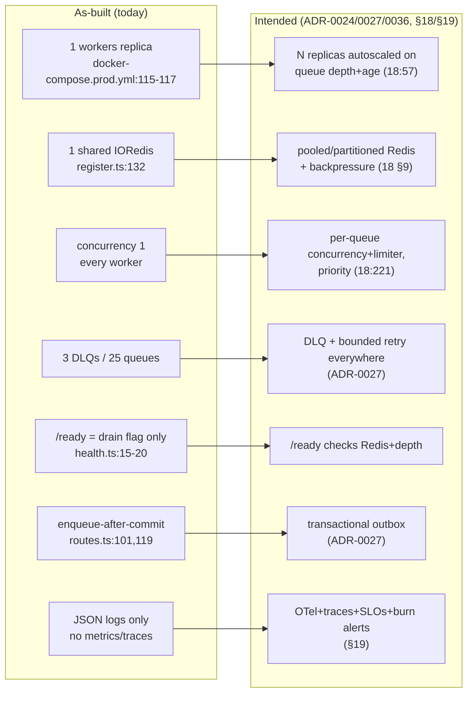
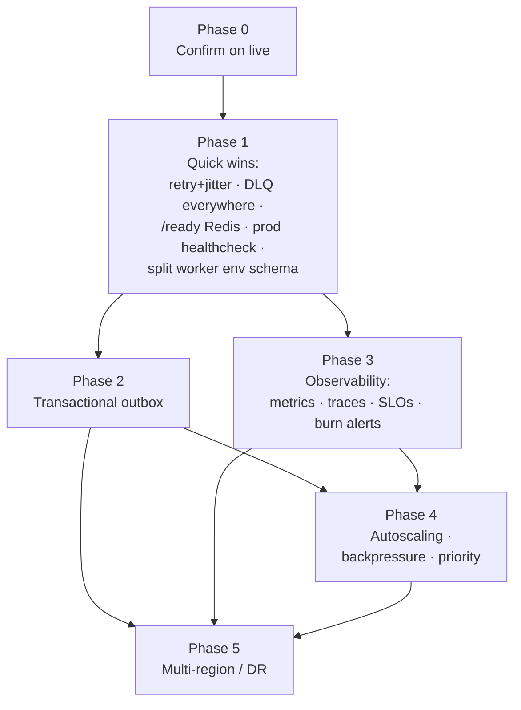
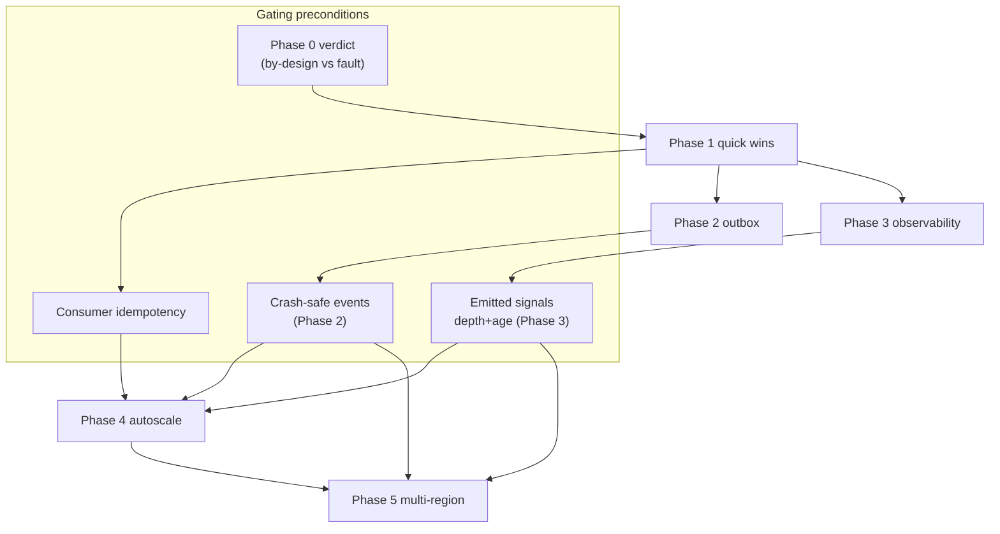

# Migration Strategy

> **Scope.** How to move the TruePoint (`@leadwolf/*`) background-job worker system from its
> **as-built** state (single-replica BullMQ fleet, concurrency 1, one shared Redis, thin
> observability, mostly no DLQ, enqueue-after-commit) to the **intended** enterprise target
> (`docs/planning/18-scalability-performance.md`, `docs/planning/19-observability-reliability.md`,
> `ADR-0024`, `ADR-0027`, `ADR-0036`) **without a rewrite and without a flag-day cutover**. This
> document owns *sequencing, reversibility, and phase gating*. The end-state design lives in
> [07-target-architecture.md](07-target-architecture.md); the concrete code work lives in
> [15-phased-implementation-plan.md](15-phased-implementation-plan.md); this file is the bridge
> between them.

**Related reading:** [00-executive-summary.md](00-executive-summary.md) ·
[01-current-architecture-audit.md](01-current-architecture-audit.md) ·
[02-root-cause-analysis.md](02-root-cause-analysis.md) ·
[03-live-inspection-runbook.md](03-live-inspection-runbook.md) ·
[04-issue-resolution-plan.md](04-issue-resolution-plan.md) ·
[06-gap-analysis.md](06-gap-analysis.md) ·
[07-target-architecture.md](07-target-architecture.md) ·
[09-reliability-fault-tolerance.md](09-reliability-fault-tolerance.md) ·
[10-observability-alerting.md](10-observability-alerting.md) ·
[11-capacity-finops.md](11-capacity-finops.md) ·
[12-security-review.md](12-security-review.md) ·
[13-operational-runbooks.md](13-operational-runbooks.md) ·
[14-re-audit-and-risks.md](14-re-audit-and-risks.md) ·
[15-phased-implementation-plan.md](15-phased-implementation-plan.md)

> **Reconciliation with re-audit (14).** This revision folds in second-pass findings from
> [14-re-audit-and-risks.md](14-re-audit-and-risks.md): **F2** — the money relay is *not* a clone of
> the daily `projection_sweep`; reuse only its primitives and run it continuously (§7 Phase 2).
> **F4** — drop the "zero duplicate spend" over-claim; under at-least-once delivery + RPO-5min DR,
> event *delivery* can duplicate on failover, so the guarantee is *no duplicate **charge*** via an
> idempotent per-batch credit lease (effectively-once effect, not exactly-once delivery) (§7 Phase 5,
> §11). **F13** — a hard gate that **all** live producers move onto the outbox, not one (§7 Phase 2
> & Phase 4). §8's phase↔plan mapping is additionally reconciled against the now-present
> [15-phased-implementation-plan.md](15-phased-implementation-plan.md) (the earlier
> `[NEEDS VERIFICATION]` is cleared).

---

## 1. How to read this document — three registers, one lens

Every claim below is tagged so the reader never confuses what *is* with what *should be*.

| Register | Meaning | How it is marked |
|---|---|---|
| **As-built** | Verified in the current codebase | `path:line` citation in backticks |
| **Intended** | Sanctioned design not yet built — docs/ADRs | "intended", cites `ADR-*` / `docs/planning/18` / `19` |
| **Recommendation** | This audit's proposal — does **not** exist yet | "recommend" / "target state" |

**The central lens (thread it through every phase):** most of the current "darkness" is
**by-design safe-by-default rollout**, *not* a defect. The bulk-enrichment money path is dark
because the global kill-switch `BULK_ENRICHMENT_ENABLED` defaults OFF
(`packages/config/src/env.ts:223`), the per-tenant flag `bulk_enrichment_enabled` defaults OFF
(`0048_seed_bulk_enrichment_flag.sql:1`), and the producer self-gates
(`apps/api/src/features/enrichment/bulkEnrichQueue.ts:48`). The migration must **preserve that
safety property at every phase** — no phase may light a spend path or widen blast radius as a
side effect of an infra change. Genuine defects (no DLQ on most queues, `/ready` never checks
Redis, prod workers container has no healthcheck, enqueue-after-commit) are called out explicitly
and fixed early; see [02-root-cause-analysis.md](02-root-cause-analysis.md) and
[06-gap-analysis.md](06-gap-analysis.md).

---

## 2. Why strangler-fig, not a rewrite

A rewrite of a live worker fleet that touches billing, enrichment spend, DSAR, and imports is
unacceptable risk. We instead grow the target system **around** the existing one behind stable
seams and cut over slice-by-slice — the *strangler-fig* pattern. The good news: **the seams
already exist in the codebase**, which is what makes this migration low-risk.

| Existing seam (as-built) | Why it is a strangler facade |
|---|---|
| **Queue-name decoupling** — producer and consumer share only a queue name + `REDIS_URL`, never each other's code (`apps/api/src/features/enrichment/bulkEnrichQueue.ts:5-6`) | We can stand up a *new* consumer (or a new queue) behind the same name and cut producers over one at a time. |
| **Env kill-switches** — 11 fail-closed `.transform(v => v === "true")` gates (`packages/config/src/env.ts:100,104,197,213,223,234,244,252,263,270`) | Each new lane ships **dark**; flip one var + restart to arm it. Instant deploy-level rollback (flip back). |
| **Per-tenant `feature_flags`** — override → global → default → unknown=OFF (`packages/core/src/featureFlags/evaluateFlag.ts:25-41`) | Progressive per-tenant rollout and instant per-tenant rollback **without a deploy**. |
| **Leader lock** — `SET key token PX ttl NX`, run-iff-won (`apps/workers/src/leaderLock.ts:24-25`) | Lets us scale sweeps to N replicas safely *before* we scale event workers — the precondition for autoscaling. |
| **DLQ pattern** — already proven on 3 queues (`apps/workers/src/register.ts:379,620,659`) | The dead-letter shape is established; extending it to the other 22 queues is replication, not invention. |

Strangler cutover therefore reduces to: **(a)** add the new capability dark, **(b)** enable it for
one lane / one tenant / one replica, **(c)** observe, **(d)** widen, **(e)** retire the old path.
No phase requires stopping the fleet.

---

## 3. Migration invariants (every phase must preserve these)

These are the non-negotiable properties. A phase that breaks one is rolled back regardless of its
other benefits.

1. **Spend safety is monotonic.** No infra change may cause a bulk-enrich `chunk` (the only spend
   step) to run without both env + per-tenant gates and a human confirm
   (`apps/api/src/features/enrichment/routes.ts:85-100`). See [12-security-review.md](12-security-review.md).
2. **Tenant isolation holds in async paths.** RLS scoping in workers and the non-RLS COPY staging
   caveat (`ADR-0036`) are owned by [12-security-review.md](12-security-review.md); no phase
   weakens them.
3. **Fail-closed stays fail-closed.** Every new gate defaults OFF, matching the existing
   `.optional().transform(v => v === "true")` convention (`packages/config/src/env.ts:100-107`).
4. **PII never enters a dead-letter.** The 3 existing DLQs are PII-free (`register.ts:379,620,659`);
   every new DLQ inherits that rule. See [12-security-review.md](12-security-review.md).
5. **Reversible before irreversible.** Config/flag flips precede schema changes; see the
   reversibility ladder (§6).

---

## 4. Current → target at a glance

The gap is characterised precisely in [06-gap-analysis.md](06-gap-analysis.md). The end-state is
drawn in [07-target-architecture.md](07-target-architecture.md). This document sequences the arrows.

---

## 5. Phase map (low-risk quick wins first)

Phases are ordered by **ascending blast radius and descending reversibility** — cheap, instantly
reversible fixes first; the multi-region rebuild last. Each phase is independently shippable and
independently rollback-able.

| Phase | Theme | Primary register | Reversibility | Blast radius | Depends on |
|---|---|---|---|---|---|
| **0** | Confirm-on-live (no code) | Recommendation (runbook) | N/A (read-only) | None | — |
| **1** | Reliability quick wins | Fix genuine defects | Config/flag/deploy revert | Low | 0 |
| **2** | Transactional outbox | Build intended (ADR-0027) | Feature-flag + revert | Low–Med | 1 |
| **3** | Observability | Build intended (§19) | Additive; remove exporter | Low | 1 |
| **4** | Autoscaling · backpressure · priority | Build intended (§18) | Scale-to-1 + flag | Med–High | 1,3 |
| **5** | Multi-region / DR | Build intended (§19 §6) | Fail-back / DNS revert | High | 2,3,4 |

**Why this order.** Phase 1 removes the failure modes that make *any* later phase dangerous
(silent job loss, un-restarted wedged workers). Phase 2 (outbox) is the correctness precondition
for Phase 4 — you cannot safely add autoscaling/backpressure on a pipeline that drops events on
crash (`ADR-0027` "explicitly rejects enqueue-after-commit without an outbox"). Phase 3 is the
precondition for Phase 4's *signals* — you cannot autoscale on queue depth+age you do not emit
(`docs/planning/18-scalability-performance.md:57`). Phase 5 needs all of the above.

---

## 6. The reversibility ladder

Every phase specifies its rollback in terms of this ladder. Rungs are ordered fastest/safest → slowest/riskiest. **Design each phase so its rollback lives as high on the ladder as possible.**

| Rung | Mechanism | Speed | Deploy? | Used to reverse |
|---|---|---|---|---|
| R0 | Per-tenant flag override OFF (`packages/types/src/featureFlags.ts:49,53-57`) | seconds | No | Per-tenant lanes (outbox opt-in, bulk features) |
| R1 | Env kill-switch → `"false"` + restart (`packages/config/src/env.ts:328-352`) | 1 restart | No (env only) | Any new env-gated lane |
| R2 | Config value change (concurrency, backoff, TTL) via redeploy | 1 deploy | Yes | Tuning: retry counts, limiter rates |
| R3 | Code revert (git revert of the phase PR) | 1 deploy | Yes | Behavioural changes (outbox writer, health check) |
| R4 | Data/schema down-migration | maintenance window | Yes | Outbox table, priority columns |
| R5 | Region fail-back / DNS cutover | minutes–hours | Runbook | Multi-region |

> Because env switches are **boot-time only** — read once in `loadEnv()` and frozen
> (`packages/config/src/env.ts:328-352`) — an env-gated rollback (R1) always costs one restart,
> never zero. Per-tenant flags (R0) are the only *no-restart* reversal, which is why every
> customer-facing lane should ride a per-tenant flag on top of its env gate.

---

## 7. Phase detail

Each phase states **Goal · Prerequisites/Dependencies · Change (as-built → target) · Reversible
rollback · Exit criteria**, plus the register and the by-design/defect classification.

### Phase 0 — Confirm on the live environment (no code)

**Register:** Recommendation (a runbook, not a change). **Classification:** neither — it *decides*
which of the two the reported dashboard state is.

**Goal.** Before touching anything, prove whether the reported dashboard state
(**Queued: 4, Awaiting Confirmation: 1**) is the **by-design resting state** or a **genuine
fault**. Per [02-root-cause-analysis.md](02-root-cause-analysis.md), `queued`/`awaiting_confirmation`
are `enrichment_jobs.status` values (DB control table), *not* BullMQ depth; a `queued` bulk-enrich
row is an **inert orphan by design** while `BULK_ENRICHMENT_ENABLED` is off — the code comment says
so verbatim (`packages/core/src/prospect/bulkActions.ts:330-332`), and `coord-bus` is explicitly
**not** the source of these counts (`tools/coord-bus/COORDINATION.md` has no such states).

**Prerequisites/Dependencies.** Prod read access; the [03-live-inspection-runbook.md](03-live-inspection-runbook.md)
command set.

**Change.** None. Execute the runbook: is the workers process up? is Redis reachable (not merely
buffering — recall `maxRetriesPerRequest:null` makes ioredis reconnect forever and buffer, so
`/health` stays 200 on a wedged consumer)? what are the DB `enrichment_jobs` status counts vs
BullMQ queue depths? are the env + per-tenant flags on or off?

**Reversible rollback.** N/A — read-only.

**Exit criteria.**
- [ ] Documented verdict: **by-design** (flags off, no fault) **or** a specific fault (worker not
      booted, Redis wedged, boot crash from a missing unrelated env var — `AUTH_ORIGIN`,
      `APP_ORIGINS`, `AUTH_COOKIE_DOMAIN`, `JWT_SIGNING_KID`, `DATABASE_URL`, `BLIND_INDEX_KEY`
      per `packages/config/src/env.ts:17,32,33,58,67,80`).
- [ ] If a fault: file it into [04-issue-resolution-plan.md](04-issue-resolution-plan.md) and treat
      as a Phase-1 candidate. If by-design: record the baseline and proceed.

> **Gate.** Do not start Phase 1 until Phase 0 has a written verdict. Migrating on top of an
> undiagnosed live fault compounds risk.

---

### Phase 1 — Reliability quick wins (fix the genuine defects)

**Register:** Fixes for **genuine defects** (not by-design). **Classification:** defect
remediation. These are the highest value/lowest risk changes in the whole migration.

**Goal.** Close the five defects that make the fleet un-self-healing and lossy, without changing
what any feature *does*. Detailed per-defect Root-cause/Impact/Fix/Rollback/Validation is in
[04-issue-resolution-plan.md](04-issue-resolution-plan.md); the reliability design rationale is in
[09-reliability-fault-tolerance.md](09-reliability-fault-tolerance.md). This document sequences and
gates them.

**Prerequisites/Dependencies.** Phase 0 verdict. No new infra.

**Change (as-built → target).** Five independent sub-slices, each shippable alone:

| # | Sub-slice | As-built defect | Target | Rollback rung |
|---|---|---|---|---|
| 1a | **Retry + backoff + jitter** | `attempts:1` (no retry) on enrichment, scoring, dsar, outreach, dedup, firmographics (`apps/workers/src/register.ts:205,211,217,223,324,330`); the two queues that *do* retry use pure `exponential` with no jitter (master-backfill `register.ts:335`, reverification `register.ts:281`) → thundering-herd on a shared provider outage | Bounded `attempts` with `backoff:{type:"exponential"}` **plus jitter** on every non-idempotent-safe event queue; keep attempts=1 only where a replay is unsafe and document why | R2 (config) |
| 1b | **DLQ everywhere** | Only 3 of 25 queues dead-letter (`register.ts:379,620,659`); the other 22 silently drop into BullMQ's failed set with no operator surface | Extend the proven PII-free DLQ pattern to every event queue; sweeps route terminal failures to a per-sweep dead-letter or alert. Establishes the redrive surface [13-operational-runbooks.md](13-operational-runbooks.md) needs | R3 (code) |
| 1c | **`/ready` checks Redis** | `/ready` returns 200 whenever `ready===true`, reflecting only the drain flag (`apps/workers/src/health.ts:15-20`); it **never** pings Redis, so a wedged consumer (buffering under `maxRetriesPerRequest:null`, `register.ts:132`) reports healthy | `/ready` performs a bounded Redis `PING` (and optionally an oldest-queue-age probe) and 503s when Redis is unreachable | R3 (code) |
| 1d | **Prod healthcheck + probe path** | The prod `workers` container is `<<: *app` with only a `command` — **no `healthcheck`, no published port** (`docker-compose.prod.yml:115-117`), so `health.ts:3002` is never probed and a wedged worker is never auto-restarted | Add a `healthcheck` hitting `/ready` on 3002 (mirror the pattern the `web`/`auth` services already use, e.g. `docker-compose.prod.yml:107-113,126-131`); orchestrator restarts a failed `/ready` | R2 (compose) |
| 1e | **Split worker env schema** | `loadEnv()` validates the **whole-app** schema and throws/crashes on any missing key (`packages/config/src/env.ts:328-335,352`), so the worker refuses to boot if an unrelated web/auth key (`AUTH_ORIGIN`, `APP_ORIGINS`, `AUTH_COOKIE_DOMAIN`, `JWT_SIGNING_KID`) is absent — a shared-config SPOF | Introduce a worker-scoped env subset (or a `superRefine` that only *requires* the keys the worker actually reads) so a worker boots on its own required set; unrelated keys stay optional for the worker role | R3 (code) + R2 |

**Sequencing within Phase 1.** Ship **1c + 1d together** (a Redis-aware `/ready` is worthless if
nothing probes it; a probe of a drain-only `/ready` gives false confidence). 1a, 1b, 1e are
independent and can land in any order. Recommend order: **1c+1d → 1b → 1a → 1e**.

**Reversible rollback.** All at R2/R3: config or single-PR revert. Crucially, **none of these
changes arm any dark feature** — they are pure resilience wiring, so rolling one back never exposes
spend or data. This is why Phase 1 is first.

**Exit criteria.**
- [ ] Every event queue has a bounded retry policy with jitter **or** a documented attempts=1
      justification.
- [ ] Every event queue routes terminal failures to a PII-free DLQ; redrive is documented in
      [13-operational-runbooks.md](13-operational-runbooks.md).
- [ ] `/ready` returns 503 when Redis is unreachable, verified by fault injection (block Redis,
      confirm 503 within the probe timeout).
- [ ] Prod `workers` container has a `healthcheck` on `/ready`; a killed/wedged worker is
      auto-restarted (verified in staging).
- [ ] Worker boots with only its required env keys present; missing web/auth keys no longer crash
      the worker.
- [ ] **Invariant check:** no spend path armed; bulk-enrichment still dark (env + flag OFF).

---

### Phase 2 — Transactional outbox

**Register:** Build **intended** design — `ADR-0027-real-time-delivery-and-event-backbone`
(transactional outbox, "DB commit ⇒ event published", at-least-once, crash-safe, idempotent
consumers). **Classification:** closes a **genuine correctness defect** — the current code uses the
enqueue-after-commit pattern the ADR *explicitly rejects*.

**Goal.** Make "job row committed" and "job enqueued" atomic, eliminating the at-least-once gap.

**As-built defect (the gap this closes).** Bulk-enrich DB rows are created with **zero** BullMQ
interaction (`packages/core/src/prospect/bulkActions.ts:337-364`); the single enqueue happens later,
in the confirm HTTP handler, **outside any shared transaction** — confirm-to-`running` at
`apps/api/src/features/enrichment/routes.ts:101`, then enqueue at `routes.ts:119`. So a job can be
flipped to `running` and the process die before enqueue (or the producer returns `null` because the
flag is off, `bulkEnrichQueue.ts:48`) → a `running` job with **no drive job in Redis**, and
`runBulkEnrich` only resumes if a drive job lands, so a lost enqueue is **not self-healing**. Note
this same enqueue-after-commit shape recurs across the event producers (`register.ts:200-218`), so
the outbox is a general fix, not a bulk-enrich special case.

**Prerequisites/Dependencies.** Phase 1 (DLQ + retry give the outbox drainer somewhere to
dead-letter). A durable Redis in prod (already `--appendonly yes`, `docker-compose.prod.yml:26`).
An idempotency discipline on consumers (partially present — the sequence tick already dedupes on
`seqstep:{logId}:{step}`, `register.ts:509`).

**Change (as-built → target).**
1. Add an **outbox table** written in the *same DB transaction* as the state change (e.g. the
   confirm flip). A projection-outbox drainer pattern **already exists** in the fleet
   (`projection_sweep` drains `projection_outbox`, brief §Queue 10), but **reuse only its
   *primitives* — the `withLeaderLock` guard and the `FOR UPDATE SKIP LOCKED` drain query — not its
   cadence or its cap** (reconciled with 14-re-audit-and-risks.md, F2). `projection_sweep` is a
   *daily, cap-2000, leader-locked batch* sweep; a credit/spend relay is **latency-critical and
   continuous**, so cloning that shape would inherit a ≤24 h publication latency and a 2000-row cap
   on the money path — a regression dressed as a fix, not a precedent to copy.
2. A **relay** — a **continuous** (sub-second-poll) drainer or a **CDC** reader, **not** a daily
   sweep — reads committed outbox rows and performs the BullMQ `add`, marking the row sent. State an
   explicit relay-latency budget (target p95 < 2 s enqueue-after-commit) and pick the relay's
   concurrency model deliberately: prefer the re-audit's **leaderless, partitioned `FOR UPDATE SKIP
   LOCKED`** drainers over pinning a single leader (14-re-audit-and-risks.md, F1).
3. **Idempotent consumers**: stable jobIds / dedupe keys so an at-least-once redelivery is a no-op.

**Strangler cutover.** Ship the outbox **dark behind a per-tenant flag** (`OUTBOX_ENABLED`-style
env gate + per-tenant `feature_flags` row, mirroring `evaluateFlag.ts:25-41`). Run **dual-write /
shadow** first: write the outbox row *and* keep the direct enqueue, reconcile that every committed
row produced exactly one job, then cut the direct enqueue over to the relay one producer at a time
(start with the lowest-volume, non-spend producer — e.g. `scoring`/`dedup` — not the money path).

**Reversible rollback.** R0 (per-tenant flag OFF) reverts a tenant to direct enqueue instantly;
R1 (env OFF + restart) reverts globally; R3 reverts the writer; R4 (drop the outbox table) is the
last resort. The dual-write phase means rollback never loses in-flight work.

**Exit criteria.**
- [ ] Shadow reconciliation shows **zero** committed-but-unenqueued rows over a sustained window.
- [ ] Kill-the-process-between-commit-and-enqueue fault test loses **no** jobs (the relay recovers
      them).
- [ ] Consumers proven idempotent under forced redelivery.
- [ ] **All live event producers** cut over to the relay (direct enqueue removed) — **not** just one
      — *or* each remaining producer carries a documented at-least-once + idempotent-consumer
      exception with a sweep backstop. Explicitly include the best-effort import→rollup fan-outs
      (`void enqueueDedup(...).catch(...)` after commit, `register.ts:389-410`), not only a single
      low-volume non-spend producer (reconciled with 14-re-audit-and-risks.md, F13). Cut over
      one-at-a-time (see strangler cutover) but the phase is **not done** until the set is complete.
- [ ] **Invariant check:** spend gates unchanged; outbox carries no PII into the queue payload
      beyond what the direct path already did.

---

### Phase 3 — Observability

**Register:** Build **intended** design — `docs/planning/19-observability-reliability.md`
(CloudWatch+Grafana RED, queue depth/age, correlation-id + tenant/workspace tags, X-Ray traces,
GlitchTip, PostHog, SLOs + error budgets + burn-rate alerts). **Classification:** closes a
**genuine gap** — today there is **no** telemetry stack (the only `@opentelemetry/api` in
`bun.lock:726,896` is an unused optional peer of drizzle-orm; `apps/api/src/instrumentation.ts` is a
boot warmup, not telemetry). Design detail: [10-observability-alerting.md](10-observability-alerting.md).

**Goal.** Emit the signals that make every later phase *operable* and *decidable* — you cannot
autoscale, backpressure, or DR on metrics you do not have.

**Prerequisites/Dependencies.** Phase 1 (a Redis-aware `/ready` and DLQs give the first real
signals; DLQ depth is an alert source). Independent of Phase 2 — can run in parallel.

**Change (as-built → target).** Additive instrumentation, layered:
1. **Structured logs → one correlation id + tenant/workspace tags.** Today `logger.ts` is a
   minimal JSON-line logger with no correlation id and no tenant tags
   (`apps/workers/src/logger.ts:9-11`); extend it. Additive — no behaviour change.
2. **Metrics: RED + queue depth/age/oldest-job** per queue. Replace the admin *pull-probe* that
   covers only 3 of 25 queues (`apps/api/src/features/admin/systemHealthProbes.ts:54-58,64-83`)
   with push metrics on all 25.
3. **Traces with context propagation** across the enqueue → outbox → consumer boundary (composes
   with Phase 2's outbox as the natural trace-context carrier).
4. **Per-bulk-job telemetry** — rows/sec, three-way succeeded/failed/unprocessed reconcile, DLQ
   depth, transient-vs-deterministic retry classification (`19 §9`).
5. **SLOs + error budgets + fast/slow burn-rate alerts** gating releases (`19 §2`, `ADR-0024`).

**Strangler cutover.** Instrumentation is **purely additive** and behind a sampling/exporter
config; it ships enabled-low and is ratcheted up. No feature behaviour changes.

**Reversible rollback.** R2 (disable the exporter / drop sampling to zero) or R3 (revert the
instrumentation PR). Because it is additive, rollback is inert — nothing depends on the telemetry
*yet* (Phase 4 introduces that dependency, which is why Phase 3 precedes it).

**Exit criteria.**
- [ ] All 25 queues emit depth, oldest-job-age, throughput, failure rate, DLQ depth.
- [ ] Every worker log line carries a correlation id + tenant/workspace tags.
- [ ] Traces span producer → outbox → consumer for at least the import and (dark) bulk-enrich
      lanes.
- [ ] SLOs defined with error budgets and burn-rate alerts wired (even if release-gating is
      advisory at first).
- [ ] Dashboards + alert catalog handed to [13-operational-runbooks.md](13-operational-runbooks.md).

---

### Phase 4 — Autoscaling · backpressure · priority

**Register:** Build **intended** design — `docs/planning/18-scalability-performance.md`
(stateless api+workers autoscale on **queue depth+age per domain** on ECS Fargate, `18:57`;
backpressure depth/age → autoscale → shed/slow producers, `18 §9`; **per-tenant bulk concurrency
caps**, `18 §9,§11.2`; **priority: bulk below money/real-time**, `18:221`). **Classification:**
build-out; the *primitives* (leader lock, per-queue workers) exist, the *scaling behaviour* does not.
Capacity model detail: [11-capacity-finops.md](11-capacity-finops.md).

**Goal.** Move from one fixed replica at concurrency 1 to an elastic fleet that scales on real
signals, sheds load safely, and never lets bulk starve money/real-time work.

**As-built starting point.** Prod is a **single** `workers` container (`docker-compose.prod.yml:115-117`)
with **concurrency 1 on every worker** (no `concurrency`/`limiter`/`lockDuration`/`stalledInterval`
set anywhere in `apps/workers/src`), all on **one shared IORedis** (`register.ts:132`). With one
replica the leader lock is trivially always-won, so nothing starves *today* — but that safety
depends on there being exactly one instance.

**Prerequisites/Dependencies (hard gates).**
- **Phase 2 outbox — with *all* live producers on it, not partially** (reconciled with
  14-re-audit-and-risks.md, F13). Autoscaling multiplies crash surface; scaling an
  enqueue-after-commit pipeline multiplies its lost-event probability. Do not scale replicas until
  the outbox is the source of truth **for every live event producer** (or each exception is
  documented with a sweep backstop). **Consumer idempotency alone is not sufficient:** a producer
  still on enqueue-after-commit loses events on crash regardless of consumer idempotency, and
  scale-out multiplies exactly *that* producer's crash surface — including the best-effort
  import→rollup fan-outs (`register.ts:389-410`). This is a hard gate, not a soft preference.
- **Phase 3 signals** — you scale on queue depth+age you must first emit (`18:57`).
- **Leader-lock correctness under N replicas** — the sweeps are already leader-gated
  (`leaderLock.ts:24-25`), but **event queues have no leader guard** and will now run on every
  replica. Confirm every event consumer is idempotent (Phase 2 requirement) before N>1.
- **Shared-Redis capacity / pooling** — one connection per process today; scaling replicas and
  raising concurrency raises connection count and command load. Coordinate with the platform
  connection-pooling decision (`ADR-0024`, `18`).

**Change (as-built → target), staged to bound blast radius:**

| Step | Change | Rollback |
|---|---|---|
| 4a | Per-queue **concurrency + limiter** tuning (still 1 replica) | R2: set back to 1 |
| 4b | **Priority classes** — bulk below money/real-time (`18:221`) | R2/R3 |
| 4c | **Per-tenant bulk concurrency caps** (`18 §9,§11.2`) — fairness | R0 per-tenant / R2 |
| 4d | **N replicas** behind idempotent consumers + leader-gated sweeps | R2: scale to 1 |
| 4e | **Autoscale on depth+age**; **backpressure** shed/slow producers, typed 503+Retry-After (`18 §9`, `19 §4`) | R1/R2: disable autoscaler, pin replica count |

**Strangler cutover.** Enable per **domain/queue** first (a low-risk queue like `dedup` or
`scoring`), then widen. Per-tenant caps ride the per-tenant flag (R0). Autoscaling ships with a
**hard min/max replica bound** so a runaway signal cannot scale to zero or to infinity.

**Reversible rollback.** Scale-to-1 (R2) instantly restores the known-safe single-replica topology
where the leader lock guarantees no double-run; disable the autoscaler (R1/R2) to pin capacity. All
higher on the ladder than a code revert.

**Exit criteria.**
- [ ] Replicas scale up on sustained depth+age and back down on drain, within min/max bounds.
- [ ] Backpressure sheds/slows producers with typed 503 + Retry-After under overload; no unbounded
      queue growth.
- [ ] Bulk work is provably de-prioritised below money/real-time under contention.
- [ ] Per-tenant bulk caps enforce fairness (one tenant cannot starve others).
- [ ] N-replica run shows **no** double-processing (idempotency + leader lock verified under
      concurrency).
- [ ] Freshness SLOs met at target load (e.g. bulk-enrichment p95 <30min/100k rows, `18`).

---

### Phase 5 — Multi-region / DR

**Register:** Build **intended** design — `docs/planning/19-observability-reliability.md §6`
(DR **RTO 1h / RPO 5min**, cross-region warm standby), `ADR-0024` (99.9% availability).
**Classification:** build-out; entirely greenfield relative to as-built (single-region single
Redis today). Design detail: [07-target-architecture.md](07-target-architecture.md),
[09-reliability-fault-tolerance.md](09-reliability-fault-tolerance.md).

**Goal.** Survive a region loss within RTO/RPO without data loss and **without a duplicate *charge***.
Honest bound (reconciled with 14-re-audit-and-risks.md, F4): under **at-least-once** delivery + **RPO
5 min** DR, event *delivery* **can** duplicate on failover — the guarantee is **effectively-once
*effect*, not exactly-once delivery**. No duplicate **charge** is enforced by the idempotent
**per-batch credit lease** (ADR-0029/0036) plus the confirmed per-run ceiling and the daily budget
breaker as backstops; absent an RPO-0 spend/idempotency ledger, duplicate spend is **bounded by the
RPO window** (≤5 min of in-flight paid work), not zero.

**Prerequisites/Dependencies.** Phases 2 (outbox = crash-safe, replayable event log — the basis for
cross-region recovery), 3 (cross-region observability + burn alerts), 4 (autoscaling in the standby
region). Data-residency constraints owned by [12-security-review.md](12-security-review.md).

**Change (as-built → target).** Warm-standby region: replicated DB (RPO ≤5min), regional Redis,
idempotent cross-region job handling so a fail-over replay yields **no duplicate *charge*** — bounded
by the RPO window and backstopped by the per-batch credit lease, the bulk-enrich confirmed-ceiling,
and the daily breaker spend caps (reconciled with 14-re-audit-and-risks.md, F4: the spend/idempotency
ledger lives in Aurora at RPO 5 min, so *delivery* can replay on failover — the *charge* is what is
de-duplicated, not the delivery). Chaos/game-day validation (`19 §7`).

**Strangler cutover.** Stand up the standby **passive**, run **game-day fail-overs** in a controlled
window before declaring it, then make it the sanctioned DR target. The active region is untouched
until fail-over is exercised.

**Reversible rollback.** R5 — fail back to the primary region / revert DNS; the standby stays
passive on any doubt. No irreversible cutover.

**Exit criteria.**
- [ ] Game-day fail-over meets RTO ≤1h / RPO ≤5min with **no duplicate *charge*** — duplicate
      *delivery* is bounded by the RPO window and reconciled within the daily budget breaker, **not**
      claimed to be "zero spend" (reconciled with 14-re-audit-and-risks.md, F4).
- [ ] Fail-back exercised and documented.
- [ ] DR runbook in [13-operational-runbooks.md](13-operational-runbooks.md); residency review
      signed off by [12-security-review.md](12-security-review.md).

---

## 8. Mapping onto the phased implementation plan

[15-phased-implementation-plan.md](15-phased-implementation-plan.md) holds the **code-level** work
(scope · files · verify · regression · perf · rollback · exit) and is explicitly **deferred (no code
yet)**. This strategy's phases map onto it as follows. The strategy owns *sequencing and gating*;
the implementation plan owns *the diff*.

| This doc (strategy phase) | 15-phased-implementation-plan.md (now present) | Notes |
|---|---|---|
| **Phase 0** — confirm on live | **Plan Phase 0** — confirm-on-live half (item 0.0) | Runbook, not code; gates everything |
| **Phase 1** — quick wins (retry+jitter, DLQ everywhere, `/ready` Redis, prod healthcheck, split worker env) | **Plan Phase 0** items 0.1–0.4 (retry+jitter, DLQ, `/ready` Redis, prod healthcheck) **+ Plan Phase 2** (split worker env schema); **Plan Phase 1** (failure containment) is an *added* sibling | The Plan splits this single quick-wins phase: four items land in Plan Phase 0, the env-schema split (Strategy 1e) is broken out as **Plan Phase 2**, and the Plan carves a **new Plan Phase 1** — failure containment (vendor timeouts, circuit breakers, stalled/lock tuning, per-queue concurrency, bounded drain) — that this strategy distributes between its Phase 1 and its Phase 4 step 4a |
| **Phase 2** — transactional outbox | **Plan Phase 3** — transactional outbox | ADR-0027; the plan enumerates the outbox table, relay, and consumer-idempotency diffs |
| **Phase 3** — observability | **Plan Phase 4** — observability & SLO stack | §19; metrics/traces/logs/SLOs |
| **Phase 4** — autoscaling/backpressure/priority | **Plan Phase 5** — elasticity (autoscale/backpressure/priority/per-tenant caps) | §18; the plan carries the concurrency/limiter/priority/caps diffs |
| **Phase 5** — multi-region | **Plan Phase 6** — multi-region / DR (last) | §19 §6; last in both |

> **Reconciliation note (reconciled against the now-present `15-phased-implementation-plan.md`).**
> The earlier claim "Strategy Phase 0 + Phase 1 == Plan Phase 0" is **superseded** — the Plan does
> *not* fold all five quick wins into its Phase 0. It keeps confirm-on-live + four quick wins
> (retry+jitter, DLQ, `/ready` Redis, prod healthcheck) in **Plan Phase 0**, breaks the worker-env
> split (this doc's Strategy 1e) out into **Plan Phase 2**, and adds a **Plan Phase 1** (failure
> containment: vendor timeouts, circuit breakers, stalled/lock tuning, per-queue concurrency, bounded
> drain) that this strategy did not carve as its own phase — it distributes that work between its
> Phase 1 and its Phase 4 step 4a. The relative *order* of the two documents still agrees (diagnose →
> quick wins → env split → outbox → observability → elasticity → multi-region); only the phase
> *numbering* differs (the Plan runs **0–6**, this strategy **0–5**). The prior `[NEEDS VERIFICATION]`
> flag (that `15-*` "was not yet present") is **cleared** — it exists now and the mapping above is
> reconciled to its actual phase headings (reconciled with 14-re-audit-and-risks.md, F15).

---

## 9. Cross-phase dependency graph

**Read the hard edges as:** *autoscaling (4) must not begin until the outbox (2) makes events
crash-safe and observability (3) emits the depth+age signal it scales on; multi-region (5) needs
all three.*

---

## 10. Migration risk register (risks of the migration itself)

Distinct from product risks — these are ways the *migration* could go wrong.

| Risk | Phase | Likelihood | Impact | Mitigation |
|---|---|---|---|---|
| An infra change accidentally arms a dark spend lane | All | Low | High | Invariant §3.1 checked at every phase exit; env + per-tenant gates remain fail-closed (`env.ts:223`, `routes.ts:85-100`) |
| Adding retries to a **non-idempotent** consumer causes duplicate side effects | 1a | Med | Med | Gate 1a behind the idempotency audit; keep `attempts:1` where replay is unsafe and document it |
| Scaling to N replicas before consumers are idempotent → double-processing (event queues have **no** leader guard) | 4d | Med | High | Hard gate: Phase 2 idempotency proven before N>1; scale-to-1 rollback (R2) |
| Outbox relay lag creates a *new* stuck state | 2 | Med | Med | Alert on outbox age (Phase 3); dual-write/shadow before cutover; relay dead-letters on exhaustion |
| Env-gated rollback forgotten to be boot-time-only (operator flips a var, nothing happens without restart) | 1e, all | Med | Med | Document R1 = flip + **restart**; prefer per-tenant flags (R0, no restart) for customer lanes |
| Shared single Redis becomes the bottleneck once concurrency/replicas rise | 4 | High | High | Coordinate Redis pooling/partitioning with platform (`ADR-0024`, `18`) as a 4-blocker |
| Observability rollout adds latency/cost to the hot path | 3 | Low | Low | Additive + sampled; R2 disable exporter |
| Dev-Redis wipe pattern (`--save "" --appendonly no`, `docker-compose.yml:21`) masks a durability regression in testing | 1,2 | Low | Med | Test outbox/DLQ durability against an `--appendonly yes` Redis (prod parity, `docker-compose.prod.yml:26`) |

---

## 11. Consolidated exit-criteria matrix

A phase is **done** only when every box is checked *and* the shared invariant check passes.

| Phase | Headline exit gate | Invariant re-check |
|---|---|---|
| 0 | Written by-design-vs-fault verdict on the live env | — |
| 1 | Retry+jitter + DLQ on every queue; `/ready` 503s on Redis loss; prod workers auto-restart; worker boots on its own env subset | No spend armed |
| 2 | Zero committed-but-unenqueued rows; crash-between-commit-and-enqueue loses nothing; one non-spend producer cut over | Gates + PII rules intact |
| 3 | All 25 queues emit depth/age/throughput/failure/DLQ; correlation-id+tenant logs; SLOs+burn alerts wired | Additive only, no behaviour change |
| 4 | Elastic scale on depth+age with min/max bounds; backpressure sheds safely; bulk de-prioritised; per-tenant caps; no double-processing at N>1 | Spend gates + fairness intact |
| 5 | Game-day fail-over meets RTO 1h/RPO 5min, **no duplicate *charge*** (duplicate delivery bounded by RPO, reconciled within the daily breaker — not "zero spend", F4); fail-back exercised | Residency signed off (security) |

---

## 12. Summary

The migration is a **strangler-fig** growth on seams the codebase already provides (queue-name
decoupling, env kill-switches, per-tenant flags, the leader lock, the proven DLQ shape), sequenced
**least-blast-radius-first**: diagnose on live (0) → reversible reliability fixes (1) → crash-safe
outbox (2) and additive observability (3) → elastic scale/backpressure/priority (4) →
multi-region/DR (5). Every phase is independently shippable, sits high on the reversibility ladder,
and re-checks the safety invariant that keeps the bulk-enrichment money path **dark by design**.
Nothing here presents a recommendation as if it were built: Phase 1 fixes **genuine defects**
([04-issue-resolution-plan.md](04-issue-resolution-plan.md), [06-gap-analysis.md](06-gap-analysis.md));
Phases 2–5 build the **intended** target ([07-target-architecture.md](07-target-architecture.md)) in
the order that keeps it safe. The concrete diffs live in
[15-phased-implementation-plan.md](15-phased-implementation-plan.md); the second-pass adversarial
review of this plan is [14-re-audit-and-risks.md](14-re-audit-and-risks.md).
