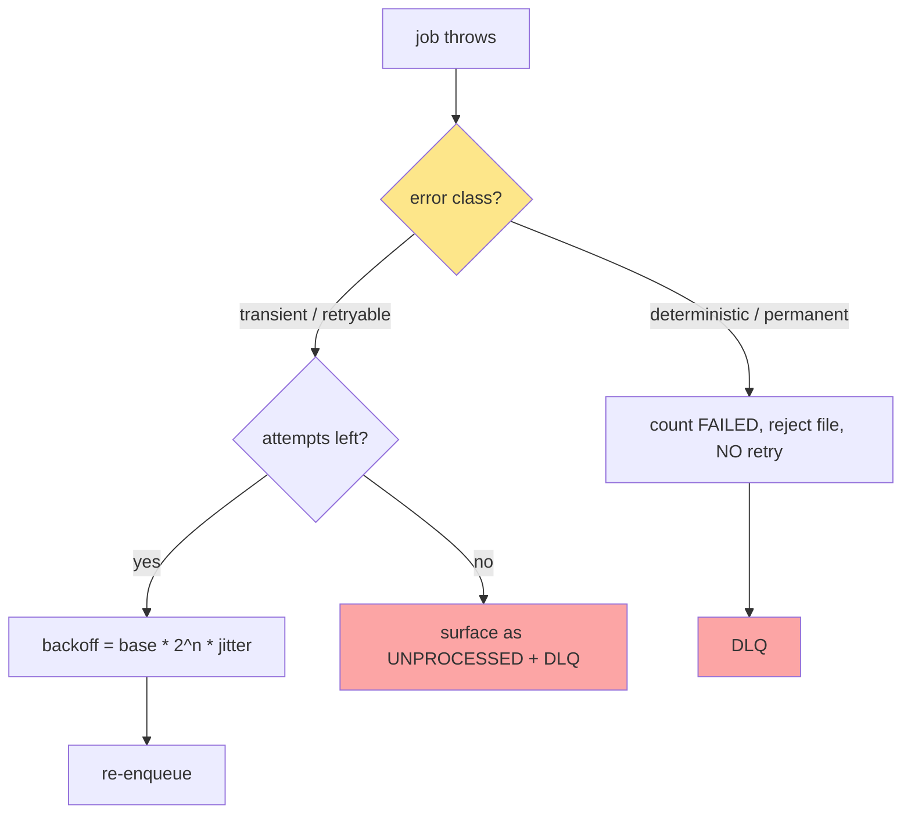
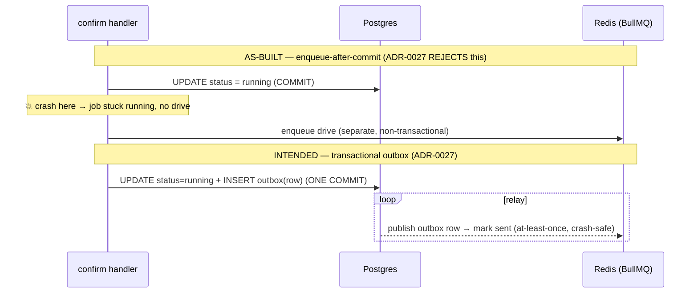
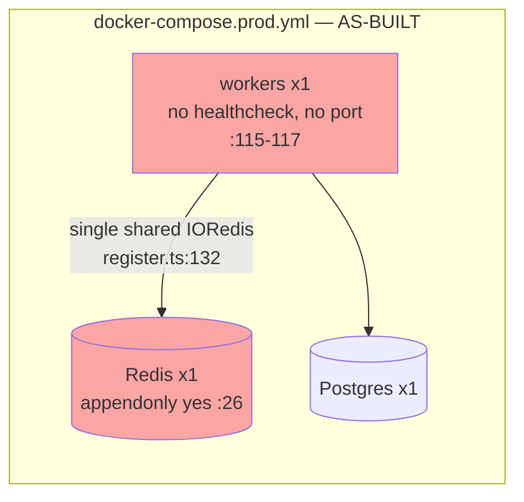
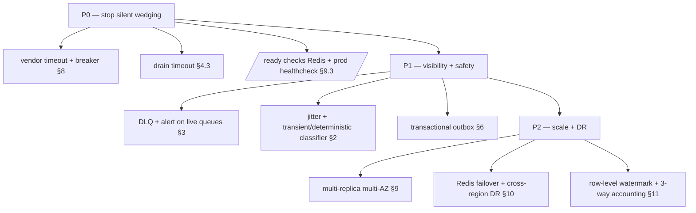

# Reliability & Fault Tolerance

> **Scope.** How the `@leadwolf/workers` fleet behaves when things go wrong: retries, dead-letter
> queues, stalled-job recovery, idempotency, the outbox gap, poison pills, vendor timeouts / circuit
> breakers, high availability, and disaster recovery. This is the failure-mode companion to
> [07-target-architecture.md](07-target-architecture.md) and the root-cause narrative in
> [02-root-cause-analysis.md](02-root-cause-analysis.md).
>
> **Three registers — kept strictly distinct throughout:**
> - **[AS-BUILT]** — what the code does today, every claim carrying a `path:line` citation.
> - **[INTENDED]** — the sanctioned design in the ADRs / planning docs (target, not shipped).
> - **[RECOMMENDATION]** — this audit's proposal. Never presented as if it exists.
>
> **The framing that governs this whole document:** most of the "missing" reliability machinery is
> *absent because the feature it would protect is deliberately dark* (safe-by-default rollout), **not
> because a shipped path is broken**. A handful of items are **genuine defects on live paths** and are
> flagged as such. Telling those two apart is the point — see the ledger in [§12](#12-defect-vs-by-design-ledger).

---

## 1. Reliability posture at a glance

The worker fleet is built from a small set of **sound primitives** and is missing an entire
**resilience layer** that the ADRs already sanction. The primitives that exist are real and correct;
the gaps are almost all *design intent not yet built*, with three exceptions that bite live paths.

| Capability | State | Where |
|---|---|---|
| Bounded retries + exponential backoff | **[AS-BUILT] partial** — only 3 of 25 queues | `apps/workers/src/register.ts:288`, `:345`; api `reverificationQueue.ts:42` |
| Jitter on backoff | **[AS-BUILT] none** — plain exponential | (no `type: "exponential"` carries jitter) |
| Transient-vs-deterministic classification | **[INTENDED]** only | `docs/planning/19-observability-reliability.md:99-110` |
| Dead-letter queues | **[AS-BUILT] partial** — 3 of 25 | `register.ts:379-385`, `:620-626`, `:659-665` |
| DLQ redrive tooling | **[AS-BUILT] none** | — (no redrive path in repo) |
| Stalled-job recovery | **[AS-BUILT] BullMQ default only** — untuned | `apps/workers/src` (zero `stalledInterval`/`maxStalledCount`) |
| Lock-duration tuning | **[AS-BUILT] BullMQ default 30s** — untuned | `apps/workers/src` (zero `lockDuration`) |
| Idempotency (money endpoints) | **[AS-BUILT] real** | `packages/db/src/repositories/idempotencyRepository.ts:14-76` |
| Idempotency (bulk chunks) | **[AS-BUILT] real** | `packages/core/src/enrichment/bulk/bulkProcessEnrichChunk.ts:106-108` |
| Transactional outbox | **[INTENDED]** — code uses the pattern the ADR **rejects** | `ADR-0027:25-30,49` |
| Circuit breakers / vendor timeouts | **[AS-BUILT] none — GENUINE DEFECT** | `packages/integrations/src/enrichment/httpProvider.ts:15` |
| Checkpoint / resume watermark | **[AS-BUILT] chunk-level (enrich)** / **[INTENDED] row-level (import)** | `runBulkEnrich.ts:82-92`; `ADR-0036:86-89` |
| HA — Redis / multi-AZ | **[AS-BUILT] single replica, single Redis** | `docker-compose.prod.yml:115-117` |
| DR — RTO/RPO | **[INTENDED]** RTO 1h / RPO 5min | `docs/planning/19-observability-reliability.md:55-60` |

**Headline:** the reliability layer is a *deliberate rollout gap*, not decay. The three items that are
genuine defects — **no vendor timeouts/circuit breakers**, **no drain timeout on shutdown**, and
**enqueue-after-commit instead of an outbox** — sit on paths that *are* (or will be) live, and are the
subject of Phase 0 in [08-migration-strategy.md](08-migration-strategy.md).

---

## 2. Retries, backoff & jitter

### 2.1 As-built — retry is opt-in and rare

Only **three** of the 25 queues set an `attempts`/`backoff` policy; every other event queue is
`attempts: 1` (a single try, no retry, no DLQ).

| Queue | Retry policy | Citation |
|---|---|---|
| `imports` | attempts 3, exp 2000ms, `removeOnFail:false` | api `import/queue.ts:38` |
| `master-backfill` | **attempts 4, exp 30000ms** | `apps/workers/src/register.ts:345` |
| `reverification` | **attempts 3, exp 60000ms** | `apps/workers/src/register.ts:288`; api `reverificationQueue.ts:42` |
| `bulk-imports` | attempts 3 | api `bulkQueue.ts:43` |
| `bulk-enrichment` | attempts 3 | api `bulkEnrichQueue.ts:49` |
| `enrichment`, `scoring`, `dsar`, `outreach`, `dedup`, `firmographics` | **attempts 1 — no retry** | `register.ts:205,211,217,223,324,330` |

Two retrying queues are also **deliberately idempotent so a retry is safe**: `master-backfill` only
re-resolves still-`NULL` rows and *throws* on `errored>0` to force a fresh-scan retry
(`register.ts:342-345`, self-heal note inline); `reverification` only touches still-stale rows
(`register.ts:280`). This is the *right* pairing — retry + idempotent consumer — but it exists on only
two paths.

### 2.2 The two real defects here

- **No jitter.** Every backoff is `type: "exponential"` with a fixed base delay
  (`register.ts:288,345`). BullMQ's plain exponential adds **no randomisation**, so N jobs that fail in
  the same tick (e.g. a vendor 500 storm) retry in lock-step — a **thundering herd** against the same
  recovering dependency. **[RECOMMENDATION]** move to `exponential` with a jitter term (BullMQ v5
  supports a custom backoff strategy) — target `delay * 2^attempt * (0.5 + rand*0.5)`.
- **`attempts: 1` on live paths that can transiently fail.** `dedup`, `firmographics`, and
  `master-backfill` are fired best-effort on **every completed import** (`register.ts:389-410`). Of
  these only `master-backfill` retries; a transient DB blip during `dedup`/`firmographics` **loses the
  rollup silently** (no retry, no DLQ). This is a **genuine (if low-blast-radius) defect** — the daily
  sweeps eventually re-run the same work, so it is self-healing on a 24h lag, not permanently lost.

### 2.3 Intended — transient vs deterministic classification

The observability spec already mandates the discipline this fleet lacks
(`docs/planning/19-observability-reliability.md:99-110`):

- **Transient** (lock contention, timeouts, replica lag) → **retry with exponential backoff + jitter**
  up to a bounded count; on exhaustion the rows surface as **unprocessed**, never silently dropped.
- **Deterministic** (validation, schema/type, constraint violation) → **no retry**, routed to the
  reject file, counted as **failed**.

**[AS-BUILT]** no code performs this classification — a failed job today is retried (if the queue has
`attempts>1`) *regardless of whether the error is retryable*. A deterministic error on `master-backfill`
burns all 4 attempts and 90s of backoff before dead-ending. **[RECOMMENDATION]** introduce an error
taxonomy (a typed `RetryableError` / `PermanentError`) checked in a shared `failed` handler; permanent
errors skip straight to the DLQ. This is Phase 1 of [08-migration-strategy.md](08-migration-strategy.md).



---

## 3. Dead-letter queues & redrive

### 3.1 As-built — DLQ on 3 of 25 queues

| DLQ | Feeder | Wiring |
|---|---|---|
| `IMPORTS_DLQ` | `imports` | `register.ts:379-385` (`deadLetterFailedImport` on `failed`) |
| `BULK_IMPORTS_DLQ` | `bulk-imports` | `register.ts:620-626` |
| `BULK_ENRICHMENT_DLQ` | `bulk-enrichment` | `register.ts:659-665` |

The pattern is correct: the DLQ is a holding `Queue`, the `failed` listener routes the exhausted job's
**PII-free** record into it, and the route's own failure is caught and logged (`register.ts:380-384`)
so a DLQ hiccup never crashes the worker. Two of the three DLQ feeders are behind dark flags
(`BULK_IMPORT_ENABLED`, `BULK_ENRICHMENT_ENABLED`), so in prod today **only `IMPORTS_DLQ` is live**.

**No DLQ** exists for: `enrichment`, `scoring`, `dsar`, `outreach`, `dedup`, `firmographics`,
`master-backfill`, `reverification`, or any of the 10 cron sweeps. For the `attempts:1` queues a single
failure is simply lost to the BullMQ `failed` set with no operator surface.

### 3.2 By-design vs defect

- **By-design:** the DLQ-less event queues (`enrichment`, `scoring`, `dsar`) have **no live producer**
  today — they are wired-ahead consumers with nothing to fail (see the queue table in
  [01-current-architecture-audit.md](01-current-architecture-audit.md)). A DLQ on a queue that never
  runs is not a gap that bites.
- **Defect:** `dedup`/`firmographics`/`reverification` **do** run in prod and have **no DLQ and no
  alert**. A poison payload on these lands in the `failed` set unseen. Because the daily sweeps re-drive
  the same work, the *data* self-heals, but the *signal* (something is failing) is invisible.

### 3.3 Redrive — does not exist

**[AS-BUILT]** there is **no redrive tooling** anywhere in the repo — a job in a DLQ stays there; the
only "replay" is manual re-enqueue. **[INTENDED]** ADR-0027 mandates "a **dead-letter queue** with
alerts" (`ADR-0027:29-30`) and §19 adds a "**bulk-job/DLQ-redrive runbook**"
(`docs/planning/19-observability-reliability.md:120`). **[RECOMMENDATION]** build (a) a DLQ-depth metric
+ growth alert per DLQ, and (b) an admin-triggered, idempotency-guarded redrive that re-enqueues a DLQ
record onto its source queue with a `redriven` marker. Ordering: metric/alert first (cheap, Phase 0),
redrive after idempotency is universal (Phase 1). See [10-observability-alerting.md](10-observability-alerting.md)
for the alert catalog and [13-operational-runbooks.md](13-operational-runbooks.md) for the redrive runbook.

---

## 4. Stalled-job recovery & lock tuning

### 4.1 As-built — every knob is at the BullMQ default

A repo-wide search confirms **zero** occurrences of `concurrency`, `limiter`, `lockDuration`,
`stalledInterval`, or `maxStalledCount` anywhere in `apps/workers/src`. Every worker therefore runs at
**concurrency 1** with BullMQ v5 defaults.

| Setting | Value (BullMQ v5 default, untuned) | Consequence |
|---|---|---|
| `concurrency` | 1 | one job at a time per worker; a slow job blocks its whole queue |
| `lockDuration` | 30 000 ms | a job must renew its lock every 30s or be considered stalled |
| `stalledInterval` | 30 000 ms | the stalled-check runs every 30s |
| `maxStalledCount` | 1 | a job may be reclaimed **once**; a second stall → moved to `failed` |

### 4.2 Why this is dangerous *in combination with* the vendor-timeout defect ([§8](#8-circuit-breakers--vendor-timeouts))

The lock model assumes a worker either finishes or crashes. But a vendor `fetch` with **no timeout**
(`httpProvider.ts:15`) can hang *indefinitely* while the process stays alive. With concurrency 1:

1. The hung job holds the queue (nothing else in that queue runs — the enrichment/reverification path
   is single-file behind it).
2. BullMQ's job lock **auto-renews while the process lives**, so a hung-but-alive worker is **not**
   flagged as stalled — `maxStalledCount` never triggers because the lock keeps getting renewed.
3. `/health` stays `200` (`apps/workers/src/health.ts:15-20` never checks Redis or queue age), so no
   orchestrator restarts it.

The result is a **silently wedged consumer** — the exact failure mode that leaves jobs "Queued"
forever. This compounds the Redis-buffering wedge already described in
[02-root-cause-analysis.md](02-root-cause-analysis.md) (`register.ts:132`, `maxRetriesPerRequest: null`
→ ioredis buffers commands and never errors).

### 4.3 Recommendations (ordered)

1. **[RECOMMENDATION / Phase 0]** put a hard timeout on every vendor call ([§8](#8-circuit-breakers--vendor-timeouts))
   — this is the *root* fix; stalled-detection is a backstop, not a substitute.
2. **[RECOMMENDATION]** set an explicit `lockDuration` per queue sized to the p99 job duration plus
   headroom; keep `maxStalledCount` at 1 but pair it with a stalled-job **metric + alert** so a reclaim
   is visible.
3. **[RECOMMENDATION]** raise `concurrency` above 1 on I/O-bound queues (enrichment, reverification) once
   timeouts exist — a single hung call must not be able to starve the queue.
4. **[RECOMMENDATION]** add a **drain timeout** to shutdown: `index.ts:20` does
   `await Promise.all(workers.map(w => w.close()))` with **no timeout** — a hung concurrency-1 job makes
   `close()` wait forever, so `SIGTERM` never completes and the orchestrator's kill-grace elapses into a
   `SIGKILL` mid-job. Bound the drain (e.g. `Promise.race([drain, timeout(25s)])`) and force-close on
   expiry.

---

## 5. Idempotency keys

Idempotency is the fleet's **strongest** reliability property — it exists and is correct where money is
at stake, which is exactly where it matters most.

### 5.1 As-built

| Layer | Mechanism | Citation |
|---|---|---|
| Money-endpoint replay | Store first response per `(tenant, Idempotency-Key)`; replay on retry | `idempotencyRepository.ts:14-42` |
| Money-mutation atomicity | `storeOwner` writes the key **inside** the mutation's tx → a rolled-back grant leaves no key | `idempotencyRepository.ts:66-76` |
| DB unique keys | The real double-charge guard under the replay cache | `idempotencyRepository.ts:1-3` (design note) |
| Bulk-enrich chunk | An already-`completed` chunk is a no-op (`getChunk` guard) | `bulkProcessEnrichChunk.ts:106-108` |
| Bulk-enrich spend accrual | `addRunSpendReturningTotal` — atomic accumulate + read-back | `bulkProcessEnrichChunk.ts:187` |
| Enrich re-enrichment | `enrichContact` answers cache/fresh with **no call, no cost** → retry-safe | `bulkProcessEnrichChunk.ts:142-143` |
| Sequence-tick dedupe | Enqueue keyed `seqstep:{logId}:{step}` → a re-tick never double-sends | `register.ts:509` (per brief) |
| Key expiry (retention) | `deleteExpired` reclaims keys >30d, batched | `idempotencyRepository.ts:83-94` |

The chunk-level guard (`bulkProcessEnrichChunk.ts:106-108`) is what makes at-least-once delivery safe on
the money path: a redelivered `chunk` job re-reads the chunk, sees `completed`, and returns the empty
result — **no double spend**.

### 5.2 The exactly-once impossibility → effectively-once

Distributed exactly-once delivery is impossible (the two-generals / commit-then-ack problem): you cannot
atomically "run the side effect" and "ack the message" across a process and a broker. BullMQ, like every
queue, is **at-least-once** — a job can be delivered again after a crash between side-effect and ack.

The **only** correct answer is **effectively-once = at-least-once delivery + idempotent consumers**,
which is exactly the pattern ADR-0027 mandates (`ADR-0027:26-27`: idempotent consumers keyed on event id
+ natural keys). This fleet achieves it **on the money path** (chunk guard + DB uniques) but **not
uniformly** — `dedup`, `firmographics`, `scoring`, `outreach` rely on the underlying operation happening
to be idempotent rather than an explicit dedupe key.

**[RECOMMENDATION]** make idempotency a **contract**, not a coincidence: every consumer keys on a natural
idempotency token (event id / job id / `(entity, version)`) and the queue is documented as at-least-once.
This is the precondition for safe DLQ redrive ([§3.3](#33-redrive--does-not-exist)) and for the outbox
([§6](#6-transactional-outbox)).

---

## 6. Transactional outbox

### 6.1 The gap — code uses the pattern the ADR explicitly rejects

**[INTENDED]** ADR-0027 is unambiguous: writers append an `outbox` row **in the same transaction** as
the state change; a relay publishes and marks it sent — **at-least-once, crash-safe**
(`ADR-0027:25-27`). It lists **"Enqueue-after-commit (no outbox) — Rejected — Drops events on crash
between commit and enqueue"** as an explicitly rejected alternative (`ADR-0027:49`).

**[AS-BUILT]** the confirm-to-drive path is *precisely* the rejected pattern. In the confirm handler:

```
routes.ts:101   result = await confirmBulkEnrichmentJob(...)   // DB: awaiting_confirmation → running (committed)
routes.ts:119   await enqueueBulkEnrichmentDrive(...)           // Redis: separate, NON-transactional enqueue
```

The status flip and the enqueue are **two separate operations with no shared transaction**
(`routes.ts:101` then `:119`). If the process dies between them, or `enqueueBulkEnrichmentDrive` returns
`null` because the flag is off (`bulkEnrichQueue.ts:48`), the job is left **`running` in the DB with no
drive job in Redis**. Because `runBulkEnrich` is resumable *only if a drive job lands*
(`runBulkEnrich.ts:82-92`), a lost enqueue is **not self-healing** — this is the "stuck `running`, no
drive" failure mode called out in [02-root-cause-analysis.md](02-root-cause-analysis.md).

The same shape recurs on the best-effort fan-outs (`register.ts:389-410`): `void enqueueDedup(...).catch(...)`
after the import commits — a crash between commit and enqueue drops the rollup (mitigated only by the
daily sweep).



### 6.2 Recommendation

**[RECOMMENDATION]** implement the ADR-0027 outbox for at minimum the confirm→drive transition and the
import→rollup fan-out: write an `outbox` row in the same tx as the status change; a relay (a new leader-
locked sweep, reusing `withLeaderLock`, `leaderLock.ts:17-34`) publishes unsent rows to BullMQ and marks
them sent. Combined with the chunk-level idempotency already in place ([§5](#5-idempotency-keys)), this
yields crash-safe, effectively-once delivery. Sequencing: this is a Phase 2 item in
[08-migration-strategy.md](08-migration-strategy.md) — it depends on universal idempotency (Phase 1)
landing first, because the relay is at-least-once by construction.

---

## 7. Poison-pill handling

A **poison pill** is a message that deterministically kills its consumer on every delivery. Without
bounded retries + a DLQ + idempotency, a poison pill either (a) retries forever, or (b) — with
`maxStalledCount` at its default — bounces through the stalled path and is dropped.

### 7.1 As-built exposure

| Queue class | Poison-pill outcome today |
|---|---|
| `imports` / `bulk-imports` / `bulk-enrichment` | **Contained** — bounded `attempts` → DLQ (`register.ts:379,620,659`) |
| `master-backfill` | Retries 4× then lands in `failed` set (no DLQ) — bounded but **invisible** |
| `attempts:1` queues (`dedup`, `firmographics`, `scoring`, …) | One try → `failed` set — **not** a retry loop, but **no DLQ, no alert** |
| Cron sweeps | A poison payload fails the whole sweep tick; next tick re-runs (self-healing if the payload is transient, a hard loop if deterministic) |

The good news: because most queues are **not** configured for aggressive retry, TruePoint does not have
a *runaway* poison-pill loop today. The bad news: it also has **no DLQ landing zone** for the poison pill
on 22 of 25 queues, and **no per-payload isolation** on the sweeps — one bad row in a sweep's batch can
fail the batch.

Two consumers *do* isolate a bad element correctly: `bulkProcessEnrichChunk` records an error ledger row
and **continues** on a per-contact failure so one bad contact never fails the chunk
(`bulkProcessEnrichChunk.ts:151-161`); `master-backfill` re-scans only unresolved rows so a keyless
leftover succeeds without burning the retry budget (`register.ts:342-345`).

### 7.2 Recommendation

**[RECOMMENDATION]** (1) give every live queue a bounded `attempts` + DLQ so a poison pill always has a
terminal home; (2) adopt the transient/deterministic classifier ([§2.3](#23-intended--transient-vs-deterministic-classification))
so a deterministic poison pill goes **straight** to the DLQ without wasting the retry budget; (3) add a
**poison-pill circuit** on the sweeps — a payload that fails N consecutive ticks is quarantined and
alerted rather than re-attempted forever. See the DoS angle in [12-security-review.md](12-security-review.md).

---

## 8. Circuit breakers & vendor timeouts

### 8.1 As-built — **GENUINE DEFECT**

The vendor enrichment/verification call has **no timeout, no circuit breaker, and no per-vendor retry**:

```
httpProvider.ts:15   const res = await fetch(url, { method: "POST", headers, body });
```

There is **no `signal`/`AbortController`**, no deadline, and no breaker around this `fetch`
(`packages/integrations/src/enrichment/httpProvider.ts:15`). The provider *does* map `429 → rate_limited`
and `>=400 → error` (`httpProvider.ts:50-52`), but a vendor that **accepts the connection and never
responds** (the worst and most common failure mode) hangs the call **indefinitely**. A repo search finds
**no circuit-breaker implementation** in `packages/integrations/src` at all.

This is the linchpin defect. Combined with concurrency 1 ([§4](#4-stalled-job-recovery--lock-tuning)),
one hung vendor connection:

- blocks the entire `enrichment` / `reverification` queue (single-file);
- keeps the job lock renewed (so it never trips `maxStalledCount`);
- leaves `/health` at `200` (so nothing restarts it);
- and — because `maxRetriesPerRequest: null` (`register.ts:132`) — a Redis wobble during that window
  *also* buffers silently.

The path is **live-capable** the moment a vendor API key + the enrichment flag are present, so this is
not "dark by design" — it is a real fault-tolerance hole on a real path.

### 8.2 Intended

§19 lists **"circuit breakers on providers/AI … typed `503` with `Retry-After` on saturation"** as a
reliability primitive (`docs/planning/19-observability-reliability.md:41`), and chaos testing is expected
to "**sever a provider**" and validate the breaker (`:65`).

### 8.3 Recommendation (Phase 0 — highest priority)

**[RECOMMENDATION]** wrap every outbound vendor call in:

| Control | Target |
|---|---|
| **Timeout** | Per-call `AbortSignal.timeout(ms)` on the `fetch` (`httpProvider.ts:15`) — e.g. 5s connect / 15s total; a timeout maps to the existing `error`/`rate_limited` status so the waterfall moves on. |
| **Circuit breaker** | Per-vendor breaker (closed → open → half-open) keyed in Redis; open on an error-rate/timeout threshold, fail-fast while open, probe on half-open. |
| **Bounded retry + jitter** | 1–2 retries on *transient* vendor errors (timeout, 5xx, 429-with-Retry-After) with jittered backoff; deterministic 4xx → no retry. |
| **Bulkhead** | Cap concurrent in-flight calls per vendor so one slow vendor cannot consume the whole worker. |

This single change closes the most dangerous live failure mode and is the top Phase 0 item in
[08-migration-strategy.md](08-migration-strategy.md) and [15-phased-implementation-plan.md](15-phased-implementation-plan.md).

---

## 9. High availability

### 9.1 As-built — single points of failure



- **Single worker replica.** Prod runs **one** `workers` container with **no `healthcheck` and no
  published port** (`docker-compose.prod.yml:115-117`), so `health.ts:3002` is effectively never probed
  and a wedged worker is **never auto-restarted**. The single-replica model is *why* the per-tick
  `withLeaderLock` (`leaderLock.ts:17-34`) never contends today — the sole instance always wins — but it
  is also a hard SPOF: if it wedges, everything async stops.
- **Single Redis, no failover.** One Redis instance, one shared `IORedis` connection for every queue,
  worker, and the mailbox throttle (`register.ts:132`). No Sentinel, no Cluster, no replica. Prod does
  set `--appendonly yes` (`docker-compose.prod.yml:26`) so a restart replays the AOF (dev uses
  `--save "" --appendonly no`, `docker-compose.yml:21` — a dev restart **wipes all repeatables + queued
  jobs**). Durability ≠ availability: an AOF survives a restart but the fleet is *down* during it.
- **`maxRetriesPerRequest: null`** (`register.ts:132`) turns a Redis outage into a **silent buffer-and-
  block** rather than a fast error — availability degrades invisibly (see
  [02-root-cause-analysis.md](02-root-cause-analysis.md)).

### 9.2 Intended

§19 mandates **multi-AZ across 3 AZs** for ALB/ECS/Aurora/ElastiCache
(`docs/planning/19-observability-reliability.md:39`) and health-checks + graceful drain on deploys
(`:40`); §18 puts **stateless workers autoscaling on ECS Fargate on queue depth+age**
(`docs/planning/18-scalability-performance.md`, per brief) — which requires the leader-lock to graduate
from a convenience to a **correctness** guarantee once replicas > 1.

### 9.3 Recommendations

**[RECOMMENDATION]** (1) run **≥2 worker replicas** across ≥2 AZs — this is safe today because sweeps are
already leader-gated (`leaderLock.ts:24-25`) but requires an audit that **every** cron sweep is leader-
gated (event queues are safe to run on all replicas). (2) Move Redis to **ElastiCache multi-AZ with
automatic failover** (Sentinel/Cluster). (3) Add a **prod `healthcheck`** that probes `/ready` *and*
extend `/ready` to check Redis reachability + queue liveness (`health.ts:15-20` currently checks
neither) so a wedged worker is restarted. (4) Add the **drain timeout** from [§4.3](#43-recommendations-ordered)
so rolling deploys don't `SIGKILL` mid-job. This is the HA track of [08-migration-strategy.md](08-migration-strategy.md).

---

## 10. Disaster recovery (RTO / RPO)

### 10.1 Intended

| Target | Value | Citation |
|---|---|---|
| **RTO** | **1 hour** | `docs/planning/19-observability-reliability.md:55` |
| **RPO** | **5 minutes** | `docs/planning/19-observability-reliability.md:55` |
| Mechanism | Aurora PITR + **cross-region warm standby**; S3 cross-region replication; Terraform-coded region rebuild; secrets in Secrets Manager (KMS) | `:56-57` |
| Failover | Documented, **partly automated** promotion runbook; **backup-restore verified quarterly** to an isolated env | `:58-60` |
| Availability SLO | **99.9%** (≈43 min/mo budget) | `ADR-0024` (per brief); §19 `:26` |

### 10.2 As-built vs the target

**[AS-BUILT]** none of this exists for the worker tier: single region, single Redis, single worker, no
cross-region replication, no tested restore of queue state. The **DR-relevant durable state** splits in
two:

- **BullMQ/Redis state** (queued + in-flight jobs, repeatable schedules) — held only in the single Redis
  AOF (`docker-compose.prod.yml:26`). A region loss loses **in-flight jobs**; RPO for queue state is
  effectively "since last AOF fsync," and there is **no cross-region copy**.
- **The DB control state** (`enrichment_jobs`, chunks, ledger) — recoverable via Aurora PITR to the
  intended RPO, *and* the pipeline is **resumable** from it (`runBulkEnrich.ts:82-92`), so a job's
  *progress* survives even if its Redis job does not — provided a drive job is re-enqueued.

This split is a **feature to exploit**: because the DB is the source of truth for job progress and the
work is checkpoint-resumable ([§11](#11-checkpointresume-watermarks-adr-0036)), DR for the async tier can
be "restore DB to RPO + re-drive incomplete jobs" rather than "recover exact Redis state" — Redis becomes
*rebuildable* rather than *precious*.

### 10.3 Recommendations

**[RECOMMENDATION]** (1) treat Redis as **rebuildable**: on DR cutover, re-register all repeatables
(idempotent — stable `jobId`s dedupe, e.g. `register.ts:232`) and **re-drive** every `enrichment_jobs`
row in `running` with incomplete chunks (`runBulkEnrich` resumes them). (2) Cross-region replicate the
DB (Aurora global) so the checkpoint state meets RPO 5min. (3) Add the DR game-day from §19 `:66` — a
tested restore is the only real RTO. See the DR runbook in [13-operational-runbooks.md](13-operational-runbooks.md).

---

## 11. Checkpoint/resume watermarks (ADR-0036)

### 11.1 As-built — chunk-level checkpointing (bulk-enrich)

The bulk-enrich pipeline **already** implements a coarse checkpoint/resume:

- The drive creates **all** chunk rows in **one atomic batch** *then* enqueues, so a re-drive never sees
  a partial set (`runBulkEnrich.ts:106-115`).
- A re-driven job **re-enqueues only its non-`completed` chunks** — it never re-creates them
  (`runBulkEnrich.ts:82-92`); the chunk row *is* the watermark.
- A redelivered chunk is a no-op if already `completed` (`bulkProcessEnrichChunk.ts:106-108`), and spend
  is accrued atomically with read-back (`bulkProcessEnrichChunk.ts:187`), so resume never double-charges.

The **one caveat** is granularity: the watermark is **per-chunk (~2k rows)**, not per-row
(`runBulkEnrich.ts:15`). A chunk that dies at row 1,999 of 2,000 **re-runs the whole chunk** on resume —
safe (idempotent, cache-hits are free per `bulkProcessEnrichChunk.ts:142-143`) but re-does work. There is
also a known finalize race (`bulkProcessEnrichChunk.ts:214-226`): the terminal flip re-reads status
instead of using a chunk-completion counter — the inline note calls this the "pragmatic v1."

### 11.2 Intended — row-level watermark (bulk-import)

**[INTENDED]** ADR-0036 mandates a finer contract for bulk import/export: each job carries a **batch
idempotency key**, each chunk a **deterministic id**, and a **resume watermark records the last committed
chunk so a retried or DLQ-replayed job resumes rather than re-applies — re-running past the watermark is a
no-op** (`ADR-0036:86-89`). UNLOGGED staging explicitly trades crash-durability for speed because **"a
crashed chunk is replayed from the watermark"** (`ADR-0036:142-144`). The state machine
`created→…→committing→completed` with `↘failed→DLQ` / `↘partial` (`ADR-0036:53-57`) is the target shape.

### 11.3 Gap & recommendation

| Aspect | As-built (bulk-enrich) | Intended (ADR-0036 bulk-import) |
|---|---|---|
| Watermark granularity | per-chunk (~2k) `runBulkEnrich.ts:15` | per-committed-chunk, deterministic id `ADR-0036:86-89` |
| Resume | re-enqueue non-complete chunks `runBulkEnrich.ts:82-92` | resume past watermark = no-op `ADR-0036:88` |
| Terminal accounting | status re-read (v1 race) `bulkProcessEnrichChunk.ts:214-226` | three-way per-row succeeded/failed/unprocessed `ADR-0036:91-94` |
| DLQ on the state machine | DLQ exists, `↘failed` not modelled as a state | `↘failed→DLQ` explicit `ADR-0036:53-57` |

**[RECOMMENDATION]** promote the bulk-enrich v1 to the ADR-0036 contract: replace the status-re-read
finalize with a **chunk-completion counter** (the inline note names this as the race-free fix,
`bulkProcessEnrichChunk.ts:214-216`), and adopt the three-way `succeeded/failed/unprocessed` accounting so
a partially-braked run reports what it never attempted rather than silently under-counting (the §19 §9.1
mandate, `docs/planning/19-observability-reliability.md:91-97`).

---

## 12. Defect vs by-design ledger

The single most important table in this document. Every reliability "gap" is classified as **by-design
darkness** (safe, expected, no live impact) or a **genuine defect** (bites a live or live-capable path).

| # | Item | Classification | Why | Priority |
|---|---|---|---|---|
| 1 | No vendor timeout / circuit breaker | **DEFECT** | `httpProvider.ts:15` hangs forever; wedges the queue on a live-capable path | **P0** |
| 2 | No drain timeout on shutdown | **DEFECT** | `index.ts:20` `close()` waits forever on a hung job → `SIGKILL` mid-job | **P0** |
| 3 | `/health` never checks Redis/queue | **DEFECT** | `health.ts:15-20` → wedged worker looks healthy, never restarted | **P0** |
| 4 | No prod healthcheck/port on worker | **DEFECT** | `docker-compose.prod.yml:115-117` → no auto-restart | **P0** |
| 5 | Enqueue-after-commit (no outbox) | **DEFECT (latent)** | `routes.ts:101`+`:119` → lost drive on crash; ADR-0027 rejects it `:49` | **P1** |
| 6 | No jitter on backoff | **DEFECT (minor)** | `register.ts:288,345` → thundering herd on shared-dep recovery | **P1** |
| 7 | No DLQ / alert on `dedup`/`firmographics`/`reverification` | **DEFECT (signal)** | data self-heals via sweep; failure is invisible | **P1** |
| 8 | Chunk-level (not row-level) watermark + finalize race | **DEFECT (minor)** | `bulkProcessEnrichChunk.ts:214-226` re-does a chunk; benign race | **P2** |
| 9 | No DLQ on `enrichment`/`scoring`/`dsar` | **BY-DESIGN** | **no live producer** — nothing to fail (dark queues) | Track |
| 10 | `bulk-enrichment`/`bulk-imports` inert | **BY-DESIGN** | env kill-switch off by default; consumer not even constructed `register.ts:636` | Track |
| 11 | Single worker replica / leader-lock uncontended | **BY-DESIGN (accepted)** | sole instance always wins; becomes a correctness need at replicas>1 | P2 (HA) |
| 12 | No transient/deterministic classification | **INTENDED not built** | `docs/planning/19-observability-reliability.md:99-110` | P1 |
| 13 | No multi-AZ / DR cross-region | **INTENDED not built** | §19 `:39,:55-60` — target, not decay | P2 |

**The through-line:** rows 9–13 are *not bugs* — they are a deliberately dark rollout (nothing runs, so
nothing can fail unsafely) or sanctioned-but-unbuilt design. Rows 1–8 are the real work, and rows 1–4
are the ones that could make jobs silently stick **today**.

---

## 13. Priority summary



- **P0 (do first, live risk):** vendor timeouts + circuit breakers ([§8](#8-circuit-breakers--vendor-timeouts)),
  drain timeout ([§4.3](#43-recommendations-ordered)), `/ready` Redis check + prod healthcheck
  ([§9.3](#93-recommendations)). These are cheap and stop the *silent-wedge* class outright.
- **P1 (visibility + safety):** universal DLQ + growth alerts + redrive ([§3](#3-dead-letter-queues--redrive)),
  jitter + transient/deterministic classifier ([§2](#2-retries-backoff--jitter)), transactional outbox
  ([§6](#6-transactional-outbox)).
- **P2 (scale + DR):** multi-replica multi-AZ ([§9](#9-high-availability)), Redis failover + cross-region
  DR ([§10](#10-disaster-recovery-rto--rpo)), row-level watermark + three-way accounting
  ([§11](#11-checkpointresume-watermarks-adr-0036)).

Sequencing, reversibility, and exit criteria for each are owned by
[08-migration-strategy.md](08-migration-strategy.md) and [15-phased-implementation-plan.md](15-phased-implementation-plan.md);
the operator-facing symptom→action procedures are in [13-operational-runbooks.md](13-operational-runbooks.md).

---

## See also

- [00-executive-summary.md](00-executive-summary.md) — the by-design verdict in one page.
- [01-current-architecture-audit.md](01-current-architecture-audit.md) — the full 25-queue table.
- [02-root-cause-analysis.md](02-root-cause-analysis.md) — why jobs sit "Queued"; the state machine.
- [03-live-inspection-runbook.md](03-live-inspection-runbook.md) — rule out the live failure modes.
- [06-gap-analysis.md](06-gap-analysis.md) — intended vs built matrix.
- [07-target-architecture.md](07-target-architecture.md) — where these primitives fit at scale.
- [10-observability-alerting.md](10-observability-alerting.md) — the DLQ/stall/burn-rate alerts this doc calls for.
- [12-security-review.md](12-security-review.md) — poison-job DoS, DLQ PII hygiene, idempotency-key spoofing.
