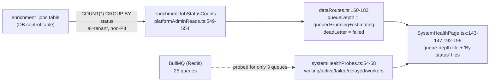
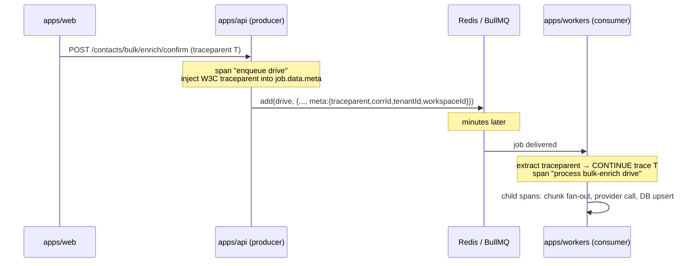
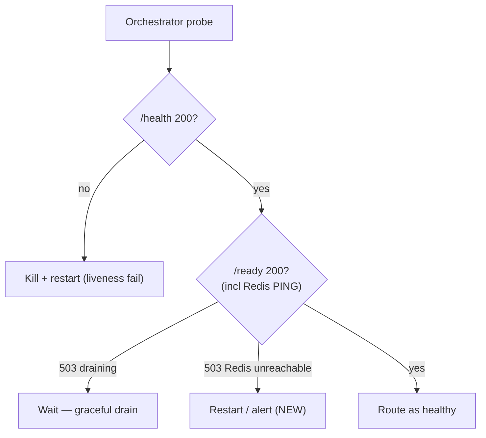

# Observability & Alerting

> **Scope.** How we *see* the TruePoint worker system (`@leadwolf/workers`) and how we get *paged* when
> it misbehaves: metrics, traces, logs, SLOs + error budgets, dashboards, worker-health monitoring,
> per-bulk-job accounting, and the alert catalog. This is the Obj4 telemetry pillar; it pairs with
> [09-reliability-fault-tolerance.md](09-reliability-fault-tolerance.md) (which builds the primitives we
> observe), [11-capacity-finops.md](11-capacity-finops.md) (the capacity signals that feed autoscaling),
> and [13-operational-runbooks.md](13-operational-runbooks.md) (where every alert in this doc must land).

---

## 0. The one thing to take away

The worker system today is **observably dark**, and that darkness has two very different causes that this
document must keep apart at all times:

1. **By-design darkness (safe-by-default).** Most queues are quiet because the bulk-enrichment / bulk-import
   / billing pipelines are deliberately gated off (env kill-switch + per-tenant flag + human confirm). The
   dashboard's `Queued: 4, Awaiting Confirmation: 1` is the *intended resting state* of a dark pipeline, not
   a stalled worker — see [02-root-cause-analysis.md](02-root-cause-analysis.md). This is correct behaviour.

2. **Genuine observability defect.** There is **no metrics, tracing, error-tracking, or alerting layer at
   all**. No RED metrics, no queue depth/age gauges, no correlation ids, no burn-rate alerts, no page. The
   admin dashboard live-probes only **3 of 25** queues (`apps/api/src/features/admin/systemHealthProbes.ts:54-58`).

The corrosive interaction between the two is the reason this doc matters: **because (2) is missing, an
operator cannot tell (1) apart from a real outage without the manual runbook in
[03-live-inspection-runbook.md](03-live-inspection-runbook.md).** "The queue is quiet by design" and "the
worker never booted / Redis is wedged" produce an *identical* dashboard. Closing the observability gap is
what turns that ambiguity into a signal. The gap itself is **not** by-design — it is unbuilt work
(intended in [doc 19](../19-observability-reliability.md) / [ADR-0024](../decisions/ADR-0024-performance-slos-and-capacity-model.md),
not yet implemented).

### Register legend (used throughout)

| Tag | Meaning |
|---|---|
| **[As-built]** | Verified in the current codebase with a `path:line` citation. |
| **[Intended]** | Sanctioned design in `docs/planning/*` or an ADR — a target, not shipped. |
| **[Recommendation]** | This audit's proposal; does **not** exist until built. |

---

## 1. Observability today (as-built)

The worker process ships a thin but honest primitive layer. Nothing here is telemetry in the
metrics/traces/SLO sense — it is liveness plumbing plus per-job log lines.

| Capability | As-built status | Citation |
|---|---|---|
| Liveness endpoint | `GET /health` → `200 "ok"`, unconditional | `apps/workers/src/health.ts:15` |
| Readiness endpoint | `GET /ready` → `200`/`503` from the `isReady()` drain closure | `apps/workers/src/health.ts:16-20` |
| Health server port | `Bun.serve` on **3002** | `apps/workers/src/health.ts:7,11` |
| Structured logs | one JSON object per line `{ts, level, msg, ...fields}` | `apps/workers/src/logger.ts:8` |
| Stream split | info/warn → stdout, error → stderr | `apps/workers/src/logger.ts:9-10` |
| Per-job instrumentation | `completed` → info line; `failed` → error line w/ `attemptsMade` | `apps/workers/src/register.ts:350-362` |
| Dead-letter queues | 3 of 25 queues (`IMPORTS_DLQ`, `BULK_IMPORTS_DLQ`, `BULK_ENRICHMENT_DLQ`) | `apps/workers/src/register.ts:379,620,659` |
| Admin queue probe | live BullMQ depth/worker read for **3 of 25** queues | `apps/api/src/features/admin/systemHealthProbes.ts:54-58` |
| Dashboard status tally | all-tenant `COUNT(*) GROUP BY status` over `enrichment_jobs` | `packages/db/src/repositories/platformAdminReads.ts:549-554` |

### 1.1 What is genuinely absent

**[As-built]** No telemetry library is installed anywhere in the repo — no OpenTelemetry, Sentry/GlitchTip,
Prometheus/`prom-client`, StatsD, AWS X-Ray, or PostHog (per the ground-truth audit; `@opentelemetry/api`
appears at `bun.lock:726,896` only as an unused optional peer of `drizzle-orm`). `apps/api/src/instrumentation.ts`
is a boot warm-up (DB pool + JWKS pre-fill), **not** telemetry despite the name.

Concretely, the following do not exist today and are **[Recommendation]** work below:

- No **metrics** of any kind (no RED, no queue depth/age/oldest-job-age, no throughput, no retry rate, no
  DLQ-depth gauge, no saturation, no per-tenant dimension).
- No **distributed tracing** and therefore no trace-context propagation across the enqueue boundary.
- No **correlation id** and no **tenant/workspace tags** on log lines — the logger emits only the fields a
  callsite passes, and `instrument()` passes `{queue, jobId}` only (`apps/workers/src/register.ts:352,354-358`).
- No **SLOs, error budgets, or burn-rate alerts**; no **alerting** and **no on-call page** at all.
- No **worker-health monitoring in production**: the prod container declares **no `healthcheck` and no
  published port** (`docker-compose.prod.yml:115-117`), so `health.ts:3002` is effectively never probed and
  a wedged worker is never auto-restarted (see [03-live-inspection-runbook.md](03-live-inspection-runbook.md)).

### 1.2 The readiness endpoint is liveness in disguise (defect)

**[As-built]** `/ready` returns `isReady()`, which is only the boot-and-not-draining flag; the handler
**never touches Redis or the queues** (`apps/workers/src/health.ts:16-20`). Combined with the shared
IORedis's `maxRetriesPerRequest: null` (`apps/workers/src/register.ts:132`), a **wedged consumer**
(Redis unreachable, commands buffering forever) keeps `/health` **and** `/ready` at `200` while draining no
jobs. This is a genuine defect, not by-design: readiness that cannot detect its critical dependency is not
readiness. Fixing it is a **P0 quick win** ([Recommendation], detailed in §6 and
[15-phased-implementation-plan.md](15-phased-implementation-plan.md) Phase 0).

### 1.3 The dashboard signal path (as-built)

The `Queued: 4, Awaiting Confirmation: 1` numbers are a DB tally of the `enrichment_jobs` **control
table**, not a BullMQ reading. Trace:



Two independent truths render on one page:

- **DB control table** (`enrichment_jobs`) → status tiles. Note `queueDepth` deliberately **excludes**
  `awaiting_confirmation` because that state waits on a human, not a worker
  (`apps/api/src/features/admin/dataRoutes.ts:166-167`). `deadLetter` is aliased to the `failed` status
  count (`dataRoutes.ts:182`) — but **no production code writes `failed` for enrichment jobs**
  (see [02-root-cause-analysis.md](02-root-cause-analysis.md)), so this tile reads `0` by construction.
- **BullMQ live probe** → depth/worker signal, but only for `imports`, `bulk-imports`, `reverification`
  (`systemHealthProbes.ts:54-58`). The probe is honest under failure — an unreachable queue reports
  `reachable:false` with `null` counts rather than a fabricated `0` (`systemHealthProbes.ts:70-78`), and
  service health is derived purely (`deriveServiceHealth`, `systemHealthProbes.ts:43-51`). The other **22
  queues have no depth/age/DLQ signal** anywhere in the product.

Crucially, the `QueueReport` shape carries `waiting/active/failed/delayed/workers`
(`systemHealthProbes.ts:17-25`) but **no age dimension at all** — there is no "oldest waiting job age"
signal even for the 3 probed queues. Age is the metric that distinguishes "quiet by design" from "stalled",
so its absence is central to the headline problem.

---

## 2. Intended architecture (docs / ADRs)

The sanctioned target already exists on paper. Cite these as **design intent**, not as shipped.

**[Intended]** [19-observability-reliability.md](../19-observability-reliability.md) defines the three-signals
model plus SLOs and alerting:

| Signal | Intended tooling | Scope | Citation |
|---|---|---|---|
| Metrics | CloudWatch + Grafana | RED per endpoint; queue depth/age; DB/replica/Redis; provider/AI cost | `docs/planning/19-observability-reliability.md:11` |
| Logs | CloudWatch Logs (structured JSON) | one correlation/request id; `tenant_id`/`workspace_id` tags; no PII | `docs/planning/19-observability-reliability.md:12,18` |
| Traces | AWS X-Ray | request → DB/search/queue/provider/AI spans | `docs/planning/19-observability-reliability.md:13` |
| Errors | GlitchTip (Sentry-compatible) | exceptions + release + tenant context | `docs/planning/19-observability-reliability.md:14` |
| Product | PostHog | funnels, feature usage, Data-Health adoption | `docs/planning/19-observability-reliability.md:15` |
| Synthetics | CloudWatch Synthetics | login/search/reveal canaries per region | `docs/planning/19-observability-reliability.md:16` |

- **SLOs + monthly error budgets** with fast-burn + slow-burn windows; budget exhaustion pauses risky
  releases (`docs/planning/19-observability-reliability.md:22-27`).
- **Symptom-based alerting** (SLO burn, error rate, queue age, DLQ growth, replica lag) on a **severity
  ladder** (SEV1→SEV3) with **on-call** and a **runbook per alert**
  (`docs/planning/19-observability-reliability.md:31-35`).
- **Per-bulk-job observability** (`docs/planning/19-observability-reliability.md:78-120`): rows/sec, a
  **three-way succeeded / failed / unprocessed** reconcile that must sum to the input row count
  (`19:92-94`), **transient-vs-deterministic retry classification** (`19:99-110`), DLQ depth, and
  stuck-job / high-error / DLQ-growth / unprocessed-on-completion alerts (`19:112-120`).

**[Intended]** [ADR-0024](../decisions/ADR-0024-performance-slos-and-capacity-model.md) is the quantified
performance contract these SLOs enforce: latency budgets, **async freshness SLOs** (enrichment p95 < 10 min,
scoring p95 < 5 min, search-sync p95 < 5 s, bounce→suppression p95 < 2 min — `ADR-0024:24-25`), **99.9%
availability** for the core API (`ADR-0024:23`), and **monthly error budgets whose burn gates risky
releases** (`ADR-0024:36`). [doc 18](../18-scalability-performance.md) adds the bulk-enrichment freshness SLO
(bulk p95 < 30 min / 100k rows) and — the key observability-driven scaling contract — **workers autoscale
on queue depth + age per domain** (`docs/planning/18-scalability-performance.md:58`), with **depth/age
backpressure** that sheds/slows non-urgent bulk producers before freshness SLOs break and keeps **bulk below
money/real-time in priority** (`docs/planning/18-scalability-performance.md:218-221`).

---

## 3. Gap analysis (intended vs built)

| Capability | Intended | Built | Register |
|---|---|---|---|
| RED metrics (rate/errors/duration) | Yes (`19:11`) | **None** | Genuine gap |
| Queue **depth** metric | Yes, per domain (`18:58`) | 3/25 via pull-probe (`systemHealthProbes.ts:54-58`) | Genuine gap |
| Queue **age / oldest-job-age** | Yes (`18:58`, `18:218`) | **None** (no age field, `systemHealthProbes.ts:17-25`) | Genuine gap |
| Throughput (rows/sec, jobs/sec) | Yes (`19:91`) | **None** | Genuine gap |
| Retry rate | Yes (implied by `19:99-110`) | `attemptsMade` logged, never aggregated (`register.ts:357`) | Genuine gap |
| DLQ **depth** metric | Yes (`19:96`) | 3 DLQs exist; only failed-count via probe, no gauge | Partial |
| Saturation (concurrency, lock waits) | Yes (`19:11`) | **None** (concurrency=1 everywhere, no signal) | Genuine gap |
| Per-tenant dimension | Yes (`19:12,89`) | **None** (status tally is all-tenant, `platformAdminReads.ts:549-554`) | Genuine gap |
| Distributed traces | X-Ray (`19:13`) | **None** | Genuine gap |
| Trace-context across enqueue boundary | Yes (`19:13`) | **None** | Genuine gap |
| Correlation id in logs | Yes (`19:12,18`) | **None** (`logger.ts` emits only passed fields) | Genuine gap |
| tenant/workspace log tags | Yes (`19:12,18`) | **None** (`register.ts:352,354-358` passes queue/jobId only) | Genuine gap |
| Error tracking | GlitchTip (`19:14`) | **None** (error lines to stderr only) | Genuine gap |
| SLOs + error budgets | Yes (`ADR-0024:18,36`; `19:22-27`) | **None** | Genuine gap |
| Burn-rate alerts | fast+slow (`19:24`) | **None** | Genuine gap |
| Alerting + on-call + page | Yes (`19:31-35`) | **None** | Genuine gap |
| Worker health probe in prod | Yes (`19:40`) | Endpoint exists, **not wired** (`docker-compose.prod.yml:115-117`) | Genuine gap |
| Readiness includes Redis | Implied (`19:40`) | No — liveness in disguise (`health.ts:16-20`) | Genuine defect |
| Per-bulk-job 3-way accounting | Yes (`19:92-94`) | **None** | Genuine gap |
| Retry classification (transient/deterministic) | Yes (`19:99-110`) | **None** | Genuine gap |
| Dashboards | CloudWatch + Grafana (`19:11`) | Admin `SystemHealthPage` (3 queues + status tiles) | Partial |

**Framing.** None of these gaps is "safe-by-default darkness" — they are unbuilt platform work. The
by-design darkness lives in the *pipelines* (flags off), not in the *observability layer*. Do not let the
former excuse the latter: a dark pipeline still needs a live "0 by design, and here is proof" signal, which
is exactly what depth+age+worker-count metrics provide.

---

## 4. Target metrics catalog (recommendation)

**[Recommendation]** Emit the following via OpenTelemetry metrics → CloudWatch/Grafana (`19:11`). Every
series is tagged `queue`, `tenant_id`, `workspace_id`, `env`, `region`. Per-tenant tagging is the dimension
that makes "one tenant's bulk job is starving everyone" visible (`19:89`); guard cardinality by keeping
tenant tags on aggregate gauges/counters, not on high-frequency histograms.

### 4.1 RED (per queue, per handler)

| Metric | Type | Definition | SLO it serves |
|---|---|---|---|
| `worker.jobs.received` | counter | jobs pulled into `active` | throughput |
| `worker.jobs.completed` | counter | `completed` events (`register.ts:352`) | throughput / error rate |
| `worker.jobs.failed` | counter | `failed` events (`register.ts:353`) | **errors (R-E-D)** |
| `worker.job.duration` | histogram | active→completed wall time | **duration**, freshness SLOs (`ADR-0024:24-25`) |
| `worker.jobs.retried` | counter | `attemptsMade > 1` on `failed` (`register.ts:357`) | retry rate |
| `worker.jobs.retry_ratio` | derived | `retried / received` | poison-job / provider-degradation signal |

### 4.2 Queue health (per queue)

| Metric | Type | Definition | Why |
|---|---|---|---|
| `queue.depth.waiting` | gauge | BullMQ `waiting` count | backlog; autoscale signal (`18:58`) |
| `queue.depth.active` | gauge | `active` | in-flight; concurrency=1 means this ≤ replica count |
| `queue.depth.delayed` | gauge | `delayed` (scheduled/backoff) | retry backlog, `outreach` deferrals |
| `queue.oldest_waiting_age` | gauge | now − head-of-`wait` enqueue ts | **the missing signal** — separates quiet-by-design from stalled (`18:218`) |
| `queue.age.processing` | gauge | now − oldest `active` job start | hung-job detector (concurrency=1 → head-of-line block) |
| `queue.dlq.depth` | gauge | count in `*_DLQ` (`register.ts:379,620,659`) | poison accumulation (`19:96`) |
| `queue.workers.connected` | gauge | connected consumers (CLIENT LIST) | "is anyone consuming?" (`systemHealthProbes.ts:49`) |
| `queue.saturation` | gauge | `active / (workers × concurrency)` | at concurrency=1, ≈ "all workers busy" |

> **Oldest-job-age is the linchpin.** For a dark queue, depth is small and age is small ⇒ *quiet by
> design*. For a stalled queue, depth grows and **age grows monotonically** ⇒ *incident*. The current probe
> has no age field (`systemHealthProbes.ts:17-25`); adding it is the single highest-leverage metric.

### 4.3 Per-bulk-job three-way accounting

**[Recommendation]** Per `job_id` (tenant/workspace-tagged), emit the reconcile mandated by
`docs/planning/19-observability-reliability.md:92-94`:

```
input_rows == succeeded + failed + unprocessed + deduped
```

| Bucket | Meaning | Retry policy (`19:99-110`) |
|---|---|---|
| `succeeded` | row processed to terminal success | n/a |
| `failed` | **deterministic** error (validation/schema/constraint) → reject file, **no retry** (`19:106-107`) |
| `unprocessed` | row **never attempted** (limit hit, cancelled, died mid-run, or transient-retries exhausted) (`19:92,104-105`) |
| `deduped` | collapsed by entity resolution — never hidden inside `succeeded` (`19:95`) |

An **unreconciled total is itself an alertable defect** (`19:94`): it means the job silently under-reported
work it never attempted. This directly maps onto the enrichment-job lifecycle's `paused`/`running` trap
states in [02-root-cause-analysis.md](02-root-cause-analysis.md) — a job parked in `paused` with no resume
would surface here as `unprocessed > 0` on a non-terminal job, exactly the signal that lets an operator
redrive it.

---

## 5. Traces & correlation (recommendation)

**[Recommendation]** Adopt OpenTelemetry (vendor-neutral) exporting to X-Ray/CloudWatch (`19:13`). The
non-negotiable requirement for a queue system is **trace-context propagation across the enqueue boundary**:
the producing HTTP request and the consuming worker job must share one trace, because they run in different
processes minutes apart.



Rules:

1. **Inject** W3C `traceparent` + a `correlation_id` + `tenant_id`/`workspace_id` into `job.data.meta` at
   enqueue time (producers: `apps/api/src/features/enrichment/bulkEnrichQueue.ts:45-51`, `import/queue.ts`,
   etc.). Today jobs carry no trace metadata.
2. **Extract** it in the worker and start the consumer span as a child, so the trace spans HTTP → Redis →
   worker → provider → DB. Without this, enqueue and execution are two disconnected traces and root-causing
   a slow bulk job is guesswork.
3. **Structured-log** the same `correlation_id` and tenant/workspace tags on every line. The current logger
   already emits arbitrary fields (`apps/workers/src/logger.ts:8`) — the change is to *thread the ids into
   every callsite*, starting with `instrument()` (`apps/workers/src/register.ts:352,354-358`), which today
   logs only `{queue, jobId}`. This satisfies `docs/planning/19-observability-reliability.md:12,18`.
4. **Never log PII** — preserve the existing discipline (`apps/workers/src/logger.ts:3`, DLQ payloads are
   already PII-free per [12-security-review.md](12-security-review.md)).

---

## 6. Worker-health monitoring (recommendation)

**[Recommendation]** Three fixes, in priority order, all reversible and low-risk (Phase 0 in
[15-phased-implementation-plan.md](15-phased-implementation-plan.md)):

1. **Deep readiness.** Make `/ready` (`apps/workers/src/health.ts:16-20`) additionally `PING` Redis with a
   short bounded timeout and return `503` when Redis is unreachable or command latency exceeds a threshold.
   This closes the "wedged consumer stays `200`" defect (§1.2). Keep `/health` as pure liveness so the
   orchestrator can distinguish "process alive" from "process useful".
2. **Wire the prod healthcheck.** Add a `healthcheck` (and expose the port on the internal network) to the
   `workers` service so `health.ts:3002` is actually probed and a wedged worker is auto-restarted
   (`docker-compose.prod.yml:115-117` currently has neither). Until this exists, no readiness improvement
   has any effect — nothing calls the endpoint.
3. **Emit worker-heartbeat + queue-depth/age metrics** (§4) so a wedged-but-restart-looping worker, or a
   quiet-by-design queue, is distinguishable on a dashboard without SSHing in (§7).



---

## 7. SLOs, error budgets & burn-rate alerts (recommendation)

**[Recommendation]** Adopt the [ADR-0024](../decisions/ADR-0024-performance-slos-and-capacity-model.md) /
[doc 19](../19-observability-reliability.md) model. The worker-relevant SLOs:

| SLO | Target (p95) | Source | Primary metric (§4) |
|---|---|---|---|
| Enrichment job freshness | < 10 min | `ADR-0024:24` | `worker.job.duration{queue=enrichment}` |
| Bulk-enrichment freshness | < 30 min / 100k rows | `18` (§2) | rows/sec + job duration |
| Scoring job freshness | < 5 min | `ADR-0024:24` | `worker.job.duration{queue=scoring}` |
| Search-sync (CDC→index) | < 5 s | `ADR-0024:25` | pipeline lag |
| Bounce→suppression | < 2 min | `ADR-0024:25` | `worker.job.duration{queue=outreach…}` |
| Import enqueue | 100 / 300 ms | `ADR-0024:22` | producer-side RED |
| Core API availability | 99.9% | `ADR-0024:23` | error budget ≈ 43 min/mo |

Each SLO gets a **monthly error budget**; budget **burn** is alerted on **two windows** — a *fast-burn*
(short window, high multiple → page now) and a *slow-burn* (long window, low multiple → ticket) — per
`docs/planning/19-observability-reliability.md:24`. Budget exhaustion **pauses risky releases** for that
surface (`19:26`, `ADR-0024:36`). Recommended multi-window pairs (industry-standard multi-burn-rate):

| Window pair | Burn rate | Budget consumed | Severity |
|---|---|---|---|
| 5 min & 1 h | 14.4× | ~2% in 1 h | SEV2 page |
| 30 min & 6 h | 6× | ~5% in 6 h | SEV2 page |
| 2 h & 24 h | 3× | ~10% in 1 day | SEV3 ticket |
| 6 h & 3 d | 1× | slow leak | SEV3 ticket |

> **Freshness SLOs are worker SLOs.** For an async system, "duration" is queue-wait + processing. An
> `oldest_waiting_age` (§4.2) breaching the freshness budget is the *leading* indicator; job-duration
> histograms are the *lagging* confirmation. Alert on both.

---

## 8. Dashboards (recommendation)

**[Recommendation]** Three Grafana boards (`19:11`), evolving today's admin `SystemHealthPage`
(`apps/admin/src/features/system-health/components/SystemHealthPage.tsx:143-147,192-199`) into a real board:

1. **Fleet overview** — per-queue depth, oldest-waiting-age, active, workers-connected, DLQ depth, retry
   ratio; one row per queue for all **25** queues (not 3). Colour age against the freshness SLO.
2. **Per-bulk-job** — for a selected `job_id`: rows/sec, the three-way succeeded/failed/unprocessed stacked
   bar with the reconcile check, deduped, DLQ depth, progress vs total (`19:87-97`).
3. **SLO / error-budget** — per SLO: current burn, budget remaining this month, multi-window burn-rate
   panels, and the release-gate status (`19:22-27`).

Every dashboard panel that can page **links to its runbook** in
[13-operational-runbooks.md](13-operational-runbooks.md) (`19:34`).

---

## 9. Alert catalog (recommendation)

**[Recommendation]** Symptom-based (`19:31`), on the SEV ladder (`19:33`), each with an on-call route and a
runbook link (`19:34`). Runbook anchors point at [13-operational-runbooks.md](13-operational-runbooks.md);
diagnosis steps point at [03-live-inspection-runbook.md](03-live-inspection-runbook.md).

### 9.1 Severity ladder

| Sev | Meaning | Response | Route |
|---|---|---|---|
| **SEV1** | Customer-facing async path down (money/real-time), or worker fleet 0 consumers | Immediate page, 24×7 | Primary on-call → EM |
| **SEV2** | SLO fast-burn, sustained backlog on a live queue, DLQ growth | Page in business+extended hours | Primary on-call |
| **SEV3** | SLO slow-burn, single stuck job, quality regressions | Ticket, next business day | Queue owner |

### 9.2 The catalog

| Alert | Condition (metric §4) | Sev | Suppress when by-design? | Runbook |
|---|---|---|---|---|
| **Worker fleet down** | `queue.workers.connected == 0` for a live queue > 2 min | SEV1 | No | [worker-down](13-operational-runbooks.md) |
| **Redis unreachable** | probe `redis:"down"` (`systemHealthProbes.ts:48`) / `/ready` Redis-PING fails | SEV1 | No | [redis-wedged](13-operational-runbooks.md) |
| **Wedged consumer** | `queue.active > 0` **and** `queue.oldest_waiting_age` rising, depth not draining | SEV1 | No | [redis-wedged](13-operational-runbooks.md) |
| **Money-path SLO fast-burn** | 14.4× budget burn on bulk-enrichment/billing freshness | SEV2 | No | [queue-backlog](13-operational-runbooks.md) |
| **Queue backlog / age** | `queue.oldest_waiting_age` > freshness SLO on a **flag-ON** queue | SEV2 | **Yes** — mute for flag-OFF queues (see §9.3) | [queue-backlog](13-operational-runbooks.md) |
| **DLQ growth** | `queue.dlq.depth` increasing over window (`19:118`) | SEV2 | No | [dlq-redrive](13-operational-runbooks.md) |
| **High retry ratio** | `worker.jobs.retry_ratio` > threshold (provider degradation / poison job) | SEV2 | No | [queue-backlog](13-operational-runbooks.md) |
| **Stuck bulk job** | no progress for window despite non-empty queue (`19:116`) | SEV2 | No | [stuck-job](13-operational-runbooks.md) |
| **Bulk high error-rate** | failed+unprocessed share of attempted > per-job budget (`19:117`) | SEV3 | No | [stuck-job](13-operational-runbooks.md) |
| **Unprocessed on completion** | job finished with `unprocessed > 0` (`19:119`) | SEV3 | No | [bulk-redrive](13-operational-runbooks.md) |
| **Unreconciled bulk totals** | `succeeded+failed+unprocessed+deduped ≠ input` (`19:94`) | SEV2 | No | [stuck-job](13-operational-runbooks.md) |
| **SLO slow-burn** | 1–3× burn over multi-hour/day window | SEV3 | No | [error-budget](13-operational-runbooks.md) |
| **`paused` job with no resume** | `enrichment_jobs.status='paused'` age > window (a lifecycle trap, [02](02-root-cause-analysis.md)) | SEV3 | No | [confirm-stuck-job](13-operational-runbooks.md) |

### 9.3 Alert design against by-design darkness (the crux)

The one alert that must be **flag-aware** is **queue backlog/age**. A dark queue (flag OFF) is *supposed* to
have zero throughput; alerting on its silence would page on correct behaviour and train the on-call to
ignore the board.

**[Recommendation]** the depth/age alerts must gate on the queue's enablement:

- **Flag-ON, backlog/age rising** → real incident → page (SEV2).
- **Flag-OFF (env kill-switch or per-tenant flag off), queue quiet** → **expected; suppress**. Instead emit
  a low-severity *informational* signal (`queue.enabled=false, depth=N, workers=…`) so the operator can
  affirmatively see "0 by design" rather than "0 unknown".
- **Flag-OFF but depth > 0 and not draining** (e.g. rows sitting in `queued` because the pipeline is dark by
  design — the `bulkActions.ts:330-332` "inert orphan" case) → **SEV3 informational**, *not* a page: this is
  the by-design orphan explained in [02-root-cause-analysis.md](02-root-cause-analysis.md), and the correct
  action is a runbook decision (enable or purge), not a 3 a.m. wake-up.

This is precisely the metric that would have answered the headline question automatically. With
enablement-tagged depth+age metrics, `Queued: 4, Awaiting Confirmation: 1` renders as *"bulk-enrichment
disabled; 4 inert `queued`, 1 `awaiting_confirmation` (waiting on a human) — expected"* instead of an
ambiguous number that requires the manual [03](03-live-inspection-runbook.md) runbook to interpret.

---

## 10. Rollout order (recommendation)

Sequenced to buy the most operator clarity per unit of work; full detail in
[15-phased-implementation-plan.md](15-phased-implementation-plan.md).

| Phase | Deliverable | Why first / dependency |
|---|---|---|
| **0 (quick wins)** | `/ready` Redis check; prod `healthcheck` wired; `oldest_waiting_age` added to the probe for all 25 queues | Removes the wedged-worker blind spot and answers the headline question; no new infra |
| **1** | OTel metrics SDK → CloudWatch; RED + queue depth/age/DLQ gauges; per-tenant tags | The metrics backbone everything else needs |
| **2** | Correlation id + tenant/workspace tags on every log line; error tracking (GlitchTip) | Cheap once §1 lands; makes incidents filterable by customer |
| **3** | Trace-context propagation across the enqueue boundary; X-Ray spans | Requires producers + consumers instrumented together |
| **4** | SLO + error-budget engine; multi-window burn-rate alerts; alert catalog wired to on-call | Needs stable metrics (Phase 1) as its input |
| **5** | Per-bulk-job three-way accounting + retry classification + bulk dashboards | Gated behind bulk-enrichment being enabled; only meaningful once the money path is live |

---

## 11. Cross-links

- [00-executive-summary.md](00-executive-summary.md) — verdict and P0/P1/P2 roadmap this doc feeds.
- [01-current-architecture-audit.md](01-current-architecture-audit.md) — the 25-queue table and boot/health as-built.
- [02-root-cause-analysis.md](02-root-cause-analysis.md) — the state machine and why the counts are by-design; the `paused`/`unprocessed` trap this doc alerts on.
- [03-live-inspection-runbook.md](03-live-inspection-runbook.md) — the *manual* substitute for the missing metrics; automating it is this doc's goal.
- [09-reliability-fault-tolerance.md](09-reliability-fault-tolerance.md) — DLQ/redrive/retry primitives whose depth and retry-ratio this doc measures.
- [11-capacity-finops.md](11-capacity-finops.md) — the depth/age autoscaling signals and per-tenant cost attribution built on these metrics.
- [13-operational-runbooks.md](13-operational-runbooks.md) — every alert here links to a runbook there.
- [15-phased-implementation-plan.md](15-phased-implementation-plan.md) — the deferred, verified build phases for §10.
- Intended design: [19-observability-reliability.md](../19-observability-reliability.md), [18-scalability-performance.md](../18-scalability-performance.md), [ADR-0024](../decisions/ADR-0024-performance-slos-and-capacity-model.md), [ADR-0027](../decisions/ADR-0027-real-time-delivery-and-event-backbone.md).
