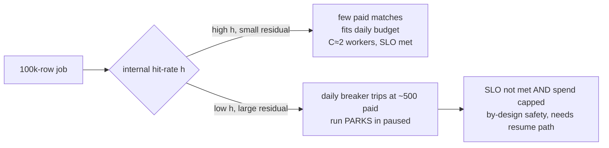
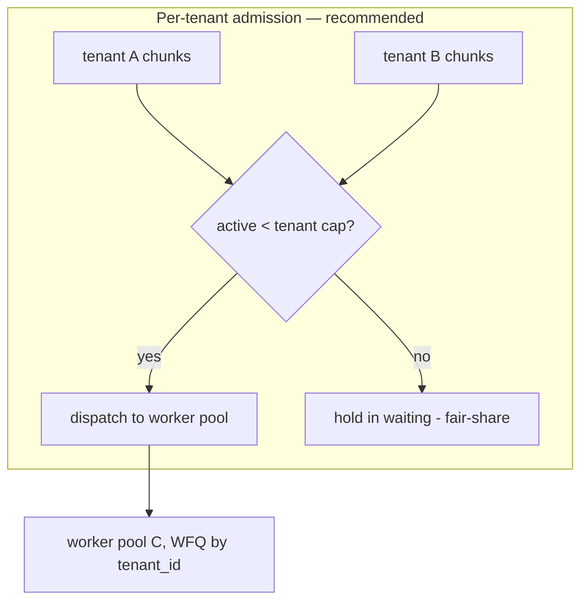
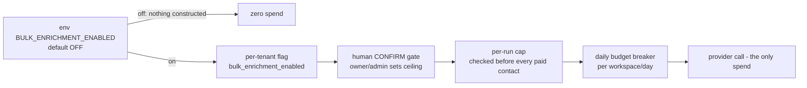

# Capacity Planning & FinOps

> Scope: how the `@leadwolf/workers` background-job system consumes compute and money — today, and
> at target scale (millions of users, billions of jobs). This document builds a throughput model,
> maps the freshness SLOs to required concurrency, defines the autoscaling signals and per-tenant
> fairness controls, and treats the metered enrichment/verification spend as a first-class FinOps
> surface with hard guardrails.
>
> Read alongside [01-current-architecture-audit.md](01-current-architecture-audit.md) (the 25-queue
> as-built), [02-root-cause-analysis.md](02-root-cause-analysis.md) (why bulk-enrichment jobs sit
> `queued`/`awaiting_confirmation` **by design**), [06-gap-analysis.md](06-gap-analysis.md),
> [07-target-architecture.md](07-target-architecture.md),
> [09-reliability-fault-tolerance.md](09-reliability-fault-tolerance.md),
> [10-observability-alerting.md](10-observability-alerting.md), and
> [13-operational-runbooks.md](13-operational-runbooks.md).

## Three registers (read every claim against these)

Throughout this document, every statement is tagged into exactly one of:

- **As-built** — verified in code with a `path:line` citation. This is what runs in production today.
- **Intended** — the sanctioned design target from `docs/planning/18`, `19`, or an ADR. Design intent,
  **not** shipped.
- **Recommendation** — this audit's proposal. Never presented as existing.

And the single most important framing of the whole audit is preserved here:

- **By-design darkness** — a capability is absent/inert *on purpose* (safe-by-default rollout: an env
  kill-switch defaults off, a per-tenant flag is unseeded, or a human confirm-gate has not fired). The
  "missing capacity" is a **deliberate zero**, not a fault.
- **Genuine defect** — a real capability gap that would bite the moment the feature is armed at scale
  (e.g. no autoscaling signal, no per-tenant fairness, an uncalibrated spend budget).

---

## Reconciliation with re-audit (14)

This document has been reconciled against the second-pass adversarial review in
[14-re-audit-and-risks.md](14-re-audit-and-risks.md). Findings applied here:

- **F3** (P0) — the **daily/workspace budget breaker** is a *read-check-act race*, not an atomic accrual
  (verified `packages/core/src/enrichment/enrichContact.ts:125-135`). Safe at concurrency 1 today; the
  moment [08 Phase 4](07-target-architecture.md) autoscale raises concurrency and scales replicas, **N
  concurrent chunks can each read `spent < budget` and all proceed**, overshooting the daily cap by up to
  **N paid calls**. The fix is an **atomic check-and-decrement** (a single SQL/Lua step, mirroring the
  per-run cap's `addRunSpendReturningTotal`), and the **per-batch credit lease** (ADR-0029/0036) must sit
  on the Phase-4 critical path — a hard gate before any spend-path concurrency increase — not be deferred.
  Absorbed in §6.1, §6.2, §10.
- **F7** (P1) — the per-tenant concurrency cap must be a real **distributed concurrency limiter** (an
  acquire-on-start / release-on-finish **lease** with TTL/heartbeat reclaim and fairness/aging), **not**
  the refill **token-bucket** shape of the mailbox throttle: a token bucket becomes a *rate* limit, and a
  naive lease *leaks on crash* and starves the very tenant it protects. Absorbed in §5.2.

---

## 1. Executive verdict

**Capacity, as-built, is a deliberate constant of one.** Every worker runs BullMQ concurrency **1**
on a **single** production container with **no autoscaler** and **no queue-depth signal**. This is
adequate — even correct — *today*, because the only paths that would generate real load
(`bulk-enrichment`, `bulk-imports`) are **dark behind env kill-switches** (see
[03 flag-gating](01-current-architecture-audit.md)). The dashboard's `Queued: 4 / Awaiting
Confirmation: 1` is the by-design resting state of that dark pipeline, not a saturated worker
([02-root-cause-analysis.md](02-root-cause-analysis.md)).

**FinOps, as-built, is unusually strong for a system this young.** The one path that spends real
provider money — bulk re-enrichment — is braked **three** independent ways in the same code that
issues the spend: a human confirm-gate that sets a per-run ceiling, an atomic per-run cap checked
before every paid contact, and a global daily budget breaker. All three sit behind a global
kill-switch that defaults off. A run with no confirmed ceiling spends **zero**
(`packages/core/src/enrichment/bulk/bulkProcessEnrichChunk.ts:113-118`).

The genuine gaps are all in the **elasticity and fairness** layer, and they are gaps *relative to the
armed-at-scale future*, not bugs today:

| Concern | As-built | Genuine defect when armed at scale? |
|---|---|---|
| Autoscaling on queue depth/age | None — one static container (`docker-compose.prod.yml:115-117`) | **Yes** — SLOs unreachable without it |
| Per-tenant concurrency cap / fairness | None (accidental global cap of 1) | **Yes** — noisy-neighbor risk |
| Per-batch credit lease (reserve-then-settle) | Not built; per-contact atomic accrual instead (`bulkProcessEnrichChunk.ts:184-188`) | **Partial** — cap works, but overshoot grows with concurrency |
| Daily budget default calibrated for scale | `$50/workspace/day` default (`packages/config/src/env.ts:121`) | **Yes** — a placeholder, flagged for calibration (`env.ts:124-126`) |
| Metered-spend guardrails / kill-switch | **Present and strong** | No — this is a strength |

The rest of this document quantifies each row.

---

## 2. As-built capacity posture

### 2.1 The physical facts

| Property | As-built value | Citation |
|---|---|---|
| Worker concurrency (every queue) | **1** (no `concurrency` option passed to any `Worker`) | e.g. `apps/workers/src/register.ts:375`, `:654` — options object is `{ connection }` only |
| Redis connections | **1 shared** IORedis for all Queues + Workers + throttle | `apps/workers/src/register.ts:132` |
| Production replicas | **1** `workers` container | `docker-compose.prod.yml:115-117` |
| Autoscaler | **none** | (no ECS/ASG config; single compose service) |
| Health probe wired to orchestrator | **none** — no `healthcheck`, no published port | `docker-compose.prod.yml:115-117` |
| Bulk-enrichment chunk band | **~2,000 rows** | `packages/core/src/enrichment/bulk/runBulkEnrich.ts:15` |
| Per-mailbox send throttle | token bucket, burst 10, refill 1/s | `apps/workers/src/register.ts:372`; `apps/workers/src/mailboxThrottle.ts:11-35,54` |

**Interpretation.** The effective sustained throughput of any single queue is `1 / S` jobs per
second, where `S` is the mean job service time. With `S` unbounded (no vendor timeout on the
enrichment waterfall — see [09-reliability-fault-tolerance.md](09-reliability-fault-tolerance.md)),
one hung job holds the BullMQ lock and stalls the queue indefinitely. That is a **defect** that only
matters once a queue is armed; today the armed queues carry no load.

### 2.2 Why concurrency-1 is safe *today* and a defect *tomorrow*

- **By-design safe today:** `bulk-enrichment` and `bulk-imports` workers are **never even constructed**
  while their env switch is off (`apps/workers/src/register.ts:636` guards the entire
  `bulk-enrichment` Worker/Queue/DLQ block). The single always-on load — `email_sequence_tick` every
  60 s, token refresh every 2 min, and the daily sweeps — is trivial and leader-gated. One container
  at concurrency 1 is right-sized for it.
- **Genuine defect tomorrow:** the moment `BULK_ENRICHMENT_ENABLED=true`, concurrency 1 becomes the
  binding constraint. Section 3 shows a 100k-row job would take **hours**, not the intended <30 min,
  on the current shape.

---

## 3. Throughput model (Little's law)

### 3.1 The law and how we apply it

**Little's law:** for any stable queueing system, `L = λ · W`, where `L` = mean number of jobs in the
system, `λ` = arrival (throughput) rate, `W` = mean time a job spends in the system (wait + service).

Two derived sizing rules drive every capacity decision below:

1. **Steady-state server sizing.** With `C` parallel single-job servers each of mean service time
   `S`, the maximum sustainable throughput is `μ_max = C / S`. To run at a target utilization `ρ*`
   (headroom), the required servers are:

   ```
   C ≥ (λ · S) / ρ*
   ```

2. **Batch-deadline sizing.** For a fixed batch of `N` rows that must complete within deadline `D`,
   under near-perfect parallelism the wall-clock is `≈ N · S / C`, so:

   ```
   C ≥ (N · S) / D
   ```

Both require an honest estimate of `S`, the mean per-row service time.

### 3.2 The service-time model for bulk re-enrichment (as-built path)

The as-built chunk step calls the shipped single-contact `enrichContact` waterfall per row
(`bulkProcessEnrichChunk.ts:143`). Two outcomes dominate `S`:

- **Cache/internal hit** — `enrichContact` answers from cache with **no provider call, cost 0**
  (`packages/core/src/enrichment/enrichContact.ts:120-123`). Fast: a DB read, call it `t_hit`.
- **Residual miss** — the provider waterfall runs (network I/O). Slower: `t_miss`.

With internal hit-rate `h` and residual (paid) fraction `r = 1 − h`:

```
S(h) = h · t_hit + (1 − h) · t_miss
```

> [ASSUMPTION] No production timing telemetry exists (no metrics libs are installed — see
> [10-observability-alerting.md](10-observability-alerting.md)). The worked numbers below use
> `t_hit = 0.02 s` (a warm DB read) and `t_miss = 2.0 s` (a provider waterfall). These are
> illustrative; the real values must be measured by the k6 load tests the design mandates
> (`docs/planning/18-scalability-performance.md:177-181`). Treat the *shape* of the conclusions as
> robust and the *absolute* numbers as pending calibration.

### 3.3 Required concurrency for the 100k-row / <30 min SLO

**Intended SLO:** bulk-enrichment job p95 **< 30 min for a 100k-row file**
(`docs/planning/18-scalability-performance.md:36-38`, `:200`). So `N = 100,000`, `D = 1,800 s`.
A 100k-row job at the 2,000-row band size is **50 chunks** (`runBulkEnrich.ts:15,95`), which caps
naive parallelism at 50 concurrent chunk-workers (one worker per chunk).

Applying `C ≥ N·S/D`:

| Residual paid fraction `r` | `S(h)` (s/row) | Serial time `N·S` | **Chunk-workers required `C`** | Feasible under 50-chunk cap? |
|---|---|---|---|---|
| 0.5% (500 paid) | 0.030 | 2,990 s | **2** | Yes |
| 5% | 0.119 | 11,900 s | **7** | Yes |
| 10% | 0.218 | 21,800 s | **13** | Yes |
| 20% | 0.416 | 41,600 s | **24** | Yes |
| 40% | 0.812 | 81,200 s | **46** | Barely (cap 50) |
| 100% | 2.000 | 200,000 s | **112** | **No** — must shrink band or raise per-worker concurrency |

**As-built comparison.** With `C = 1` (single container, concurrency 1), a 40%-residual 100k-row job
takes `81,200 s ≈ 22.6 hours` — roughly **45×** over the 30-min SLO. This is the concrete cost of the
concurrency-1 posture *if the feature were armed as-is*. It is a **genuine defect for the armed
future**, and by-design irrelevant today (the worker is never constructed while the flag is off,
`register.ts:636`).

**The band-size lever.** Above ~40% residual the 50-chunk ceiling binds before the SLO. Two orthogonal
fixes: (a) shrink `CHUNK_ROWS` (more chunks → more parallelism units — the constant is explicitly "a
target, not locked", `runBulkEnrich.ts:14-15`), or (b) run per-worker concurrency > 1 so each of the
50 chunks isn't pinned to one server. **Recommendation:** prefer per-worker concurrency (fewer, larger
chunks amortize the batch ledger write at `bulkProcessEnrichChunk.ts:193`), tuned by load test.

### 3.4 The budget breaker dominates the residual — a FinOps/throughput coupling

Here is the critical, non-obvious interaction. The daily budget breaker
(`enrichContact.ts:125-135`) trips at `ENRICH_DAILY_BUDGET_MICROS`, **default `50,000,000 µ$` = $50
per workspace per day** (`packages/config/src/env.ts:121`). At the placeholder cost of
`100,000 µ$ = $0.10` per paid match (`env.ts:127`), that is **~500 paid matches per workspace per
day** before the breaker throws and the run parks in `paused`.

Therefore a single 100k-row job **cannot** pay for more than ~500 residual misses under default
config — the residual is *forced* to `r ≤ 0.5%` regardless of the file's true hit-rate. Reading that
back into §3.3: the budget guardrail pins the *reachable* operating point to the **top row of the
table (`C = 2`)**. The money brake and the throughput SLO are coupled:



**Implication.** The <30 min SLO is only physically meaningful for **high-internal-hit-rate** files
under the default budget. This is *intended* — the design explicitly sizes the SLO "to the
provider-bound residual, not the whole file"
(`docs/planning/18-scalability-performance.md:200-207`). But it exposes two real items:

- **Genuine defect:** a budget-braked run sets `status='paused'` (`bulkProcessEnrichChunk.ts:206-210`)
  and **nothing flips `paused → running`** — see the trap-state analysis in
  [02-root-cause-analysis.md](02-root-cause-analysis.md). A large-residual job at scale would silently
  park. Resume must be built before arming.
- **Calibration debt:** `$50/workspace/day` is a placeholder the code itself flags for recalibration
  "when the real credit model lands" (`env.ts:124-126`). At target scale it must become a
  plan-tier-derived budget (see §6, §8).

### 3.5 The other bulk SLO: 1M-row ingest <30 min (import path, not enrichment)

The "1M-row < 30 min" target is the **CSV ingest** SLO (parse→stage→upsert→ER→index) at a floor of
**≥ 5,000 rows/s per tenant** (`docs/planning/18-scalability-performance.md:44-47`), owned by the
`bulk-imports` pipeline (ADR-0036), **not** enrichment. Sizing by the steady-state rule
`C ≥ λ·S/ρ*`: to sustain `λ = 5,000 rows/s`, with a per-worker upsert throughput of, say,
`μ_worker ≈ 2,000 rows/s` [ASSUMPTION — needs load-test measurement], you need
`C ≥ 5,000 / 2,000 / 0.6 ≈ 5` ingest workers at a 60% headroom target. The real ceiling is the
downstream **entity-resolution burst** (ER p95 < 15 min, its own SLO at
`docs/planning/18-scalability-performance.md:151-160`), not the parse. `bulk-imports` is likewise
**dark by default** (`BULK_IMPORT_ENABLED`, `register.ts:577`) and single-container today — same
by-design-vs-defect split as enrichment.

---

## 4. Autoscaling signals & targets

### 4.1 Intended vs as-built

| Aspect | Intended (design) | As-built | Register |
|---|---|---|---|
| Scaling unit | ECS task per worker domain | 1 static compose container | `docker-compose.prod.yml:115-117` |
| Primary signal | **queue depth + age per domain** | **none** | `docs/planning/18-scalability-performance.md:57-58` |
| Backpressure | depth/age → autoscale → shed/slow producers | none | `docs/planning/18-scalability-performance.md:142-149` |
| Headroom target | scale at ~60% (absorb spikes) | n/a | `docs/planning/18-scalability-performance.md:65` |
| Priority | **bulk below money/real-time** | n/a (single pool) | `docs/planning/18-scalability-performance.md:221` |

The design is unambiguous: workers "autoscale on **queue depth + age** per domain"
(`docs/planning/18-scalability-performance.md:57-58`) with a documented headroom target of ~60%
(`:65`). None of it exists in code — there is no metric emission at all (no OpenTelemetry / Prometheus
/ StatsD installed; see [10-observability-alerting.md](10-observability-alerting.md)), so there is
literally no signal an autoscaler could read. This is a **genuine defect for the armed future** and a
**by-design non-issue today** (one container suffices for the always-on sweeps).

### 4.2 Recommended signals and set-points

**Recommendation.** Adopt ECS target-tracking (or KEDA on a self-managed cluster) per worker domain,
driven by BullMQ queue metrics, with a two-signal policy so a small number of slow jobs scales out
before the depth alarm would:

| Signal | Source | Scale-out set-point | Scale-in | Rationale |
|---|---|---|---|---|
| **Queue depth** (`waiting + active`) | BullMQ `getJobCounts` | > `2 × C × batch` waiting | < 25% for 10 min | classic backlog signal |
| **Oldest-job age** (head-of-line wait `W`) | BullMQ `getWaiting()[0].timestamp` | age > 50% of the freshness SLO | age < 10% | catches slow-but-shallow backlogs |
| **Utilization** | active/`C` | > 60% (headroom, `18:65`) | < 30% | steady-state headroom |
| **DLQ growth rate** | DLQ `count` delta | any sustained positive slope | — | page, don't autoscale (poison, not load) |

Set-points derive directly from Little's law: **oldest-job age is the observable proxy for `W`**, and
the depth alarm is the observable proxy for `L`; holding both bounded holds `λ` served. Bulk queues
carry a **lower scaling priority and a hard max-replica ceiling** so they cannot outbid the
money/real-time paths for capacity (`docs/planning/18-scalability-performance.md:221`).

---

## 5. Per-tenant concurrency caps & fairness (noisy-neighbor)

### 5.1 The as-built "cap" is an accident, not a policy

**As-built:** there is exactly one `bulk-enrichment` queue, drained by one worker at concurrency 1.
The effective per-tenant concurrency cap is therefore **1 job for the entire fleet**, shared FIFO
across all tenants. That is not fairness — it is accidental global serialization. When the feature is
armed and workers are scaled (§4), FIFO across a shared queue means **one tenant's 1M-row burst can
monopolize every worker**, starving interactive and other-tenant work. That is the textbook
noisy-neighbor failure.

**Intended:** the design calls for a **per-tenant bulk concurrency cap** — "a **max concurrent jobs +
in-flight rows per tenant**, so one tenant's million-row burst can't starve shared
import/ER/search-sync workers; excess jobs queue (fair-share)"
(`docs/planning/18-scalability-performance.md:146-149`), reiterated for bulk-enrichment specifically
at `:215-217`, and paired with an ER-level per-tenant concurrency cap at `:158-160`.

**The one real fairness primitive that IS built** is the per-mailbox outreach throttle — a Redis token
bucket (burst 10, refill 1/s) keyed `email:throttle:{mailboxId}` (`register.ts:372`;
`mailboxThrottle.ts:11-35,54`). A throttled send is **deferred and re-enqueued, never dropped**
(`register.ts:370-372`). It proves the pattern exists in the codebase; it just isn't generalized to
bulk enrichment/import.

### 5.2 Recommended fairness architecture

**Recommendation.** Before arming bulk-enrichment at scale, add two-level fairness:

1. **Admission cap (per tenant) — a concurrency *lease*, not a token bucket** (reconciled with
   14-re-audit-and-risks.md, F7). At drive time, cap the number of a tenant's chunks that may be `active`
   concurrently (e.g. `min(C_total × maxTenantShare, hardTenantMax)`); excess chunks stay `waiting`.
   Implement it as a **distributed concurrency limiter** — a Redis counter with **acquire-on-start /
   release-on-finish** semantics — checked in the drive/enqueue path (`runBulkEnrich.ts:107-115`). **Do
   *not* reuse the mailbox token-bucket shape** (`mailboxThrottle.ts:11-35`): a refill-then-consume token
   bucket is a *rate* limiter and, after each refill interval, admits **more** than the intended concurrent
   ceiling. But a raw lease counter **leaks on crash** — a worker that holds a tenant's slot and is
   SIGKILLed mid-job (the drain-timeout / hung-vendor-call class in
   [09-reliability-fault-tolerance.md](09-reliability-fault-tolerance.md)) never releases, so the tenant's
   effective cap **shrinks permanently and the tenant starves itself** (fairness code that starves the
   tenant it protects is worse than none). Give the lease a **TTL/heartbeat reclaim** (mirror the leader
   lock's TTL-bounded holder, `apps/workers/src/leaderLock.ts:24`) so a crashed holder's slot auto-frees.
2. **Weighted fair queueing across tenants:** BullMQ's single-queue FIFO cannot do this alone. Either
   (a) shard by tenant into per-tenant queues with a round-robin worker, or (b) use BullMQ
   **group-based rate limiting / priorities** keyed on `tenant_id` so no tenant's chunks are dequeued
   faster than its fair share. Option (b) is lower-operational-overhead. **Add aging to the fair-share
   pick** (reconciled with 14-re-audit-and-risks.md, F7) so a tenant submitting many small jobs cannot
   repeatedly beat a starved tenant's one large job.
3. **In-flight-rows cap** (design's second half, `18:146-149`): bound not just job count but total
   in-flight rows per tenant, so a tenant can't submit one 10M-row job and evade the job-count cap.



This is a **genuine defect to close before arming**, and correctly **absent by design today** (a dark
single-tenant-at-a-time pipeline cannot have a noisy neighbor).

---

## 6. Metered enrichment/verification spend control (FinOps core)

This is where the as-built system is **strongest**. The one path that spends real provider money is
braked in depth, in the same code that issues the spend.

### 6.1 The three brakes + the kill-switch (as-built)



| # | Guardrail | Mechanism | Default / scope | Citation |
|---|---|---|---|---|
| 0 | **Kill-switch** | env `BULK_ENRICHMENT_ENABLED`; worker/queue **never constructed** when off; producer self-gates and returns `null` | **OFF** (global) | `register.ts:636`; `apps/api/src/features/enrichment/bulkEnrichQueue.ts:48` |
| 1 | **Per-tenant flag** | `bulk_enrichment_enabled` must be enabled for the tenant | OFF (seeded `global_enabled=false`) | dual-gate at confirm endpoint (see [01](01-current-architecture-audit.md)) |
| 2 | **Human confirm-gate** | `awaiting_confirmation → running` sets `credit_estimate_micros` = the confirmed worst-case ceiling; owner/admin only | ceiling `= contactIds.length × ENRICH_COST_MICROS_PER_MATCH` | `packages/db/src/repositories/enrichmentJobRepository.ts:331-345` |
| 3 | **Per-run cap** | before **every** paid contact, read the **live** run spend atomically and stop the instant the ceiling would be exceeded; **no ceiling ⇒ cap 0 ⇒ spends nothing** | per run | `bulkProcessEnrichChunk.ts:113-118,130-135,184-188` |
| 4 | **Daily budget breaker** | `spendSince(startOfUtcDay)` vs budget, checked **before any paid call**; throws `ProviderBudgetExceededError` | `$50/workspace/day` default | `enrichContact.ts:125-135`; `env.ts:121` |

Key properties, all verified:

- **Fail-safe default.** "A run with **no** confirmed ceiling caps at 0 → it spends nothing"
  (`bulkProcessEnrichChunk.ts:113-114`). The worker never spends without a human-accepted budget.
- **Atomic, cross-chunk-aware accounting.** Spend is accrued with
  `addRunSpendReturningTotal` (`bulkProcessEnrichChunk.ts:187`;
  `enrichmentJobRepository.ts:374`), which returns the **live** total including sibling chunks, so the
  next cap check is current across parallel workers.
- **Cache hits are free and never write.** Only paid contacts touch the ledger
  (`bulkProcessEnrichChunk.ts:186`); reuse-first is inherent to `enrichContact`
  (`enrichContact.ts:120-123`).
- **Verification** rides the same budget: the reverification sweep is soft-gated off entirely when
  `REACHER_BACKEND_URL` is unset (`reverificationSweep.ts:40`, per the 25-queue table in
  [01](01-current-architecture-audit.md)), so verification spend is likewise **zero by default**.

> **Race caveat (reconciled with 14-re-audit-and-risks.md, F3).** Guardrails #2/#3 (the per-run cap) are
> **atomic and cross-chunk-aware**, but guardrail #4 — the **daily/workspace budget breaker** — is **not**.
> `spendSince(startOfUtcDay)` then compare-to-budget is a **read-check-act race**
> (`packages/core/src/enrichment/enrichContact.ts:125-135`): at concurrency 1 (today) it is safe, but the
> moment §4 autoscaling raises concurrency and scales replicas, **N in-flight workers can all read
> `spent < budget` simultaneously and all proceed**, overshooting the daily cap by up to **N paid calls**
> with **no** atomic accrual behind it. The workspace-level backstop therefore carries the *same* overshoot
> class as the per-run cap (§6.2), one register worse: per-run overshoot is bounded by `C`, but the daily
> breaker's is bounded only by however many workers clear the stale check. **Fix (P0):** make the daily
> breaker **atomic — accrue-and-check in one SQL/Lua step**, mirroring the per-run cap's
> `addRunSpendReturningTotal` (§6.1 #3). This is independent of, and prior to, the per-batch lease (§6.2):
> the lease drives overshoot to *exactly zero*, but the atomic daily breaker is the cheap workspace-level
> backstop that must land before Phase-4 autoscale arms the spend path.

### 6.2 The intended "per-batch credit lease" is NOT built (design gap, not a defect today)

**Intended:** bulk operations should "reserve credits **once per batch via a lease** — not per row —
and settle" against the credit ledger (ADR-0036, amending ADR-0029:
`docs/planning/decisions/ADR-0036-bulk-async-job-and-staging-pipeline.md:7,100,131`;
`docs/planning/decisions/ADR-0029-credit-ledger-and-lease-decrement.md`).

**As-built:** there is **no lease**. The confirm-gate sets a *ceiling* (a soft budget, not a reserved
balance) and the worker accrues spend **per paid contact** atomically
(`bulkProcessEnrichChunk.ts:184-188`). This is a reasonable v1, but it has two consequences at scale:

- **Overshoot grows with concurrency.** The per-run cap can be exceeded "by at most one in-flight
  contact per chunk" (`bulkProcessEnrichChunk.ts:130-131`). With `C` concurrent chunk-workers, the
  worst-case overshoot is up to `C` contacts past the ceiling — bounded, small, but non-zero and
  concurrency-proportional. Today `C = 1`, so overshoot ≤ 1 contact — negligible **by design**.
- **No reservation against a real balance.** A ceiling is not a decremented credit balance, so two
  concurrent runs in the same workspace can each be individually under-ceiling yet jointly overspend
  the workspace's credits — the only backstop is the shared **daily** breaker (§6.1 #4), which is
  coarse (per-day, per-workspace) rather than per-balance. **And that backstop is itself racy**
  (reconciled with 14-re-audit-and-risks.md, F3): the daily breaker is a read-check-act check (§6.1 race
  caveat), so under autoscale it overshoots by up to `N` paid calls too — it must be made **atomic**
  (accrue-and-check in one step) before it can be relied on as the workspace-level backstop, and the
  lease must be armed **before** Phase-4 raises `C` on the spend path.

**Recommendation.** Adopt the ADR-0029/0036 per-batch lease before arming at scale: at confirm,
**reserve** `estimate` credits from the workspace balance; settle actuals on completion and refund the
unspent lease. This makes overshoot **zero** (you cannot spend an unreserved credit) and makes
concurrent runs safe without relying on the coarse daily breaker. This is a **planned enhancement**,
not a defect — the shipped brakes are sound for the current single-container, flag-off reality.

### 6.3 Budget guardrails to add for scale

**Recommendation** (layering on the built brakes, not replacing them):

- **Plan-tier daily budgets** replacing the single `$50` default (`env.ts:121-126` explicitly invites
  this).
- **Per-tenant AND per-workspace monthly cost ceilings** with circuit breakers, as the design already
  calls for (`docs/planning/18-scalability-performance.md:145`).
- **Spend-rate anomaly alerting** (a run's `µ$/min` vs its historical mean) wired to the alert catalog
  in [10-observability-alerting.md](10-observability-alerting.md).
- **A global emergency spend kill-switch** — the `BULK_ENRICHMENT_ENABLED` env switch already is one,
  but it requires a **restart** to flip (boot-time only; see [01](01-current-architecture-audit.md)).
  Add a **hot** (no-restart) per-tenant flag flip as the fast lever; keep the env switch as the
  break-glass.

---

## 7. Cost projections toward target scale

> [ASSUMPTION] All dollar figures below use the **placeholder** unit cost `$0.10/paid match`
> (`ENRICH_COST_MICROS_PER_MATCH = 100,000 µ$`, `env.ts:127`), which the code itself flags as
> "calibrate when the real credit model lands" (`env.ts:124-126`). Internal matches and cache hits are
> **free** (`enrichContact.ts:120-123`). Residual (paid) fraction is the dominant variable. These are
> **illustrative envelopes**, not a budget.

| Scenario | Workspaces | Rows/mo/ws | Residual `r` | Paid matches/mo | **Enrichment $/mo** | Binding guardrail |
|---|---|---|---|---|---|---|
| **Today (dark)** | — | — | — | **0** | **$0** | Kill-switch off (`register.ts:636`) — spends nothing |
| Pilot | 1 | 100k | 10% | 10k (~333/day) | $1,000 | Fits daily breaker ($50/day = ~500/day) |
| Growth | 100 | 100k | 10% | 1.0M | $100,000 | Fits per-ws daily breaker in aggregate |
| Scale | 1,000 | 500k | 15% | 75M | $7.5M | Daily breaker default **too low** — must calibrate |
| Target | 10,000 | 500k | 15% | 750M | $75M | Requires plan-tier budgets + per-batch lease (§6) |

**Reading the table.** Two facts jump out:

1. **The default daily breaker is a scale blocker, not just a safety net.** At `$50/workspace/day`, a
   workspace can pay for ~500 matches/day ≈ 15k/month. The "Growth" and "Scale" rows already exceed
   that per-workspace ceiling and would **park runs in `paused`** (§3.4) rather than overspend. That is
   the *by-design* safety behaviour biting — correct, but it means the budget **must** be lifted to a
   plan-tier value *before* those volumes are real, or every large job stalls.
2. **Cost scales with the *residual*, not the file.** The single most effective FinOps lever is the
   internal hit-rate `h` (higher `h` ⇒ fewer paid matches ⇒ lower cost *and* lower required
   concurrency, §3.3). Investment in match coverage (the master-graph KV fast path,
   `docs/planning/18-scalability-performance.md:198-207`) pays back twice.

**Compute cost is a rounding error next to provider spend.** Even the §3.3 worst case (112 chunk-
workers for a fully-residual 100k job) is a few dozen Fargate tasks for tens of minutes. At target
scale, **metered provider spend dominates the bill by orders of magnitude** — which is exactly why the
FinOps guardrails (§6) matter more than the autoscaling ones (§4) for the P&L, even though both are
required.

---

## 8. Headroom & right-sizing

**Intended:** every tier carries a documented headroom target, "e.g. autoscale at 60% to absorb
spikes" (`docs/planning/18-scalability-performance.md:65`), tracked in `19`.

**As-built:** headroom is undefined because there is no autoscaler and no metric; the single container
is either idle (flag off, today) or would be pinned at 100% under any real bulk load. There is no
right-sizing loop.

**Recommendation — a right-sizing discipline:**

| Tier | Scaling signal | Headroom target | Right-sizing input |
|---|---|---|---|
| Bulk-enrichment workers | queue depth + oldest-job age (§4.2) | 60% utilization, scale-to-zero when idle | measured `S`, residual `r`, SLO `D` |
| Import/ER workers | ER queue depth + age (`18:151-160`) | 60% | 1M-row load test (`18:177-181`) |
| Always-on sweeps | none (cron-triggered) | n/a — 1 container is right-sized | leader-locked, trivial load |
| Shared Redis | memory + connections | cluster before 70% memory | connection count (single shared conn today, `register.ts:132`) |

Two right-sizing notes specific to this codebase:

- **The single shared IORedis connection** (`register.ts:132`) is right-sized for concurrency-1 but
  becomes a contention point as `C` grows. Right-sizing at scale means a small connection pool (or
  BullMQ's recommended per-worker connection), sized by `C`.
- **Scale-to-zero is free and correct here.** Because bulk workers are constructed only when the flag
  is on (`register.ts:636`) and the load is bursty (confirm-gated jobs), the bulk worker pool should
  scale to zero between jobs — headroom cost is only paid while a job is in flight.

---

## 9. By-design vs genuine-defect — consolidated capacity/FinOps ledger

| Item | Verdict | Why | Fix owner |
|---|---|---|---|
| Concurrency 1 everywhere | **By-design today / defect when armed** | Armed paths dark (`register.ts:636`); trivial always-on load | [15-phased-implementation-plan.md](15-phased-implementation-plan.md) |
| No autoscaler / no queue signal | **Defect (armed future) — by-design non-issue today** | No metrics emitted at all; one container suffices now | §4.2; [10-observability-alerting.md](10-observability-alerting.md) |
| No per-tenant cap / fairness | **Defect (armed future)** | Shared FIFO ⇒ noisy-neighbor once scaled | §5.2 |
| No per-batch credit lease | **Design gap — not a defect today** | Ceiling+cap+daily breaker are sound at `C=1`; overshoot ≤ 1 contact | §6.2 (ADR-0029/0036) |
| `$50/day` budget default | **Calibration debt** | Placeholder, self-flagged (`env.ts:124-126`); blocks scale volumes | §6.3, §7 |
| `paused` has no resume path | **Genuine defect** | Budget/cap brake parks the job; nothing resumes it (`bulkProcessEnrichChunk.ts:206-210`) | [02](02-root-cause-analysis.md), [04](04-issue-resolution-plan.md) |
| Three-brake spend control + kill-switch | **Strength (by-design safety)** | Fail-closed, atomic, cross-chunk-aware | — keep |
| Per-mailbox outreach throttle | **Strength** | Real fairness primitive, defers not drops (`register.ts:372`) | — generalize (§5.2) |

---

## 10. Recommendations by priority

**P0 — before arming `BULK_ENRICHMENT_ENABLED` at any real volume:**
1. Build the `paused → running` **resume path** (else budget-braked jobs park forever — §3.4;
   [04-issue-resolution-plan.md](04-issue-resolution-plan.md)).
2. Add a **per-tenant admission cap** (max concurrent chunks + in-flight rows) — §5.2.
3. **Calibrate the daily budget** to plan-tier values (keep the fail-closed default), **and make the
   daily breaker atomic** — accrue-and-check in one SQL/Lua step, mirroring the per-run cap's
   `addRunSpendReturningTotal` — so it cannot be raced under autoscale — §6.3, §7, §6.1 (reconciled with
   14-re-audit-and-risks.md, F3).
4. Emit **queue depth + oldest-job age** metrics per domain (prerequisite for everything in §4) —
   [10-observability-alerting.md](10-observability-alerting.md).

**P1 — to meet the freshness SLOs at scale:**
5. Introduce per-worker concurrency > 1 and/or tunable band size; size `C` from measured `S` via
   §3.1 — validate with the k6 1M-row scenario (`18:177-181`).
6. Wire **ECS target-tracking autoscaling** on the §4.2 signals, with a bulk-priority ceiling
   (`18:221`).
7. Adopt the **per-batch credit lease** (ADR-0029/0036) to make overshoot exactly zero — §6.2. This sits
   on the **Phase-4 (autoscaling) critical path as a hard gate** (reconciled with 14-re-audit-and-risks.md,
   F3): do **not** raise per-worker concurrency (#5) or scale replicas (#6) on the spend path until the
   lease is live, because overshoot is `O(C)` and Phase 4 is what increases `C`.

**P2 — FinOps maturity toward target scale:**
8. Per-tenant/per-workspace **monthly cost ceilings** + spend-rate anomaly alerts — §6.3.
9. **Weighted fair queueing** across tenants (BullMQ group rate-limits) — §5.2.
10. Continuous **right-sizing** loop feeding the §3 capacity model from measured production data —
    §8; ADR-0024.

---

## Cross-links

- [01-current-architecture-audit.md](01-current-architecture-audit.md) — the 25-queue as-built, flag
  gating, single-container deploy.
- [02-root-cause-analysis.md](02-root-cause-analysis.md) — the state machine, the `paused` trap, the
  by-design `queued`/`awaiting_confirmation` resting state.
- [06-gap-analysis.md](06-gap-analysis.md) / [07-target-architecture.md](07-target-architecture.md) —
  intended-vs-built matrix and the enterprise target this doc sizes toward.
- [09-reliability-fault-tolerance.md](09-reliability-fault-tolerance.md) — stalled-job/lock tuning and
  the missing vendor timeout that unbounds `S`.
- [10-observability-alerting.md](10-observability-alerting.md) — the depth/age/oldest-job metrics this
  doc's autoscaling and budget alerts depend on.
- [13-operational-runbooks.md](13-operational-runbooks.md) — the safe flag-flip and stuck-job runbooks.
- Design intent: `docs/planning/18-scalability-performance.md` (§3 capacity units, §9 backpressure,
  §11 bulk-enrichment), `docs/planning/19-observability-reliability.md`,
  `docs/planning/decisions/ADR-0024-performance-slos-and-capacity-model.md`,
  `docs/planning/decisions/ADR-0029-credit-ledger-and-lease-decrement.md`,
  `docs/planning/decisions/ADR-0036-bulk-async-job-and-staging-pipeline.md`.
