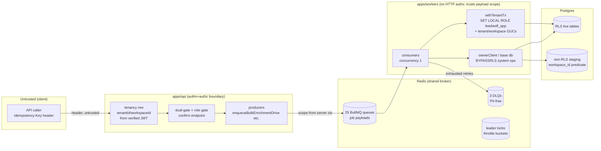

# Security Review - Async Paths

> **Register discipline (read first).** This document keeps three registers strictly separate:
> **AS-BUILT** = what the code does today, always with a `path:line` citation;
> **INTENDED** = what a doc/ADR mandates but the code does not yet do;
> **RECOMMENDATION** = what this review proposes (never presented as if it exists).
> A second axis runs through every finding: **by-design darkness** (safe-by-default, fail-closed
> — *not* a vulnerability) versus a **genuine defect** (a real exposure or a control that is
> weaker than its own design claims). Security has final say: anything unsafe is flagged as a
> **BLOCKER** in the [Finding Register](#finding-register), regardless of how convenient or
> structurally tidy the current shape is.

Scope: the security posture of the background-job tier — `apps/workers` (`@leadwolf/workers`), the
BullMQ/Redis transport, the DB access paths the workers drive, and the confirm-before-spend money
path. Siblings: architecture in [01-current-architecture-audit.md](01-current-architecture-audit.md);
root-cause of the stuck counts in [02-root-cause-analysis.md](02-root-cause-analysis.md); the
reliability controls that back several recommendations here in
[09-reliability-fault-tolerance.md](09-reliability-fault-tolerance.md); observability gaps that blind
detection in [10-observability-alerting.md](10-observability-alerting.md); and the FinOps spend
brakes in [11-capacity-finops.md](11-capacity-finops.md).

---

## 1. Executive verdict

The async tier is **secure-by-construction on the two controls that matter most** — tenant
isolation is enforced at the database via RLS set *per job* (not per process), and the dead-letter
queues are engineered PII-free by design. Most of the "dark" surface an auditor first notices
(bulk-enrichment idle, retention deleting nothing, DSAR unwired) is **fail-closed by design, not a
gap**. The genuine security work is concentrated in a small number of places:

| # | Area | Verdict | Severity |
|---|---|---|---|
| B1 | Worker base DB connection is a privileged (RLS-bypassing) role; least-privilege is only achieved *inside* `withTenantTx` | Genuine weakness | **High** |
| B2 | DSAR job payload carries `subjectEmail` (PII) into Redis; queue has no DLQ and no encryption-at-rest guarantee stated for Redis | Genuine (latent — no live producer yet) | **High** |
| B3 | No per-tenant fairness / rate limit on any event queue → a single tenant can starve all others (noisy-neighbour / poison-flood DoS) | Genuine weakness | **Medium** |
| B4 | Redis transport hardening (TLS + AUTH) is *not enforced* by config — `REDIS_URL` accepts plaintext `redis://` with no credential | Genuine (deploy-dependent) | **Medium** |
| — | Non-RLS COPY staging (ADR-0036) | **By design, contained** — acceptable with the stated mitigations | Accepted |
| — | Bulk-enrichment / retention / DSAR darkness | **By design, fail-closed** | Not a defect |
| — | Idempotency-key handling | **Safe** — server-derived tenant scope + DB uniques | Not a defect |

The rest of this document substantiates each row.

---

## 2. Trust boundaries in the async tier

**The load-bearing property:** a worker performs **no HTTP authentication or authorization of its
own**. It trusts the `tenantId`/`workspaceId` carried in the job payload and re-establishes the
security boundary at the database. That is safe **only because** (a) the producer that enqueued the
job derived that scope from a verified JWT, not from client input, and (b) the worker re-enters RLS
before touching tenant data. Both hold today (Sections 3-4), but the boundary is one careless
`ownerClient` call away from being lost (Section 3.3 / Section 8, B1).

---

## 3. Tenant isolation in workers

### 3.1 AS-BUILT: RLS is set per job, not per process

The single sanctioned scoped path is `withTenantTx`, which drops the transaction to the
**non-`BYPASSRLS`** app role and sets the tenant/workspace GUCs `LOCAL` to that transaction, so RLS
is enforced for the life of the job's DB work and reset on connection checkout:

- `SET LOCAL ROLE leadwolf_app` — `packages/db/src/client.ts:82`.
- `set_config('app.current_tenant_id', …, true)` and `app.current_workspace_id` as bound
  parameters, `LOCAL` to the tx — `packages/db/src/client.ts:85-90`.
- The header comment states the invariant precisely: RDS-Proxy/PgBouncer transaction pooling resets
  GUCs per checkout, so they **must** be set in-tx — `packages/db/src/client.ts:1-3`,
  `packages/db/src/client.ts:74-81`.

Workers set this scope **from the job payload, per job**. Verified consumers:

| Worker | Scope source | RLS entry | Citation |
|---|---|---|---|
| `outreach` | `job.data.{tenantId,workspaceId}` | `withTenantTx(scope, …)` | `apps/workers/src/queues/outreach.ts:46-50` |
| `dedup` | `job.data.{tenantId,workspaceId}` | `runDedup` → `withTenantTx` | `apps/workers/src/queues/dedup.ts:16-19` |
| `master-backfill` | `job.data.scope` | `withTenantTx` (overlay read) **+** `withErTx` (resolver) | `apps/workers/src/queues/masterBackfill.ts:1-6`, `apps/workers/src/queues/masterBackfill.ts:34-41` |
| `data_retention_sweep` | per-tenant loop | `withTenantTx` for flag+policy read + audit write | `packages/core/src/retention/runRetentionSweep.ts:68-73`, `packages/core/src/retention/runRetentionSweep.ts:124-137` |

**Verdict: SAFE.** Because the role and GUCs are transaction-local, a worker processing tenant A's
job then tenant B's job cannot leak A's scope into B — each `withTenantTx` re-sets the role and
GUCs before any query runs, and pooling resets them on checkout. This is the correct pattern for
async isolation and it is the same primitive the API uses, so there is one RLS implementation, not
two.

### 3.2 The DB-role matrix (least privilege, by path)

The DB layer exposes five transaction entrypoints with distinct privilege. Understanding which
worker uses which is the core of the isolation review:

| Entry | Role | RLS | Reach | Async user | Citation |
|---|---|---|---|---|---|
| `withTenantTx` | `leadwolf_app` | **Enforced** | one tenant/workspace | outreach, dedup, firmographics, master-backfill, retention audit | `packages/db/src/client.ts:74-94` |
| `withErTx` | `leadwolf_er` | n/a (structural) | Layer-0 master graph only, **no overlay grant** | master-backfill resolver | `packages/db/src/client.ts:56-61` |
| `withPrivilegedTx` | `leadwolf_admin` | **BYPASSRLS** | cross-workspace | DSAR fan-out (intended) | `packages/db/src/client.ts:40-45` |
| `withPlatformTx` | owner | **BYPASSRLS** + audit row | cross-tenant | staff/admin (not worker path) | `packages/db/src/client.ts:121-137` |
| `ownerClient` (raw) | owner | **BYPASSRLS** | staging + system ops | bulk COPY staging, retention scan/delete, notification insert | `packages/db/src/client.ts:19-27` |

`withErTx` is a genuinely good least-privilege design: the resolver role is non-`BYPASSRLS` and has
no grant on any tenant-scoped table, so even a bug in the master-backfill resolver cannot reach
overlay PII — isolation is structural, by access path (`packages/db/src/client.ts:48-55`).

### 3.3 The non-RLS COPY staging exception (ADR-0036) — contained risk analysis

**INTENDED (ADR-0036).** Postgres forbids `COPY FROM` on an RLS-enabled table, and every
workspace-scoped table is RLS-enforced under the non-`BYPASSRLS` role. The ADR therefore makes the
bulk-import staging tables **deliberately non-RLS**, system-owned, keyed by `job_id` + `workspace_id`,
COPY-loaded on the owner connection, then moved into the live RLS tables via `INSERT … SELECT` under
`SET LOCAL app.current_workspace_id` — so RLS is re-imposed on the *write into live data*
(`docs/planning/decisions/ADR-0036-bulk-async-job-and-staging-pipeline.md:78-83`). COPY directly into
live RLS tables is called out as **impossible**, not merely slow
(`docs/planning/decisions/ADR-0036-bulk-async-job-and-staging-pipeline.md:130`); the non-RLS hop is a
hard Postgres limitation, and the negative is explicitly accepted with mitigations
(`docs/planning/decisions/ADR-0036-bulk-async-job-and-staging-pipeline.md:138-141`).

**AS-BUILT.** All staging access runs on `ownerClient` and is confined to one repository; isolation
drops to **access path** — every read carries an explicit `workspace_id` predicate, and a forgotten
predicate would leak across workspaces (`packages/db/src/repositories/importStagingRepository.ts:1-8`).
Two properties bound the blast radius:

1. **PII is already encrypted in staging.** The staged row holds ciphertext + blind index +
   content_hash; `raw_data` is the only plaintext and it is transient (dropped on finalize)
   (`packages/db/src/repositories/importStagingRepository.ts:6-8`).
2. **The surface is dark.** The whole bulk-import path is gated by `BULK_IMPORT_ENABLED` (default
   OFF) and the COPY primitive itself is flagged `UNVERIFIED` pending a real-Postgres spike before
   the flag can be turned on (`packages/db/src/repositories/importStagingRepository.ts:11-17`).

**Risk verdict: BY DESIGN, ACCEPTED — with two conditions.** The exception is legitimate (a Postgres
constraint, not a shortcut) and well-contained (encrypted-at-rest data, single-repository
confinement, explicit predicate, dark by default). The residual risk is that isolation is now a
*coding-discipline* invariant (the `workspace_id` predicate) rather than a *database-enforced* one —
one missing `WHERE workspace_id = …` is a cross-workspace leak with no RLS backstop.

- **[RECOMMENDATION R-STG-1]** Before `BULK_IMPORT_ENABLED` is ever flipped on, add a test that
  asserts every query in `importStagingRepository.ts` carries a `workspace_id` predicate (grep-gate
  or query-shape test), and keep the "all staging access confined to this one repository" rule as a
  CI-enforced import boundary, not a comment.
- **[RECOMMENDATION R-STG-2]** Have the COPY spike prove that the staging table is created
  `UNLOGGED` **and** dropped on both success and failure paths, so a crashed job cannot leave a
  non-RLS table of decrypted `raw_data` lingering. (Reliability angle in
  [09-reliability-fault-tolerance.md](09-reliability-fault-tolerance.md).)

This exception is the *only* place in the async tier where tenant isolation is not DB-enforced. That
is exactly the kind of narrow, documented, mitigated carve-out an enterprise auditor should accept —
provided it stays narrow.

---

## 4. DLQ PII hygiene

**AS-BUILT — PII-free by construction.** Only three queues have a DLQ, and each writes a
scope-plus-provenance-plus-reason record, never the payload rows:

- Import DLQ: the record is `{originalJobId, tenantId, workspaceId, sourceName, sourceFile,
  importedByUserId, failedReason, attemptsMade}` — the header comment is explicit that the raw rows
  (which hold un-encrypted PII) are **never** included
  (`apps/workers/src/queues/imports.ts:70-95`).
- Bulk-enrichment DLQ: `{jobId, tenantId, workspaceId, kind, reason}` — PII-free, and the queue
  payload it derives from is itself PII-free (`apps/workers/src/queues/bulkEnrichment.ts:114-138`).
- Routing only fires **after** retries are exhausted (`job.attemptsMade < maxAttempts` → no-op),
  wired via `worker.on("failed")` (`apps/workers/src/queues/imports.ts:81-82`,
  `apps/workers/src/register.ts:379-385`).

**Verdict: SAFE — keep it a rule, not a habit.** The failure reason (`err.message`) is the one field
that *could* accidentally carry PII if an underlying error interpolated a row value into its message.
Today the errors are structural (e.g. `ImportFailedError` reports counts only,
`apps/workers/src/queues/imports.ts:22-31`), so this is clean.

- **[RECOMMENDATION R-DLQ-1]** Codify the invariant: DLQ records must be a fixed allow-list of
  non-PII fields, and `failedReason` must be a sanitized/whitelisted error code, never a raw
  `err.message` that might embed a row value. Add a test that a DLQ record contains no email/phone
  shaped substring.
- **[RECOMMENDATION R-DLQ-2]** The 22 queues **without** a DLQ (Section 7) fail into BullMQ's failed
  set with their *full payload* retained — and some of those payloads contain PII (DSAR
  `subjectEmail`, Section 5.1). Retention/redaction of the failed set is a real exposure once those
  queues carry PII; see B2 and [09-reliability-fault-tolerance.md](09-reliability-fault-tolerance.md).

---

## 5. Secrets & KMS

### 5.1 No credentials in job payloads (mostly)

**AS-BUILT.** Producer→worker decoupling is by queue name + `REDIS_URL` only; job payloads carry
**IDs and scope, not secrets** (`apps/api/src/features/enrichment/bulkEnrichQueue.ts:5-6`). Vendor
API keys and tokens live in env/KMS and are read server-side only, never placed on a job:

| Secret | Posture | Citation |
|---|---|---|
| Enrichment provider keys (`APOLLO/ZOOMINFO/CLEARBIT_API_KEY`) | optional, server-only; adapter skips if absent | `packages/config/src/env.ts:116-118` |
| `REACHER_API_TOKEN` | SECRET, read only in config, never client-exposed | `packages/config/src/env.ts:131-134` |
| `TWILIO_AUTH_TOKEN` | SECRET, env/KMS, never client-exposed | `packages/config/src/env.ts:136-141` |
| `EMAIL_SECRET_KEY` | KMS-envelope data key for mailbox creds; prod must inject rotated KMS key | `packages/config/src/env.ts:161-165` |

**The one exception is PII, not a secret:** the DSAR job payload carries `subjectEmail`
(`apps/workers/src/queues/dsar.ts:9-13`). The comment claims it is "never persisted in the job log,"
but **BullMQ persists the entire job payload in Redis** for the life of the job (and beyond, per the
completed/failed retention policy). So a subject's email — the exact identifier a DSAR exists to
protect — sits in Redis in plaintext. This is **B2**.

- **Mitigating fact (by design):** the DSAR queue has **no live producer wired yet**
  ([02-root-cause-analysis.md](02-root-cause-analysis.md); brief Section 1, queue #4), so the
  exposure is *latent*, not active. It must be closed **before** the staff DSAR workflow enqueues
  anything.
- **[RECOMMENDATION R-SEC-1]** Do not put `subjectEmail` on the job. Pass the `requestId` only and
  have the worker read the (encrypted) subject identifier from the DSAR request row under the
  privileged tx. If a plaintext identifier truly must transit the queue, encrypt it in the payload
  and set `removeOnComplete`/`removeOnFail` to a short age so it does not linger in Redis.

### 5.2 Redis transport hardening (TLS + AUTH) — NOT enforced

**AS-BUILT.** There is exactly one shared broker connection:
`new IORedis(env.REDIS_URL, { maxRetriesPerRequest: null })`
(`apps/workers/src/register.ts:132`), reused for every Queue, every Worker, and the mailbox throttle
(`apps/workers/src/register.ts:372`). `REDIS_URL` is validated only as a URL —
`z.string().url()` (`packages/config/src/env.ts:78`). **Nothing forces `rediss://` (TLS) or an
AUTH credential**, and no explicit `tls` option is set on the client.

**Verdict: genuine, deploy-dependent weakness (B4).** The channel that carries every tenant's job
scope, the DSAR subject email (once B2 is unfixed), and — critically — is the substrate for the
confirm-before-spend money path, has no config-enforced encryption or authentication. Whether prod
is safe depends entirely on the deployed `REDIS_URL` string and network placement, which config does
not assert.

- **[RECOMMENDATION R-SEC-2]** Enforce in `env.ts`: in production, require `REDIS_URL` to start with
  `rediss://` and to include credentials (or require a separate `REDIS_TLS`/`REDIS_PASSWORD`), failing
  boot otherwise — the same fail-closed posture the codebase already uses for other secrets. Redis
  AUTH + TLS in transit, plus encryption at rest, is table stakes once PII/scope data is on the wire.

---

## 6. DSAR & retention safety

### 6.1 Retention: double-gated, deletes nothing in shadow

**AS-BUILT — the strongest safety story in the async tier.** The daily `data_retention_sweep` runs
`runRetentionSweepForTenant`, which is double-gated and ships inert:

1. **Outer gate:** the per-tenant `retention_engine_enabled` flag, fail-closed default OFF → record
   nothing, return (`packages/core/src/retention/runRetentionSweep.ts:66-76`).
2. **Inner gate:** a class purges **only** when `policy.mode === "enforce"`; every class defaults to
   `shadow`, which counts candidates and records evidence with `deletedCount = 0`
   (`packages/core/src/retention/runRetentionSweep.ts:101-116`).
3. The COUNT and the (enforce-only) DELETE run on the **owner connection with an explicit tenant
   predicate**, never relying on RLS to scope a destructive cross-tenant system op
   (`packages/core/src/retention/runRetentionSweep.ts:78-107`).

**Verdict: SAFE, by design.** With shipped defaults nothing is deleted until an operator deliberately
(a) enrolls a tenant in the flag **and** (b) flips a specific class to `enforce`. The immutable
`retention_runs` row is the audit evidence. The one thing to watch is that the destructive path
depends on a hand-written tenant predicate (like staging, Section 3.3), so its correctness is code
discipline, not RLS.

- **[RECOMMENDATION R-RET-1]** Gate the flip-to-enforce operationally: require a review/approval and
  a shadow-run reconciliation (candidate counts sanity-checked) before `enforce` is allowed for a
  class. Deletion should be alarmed (rows deleted per class per tenant) so an over-broad predicate is
  caught immediately (see [10-observability-alerting.md](10-observability-alerting.md)). The safe
  enable runbook belongs in [13-operational-runbooks.md](13-operational-runbooks.md).

### 6.2 DSAR: privileged, unwired, PII-in-payload

**AS-BUILT.** The DSAR worker runs the privileged access-report / delete-fan-out for a *verified*
request (`apps/workers/src/queues/dsar.ts:1-2`), intended to run under `withPrivilegedTx`
(`leadwolf_admin`, BYPASSRLS — `packages/db/src/client.ts:38-45`) as the one sanctioned cross-tenant
path. It is **not flag-gated**; its safety comes from the (not-yet-built) staff workflow that alone
may enqueue it (brief Section 1, queue #4). The PII-in-payload issue is B2 (Section 5.1).

**Verdict: latent — safe today only because unwired.** Two must-fix conditions before wiring:
(1) close B2 (no `subjectEmail` in the payload); (2) ensure every privileged fan-out writes its audit
trail — `withPrivilegedTx` explicitly makes the caller responsible for the audit row
(`packages/db/src/client.ts:38-39`), so an unaudited delete-fanout would be a compliance defect.

- **[RECOMMENDATION R-DSAR-1]** The DSAR delete path is the highest-privilege async operation in the
  system (cross-tenant, BYPASSRLS, irreversible). It needs: a DLQ (a failed delete-fanout must not
  vanish), an audit row per fan-out target, and a poison-protection cap so a malformed request cannot
  loop the privileged worker.

---

## 7. Poison-job DoS & per-tenant rate limiting

**AS-BUILT — the weakest resilience story.**

- **Concurrency is 1 on every worker** and there is **no `limiter`, no per-tenant fairness, no
  priority** set anywhere in `apps/workers/src` (brief Section 1; single shared connection,
  `apps/workers/src/register.ts:132`). A queue is strictly FIFO across all tenants.
- **`attempts=1` (no retry, no DLQ)** for enrichment, scoring, dsar, outreach, dedup, firmographics
  (`apps/workers/src/register.ts:205`, `:211`, `:217`, `:223`, `:324`, `:330`; brief Section 1). A
  poison job here fails once and is lost (no redrive), but also cannot loop.
- The queues that **do** retry are the poison-loop risk: `master-backfill` (attempts 4) deliberately
  **throws to force a retry** when any row errored (`apps/workers/src/queues/masterBackfill.ts:26-41`);
  a permanently-erroring row would burn all 4 attempts every sweep. `bulk-enrichment` (attempts 3,
  exp backoff) dead-letters on exhaustion, which is correct
  (`apps/api/src/features/enrichment/bulkEnrichQueue.ts:25-33`).
- **The only per-tenant-ish rate control is the per-mailbox send throttle** (token bucket, capacity
  10, refill 1/s) on the outreach path (`apps/workers/src/register.ts:372`,
  `apps/workers/src/mailboxThrottle.ts`). There is no equivalent for imports, enrichment, or any
  bulk queue.

**Verdict: genuine noisy-neighbour / DoS weakness (B3).** With concurrency 1 and no fairness, one
tenant that enqueues a large or slow batch **head-of-line-blocks every other tenant on that queue**.
A hung job (no vendor timeout, concurrency 1) holds the lock and stalls the queue indefinitely
(brief Section 1). This is a *by-design* single-replica simplification today (one prod replica, so
the leader lock always resolves to it), but it does not survive the target scale and it is a real
availability risk now.

**INTENDED.** `docs/planning/18-scalability-performance.md` §9/§11.2 mandates **per-tenant bulk
concurrency caps**, backpressure (depth/age → autoscale → shed/slow producers), and **priority
(bulk below money/real-time)** (`docs/planning/18-scalability-performance.md:221`). None of it is
built (brief Section 5, GAP). ADR-0027 mandates bounded retries + DLQ + backpressure per domain —
also unbuilt.

- **[RECOMMENDATION R-DOS-1]** Add per-tenant fairness: either a `limiter` with per-tenant grouping,
  a weighted round-robin over per-tenant sub-queues, or (minimum) a per-tenant concurrency cap so one
  tenant cannot monopolize a queue. Wire this together with the capacity model in
  [11-capacity-finops.md](11-capacity-finops.md).
- **[RECOMMENDATION R-DOS-2]** Give **every** consumer a vendor/step timeout so a hung job cannot
  pin the queue; pair with the stalled-job/lock tuning in
  [09-reliability-fault-tolerance.md](09-reliability-fault-tolerance.md).
- **[RECOMMENDATION R-DOS-3]** DLQ + bounded, jittered retry on **all** queues; cap poison retries so
  `master-backfill`'s "throw to retry" self-heal cannot become an infinite spend/CPU loop on a
  permanently-bad row.

---

## 8. Idempotency-key spoofing

**AS-BUILT — safe.** The money-endpoint idempotency store is keyed by **`(tenantId, key)` where
`tenantId` is server-derived** from the verified tenancy context, not from any client header:

- Middleware reads the `idempotency-key` header (untrusted) but scopes it with
  `c.get("tenantId")`/`c.get("workspaceId")` — the JWT-validated tenancy variables
  (`apps/api/src/middleware/idempotency.ts:14`, `apps/api/src/middleware/idempotency.ts:20-21`).
- The lookup/store run under `withTenantTx`, so RLS additionally pins reads/writes to the caller's
  tenant (`packages/db/src/repositories/idempotencyRepository.ts:15-27`,
  `packages/db/src/repositories/idempotencyRepository.ts:30-42`).
- The **real** double-charge guard is the DB unique on the money tables (reveal claim,
  `stripe_event_id`); the idempotency store is a convenience replay layer only, so a racing duplicate
  that slips past it is still harmless (`apps/api/src/middleware/idempotency.ts:1-3`,
  `packages/db/src/repositories/idempotencyRepository.ts:1-3`).

**Async relevance.** The confirm-before-spend endpoint (which enqueues the bulk-enrichment `drive`
job) is role-gated `owner`/`admin` and dual-gated (brief Section 2). The drive enqueue is
idempotent-at-effect downstream: `runBulkEnrich` guards on `status === "running"` and the
`awaiting_confirmation → running` transition is guarded `WHERE status='awaiting_confirmation'` (brief
Section 2), so a replayed/duplicate confirm cannot double-arm a run. System-generated dedupe keys
(e.g. `seqstep:{logId}:{step}` for the sequence tick, brief Section 1) are server-derived, not
client-controlled — no spoofing surface.

**Verdict: SAFE — no cross-tenant spoofing possible.** A client cannot read another tenant's stored
response by guessing a key (query is tenant-scoped + RLS-enforced). The only residual is *within* a
tenant: two members reusing the same key would replay each other's response — bounded, and the money
guard is the DB unique regardless.

- **[RECOMMENDATION R-IDK-1]** Minor hardening: bind the stored key to the acting `userId` (or a
  request fingerprint) as well as the tenant, so an intra-tenant key collision cannot replay a
  different user's response body. Low priority; not a blocker.

---

## 9. Least-privilege worker DB role

**AS-BUILT — the privilege sits at the base connection (B1).** The worker's base pool connects with
`env.DATABASE_URL` (`packages/db/src/client.ts:13`). Least privilege is achieved **only inside**
`withTenantTx`, which *drops* to `leadwolf_app` — the client comment states this exists precisely so
RLS is enforced "even when the base connection is privileged (the documented dev/superuser case)"
(`packages/db/src/client.ts:68-72`). The base connection is used **directly, BYPASSRLS**, on several
worker paths:

- `ownerClient` for all bulk-import staging (`packages/db/src/client.ts:19-27`).
- Owner-connection COUNT/DELETE for retention enforce (`packages/core/src/retention/runRetentionSweep.ts:78-107`).
- Base `db.transaction` for the import-complete notification insert, explicitly "on the base owner
  connection (BYPASSRLS), like the Stripe grant path" (`apps/workers/src/register.ts:412-425`).

So the worker process's ambient authority is **RLS-bypassing**, and isolation depends on every code
path *choosing* to enter `withTenantTx`. That is a single-mistake-from-leak posture: any new worker
query written directly against `db` (not `withTenantTx`) silently runs cross-tenant with no RLS
backstop.

**Verdict: genuine least-privilege weakness (B1) — High.** This is defensible today (the worker
legitimately needs BYPASSRLS for the system ops above, and the sanctioned paths are used correctly),
but it inverts the safe default: privileged-by-default, scoped-by-opt-in.

- **[RECOMMENDATION R-ROLE-1]** Run the worker's *base* connection as a **non-owner, non-BYPASSRLS**
  role by default, and require the few genuine system ops (staging COPY, retention delete, system
  notifications) to explicitly `SET LOCAL ROLE` to a narrowly-granted elevated role — mirroring how
  `withErTx` already fences the resolver to Layer-0 tables (`packages/db/src/client.ts:56-61`). Then
  a forgotten `withTenantTx` fails closed (permission denied) instead of leaking.
- **[RECOMMENDATION R-ROLE-2]** Add an isolation test: a worker query issued without a tenant scope
  against an RLS table must return zero rows / error, not the whole table. This is the async mirror
  of the API's RLS isolation tests and is currently missing for the direct-`db` worker paths.
- The role-password note confirms `leadwolf_app`/`leadwolf_admin` are reached via `SET ROLE`, never
  logged into directly (`packages/config/src/env.ts:72-77`) — so R-ROLE-1 is about the *base* login
  role for the worker, which config does not currently constrain.

---

## 10. By-design darkness vs genuine defect (summary)

| Observation | Register | Classification |
|---|---|---|
| Bulk-enrichment idle / "Queued: 4, Awaiting Confirmation: 1" | AS-BUILT | **By design** — fail-closed dual-gate + human confirm ([02-root-cause-analysis.md](02-root-cause-analysis.md)) |
| Retention deletes nothing | AS-BUILT | **By design** — double-gated shadow (`runRetentionSweep.ts:66-116`) |
| DSAR unwired, not flag-gated | AS-BUILT | **By design (latent)** — safe only while no producer exists; B2/R-DSAR-1 must precede wiring |
| Non-RLS COPY staging | AS-BUILT + ADR-0036 | **By design, contained** — accepted with R-STG-1/2 |
| DLQ PII-free | AS-BUILT | **By design, keep it a rule** — R-DLQ-1/2 |
| Idempotency key handling | AS-BUILT | **Safe** — server-scoped + DB uniques |
| Worker base role BYPASSRLS | AS-BUILT | **Genuine defect (B1)** — privileged-by-default |
| DSAR `subjectEmail` in Redis payload | AS-BUILT | **Genuine defect (B2, latent)** |
| No per-tenant fairness / poison caps | AS-BUILT | **Genuine defect (B3)** vs INTENDED §18 §9/§11.2 |
| Redis TLS/AUTH not enforced | AS-BUILT | **Genuine defect (B4, deploy-dependent)** |

---

## 11. Finding register

Security has final say. The following are ranked; **BLOCKER** items must be resolved before the named
gate.

| ID | Finding | Severity | Gate (must fix before) | Fix (recommendation) |
|---|---|---|---|---|
| **B1** | Worker base DB connection is RLS-bypassing; isolation is opt-in via `withTenantTx` (`packages/db/src/client.ts:13`, `:68-72`) | High | Any new direct-`db` worker query; scale-out to N replicas | R-ROLE-1, R-ROLE-2 |
| **B2** | DSAR job payload carries plaintext `subjectEmail` into Redis; no DLQ; Redis-at-rest not asserted (`apps/workers/src/queues/dsar.ts:9-13`) | High | **BLOCKER** to wiring the DSAR producer | R-SEC-1, R-DSAR-1 |
| **B4** | `REDIS_URL` not required to be TLS + authenticated (`packages/config/src/env.ts:78`) | Medium | **BLOCKER** to any prod carrying PII/scope on Redis | R-SEC-2 |
| **B3** | No per-tenant fairness/limiter/priority; hung job pins queue; 22 queues have no DLQ (`apps/workers/src/register.ts:132`, `:205-330`) | Medium | Multi-tenant load / bulk enable | R-DOS-1/2/3 |
| B5 | Non-RLS staging isolation is a code-discipline predicate, no RLS backstop (`importStagingRepository.ts:1-8`) | Medium | `BULK_IMPORT_ENABLED` on | R-STG-1, R-STG-2 |
| B6 | Retention `enforce` delete relies on hand-written tenant predicate, unalarmed (`runRetentionSweep.ts:78-107`) | Medium | Any class → `enforce` | R-RET-1 |
| B7 | DLQ `failedReason` could interpolate PII (safe today) (`apps/workers/src/queues/imports.ts:83-93`) | Low | — | R-DLQ-1 |
| B8 | Intra-tenant idempotency-key collision replays another user's body (`apps/api/src/middleware/idempotency.ts:20-21`) | Low | — | R-IDK-1 |

### Gating summary

- **Do not wire the DSAR producer** until B2 is closed (no PII in the job payload) and the audit +
  DLQ from R-DSAR-1 exist.
- **Do not flip `BULK_IMPORT_ENABLED`** until the COPY spike passes and R-STG-1 (predicate test /
  import boundary) is in place.
- **Do not run PII-carrying prod on Redis** without R-SEC-2 (TLS + AUTH enforced).
- **Do not scale beyond one worker replica** without B1/B3 addressed (least-privilege base role +
  per-tenant fairness), or one tenant can starve the fleet and a stray query can run cross-tenant.

---

## 12. Cross-references

- As-built architecture and the 25-queue table: [01-current-architecture-audit.md](01-current-architecture-audit.md)
- Why the counts are by-design (state machine, gates): [02-root-cause-analysis.md](02-root-cause-analysis.md)
- Live commands to confirm by-design vs fault: [03-live-inspection-runbook.md](03-live-inspection-runbook.md)
- Retries/DLQ/redrive, timeouts, HA, DR that back R-DOS-*/R-DSAR-1/R-STG-2: [09-reliability-fault-tolerance.md](09-reliability-fault-tolerance.md)
- Deletion/DLQ-growth/cross-tenant alerting that make B1/B3/B6 detectable: [10-observability-alerting.md](10-observability-alerting.md)
- Per-tenant caps and metered-spend guardrails behind R-DOS-1: [11-capacity-finops.md](11-capacity-finops.md)
- Safe flag-flip / confirm / DSAR-enable runbooks: [13-operational-runbooks.md](13-operational-runbooks.md)
