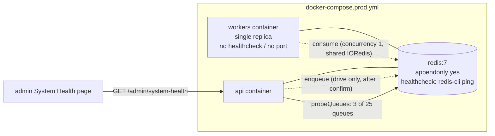
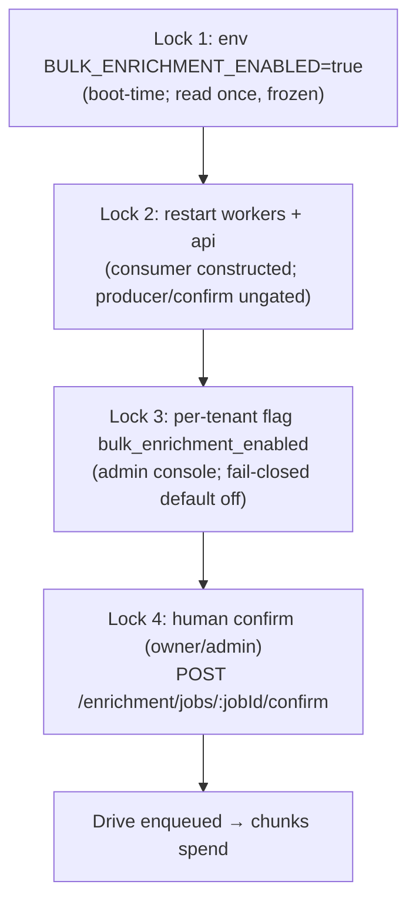

# Operational Runbooks

Step-by-step procedures for operating the TruePoint (`@leadwolf/*`) background-worker system
in production. Each runbook follows the same shape: **Symptom → Diagnosis → Action →
Verification → Rollback**, and the diagnosis step defers to the exact commands in
[03-live-inspection-runbook.md](03-live-inspection-runbook.md) rather than re-deriving them.

These runbooks assume the as-built topology audited in
[01-current-architecture-audit.md](01-current-architecture-audit.md): a **single** `workers`
container (`docker-compose.prod.yml:115-117`), one shared IORedis connection
(`apps/workers/src/register.ts:132`), concurrency 1 on every worker, and 25 queues of which
most money/spend paths ship **dark by design**.

---

## 0. How to use these runbooks

### 0.1 The single most important framing: by-design darkness vs genuine defect

Before touching anything, decide which of two worlds you are in. This decision drives every
runbook below and is developed in full in
[02-root-cause-analysis.md](02-root-cause-analysis.md).

| | **By-design darkness (NOT an incident)** | **Genuine defect (incident)** |
|---|---|---|
| What it looks like | `enrichment_jobs` rows sitting in `queued` or `awaiting_confirmation`; bulk queues empty; `data_retention_sweep` deleting nothing | Worker process down; Redis wedged; `imports`/`outreach` backing up; DLQ growing; boot crash-loop |
| Why | Feature flags default OFF; `queued` bulk-enrich rows are inert orphans by construction (`packages/core/src/prospect/bulkActions.ts:330-332`); `awaiting_confirmation` waits on a human confirm (`apps/api/src/features/enrichment/routes.ts:82-126`) | Something that is supposed to run is not running |
| Correct response | **Explain, do not "fix".** Rule out the failure modes on the live env, then close the ticket. | Follow the matching runbook below. |

The dashboard reading **"Queued: 4, Awaiting Confirmation: 1"** is the canonical example of the
left column. `queueDepth = queued + running + estimating`
(`apps/api/src/features/admin/dataRoutes.ts:166-167`) deliberately **excludes**
`awaiting_confirmation` because that state waits on a human, not a worker. Confirm it is
by-design with [Runbook G](#runbook-g--confirm-a-stuck-awaiting_confirmation-job) /
[Runbook C](#runbook-c--queue-backlog--stuck-job) before escalating.

### 0.2 Register discipline

Throughout, three registers are kept distinct:

- **[AS-BUILT]** — verified against code with a `path:line` citation.
- **[DESIGN]** — the sanctioned target in docs/ADRs (§18/§19, ADR-0024/0027/0036). Not yet
  built. See [06-gap-analysis.md](06-gap-analysis.md) and
  [07-target-architecture.md](07-target-architecture.md).
- **[RECOMMENDATION]** — this audit's proposal; does not exist yet. See
  [04-issue-resolution-plan.md](04-issue-resolution-plan.md).

Operational **commands** below are grounded in the as-built docker-compose topology but their
exact invocation is environment-specific; treat command syntax as illustrative and adapt to
your orchestrator. Anything load-bearing carries a citation.

### 0.3 Runbook index

| ID | Runbook | Trigger | Typical severity |
|---|---|---|---|
| A | [Worker process down](#runbook-a--worker-process-down) | No worker consuming any queue | SEV-2 (SEV-1 if imports/outreach affected) |
| B | [Redis wedged (buffered-commands silent stall)](#runbook-b--redis-wedged-buffered-commands-silent-stall) | Jobs stop moving, process still "healthy" | SEV-1 |
| C | [Queue backlog / stuck job](#runbook-c--queue-backlog--stuck-job) | Depth/age climbing on a live queue | SEV-2/3 |
| D | [DLQ growth + redrive](#runbook-d--dlq-growth--redrive) | `*_DLQ` depth > 0 and climbing | SEV-2/3 |
| E | [Safely enabling bulk-enrichment](#runbook-e--safely-enabling-bulk-enrichment-the-money-path) | Deliberate rollout of the money path | Change (planned) |
| G | [Confirm a stuck `awaiting_confirmation` job](#runbook-g--confirm-a-stuck-awaiting_confirmation-job) | A job armed the spend gate and is waiting | Routine / SEV-3 |
| H | [Deploy / rollback](#runbook-h--deploy--rollback) | Shipping or reverting the workers image | Change |
| I | [Boot crash from a missing env var](#runbook-i--boot-crash-from-a-missing-env-var) | Workers crash-loop at startup | SEV-1 |
| J | [Dev Redis wiped repeatables](#runbook-j--dev-redis-wiped-repeatables) | Sweeps stop ticking after a Redis restart (dev) | SEV-3 (dev-only) |
| K | [Import stall / stuck import + reaper alerts](#runbook-k--import-stall--stuck-import-reaper--alerts-import-redesign-s-q5s-q7) | `import.jobs.stalled` > 0, accounting/artifact-pending gauge > 0, or a stuck-looking import | SEV-1/2 (SEV-1 for accounting violations) |

> There is no Runbook "F"; IDs align to the deliverable spec (A–J, F reserved). Runbook K is added by the
> import redesign (09 §8 / S-Q5 / S-Q7) — the import reaper's observe/recover surface.

### 0.4 Shared reference — the topology every runbook uses



Key as-built facts every runbook leans on:

- Workers process: `startWorkers()` runs synchronously at module load
  (`apps/workers/src/index.ts:9`); health server on **port 3002**
  (`apps/workers/src/health.ts:7`); graceful drain on SIGINT/SIGTERM with **no drain timeout /
  no forced close** (`apps/workers/src/index.ts:14-24`).
- One shared IORedis with `maxRetriesPerRequest: null` (`apps/workers/src/register.ts:132`) →
  on a Redis outage ioredis **reconnects forever and buffers commands instead of erroring**;
  the process does not crash and `/health` stays 200 (see [Runbook B](#runbook-b--redis-wedged-buffered-commands-silent-stall)).
- `/health` and `/ready` **never check Redis or queue depth**
  (`apps/workers/src/health.ts:15-20`); `/ready` only reflects the in-process `draining` flag
  (`apps/workers/src/index.ts:18`).
- Prod `workers` service has **no `healthcheck` and no published port**
  (`docker-compose.prod.yml:115-117`) → nothing auto-restarts a wedged worker; port 3002 is
  reachable only via `docker exec` into the container.
- The only live admin queue signal is `probeQueues`, which live-probes **3 of 25** queues —
  `imports`, `bulk-imports`, `reverification`
  (`apps/api/src/features/admin/systemHealthProbes.ts:54-58`) — behind `GET /admin/system-health`.
- BullMQ keys live under the default `bull:<queueName>:*` prefix. `redis-cli` is available in
  the `redis` container (its healthcheck runs `redis-cli ping`, `docker-compose.prod.yml:29-34`).

---

## Runbook A — Worker process down

**Applies to:** the entire async subsystem. Because prod runs a **single** `workers` replica
(`docker-compose.prod.yml:115-117`), a dead worker means **zero** consumers across all always-on
queues (`imports`, `outreach`, `dedup`, `firmographics`, `master-backfill`, sweeps).

### Symptom
- Live queues (`imports`, `reverification`) show `active: 0` and climbing `waiting` in the admin
  System Health page; `workers: "down"` from `deriveServiceHealth`
  (`apps/api/src/features/admin/systemHealthProbes.ts:43-51`).
- Imports never complete; sequence emails stop sending; no `workers: started` /
  `workers: completed` log lines (`apps/workers/src/register.ts:350-362`).

### By-design vs defect
Genuine defect **if** always-on queues (imports/outreach) are affected. If only bulk-enrich
`queued`/`awaiting_confirmation` rows are "stuck", this is **not** Runbook A — the bulk-enrich
worker is only constructed when the flag is on (`apps/workers/src/register.ts:636`); its absence
is by design. See [02-root-cause-analysis.md](02-root-cause-analysis.md).

### Diagnosis → [03-live-inspection-runbook.md](03-live-inspection-runbook.md)
Run "is the worker process alive?" and "does any queue report a connected worker?":

```bash
# Is the container running / crash-looping?
docker compose -f docker-compose.prod.yml ps workers
docker compose -f docker-compose.prod.yml logs --tail=200 workers

# Liveness from inside the container (port 3002 is NOT published — must exec in):
docker compose -f docker-compose.prod.yml exec workers \
  bun -e "fetch('http://localhost:3002/health').then(r=>console.log(r.status))"

# Connected consumers per queue, straight from Redis:
docker compose -f docker-compose.prod.yml exec redis \
  redis-cli CLIENT LIST | grep -c "cmd=blpop\|name=bull"
```

Interpret: `workers: "down"` with `redis: "up"` in the probe means Redis is fine but no consumer
is attached → the process is down or wedged (if the process is up but not consuming, go to
[Runbook B](#runbook-b--redis-wedged-buffered-commands-silent-stall)).

### Action
1. If crash-looping at boot → this is [Runbook I](#runbook-i--boot-crash-from-a-missing-env-var);
   read the fatal `Invalid environment configuration` line (`packages/config/src/env.ts:330-334`)
   first.
2. If simply exited/killed → restart the single replica:
   ```bash
   docker compose -f docker-compose.prod.yml up -d workers
   ```
3. On restart, `startWorkers()` re-runs, re-attaches every always-on worker
   (`apps/workers/src/register.ts:435-570`) and re-registers all repeatable sweeps (stable
   `jobId` → BullMQ keeps exactly one, `apps/workers/src/register.ts:807-851`,
   `apps/workers/src/register.ts:227-233`). In-flight jobs that were mid-execution when the
   process died are reclaimed by BullMQ after the default 30s lock expiry (v5 default; **no
   `stalledInterval`/`maxStalledCount` is configured**, so the single default stalled-reclaim
   applies). **[RECOMMENDATION]** run ≥2 replicas and add a container `healthcheck` — see
   [09-reliability-fault-tolerance.md](09-reliability-fault-tolerance.md).

### Verification
- `docker compose ... ps workers` shows `running`; logs show `workers: started`
  (`apps/workers/src/index.ts:12`).
- Admin System Health returns `workers: "up"` and the affected queue's `active` climbs while
  `waiting` drains.
- Spot-check: submit a small CSV import and confirm it completes (fires the dedup /
  firmographics / master-backfill fan-out, `apps/workers/src/register.ts:389-410`).

### Rollback
Restart is non-destructive (idempotent job processing; stable repeatable IDs). If a **new image**
caused the crash, roll back to the previous image tag per [Runbook H](#runbook-h--deploy--rollback).
There is no state to undo.

---

## Runbook B — Redis wedged (buffered-commands silent stall)

**The most dangerous failure mode in the system**, because it is invisible to every health
signal. Give it SEV-1 by default.

### Symptom
- All queues stop advancing, yet the workers process stays up and `/health` returns 200
  (`apps/workers/src/health.ts:15`).
- Jobs stay in `waiting`/`Queued` indefinitely; no `failed` events fire; no crash, no restart.
- The admin probe may show `redis: "down"` (all three probes time out,
  `apps/api/src/features/admin/systemHealthProbes.ts:47-48`) **or** may still succeed
  intermittently if only the workers' blocking connection is wedged.

### Root cause [AS-BUILT]
Every Queue/Worker shares one IORedis created with `maxRetriesPerRequest: null`
(`apps/workers/src/register.ts:132`). Per ioredis semantics that setting makes the client
**reconnect forever and buffer commands rather than error** — so a `BLPOP` consumer blocks
silently, jobs stay "Queued", and **nothing self-heals** because the process never sees an
error and `/health`/`/ready` never inspect Redis (`apps/workers/src/health.ts:15-20`). At boot,
the fire-and-forget `void schedule*().catch(...)` repeatables
(`apps/workers/src/register.ts:807-851`) may never resolve or reject when buffered, so a
repeatable can simply never register — with the `.catch` never firing.

### By-design vs defect
Always a genuine defect. There is no by-design reason for a wedged Redis.

### Diagnosis → [03-live-inspection-runbook.md](03-live-inspection-runbook.md)
Run "is Redis reachable + what are the depths?":

```bash
# Is Redis itself healthy?
docker compose -f docker-compose.prod.yml exec redis redis-cli PING          # expect PONG
docker compose -f docker-compose.prod.yml exec redis redis-cli INFO clients  # blocked_clients, connected_clients
docker compose -f docker-compose.prod.yml exec redis redis-cli INFO replication
docker compose -f docker-compose.prod.yml exec redis redis-cli INFO persistence   # rdb_last_bgsave_status, aof_last_write_status

# Depth of an always-on queue (BullMQ default prefix `bull:`):
docker compose -f docker-compose.prod.yml exec redis redis-cli LLEN bull:imports:wait

# Is the WORKER's connection actually consuming? (blocked BLPOP present?)
docker compose -f docker-compose.prod.yml exec redis redis-cli CLIENT LIST | grep bull
```

Decision matrix:

| PING | Depth trend | Worker consuming | Conclusion |
|---|---|---|---|
| PONG | climbing | no BLPOP client | Worker's shared connection wedged → restart workers |
| timeout / no PONG | n/a | n/a | Redis server itself down/unreachable → restore Redis first |
| PONG | flat/low | BLPOP present | Not wedged — look elsewhere ([Runbook C](#runbook-c--queue-backlog--stuck-job)) |

### Action
1. **Restore Redis reachability first** if PING fails (network, memory `maxmemory`, AOF write
   error). Prod persists with `--appendonly yes` (`docker-compose.prod.yml:26`) so a Redis
   restart does **not** lose queued jobs.
2. **Then restart the workers process** to force a clean reconnect and rebind consumers —
   because the buffered connection will not self-heal:
   ```bash
   docker compose -f docker-compose.prod.yml restart workers
   ```
3. Restart the `api` container too if `probeQueues` reported `redis: "down"` — its producer
   connections buffer the same way.
4. **[RECOMMENDATION]** make `/ready` do a bounded `redis.ping()` and give the prod `workers`
   service a `healthcheck` on `/ready`, so a wedged worker fails readiness and is auto-restarted.
   Detailed in [09-reliability-fault-tolerance.md](09-reliability-fault-tolerance.md) and
   [10-observability-alerting.md](10-observability-alerting.md).

### Verification
- `redis-cli CLIENT LIST` shows a fresh `bull` BLPOP client; `INFO clients` `blocked_clients` > 0.
- `bull:imports:wait` (or the affected queue) LLEN **decreases**.
- Admin System Health flips to `redis: "up"`, `workers: "up"`.

### Rollback
Restart is non-destructive; prod AOF preserves the backlog. If the restart storm-loops (Redis
still unreachable), stop restarting workers and fix Redis first — a worker with no Redis will
crash-free-buffer again, not recover.

---

## Runbook C — Queue backlog / stuck job

Distinguish **backlog** (throughput-limited: work is arriving faster than one concurrency-1
worker drains it) from a **single stuck job** (one job holds the queue's only slot).

### Symptom
- A live queue's `waiting`/`active` climbs; oldest-job age grows.
- Concurrency is **1 for every worker** (no `concurrency`/`limiter`/`lockDuration` set anywhere
  in `apps/workers/src`), so a single slow or hung job blocks the whole queue behind it.

### By-design vs defect
- **By design:** bulk-enrich `queued`×N / `awaiting_confirmation`×1 — these are `enrichment_jobs`
  DB rows, **not** BullMQ backlog. `queued` rows are inert orphans
  (`packages/core/src/prospect/bulkActions.ts:330-332`); no `queued → *` transition exists. Do
  **not** treat these as a BullMQ backlog. See [Runbook G](#runbook-g--confirm-a-stuck-awaiting_confirmation-job).
- **Defect:** an always-on BullMQ queue (`imports`, `outreach`, `reverification`,
  `master-backfill`) with climbing depth or a job stuck `active` past its expected duration.

### Diagnosis → [03-live-inspection-runbook.md](03-live-inspection-runbook.md)
```bash
# Live signal for the 3 probed queues:
curl -s $API/admin/system-health | jq '.queues[] | {name, waiting, active, failed, delayed}'

# For the other 22 queues, read Redis directly:
for s in wait active delayed failed; do
  echo -n "imports:$s "; docker compose -f docker-compose.prod.yml exec -T redis \
    redis-cli LLEN bull:imports:$s 2>/dev/null || \
    docker compose -f docker-compose.prod.yml exec -T redis redis-cli ZCARD bull:imports:$s
done

# Inspect the single active job holding the slot:
docker compose -f docker-compose.prod.yml exec redis redis-cli LRANGE bull:imports:active 0 -1
```

Then classify:

| Observation | Cause | Go to |
|---|---|---|
| `active` = 1 for a long time, `waiting` climbing | One hung job holds the concurrency-1 slot (no vendor timeout) | Action ①/② |
| `active` cycling, `waiting` steadily climbing | Genuine throughput backlog (arrival > drain) | Action ③ |
| Depth flat but nothing runs | Worker down / Redis wedged | [Runbook A](#runbook-a--worker-process-down) / [Runbook B](#runbook-b--redis-wedged-buffered-commands-silent-stall) |
| `enrichment_jobs` DB rows only | By-design darkness | [Runbook G](#runbook-g--confirm-a-stuck-awaiting_confirmation-job) |

### Action
1. **Hung job:** BullMQ v5 default lock is 30s; with no `stalledInterval`/`maxStalledCount`
   override, one stalled reclaim will move it after the lock lapses. If it is truly stuck (e.g.
   a vendor call with no timeout), restart the worker (`Runbook A` action) to release the lock;
   the job re-runs (retryable jobs are idempotent). If it re-hangs on the same job, remove it
   from `active` / route it manually:
   ```bash
   # Move a poison job to failed so the queue advances (last resort; note the job id):
   docker compose -f docker-compose.prod.yml exec redis redis-cli LREM bull:imports:active 0 <jobId>
   ```
2. **Poison job on a DLQ-covered queue** (`imports`, `bulk-imports`, `bulk-enrichment`): let it
   exhaust its retries — it is dead-lettered PII-free (`apps/workers/src/register.ts:379-385`) —
   then handle via [Runbook D](#runbook-d--dlq-growth--redrive).
3. **Throughput backlog:** the as-built system has **no autoscaling and no per-worker
   concurrency** — the only levers are (a) restart to clear a wedge, (b) reduce producer rate at
   the source (e.g. pause a bulk import), (c) **[RECOMMENDATION]** raise `concurrency` / add a
   `limiter` / add replicas per [11-capacity-finops.md](11-capacity-finops.md). §18 targets
   queue-depth/age autoscaling ([DESIGN], `docs/planning/18-scalability-performance.md` §3/§9),
   not yet built.

### Verification
- Affected queue's `waiting` decreases and oldest-job age falls.
- The stuck job either completes or lands in the correct DLQ (not silently lost).
- No new `failed` spikes in worker logs (`apps/workers/src/register.ts:350-362`).

### Rollback
Removing a job from `active` is destructive for that one job — capture its payload first (it is
in the Redis hash `bull:<queue>:<jobId>`). Prefer routing to a DLQ over `LREM` where a DLQ
exists. Restarting the worker is non-destructive.

---

## Runbook D — DLQ growth + redrive

### Symptom
- One of the three dead-letter queues has depth > 0 and growing: `IMPORTS_DLQ`
  (`apps/workers/src/register.ts:379`), `BULK_IMPORTS_DLQ`
  (`apps/workers/src/register.ts:620`), or `BULK_ENRICHMENT_DLQ`
  (`apps/workers/src/register.ts:659`).

### As-built scope [AS-BUILT]
- **Only these three queues have a DLQ.** `enrichment`, `scoring`, `dsar`, `outreach`, `dedup`,
  `firmographics`, `master-backfill`, `reverification`, and every sweep have **no DLQ** — a
  terminal failure there is retried into the BullMQ `failed` set (or, for `attempts:1` queues,
  simply lost). See the DLQ-coverage matrix in
  [01-current-architecture-audit.md](01-current-architecture-audit.md).
- DLQ records are **PII-free** and only written **after retries are exhausted** (dead-letter
  listeners at `apps/workers/src/register.ts:379-385` and `:659-665`).
- **There is no built-in redrive tool.** No production code re-enqueues from a DLQ back to its
  source queue (verified: repo-wide search for redrive/reprocess found only docs and a test).
  Redrive today is a **manual** Redis operation; an operator-facing redrive endpoint is
  **[RECOMMENDATION]** — [04-issue-resolution-plan.md](04-issue-resolution-plan.md),
  [09-reliability-fault-tolerance.md](09-reliability-fault-tolerance.md).

### By-design vs defect
DLQ **existence** is by design (safe capture). DLQ **growth** is a genuine defect signal — jobs
are failing deterministically. Classify the failures before redriving; a redrive without a fix
just re-fills the DLQ.

### Diagnosis → [03-live-inspection-runbook.md](03-live-inspection-runbook.md)
```bash
# Depth of each DLQ (BullMQ holding queues — jobs sit in `wait`):
for q in imports-dlq bulk-imports-dlq bulk-enrichment-dlq; do
  echo -n "$q "; docker compose -f docker-compose.prod.yml exec -T redis redis-cli LLEN bull:$q:wait
done
# Inspect a dead-letter payload (PII-free reason + source job id):
docker compose -f docker-compose.prod.yml exec redis redis-cli LRANGE bull:imports-dlq:wait 0 5
```
(Queue name constants: `IMPORTS_DLQ`, `BULK_IMPORTS_DLQ`, `BULK_ENRICHMENT_DLQ` — resolve the
exact string from `@leadwolf/types` if the default names differ.)

Classify the failure reason: **transient** (Redis blip, vendor 5xx, timeout — safe to redrive)
vs **deterministic/poison** (bad row, schema mismatch, permanent vendor 4xx — fix first, then
redrive or discard). This transient-vs-deterministic split is the §19.2 design intent ([DESIGN],
`docs/planning/19-observability-reliability.md` §9.2), not yet automated.

### Action
1. **Root-cause the failure** from the PII-free reason field before any redrive.
2. **Fix the underlying cause** (deploy fix, restore a dependency, correct config). For
   bulk-enrichment specifically, ensure spend gating is intact before redriving a `chunk` job
   (each chunk is the only spend step).
3. **Manual redrive [RECOMMENDATION — no built-in tool]:** re-add each dead-lettered payload to
   its source queue, then remove it from the DLQ. Do this in a controlled, low-rate batch:
   ```bash
   # Illustrative only — adapt payload shape; there is no supported redrive command today.
   # 1) read a DLQ entry  2) re-add to source queue  3) LREM it from the DLQ
   ```
   Prefer building the endpoint in [04-issue-resolution-plan.md](04-issue-resolution-plan.md)
   over ad-hoc scripting for anything beyond a handful of jobs.
4. **Discard** truly poison records (documented, ticketed) rather than looping them.

### Verification
- DLQ depth stops growing and drains as redriven jobs succeed on the source queue.
- Source-queue `completed` events appear; no immediate re-dead-lettering (which would mean the
  fix was wrong — stop and re-diagnose).

### Rollback
Redrive is additive (you re-enqueue copies). If a redrive re-fails, the jobs land back in the
DLQ — no data loss, but stop the batch and revert the fix. Never `LREM` a DLQ entry until its
redriven copy has been confirmed accepted by the source queue.

---

## Runbook E — Safely enabling bulk-enrichment (the money path)

This is a **planned change**, not an incident. Bulk-enrichment is the confirm-before-spend money
path, dark by design behind **two env gates + a per-tenant flag + a human confirm**. Enabling it
wrong risks real credit spend. Treat as a gated, reversible change.

### The four locks (all must open, in order) [AS-BUILT]



| # | Gate | Where enforced | Effect if closed |
|---|---|---|---|
| 1 | `env.BULK_ENRICHMENT_ENABLED` | `packages/config/src/env.ts:223`; read at boot and **frozen** (`env.ts:352`) | Confirm endpoint 403s (`apps/api/src/features/enrichment/routes.ts:85-87`); producer returns `null` (`apps/api/src/features/enrichment/bulkEnrichQueue.ts:48`); **worker never constructed** (`apps/workers/src/register.ts:636`) |
| 2 | Restart both `workers` and `api` | env is frozen at process boot (`env.ts:352`) | Without a restart the flag change is not seen by either process |
| 3 | Per-tenant `bulk_enrichment_enabled` | `apps/api/src/features/enrichment/routes.ts:95-100` via `isFlagEnabledForTenant`; seeded `global_enabled=false,default=false` (`0048_seed_bulk_enrichment_flag.sql:1`) | Confirm 403s for non-enrolled tenants |
| 4 | Human confirm, role `owner`/`admin` | `apps/api/src/features/enrichment/routes.ts:82` | Job sits `awaiting_confirmation`; no drive enqueued; no spend |

### Preconditions
- Cost/FinOps guardrails reviewed ([11-capacity-finops.md](11-capacity-finops.md)); per-run
  ceiling + daily breaker verified in the chunk path.
- Roll out to **one pilot tenant** first (Lock 3 is per-tenant — use it).

### Action (in strict order)
1. Set the env kill-switch in `.env.production`:
   ```bash
   BULK_ENRICHMENT_ENABLED=true    # only the literal string "true" arms it (env.ts:223)
   ```
2. **Restart both processes** so the frozen env is re-read and the consumer is constructed:
   ```bash
   docker compose -f docker-compose.prod.yml up -d api workers
   ```
3. Enroll the pilot tenant via the admin feature-flag console (per-tenant override on
   `bulk_enrichment_enabled`). The env gate is surfaced read-only at
   `GET /admin/feature-flags/env-gates` (`apps/api/src/features/admin/routes.ts:1194-1211`) — it
   confirms Lock 1 is armed but you flip Lock 3 through the flags UI, not here.
4. Have a pilot owner/admin submit `POST /contacts/bulk/enrich` (creates an `estimating` →
   `awaiting_confirmation` job, `packages/core/src/prospect/bulkActions.ts:346-362`) and then
   **confirm** it ([Runbook G](#runbook-g--confirm-a-stuck-awaiting_confirmation-job)).

### Verification
- `GET /admin/feature-flags/env-gates` shows `BULK_ENRICHMENT_ENABLED: enabled=true`.
- Admin System Health shows the `bulk-enrichment` worker connected (the worker is now
  constructed, `apps/workers/src/register.ts:636-666`).
- A pilot job transitions `awaiting_confirmation → running` after confirm
  (`packages/db/src/repositories/enrichmentJobRepository.ts:354-365`) and a `drive` job appears
  on `bull:bulk-enrichment:wait`, then chunks; `enrichment_jobs.credit_spent_micros` stays within
  the confirmed ceiling.
- Watch `BULK_ENRICHMENT_DLQ` stays at 0.

### Rollback
1. **Fastest kill:** set `BULK_ENRICHMENT_ENABLED=false` and restart `api` + `workers`. The
   confirm endpoint 403s again and the producer stops enqueuing — no **new** spend.
   **[NEEDS VERIFICATION]** in-flight `running` jobs already driven to Redis before the flip may
   continue on the (now torn-down on restart, then absent) worker; confirm no `chunk` jobs remain
   on `bull:bulk-enrichment:*` and pause/settle any `running` job before declaring rollback
   complete.
2. **Per-tenant rollback (no restart):** disable the tenant's `bulk_enrichment_enabled` flag —
   that tenant can no longer confirm. Note a job **armed then flag-flipped-off** stays stuck
   `awaiting_confirmation` permanently (a known trap — see
   [02-root-cause-analysis.md](02-root-cause-analysis.md)); cancel such jobs manually.
3. Reconcile spend against the confirmed ceilings before closing the change.

---

## Runbook G — Confirm a stuck `awaiting_confirmation` job

This is usually **by design**: a job that armed the spend gate is *supposed* to wait for a human.
Use this runbook to (a) confirm it deliberately, or (b) rule out the failure modes that make it
**unconfirmable**.

### Symptom
- Dashboard "Awaiting Confirmation: 1" — an `enrichment_jobs` row in `awaiting_confirmation`
  (`packages/db/src/schema/enrichmentJobs.ts:73-76`); UI badge tone = warning
  (`apps/web/src/features/enrichment-jobs/components/format.ts:65-74`).
- It is **excluded** from `queueDepth` on purpose (`apps/api/src/features/admin/dataRoutes.ts:166-167`).

### By-design vs defect
| Cause | Kind | Signal |
|---|---|---|
| No one clicked confirm (intended resting state) | **By design** | Job is healthy; owner/admin simply hasn't acted |
| `BULK_ENRICHMENT_ENABLED` off | By design (dark) | Confirm 403 `bulk_enrichment_disabled` (`apps/api/src/features/enrichment/routes.ts:85-87`) |
| Per-tenant flag not enrolled | By design (dark) | Confirm 403 (`routes.ts:98-99`) |
| Caller is member/viewer | By design (role) | 403 from `requireRole("owner","admin")` (`routes.ts:82`) |
| Armed, then env/tenant flag flipped OFF | **Defect (trap)** | Endpoint 403s forever → job permanently stuck |

### Diagnosis → [03-live-inspection-runbook.md](03-live-inspection-runbook.md)
```bash
# Exact status mix (all-tenant, non-PII) — the same query the dashboard uses:
psql "$DATABASE_URL" -c "SELECT status, count(*) FROM enrichment_jobs GROUP BY status;"
# (matches enrichmentJobStatusCounts, packages/db/src/repositories/platformAdminReads.ts:549-554)

# For a specific job (break-glass DBA read):
psql "$DATABASE_URL" -c "SELECT id, status, workspace_id, credit_estimate_micros, created_at
                         FROM enrichment_jobs WHERE id = '<jobId>';"
```
Then confirm both gates are open: `GET /admin/feature-flags/env-gates` (Lock 1) and the tenant's
`bulk_enrichment_enabled` flag (Lock 3).

### Action
1. **Deliberate confirm (happy path):** an **owner or admin** of the owning workspace calls:
   ```bash
   curl -X POST "$API/enrichment/jobs/<jobId>/confirm" -H "Authorization: Bearer <owner_or_admin_jwt>"
   ```
   This runs both env + per-tenant gates (`apps/api/src/features/enrichment/routes.ts:85-100`),
   flips `awaiting_confirmation → running` (guarded, race-safe,
   `packages/db/src/repositories/enrichmentJobRepository.ts:354-365`), and enqueues the single
   `drive` job (`apps/api/src/features/enrichment/routes.ts:119-123`).
2. **If confirm 403s:** open the closed gate — enable `BULK_ENRICHMENT_ENABLED` + restart
   ([Runbook E](#runbook-e--safely-enabling-bulk-enrichment-the-money-path)) and/or enroll the
   tenant flag — **then** confirm. Never bypass the gate in code.
3. **If confirm returns 409 `job_not_awaiting_confirmation`:** the job already moved (running /
   settled) or never armed (`routes.ts:106-115`) — reconcile with the DB status; no action.
4. **Trap case (armed-then-disabled, intended to abandon):** there is **no wired
   fail/cancel transition** for `enrichment_jobs` (`failed`/`cancelled` exist in the enum but no
   production code writes them). A break-glass cancel is a manual DB write via the **unguarded**
   `updateJobStatus` (`packages/db/src/repositories/enrichmentJobRepository.ts:284-288`) —
   **[RECOMMENDATION]** wire a proper cancel path; ticket it (see
   [04-issue-resolution-plan.md](04-issue-resolution-plan.md)).

### Verification
- `confirmAwaitingJob` returned true → row is now `running` with `started_at` stamped
  (`enrichmentJobRepository.ts:354-363`).
- A `drive` job is present on `bull:bulk-enrichment:wait`, then fans out chunks
  (`apps/workers/src/register.ts:643-657`).
- **Watch for the non-atomic-enqueue gap:** confirm (`routes.ts:101`) and enqueue
  (`routes.ts:119`) are **not in one transaction** — if the process died between them, the row is
  `running` with **no drive job**. `runBulkEnrich` only resumes if a drive job lands
  (`packages/core/src/enrichment/bulk/runBulkEnrich.ts:63-92`), so a lost enqueue is **not
  self-healing**. If you see `running` with an empty `bulk-enrichment` queue, manually re-enqueue
  a `drive` job for that `jobId` (idempotent — it re-drives only unfinished chunks,
  `runBulkEnrich.ts:82-92`).

### Rollback
Confirm is a one-way, idempotent transition; you cannot un-confirm. To halt a confirmed run,
disable the tenant flag (stops further confirms) and settle the `running` job manually. Any
`paused` job is a **trap** — nothing flips `paused → running`
(`packages/core/src/enrichment/bulk/runBulkEnrich.ts:71`) — so a braked run must be re-driven or
cancelled by hand.

---

## Runbook H — Deploy / rollback

### Symptom / trigger
Shipping a new workers (or api) image, or reverting one. The prod image is shared
(`Dockerfile:38`); workers run `bun run --filter @leadwolf/workers start`
(`docker-compose.prod.yml:117`).

### Pre-deploy checks
- **Env completeness:** the workers process validates the **whole-app** env schema at boot and
  **throws/crashes** on any missing/invalid key (`packages/config/src/env.ts:328-334`) — not just
  worker keys. Confirm all required keys are present *before* deploy or you get
  [Runbook I](#runbook-i--boot-crash-from-a-missing-env-var). Minimum required includes
  `REDIS_URL` (`env.ts:78`), `DATABASE_URL`, `AUTH_ORIGIN`, `APP_ORIGINS`,
  `AUTH_COOKIE_DOMAIN`, `JWT_SIGNING_KID`, `BLIND_INDEX_KEY` (`env.ts:17,32,33,58,67,80`).
- **No forced-drain risk:** shutdown has **no drain timeout** (`apps/workers/src/index.ts:14-24`)
  — a hung concurrency-1 job makes `w.close()` wait forever, so `SIGTERM` during deploy can
  block the container from exiting. Know your orchestrator's kill grace period.
- **Single replica:** deploying replaces the only worker — expect a brief window with **zero
  consumers** unless you pre-scale ([RECOMMENDATION]).

### Action (deploy)
1. Build/tag the new image; keep the previous tag pinned for rollback.
2. Deploy `api` first (producers), then `workers` (consumers), to avoid new jobs hitting an old
   consumer schema:
   ```bash
   docker compose -f docker-compose.prod.yml up -d api
   docker compose -f docker-compose.prod.yml up -d workers
   ```
3. On SIGTERM the workers drain in-flight jobs (`apps/workers/src/index.ts:20`), fail readiness
   first (`:18`), then exit. Repeatable sweeps re-register on the new process
   (`apps/workers/src/register.ts:807-851`).

### Verification
- `docker compose ... logs workers` shows `workers: started` (`apps/workers/src/index.ts:12`)
  with the expected `processors` count.
- Admin System Health: `workers: "up"`, all three probed queues `reachable: true`
  (`apps/api/src/features/admin/systemHealthProbes.ts:64-83`).
- Smoke test: a small import completes; sequence tick fires within 60s
  (`apps/workers/src/register.ts:227-233`).

### Rollback
1. Redeploy the previous image tag:
   ```bash
   docker compose -f docker-compose.prod.yml up -d workers   # with the prior tag
   ```
2. Rollback is safe because job processing is idempotent and repeatable IDs are stable (no
   duplicate sweeps). Redis backlog is preserved (AOF, `docker-compose.prod.yml:26`).
3. If the new image crash-looped at boot, it is almost always env drift →
   [Runbook I](#runbook-i--boot-crash-from-a-missing-env-var).
4. **Blocked drain:** if the old container will not exit (hung job holding a lock), force-stop it
   after capturing logs; the reclaimed job re-runs on the new/old process (BullMQ default lock +
   one stalled reclaim). This is a known gap — a drain timeout is
   [RECOMMENDATION, 09-reliability-fault-tolerance.md](09-reliability-fault-tolerance.md).

---

## Runbook I — Boot crash from a missing env var

### Symptom
- The workers container **crash-loops immediately at startup** and never reaches
  `workers: started`.
- Log shows: `Invalid environment configuration:` followed by a bullet list of failing keys
  (`packages/config/src/env.ts:330-334`).

### Root cause [AS-BUILT]
`loadEnv()` validates `process.env` against the **whole-application** Zod schema and **throws**
on any invalid/missing key, which crashes the process (`packages/config/src/env.ts:328-335`); the
result is frozen into the module-level `env` (`env.ts:352`). Because the schema is shared across
all apps, the **workers process fails to boot even when the missing key is unrelated to
workers** — e.g. `AUTH_ORIGIN`, `APP_ORIGINS`, `AUTH_COOKIE_DOMAIN`, `JWT_SIGNING_KID`,
`DATABASE_URL`, `BLIND_INDEX_KEY` (`env.ts:17,32,33,58,67,80`), or `REDIS_URL` (`env.ts:78`).
This is a **shared-config SPOF** for the worker, called out in
[02-root-cause-analysis.md](02-root-cause-analysis.md).

### By-design vs defect
The **fail-closed crash** is by design (better to refuse to boot than run misconfigured). The
**blast radius** — an unrelated key downing the worker — is a genuine architectural weakness to
track, not to "fix" by weakening validation.

### Diagnosis → [03-live-inspection-runbook.md](03-live-inspection-runbook.md)
```bash
# Read the exact failing keys from the fatal line:
docker compose -f docker-compose.prod.yml logs --tail=50 workers | grep -A20 "Invalid environment configuration"

# Confirm which keys are actually set in the container's env:
docker compose -f docker-compose.prod.yml exec workers env | sort
```
Each bullet under the fatal line names one failing key and its Zod message — that is your
complete fix list.

### Action
1. Add/correct the named key(s) in `.env.production` (or your secrets manager). For `REDIS_URL`
   it must be a valid URL (`z.string().url()`, `env.ts:78`); flag switches must be the literal
   string `"true"` to arm (fail-closed transform).
2. Recreate the container so it re-reads env at boot (env is frozen once, per process):
   ```bash
   docker compose -f docker-compose.prod.yml up -d workers
   ```
3. **[RECOMMENDATION]** run a pre-deploy env self-test in CI so a missing key fails the pipeline,
   not prod boot (see [04-issue-resolution-plan.md](04-issue-resolution-plan.md)); longer-term,
   split the worker's env subset from the whole-app schema.

### Verification
- `workers: started` appears in logs (`apps/workers/src/index.ts:12`); container status `running`,
  no restart churn.
- Admin System Health returns `workers: "up"`.

### Rollback
If a config change *introduced* the missing/invalid key, revert `.env.production` to the last
known-good and recreate. No data-plane rollback is needed — the crash happened before any job ran.

---

## Runbook J — Dev Redis wiped repeatables

**Dev-only.** Prod is not affected: prod Redis persists with `--appendonly yes`
(`docker-compose.prod.yml:26`).

### Symptom
- In dev, after a Redis restart the scheduled sweeps stop firing: `email_sequence_tick` (60s),
  `email_token_refresh` (2min), and the daily/interval sweeps never run again; queued dev jobs
  vanish.

### Root cause [AS-BUILT]
Dev Redis runs `--save "" --appendonly no` (`docker-compose.yml:21`), so **a dev Redis restart
wipes all repeatables and queued jobs**. Repeatables are registered only at worker boot via the
fire-and-forget `void schedule*().catch(...)` calls (`apps/workers/src/register.ts:807-851`), each
with a stable `jobId` (`apps/workers/src/register.ts:227-233`). Once Redis is wiped, nothing
re-registers them until the workers process boots again. (Note: dev compose does **not** run the
workers container at all — you run it via `bun run dev`.)

### By-design vs defect
Expected dev behaviour (ephemeral Redis), **not** a defect. The runbook is simply: re-register by
restarting the workers process.

### Diagnosis → [03-live-inspection-runbook.md](03-live-inspection-runbook.md)
```bash
# Are the repeatables present? (BullMQ stores them in a ZSET keyed by queue)
redis-cli ZRANGE bull:email_sequence_tick:repeat 0 -1
redis-cli KEYS 'bull:*:repeat'
# Empty result after a dev Redis restart = repeatables were wiped.
```

### Action
1. Restart the local workers process so `startWorkers()` re-runs and re-registers every
   repeatable (stable `jobId` → exactly one each,
   `apps/workers/src/register.ts:807-851`, `:227-233`):
   ```bash
   bun run --filter @leadwolf/workers dev     # from repo root
   ```
2. Queued dev jobs lost in the wipe are gone — re-trigger them (e.g. re-submit the dev import).

### Verification
- `redis-cli KEYS 'bull:*:repeat'` lists the repeatables again.
- Within 60s a `email_sequence_tick` runs; within 2min a `email_token_refresh` runs (leader-lock
  acquired on the sole dev instance, `apps/workers/src/leaderLock.ts:24-25`).

### Rollback
None needed — re-registration is idempotent (stable `jobId` prevents duplicates). To make dev
survive restarts, mirror prod by setting Redis to `--appendonly yes` locally
([RECOMMENDATION]) — but ephemeral dev Redis is the intended default.

---

## Runbook K — Import stall / stuck import, reaper & alerts (import redesign, S-Q5/S-Q7)

Home for the import-redesign observability landed by **S-Q7** (metrics + alert catalog + these entries) on
top of the **S-Q5** reaper. Everything here is **gate-independent hardening** — the reaper observes/recovers
the durable `import_jobs` rows the unified queue creates; it never changes the happy path. All metrics are on
the shipped zero-dep `GET /metrics` (`apps/workers/src/metrics.ts`, rendered by `collectWorkerMetricsText`).

### K.0 The by-design-vs-defect framing still rules (see §0.1)

The unified import queue (`bulk-imports`) and its reaper/promotion sweeps are **only constructed when
`BULK_IMPORT_ENABLED ∨ IMPORT_V2_ENABLED`** (`apps/workers/src/register.ts`). With both gates off there are no
non-terminal v2 rows to reap and the `leadwolf_import_*` metrics never move — **that is by design, not a
defect.** Confirm the gate state before treating a flat/empty import metric as a fault.

### K.1 Import alert catalog (09 §8 — thresholds + severity)

Severity uses the worker-platform 10 §9 scale. "First check" is the one-line triage; the reaper heals most
recovery cases with **no manual action** — these alerts are mostly *confirm-it-healed*, not *go-fix-it*.

| Alert | Signal (metric) | Threshold | Sev | First check → action |
|---|---|---|---|---|
| **Accounting violation** | `leadwolf_import_jobs_accounting_violations` | > 0 | **S1** (data integrity) | A terminal job's 7-bucket sum ≠ `rows_total`. Do **not** self-heal — capture the jobId (worker logs `import reaper: accounting-identity violations`), diff the counters vs ledger, open a data-integrity incident. Never a routine redrive. |
| **Import DLQ growth** | `leadwolf_worker_queue_jobs{queue="bulk-imports-dlq",state="waiting"}` | > 0 sustained | S2 | PII-free dead-letter records — classify transient vs poison, then [Runbook D](#runbook-d--dlq-growth--redrive). Redrive is idempotent (stable ids). |
| **Import stall** | `leadwolf_import_jobs_stalled` | > 0 for > 1 scrape | S2 | A `running` job's counters haven't moved past the stall window. Worker up? Redis reachable ([Runbook B](#runbook-b--redis-wedged-buffered-commands-silent-stall))? If the drive/chunk is genuinely gone the reaper re-drives copy / terminalizes fast next tick — confirm the gauge returns to 0. |
| **Artifact pending** | `leadwolf_import_jobs_artifact_pending` | > 0 sustained | S3 | A terminal job with rejects but no repair-CSV key (store crash mid-finalize). The reaper flags (does not yet re-run — 16 drift); re-generate the artifact via the retry-failed path or accept the honest "expired/unavailable" UI state. |
| **Relay lag (notify/rollup)** | `leadwolf_worker_outbox_oldest_pending_seconds` | > 60 s (S2); > 10 min (S1) | S2/S1 | Outbox not draining → check worker replicas + `worker_outbox.status='failed'` rows (a wiring bug, not a retry case). Leaderless: any replica's relay drains on recovery. |
| **Reaper re-drive anomaly** | `leadwolf_import_reaper_copy_redrive_total` / `_fast_orphan_failed_total` | rate spike | S2 | A climbing re-drive/orphan-fail rate = a systemic loss (Redis flush, producer crash-loop). Rule out [Runbook A](#runbook-a--worker-process-down)/[B](#runbook-b--redis-wedged-buffered-commands-silent-stall); the counters are cumulative (rate() over them). |
| **Backpressure 503s** | (product-cap layer; ~0 in normal op — 09 §1.3) | firing | S2 | The raw shed fired before the product cap — the caps are mis-sized (doc 12). Not a reaper case. |
| **No-new-'skipped' (G08 monitor)** | `leadwolf_import_av_skipped_recent` | > 0 while `MALWARE_SCANNER≠stub` | **S2 security** | A fresh upload recorded `av_scan_status='skipped'` with a real scanner configured — the AV gate is FAILING OPEN (import-redesign 13 §2.3). Investigate the wiring (both wire points: api admission + drive re-check); never normal, never self-healing. `retry:%` children are excluded (they inherit the parent's verdict). Gauge published only while a scanner is configured (absent under the stub = honest, not green). |
| **AV scan pending stale** | `leadwolf_import_av_pending_stale` | > 0 sustained | S2 ops | `pending` verdicts older than the scan SLA — usually the scanner outage holding jobs (fail-closed WORKING: nothing was admitted unscanned). Restore clamd (`CLAMAV_HOST:CLAMAV_PORT` reachable; `nc -z` it), then retried drives complete; admission-side outages surface as 503 `scan_unavailable` to uploaders. |
| **Infected upload** | `leadwolf_import_av_infected_total` | any increment (rate-watch) | S3 routine | The control WORKING: a drive-time re-check found a stored object infected ⇒ job `failed` (`av_infected`), object unreachable (no tenant download path serves source objects; the artifact sweep bounds it). Repeated hits per user/workspace ⇒ abuse review (13 §7). Admission-time infections are refused pre-job (422, no row) and do not meter here. |
| **Artifact TTL sweep stalled** | `leadwolf_import_artifact_ttl_candidates` | growing over successive scrapes | S3 | S-S7: lapsed PII artifacts (> `IMPORT_ARTIFACT_TTL_DAYS`, default 90 d) are not being expired — sweep errors in worker logs (`import artifact sweep: expiry failed`), usually store credentials/reachability. `_expired_total`/`_objects_deleted_total` climbing then settling = healthy; a candidate count that only grows = go look. Key-nulling means an expired artifact download is an honest 404, never a broken stream. |

> **Reserved, not owned here:** the notify delivery-lag gauge `leadwolf_import_notify_delivery_lag_seconds` is
> defined by S-Q4 (the notify consumer), not S-Q7 — its threshold (p95 terminal→in-app < 60 s) lands with it.

### K.2 Symptom → Diagnosis → Action → Verification → Rollback

**Symptom.** An import looks stuck (customer poll shows `running`/`queued` not advancing), or an import alert
above fired.

**Diagnosis.**
1. **Gate check first (K.0).** If both import gates are off, there is nothing to reap — the report is a
   by-design empty, not a fault.
2. Scrape `GET /metrics` (port 3002, exec in — §0.4) and read the `leadwolf_import_*` family + the
   `bulk-imports`/`bulk-imports-dlq` depth rows.
3. Non-PII DB census (break-glass DBA read; control rows only, never `import_job_rows`):
   ```bash
   psql "$DATABASE_URL" -c "SELECT status, count(*) FROM import_jobs GROUP BY status;"
   ```
   States waiting on a human/gate (`draft`,`deferred`,`paused`) are **not** "stuck on a worker" (09 §9).

**Action.**
- **Stall / orphan:** no manual action in the common case — the reaper re-drives copy jobs (stable-id,
  watermark-resumed) and writes the honest `failed` terminal for orphaned fast jobs (rows-in-payload are
  unrecoverable in Phase A — 16 drift). If the gauge does not clear, the worker or Redis is down → Runbook
  A/B. Do **not** hand-edit `import_jobs.status`.
- **Redis flush:** the reaper is the recovery — verify via `leadwolf_import_reaper_*` climbing then settling;
  every job reaches a terminal state with **no manual re-submits** (T-Q5 intent).
- **DLQ growth:** [Runbook D](#runbook-d--dlq-growth--redrive).
- **Accounting violation (S1):** incident, not a redrive — see K.1.

**Verification.** `leadwolf_import_jobs_stalled` and the integrity gauges return to 0; the `import_jobs` census
shows no non-terminal rows older than the orphan grace; DLQ drains.

**Rollback.** The reaper only observes + recovers (idempotent re-drive / idempotent terminal write) — nothing
to roll back. To silence it, flip the import gate off (`IMPORT_V2_ENABLED`/`BULK_IMPORT_ENABLED` = not
`"true"`) + restart workers; the metrics then read empty (honest absence). Tuning reverts by env
(`IMPORT_REAPER_SWEEP_EVERY_MS`, `IMPORT_REAPER_ORPHAN_GRACE_MS`, `IMPORT_REAPER_STALL_WINDOW_MS`).

---

## Appendix — quick command reference

> Commands are illustrative for the `docker-compose.prod.yml` topology and use the BullMQ default
> `bull:` key prefix. Adapt to your orchestrator and confirm exact DLQ/queue name constants from
> `@leadwolf/types`.

| Need | Command |
|---|---|
| Worker container status | `docker compose -f docker-compose.prod.yml ps workers` |
| Worker logs | `docker compose -f docker-compose.prod.yml logs --tail=200 workers` |
| Liveness (exec — port 3002 unpublished) | `docker compose ... exec workers bun -e "fetch('http://localhost:3002/health').then(r=>console.log(r.status))"` |
| Redis alive | `docker compose ... exec redis redis-cli PING` |
| Queue depth | `docker compose ... exec redis redis-cli LLEN bull:<queue>:wait` |
| Connected consumers | `docker compose ... exec redis redis-cli CLIENT LIST | grep bull` |
| DLQ depth | `docker compose ... exec redis redis-cli LLEN bull:<queue>-dlq:wait` |
| Enrichment status mix | `psql "$DATABASE_URL" -c "SELECT status, count(*) FROM enrichment_jobs GROUP BY status;"` |
| Env gates (read-only) | `curl -s $API/admin/feature-flags/env-gates` |
| Live queue probe (3 of 25) | `curl -s $API/admin/system-health` |
| Restart workers | `docker compose -f docker-compose.prod.yml restart workers` |
| Confirm a bulk-enrich job | `curl -X POST $API/enrichment/jobs/<id>/confirm -H "Authorization: Bearer <owner_admin_jwt>"` |

### Escalation & related docs
- Live inspection commands + interpretation matrix: [03-live-inspection-runbook.md](03-live-inspection-runbook.md)
- Why states are stuck / by-design verdict: [02-root-cause-analysis.md](02-root-cause-analysis.md)
- Per-issue fixes (by-design doc-only vs real): [04-issue-resolution-plan.md](04-issue-resolution-plan.md)
- Reliability gaps these runbooks work around: [09-reliability-fault-tolerance.md](09-reliability-fault-tolerance.md)
- Alerting/observability that would page instead of relying on manual checks: [10-observability-alerting.md](10-observability-alerting.md)
- Capacity/FinOps levers for backlog + spend: [11-capacity-finops.md](11-capacity-finops.md)
- Security constraints on any manual DB/DLQ action: [12-security-review.md](12-security-review.md)

**Standing reminder:** the majority of "stuck"-looking states in this system are **safe-by-default
darkness**, not failures. Confirm by-design vs defect *first* (§0.1); only then run the matching
runbook.
