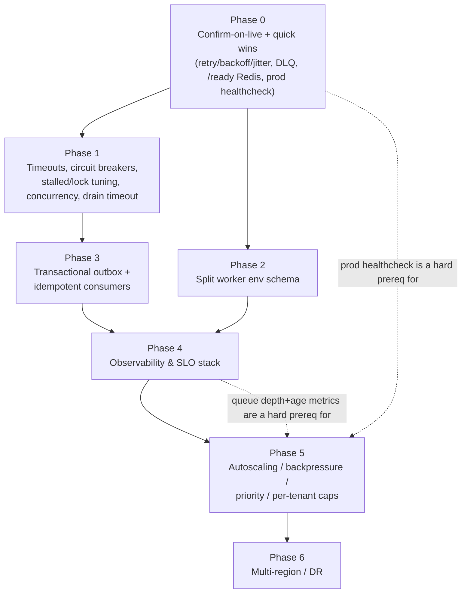

# Phased Implementation Plan

> **Status: Phases 0–5 IMPLEMENTED (Phases 4–5 as their in-repo subsets)** on
> `feat/data-mgmt-01-research-brief` — **pending CI gates** (typecheck/biome/tests + itests with
> the new migration; no local bun) **and the staging fault-injection drills** in each phase's
> Verify section. Phase 0.0 (confirm-on-live,
> [03-live-inspection-runbook.md](03-live-inspection-runbook.md)) is **still owed by the operator**.
> - **Phase 0** @ `5c3c8cc` — retry+jitter, 8 DLQs, Redis-aware `/ready` (F14), prod healthcheck.
> - **Phase 1** @ `c681629` — processor deadlines, stall/lock tuning + stall-exhaustion DLQ,
>   concurrency (spend path pinned — F3 tripwire test), 30s bounded drain.
> - **Phase 2** @ `d9111c7` — surface-aware env schema (`LEADWOLF_SURFACE=worker`): missing
>   web/auth-only keys no longer block worker boot; access to a relaxed key throws; boot self-test log.
> - **Phase 3** @ `d7c1ebf` — transactional outbox (`worker_outbox`, migration 0052 — renumbered from
>   0051 at the main merge; main's 0051 is the realtime `event_outbox`): the confirm
>   transition commits its drive-publish intent atomically; a leaderless SKIP-LOCKED relay
>   (continuous 1s poll — F1/F2) publishes with stable jobIds; the api's direct producer is deleted.
> - **Phase 4 subset** @ `b6e5e67` — zero-dep worker `/metrics` (Prometheus text: counters, depths,
>   outbox relay-lag gauge), admin probes extended 3 → all event queues + every DLQ, tenant log tags.
>   **Deferred (needs a CI-capable deps pass):** OTel traces, log shipper, SLO/burn-rate tooling.
> - **Phase 5 subset** @ `d41ed52` — **F3 entry gate closed**: atomic per-workspace daily budget
>   breaker (advisory xact lock; the racy read-check-act is gone) + producer backpressure (typed 503
>   sheds on saturated import/bulk-drive queues). **Deferred (infra + Phase-4-metrics-in-prod
>   gated):** ECS/KEDA autoscaling on depth+age, priority fleets, per-tenant WFQ fairness caps.
> - **Phase 6 (multi-region / DR)** — **not implementable in-repo** (pure infra: cross-region warm
>   standby, regional failover); the design + runbooks live in [07](07-target-architecture.md) §9 /
>   [09](09-reliability-fault-tolerance.md) / [13](13-operational-runbooks.md); execution is an
>   infrastructure engagement with drills, per ADR-0024's availability target.
>
> **In-phase deviations (deliberate, documented):**
> - **Outreach retry is `attempts: 2`, not 3** — the implementation-time check confirmed `sendStep`
>   recomputes the step from the uncommitted log row (no per-(logId, step) send-idempotency guard),
>   so a post-send/pre-commit retry re-sends the same step; 2 bounds the worst case to one duplicate
>   (`apps/workers/src/retryPolicies.ts` OUTREACH_RETRY documents the raise condition).
> - **Circuit breakers (Phase 1 §3.1) are deferred** — they need per-provider state design in
>   `packages/integrations`; the processor-level deadlines (`withDeadline.ts`) cover the
>   queue-wedge risk meanwhile.
> - **Stall-exhausted failures dead-letter immediately** (an addition): BullMQ's terminal stall
>   failure bypasses the attempts machinery, so `deadLetter.ts` matches it explicitly — without
>   this, the stall tuning would have created invisible failures.

**Audience:** staff engineers + eng leadership.
**Companion docs:** this plan operationalizes the fixes catalogued in
[04-issue-resolution-plan.md](04-issue-resolution-plan.md), the target design in
[07-target-architecture.md](07-target-architecture.md), and the migration arc in
[08-migration-strategy.md](08-migration-strategy.md). It is the *build schedule* those docs feed.

> **Reconciliation with re-audit (14).** This plan was written last but now **gates on** the
> second-pass findings in [14-re-audit-and-risks.md](14-re-audit-and-risks.md) rather than deferring
> them to a later re-run. These are folded into the phases below as **hard gates, applied now** — not a
> future adversarial pass:
> - **F1** — the outbox relay is **leaderless + partitioned** (`FOR UPDATE SKIP LOCKED`, run
>   continuously), **not** a single-leader sweep and **not** a clone of the daily `projection_sweep`
>   cadence — **Phase 3**.
> - **F3** — the **atomic** daily/workspace budget breaker **and** the per-batch credit lease
>   (ADR-0029/0036) ship **before** any spend-path concurrency raise — **Phase 5 hard entry gate**.
> - **F11** — the money/real-time (T0) tier keeps a **warm `minReplicas ≥ 1`** (no scale-to-zero on the
>   spend path) — **Phase 5**.
> - **F13** — **every** live producer on the outbox (or a documented at-least-once + idempotent + sweep
>   exception) is a **Phase-4 exit gate** before Phase-5 scale-out.
> - **F14** — `/ready` is a **bounded** probe of the **blocking-consumer** connection with a **failure
>   threshold**, so a transient Redis blip cannot cause a restart storm — **Phase 0**.
>
> No code is written by this reconciliation and no kill-switch is flipped.

---

## 0. The golden rule of this plan: do not "fix" a non-bug first

The dashboard reading **Queued: 4, Awaiting Confirmation: 1** is **almost certainly by design, not a
broken worker.** `queued` and `awaiting_confirmation` are `enrichment_jobs.status` values, and the
entire bulk-enrichment money path is deliberately **dark** behind an env kill-switch
(`BULK_ENRICHMENT_ENABLED`, default OFF, `packages/config/src/env.ts:223`), a per-tenant flag
(`bulk_enrichment_enabled`, seeded `global_enabled=false`,
`packages/db/migrations/0048_seed_bulk_enrichment_flag.sql:1`), and a human confirm-before-spend
gate (`apps/api/src/features/enrichment/routes.ts:82-100`). The comment at
`packages/core/src/prospect/bulkActions.ts:330-332` literally says a `queued` bulk-enrich job is an
"inert orphan… no worker, no spend." See [02-root-cause-analysis.md](02-root-cause-analysis.md) for
the full state-machine trace.

**Therefore Phase 0 begins by *confirming* the counts are by-design on the live environment (run
[03-live-inspection-runbook.md](03-live-inspection-runbook.md)) before any code is touched.** Only
after the runbook rules out the three genuine failure modes (worker never booted, Redis wedged,
boot crash from a missing unrelated env var) do we proceed to the hardening work.

Two registers are kept strictly separate throughout:

| Register | Meaning | Example |
|---|---|---|
| **By-design darkness** | Safe-by-default; the intended resting state of an un-launched feature | `queued`/`awaiting_confirmation` rows; unregistered flag-gated workers |
| **Genuine defect** | A real reliability gap that harms the *live* pipelines regardless of flags | `/ready` never checks Redis; prod `workers` has no healthcheck; 6 queues retry once |

This plan hardens the platform. **It does not flip a single kill-switch.** Enabling bulk-enrichment
is a separate, deliberate rollout decision owned by [13-operational-runbooks.md](13-operational-runbooks.md)
("safe flag-flip"), *not* by this build schedule.

---

## 1. Roadmap at a glance

| Phase | Theme | Primary register addressed | Priority | Ships infra? |
|---|---|---|---|---|
| **0** | Confirm-on-live + reliability quick wins | Genuine defects (small, high-value) | **P0** | No |
| **1** | Failure containment: timeouts, circuit breakers, stalled/lock tuning, concurrency | Genuine defects | **P1** | No |
| **2** | Boot isolation: split the worker env schema | Genuine defect (SPOF) | **P1** | No |
| **3** | Exactly-once effect: transactional outbox + idempotent consumers | Correctness gap vs ADR-0027 | **P1→P2** | DB only |
| **4** | Observability & SLO stack | Gap vs `docs/planning/19-observability-reliability.md` | **P2** | Yes |
| **5** | Elasticity: autoscaling, backpressure, priority lanes, per-tenant caps | Gap vs `docs/planning/18-scalability-performance.md` | **P2** | Yes |
| **6** | Multi-region / DR | Gap vs §19 §6 / ADR-0024 | **P3** | Yes |

The intended-design targets (autoscale on queue depth+age, transactional outbox, RTO 1h / RPO 5min,
full RED + traces) are documented as **design intent** in
[07-target-architecture.md](07-target-architecture.md) and
[06-gap-analysis.md](06-gap-analysis.md); this plan is the ordered path to close that gap. The
[14-re-audit-and-risks.md](14-re-audit-and-risks.md) second-pass audit is **not** deferred to a
re-run after Phases 3–5 land: its P0/P1 findings (F1, F3, F11, F13, F14) are folded into the phases
below as **hard gates applied now** — see the reconciliation note above. Any residual second-pass
re-verification is confirmatory only, not a precondition this plan leaves open.

### 1.1 Dependency graph

**Critical-path note:** Phase 5 (autoscaling on queue depth+age, per
`docs/planning/18-scalability-performance.md:57`) is **blocked on Phase 4** — you cannot autoscale on
a signal you do not yet emit. Phase 4 is in turn cleaner after Phase 3 gives us the outbox to
instrument. Phases 0, 1, and 2 are mostly independent and can parallelize across two workers.

---

## 2. Phase 0 — Confirm-on-live + reliability quick wins  **(P0)**

**Goal:** prove the reported counts are by-design, then close the four small, unambiguous genuine
defects that harm *every* live queue today. All four are low-risk, additive, and independently
reversible. This phase does **not** enable any dark feature.

### 2.1 Scope

| # | Work item | Register | Why now |
|---|---|---|---|
| 0.0 | Run the live-inspection runbook; record the verdict | Operational | Don't fix a non-bug; establishes the baseline |
| 0.1 | Add `attempts` + exponential backoff **+ jitter** to the 6 no-retry queues | Genuine defect | One transient blip = a permanently lost job today |
| 0.2 | Extend DLQ coverage beyond the current 3 queues | Genuine defect | 22 of 25 queues lose exhausted-retry jobs silently |
| 0.3 | `/ready` performs a bounded Redis `PING` | Genuine defect | A wedged consumer reports `200 ready` forever |
| 0.4 | Give the **prod `workers` container** a healthcheck + probe path | Genuine defect | A wedged/crashed worker is never auto-restarted |

**Explicitly out of scope for Phase 0:** changing concurrency, adding vendor timeouts, or touching
any `*_ENABLED` switch. Those are Phase 1+ / rollout-runbook work.

### 2.2 Work item detail

**0.0 — Confirm on live (no code).** Execute [03-live-inspection-runbook.md](03-live-inspection-runbook.md)
end-to-end against the prod env: is the `workers` container up? Is Redis reachable and what are the
`bull:*` depths? What do the `enrichment_jobs` rows and `feature_flags` states say? Interpret against
that doc's matrix. Expected result: counts are the by-design resting state (flag OFF, no confirm
click). Attach the output to the phase ticket as the baseline. **Gate:** if the runbook instead finds
a wedged worker or Redis, that is an incident — page per [13-operational-runbooks.md](13-operational-runbooks.md),
do not proceed to 0.1 until stabilized.

**0.1 — Retry + backoff + jitter on the six `attempts=1` queues.** As built, six producers call
`queue.add(...)` with **no job options**, so BullMQ defaults to a single attempt and no backoff:
`enqueueEnrichment` (`apps/workers/src/register.ts:205`), `enqueueScoring` (`:211`), `enqueueDsar`
(`:217`), `enqueueOutreach` (`:223`), `enqueueDedup` (`:324`), `enqueueFirmographics` (`:330`). The
fix mirrors the two queues that *already* retry correctly — `enqueueReverification` uses
`{ attempts: 3, backoff: { type: "exponential", delay: 60_000 } }` (`register.ts:288`) and
`enqueueMasterBackfill` uses `{ attempts: 4, backoff: { type: "exponential", delay: 30_000 } }`
(`register.ts:345`). Add jitter (BullMQ supports a custom backoff strategy) so retries de-correlate
under a shared-vendor outage — the base exponential policy in the repo has no jitter today.
*Register note:* `enrichment`, `scoring`, and `dsar` have **no live producer** wired
(brief §THE 25 QUEUES rows 2–4), so 0.1 is pre-hardening for their eventual launch; `dedup`,
`firmographics`, and `outreach` **do** fire on every import completion (`register.ts:393,398,506`) and
benefit immediately. `outreach` already defers-not-fails on throttle (`outreach.ts:56-62`), so retry
must be reserved for genuine throwing errors, not throttle deferrals — verify that distinction in code
review.

**0.2 — DLQ coverage.** Only `IMPORTS_DLQ` (`register.ts:379-385`), `BULK_IMPORTS_DLQ` (`:620`), and
`BULK_ENRICHMENT_DLQ` (`:659`) exist; they route only *after retries are exhausted* and are PII-free.
Reuse that exact `on("failed")` + `deadLetterFailed*` pattern (`register.ts:379-385`) to dead-letter
the retryable event queues once 0.1 gives them a retry budget — priority order: `master-backfill`
(already `attempts:4`, currently drops to the failed set), then `reverification`, then the newly
retried `dedup`/`firmographics`/`outreach`. Keep dead-letters payload-minimal (job id + error, no
PII) per [12-security-review.md](12-security-review.md). Sweeps stay best-effort (leader-gated, idempotent,
re-run daily) and do **not** need DLQs.

**0.3 — `/ready` Redis check.** Today `health.ts` returns readiness purely from the in-process
`ready` closure (`apps/workers/src/health.ts:16-20`), fed by `index.ts:10-11`; it **never touches
Redis**. Because the shared IORedis is created with `maxRetriesPerRequest: null`
(`register.ts:132`), a wedged Redis makes ioredis buffer commands silently — the worker blocks but
`/ready` still answers `200`. Add a **bounded** (~250–500ms) `PING` against the shared `connection`
to the `isReady` path so a wedged consumer fails readiness. **(Reconciled with
14-re-audit-and-risks.md, F14 — hard requirements, not options.)** (a) Probe the **blocking-consumer**
connection specifically: once Redis is split into per-role connections, a `PING` on a producer/throttle
client can return green while the blocking connection that actually starves under
`maxRetriesPerRequest:null` is dead — so probe that connection (or a "last job dequeued within N s"
liveness signal), not any Redis client. (b) Require a **failure threshold** (N consecutive bounded-probe
fails over a window) before `/ready` flips to `503`, so a transient Redis blip does not flap every
replica at once into a restart storm. (c) **Sequencing gate:** aggressive restart-on-unhealthy (0.4) is
only fully safe **after Phase 3 (outbox)** makes in-flight work reconstructable — pre-outbox, a
synchronized restart on a 2 s Redis hiccup **loses in-flight Redis jobs**, so until Phase 3 lands lean on
the failure threshold and err toward restraint. Keep `/health` (liveness) unchanged so the orchestrator
restarts, not just de-routes, a truly dead process.

**0.4 — Prod worker healthcheck.** The health server already listens on port 3002
(`health.ts:7`, started at `index.ts:11`), but the prod `workers` service inherits `<<: *app` and sets
only a `command` — **no `healthcheck`, no published port** (`docker-compose.prod.yml:115-117`), so
`3002` is never probed and a wedged worker is never auto-restarted. Add a healthcheck modeled on the
`web` service's (`docker-compose.prod.yml:126-131`), pointed at `http://localhost:3002/ready` (which,
post-0.3, reflects Redis health). No published host port is required — the compose healthcheck runs
inside the container. Set the healthcheck `retries`/`interval` to honour 0.3's failure threshold (do
**not** restart on a single probe miss) so a transient Redis blip cannot flap every replica into a
fleet-wide restart storm, and note the sequencing: aggressive restart-on-unhealthy is only fully safe
after Phase 3's outbox makes in-flight work reconstructable (reconciled with 14-re-audit-and-risks.md,
F14).

### 2.3 Representative files

| File:line | Change |
|---|---|
| `apps/workers/src/register.ts:205,211,217,223,324,330` | Add `{ attempts, backoff, jitter }` to the six `.add()` calls |
| `apps/workers/src/register.ts:288,345` | Reference implementations to mirror (retry already correct) |
| `apps/workers/src/register.ts:379-385` | DLQ pattern to extend to more workers |
| `apps/workers/src/health.ts:16-20` | Insert bounded Redis `PING` into readiness |
| `apps/workers/src/index.ts:11` | Wire the Redis probe into `startHealthServer` |
| `docker-compose.prod.yml:115-117` | Add `healthcheck:` block for `workers` |

### 2.4 Verify · Regression · Perf · Rollback · Exit

- **Verify:** unit-assert each of the six `.add()` calls now passes `attempts>1` + a backoff strategy
  with jitter. Integration: kill Redis mid-run in a scratch env → `/ready` flips to `503` within the
  timeout and the compose healthcheck marks the container unhealthy. Re-run
  [03-live-inspection-runbook.md](03-live-inspection-runbook.md) probes and confirm the by-design verdict
  is unchanged (counts still explained by flags, now with retry armed).
- **Regression tests:** (a) throttle-deferred `outreach` sends are **not** counted as failed retries;
  (b) idempotent consumers (`master-backfill`, `reverification`, `dedup`) survive a duplicate delivery
  without double-effect — assert row counts unchanged on re-run; (c) existing 3 DLQs still receive only
  post-exhaustion, PII-free entries.
- **Perf validation:** measure added `/ready` latency (target < 5ms p99 when Redis healthy; the PING is
  the only new I/O). Confirm the healthcheck `interval`/`timeout` (10s/5s like `web`) does not add
  meaningful load.
- **Rollback:** every item is additive and independently revertible. Revert order is irrelevant:
  drop the `healthcheck` block, revert `health.ts`, revert the six `.add()` option objects. No data
  migration, no schema change, no flag change.
- **Exit criteria:** ✅ live verdict recorded; ✅ all six queues retry with jittered backoff; ✅ ≥ the
  master-backfill + reverification queues gain DLQs; ✅ `/ready` (bounded probe of the **blocking-consumer**
  connection, with a **failure threshold**) returns `503` on a wedged Redis in a fault-injection test yet
  rides out a single transient blip without flapping every replica into a restart storm (F14); ✅ prod
  `workers` healthcheck restarts a killed/wedged container in a staging drill.

---

## 3. Phase 1 — Failure containment  **(P1)**

**Goal:** stop a single slow or hung job from wedging a queue forever. Concurrency is **1 for every
worker** — no `concurrency`, `limiter`, `lockDuration`, `stalledInterval`, or `maxStalledCount` is
set anywhere in `apps/workers/src` (brief §Concurrency; BullMQ v5 defaults apply: 30s lock, 1 stalled
reclaim). With concurrency 1 and **no vendor-call timeout**, one hung upstream call holds the lock and
blocks the entire queue. The shutdown path compounds this: `index.ts:20` does
`await Promise.all(workers.map(w => w.close()))` with **no drain timeout**, so a hung job (concurrency
1) makes shutdown wait forever.

### 3.1 Scope

- **Vendor/IO timeouts** on every external call inside consumers (enrichment, reverification, outreach
  send, firmographics) — a bounded `AbortController`/deadline so a slow upstream fails fast into the
  Phase-0 retry+DLQ path instead of holding the lock.
- **Circuit breakers** around metered/external dependencies (enrichment/verification vendors,
  Reacher) so repeated upstream failures trip open and shed instead of hammering — realizes the typed
  `503 + Retry-After` behaviour intended in `docs/planning/19-observability-reliability.md` §4.
- **Stalled / lock tuning:** set explicit `lockDuration`, `stalledInterval`, and `maxStalledCount`
  per queue class so a crashed worker's job is reclaimed predictably rather than on the 30s default.
- **Per-queue concurrency:** raise concurrency for IO-bound event queues (dedup, firmographics,
  reverification, outreach) with a `limiter`; keep money/spend steps conservative.
- **Bounded drain:** add a drain timeout + forced `close(true)` to `index.ts:20` so SIGTERM cannot
  hang forever.

### 3.2 Representative files

| File:line | Change |
|---|---|
| `apps/workers/src/register.ts:374-570` | Add `{ concurrency, limiter, lockDuration, stalledInterval, maxStalledCount }` to `new Worker(...)` options |
| `apps/workers/src/queues/enrichment.ts`, `reverification.ts`, `outreach.ts`, `firmographics.ts` | Wrap external calls in a deadline + circuit breaker |
| `apps/workers/src/index.ts:20` | `Promise.race` the drain against a timeout, then `close(true)` |

### 3.3 Verify · Regression · Perf · Rollback · Exit

- **Verify:** fault-inject a hung vendor call → the job aborts at the deadline, retries per Phase 0,
  and the queue keeps draining other jobs (does not wedge). Kill a worker mid-job → the job is
  reclaimed after `lockDuration`/`stalledInterval`, not lost.
- **Regression tests:** confirm `maxStalledCount` does not cause duplicate *effects* on idempotent
  consumers; confirm the breaker's open state returns a retryable (not terminal) failure so jobs land
  in DLQ only after genuine exhaustion; confirm the mailbox throttle
  (`register.ts:372`, `mailboxThrottle.ts`) still governs outreach send-rate independent of the new
  concurrency.
- **Perf validation:** load-test each raised-concurrency queue to confirm throughput scales without
  breaching the shared IORedis connection (`register.ts:132`) or the DB pool; measure p95 job latency
  before/after. Compare against the async freshness SLO targets in
  `docs/planning/18-scalability-performance.md` (enrichment p95 < 10 min) as a directional check.
- **Rollback:** all changes are config on `Worker`/`.add()` options plus a bounded drain — revert to
  concurrency 1 and remove the timeout wrappers. No schema/flag impact.
- **Exit criteria:** ✅ no queue can be wedged by a single hung job in fault-injection; ✅ every
  external call has a deadline; ✅ breakers trip + recover in a drill; ✅ SIGTERM drains within the
  configured bound in a staging test.

---

## 4. Phase 2 — Boot isolation: split the worker env schema  **(P1)**

**Goal:** remove the shared-config single-point-of-failure. `loadEnv()` validates the **whole-app**
schema and **throws, crashing the process**, on any invalid/missing key (`packages/config/src/env.ts:328-335`,
frozen export `:352`). Because the worker imports the same schema, it fails to boot if unrelated,
web/auth-only keys are missing — e.g. `AUTH_ORIGIN`, `APP_ORIGINS`, `AUTH_COOKIE_DOMAIN`,
`JWT_SIGNING_KID`, `DATABASE_URL`, `BLIND_INDEX_KEY` (`env.ts:17,32,33,58,67,80`). A missing
auth cookie var can therefore keep the worker dark, presenting *exactly* like the by-design stuck
counts — a classic false-positive this plan must eliminate. See the boot-crash scenario in
[03-live-inspection-runbook.md](03-live-inspection-runbook.md).

### 4.1 Scope

- Carve a **worker-scoped env schema** (or a validated subset) covering only what the worker actually
  reads — `REDIS_URL` (`env.ts:78`), `DATABASE_URL`, the `*_ENABLED` gates, `REACHER_BACKEND_URL`
  (`env.ts:133`) — so a missing web-only key cannot block worker boot.
- Fail-closed semantics preserved: unknown/invalid worker keys still crash the *worker* loudly; only
  the *cross-surface coupling* is removed.
- Emit a clear boot-time self-test line naming exactly which worker-relevant keys are present, to make
  the runbook's "did it boot?" step unambiguous.

### 4.2 Representative files

| File:line | Change |
|---|---|
| `packages/config/src/env.ts:328-352` | Introduce a worker subset-parse path distinct from the whole-app parse |
| `apps/workers/src/register.ts:132` | Consumes `env.REDIS_URL` — must resolve from the worker schema |
| `apps/workers/src/index.ts:9-12` | Boot self-test log naming present worker keys |

### 4.3 Verify · Regression · Perf · Rollback · Exit

- **Verify:** unset a web-only key (e.g. `AUTH_COOKIE_DOMAIN`) in a scratch worker env → worker boots
  and processes jobs; unset `REDIS_URL` → worker crashes loudly with a precise message.
- **Regression tests:** the `web`/`api`/`auth` surfaces still validate the *full* schema unchanged
  (no key silently dropped from their contract); flag reads (`BULK_ENRICHMENT_ENABLED` et al.) resolve
  identically from the worker schema.
- **Perf validation:** n/a (boot-time only); confirm no added startup latency beyond a single parse.
- **Rollback:** revert to the single `loadEnv()`; the change is isolated to `packages/config`.
- **Exit criteria:** ✅ worker boots with only worker-relevant keys set; ✅ full-schema surfaces
  unaffected; ✅ boot log makes "did the worker start?" answerable at a glance.

---

## 5. Phase 3 — Exactly-once effect: transactional outbox  **(P1 → P2)**

**Goal:** close the non-atomic enqueue gap. Today the DB `enrichment_jobs` rows are created with
**zero** BullMQ interaction (`packages/core/src/prospect/bulkActions.ts:337-364`); the single drive
enqueue happens **later and outside any shared transaction** in the confirm HTTP handler — confirm at
`apps/api/src/features/enrichment/routes.ts:101`, enqueue at `:119`. So a job can be flipped to
`running` and the process die before the enqueue, or the producer returns `null` when the flag is off
(`bulkEnrichQueue.ts:48`) → a `running` row with **no drive job in Redis**, and `runBulkEnrich` is only
resumable if a drive job lands, so a lost enqueue is **not self-healing** (brief §Non-atomic enqueue).
This is precisely the enqueue-after-commit pattern that
`docs/planning/decisions/ADR-0027-real-time-delivery-and-event-backbone.md` **explicitly rejects**
("DB commit ⇒ event published", at-least-once, crash-safe, with idempotent consumers).

### 5.1 Scope

- A **transactional outbox** table written in the *same* DB transaction as the state transition, plus
  a relay that publishes to BullMQ at-least-once. **(Reconciled with 14-re-audit-and-risks.md, F1/F2 —
  hard design constraint.)** The relay is **leaderless and partitioned**: **N** drainers using
  `FOR UPDATE SKIP LOCKED` over a partitioned outbox (hash by `domain`/`tenant_id`), run **continuously**
  (sub-second poll, or CDC for the highest-volume domains). It is **not** a single-leader `withLeaderLock`
  sweep and **not** a clone of the daily, leader-locked, cap-2000 `projection_sweep` cadence — pinning the
  relay to one leader throws away the `SKIP LOCKED` concurrency it depends on and re-creates the
  throughput ceiling / relay-lag stuck state the outbox exists to remove. **Only** the
  `FOR UPDATE SKIP LOCKED` drain query is reusable from the `projection_sweep`/outbox-drain machinery at
  `register.ts:265`; its leader lock, daily cadence, and row cap are **not**. A relay-lag SLO + alert
  (`age(now − oldest unsent)`) is defined in Phase 4.
- **Idempotent consumers** keyed on the job/step id (the `bulk-enrichment` chunk path already uses a
  dedupe key `seqstep:{logId}:{step}` pattern at `register.ts:509` — extend that discipline) so a
  double-published drive job is a no-op.
- Applied first to the highest-value at-least-once path (`bulk-enrichment` confirm→drive), then
  generalized to imports and outreach.

### 5.2 Representative files

| File:line | Change |
|---|---|
| `apps/api/src/features/enrichment/routes.ts:101,119` | Replace commit-then-enqueue with outbox-insert in the confirm txn |
| `apps/api/src/features/enrichment/bulkEnrichQueue.ts:45-51` | Relay-driven publish; keep the `!env.BULK_ENRICHMENT_ENABLED` self-gate (`:48`) |
| `apps/workers/src/register.ts:265` | Reuse **only** its `FOR UPDATE SKIP LOCKED` drain query — **not** its leader lock or daily cadence (F1/F2); the relay runs leaderless + partitioned + continuous |
| `packages/db/migrations/*` | New `outbox` table + relay watermark (additive migration) |

### 5.3 Verify · Regression · Perf · Rollback · Exit

- **Verify:** crash-inject between the confirm commit and the relay publish → the relay republishes on
  recovery and the drive job runs exactly once in effect. Flag-OFF path still inserts the row and
  publishes nothing (no `running` orphan created because the transition is outbox-gated).
- **Regression tests:** confirm the 8-value status vocabulary
  (`packages/db/src/schema/enrichmentJobs.ts:73-76`) and its guarded transitions
  (`enrichmentJobRepository.ts:331-345,354-365`) are unchanged; confirm a duplicate outbox publish
  produces one chunk fan-out, not two (idempotency).
- **Perf validation:** measure relay lag (target: well within the `bulk-enrichment < 30 min / 100k
  rows` async SLO in `docs/planning/18-scalability-performance.md`); confirm the outbox drain does not
  contend with the daily sweeps on the shared IORedis.
- **Rollback:** the outbox table is additive; a feature-flagged relay lets us fall back to the current
  enqueue path without dropping the table. Reversible by config.
- **Exit criteria:** ✅ no `running` row can exist without a corresponding drive publish; ✅ crash
  between commit and publish self-heals; ✅ consumers are idempotent under duplicate delivery;
  ✅ the relay is **leaderless + partitioned** (`FOR UPDATE SKIP LOCKED`, continuous), **not** a
  single-leader sweep, with a relay-lag SLO defined (F1); ✅ ADR-0027's "commit ⇒ published" invariant
  holds for the bulk-enrichment path.

---

## 6. Phase 4 — Observability & SLO stack  **(P2)**

**Goal:** make the system measurable — the hard prerequisite for autoscaling (Phase 5). As built,
observability is thin: liveness/readiness with no Redis check (`health.ts`), JSON-line logs with **no
correlation id, no tenant/workspace tags, no shipper** (`apps/workers/src/logger.ts:9-11`), per-job
`instrument()` completed/failed lines (`register.ts:350-362`), 3 DLQs, and an admin pull-probe that
live-probes only **3 of 25** queues (`apps/api/src/features/admin/systemHealthProbes.ts:54-83`). **No
telemetry libraries are installed** — no OpenTelemetry, Sentry/GlitchTip, Prometheus, StatsD, X-Ray,
or PostHog (brief §OBSERVABILITY TODAY; the `@opentelemetry/api` entry in `bun.lock` is an unused
optional peer of drizzle-orm). The sanctioned target is
`docs/planning/19-observability-reliability.md`: CloudWatch + Grafana (RED, queue depth/age),
structured logs with one correlation id + tenant/workspace tags, X-Ray traces, GlitchTip errors,
PostHog, SLOs + monthly error budgets with fast/slow burn-rate alerts, and per-bulk-job three-way
`succeeded/failed/unprocessed` reconciliation (§9).

### 6.1 Scope

- **Metrics:** RED per queue + **depth / age / oldest-job**, DLQ depth, retry
  transient-vs-deterministic classification (§9.2). Extend the admin probe from 3 → all 25 queues.
- **Traces:** context propagation from the API producer through the outbox (Phase 3) to the consumer.
- **Logs:** add a correlation id + tenant/workspace tags to `logger.ts` and ship them.
- **SLOs + burn-rate alerts** and a symptom-based alert catalog (queue age, DLQ growth, replica lag),
  severity ladder, and per-alert runbooks — feeding [10-observability-alerting.md](10-observability-alerting.md).
- **Relay-lag SLO (F1):** add an `age(now − oldest unsent outbox row)` metric + alert for the Phase-3
  relay, and budget the outbox write-amplification against the Aurora ceiling.
- **Producer-cutover completion — hard Phase-4 exit gate (reconciled with 14-re-audit-and-risks.md,
  F13):** before Phase 5 can scale replicas, **every** live event producer must be on the Phase-3 outbox
  **or** carry a documented at-least-once + idempotent-consumer exception with a sweep backstop. Phase 3
  cuts over the bulk-enrichment path first, but the best-effort import→rollup fan-outs
  (`void enqueueDedup(...).catch(...)` after commit, `register.ts:389-410`) must be included here.
  Scaling replicas in Phase 5 **multiplies the crash surface** of any producer still on
  enqueue-after-commit, so the non-atomic-enqueue gap must be closed for **all** producers — not just the
  one path Phase 3 cut over — before N>1 replicas run.

### 6.2 Representative files

| File:line | Change |
|---|---|
| `apps/workers/src/logger.ts:9-11` | Add correlation id + tenant/workspace tags + shipper |
| `apps/workers/src/register.ts:350-362` | Extend `instrument()` to emit metrics, not just log lines |
| `apps/api/src/features/admin/systemHealthProbes.ts:54-83` | Probe all 25 queues with depth/age/DLQ signal |
| `apps/workers/src/health.ts` | Expose queue-depth/age for scrape |

### 6.3 Verify · Regression · Perf · Rollback · Exit

- **Verify:** a single job flows end-to-end with one correlation id visible in logs + trace; queue
  depth/age/oldest-job metrics appear for all 25 queues; a synthetic DLQ entry fires the growth alert.
- **Regression tests:** confirm no PII leaks into metrics/traces/logs (align with
  [12-security-review.md](12-security-review.md) DLQ hygiene); confirm the admin probe's honest
  `reachable:false` behaviour (`systemHealthProbes.ts:64-83`) is preserved for down queues.
- **Perf validation:** measure instrumentation overhead per job (target < 1–2% throughput); confirm
  the metrics path does not add load to the shared IORedis.
- **Rollback:** telemetry is additive and behind config; disabling the exporter reverts to the current
  JSON-line logging with no functional change.
- **Exit criteria:** ✅ RED + depth/age/oldest for all 25 queues; ✅ correlation id + tenant tags in
  every log line; ✅ SLOs defined with burn-rate alerts (including the relay-lag SLO, F1); ✅ per-bulk-job
  three-way accounting live; ✅ **Phase-4 exit gate (F13):** every live producer is on the outbox or has a
  documented at-least-once + idempotent + sweep-backstopped exception — no producer remains on bare
  enqueue-after-commit before Phase-5 scale-out.

---

## 7. Phase 5 — Elasticity: autoscaling, backpressure, priority, per-tenant caps  **(P2)**

**Goal:** scale to the target load (millions of users, 1M-row imports < 30 min). This is
**blocked on Phase 4** — `docs/planning/18-scalability-performance.md:57` specifies workers
**autoscale on queue depth + age per domain**, which requires the metrics Phase 4 emits. As built the
system is a **single** `workers` container (`docker-compose.prod.yml:115-117`) at concurrency 1 with
no autoscaling, no backpressure, and no priority lanes.

> **Hard entry gates for this phase (reconciled with 14-re-audit-and-risks.md, F3 + F11 — applied now,
> not a later re-run):**
> - **F3 — atomic spend backstops before any concurrency raise.** Do **not** raise concurrency or scale
>   replicas on the **spend path** until (a) the **daily/workspace budget breaker is atomic** — accrue-
>   and-check in one statement, mirroring the per-run cap's `addRunSpendReturningTotal`; today it is a
>   racy read-check-act (`packages/core/src/enrichment/enrichContact.ts:125-139`) that N in-flight
>   workers can all pass, overshooting the daily budget by up to N paid calls — **and** (b) the
>   **per-batch credit lease (ADR-0029/0036)** is live. The lease is on this phase's **critical path** (a
>   hard entry gate), not a P1 follow-up: overshoot is `O(C)` and this phase is exactly what raises C.
> - **F11 — the money tier stays warm.** The **money/real-time (T0) tier keeps `minReplicas ≥ 1`**;
>   scale-to-zero is permitted **only** for the bulk (T1) and maintenance (T2) tiers. Scaling the
>   confirm-gated, latency-SLO'd money path from zero pays Fargate task-pull + Bun boot + whole-app env
>   validation on the critical path and fights its own freshness SLO.

### 7.1 Scope

- **Autoscale** stateless workers on ECS Fargate on queue depth + age per domain (§3).
- **Backpressure:** depth/age → autoscale → **shed / slow producers**, with typed `503 + Retry-After`
  (ties to Phase 1 circuit breakers and §9).
- **Priority lanes:** bulk runs **below** money/real-time work
  (`docs/planning/18-scalability-performance.md:221`).
- **Per-tenant bulk concurrency caps + fairness** (§9, §11.2) so one tenant's 1M-row import cannot
  starve others — the leader-lock sweeps are per-tick mutexes today (`leaderLock.ts:24-25`), not a
  fair-share scheduler.

### 7.2 Representative files

| File:line | Change |
|---|---|
| `docker-compose.prod.yml:115-117` | Replace single container with an autoscaling service definition (target infra) |
| `apps/workers/src/register.ts:374-570` | Per-domain queue prioritization + per-tenant limiter |
| `apps/api/src/features/enrichment/bulkEnrichQueue.ts` | Producer-side backpressure / shed signal |

### 7.3 Verify · Regression · Perf · Rollback · Exit

- **Verify:** load a synthetic depth spike → replicas scale out on depth+age and back in when drained;
  a saturating tenant is capped and others keep flowing (fairness); bulk yields to a concurrent
  money-path job (priority).
- **Regression tests:** confirm leader-gated sweeps still elect exactly one runner under multiple
  replicas (`leaderLock.ts:24-30`) — this is the first time > 1 worker replica runs, so re-verify no
  sweep double-fires; confirm idempotent consumers (Phase 3) hold under parallelism.
- **Perf validation:** demonstrate 1M-row import < 30 min and bulk-enrichment < 30 min / 100k rows
  under the autoscaled fleet (§18 targets); confirm per-tenant caps hold p95 fair-share.
- **Rollback:** pin `desiredCount=1` and remove priority/caps to return to today's single-container
  behaviour; changes are infra + queue-option config, reversible without data impact.
- **Exit criteria:** ✅ **spend-path hard gates met before any concurrency raise (F3):** the daily/
  workspace budget breaker is **atomic** and the per-batch credit lease (ADR-0029) is **live**; ✅ **the
  money/real-time (T0) tier stays warm at `minReplicas ≥ 1`** (F11), scale-to-zero limited to the bulk/
  maintenance tiers; ✅ autoscaling on depth+age; ✅ backpressure sheds with typed 503; ✅ bulk
  de-prioritized below real-time; ✅ per-tenant caps + fairness enforced; ✅ target-scale perf numbers
  met in a load test.

---

## 8. Phase 6 — Multi-region / DR  **(P3)**

**Goal:** meet the intended resilience posture — `docs/planning/19-observability-reliability.md` §6
targets **DR RTO 1h / RPO 5min** via a cross-region warm standby, and ADR-0024 targets **99.9%
availability**. As built there is a single region, one worker container, and a single shared Redis
(`register.ts:132`); dev Redis even runs `--save "" --appendonly no` (`docker-compose.yml:21`) so a
restart wipes all repeatables + queued jobs, while prod uses `--appendonly yes`
(`docker-compose.prod.yml:26`). Multi-region is the final, highest-lift phase and depends on Phases
3–5 (outbox for cross-region replay, observability for regional health, elasticity for failover
capacity).

### 8.1 Scope

- Cross-region warm standby for Redis + workers; regional health-based failover.
- Repeatable-schedule + outbox replay on failover (leverages Phase 3 outbox and Phase 4 signals).
- Chaos / game-day drills (§7) validating RTO/RPO.

### 8.2 Representative files

| File:line | Change |
|---|---|
| `docker-compose.prod.yml:26,115-117` | Regional topology / standby (target infra) |
| `apps/workers/src/register.ts:255-320` | Repeatable re-registration on regional promotion |

### 8.3 Verify · Regression · Perf · Rollback · Exit

- **Verify:** a game-day region failover completes within RTO 1h with ≤ RPO 5min data loss; sweeps
  re-register and event queues resume in the standby without duplicate effect.
- **Regression tests:** idempotency (Phase 3) holds across regional replay; leader locks elect one
  runner in the promoted region only.
- **Perf validation:** standby absorbs full production load post-failover (Phase 5 autoscaling).
- **Rollback:** fail back to primary; standby stays warm/passive.
- **Exit criteria:** ✅ documented, drilled failover meeting RTO 1h / RPO 5min; ✅ no duplicate-effect
  jobs across regions; ✅ ADR-0024 availability target substantiated by drill data.

---

## 9. Cross-phase concerns

### 9.1 What this plan deliberately does NOT do

- **It does not enable bulk-enrichment or any dark feature.** Flipping `BULK_ENRICHMENT_ENABLED`
  (`env.ts:223`) or the per-tenant flag is a separate, gated rollout owned by
  [13-operational-runbooks.md](13-operational-runbooks.md), with its own spend-safety prerequisites
  (prod object store, COPY spike). The `queued`/`awaiting_confirmation` counts are **by design** and
  are **not** a target of any code fix here (see §0).
- **It does not touch application feature behaviour** — only reliability, boot, observability, and
  scale infrastructure around the existing pipelines.

### 9.2 Testing strategy per phase (summary)

| Phase | Fault-injection focus | Idempotency re-check | Perf gate |
|---|---|---|---|
| 0 | Redis wedge → `/ready` 503; container restart | dedup/master-backfill/reverification re-run | `/ready` p99 < 5ms |
| 1 | Hung vendor call; killed worker mid-job | `maxStalledCount` no double-effect | per-queue p95 latency |
| 2 | Missing web-only env key | flag reads unchanged | boot-time only |
| 3 | Crash between commit and publish | duplicate publish = one fan-out | relay lag < SLO |
| 4 | Synthetic DLQ growth alert | PII-free metrics/logs | < 2% instrumentation overhead |
| 5 | Depth spike; saturating tenant | sweeps single-fire under >1 replica | 1M rows < 30 min |
| 6 | Region failover game-day | cross-region replay one-effect | standby absorbs full load |

### 9.3 Exit-criteria traceability

Each phase's exit criteria map back to a catalogued issue in
[04-issue-resolution-plan.md](04-issue-resolution-plan.md) and a target in
[07-target-architecture.md](07-target-architecture.md) / [06-gap-analysis.md](06-gap-analysis.md).
The adversarial second-pass in [14-re-audit-and-risks.md](14-re-audit-and-risks.md) is **not** deferred
to a re-run after Phases 3–5: its P0/P1 findings are **gating corrections applied now**, wired into the
phase exit criteria above — **F1** (leaderless + partitioned relay, Phase 3), **F13** (all producers on
the outbox, Phase-4 exit gate), **F3** (atomic daily breaker + per-batch credit lease before any
spend-path concurrency raise, Phase 5), **F11** (warm T0 `minReplicas ≥ 1`, Phase 5), and **F14**
(bounded blocking-connection `/ready` probe with a failure threshold, Phase 0). Any later second-pass is
confirmatory only, not a precondition this plan leaves open; no code is written and no kill-switch is
flipped by this reconciliation.

---

## 10. Sequencing summary

```mermaid
gantt
    title Worker-platform hardening (relative sequencing — no committed dates)
    dateFormat  X
    axisFormat  %s
    section Quick wins
    Phase 0 confirm + quick wins      :p0, 0, 2
    section Hardening
    Phase 1 failure containment       :p1, after p0, 3
    Phase 2 split env schema          :p2, after p0, 2
    section Correctness & signals
    Phase 3 transactional outbox      :p3, after p1, 3
    Phase 4 observability + SLOs      :p4, after p3, 4
    section Scale & resilience
    Phase 5 autoscale/backpressure    :p5, after p4, 4
    Phase 6 multi-region / DR         :p6, after p5, 5
```

Phases 1 and 2 parallelize after Phase 0. Phase 4 is the hard gate for Phase 5. Phase 6 is last.
**No phase begins until it is explicitly green-lit; this document commits no code and no dates.**
