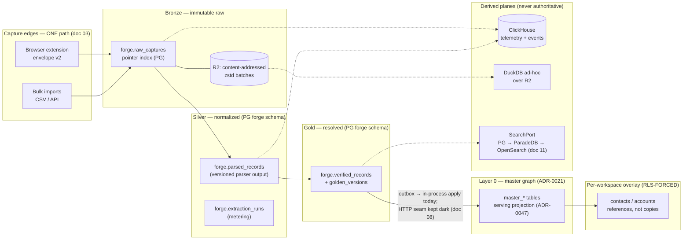

# 02 — The Enterprise Data Platform

> **Priority:** P0 · **Effort:** 12–18 eng-weeks · **Phase:** F1–F2
> (phases are defined in 17-phased-implementation-roadmap.md)

## Executive summary

This document defines the target platform shape for Forge — the shape everything else in this
audit suite hangs off — and resolves the three structural decisions that block every other
workstream. First finding: the platform that exists is ~5.2k LOC across five workspaces with one
parser, an in-process sync, and a pipeline that cannot currently run end to end, while the frozen
planning suite describes a separate repository, eight packages, six database roles, and 23 tables
— the plan and the build are two different objects, and neither has been ratified as the truth
(fact pack §0, §1). Second finding: the nested build duplicated fourteen platform concerns that
already exist in the main monorepo — blind index, content hash, ER, worker primitives, S3
clients, envelopes, approval systems, and more — and two of those duplications (blind index and
content hash) silently break cross-system identity (fact pack §6.6, §6.1). Third finding: the
platform paradigm question ("do we need a lakehouse / Kafka / a mesh?") has a firm answer —
no — with explicit, researched triggers for when that answer changes (fact pack §7). The
headline recommendations: ratify the nesting and formally amend the plan; converge the fourteen
dual stacks into shared packages, identity primitives first; adopt medallion **as vocabulary,
not ceremony** — bronze as immutable raw in object storage (R2), silver/gold in Postgres,
telemetry in ClickHouse, DuckDB for ad-hoc — with Postgres remaining the system of record; and
make a **metadata-driven source registry** the single highest-leverage platform investment,
because TruePoint's moat is number-of-sources × freshness. Storage economics are detailed in
09-storage-strategy.md; the cost program in 15-cost-optimization.md; the canonical build-defect
inventory is doc 01.

## Current state

### The build (what runs — or fails to — today)

- **Footprint.** Five workspaces, all under the `@leadwolf/*` scope (not the planned `@forge/*`):
  `apps/forge` (console, ~48 files, 1,619 LOC), `apps/forge-api` (13 files, 600 LOC),
  `apps/forge-worker` (11 files, 594 LOC), `packages/forge-core` (27 files, 2,414 LOC),
  `packages/forge-capture-sdk` (3 files, a **5-LOC stub**). Total ~5.2k LOC (fact pack §0).
- **History.** The entire platform landed 2026-07-07 in one commit wave (P0 scaffold → P2 core →
  P3 api → P4a worker primitives → P4b processors with **in-process sync**); exactly one fix
  since (2026-07-22, commit 94216174, console→BFF same-origin routing) (fact pack §0).
- **One parser.** `packages/forge-core` ships a single parser, `parsers/voyagerProfile.ts`
  (voyager profile 1-0-0: name/title/location/LinkedIn id) (fact pack §3.1). The registry tables
  `forge.parsers` / `forge.parser_versions` exist in the schema
  (packages/db/src/migrations/0070_forge_schema.sql:47-70) but are **never INSERTed** — the
  runtime registry is in-memory, while `parsed_records.parser_version_id` is a `uuid NOT NULL`
  FK (0070_forge_schema.sql:75); the worker passes the registry string
  "voyager-profile-1-0-0" (packages/forge-core/src/parsers/index.ts:18) into that uuid FK, so
  production parse upserts can only fail (fact pack §3.2).
- **In-process sync.** The planned HTTP `POST /api/v1/master-sync` path is mounted and dormant —
  it has no caller anywhere (apps/api/src/app.ts:159; fact pack §6.1). The live path applies
  outbox items in-process inside forge-worker under `withErTx` — but no producer ever enqueues
  the `forge-sync` or `forge-maintenance` jobs, so the outbox fills and never drains (fact pack
  §4.2).
- **Dead surface area.** Zero production callers exist for `er.ts`, `dsar.ts`, `capacity.ts`,
  `ga.ts`, `schemaVer.ts`, `ports.ts`, `computePriority`, `classifyAlerts`, `desiredWorkers`
  (fact pack §3.1). `capture_batches` is never written or read (0070_forge_schema.sql:32-45;
  fact pack §3.2). The capture SDK is a version-string constant with zero consumers (fact pack
  §4.3).
- **Config outside the wall.** `packages/config/src/forge.ts` reads bare `process.env`,
  bypassing the validated `appEnvSchema`; `FORGE_BLIND_INDEX_KEY` silently falls back to the
  committed dev default `"forge-dev-blind-index-key"` in production
  (packages/config/src/forge.ts:41; fact pack §4.4).
- **CI.** Turbo typecheck reaches Forge and 12 unit-test files run, but the itest glob finds
  zero Forge integration tests, the console is never built in CI, and migration 0070 plus its
  grants are never asserted under CI Postgres (fact pack §6.5). There are no forge turbo tasks
  and the services are absent from the dev docker-compose (fact pack §4.4).
- **Isolation posture.** The `forge` schema is owned by `leadwolf_forge` with cross-role grant
  isolation (leadwolf_forge has no USAGE on public; app/er/admin have none on forge), but every
  service connects with the same owner DSN and reaches roles via `SET LOCAL ROLE` — the wall is
  process discipline, not credential separation (fact pack §6.4).

### The plan (intent — not reality; cite docs/planning/forge/)

The frozen planning suite (drafted through 2026-07-06, self-declared "gate-green", claims 0%
built) specifies a **separate repository** `truepoint-forge` under `@forge/*` with 3 apps + 8
packages (decisions L1/L8); envelope-v2 ingest with gzip/chunk/size caps; six disjoint DB roles
with the invariant "no role reads raw PII AND writes production"; 23 tables in 11 groups with
monthly RANGE partitioning; an outbox → SKIP LOCKED relay → HTTP `POST /api/v1/master-sync`
sync with a dedicated `forge_sync` machine principal; and capture + sync dark behind
kill-switches until P9 legal sign-off (fact pack §1, §2.1, §2.2). None of that is a statement
about the repo as it exists — the build diverged on the repo decision (nested, `@leadwolf/*`),
the sync mechanism (in-process), the role model (one `leadwolf_forge` role), the table count
(15 landed in 0070), and partitioning (none).

### The fourteen dual stacks (summary of fact pack §6.6)

| # | Concern | Main-monorepo implementation | Forge implementation | Breaks identity? |
|---|---------|------------------------------|----------------------|------------------|
| 1 | Blind index | HMAC raw bytes, `BLIND_INDEX_KEY`, plus-tag strip | HMAC **hex**, `FORGE_BLIND_INDEX_KEY` ?? dev default, trim+lowercase | **Yes** — sync seam decodes hex as base64 into 48 junk bytes (fact pack §6.1) |
| 2 | Fellegi-Sunter ER | `packages/core/src/er/fellegiSunter.ts`, inert behind `ER_SHADOW_ENABLED` | `forge-core/er.ts`, zero production callers | No (both inert) |
| 3 | Dedup keys | `canonicalName@@registrableDomain`; Layer-0 deterministic keys | 4-char surname / email-domain / linkedin block keys | Divergence risk |
| 4 | Survivorship | revealed>completeness>age>id + fieldProvenance pins | authority>validated>completeness>recency | Divergence risk |
| 5 | Source registry | Connector registry | In-memory parser registry (+ empty DB tables) | No |
| 6 | Ingestion envelope | v1 `ingestion.ts` + main `/ingest` stub | v2 `forge.ts` + `/v1/captures` | Two capture edges |
| 7 | Capture rate limiter | Redis limiter (fails open) | Second Redis limiter + a third in-memory variant | No |
| 8 | S3 client | Hand-rolled SigV4 `s3FileStore` | `forgeObjectStore` on `Bun.S3Client` (packages/integrations/src/forgeObjectStore.ts:16) | No |
| 9 | Content hash | sorted-stringify sha256 **bytes** | **hex text** (+ a third, unsorted, in the extension) | **Yes** — dedup keys never comparable |
| 10 | Worker primitives | apps/workers register/retry/DLQ/leaderLock/outboxRelay | Same filenames re-implemented, all differing | No |
| 11 | match_links tables | public Layer-0 `match_links` | `forge.match_links` (drizzle barrel aliases) | Confusion risk |
| 12 | "Verification" | Paid channel verifiers | Human four-eyes promotion | Vocabulary collision |
| 13 | Maker-checker | Platform `approval_requests` (wired) | `forge.approval_requests` — never inserted (fact pack §3.2) | Four-eyes not enforced server-side |
| 14 | PII encryption | `encryptPii` AES-256-GCM (in use) | `email_enc`/`phone_enc` bytea columns with **no writer** | Gold PII posture is dead code |

## Problems identified

Build defects below re-state findings whose canonical inventory lives in doc 01; they are
numbered here for this document's platform-shape scope.

1. **P-02.1 — RISK: the plan and the build diverge on every structural axis, and neither is
   ratified.** Separate-repo vs nested, `@forge/*` vs `@leadwolf/*`, HTTP vs in-process sync,
   six roles vs one, 23 vs 17 tables (fact pack §1). At enterprise scale this means every new
   engineer, ADR, and audit answer is ambiguous; ADR-0046/0047 are only Proposed yet cited as
   "Locking" (fact pack §2.2 L10, §2.4).
2. **P-02.2 — DEBT (identity-breaking): fourteen dual stacks, two of which corrupt identity.**
   The blind-index and content-hash duplications are not style debt: the sync seam decodes
   forge hex as base64, producing values that can never match `master_emails.email_blind_index`
   — Forge-synced identities can never dedup against main-app identities, silently (fact pack
   §6.1, §6.6 #1/#9).
3. **P-02.3 — BUG: the parser registry is in-memory while the schema demands a uuid FK**, so
   parse upserts can only fail against the empty `forge.parser_versions`
   (0070_forge_schema.sql:75; packages/forge-core/src/parsers/index.ts:18; fact pack §3.2). The
   platform's silver layer is unreachable in production.
4. **P-02.4 — GAP: no metadata-driven source registry.** Onboarding a source today means code
   in the parser registry, the connector registry, the endpoint allowlist
   (packages/config/src/forge.ts:18-21), and the worker — for a vendor whose moat is
   number-of-sources × freshness, source onboarding must be config, not code (fact pack §7.7).
5. **P-02.5 — GAP: CI never exercises the Forge data path.** Zero forge itests; migration 0070
   and its grants never asserted; console never built in CI (fact pack §6.5). The FK break in
   P-02.3 is exactly the class of defect an itest catches.
6. **P-02.6 — DEBT: isolation is process discipline, not credential separation.** All services
   share the owner DSN and `SET LOCAL ROLE`; forge processes hold owner-level credentials at
   all times (fact pack §6.4). The planning suite's six-role model was the control for this.
7. **P-02.7 — DEBT: config bypasses the validated env schema.** Bare `process.env` reads, a
   committed dev blind-index key as production fallback, zero forge keys in `.env.example`,
   and no deploy preflight for `FORGE_BLIND_INDEX_KEY`
   (packages/config/src/forge.ts:41; fact pack §4.4).
8. **P-02.8 — GAP: two capture edges, neither real.** The extension posts to the main
   `/api/v1/ingest` stub which stores nothing; Forge's envelope-v2 edge has no producer; either
   way captured observations are silently lost end to end (fact pack §6.3). One path must be
   chosen and wired (S.1 F1; OQ-5) — owned in detail by doc 03 (ingestion & capture).

## Research findings

- **Medallion is vocabulary, not infrastructure.** Bronze = immutable raw in object storage
  with light contracts (source, version, captured_at, payload hash); Silver = normalized/
  deduped; Gold = resolved published profiles with lineage. The anti-pattern is reflexive
  three-layers-for-everything and copy-everything bronze without contracts (fact pack §7.7).
  Databricks' canonical description: "What is a medallion architecture?"
  (https://www.databricks.com/glossary/medallion-architecture).
- **Postgres remains the correct system of record well past 500M records.** OpenAI operates a
  single Postgres primary with ~50 read replicas serving 800M users at millions of QPS —
  discipline is offloading reads and keeping the primary lean ("Scaling PostgreSQL at OpenAI,"
  PGConf.dev 2025 talk, Bohan Zhang; summarized in fact pack §7.3; conference:
  https://pgconf.dev). Single-node envelope: billions of rows / single-digit TB routine; 32 TB
  per-table limit (PostgreSQL limits: https://www.postgresql.org/docs/current/limits.html).
- **Lakehouse now is premature.** Iceberg v3 ratified 2025 but has no mature TypeScript write
  path (JVM/Python-first) and real table-maintenance burden
  (https://iceberg.apache.org/spec/); DuckLake v1.0 (Apr 2026) keeps all metadata in Postgres
  with Parquet on object storage and no JVM/catalog service (https://ducklake.select/). The
  research ladder: Parquet-on-object-storage + DuckDB now (no table format) → DuckLake when raw
  exceeds 1–5 TB with multi-writer reprocessing → Iceberg + Lakekeeper/Polaris only when
  external engines must read (50–100 TB+) (fact pack §7.2).
- **Kafka now is premature.** BullMQ's envelope (~15K adds/s/queue; ~50K jobs/min on one
  Redis) is an order of magnitude above the need (10M jobs/day ≈ 115/s average); brokers are
  deferred until sustained 5–10K+ msg/s or multi-team streams (Redpanda/NATS JetStream first,
  Kafka only with a platform team) (fact pack §7.6; BullMQ: https://docs.bullmq.io/).
- **CDC fan-out has a trigger, not a default.** When ≥2 independent consumers exist, tail the
  WAL/outbox with Sequin (https://github.com/sequinstream/sequin) or pgstream
  (https://github.com/xataio/pgstream); until then, transactional outbox with a BullMQ consumer
  is correct (fact pack §7.6).
- **Data mesh: reject.** A mesh needs 3+ producing domains; one product team is zero domains
  (fact pack §7.7).
- **Metadata-driven pipelines are the highest-ROI platform pattern here.** A sources control
  table (endpoint, auth ref, rate limits, field mappings, normalize version) driving generic
  workers lets new sources onboard via config, with ~35% lower schema-evolution cost reported
  (ScienceDirect, MIND 2025 — URL not carried into the fact pack; figure per fact pack §7.7,
  link unverified). The research verdict: "single highest-leverage internal-platform investment
  for a company whose moat is number-of-sources × freshness" (fact pack §7.7).
- **ClickHouse is the one second database worth adding.** Single-node ClickHouse for telemetry
  and event analytics at $200–400/mo, 10–20× compression, with PG→CH CDC solved by PeerDB
  (acquired by ClickHouse July 2024, remains free OSS:
  https://clickhouse.com/blog/clickhouse-acquires-peerdb-to-boost-real-time-analytics-with-postgres-cdc-integration)
  (fact pack §7.4). Details in 09-storage-strategy.md.
- **Boundary enforcement in monorepos.** dependency-cruiser validates and visualizes
  dependency rules in CI (https://github.com/sverweij/dependency-cruiser).

## Enterprise best practices

What a ZoomInfo/Apollo-class vendor's data platform actually does (fact pack §2.5, §8.5):

- **Industrial acquisition.** ZoomInfo runs four ingestion classes, ~28M domains/day, and 300+
  researchers; Apollo reports ~91% email accuracy off a 2M+ contributor network. Single-source
  email accuracy is ~82% vs 90%+ multi-source — corroboration across sources is the product.
- **Replayable raw.** Capture once, replay forever: immutable, content-addressed raw batches
  make every parser fix and model upgrade a free reprocessing pass rather than a re-acquisition
  campaign (fact pack §7.5, §7.6 "the 20% of event sourcing that pays").
- **Versioned, deterministic transforms.** Parsers are pure/version-bound with golden-fixture
  gates; drift routes to quarantine, not to silent nulls (planning intent, fact pack §2.1).
- **One identity spine.** One blind-index scheme, one content-hash convention, one ER engine,
  one survivorship policy — because identity primitives that differ by encoding are
  indistinguishable from data loss (fact pack §6.1).
- **Effectively-once pipelines.** At-least-once delivery + idempotent apply at every stage,
  with per-record state in the database, not in the queue (fact pack §10.4, §10.6).
- **Compliance as a platform feature.** Provenance and lawful basis per field, suppression at
  ingest and egress, an Art-14 notice program — the existential layer (fact pack §9.5; owned
  by doc 14, compliance).

## Recommended architecture

### The paradigm decision (S.2 #4 — argue for, never contradict)

**Medallion as vocabulary, not ceremony.** Bronze = immutable raw in R2 (hash-keyed,
replayable); Silver/Gold = Postgres (`forge` schema; RLS-governed overlays downstream);
telemetry = ClickHouse; DuckDB for ad-hoc analysis over the R2 archive. Postgres remains the
system of record. Explicitly rejected now, each with its researched re-open trigger:

| Rejected now | Why | Re-open trigger (fact pack §7) |
|---|---|---|
| Iceberg/lakehouse | No mature TS write path; maintenance is "a full-time job" (§7.2) | External engines must read the lake; 50–100 TB+ |
| DuckLake | Young; not needed under 1–5 TB raw (§7.2) | Raw archive >1–5 TB + multi-writer reprocessing |
| Kafka / any broker | BullMQ ceiling ~10× above need (§7.6) | Sustained 5–10K+ msg/s or multi-team streams |
| CDC fan-out infra | One consumer today (§7.6) | ≥2 independent consumers → Sequin/pgstream |
| Data mesh | Needs 3+ producing domains; we have one team (§7.7) | Organization grows real producing domains |
| Event-sourcing the app | Complexity without payoff (§7.6) | Never for the app; keep capture storage event-shaped |

### Target component shape



### Relation to ADR-0021 and ADR-0047

Forge is the acquisition-and-refinement platform that **feeds** the ADR-0021 two-layer model:
its gold layer promotes into the global master graph (Layer 0), and per-workspace overlays
reference master rows — references, not copies (template FIXED decision 2). ADR-0047 is the
one-way door: Forge owns ER; `master_*` becomes a downstream serving projection; the main
app's `er/` + `erSweep` stay inert and are eventually deleted (S.2 #5; fact pack §2.2 L4).
Two platform-level consequences:

1. **Ratify the door before walking through it.** ADR-0046/0047 are Proposed, not Accepted,
   yet cited as "Locking" (fact pack §2.2 L10). F1 must ratify ADR-0047 (and amend L1) or the
   one-way door is being exercised without a decision record.
2. **Keep the split seam warm.** In-process sync stays for now (S.2 #3) — outbox →
   in-process apply is fine at this scale — but the dormant HTTP `/master-sync` path
   (apps/api/src/app.ts:159) is the future service-split seam: it must be either
   integration-tested or feature-flagged off, never left as an untested privileged ingress
   (fact pack §6.1). The blind-index seam break (fact pack §6.1) must be fixed in F1 before
   any real sync traffic; the sync contract audit is doc 08.

### The metadata-driven source registry (highest-leverage investment)

Persist the existing registry tables and add a sources control table that drives generic
workers. New sources onboard via configuration rows plus (only when the payload is novel) a
versioned parser.

```sql
-- Hand-authored migration (drizzle-kit generate is forbidden — fact pack §2.3).
CREATE TABLE IF NOT EXISTS forge.sources (
  id                   uuid PRIMARY KEY DEFAULT gen_random_uuid(),
  source               text NOT NULL,            -- 'linkedin', 'import_csv', ...
  endpoint             text NOT NULL,            -- allowlisted endpoint pattern
  schema_version_range text NOT NULL DEFAULT '*',
  auth_ref             text,                     -- KMS/secret reference, never a secret
  rate_limit_per_min   integer NOT NULL DEFAULT 2000,
  byte_limit_per_min   bigint  NOT NULL DEFAULT 67108864,
  field_mappings       jsonb   NOT NULL DEFAULT '{}'::jsonb,  -- JSONPath → canonical field
  normalize_version    text    NOT NULL DEFAULT '1',
  parser_id            uuid REFERENCES forge.parsers (id),
  lawful_basis_ref     text,                     -- per-source LIA reference (doc 14)
  capture_enabled      boolean NOT NULL DEFAULT false,        -- per-source kill-switch
  created_at           timestamptz NOT NULL DEFAULT now(),
  UNIQUE (source, endpoint)
);
```

```ts
// packages/forge-core/src/registry/sourceRegistry.ts — replaces the in-memory maps.
export interface SourceDefinition {
  source: string;
  endpoint: string;
  authRef?: string;
  rateLimitPerMin: number;
  byteLimitPerMin: number;
  fieldMappings: Record<string, string>; // JSONPath → canonical field
  normalizeVersion: string;
  parserVersionId: string; // uuid — resolved from forge.parser_versions, never a name string
  lawfulBasisRef?: string;
  captureEnabled: boolean;
}
```

This one structure subsumes: the endpoint allowlist (packages/config/src/forge.ts:18-21), the
in-memory parser registry (fact pack §3.1), per-source rate limits (fact pack §4.1), the
per-source lawful-basis gate the compliance program needs (fact pack §9.5), and the deterministic
field-mapping layer the AI cascade needs before any model call (S.2 #6). It also resolves
P-02.3: parser selection returns a real `parser_versions.id` uuid.

### Repository architecture: ratify the nesting, kill the duplication

**Ratify (S.2 #1).** Keep Forge nested in the monorepo; the L1 separate-repo decision is dead
in practice. Formally amend the planning suite, and enforce boundaries three ways: (a)
dependency-cruiser rules in CI (forge-core imports nothing tenant-scoped; main apps import no
forge internals except the sync feature), (b) the isolated `forge` schema owned by
`leadwolf_forge` (already real — fact pack §6.4), (c) later, separate DB credentials per
service instead of `SET LOCAL ROLE` on the owner DSN (closes P-02.6).

**Converge (S.2 #2).** The fourteen dual stacks converge into shared packages — blind index
and content hash FIRST, because they break identity:

| Stack (§6.6) | Converges into | Phase |
|---|---|---|
| 1. Blind index | `@leadwolf/core` — one keyed-HMAC util, one key, one normalization, **bytea** storage; migrate forge hex → main bytea (S.1 F1) | F1 |
| 9. Content hash | `@leadwolf/core` — canonical-JSON (sorted) sha256, one encoding; extension adopts it too | F1 |
| 13. Maker-checker | Platform `approval_requests`; forge inserts real rows, maker derived from pipeline state, not the request body (S.1 F1) | F1 |
| 6. Envelopes + capture edges | `@leadwolf/types` single envelope (v2); one capture endpoint (forge-api); retire main `/ingest` stub (OQ-5) | F1 |
| 5. Source registries | `forge.sources` metadata registry (above); connector registry maps onto it | F1–F2 |
| 10. Worker primitives | New `packages/queue` (retry/DLQ-persisted/leaderLock/deadline/outboxRelay); both apps/workers and apps/forge-worker consume | F2 |
| 7. Rate limiters | `@leadwolf/core` one atomic (Lua) Redis limiter, fail-closed with bounded local fallback | F2 |
| 8. S3 clients | `@leadwolf/integrations` one adapter — standardize on `Bun.S3Client` (packages/integrations/src/forgeObjectStore.ts:16), retire the hand-rolled SigV4 client | F2 |
| 2. ER engines | ONE engine in `forge-core` per S.2 #5; main `er/` deleted after shadow parity (see 05-entity-resolution.md) | F2 |
| 3. Dedup keys | Layer-0 deterministic hierarchy (FIXED decision 6) is THE identity key set; forge block keys documented as ER-internal candidate generation only | F2 |
| 4. Survivorship | One field-level policy in forge-core feeding `golden_versions`; overlay fieldProvenance pins stay overlay-side | F2 |
| 14. PII encryption | Main `encryptPii` AES-256-GCM everywhere; forge `email_enc`/`phone_enc` get a writer in F2 provenance work or are dropped (see 09-storage-strategy.md P-09.1) | F2 |
| 11. match_links ×2 | Keep both tables, clarify ownership: `forge.match_*` = ER working set; public `match_links` = serving projection written only via sync; kill barrel aliases | F2 |
| 12. "Verification" vocabulary | Rename forge flow "review/promotion"; reserve "verification" for channel verifiers; split types | F2 |

### Build system / CI target (fixes for §6.5)

- Forge itests in CI against real Postgres: schema apply (0070), grant/cross-role isolation,
  promotion atomicity, outbox drain, sync apply, FK integrity (would have caught P-02.3)
  (S.1 F1).
- Console build in CI; forge turbo tasks; forge services in dev docker-compose.
- `forge.ts` config folded into the validated `appEnvSchema` with hard-fail on missing
  `FORGE_BLIND_INDEX_KEY` (S.1 F1); deploy.sh preflights it alongside `BLIND_INDEX_KEY`.
- dependency-cruiser boundary job (rules above).
- Golden-fixture gate for parsers (fixtures exist as a concept — `golden_fixture_ref`,
  0070_forge_schema.sql:63 — but no fixture files exist; fact pack §3.4).

## Implementation details

Dependency-ordered steps (exact paths):

1. **Ratification ADR (week 1).** New ADR amending L1 (nested, `@leadwolf/*` ratified),
   accepting ADR-0047, and recording the medallion-as-vocabulary paradigm + rejection
   triggers. Update `docs/planning/forge/` decision ledger; regenerate
   `docs/ARCHITECTURE_MAP.md`.
2. **Config into the wall.** Fold `packages/config/src/forge.ts` into `appEnvSchema`;
   hard-fail on `FORGE_BLIND_INDEX_KEY` absent in production; document all FORGE_* keys in
   `.env.example`; preflight in `deploy.sh` (fact pack §4.4).
3. **Identity primitives (blocks everything).** Single `blindIndex()` and `contentHash()` in
   `packages/core/src/crypto/`; forge-core re-exports; migration converts
   `forge.parsed_records.email_blind_index` (and outbox payloads) hex → bytea under the main
   key; sync-seam decode bug retired with it (fact pack §6.1).
4. **Persist the registry.** Seed migration INSERTs `forge.parsers` + `forge.parser_versions`
   for voyager-profile-1-0-0; `parseStage.ts` resolves uuid ids; add `forge.sources` (DDL
   above) and route allowlist/rate-limit/field-mapping reads through it.
5. **CI.** Add forge itest glob + CI Postgres migration/grant assertions + console build +
   turbo tasks + dependency-cruiser job.
6. **Worker kit.** Extract `packages/queue` from apps/workers primitives; port forge-worker
   onto it (removeOnComplete/Fail defaults, persisted DLQ — jointly with doc 01 F1 items).
7. **Adapter convergence.** One S3 client, one rate limiter in `packages/integrations` /
   `packages/core`; delete forge-local variants.
8. **Capture-path decision.** Wire ONE path: extension envelope v2 → forge-api; real
   capture-sdk; retire main `/ingest` stub (S.1 F1; doc 03 owns the edge design).

**UI/UX changes:** N/A — no UI surface in this area (console work is doc 12's; the only 02
console impact is that registry-driven parsers make the /parsers page read real rows).

## Migration strategy

- **Ratify first, move second.** The ADR lands before any convergence PR so every move cites a
  decision, not a preference.
- **Identity migration is dual-read.** During hex→bytea blind-index conversion, readers accept
  both encodings behind a flag; writers emit only the converged form; a backfill migration
  rewrites existing silver rows; the flag is removed after a full reconciliation sweep shows
  zero hex remnants. Same pattern for content hashes (store both hash columns for one release).
- **Registry cutover.** In-memory registry and DB registry run dual for one release with a
  comparison log; parse writes flip to uuid ids behind `FORGE_REGISTRY_DB` flag; in-memory maps
  deleted after a green week. This is safe today precisely because production parse upserts
  already fail (P-02.3) — there is no working behavior to preserve, only a broken one to
  replace.
- **Worker-kit port is queue-by-queue.** forge-parse first (highest traffic), then ai-extract,
  verify, resolve; each queue drains before its worker restarts on the shared kit.
- **Capture + sync stay dark** (flags off) except staging/synthetic tenants throughout (S.1
  F1); nothing in this document changes the kill-switch posture.
- **Rollback.** Every convergence step is a package-boundary change with the old
  implementation retained one release behind a flag; DB migrations are additive (new columns/
  tables) until the final drop migrations, which run only after two green reconciliation
  sweeps.

## Risks

| Risk | Likelihood | Impact | Mitigation |
|---|---|---|---|
| Convergence churn destabilizes the main app (shared packages touched) | Medium | High | Package-boundary PRs with dual-run flags; dependency-cruiser prevents new back-edges; itests on both consumers |
| Blind-index migration mis-keys existing silver rows | Medium | High | Silver blind indexes are currently always NULL (fact pack §3.2) — migrate before backfill populates them; reconciliation sweep compares counts |
| Ratification stalls (ADR debate) while F1 code work waits | Medium | Medium | Time-box the ADR to week 1; S.2 #1 is a lead-fixed decision — the ADR records it, not re-opens it |
| Registry-driven workers regress parser selection | Low | Medium | Dual-run comparison log; golden-fixture gate before cutover |
| One-role isolation persists (P-02.6) after nesting is ratified | Medium | Medium | Track per-service credentials as an explicit F2/F3 item with a CI grant-test asserting role reachability |
| Team treats "medallion" as license to build three copies of everything | Low | Medium | The paradigm section's anti-pattern language goes into the ADR verbatim (§7.7) |

## Success metrics

- Dual-stack count 14 → 0, tracked in doc 01's inventory; zero new duplicated concerns
  (dependency-cruiser rule violations = 0 in CI).
- Parse path green in CI: itest lands an envelope → silver row exists with a real
  `parser_versions.id` (P-02.3 closed).
- Blind-index equality: a forge-synced identity and a main-imported identity with the same
  email produce byte-identical blind indexes (seam test green; fact pack §6.1 retired).
- New-source onboarding ≤ 2 days and zero code changes for a payload an existing parser
  family covers (registry rows only).
- 100% of FORGE_* env keys validated at boot; production boot hard-fails without
  `FORGE_BLIND_INDEX_KEY`.
- Ratification ADR merged; ADR-0047 status Accepted; ARCHITECTURE_MAP regenerated.

## Effort & priority

P0 because everything downstream of this document is ambiguous until the plan-vs-build split
is ratified, and unsafe until the identity primitives converge — a multi-tenant data platform
whose two halves compute different blind indexes for the same email is corrupting identity
today at the seam (fact pack §6.1). 12–18 eng-weeks for a 2–3-engineer pod: ~1 week
ratification, 2–3 weeks identity primitives + migration, 3–4 weeks registry persistence +
metadata registry, 2–3 weeks worker-kit extraction, 2–3 weeks adapter/envelope convergence,
1–2 weeks CI, with doc 01's F1 correctness items proceeding in parallel. Phased F1–F2: identity,
registry, config, CI are F1; worker kit, adapters, ER/survivorship convergence are F2.

## Future enhancements

- **DuckLake catalog over the R2 archive** when raw exceeds 1–5 TB (F4; 09-storage-strategy.md).
- **Service-split along the kept-warm HTTP sync seam** if Forge needs independent scaling or a
  separate compliance boundary — the seam is preserved exactly for this (S.2 #3; doc 08).
- **Per-service DB credentials** replacing `SET LOCAL ROLE` on the owner DSN (P-02.6), then the
  planning suite's role taxonomy where it still earns its keep.
- **Contributory-network substrate (doc 20 E7)** — the planning suite calls it "the industry's
  true primary moat"; it lands on top of this platform shape, not instead of it.
- **Parser auto-generation (E9)** seeded by the metadata registry's field mappings.
- **Event-bus fan-out (E2)** at the Sequin/pgstream trigger (≥2 independent consumers).
