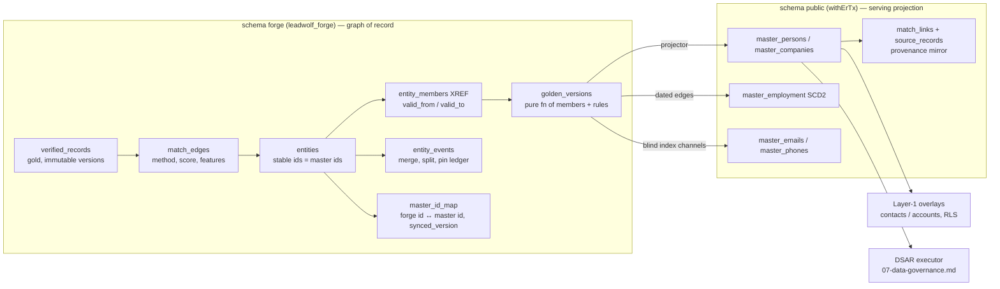

# 06 — Identity Graph

> **Priority:** P1 · **Effort:** 10–14 eng-weeks · **Phase:** F2
> (phases are defined in 17-phased-implementation-roadmap.md; this document's two hard
> prerequisites — the blind-index unification P-01.6 and the sync payload/`master_id_map`
> completion P-01.20 — are **P0 items scheduled in F1**)

This document covers how canonical person and company identities are **stored, versioned,
merged, and traversed**. It pairs tightly with `05-entity-resolution.md`: doc 05 is the
algorithm that decides *whether* two records are the same identity; this document is the
graph that *remembers* those decisions, keeps them reversible, and serves them to the rest
of the platform (the Layer-1 overlays, DSAR in `07-data-governance.md`, search in
`10-search-indexing.md`).

## Executive summary

TruePoint already has the skeleton of an identity graph: the ADR-0021 Layer-0 master graph —
seven system-owned, deliberately not-RLS public tables (`master_persons`, `master_companies`,
`master_employment`, `master_emails`, `master_phones`, `source_records`, `match_links`) in
which `cluster_id` **is** the golden entity id and `source_records` is an immutable evidence
log (`packages/db/src/schema/masterGraph.ts:1-16,312-317`). The shape is unusually good for a
system this young: it matches, almost table-for-table, the pattern the entity-resolution
literature and vendor engineering accounts converge on. What is missing is everything that
makes a graph *maintainable*: Forge, the platform designated by ADR-0047 as the owner of
entity resolution, feeds this graph through a seam that is cryptographically broken (P-01.6 —
Forge-synced identities can never match main-app identities), drops its own resolver keys and
its phone identities on the floor, never writes the `master_id_map` crosswalk (P-01.20), has
no supersede/version semantics beyond a TypeScript type, and preserves no match evidence — so
no merge is explainable, no merge is reversible, and no golden record is recomputable.
Employment is modeled as a well-designed SCD2 dated edge (`masterGraph.ts:149-219`) that the
Forge path only ever writes as a bare undated stint, and company hierarchy is a single
`parent_company_id` self-FK with no writer anywhere in the repository.

The headline recommendation, aligned with the program's fixed decision S.2 #5: build the
**evidence-preserving identity graph in Postgres** — `entities`, `entity_members` (XREF),
`match_edges`, `entity_events`, `golden_versions` — inside the `forge` schema, replacing
Forge's three dead ER tables; make the golden record a **pure, versioned function** of
(members, rules) so unmerge is "tombstone the discredited edge and recompute"; keep
`cluster_id`-is-the-golden-id by seeding entity ids from existing `master_*` ids; and treat
`master_*` as the **serving projection** the one-way door already commits to. No graph
database is warranted: Postgres is the standard substrate at this scale (RudderStack ships
identity resolution as SQL; Apollo runs union-find in Spark, not a graph DB), and the only
zero-new-infra graph option (Apache AGE) should be adopted **only** if multi-hop product
features (org-chart traversal, "colleagues-of" queries) become a roadmap item. The
prerequisite for all of it is F1's blind-index unification (S.2 #2) — until one HMAC key, one
encoding, and one normalization span Forge and the main app, the graph cannot receive
identities from its own primary feed.

## Current state

### The master graph as built (Layer 0, ADR-0021)

The golden identity store is seven system-owned public tables, defined in
`packages/db/src/schema/masterGraph.ts` and explicitly **not** tenant-scoped: no
`tenant_id`/`workspace_id`/owner columns, no RLS — isolation is structural, by access path
(`masterGraph.ts:6-9`; no grant to `leadwolf_app`, per the fact base corroborated in
`01-current-architecture-audit.md`). Concretely:

- **`master_persons`** — golden person node; `linkedin_public_id` is the strongest key
  (partial UNIQUE, `masterGraph.ts:133-135`); `current_company_id` is a denormalized cache of
  the primary employment edge (`masterGraph.ts:113-114`); `is_suppressed` mirrors global
  suppression state and gates reveal (`masterGraph.ts:123`).
- **`master_companies`** — golden company node; `primary_domain` (PSL registrable domain) is
  the strongest key (partial UNIQUE, `masterGraph.ts:86-88`); a subsidiary→parent hierarchy
  exists as a single self-FK `parent_company_id` (`masterGraph.ts:63`) — with **no writer
  anywhere in the repository** (the only non-schema references are the migration
  `packages/db/src/migrations/0017_silly_marauders.sql:8,142` and its snapshots).
- **`master_employment`** — the person↔company affiliation **edge**, SCD2 grain (one row per
  stint), with a `'-infinity'` sentinel for unknown starts so unknown-start duplicates
  collide into one edge (`masterGraph.ts:173,205-209`), a DB-enforced at-most-one-primary
  partial unique (`masterGraph.ts:211-213`), and a thin derived provenance cache
  (`asserting_source`, `match_method`, `confidence`, `source_count`, `observed_at`) whose
  declared source of truth is `source_records` + `match_links` (`masterGraph.ts:175-183`).
- **`master_emails` / `master_phones`** — channel tables holding PII as AES-GCM bytea
  ciphertext plus an HMAC blind index that is **globally unique** and is "the dedup +
  DSAR/suppression lookup key" (`masterGraph.ts:237,247,268,276`).
- **`source_records`** — the immutable, append-only per-source evidence log; `content_hash`
  globally unique for idempotent ingest; `resolved_person_id`/`resolved_company_id` set by
  the ER pipeline (`masterGraph.ts:288-310`).
- **`match_links`** — the ER output XREF: which `source_records` form which golden entity.
  `cluster_id` **is** the golden entity id (there is no separate clusters table at MVP,
  `masterGraph.ts:313-317`); `review_status ∈ auto|pending|confirmed|rejected`
  (`masterGraph.ts:341-344`); `is_duplicate_of` is the survivor link for cluster merges,
  reserved but never written (`masterGraph.ts:328`).

### How Forge feeds it — and where the feed breaks

The live path is the in-process sync stage: the forge-worker drains `forge.sync_outbox` and
calls `forgeSyncRepository.applyItem` per item under `withErTx`
(`packages/db/src/repositories/forgeSyncRepository.ts:39-103`). `applyItem` is the right
*shape* — event-id dedup via `processed_sync_events` (`forgeSyncRepository.ts:43-49`),
suppression fan-out (`:52-59`), LINK/MINT via the same co-op-safe
`masterGraphRepository.resolveForImport` the import path uses (`:66-72`;
`packages/db/src/repositories/masterGraphRepository.ts:100-163`), then provenance rows:
`source_records` with `source_name='forge'` and a `match_links` row with
`match_method='forge', review_status='confirmed'` (`forgeSyncRepository.ts:75-96`). But five
defects sever or degrade the feed:

1. **The blind-index seam is broken on three axes** (P-01.6): Forge computes HMAC-SHA256
   **hex** under `FORGE_BLIND_INDEX_KEY` with trim+lowercase normalization; the main app
   computes HMAC **raw bytes** under `BLIND_INDEX_KEY` with plus-tag stripping; and
   `applyItem` decodes Forge's hex string **as base64** into the bytea column
   (`forgeSyncRepository.ts:63-65`) — producing junk bytes that can never match
   `master_emails.email_blind_index`. Every Forge-synced identity that arrives email-keyed
   mints a duplicate golden person instead of linking. Silently.
2. **The outbox payload omits the resolver keys.** The `SyncApplyItem` payload accepts
   `linkedinPublicId`/`registrableDomain`/`companyName` (`forgeSyncRepository.ts:24-31`), but
   the promotion path writes only `{contentHash, entityKind, emailBlindIndex,
   phoneBlindIndex}` into the outbox (fact base §3.2, acknowledged TODO). Company events
   therefore carry **no key at all**; `resolveForImport` returns nulls and `applyItem` still
   reports `"applied"` with no master row and no `match_links` row (`:86-96` both branches
   skipped).
3. **Phone identities are dropped at the seam.** Forge carries `phoneBlindIndex` end-to-end
   through silver, gold, and the outbox
   (`packages/db/src/repositories/forge/promotionRepository.ts:48,87`), but
   `SyncApplyItem.payload` has no phone field (`forgeSyncRepository.ts:24-31`) and
   `resolveForImport` explicitly defers phone resolution
   (`masterGraphRepository.ts:27,38`) — `master_phones` is unreachable from Forge.
4. **`verified.superseded` has no semantics.** The event type exists in the union
   (`forgeSyncRepository.ts:21`), but the only special-cased type is `verified.suppressed`
   (`:52`); a superseded event falls through to the same LINK/MINT branch as an upsert, and
   `item.version` is never consulted — the version-monotonic supersede guard exists **only in
   types** (P-01.20).
5. **`forge.master_id_map` is never written.** The table and its writer exist
   (`packages/db/src/schema/forge.ts:246-262`; the `upsertMasterIdMap` writer at
   `packages/db/src/repositories/forge/syncRepository.ts`), but no call
   site invokes the upsert — there is no Forge↔master crosswalk, so reconciliation,
   supersede routing, and DSAR traversal from a Forge record to its golden identity are all
   impossible (P-01.20).

Additionally, the evidence quality of what does land is poor: `source_records.raw_data` is
hardcoded `'{}'` for Forge-sourced rows (`forgeSyncRepository.ts:78`) — defensible under the
compliance firewall (raw never leaves Forge), but the `match_keys` JSONB is then the only
evidence, and the `match_links` row records no score, no features, and no reference to what
matched what. Suppression fan-out flips `is_suppressed` **only** by `linkedin_public_id`
(`forgeSyncRepository.ts:53-57`); an email-only identity can never be suppressed through this
path.

### Forge's own graph tables are dead schema

Forge's schema ships its own ER/graph table family — `forge.match_candidates`,
`forge.match_links`, `forge.merge_log` (`packages/db/src/schema/forge.ts:317-362`;
`0070_forge_schema.sql:233-261`) — with zero readers and zero writers (fact base §3.2;
`packages/forge-core/src/er.ts` has zero production callers). This is the second
`match_links` family in one Drizzle barrel (P-01.31 item 11). `forge.merge_log` even carries
a `reverses_merge_id` reversibility column (`schema/forge.ts:360`) — the right idea, dead on
arrival.

### Employment and hierarchy today

The only employment writer on the Forge path is `resolveForImport`'s bare mint edge:
`INSERT INTO master_employment (master_person_id, master_company_id, is_current, is_primary)`
with no title, no dates, no asserting source (`masterGraphRepository.ts:154-159`). The SCD2
machinery — stint dedup, primary-edge uniqueness, the provenance cache — is built and
DB-enforced (`masterGraph.ts:205-217`) but receives no dated facts. Company hierarchy has no
seeding path: `parent_company_id` is never set, there is no `ultimate_parent_id`, and there
is no shared-domain override mechanism for company hierarchy (the schema's only domain guard,
`masterGraph.ts:50-52`, is a *free-mail* check that stops `gmail.com` minting a company — it does
not address subsidiaries, franchises, or holding-company domain families).

### Intent (planning suite, labeled as intent)

The frozen planning corpus (`docs/planning/forge/`) specifies: gold `verified_records` as
five tables mirroring `master_*` column-for-column, the only layer that syncs (L2); Forge
owning ER with the main app's `er/` + `erSweep` going inert and `master_*` becoming a
downstream serving projection (L4/ADR-0047 — the "one-way door", OQ-3); a sync layer of
`sync_state` + `master_id_map` with `pending/synced/failed/superseded` states; and reversible
unmerge via compensating `merge_log` rows. As built, gold is a single `verified_records`
table, sync state never leaves `pending`, and none of the reversibility machinery runs
(fact base §2.1, §3.2). ADR-0047 is cited as "Locking" but remains formally Proposed
(P-01.30).

## Problems identified

Ordered by severity. BUG = wrong today · GAP = missing capability · DEBT = works but won't
scale/maintain · RISK = exposure.

- **P-06.1 — BUG · The graph's primary feed cannot deliver matching identities.** The
  blind-index seam is broken on key, encoding, and normalization, and `applyItem` decodes hex
  as base64 (`forgeSyncRepository.ts:63-65`). Every email-keyed Forge identity mints a
  duplicate golden person; the "globally unique dedup + DSAR key" (`masterGraph.ts:237`) is
  junk for Forge-sourced rows. At enterprise scale this is a duplicate-manufacturing machine
  feeding the exact failure Apollo attributes ~90% of its duplicate accounts to — ingestion
  without a working resolution gate. *This is P-01.6; it is re-stated here because it is this
  document's existential dependency.*

- **P-06.2 — BUG · Identity evidence is dropped at the sync seam.** Company events carry no
  resolver key (outbox payload lacks `registrableDomain`/`companyName`/`linkedinPublicId`,
  fact base §6.1) so `applyItem` reports `"applied"` while writing no master row; phone blind
  indexes are carried to the outbox and then silently discarded because
  `SyncApplyItem.payload` has no phone field (`forgeSyncRepository.ts:24-31` vs
  `promotionRepository.ts:48,87`). Companies and phone identities never enter the graph, and
  the pipeline reports success.

- **P-06.3 — GAP · No Forge↔master crosswalk.** `forge.master_id_map` is never written
  (P-01.20; `schema/forge.ts:246-262`). Without it there is no reconciliation sweep, no way
  to route a supersede to the right golden entity, and no way for DSAR (doc 07) to walk from
  a Forge gold record to the master identity it fed.

- **P-06.4 — GAP · Merges are unexplainable: no evidence is preserved.** The only per-match
  artifact is a `match_links` row with `match_method='forge'` and no score, no feature
  vector, no pair reference (`forgeSyncRepository.ts:86-96`). There is no `match_edges`
  equivalent anywhere live; `forge.match_candidates` (which has `match_weight` and
  `disposition` columns, `schema/forge.ts:317-331`) is dead. GDPR explainability, review
  tooling, and threshold recalibration (doc 05) all require the scored pair to be stored.

- **P-06.5 — GAP · No merge/split/unmerge machinery.** `is_duplicate_of` is never written
  (`masterGraph.ts:328`), `forge.merge_log` is dead, there is no entity-events ledger, and no
  code path can undo a wrong link. The planning suite's own invariant — merges audited and
  reversible (FIXED decision #6 in the template) — has no implementation. Once real volume
  lands, a bad auto-merge becomes permanent data corruption of the product's core asset.

- **P-06.6 — GAP · The golden record is not a versioned function of its inputs.** There is no
  `golden_versions` table; `field_provenance`/`prov_hwm` are schema seams with no projector
  (`masterGraph.ts:79-81,127-128`); survivorship exists as two divergent code paths with zero
  production callers (P-01.31 item 4). A golden field cannot be traced to the member record
  that won it, and an unmerge cannot recompute what the survivor should now look like.

- **P-06.7 — GAP · Employment is undated and evidence-free on the live path.** Only bare
  `is_current=true` edges are ever written (`masterGraphRepository.ts:154-159`); titles,
  stint dates, and asserting sources never reach `master_employment` despite the SCD2 schema
  being built for them. The B2B identity literature is unambiguous that dated employment
  edges are the difference between a person graph and a person-at-company snapshot that
  decays ~25–30%/yr (see Research).

- **P-06.8 — GAP · Company hierarchy is a column, not a capability.** `parent_company_id` has
  no writer (only `masterGraph.ts:63` + migration `0017:8,142`); no `ultimate_parent_id`, no
  registry seeding (GLEIF/Companies House), no shared-domain override table — so
  subsidiaries, franchises, and shared-domain families will be wrongly merged or wrongly
  split by domain-first company keying, with no manual escape hatch.

- **P-06.9 — RISK · No over-merge guardrails.** `resolveForImport` links on first key hit
  with no cluster-size cap, no identifier-cardinality limit, and no conflict detection (a
  member whose LinkedIn slug disagrees with the cluster's is silently absorbed if its email
  matches, `masterGraphRepository.ts:78-92,137-148`). Segment's production lesson is that
  identifier limits ("merge protection") are what stop one shared email from welding hundreds
  of people into one entity.

- **P-06.10 — GAP · Supersede/versioning is types-only.** `verified.superseded` falls through
  to the upsert branch and `version` is never read (`forgeSyncRepository.ts:21,52-72`);
  `master_id_map.synced_version` (the monotonic guard column, `schema/forge.ts:254`) is never
  populated. Replayed or re-promoted records cannot converge to latest-wins.

- **P-06.11 — DEBT · Two `match_links` families and three dedup-key schemes coexist**
  (P-01.31 items 3 and 11): public Layer-0 `match_links` (live, thin) vs `forge.match_links`
  (dead, richer — has `match_weight`), plus workspace, Forge-blocking, and Layer-0 key
  schemes. Every future graph feature would have to be built twice or arbitrarily pick a
  side.

- **P-06.12 — GAP · The graph cannot enumerate a person for DSAR.** Suppression reaches only
  `linkedin_public_id`-keyed persons (`forgeSyncRepository.ts:53-57`); silver blind indexes
  are NULL (P-01.3); `master_id_map` is empty (P-06.3). `07-data-governance.md`'s DSAR
  executor needs exactly the traversal this graph should provide: subject key → all member
  records → all layers. Today that walk dead-ends at every hop.

## Research findings

**Storage substrate.** Postgres is the standard and sufficient substrate for identity graphs
at this scale. RudderStack ships warehouse identity stitching as plain SQL over an
id-pairs/edges table with iterative connected components ("Identity graph and identity
resolution in SQL", https://www.rudderstack.com/blog/identity-graph-and-identity-resolution-in-sql/).
Apollo describes production dedup over billions of accounts with union-find (disjoint-set)
in Spark plus Redis locks serializing concurrent merges — notably *not* a graph database
("Detecting data duplication at scale",
https://www.apollo.io/tech-blog/detecting-data-duplication-at-scale). The ER workload is
bulk set operations and transactional merges, not deep traversals (fact base §8.3). The
convergent schema pattern across implementations: immutable `source_records`;
`match_edges(a, b, method, score, features, ts)`; `entities`; an
`entity_members(entity_id, record_id, valid_from/valid_to)` XREF; and an `entity_events`
ledger (`merge|split|manual_pin`) — with union-find run in application code scoped to the
touched component and a lock on the smallest entity id (Apollo's pattern).

**Graph databases.** Neo4j Community is GPLv3 with no clustering
(https://neo4j.com/licensing/); Memgraph moved to BSL with commercial tiers reported from
~$25K/yr per 16 GB (fact base §8.3; pricing figure unverified against a current quote); Kùzu
— the embeddable OSS candidate — was acquired by Apple in October 2025 and its repository
archived (https://github.com/kuzudb/kuzu), i.e., dead as a dependency; Apache AGE
(https://age.apache.org/) is the only option adding zero new infrastructure, since it is a
Postgres extension exposing openCypher. The literature and vendor practice agree: adopt a
graph layer only when multi-hop *product* features (org-chart traversal, relationship
intelligence) demand it — never for ER bookkeeping.

**Stable ids and reversibility.** MDM practice (Informatica-style XREF) keeps per-cell
source attribution so unmerge is "remove member, recompute", and keeps golden entity ids
stable across merges by surviving the oldest member's id (fact base §8.3-§8.4; vendor
documentation URL not pinned — unverified). Senzing's practice of retaining every attribute
variant ever seen for future matching, and pricing that makes buy-not-build unattractive here
($58,560/yr at 10M records, free ≤100K, https://senzing.com/pricing/ — figure from fact base,
re-verify before procurement), plus AWS Entity Resolution at $0.25/1K records processed
(≈$25K per full 100M pass, https://aws.amazon.com/entity-resolution/pricing/), support the
build-on-Postgres verdict of `05-entity-resolution.md`.

**Person vs person@company.** The identity-specific findings (fact base §8.2): the LinkedIn
public slug is the anchor identifier — it survives job and email changes but is
user-editable, so slug **history** must be kept (very-high-not-infinite trust). Work email is
evidence for an **employment**, not for the person: a new-domain email must never split a
person whose LinkedIn id matches; the old email demotes to historical. Contact data decays
~25–30%/yr (up to 30–40%/yr in high-growth sectors — vendor folklore, flagged), which is why
employment must be dated edges, not columns on the person. Segment Unify's deterministic
graph uses identifier **limits and priority ranking** ("merge protection") — capping how many
profiles one email/phone can link before it stops being merge evidence
(https://segment.com/docs/unify/identity-resolution/identity-resolution-settings/) — a
directly reusable guardrail.

**Company hierarchy sources.** GLEIF Level 2 "who owns whom" relationship data is free and
open, covering ~3.02M active LEIs (Q1 2026 — large entities only;
https://www.gleif.org/en/lei-data/access-and-use-lei-data/level-2-data-who-owns-whom).
Companies House publishes free monthly bulk snapshots of UK companies
(https://download.companieshouse.gov.uk/en_output.html). D&B DUNS family trees remain the
commercial gold standard (paid). OpenCorporates is ODbL share-alike — a **contamination
risk** for a proprietary dataset if bulk-ingested; usable for verification, not as an
ingredient (https://opencorporates.com/legal/licence). GLEIF publishes an open
GLEIF↔OpenCorporates mapping file, refreshed biweekly
(https://www.gleif.org/en/lei-data/lei-mapping/download-oc-to-lei-relationship-files).
Domain keying should follow the Public Suffix List (https://publicsuffix.org/), with a
manual override table for shared domains — the known pitfall class (subsidiaries,
franchises, hosting providers).

**Weight training.** Splink v4 (MoJ, free; https://moj-analytical-services.github.io/splink/)
is the reference open implementation for Fellegi-Sunter with EM-trained weights; its
Postgres backend is experimental, so weights are trained offline in a DuckDB sidecar and the
scoring runs in-platform (fact base §8.1; the operational consequence lands in doc 05).

## Enterprise best practices

The bar a ZoomInfo/Apollo/LiveRamp-class identity platform sets, distilled:

1. **Evidence is immutable and total.** Every scored pair that influenced clustering is
   stored with method, score, and feature vector; source records are append-only; nothing
   that produced a golden identity can be garbage-collected while the identity lives.
2. **Entity ids are stable.** Merges keep the oldest surviving member's id; downstream
   references never chase renames. (`cluster_id` IS the golden id — TruePoint already
   committed to this, `masterGraph.ts:313-315`.)
3. **Merges are reversible and audited.** Unmerge = tombstone the discredited edge +
   recompute the component; a ledger records who/what/why for every merge, split, and manual
   pin. PDL's posture (precision over recall, near-threshold pairs logged for review) exists
   precisely because unmerge is expensive when evidence wasn't kept.
4. **The golden record is a pure function** of (current members, survivorship rules), field
   level, versioned — so it is recomputable, diffable, and explainable per field.
5. **People are not their jobs.** Person entities are anchored on durable identifiers (slug +
   history); employment is dated person↔company edges; work email attaches to the
   employment. Refresh cadence is a published product asset (fact base §9.4).
6. **Company identity is domain-first with a human override lane** and hierarchy seeded from
   registries (GLEIF/DUNS/Companies House), because domain keying alone merges franchises and
   splits conglomerates.
7. **Guardrails beat cleverness:** cluster-size caps, identifier-cardinality limits, and
   conflict detection (two different slugs in one cluster) stop the graph from welding the
   dataset together — Segment's merge protection, Apollo's serialized merges.
8. **The graph serves compliance:** subject → all records traversal is the DSAR data map;
   suppression keys off the same blind indexes the graph deduplicates on.

## Recommended architecture

### Placement and the one-way door

Per ADR-0047 (to be formally Accepted — P-01.30) and fixed decision S.2 #5: **Forge owns the
identity graph**; the graph-of-record tables live in the `forge` schema (owned by
`leadwolf_forge`), replacing the three dead tables; and `public.master_*` becomes what the
one-way door already names it — a **serving projection** written only by Forge's projector
under `withErTx`. The ADR-0021 invariants are preserved, not fought: `cluster_id` IS the
golden id (entity ids are seeded from, and minted as, `master_persons`/`master_companies`
ids), Layer-1 overlays keep referencing master ids ("references, not copies"), and the
compliance firewall holds (raw/parsed never leave Forge; the graph stores keys, scores, and
features — never clear PII; clear PII stays in the encrypted channel tables).



### Table DDL sketches (hand-authored migration; `drizzle-kit generate` is unsafe in this repo)

```sql
-- forge.entities — one row per living identity cluster. id doubles as the master id
-- (seeded from master_persons/master_companies.id at adoption; minted ids become master ids
-- at projection) so "cluster_id IS the golden id" survives the refactor.
CREATE TABLE forge.entities (
  id             uuid PRIMARY KEY DEFAULT gen_random_uuid(),
  entity_kind    text NOT NULL CHECK (entity_kind IN ('person','company')),
  status         text NOT NULL DEFAULT 'active'
                   CHECK (status IN ('active','merged_away','tombstoned')),
  merged_into_id uuid REFERENCES forge.entities(id),  -- set when status='merged_away'
  anchor         jsonb NOT NULL DEFAULT '{}',  -- {"linkedin_slug": "...", "slug_history": [...],
                                               --  "registrable_domain": "..."} — keys, never PII values
  member_count   integer NOT NULL DEFAULT 0,   -- maintained by clustering; guardrail input
  oldest_member_at timestamptz,                -- "oldest member survives" tiebreak
  created_at     timestamptz NOT NULL DEFAULT now(),
  updated_at     timestamptz NOT NULL DEFAULT now()
);
CREATE INDEX idx_entities_kind_status ON forge.entities (entity_kind, status);

-- forge.entity_members — the XREF: which evidence records currently (and historically)
-- constitute the entity. Unmerge/split closes valid_to instead of deleting.
CREATE TABLE forge.entity_members (
  entity_id  uuid NOT NULL REFERENCES forge.entities(id),
  record_id  uuid NOT NULL,                    -- forge.verified_records.id
  valid_from timestamptz NOT NULL DEFAULT now(),
  valid_to   timestamptz,                      -- NULL = current member
  added_by   text NOT NULL,                    -- 'tier_a:linkedin'|'tier_a:email_bi'|'tier_b:fs'|'manual'
  via_edge_id uuid,                            -- the match_edges row that justified membership
  PRIMARY KEY (entity_id, record_id, valid_from)
);
-- a record belongs to at most ONE current entity:
CREATE UNIQUE INDEX uniq_entity_members_current
  ON forge.entity_members (record_id) WHERE valid_to IS NULL;
CREATE INDEX idx_entity_members_entity ON forge.entity_members (entity_id) WHERE valid_to IS NULL;

-- forge.match_edges — every scored pair, forever (explainability + recalibration + unmerge).
-- Replaces dead forge.match_candidates. PII-free: features are agreement patterns, not values.
CREATE TABLE forge.match_edges (
  id           uuid PRIMARY KEY DEFAULT gen_random_uuid(),
  entity_kind  text NOT NULL CHECK (entity_kind IN ('person','company')),
  record_a     uuid NOT NULL,                  -- verified_records.id, record_a < record_b
  record_b     uuid NOT NULL,
  method       text NOT NULL,                  -- 'det:linkedin_slug'|'det:email_bi'|'det:domain'|'fs'|'manual'|'llm'
  score        numeric(8,4),                   -- FS log2 bits or 0/1 for deterministic
  features     jsonb NOT NULL DEFAULT '{}',    -- per-comparator agreement vector
  outcome      text NOT NULL CHECK (outcome IN ('auto_merge','review','reject')),
  status       text NOT NULL DEFAULT 'active' CHECK (status IN ('active','tombstoned')),
  tombstone_reason text,                       -- set on unmerge: why this edge was discredited
  decided_by   uuid,                           -- reviewer for manual edges (maker≠checker upstream)
  created_at   timestamptz NOT NULL DEFAULT now(),
  CONSTRAINT match_edges_ordered CHECK (record_a < record_b)
);
CREATE UNIQUE INDEX uniq_match_edges_pair_method
  ON forge.match_edges (record_a, record_b, method);
CREATE INDEX idx_match_edges_record_a ON forge.match_edges (record_a) WHERE status = 'active';
CREATE INDEX idx_match_edges_record_b ON forge.match_edges (record_b) WHERE status = 'active';

-- forge.entity_events — the merge/split/pin ledger. Append-only (grants: INSERT/SELECT only).
CREATE TABLE forge.entity_events (
  id         uuid PRIMARY KEY DEFAULT gen_random_uuid(),
  entity_id  uuid NOT NULL,
  event_type text NOT NULL CHECK (event_type IN
    ('created','member_added','member_removed','merge_absorbed','merge_survived',
     'split','manual_pin','manual_unpin','tombstoned')),
  payload    jsonb NOT NULL DEFAULT '{}',      -- {other_entity_id, edge_ids[], member_record_ids[]}
  actor_kind text NOT NULL CHECK (actor_kind IN ('system','reviewer','dsar')),
  actor_id   text,
  created_at timestamptz NOT NULL DEFAULT now()
);
CREATE INDEX idx_entity_events_entity ON forge.entity_events (entity_id, created_at);

-- forge.golden_versions — the golden record as a versioned pure function.
CREATE TABLE forge.golden_versions (
  id             uuid PRIMARY KEY DEFAULT gen_random_uuid(),
  entity_id      uuid NOT NULL REFERENCES forge.entities(id),
  version        integer NOT NULL,
  rules_version  text NOT NULL,                -- survivorship ruleset id (git-versioned, doc 05)
  input_set_hash text NOT NULL,                -- sha256 over sorted current-member content hashes
  golden         jsonb NOT NULL,               -- projected field map: {field: {value_ref, winner_record_id,
                                               --  method}} — value_ref points at channel/gold rows, no clear PII
  computed_at    timestamptz NOT NULL DEFAULT now(),
  UNIQUE (entity_id, version),
  UNIQUE (entity_id, input_set_hash, rules_version)   -- pure-function memo: same inputs → same version
);

-- forge.company_domain_overrides — the human escape hatch for shared-domain keying.
CREATE TABLE forge.company_domain_overrides (
  domain       text PRIMARY KEY,               -- PSL registrable domain, lowercased
  ruling       text NOT NULL CHECK (ruling IN ('canonical','shared_do_not_key')),
  canonical_entity_id uuid,                    -- when ruling='canonical'
  note         text,
  decided_by   uuid NOT NULL,
  created_at   timestamptz NOT NULL DEFAULT now()
);
```

Hierarchy lands on the serving projection (additive, nullable — safe migration):

```sql
ALTER TABLE master_companies
  ADD COLUMN ultimate_parent_id uuid REFERENCES master_companies(id),
  ADD COLUMN hierarchy_source   varchar(20),   -- 'gleif'|'companies_house'|'duns'|'manual'
  ADD COLUMN hierarchy_confidence numeric(4,3),
  ADD COLUMN lei                char(20);      -- ISO 17442, joins GLEIF Level 1/2
CREATE INDEX idx_master_companies_ultimate_parent
  ON master_companies (ultimate_parent_id) WHERE ultimate_parent_id IS NOT NULL;
```

### The edge model and clustering semantics

- **Nodes** are evidence records (`forge.verified_records`) and entities. **Edges** are
  scored record pairs (`match_edges`) — never entity-to-entity links, so re-clustering is
  always derivable from first-order evidence.
- **Clustering** is union-find over `active` `auto_merge` edges, run in application code
  (evolving `packages/forge-core/src/er.ts`, which already implements union-find with zero
  callers — fact base §3.1), **scoped to the touched component**: new evidence loads only the
  records reachable from its blocking keys, takes a `pg_advisory_xact_lock` on the smallest
  candidate entity id (Apollo's serialization pattern), and merges within that scope.
  Incremental by construction — no global recluster on ingest.
- **Guardrails**, enforced before an edge becomes `auto_merge` (doc 05 owns the thresholds):
  max cluster size (start: 50 person-members, alert at 25); identifier-cardinality limits à
  la Segment (an email blind index already linked to N≥3 distinct entities stops being merge
  evidence and routes to review); anchor-conflict detection (two distinct `linkedin_slug`
  values in one prospective person cluster → `review`, never auto).
- **Merge**: the younger entity's members re-point to the survivor
  (`entity_members` close + reopen under the survivor), survivor keeps its id
  ("oldest member survives" — `oldest_member_at` tiebreak), absorbed entity gets
  `status='merged_away', merged_into_id=survivor`; two `entity_events` rows
  (`merge_survived`/`merge_absorbed`); golden recompute for the survivor; projector
  re-points the public `match_links.is_duplicate_of` mirror (the C4 cascade seam,
  `masterGraph.ts:328`).
- **Unmerge (reversible by design)**: tombstone the discredited `match_edges` row with a
  reason, recompute connected components of that component only; members no longer reachable
  from the survivor split into a new entity (new id — the *survivor* keeps the old id, so
  overlay references stay valid); `split` event; golden recompute for both; projector emits
  corrected rows. No deletes anywhere — the discredited edge remains as history.
- **Person ≠ person@company**: person entities anchor on slug (+history) and personal-email
  blind indexes; **work email is employment evidence** — a Forge record carrying a new-domain
  work email for a slug-matched person adds a dated `master_employment` stint (and demotes
  the prior primary email to historical) rather than minting or splitting a person. Encoded
  as a Tier-A rule in doc 05; the graph provides the dated-edge substrate
  (`masterGraph.ts:173,205-209` already enforce stint dedup).
- **Hierarchy**: `parent_company_id` + `ultimate_parent_id` seeded by a batch job joining on
  LEI (GLEIF Level 2) and registered-number (Companies House), with
  `company_domain_overrides` consulted by company keying *before* domain LINK/MINT — a
  `shared_do_not_key` ruling forces name+context resolution instead of domain resolution.

### Golden record as a pure function

`golden = f(current members, rules_version)` — recomputed on any membership or rules change,
memoized by `(entity_id, input_set_hash, rules_version)`. The projector diffs the latest
`golden_versions.golden` against `master_*` and writes only changed fields, stamping
`field_provenance` and advancing `prov_hwm` (the seams already reserved at
`masterGraph.ts:79-81,127-128`). Survivorship rules themselves are doc 05's scope (one
engine, field-level, authority→validated→completeness→recency unified with the main app's
policy per P-01.31 item 4); this document fixes *where the outputs live* and that every
version is retained.

### When (not) to add Apache AGE

Do **not** add a graph engine for ER — every operation above is set-based SQL plus app-code
union-find, exactly what Postgres does well (fact base §8.3). Reconsider only when a
**product** feature needs multi-hop traversal at query time: org-chart rendering deeper than
2 hops, "warm-intro paths", company-similarity exploration. Then Apache AGE
(https://age.apache.org/) is the only zero-new-infra candidate (Neo4j GPLv3/no clustering;
Memgraph BSL; Kùzu dead) — mounted as a **read-model projection** of `entities` +
`master_employment` + hierarchy, rebuildable from Postgres, never a second source of truth.
Trigger: a committed roadmap item needing ≥3-hop traversals with p95 <200ms that SQL
recursive CTEs cannot meet at 10M+ entities. Until then, `WITH RECURSIVE` over
`parent_company_id`/`ultimate_parent_id` and the indexed employment edges covers org charts
(the fan-out is shallow: hierarchy depth p99 <10).

## Implementation details

Dependency-ordered. Paths are exact; migration numbering continues the hand-authored series
(next free index after `0070_forge_schema.sql`; note the journal already has a duplicated
0053 — P-01.30 — so verify the index before landing).

**F1 prerequisites (owned by docs 01/16/17, restated because this document is blocked on
them):**

1. **One blind index** (S.2 #2, fixes P-06.1/P-01.6): make
   `packages/core/src/import/blindIndex.ts` the single implementation (HMAC-SHA256 raw bytes,
   `BLIND_INDEX_KEY`, one normalization incl. plus-tag policy decided once);
   `packages/forge-core/src/blindIndex.ts` becomes a re-export; delete the
   `FORGE_BLIND_INDEX_KEY` fallback literal (P-01.14); migrate forge hex `text` columns
   (`schema/forge.ts:132,182`) to bytea or re-derive at the seam; fix the hex-as-base64
   decode (`forgeSyncRepository.ts:63-65`). Add the cross-stack itest: same email through
   forge parse and main import produces byte-identical indexes (P-01.28 closure includes
   this).
2. **Complete the outbox payload** (fixes P-06.2): `promoteVerifiedRecord`
   (`packages/db/src/repositories/forge/promotionRepository.ts`) writes
   `linkedinPublicId`, `registrableDomain`, `companyName`, `emailDomain`, and
   `phoneBlindIndex` into `sync_outbox.payload`; extend `SyncApplyItem.payload`
   (`forgeSyncRepository.ts:24-31`) to carry them; `applyItem` returns `rejected` (not
   `applied`) when no resolver key is present, and the sync processor routes that to the
   persisted quarantine lane (doc 08).
3. **Write `master_id_map` + supersede guard** (fixes P-06.3/P-06.10): `applyItem` upserts
   `(forge_id=verified_record id, master_id, entity_kind, content_hash, synced_version)`;
   `verified.superseded`/re-upserts compare `item.version` against `synced_version` and
   return `superseded_stale` when behind; `sync_state` advances `pending→synced/failed`
   (P-01.20).

**F2 — the graph proper (this document's scope):**

4. **Migration `packages/db/src/migrations/00NN_forge_identity_graph.sql`**: create
   `forge.entities`, `forge.entity_members`, `forge.match_edges`, `forge.entity_events`,
   `forge.golden_versions`, `forge.company_domain_overrides` (DDL above); `DROP`
   `forge.match_candidates`, `forge.match_links`, `forge.merge_log` (verified dead — zero
   readers/writers, fact base §3.2) and remove their Drizzle defs
   (`packages/db/src/schema/forge.ts:317-362`), eliminating the duplicate-`match_links`
   barrel hazard (P-06.11). Grants: full DML to `leadwolf_forge` except `entity_events` and
   `golden_versions` = INSERT/SELECT only (append-only, mirroring the audit-log hardening in
   doc 13).
5. **Drizzle schema + repository**: add the five table defs to
   `packages/db/src/schema/forge.ts`; new
   `packages/db/src/repositories/forge/identityGraphRepository.ts` with
   `recordEdges(tx, edges[])`, `clusterComponent(tx, seedRecordId)` (advisory-lock +
   union-find + guardrails), `mergeEntities(tx, survivorId, absorbedId, edgeIds)`,
   `unmergeEdge(tx, edgeId, reason, actor)`, `appendEvent`, `computeGolden(tx, entityId)` —
   all under `withForgeTx`.
6. **Wire the resolve stage** (today a pass-through, P-01.2 context): the `forge-resolve`
   processor (`apps/forge-worker/src/processors.ts`) calls doc 05's engine to generate
   candidates + scores, persists **every** scored pair via `recordEdges`, then
   `clusterComponent`; `auto_merge` outcomes update `entity_members`; `review` outcomes
   insert `forge.review_tasks` rows carrying the edge id (replacing the hardcoded
   `ai_low_confidence/0.5/50` insert, fact base §3.3).
7. **Projector**: new `packages/db/src/repositories/forge/goldenProjector.ts` — on
   `golden_versions` insert, emit an outbox event; the sync stage's `applyItem` evolves to
   consume entity-grain events (upsert `master_*` + dated `master_employment` + channel rows
   + `match_links` mirror under `withErTx`), keyed by `master_id_map`. Employment assertions
   (title, company key, `observed_at`) ride the same payload so stints are dated (P-06.7).
8. **API surface** (forge-api, `apps/forge-api/src/features/`): `GET /bff/entities/:id`
   (members + edges + events + golden versions — the operator lineage view),
   `POST /v1/entities/:id/unmerge` (`data:review`, maker≠checker via the *server-side*
   approval flow — never the client-asserted maker of P-01.10), `POST /v1/domain-overrides`
   (`data:manage`). RFC 9457 envelopes per the F1 contract fix; Idempotency-Key on the
   writes (FIXED decision #5).
9. **Console** (apps/forge, doc 13's Dedup/merge surface): entity inspector (member list,
   edge scores, event timeline), unmerge action behind confirm, domain-override manager.
   Read-only first; the write actions land with the API in the same slice.

**F3 — hierarchy seeding:**

10. **`forge-maintenance` repeatable jobs** (the scheduler F1 adds per P-01.4):
    `hierarchy-seed-gleif` (monthly: GLEIF Level 2 relationship file → LEI-keyed
    `parent_company_id`/`ultimate_parent_id`, `hierarchy_source='gleif'`) and
    `hierarchy-seed-companies-house` (monthly UK bulk). Ultimate parents computed by
    iterating parent chains with cycle detection; manual rows always win
    (`hierarchy_source='manual'` never overwritten).

## Migration strategy

The graph is **additive** and the pipeline is dark (capture/sync flags default off), which
makes this one of the safest F2 workstreams — provided the order is respected:

1. **Do nothing until F1 lands** the blind-index unification and payload completion; building
   the graph on the broken seam would populate it with junk that later needs its own ER pass.
2. **Seed by adoption, not backfill-from-scratch**: one privileged batch (audited
   `withPrivilegedTx`, then `withErTx` per chunk) creates one `forge.entities` row per
   existing `master_persons`/`master_companies` row **reusing the master id as the entity
   id**, one `entity_members` row per existing `match_links` row, and a `created` event.
   Existing golden ids never change; overlays are untouched. (Volume today is small — the
   Forge feed has never drained, P-01.4 — so this is minutes, not days.)
3. **Shadow-cluster before trusting**: run the doc 05 engine in shadow over the adopted
   graph, writing `match_edges` with `outcome='review'` only (no auto-merge), and compare
   proposed clusters against current membership. Gate auto-merge activation on precision
   ≥99% over a 200-pair audited sample (doc 05's calibration gate).
4. **Flag-gate merges**: `FORGE_GRAPH_AUTOMERGE_ENABLED` (default off) controls whether
   union-find applies `auto_merge` edges or routes everything to review. Unmerge and manual
   pin ship **before** auto-merge is enabled — the escape hatch precedes the hatch it
   escapes.
5. **Projector cutover (the one-way door, deliberately)**: phase A — `applyItem` continues
   writing `master_*` directly while the graph records evidence in parallel (dual-write
   inside one `withErTx` tx per event: no divergence window); phase B — the projector becomes
   the only `master_*` writer for Forge-sourced data and `applyItem`'s direct writes retire;
   phase C (F3, per ADR-0047) — the main app's import path routes resolution through Forge's
   engine and `packages/core/src/er/` is deleted (S.2 #5). Each phase is reversible until C;
   C is the door — record it by formally Accepting ADR-0047 first (P-01.30).
6. **Rollback**: phases A/B roll back by re-pointing writes to the legacy path; the graph
   tables can be truncated and re-adopted at any time because `master_*` +
   `verified_records` remain complete inputs. Reconciliation sweeps (doc 08) diff
   `entity_members`-projected state against `master_*` rows nightly and alert on drift.

## Risks

| Risk | Likelihood | Impact | Mitigation |
|---|---|---|---|
| Over-merge welds distinct people/companies into one entity at volume | Medium | High — product-corrupting, hard to detect post-hoc | Guardrails on by default (cluster caps, identifier-cardinality limits, anchor-conflict → review); auto-merge dark until precision gate passes; unmerge ships first |
| Blind-index migration mismatch quietly re-severs the seam | Medium | High — silent duplicate minting resumes | Cross-stack byte-equality itest in CI (F1); canary metric: % of Forge-synced email keys that LINK (vs MINT) against pre-existing masters |
| Adoption seeds the graph from today's `master_*`, inheriting any pre-existing duplicates as "truth" | High | Medium | Shadow-cluster pass flags intra-master duplicate candidates for review before auto-merge activates; duplicates resolve through normal merge machinery with full evidence |
| Advisory-lock serialization becomes a hot spot on celebrity identifiers (huge components) | Low–Medium | Medium — sync-stage latency | Identifier-cardinality limits keep components small by construction; per-component scope bounds lock hold time; oversized components quarantine to review |
| `golden_versions`/`match_edges` growth (every pair, forever) bloats Postgres | Medium | Medium | Edges are PII-free and compact; pg_partman range-partitioning at F3 (S.1); cold partitions archivable to R2 per 09-storage-strategy.md; memoized goldens dedup recomputes |
| GLEIF/Companies House coverage gaps mislabel hierarchy (3.02M LEIs = large entities only) | High | Low–Medium | `hierarchy_source`+`hierarchy_confidence` recorded; manual override lane wins; D&B DUNS as a paid upgrade when hierarchy becomes revenue-relevant; never ingest OpenCorporates bulk (ODbL contamination) |
| Projector cutover (phase C) is a one-way door taken prematurely | Low | High | ADR-0047 formally Accepted first; phase C gated on 30 days of zero-drift reconciliation between graph-projected and legacy-written state |
| Dead-table DROP removes something with an unseen consumer | Low | Low | Fact base verified zero readers/writers for `forge.match_candidates`/`match_links`/`merge_log`; CI grep + grant-test before the migration lands |

## Success metrics

- **Seam integrity (the P-06.1 fix, measurable):** ≥95% of Forge-synced person events whose
  email/slug already exists in `master_*` LINK rather than MINT (today: 0% for email-keyed —
  structurally impossible); 0 events reported `applied` without a master row (today:
  every company event).
- **Evidence completeness:** 100% of current `entity_members` rows carry a `via_edge_id`
  resolving to an active `match_edges` row with method + score + features; 100% of merges
  and splits have `entity_events` rows.
- **Reversibility SLO:** operator unmerge (tombstone → recompute → projector emit) completes
  p95 < 60s for components ≤50 members, and never mutates the survivor's entity id.
- **Determinism:** recomputing `golden` for the same `(input_set_hash, rules_version)`
  produces a byte-identical `golden` JSONB in the CI property test — the pure-function
  guarantee.
- **Guardrail health:** cluster size p99 ≤ 25 members; 0 auto-merges across an
  anchor-conflict; identifier-cardinality reviews < 0.5% of processed records.
- **Employment datedness:** ≥80% of newly written `master_employment` edges carry
  `asserting_source` + `observed_at` (today: 0% — only bare mint edges exist).
- **Hierarchy coverage:** ≥60% of master companies with an LEI match get
  `ultimate_parent_id` within one seeding cycle; 100% of `shared_do_not_key` domains bypass
  domain LINK/MINT.
- **DSAR traversal (with doc 07):** given a subject key (blind index or slug), enumerate
  every member record, layer row, and projection touch in < 5 min — the graph is the data
  map.
- **Cost ceiling:** graph storage (edges + events + goldens) ≤ 25% of gold-layer bytes;
  hierarchy seeding runs on free sources ($0/month) until D&B is a deliberate purchase.

## Effort & priority

**P1 · 10–14 eng-weeks · F2.** The graph tables, clustering integration, merge/unmerge
machinery, projector, and adoption/shadow migration are ~8–11 weeks for the 2–3-engineer
pod (overlapping doc 05's engine work, which shares the resolve-stage wiring); hierarchy
seeding and the console/API surfaces add ~2–3. It is P1, not P0, because nothing here can
run before F1 — but its two enabling fixes (P-01.6 blind index, P-01.20
payload/`master_id_map`) are P0 items already sequenced in F1, and deferring the graph
*design* past F2 would force the ER engine (doc 05) to ship into throwaway storage. It is
deliberately ahead of scale work: every week of ingestion without evidence-preserving,
reversible identity storage manufactures duplicates and unexplainable merges that cost far
more to repair than the graph costs to build.

## Future enhancements

Deliberately out of scope now:

- **Apache AGE read-model** for multi-hop product features (org charts, warm-intro paths) —
  trigger and posture defined above; never a second source of truth.
- **Company-similarity embeddings** (ZoomInfo's Neo4j+FastRP POC pattern, fact base §8.5) for
  lookalike expansion — belongs with the vector work in `10-search-indexing.md`.
- **Active-learning ER** feeding reviewer decisions back into edge weights (doc 20 E3) —
  requires the labeled-edge corpus this graph will accumulate.
- **D&B DUNS family trees** as the commercial hierarchy upgrade; **GLEIF↔OpenCorporates
  mapping** automation for registry cross-checks (verification only, never bulk ODbL
  ingestion).
- **Slug-history mining** (detecting slug renames from capture streams) to harden the person
  anchor beyond first-seen values.
- **Contributory-network attribution** (doc 20 E7): if the co-op ships, `entity_members`
  gains contributor-scoped membership classes — the XREF design already accommodates it via
  `added_by`.
- **Partition-and-archive** of `match_edges`/`entity_events` cold ranges to R2 once row
  counts warrant pg_partman treatment (F3, with `09-storage-strategy.md`).
